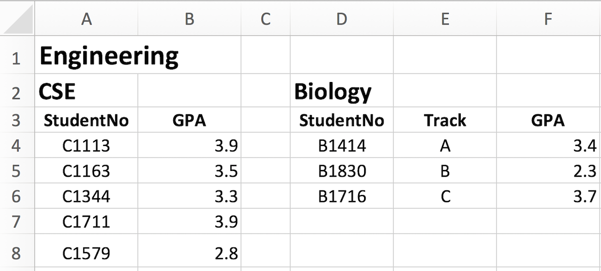
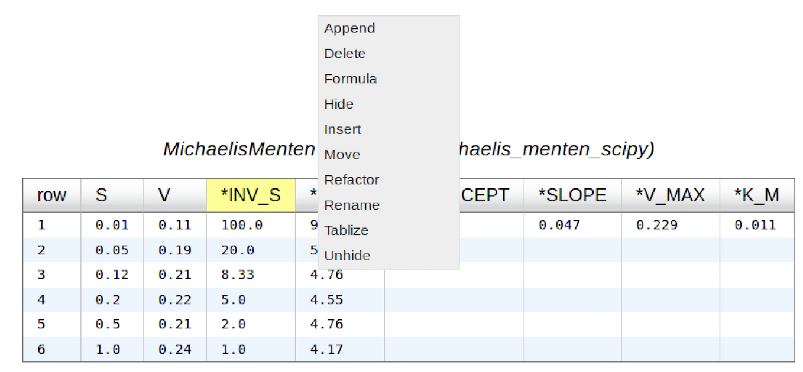
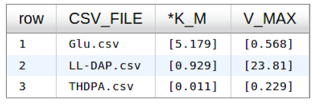
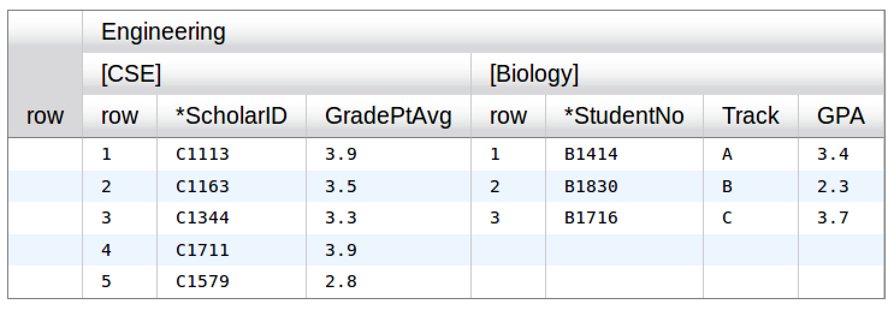
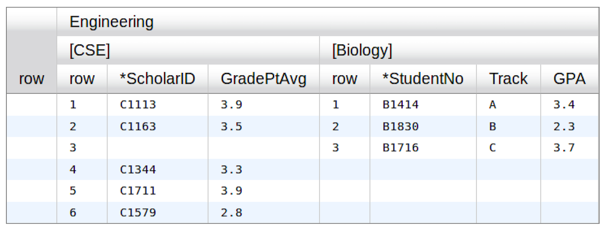
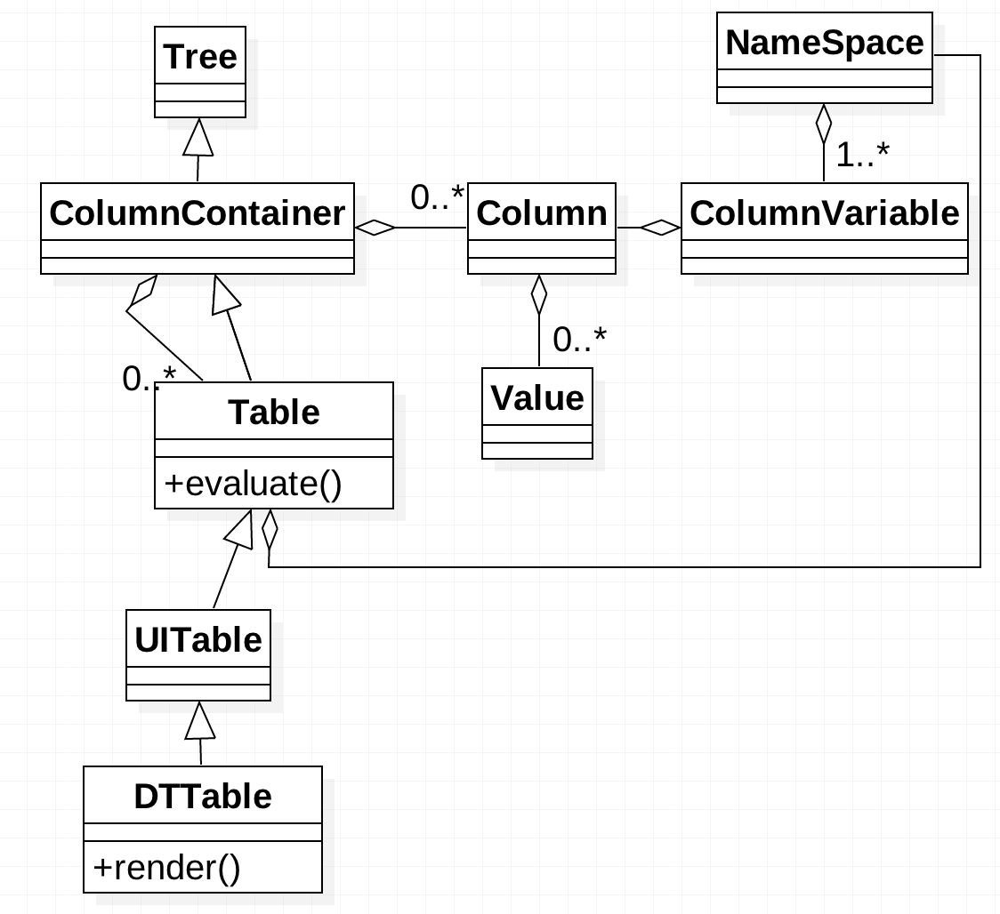

:author: Alicia Clark
:email: clarka34@uw.edu
:institution: Department of Mechanical Engineering, University of Washington

:author: Joseph L. Hellerstein
:email: joseph.hellerstein@gmail.com
:institution: eScience Institute and School of Computer Science, University of Washington. This work was made possible by the Moore/Sloan Data Science Environments Project at the University of Washington supported by grants from the Gordon and Betty Moore Foundation (Award #3835) and the Alfred P. Sloan Foundation (Award #2013-10-29).
:corresponding:

---------------------------------------------------------------------------------
SciSheets: Providing the Power of Programming With The Simplicity of Spreadsheets
---------------------------------------------------------------------------------

.. class:: abstract

Digital spreadsheets are arguably the most pervasive environment for
end user programming on the planet.
Although spreadsheets simplify many calculations, they fail
to address requirements for expressivity, reuse, complex data, and performance.
SciSheets (from "scientific spreadsheets") is an open source project that provides
novel features to address these requirements: (1) 
formulas can be arbitrary Python scripts as well as expressions (*formula scripts*),
which addresses
expressivity by allowing
calculations to be written as algorithms;
(2) spreadsheets
can be exported as functions in a Python module
(*function export*), which
addresses reuse since
exported codes
can be reused in formulas and/or by
external programs and improves performance
since calculations can execute in a
low overhead environment;
and
(3) tables can have columns that are themselves tables
(*subtables*), which addresses
complex data
such as representing hierarchically structured
data and n-to-m relationships.
Our future directions include
refinements to subtables, github integration,
and plotting.
At present, SciSheets can do robust demos, but it is
not yet beta code.

.. class:: keywords

   software engineering

1. Introduction
---------------

Digital spreadsheets are the "killer app" that ushered in the PC revolution.
This is largely because spreadsheets provide a conceptually simple way to do calculations that
(a) closely associates data with the calculations that produce the data and
(b) avoids the mental burdens of programming
such as
control flow, data dependencies, and data structures.
Over 800M professionals author spreadsheet formulas as part of their work
[MODE2017],
which is over 50 times the number
of software developers world wide [THIB2013].

We categorize
spreadsheet users as follows:

- **Novices** want to evaluate equations, but they do not have the prior
  programming experience necessary to create reusable functions and longer scripts.
  Spreadsheet formulas work well for Novices since: (a) they can
  ignore data dependencies;
  (b) they can avoid flow control by using
  "copy" and "paste" for iteration;
  and (c) data structures are "visual" (e.g., rectangular blocks).
- **Scripters** feel comfortable with expressing calculations algorithmically using ``for`` and ``if``
  statements; and they can use simple data structures such as lists and
  ``pandas DataFrames``.
  However, Scripters rarely encapsulate code into functions,
  preferring "copy" and "paste" to get reuse.
- **Programmers** know about sophisticated data structures, modularization, reuse, and testing.

Our experience is primarily with technical users such as scientists.
Most commonly, we encounter Novices and Scripters with limited prior programming
experience. We do not expect these groups of users to take advantage of
spreadsheet macro capabilities (e.g.,  Visual Basic for Microsoft Excel or
AppScript in Google Sheets); we anticipate this functionality to be taken advantage
of only by Programmers.

Based on this experience, we find
existing spreadsheets lack several key requirements.
First, they lack
the **expressivity requirement** in that (a)
they only permit a limited set of functions to be used
in formulas (e.g., so that static dependency
checking can be done); and (b)
they only support formulas that are expressions,
not scripts.
In particular, the latter means that Scripters
cannot express calculations as algorithms, and
Novices
cannot write linear workflows to
articulate a computational recipe.
A second consideration is the
**reuse requirement**.
Today,
it is impossible to reuse spreadsheet
formulas in other spreadsheet formulas or in software systems.
Third, current spreadsheet systems cannot handle the
**complex data requirement**, such as
manipulating data that are
hierarchically structured or data that have n-to-m relationships.
Finally, existing spreadsheets cannot address the
**performance requirement** in that
spreadsheets scale poorly with
the size of data and the number of formulas.

Academic computer science has recognized the growing importance
of end-user programming (EUP) [BURN2009].
Even so,
there is little
academic literature on spreadsheets,
arguably the most pervasive EUP environment on the planet.
[MCLU2006] discusses object oriented spreadsheets that
introduce a sophisticated object model, but the complexity of
this proposal is unlikely to appeal to Novices.
[JONE2003] describes a way that users can implement functions
within a spreadsheet to get reuse.
However, the approach imposes a significant burden on the user,
and does not address reuse of
formulas outside the spreadsheet environment.
Industry has had significant
interest in innovating spreadsheets.
Google Fusion Tables [GONZ2010]
and the "Tables" feature of Microsoft Excel [MICROSOF]
use column formulas to avoid a common source of error,
copying formulas as rows are added/deleted from a table.
The Pyspread [PYSPREAD] project uses Python as the formula language,
but Pyspread formulas cannot be Python scripts.
A more radical approach is taken by
Stencila [STENCILA],
a document system that provides ways to execute code that
updates tables (an approach that is in the same
spirit as Jupyter Notebooks
[PERE2015]).
Stencila supports a variety of languages including
JavaScript, Python, and SQL.
However, Stencila lacks features that spreadsheet users expect:
(a) closely associating data with the calculations that produce the data
and (b) avoiding considerations of data dependencies in calculations.

This paper introduces SciSheets [SCISHEETS],
a new spreadsheet system with the
objective of providing
the power of programming with the simplicity of spreadsheets.
The name SciSheets is a contraction of the phrase "Scientific Spreadsheet", a nod to the users
who motivated the requirements that we address.
That said,
our target users are more broadly technical professionals
who do complex calculations on structured data.
We use the term **scisheet** to refer to a SciSheets spreadsheet.
We note in passing that our focus for scisheets is on
calculations,
not document processing features such as formatting and drawing figures.

SciSheets addresses the above requirements by introducing
several novel features.

- *Formula Scripts.*
  Scisheet formulas can be arbitrary Python scripts as well as expressions.
  This addresses expressivity by allowing
  calculations to be written as algorithms.
- *Function Export.*
  Scisheets can be exported as functions in a Python module.
  This addresses reuse since
  exported codes
  can be reused in SciSheets formulas and/or by
  external programs.
  Further, performance is improved by the export feature
  since calculations execute
  in a low overhead environment.
- *Subtables.*
  Tables can have columns that are themselves tables (columns within columns).
  This addresses the complex data requirement,
  such as representing hierarhically structured
  data and n-to-m relationships.

The remainder of the paper is organized as follows.
Section 2 describes the requirements that we consider, and
Section 3 details the SciSheets features that address these requirements.
The design of SciSheets is discussed in Section 4, and
Section 5 discusses features planned for SciSheets.
Our conclusions are contained in Section 6.

2. Requirements
---------------

This section presents examples that motivate
the requirements of expressivity, reuse, and complex data.

Our first example is drawn from biochemistry labs
studying enzyme mediated chemical reactions.
Commonly, the Michaelis-Menten [BERG2002] Model of enzyme activity is used in which
there is a single chemical species, called the substrate, that interacts with the enzyme to produce
a new chemical species (the product).
Two properties of enzymes are of much interest: the maximum reaction rate,
denoted by :math:`V_{MAX}`, and the concentration :math:`K_M` of substrate that achieves
a reaction rate equal to half of :math:`V_{MAX}`.

To perform the Michaelis-Menten analysis,
laboratory data are collected for different values of the substrate concentrations
:math:`S` and associated reaction rates :math:`V`.
Then, a calculation is done to obtain the parameters :math:`V_{MAX}` and :math:`K_M`
using the following recipe.

1. Compute :math:`1/S` and :math:`1/V`, the inverses of :math:`S` and :math:`V`.
2. Compute the intercept and slope of the regression of :math:`1/V` on
   :math:`1/S`.
3. Calculate :math:`V_{MAX}` and :math:`K_M` from the intercept and slope.

.. figure:: excel1.png

   Data view for an Excel spreadsheet that calculates Michaelis-Menten Parameters. :label:`fig-excel1`

.. figure:: excel2.png

   Formulas used in Fig. :ref:`fig-excel1`. :label:`fig-excel2`

   Illustrative example of 
   student grade data from two departments in the School of Engineering.
   ``CSE`` and ``Biology`` are 
   separate tables that are grouped together for
   convenience of analysis.
   In existing spreadsheet systems, users cannot
   perform row operations such as insert, delete,
   and/or hide on one subtable without 
   affecting the other subtable.
   :label:`fig-complexdata`

Fig. :ref:`fig-excel1` shows an Excel spreadsheet that implements this recipe
with column names that correspond to the variables in the recipe.
Fig. :ref:`fig-excel2` displays the formulas that
perform these calculations.
Readability can be improved by using column formulas (e.g., as in Fusion Tables).
However, two problems remain.
Novices cannot *explicitly* articulate
the computational recipe; rather, the recipe is implicit in the order of the columns.
Even more serious, there is no way to reuse these formulas in other
formulas (other than error-prone copy-and-paste), and
there is no way
to reuse formulas in an external program.

We consider a second example to illustrate problems with handling
non-trivial data relationships in spreadsheets.
Fig. :ref:`fig-complexdata` displays data that a university
might have for students in two departments in the School of Engineering,
Computer Science & Engineering (CSE) and Biology.
The data are organized into two tables
(``CSE`` and ``Biology``) grouped under
``Engineering``, with separate columns for student identifiers
and grades.
These tables
are adjacent to each other to facilitate comparisons between
students.
However, the tables are independent of each other
in that we should be able to insert, delete, and hide rows
in one table without affecting
the other table.
Unfortunately, existing spreadsheet systems do not handle this well;
inserting, deleting, or hiding
a row in one table affects every table that overlaps that row in the spreadsheet.
Note that arranging the tables vertically does not help since the problem
becomes inserting, deleting, and hiding columns.
We could arrange the tables in a diagonal, but
this makes it difficult to make visual comparisons between
tables.

3. Features
-----------

This section describes SciSheets features that address the requirements of expressivity, reuse, complex data,
and performance.
We begin with a discussion of the SciSheets
user interface in Section 3.1.
Then, Sections 3.2, 3.3, and 3.4 in turn present:
formula scripts (which addresses expressivity),
function export (which addresses reuse and performance),
and subtables (which addresses complex data).

3.1 User Interface
~~~~~~~~~~~~~~~~~~

   Column popup menu in a scisheet for the Michaelis-Menten calculation. :label:`fig-columnpopup`

Fig. :ref:`fig-columnpopup` displays a scisheet that performs the Michaelis-Menten calculations
as we did in Fig. :ref:`fig-excel1`.
Note that columns containing a formula have a name annotated with an ``*``.

A scisheet
has the familiar tabular structure of a spreadsheet.
However, unlike existing spreadsheets, SciSheets knows about the
**elements of a scisheet**:
tables, columns, rows, and cells.
Column names are Python variables that can be referenced in formulas.
These **column variables**
are ``numpy Arrays``. 
This means that formulas can be written using column names
to express vector calculation
using a rich set of operators that properly handle
missing data (e.g., using ``NaN`` values).

SciSheets users interact directly with 
scisheet elements instead of primarily with a menu, as is done in 
existing spreadsheet systems.
A left click on a scisheet element results in a popup menu.
For example,
in Fig. :ref:`fig-columnpopup` we see the column popup for ``INV_S``.
Users select an item from the popup, and this may in turn present additional menus.
The popup menus for row, column, and table have common items for insert, delete, hide/unhide.
Columns additionally have a formula item.
The scisheet popup has items for saving and renaming the scisheet as well as undoing/redoing operations
on the scisheet.
The cell popup is an editor for the value in the cell.

.. figure:: SimpleFormula.png
   :scale: 50 %

   Formula for computing the inverse of the input value S. :label:`fig-simpleformula`

Fig. :ref:`fig-simpleformula` displays the results of selecting the ``formula`` item
from the popup menu in Fig. :ref:`fig-columnpopup` for the column ``INV_S``.
A simple line editor is displayed.
The formula is an expression that references the column ``S``.

3.2 Formula Scripts and Formula Evaluation
~~~~~~~~~~~~~~~~~~~~~~~~~~~~~~~~~~~~~~~~~~

.. figure:: ComplexFormula.png

   Formula for the complete calculation of :math:`V_{MAX}` and
   :math:`K_M`.
   The formula is a simple script, allowing a Novice to see
   exactly how the data in the scisheet are produced.
   :label:`fig-complexformula`

SciSheets allows formulas to be scripts with arbitrary Python statements.
For example, Fig. :ref:`fig-complexformula` displays a script that contains
the entire computational recipe for the Michaelis-Menten calculation
described in Section 2.
This capability greatly increases the ability of spreadsheet users
to describe and document their calculations.

The formula scripts feature has a significant implication
on how formulas are evaluated.
Since a formula may contain arbitrary Python codes including
``eval`` expressions, we cannot use static dependency analysis
to determine data dependencies.
Thus, formula evaluation is done iteratively.
But how many times must this iteration be done?

Consider an evaluation of *N* formula columns assuming that
there are no
circular references or other anomalies in the formulas.
Then, at most *N* iterations are needed for convergence since on each iteration
at least one column variable is assigned its final value.
If after *N* iterations, there is an exception, (e.g., a column variable
does not have a value assigned), this is reported to the user since there is
likely an error in the formulas.
Otherwise, the scisheet is updated with the new values of the
column variables.
Actually, we can do better than this since
if the values of column variables converge after loop iteration
*M < N* (and there is no exception), then
formula evaluation stops.
We refer to the above workflow as the **formula evaluation loop**.

SciSheets augments the formula evaluation loop by providing users with the opportunity
to specify two additional formulas.
The **prologue formula** is executed once at the beginning of formula evaluation;
the **epilogue formula** is executed once at the end of formula evaluation.
These formulas provide a way to do high overhead operations in a one-shot manner,
a feature
that assists the performance requirement.
For example, a user may have a prologue formula that
reads a file (e.g., to initialize input values in a table) at the beginning
of the calculation, and an epilogue formula
that writes results at the end of the calculation.
Prologue and epilogue formulas are modified through the scisheet popup menu.

3.3. Function Export
~~~~~~~~~~~~~~~~~~~~

.. figure:: FunctionExport.png

   Menu to export a scisheet as a
   function in a Python module. 
   :label:`fig-export`

A scisheet can be exported as
a function in a Python module.
This feature addresses the reuse requirement since
exported codes can be used in scisheet formulas
and/or external programs.
The export feature also addresses the performance requirement
since executing standalone code eliminates
many overheads.

Fig. :ref:`fig-export` displays the scisheet popup menu for
function export.
The user sees a menu with entries for the function name,
inputs (a list of column names),
and outputs (a list of column names).

Function export produces two files.
The first is the Python module containing the exported function.
The second is a Python file containing a test for the exported function.

We begin with the first file.
The code in this file is structured into several sections:

- Function definition and setup
- Formula evaluation
- Function close

The function definition and setup contain the function definition,
imports, and the scisheet prologue formula.
Note that the prologue formula is a convenient
place to import Python packages.

.. code-block:: Python

   # Function definition
   def michaelis(S, V):
     from scisheets.core import api as api
     s = api.APIPlugin('michaelis.scish')
     s.initialize()
     _table = s.getTable()
     # Prologue
     s.controller.startBlock('Prologue')
     # Begin Prologue
     import math as mt
     import numpy as np
     from os import listdir
     from os.path import isfile, join
     import pandas as pd
     import scipy as sp
     from numpy import nan  # Must follow sympy import
     # End Prologue
     s.controller.endBlock()

In the above code, the imported package ``scisheets.core.api``
contains the SciSheets runtime.
The object ``s`` is constructed
using a serialization of the scisheet
that is written
at the time of function export.
scisheets are
serialized in a JSON format
to a file that has the
extension ``.scish``.

We see that prologue formulas can be lengthy scripts.
For example,
one
scisheet developed with a plant biologist has
a prologue formula with over fifty statements.
As such,
it is essential that
syntax and execution errors are localized 
to a line within the script.
We refer to this as the **script debuggability requirement**.
SciSheets handles this requirement by using the paired statements
``s.controller.startBlock('Prologue')``
and
``s.controller.endBlock()``.
These statements "bracket" the script so that if an
exception occurs, SciSheets can
compute the line number within the script for that exception.

Next, we consider the formula evaluation loop.
Below is the code that is generated for the beginning of the
loop and the evaluation of the formula for ``INV_S``.

.. code-block:: Python

     s.controller.initializeLoop()
     while not s.controller.isTerminateLoop():
       s.controller.startAnIteration()
       # Formula evaluation blocks
       try:
         # Column INV_S
         s.controller.startBlock('INV_S')
         INV_S = 1/S
         s.controller.endBlock()
         INV_S = s.coerceValues('INV_S', INV_S)
       except Exception as exc:
         s.controller.exceptionForBlock(exc)

``s.controller.initializeLoop()`` snapshots column variables.
``s.controller.isTerminateLoop()`` counts loop iterations, looks
for convergence of column variables, and checks to see if the last
loop iteration has an exception.
Each formula column has a pair of  ``try`` and ``except`` statements that
execute the formula
and record exceptions.
Note that loop execution continues even if there is an exception
for one or more formula columns. 
This is done to handle situations in which formula columns are *not*
ordered according to their data dependencies.

Last, there is the function close.
The occurrence of an exception in the formula evaluation loop causes an exception
with the line number in the formula in which the (last) exception occurred.
If there is no exception, then the epilogue formula is executed, and
the output values of the function are returned (assuming there is no exception
in the epilogue formula).

.. raw:: LaTeX

     \newpage

.. code-block:: Python

     if s.controller.getException() is not None:
       raise Exception(s.controller.formatError(
           is_absolute_linenumber=True))
     s.controller.startBlock('Epilogue')
     # Epilogue (empty)
     s.controller.endBlock()
     return V_MAX,K_M

The second file produced by SciSheets function export contains test code.
Test code makes use of ``unittest`` with a ``setUp``
method that assigns ``self.s`` the value of a SciSheets runtime object.

.. code-block:: Python

     def testBasics(self):
       S = self.s.getColumnValue('S')
       V = self.s.getColumnValue('V')
       V_MAX,K_M = michaelis(S,V)
       self.assertTrue(
           self.s.compareToColumnValues('V_MAX', V_MAX))
       self.assertTrue(
           self.s.compareToColumnValues('K_M', K_M))

The above test compares the results of running the
exported function ``michaelis`` on the input columns
``S`` and ``V``
with the
values of output columns ``V_MAX`` and ``K_M``.

   A scisheet that processes many CSV files. :label:`fig-processfiles`

.. figure:: ProcessFilesScript.png

   Column formula for ``K_M`` in
   Fig. :ref:`fig-processfiles` that is a script to process a
   list of CSV files.
   :label:`fig-processfilesscript`

The combination of the features
function export and formula scripts is extremely powerful.
To see this, consider
a common pain point with spreadsheets - doing the same computation for different
data sets.
For example, the Michaelis-Menten calculation in Fig. :ref:`fig-excel1`  needs to be
done for data collected from many experiments
that are stored in several comma separated variable (CSV) files.
Fig. :ref:`fig-processfiles` displays a scisheet
that does the Michaelis-Menten calculation for the list of CSV files
in the column ``CSV_FILE``.
(This list is computed by the prologue formula based on the contents
of the current directory.)
Fig. :ref:`fig-processfilesscript` displays a script that reuses
the ``michaelis`` function exported previously to compute values
for ``K_M`` and ``V_MAX``.
Thus,
whenever new CSV files are available,
``K_M`` and ``V_MAX`` are calculated without changing the scisheet in
Fig. :ref:`fig-processfiles`.

3.4. Subtables
~~~~~~~~~~~~~~

Subtables provide a way for SciSheets to deal with complex data
by having 
tables nested within tables.

   The table ``Engineering`` has two subtables
   ``CSE`` and ``Biology``.
   The subtables are independent of one another, which is
   indicated by the square brackets around their names
   and the presence of separate ``row`` columns.
   :label:`fig-subtables`

We illustrate this by revisiting the example
in Fig. :ref:`fig-complexdata`.
Fig. :ref:`fig-subtables` displays a scisheet for these data
in which
``CSE`` and ``Biology`` are independent subtables
(indicated by the square brackets around the names of the subtables).
Note that there is
a column named ``row`` for each subtable since the rows
of ``CSE`` are independent of the rows of ``Biology``.

.. figure:: PopupForHierarchicalRowInsert.png

   Menu to insert a row in one subtable.
   The menu is accessed by left-clicking on the "3" cell
   in the column labelled "row" in the CSE subtable.
   :label:`fig-subtable-insert`

   Result of inserting a row in the ``CSE`` subtable.
   Note that the ``Biology`` substable is unchanged.
   :label:`fig-subtable-after`

Recall that in Section 2
we could not insert a row into ``CSE``
without also inserting a row into ``Biology``.
SciSheets addresses this requirement by providing a separate row popup
for each subtable.
This is shown in
Fig. :ref:`fig-subtable-insert` where there is a popup
for row 3 of ``CSE``.
The result of selecting ``insert`` is displayed in
Fig. :ref:`fig-subtable-after`.
Note that the ``Biology`` subtable is not modified
when there is an insert into ``CSE``.

4. Design
---------

SciSheets uses a client-server design.
The client runs in the browser using HTML and JavaScript;
the server runs Python using the Django framework [DJANGOPR].
This design provides a
zero install deployment, and
leverages the rapid pace of innovation in browser technologies.

Our strategy has been to limit the scope of the client code
to presentation and handling end-user interactions.
When the client requires data from the server
to perform end-user interactions
(e.g., populate a list of saved scisheets),
the client uses AJAX calls.
The client also makes use of several JavaScript packages
including JQuery [JQUERYPR], YUI DataTable [YUIDATAT], and 
JQueryLinedText [JQUERYLI].

   SciSheets core classes. 
   :label:`fig-coreclasses`

The SciSheets server handles the details of user requests, which also
requires maintaining the data associated with scisheets.
Fig :ref:`fig-coreclasses` displays the core
classes used in the SciSheets server.
Core classes have several required methods.
For example, the ``copy`` method
makes a copy of the object for which it is
invoked.
To do this, the object calls the ``copy`` method of its parent
class as well, and this is done recursively.
Further, the object must call the ``copy`` method for core
objects that are in its instance variables,
such as
``ColumnContainer`` which has the instance variable
``columns`` that contains a list of ``Column`` objects.
Other examples of required methods are
``isEquivalent``, which tests if two objects have the same
values of instance variables, and
``deserialize``, which creates objects based on data serialized
in a JSON structure.

Next, we describe
the classes in
Fig. :ref:`fig-coreclasses`.
``Tree`` implements a tree that is used to express
hierarchical
relationships such as between ``Table`` and ``Column`` objects.
``Tree`` also provides a mapping between the name of the
scisheet element
and the object associated with the name
(e.g., to handle user requests).
``ColumnContainer`` manages a collections of ``Table`` and ``Column`` objects.
``Column`` is a container of data values.
``Table`` knows about rows, and it
does formula evaluation using ``evaluate()``.
``UITable`` handles user requests (e.g., renaming a column and
inserting a row) in a way that is independent of the client implementation.
``DTTable`` provides client specific services, such as rendering tables into HTML using ``render()``.

The classes ``NameSpace`` (a Python namespace) and ``ColumnVariable``
are at the center of formula evaluation.
The ``evaluate()`` method in ``Table`` generates Python code that
is executed in a Python namespace.
The SciSheets runtime creates an instance of ``ColumnVariable`` for each
``Column`` in the scisheet being evaluated.
``ColumnVariable`` puts the name of its corresponding ``Column`` into the
namespace, and assigns
to this name a ``numpy Array`` that is populated with
the values of the ``Column``.

Last, we consider performance.
There are two common
causes of poor performance
in the current implementation of SciSheets.
The first relates to data size.
At present,
SciSheets embeds data with the
HTML document that is rendered by the browser.
We will address this
by downloading data on demand and caching data locally.

The second cause of poor performance is having
many iterations of the formula evaluation loop.
If there is more than one formula column, then the best case is to
evaluate each formula column twice.
The first execution produces the desired result
(e.g.,
if the formula columns are in order of their data
dependencies);
the second execution confirms that the result has
converged.
Some efficiencies can be gained by using the prologue and
epilogue features for one-shot
execution of high overhead operations (e.g., file I/O).
In addition, we are exploring the extent to which SciSheets
can automatically detect if static dependency checking
can be used so that formula evaluation is done
only once.

Clearly, performance can be improved by reducing the number
of formula columns since this reduces the maximum number
of iterations of the formulation evaluation loop.
SciSheets supports this strategy by permitting
formulas to be scripts.
This is a reasonable strategy for a Scripter, but
it may work poorly for a Novice who is unaware
of data dependencies.

5. Future Work
--------------

This section describes several features that are
under development.

5.1 Subtable Name Scoping
~~~~~~~~~~~~~~~~~~~~~~~~~

This feature addresses the reuse requirement.
Today, spreadsheet users typically employ copy-and-paste to reuse formulas.
This approach has many drawbacks.
First, it is error prone since there are often mistakes as to what is copied
and where it is pasted.
Second, fixing bugs in formulas requires repeating the 
same error prone copy-and-paste.

It turns out that a modest change to the subtable feature can provide
a robust approach to
reuse through copy-and-paste.
This change is to have a subtable define a name scope.
This means that
the same column name can be present in two different subtables
since these names are in different scopes.

We illustrate
the benefits of subtable name scoping. 
Consider Fig. :ref:`fig-subtables` with the subtables
``CSE`` and ``Biology``.
Suppose that the column ``GradePtAvg``
in ``CSE`` is renamed to ``GPA`` so that
both ``CSE`` and ``Biology``
have a column named ``GPA``.
Now, consider adding the
column ``TypicalGPA`` to both subtables;
this column will have a formula that computes the
mean value of ``GPA``.
The approach would be as follows:

1. Add the column ``TypicalGPA`` to ``CSE``.
2. Create the formula
   ``np.mean(GPA)`` in
   ``TypicalGPA``.
   This formula will compute the mean of the values
   of the ``GPA`` column in the ``CSE`` subtable (because
   of subtable name scoping).
3. Copy the column ``TypicalGPA`` to subtable ``Biology``.
   Because of subtable name scoping, the formula
   ``np.mean(GPA)`` will reference the column ``GPA`` in
   ``Biology``, and so compute the mean of the values
   of ``GPA`` in the ``Biology`` subtable.

Now suppose that we want to change the calculation of
``TypicalGPA`` to be the median instead of the mean.
This is handled as follows:

1. The user edits the formula for the column ``TypicalGPA`` in
   subtable ``CSE``,
   changing the formula to
   ``np.median(GPA)``.
2. SciSheets responds by asking if the user wants the
   copies of this formula
   to be updated as well.
3. The user answers "yes", and the formula is changed for
   ``TypicalGPA`` in subtable ``Biology``.

Note that we would have the same result in the above procedure
if the user had in step (1) modified the ``Biology`` subtable.

5.2 Github Integration
~~~~~~~~~~~~~~~~~~~~~~

A common problem with spreadsheets is that calculations are difficult to reproduce
because some steps are manual (e.g., menu interactions). Additionally, it can be
difficult to reproduce a spreadsheet due to the presence of errors.
We refer to this as the **reproducibility requirement**.
Version control is an integral part of reproducibility.
Today, a spreadsheet file as a whole can be version controlled,
but this granularity is too course.
More detailed version control can be done manually.
However, this is error prone, especially
in a collaborative environment.
One automated approach is a revision history, such as
Google Sheets.
However, this technique fails to record the sequence in which changes were made, by whom,
and for what reason.

The method of serialization used in SciSheets lends itself well
to ``github`` integration.
Scisheets are serialized as JSON files with separate lines used for data, formulas,
and structural relationships between columns, tables, and the scisheet.
Although the structural relationships have a complex representation, it
does seem that SciSheets can be integrated with the line oriented version
control of ``github``.

We are in the process of designing an integration of SciSheets with
``github`` that is natural for Novices and Scripters.
The scope includes the following use cases:

- **Branching.**
  Users should be able to create branches to explore new calculations and
  features in a scisheet. Fig. :ref:`fig-branch` shows how a scisheet can be split
  into two branches.
  As with branching for software teams, branching with a spreadsheet
  will allow collaborators to work on their part of the project without
  affecting the work of others.

  .. figure:: spreadsheet_branch.png

     Mockup showing how a scisheet can be split into two branches
     (e.g., for testing and/or feature exploration).
     :label:`fig-branch`

- **Merging.**
  Users will be able to utilize the existing ``github`` strategies for merging
  documents. 
  In addition,
  we intend to develop
  a visual way for users to detect and resolve merge conflicts.
  Fig. :ref:`fig-merge` illustrates how two scisheets can be merged.
  Our thinking is that name conflicts will be handled in a manner similar
  to that used in ``pandas`` with ``join`` operations.
  Our implementation will likely be similar to the
  ``nbdime`` package developed for merging and differencing Jupyter notebooks [NBDIME].

  .. figure:: spreadsheet_merge.png

     Mockup displaying two scisheets can be merged 
     (assuming no merge conflicts).
     :label:`fig-merge`

- **Differencing.**
  Users will be able to review the history of ``git commit`` operations.
  Fig. :ref:`fig-diff` displays a mockup of a visualization of the history of
  a scisheet. The user will be able to select any point in history
  (similar to ``git checkout``). This functionality will allow
  collaborators to gain a greater understanding of changes made.

  .. figure:: spreadsheet_history.png

     Mockup visualization of the change history of a scisheet. 
     The versions in green show
     when columns have been added; 
     the versions in red show when columns
     have been removed.
     :label:`fig-diff`

5.3 Plotting
~~~~~~~~~~~~

At present, SciSheets does not support plotting.
However, there is clearly a **plotting requirement** for
any reasonable spreadsheet system.
Our approach to plotting will most likely be to leverage
the ``bokeh`` package [BOKEHPRO] since it provides a convenient way
to generate HTML and JavaScript for plots that can be embedded
into HTML documents.
Our vision is to make ``plot`` a function that can be used
in a formula.
A *plot* column will have its cells rendered as HTML.

6. Conclusions
--------------

.. table:: Summary of requirements
           and SciSheets features that address these requirements.
           Features in italics are planned but not yet implemented.
           :label:`fig-benefits`

   +---------------------------+--------------------------------+
   |      Requirement          |    SciSheets Feature           |
   +===========================+================================+
   | - Expressivity            | - Python formulas              |
   |                           | - Formula scripts              |
   +---------------------------+--------------------------------+
   | - Reuse                   | - Function export              |
   |                           | - *Subtable name scoping*      |
   +---------------------------+--------------------------------+
   | - Complex Data            | - Subtables                    |
   +---------------------------+--------------------------------+
   | - Performance             | - Function export              |
   |                           | - Prologue, Epilogue           |
   |                           | - *Load data on demand*        |
   |                           | - *Conditional static*         |
   |                           |   *dependency checking*        |
   +---------------------------+--------------------------------+
   | - Plotting                | - *Embed bokeh components*     |
   +---------------------------+--------------------------------+
   | - Script Debuggability    | - Localized exceptions         |
   +---------------------------+--------------------------------+
   | - Reproducibility         | - ``github`` *integration*     |
   +---------------------------+--------------------------------+

SciSheets is
a new spreadsheet system with the
guiding principle of providing
the power of programming with the simplicity of spreadsheets.
Our target users are technical professionals
who do complex calculations on structured data.

SciSheets addresses several requirements that are
not handled
in existing spreadsheet systems,
especially the requirements of expressivity, reuse, complex data, and performance.
SciSheets addresses these requirements by introducing
several novel features.

- *Formula Scripts.*
  Scisheet formulas can be Python scripts, not just expressions.
  This addresses expressivity by allowing
  calculations to be written as algorithms.
- *Function Export.*
  Scisheets can be exported as functions in a Python module.
  This addresses reuse since
  exported codes 
  can be reused in SciSheets formulas and/or by
  external programs.
  Further, performance is improved by the export feature
  since calculations execute
  in a low overhead environment.
- *Subtables.*
  Tables can have columns that are themselves tables (columns within columns).
  This addresses the complex data requirement,
  such as representing n-to-m relationships.

Table :ref:`fig-benefits` displays
a comprehensive list of the requirements we plan to address
and the corresponding SciSheets features.

One goal for SciSheets is to make users more productive with their existing
workflows for developing and evaluating formulas.
However, we also hope that SciSheets becomes a vehicle for elevating the skills
of users, making Novices into Scripters and Scripters into Programmers.

At present, SciSheets is
capable of doing robust demos.
Some work remains to create a beta.
We are exploring possible deployment vehicles.
For example,
rather than having SciSheets be a standalone tool, another possibility is
integration with Jupyter notebooks.

References
----------
.. [BERG2002] Berg, Jermey et al. *Biochemistry*,
              W H Freeman, 2002.
.. [BOKEHPRO] Bokeh Project. http://bokeh.pydata.org/.
.. [BURN2009] Burnett, M. *What is end-user software engineering and why does
              it matter?*, Lecture Notes in Computer Science, 2009
.. [DJANGOPR] Django Project. http://www.djangoproject.com.
.. [GONZ2010]  *Google Fusion Tables: Web-Centered Data Management
              and Collaboration*, Hector Gonzalez et al., SIGMOD, 2010.
.. [JONE2003] Jones, S., Blackwell, A., and Burnett, M. i
              *A user-centred approach to functions in excel*,
              SIGPLAN Notices, 2003.
.. [JQUERYLI] JQueryLinedText. https://github.com/aw20/JQueryLinedText.
.. [JQUERYPR] JQuery Package. https://jquery.com/.
.. [MCCU2006] McCutchen, M., Itzhaky, S., and Jackson, D. *Object spreadsheets:
              a new computational model for end-user development of data-centric web applications*,
              Proceedings of the 2016 ACM International Symposium on New Ideas, New Paradigms,
              and Reflections on Programming and Software, 2006.
.. [MICROSOF] Microsoft Corporation. *Overview of Excel tables*,
              https://support.office.com/en-us/article/Overview-of-Excel-tables-7ab0bb7d-3a9e-4b56-a3c9-6c94334e492c.
.. [MODE2017] *MODELOFF - Financial Modeling World Championships*,
              http://www.modeloff.com/the-legend/.
.. [NBDIME]   *nbdime*, https://github.com/jupyter/nbdime.
.. [PERE2015] Perez, Fernando and Branger, Brian.
              *Project Jupyter: Computational Narratives as the
              Engine of Collaborative Data Science*, http://archive.iPython.org/JupyterGrantNarrative-2015.pdf.
.. [PYSPREAD] Manns, M. *PYSPREAD*, http://github.com/manns/pyspread.
.. [SCISHEET] *SciSheets*, https://github.com/ScienceStacks/SciSheets.
.. [STENCILA] *Stencila*, https://stenci.la/.
.. [THIB2013] Thibodeau, Patrick.
              *India to overtake U.S. on number of developers by 2017*,
              COMPUTERWORLD, Jul 10, 2013.
.. [YUIDATAT] Yahoo User Interface DataTable. https://yuilibrary.com/yui/docs/datatable/.
