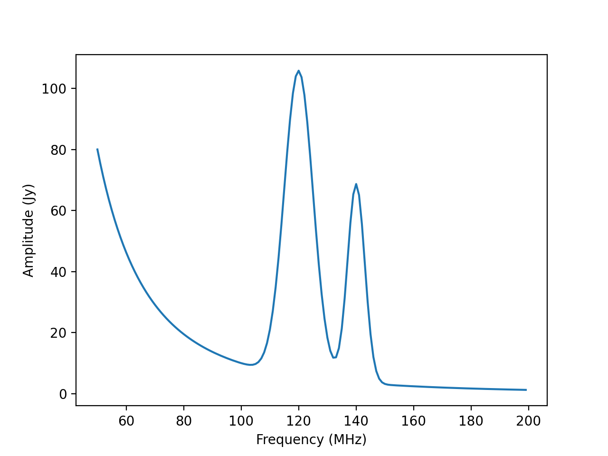
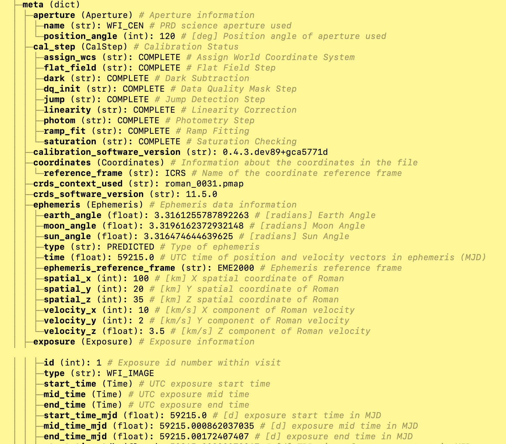

:author: Perry Greenfield
:email: perry@stsci.edu
:institution: Space Telescope Science Institute
:corresponding:

:author: Edward Slavich
:email: edward.j.slavich@gmail.com
:institution: Space Telescope Science Insitute
:equal-contributor:

:author: William Jamieson
:email: wjamieson@stsci.edu
:institution: Space Telescope Science Institute
:equal-contributor:

:author: Nadia Dencheva
:email: dencheva@stsci.edu
:institution: Space Telescope Science Institute
:equal-contributor:

-----------------------------------------------------
The Advanced Scientific Data Format (ASDF): An Update
-----------------------------------------------------

.. class:: abstract

 We report on progress in developing and extending the new (ASDF) format
 we have developed for the data from the James Webb and Nancy Grace Roman
 Space Telescopes since we reported on it at a previous Scipy. While the
 format was developed as a replacement for the long-standard FITS format
 used in astronomy, it is quite generic and not restricted to use with
 astronomical data. We will briefly review the format, and extensions and
 changes made to the standard itself, as well as to the reference Python
 implementation we
 have developed to support it. The standard itself has been clarified in
 a number of respects.
 Recent improvements to the Python implementation include an improved
 framework for conversion between complex Python objects and ASDF,
 better control of the configuration of
 extensions supported and versioning of extensions, tools for display and
 searching of the structured metadata, better developer documentation, tutorials,
 and a more maintainable and flexible schema system. This has
 included a reorganization of the components to make the standard free
 from astronomical assumptions. A important motivator for the format was
 the ability to support serializing functional transforms in multiple dimensions as well as expressions built out of such transforms, which
 has now been implemented. More generalized compression schemes are now
 enabled. We are currently working on adding chunking support and will
 discuss our plan for further enhancements.

.. class:: keywords

   data formats, standards, world coordinate systems, yaml

Introduction
------------

The Advanced Scientific Data Format (ASDF) was originally developed in 2015.
That original version was described in a paper [Gre15]_. That paper
described the shortcomings of the widely used astronomical standard format
FITS [FIT16]_ as well as those of existing potential alternatives. It is not
the goal of this paper to rehash those points in detail, though it is 
useful to summarize the basic points here. The remainder of this paper
will describe where we are using ASDF,  what lessons we have learned
from using ASDF for the
James Webb Space Telescope, and summarize the most important changes
we have made to the standard, the Python library that we use to read 
and write ASDF files, and best practices for using the format.

We will give an example of a more advanced use case that illustrates some
of the powerful advantages of ASDF, and that its application is not
limited to astronomy, but suitable for much of scientific and engineering
data, as well as models. We finish by outlining our near term plans for
further improvements and extensions.

Summary of Motivations
......................

- Suitable as an archival format:
   - Old versions continue to be supported by libraries.
   - Format is sufficiently transparent (e.g., not requiring extensive
     documentation to decode) for the fundamental set of capabilities.
   - Metadata is easily viewed with any text editor.
- Intrinsically hierarchical
- Avoids duplication of shared items
- Based on existing standard(s) for metadata and structure
- No tight constraints on attribute lengths or their values.
- Clearly versioned
- Supports schemas for validating files for basic structure and value
  requirements
- Easily extensible, both for the standard, and for local or 
  domain-specific conventions.

Basics of ASDF Format
.....................

- Format consists of a YAML header optionally followed by one or more binary
  blocks for containing binary data.
- The YAML [http://yaml.org] header contains all the metadata and defines
  the structural
  relationship of all the data elements.
- YAML tags are used to indicate to libraries the semantics of subsections
  of the YAML header that libraries can use to construct special software objects. For example, a tag for a data array would indicate to a Python 
  library to convert it into a numpy array.
- YAML anchors and alias are used to share common elements to avoid
  duplication.
- JSON Schema [http://json-schema.org/specification.html],
  [http://json-schema.org/understanding-json-schema/] is used 
  for schemas to define expectations for tag content and
  whole headers combined with tools to validate actual ASDF files against
  these schemas.
- Binary blocks are referenced in the YAML to link binary data to YAML
  attributes.
- Support for arrays embedded in YAML or in a binary block.
- Streaming support for a single binary block.
- Permit local definitions of tags and schemas outside of the standard.
- While developed for astronomy, useful for general scientific or engineering
  use.
- Aims to be language neutral.

Current and planned uses
------------------------

James Webb Space Telescope (JWST)
.................................

NASA requires JWST data products be made available in the FITS
format. Nevertheless, all the calibration pipelines operate on the data
using an internal objects very close to the
the ASDF representation.
The JWST calibration pipeline uses ASDF to serialize data that cannot
be easily represented in FITS, such as World Coordinate System information.
The calibration software is also capable of reading and producing data products
as pure ASDF files.

Nancy Grace Roman Space Telescope
.................................

This telescope, with the same mirror size as the Hubble Space Telescope (HST),
but a much larger field of view than HST, will be launched in 2026 or thereabouts.
It is to be used mostly in survey mode and is capable of producing very large
mosaicked images. It will use ASDF as its primary data format.

Daniel K Inoue Solar Telescope
..............................

This telescope is using ASDF for much of the early data products to hold
the metadata for a combined set of data which can involve many thousands
of files. Furthermore, the World Coordinate System information is stored
using ASDF for all the referenced data.

Vera Rubin Telescope (for World Coordinate System interchange)
..............................................................

|
There have been users outside of astronomy using ASDF, as well as contributors
to the source code.

Changes to the standard (completed and proposed)
------------------------------------------------

These are based on lessons learned from usage.

The current version of the standard is 1.5.0 (1.6.0 being developed).

The following items reflect areas where we felt improvements were needed.

Changes for 1.5
...............

Moving the URI authority from ``stsci.edu`` to ``asdf-format.org``
..................................................................

This is to remove the standard from close association with STScI
and make it clear that the format is not intended to be controlled
by one institution.

Moving astronomy-specific schemas out of standard 
.................................................

These primarily affect the previous inclusion of World Coordinate Tags,
which are strongly associated with astronomy. Remaining are those 
related to time and unit standards, both of obvious generality, but the
implementation must be based on some standards,
and currently the astropy-based ones are as good or better than any.

Changes for 1.6
...............

Addition of the manifest mechanism
..................................

The manifest is a YAML document that explicitly lists the tags
and other features introduced by an extension to the ASDF standard.  
It provides a more straightforward way of associating tags with 
schemas, allowing 
multiple tags to share the same schema, and generally making it
simpler to visualize how tags and schemas are associated (previously
these associations were implied by the Python implementation but were
not documented elsewhere).

Handling of null values and their interpretation
................................................

The standard didn't previously specify the behavior regarding null values.
The Python library previously removed attributes from the YAML
tree when the corresponding Python attribute has a ``None`` value upon
writing to an ADSF file. On reading files where the attribute was
missing but the schema indicated a default value, the library 
would create the Python attribute with the default. As mentioned
in the next item, we no longer use this mechanism, and now when 
written, the attribute appears in the YAML tree with a null value
if the Python value is ``None`` and the schema permits null values.

Interpretation of default values in schema
..........................................

The use of default values in schemas is discouraged since the 
interpretation by libraries is prone to confusion if the assemblage
of schemas conflict with regard to the default. We have stopped
using defaults in the Python library and recommend that the ASDF
file always be explicit about the value rather than imply it through
the schema. If there are practical cases that preclude always
writing out all values (e.g., they are only relevant to one mode
and usually are irrelevant), it should be the library that manages
whether such attributes are written conditionally rather using
the schema default mechanism.

Add alternative tag URI scheme
..............................

We now recommend that tag URIs begin with ``asdf://``

Be explicit about what kind of complex YAML keys are supported
..............................................................

For example, not all legal YAML keys are supported. Namely YAML
arrays, which are not hashable in Python. Likewise, general YAML
objects are not either. The Standard now limits keys to string, 
integer, or boolean types. If more complex keys are required, they
should be encoded in strings.

Still to be done
................

Upgrade to JSON Schema draft-07
...............................

There is interest in some of the new features of this version,
however, this is problematic since there are aspects of this
version that are incompatible with *draft-04*, thus requiring all previous 
schemas to be updated. 

Replace extensions section of file history
..........................................

This section is considered too specific to the concept of Python
extensions, and is probably best replaced with a more flexible
system for listing extensions used. 

Changes to Python ASDF package
------------------------------

Easier and more flexible mechanism to create new extensions (2.8.0)
...................................................................

The previous system for defining extensions to ASDF, now deprecated,
has been replaced by a new system that makes the association between
tags, schemas, and conversion code more straightforward, as well as
providing more intuitive names for the methods and attributes, and makes
it easier to handle reference cycles if they are present in the code
(also added to the original Tag handling classes).

Introduced global configuration mechanism (2.8.0)
.................................................

This reworks how ASDF resources are located, and makes it 
easier to update the current configuration, as well as track 
down the location of the needed resources (e.g., schemas and
converters), as well as removing performance issues that previously
required extracting information from all the resource files thus 
slowing the first ``asdf.open`` call.

Added ``info/search`` methods and command line tools (2.6.0)
............................................................

These allow displaying the hierarchical structure of the header
and the values and types of the attributes. Initially, such
introspection stopped at any tagged item. A subsequent change
provides mechanisms to see into tagged items (next item). An 
example of these tools is shown in a later section.

Added mechanism for info to display tagged item contents (2.9.0)
................................................................

This allows the library that converts the YAML to Python objects
to expose a summary of the contents of the object by supplying an
optional "dunder" method that the info mechanism can take advantage
of.

Added documentation on how ASDF library internals work
......................................................

These appear in the readthedocs under the heading "Developer Overview".

Plugin API for block compressors (2.8.0)
........................................

This enables a localized extension to support further compression
options.

Support for ``asdf://`` URI scheme (2.8.0)
..........................................

Support for ASDF Standard 1.6.0 (2.8.0)
.......................................

This is still subject to modifications to the 1.6.0 standard.

Modified handling of defaults in schemas and ``None`` values (2.8.0)
....................................................................

As described previously.

Using ASDF to store models
--------------------------

This section highlights one aspect of ASDF that few other formats support in an archival way, e.g., not using a language-specific mechanism, such as Python's pickle. The astropy package contains a modeling subpackage that defines a number of analytical, as well as a few table-based, models that can be combined in many ways, such as arithmetically, in composition, or multi-dimensional. Thus it is possible to define fairly complex multi-dimensional models, many of which can use the built in fitting machinery.

These models, and their compound constructs can be saved in ASDF files and later read in to recreate the corresponding astropy objects that were used to create the entries in the ASDF file. This is made possible by the fact that expressions of models are straightforward to represent in YAML structure.

Despite the fact that the models are in some sense executable, they are perfectly safe so long as the library they are implemented in is safe (e.g., it doesn't implement an "execute any OS command" model). Furthermore, the representation in ASDF does not explicitly use Python code. In principle it could be written or read in any computer language.

The following illustrates a relatively simple but not trivial example.

First we define a 1D model and plot it.

.. code-block:: python

   import numpy as np
   import astropy.modeling.models as amm
   import astropy.units as u
   import asdf
   from matplotlib import pyplot as plt

   # Define 3 model components with units
   g1 = amm.Gaussian1D(amplitude=100*u.Jy, 
                       mean=120*u.MHz,
                       stddev=5.*u.MHz)
   g2 = amm.Gaussian1D(65*u.Jy, 140*u.MHz, 3*u.MHz)
   powerlaw = amm.PowerLaw1D(amplitude=10*u.Jy,
                             x_0=100*u.MHz, 
                             alpha=3)
   # Define a compound model
   model = g1 + g2 + powerlaw
   x = np.arange(50, 200) * u.MHz
   plt.plot(x, model(x))

   A plot of the compound model defined in the first segment of code.

The following code will save the model to an ASDF file, and read it back
in

.. code-block:: python

   af = asdf.AsdfFile()
   af.tree = {'model': model}
   af.write_to('model.asdf')
   af2 = asdf.open('model.asdf')
   model2 = af2['model']
   model2 is model
       False
   model2(103.5) == model(103.5)
       True

Listing the relevant part of the ASDF file illustrates how the model 
has been saved in the YAML header (reformatted to fit in this paper
column).

.. code-block:: text

   model: !transform/add-1.2.0
     forward:
     - !transform/add-1.2.0
       forward:
       - !transform/gaussian1d-1.0.0
         amplitude: !unit/quantity-1.1.0 
           {unit: !unit/unit-1.0.0 Jy, value: 100.0}
         bounding_box:
         - !unit/quantity-1.1.0 
           {unit: !unit/unit-1.0.0 MHz, value: 92.5}
         - !unit/quantity-1.1.0 
           {unit: !unit/unit-1.0.0 MHz, value: 147.5}
         bounds:
           stddev: [1.1754943508222875e-38, null]
         inputs: [x]
         mean: !unit/quantity-1.1.0 
           {unit: !unit/unit-1.0.0 MHz, value: 120.0}
         outputs: [y]
         stddev: !unit/quantity-1.1.0 
           {unit: !unit/unit-1.0.0 MHz, value: 5.0}
       - !transform/gaussian1d-1.0.0
         amplitude: !unit/quantity-1.1.0 
           {unit: !unit/unit-1.0.0 Jy, value: 65.0}
         bounding_box:
         - !unit/quantity-1.1.0 
           {unit: !unit/unit-1.0.0 MHz, value: 123.5}
         - !unit/quantity-1.1.0 
           {unit: !unit/unit-1.0.0 MHz, value: 156.5}
         bounds:
           stddev: [1.1754943508222875e-38, null]
         inputs: [x]
         mean: !unit/quantity-1.1.0 
           {unit: !unit/unit-1.0.0 MHz, value: 140.0}
         outputs: [y]
         stddev: !unit/quantity-1.1.0 
           {unit: !unit/unit-1.0.0 MHz, value: 3.0}
       inputs: [x]
       outputs: [y]
     - !transform/power_law1d-1.0.0
       alpha: 3.0
       amplitude: !unit/quantity-1.1.0 
         {unit: !unit/unit-1.0.0 Jy, value: 10.0}
       inputs: [x]
       outputs: [y]
       x_0: !unit/quantity-1.1.0 
         {unit: !unit/unit-1.0.0 MHz, value: 100.0}
     inputs: [x]
     outputs: [y]
   ...

Note that there are extra pieces of information that define
the model more precisely. These include:

- many tags indicating special items. These include different
  kinds of transforms (i.e., functions), quantities (i.e., numbers
  with units), units, etc.
- definitions of the units used.
- indications of the valid range of the inputs or parameters (bounds)
- each function shows the mapping of the inputs and the naming of the
  outputs of each function.
- the addition operator is itself a transform.

Without the use of units, the YAML would be simpler. But the point is
that the YAML easily accommodates expression trees. The tags are used
by the library to construct the astropy models, units and quantities
as Python objects. However, nothing in the above requires the library 
to be written in Python.

This machinery can handle multidimensional models and supports both
the combining of models with arithmetic operators as well as pipelining
the output of one model into another. This system has been used to
define complex coordinate transforms from telescope detectors to sky
coordinates for imaging, and wavelengths for spectrographs, using
over 100 model components, something that the FITS format had no hope
of managing, nor any other scientific format that we are aware of.

Displaying the contents of ASDF files
-------------------------------------

Functionality has been added to display the structure and content
of the header (including data item properties), with a number of 
options of what depth to display, how many lines to display, etc.
An example of the info use is shown in Figure 2.

There is also functionality to search for items in the file by attribute
name and/or values, also using pattern matching for either. The search
results are shown as attribute paths to the items that were found.

   This shows part of the output of the info command that shows the
   structure of a Roman Space Telescope test file (provided by 
   the Roman Telescopes Branch at STScI). Displayed is the
   relative depth of the item, its type, value, and a title extracted
   from the associated schema to be used as explanatory information.

ASDF Extension/Converter System
-------------------------------

There are a number of components that are involved. Converters encapsulate
the code that handles converting Python objects to and from their ASDF
representation. These are classes that inherit from the basic ``Converter`` class
and define two Class attributes: tags, types each of which is a list
of associated tag(s) and class(es) that the specific converter class
will handle (each converter can handle more than one tag type and more
than one class). The ASDF machinery uses this information to map tags
to converters when reading ASDF content, and to map types to converters
when saving these objects to an ASDF file. 

Each converter class is expected to supply two methods: ``to_yaml_tree``
and ``from_yaml_tree`` that construct the YAML content and convert the YAML
content to Python class instances respectively.

A manifest file is used to associate tags and schema ID's so that if
a schema has been defined, that the ASDF content can be validated against
the schema (as well as providing extra information for the ASDF content
in the info command). Normally the converters and manifest are registered
with the ASDF library using standard functions, and this registration
is normally (but is not required to be) triggered by use of Python
entry points defined in the ``setup.cfg`` file so that this extension is 
automatically recognized when the extension package is installed.

One can of course write their own custom code to convert the contents
of ASDF files however they want. The advantage of the tag/converter
system is that the objects can be anywhere in the tree structure and
be properly saved and recovered without having any implied knowledge
of what attribute or location the object is at. Furthermore, it brings
with it the ability to validate the contents by use of schema files.

Jupyter tutorials that show how to use converters can be found at:

- https://github.com/asdf-format/tutorials/blob/master/Your_first_ASDF_converter.ipynb
- https://github.com/asdf-format/tutorials/blob/master/Your_second_ASDF_converter.ipynb

ASDF Roadmap for STScI Work
---------------------------

The planned enhancements to ASDF are understandably focussed
on the needs of STScI missions. Nevertheless, we are particularly 
interested in areas that have wider benefit to the general scientific
and engineering community, and such considerations increase the priority
of items necessary to STScI. Furthermore, we are eager to aid
others working on ASDF by providing advice, reviews, and possibly 
collaborative coding effort. STScI is committed to the long-term
support of ADSF. 

The following is a list of planned work, in order of decreasing
priority.

Chunking Support
................

Since the Roman mission is expected to deal with large data sets
and mosaicked images, support for chunking is considered essential.
We expect to layer the support in our Python library on 
``zarr`` [https://zarr.dev/], with
two different representations, one where all data is contained within
the ADSF file in separate blocks, and one where the blocks are saved in
individual files. Both representations have important advantages
and use cases.

Improvements to binary block management
.......................................

These enhancements are needed to enable better chunking support and
other capabilities.

Redefining versioning semantics
...............................

Previously the meaning of different levels of versioning were unclear.
The normal inclination is to treat schema version using the typical 
semantic versioning system defined for software. But schemas are not
software and we are inclined to use the proposed system for schemas
[url: https://snowplowanalytics.com/blog/2014/05/13/introducing-schemaver-for-semantic-versioning-of-schemas/]
To summarize: in this case the three levels of versioning correspond to:

**Model.Revision.Addition** where a schema change:

- [Model] prevents working with historical data
- [Revision] may prevent working with historical data
- [Addition] is compatible with all historical data

Integration into astronomy display tools
........................................

It is essential that astronomers be able to visualize the data contained
within ASDF files conveniently using the commonly available tool, such as 
SAOImage DS9 [Joy03]_ and Ginga [Jes13]_.

Cloud optimized storage
.......................

Much of the future data processing operations for STScI are expected
to be performed on the cloud, so having ASDF efficiently support such
uses is important. An important element of this is making the format
work efficiently with object storage services such as AWS S3 and
Google Cloud Storage.

IDL support
...........

While Python is rapidly surpassing the use of IDL in astronomy,
there is still much IDL code being used, and many of those still
using IDL are in more senior and thus influential positions (they
aren't quite dead yet). 
So making ASDF data at least readable to
IDL is a useful goal. 

Support Rice compression
........................

Rice compression [Pen09]_, [Pen10]_ has proven a useful lossy compression
algorithm for astronomical imaging data. Supporting it will be useful
to astronomers, particularly for downloading large imaging data sets.

Pandas Dataframe support
........................

Pandas [McK10]_ has proven to be a useful tool to many astronomers, as well
as many in the sciences and engineering, so support will enhance
the uptake of ASDF.

Compact, easy-to-read schema summaries
......................................

Most scientists and even scientific software developers tend to find
JSON Schema files tedious to interpret. A more compact, and intuitive
rendering of the contents would be very useful.

Independent implementation
..........................

Having ASDF accepted as a standard data format requires a library
that is divorced from a Python API. Initially this can be done
most easily by layering it on the Python library, but ultimately
there should be an independent implementation which includes support
for C/C++ wrappers. This is by
far the item that will require the most effort, and would benefit
from outside involvement.

Provide interfaces to other popular packages
............................................

This is a catch all for identifying where there would be significant
advantages to providing the ability to save and recover information
in the ASDF format as an interchange option.

Sources of Information
----------------------

- ASDF Standard: https://asdf-standard.readthedocs.io/en/latest/
- Python ASDF package documentation: https://asdf.readthedocs.io/en/stable/
- Repository: https://github.com//asdf-format/asdf
- Tutorials: https://github.com/asdf-format/tutorials

References
----------
.. [Gre15] P. Greenfield, M. Droettboom, E. Bray. 
           *ASDF: A new data format for astronomy*,
           Astronomy and Computing, 12:240-251, September 2015.
           https://doi.org/10.1016/j.ascom.2015.06.004
.. [FIT16] FITS Working Group. *Definition of the Flexible Image Transport
           System*, International Astronomical Union, 
           http://fits.gsfc.nasa.gov/fits_standard.html, July 2016.
.. [Jes13] E. Jeschke. 
           *Ginga: an open-source astronomical image viewer and toolkit*,
           Proc. of the 12th Python in Science Conference., p58-64,January 2013. DOI:10.25080/Majora-8b375195-00a
.. [McK10] W. McKinney. *Data structures for statistical computing in python*,
           Proceedigns of the 9th Python in Science Conference, p56-61, 2010.
           DOI:10.25080/Majora-92bf1922-00a 
.. [Pen09] W. Pence, R. Seaman, R. L. White,
           *Lossless Astronomical Image Compression and the Effects of Noise*,
           Publications of the Astronomical Society of the Pacific,
           121:414-427, April 2009. https://doi.org/10.48550/arXiv.0903.2140
.. [Pen10] W. Pence, R. L. White, R. Seaman.
           *Optimal Compression of Floating-Point Astronomical Images
           Without Significant Loss of Information*,
           Publications of the Astronomical Society of the Pacific,
           122:1065-1076, September 2010. https://doi.org/10.1086/656249
.. [Joy03] W. A. Joye, E. Mandel. *New Features of SAOImage DS9*,
           Astronomical Data Analysis Software and Systems XII ASP
           Conference Series, 295:489, 2003.