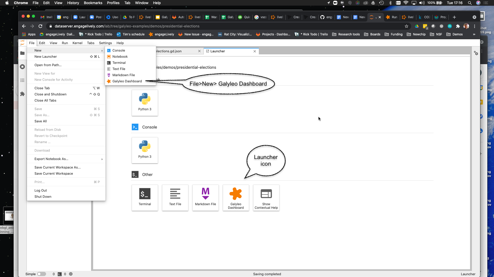
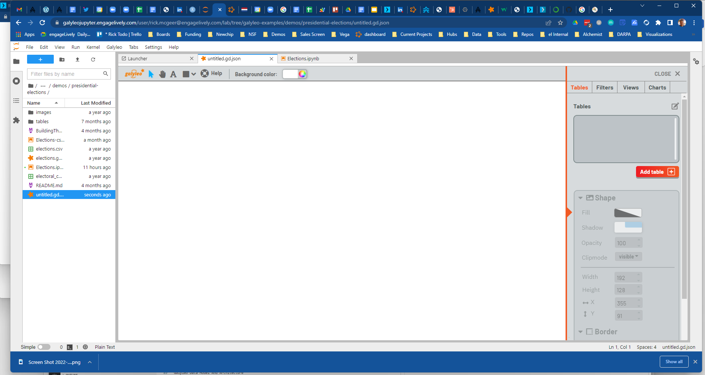

:author: Andreas Bergen
:email: abergen@engageLively.com
:institution: engageLively

:author: Mahdiyar Biazi
:email: mahdi.biazi@engageLively.com
:institution: engageLively

:author: Matt Hemmings
:email: mhemmings@engageLively.com
:institution: engageLively

:author: Patrick McGeer
:email: rick.mcgeer@engageLively.com
:institution: engageLively

:author: Robin Schreiber
:email: robin.schreiber@engageLively.com
:institution: engageLively

:bibliography: mybib

:video: http://www.youtube.com/watch?v=dhRUe-gz690

------------------------------------------------------------
Galyleo: A General-Purpose Extensible Visualization Solution
------------------------------------------------------------

.. class:: abstract

Galyleo is an open-source, extensible dashboarding solution integrated with JupyterLab :cite:`jupyterlab`.  Galyleo is a standalone web application integrated as an iframe :cite:`lawson2011introducing` into a JupyterLab tab.  Users generate data for the dashboard inside a Jupyter Notebook:cite:`kluyver2016jupyter`, which transmits the data through message passing:cite:p`mdnMessage` to the dashboard;  users use drag-and-drop operations to add widgets to filter, and charts to display the data,and shapes, text, and images.   The dashboard is saved as a JSON:cite:`crockford2006application` file in the user’s filesystem in the same directory as the Notebook.

.. class:: keywords

  	
JupyterLab, JupyterLab extension, Dashboard construction, Data visualization

Introduction
------------

Current dashboarding solutions:cite:`holoviz` :cite:`holoviews` :cite:`plotly` :cite:`panel` :cite:`d2013handbook` for Jupyter either involve external, heavyweight tools, ingrained HTML/CSS coding, complex publication, or limited control over layout, and have restricted widget sets and visualization libraries.   Graphics and visualization objects require a great deal of configuration: size, position, colors, fonts, and so on must be set for each object and, often, each component, and thus library solutions involve a significant amount of fairly simple code.  Conversely, visualization involves analytics, an inherently complex set of operations.  "Visualization" tools such as Tableau or Looker combine visualization and analytics in a single application presenting through a point-and-click interface.  But point-and-click interfaces are limited in the number of operations supported, and in the complexity of operations supported.  The complexity of an operation isn't reduced by having a simple point-and-click interface; instead, the user is confronted with the challenge of trying to do something complicated by pointing.  The result is that tools encapsulate complex operations in a few buttons, and that leads to a limited number of operations with reduced options and/or tools with steep learning curves.

In contrast, Jupyter is simply a superior analytics environment in every respect over a standalone visualization tool: its various kernels and their libraries provide a much broader range of analytics capabilities; its programming interface is a much cleaner and simpler way to perform complex operations; hardware  resources can scale far more easily than the can for a visualization tool; and connectors to data sources are both plentiful and very easy to extend.

Both standalone visualization tools and Jupyter libraries have a limited set of visualization options.  Jupyter is fundamentally a *server-side platform*; Jupyter code runs in a headless server environment and presents through a web interface; however, the function of the web interface is primarily to present markdown, and offer textboxes which are used to enter Python code, which is sent to the server for evaluation and the textual results returned.  As a result, visualization in a Jupyter Notebook is either given by images rendered server side and returned as inline image tags, or by JavaScript/HTML5 libraries which are "plumbed through" to a Python library -- the Python library generates HTML5/JavaScript code which is then interpreted and the result returned.

The limiting factor here is that the visualization library must be integrated with the Python backend by a developer, and only a subset of the rich array of visualization, charting, and mapping libraries available on the HTML5/JavaScript platform is integrated.  The HTML5/JavaScript platform is as rich a client-side visualization platform as Python is a server-side platform.  

Galyleo set out to offer the best of both worlds: Python (and R, and Julia) as a rich, scalable analytics platform coupled with a rich, extensible JavaScript/HTML5 visualization and interaction platform.

Galyleo set out to offer a *no-code* client-side environment, for several reasons.
1. The Jupyter analytics community is in general comfortable with server-side analytics environments (Python, R, Julia,...) but less so with the JavaScript visualization platform.
2. As mentioned above, configuration of graphical objects takes a lot of low-value configuration code; conversely, it is relatively easy to do by hand.  

These insights lead to a mixed interface, combining a graphical, drag-and-drop interface for the design and configuration of visual objects, and a coding, server-side  interface for analytics programs.  

Extension of the widget set was also an important consideration.  Again, a widget  is a client-side object with a graphical, physical component.  Just as Galyleo is designed to be extended by adding new visualization libraries and components, so to should it be extended by adding new widgets, which are also physically designed.

Publication of interactive dashboards has been a further challenge.  A design goal of Galyleo was to offer a simple, easy publish to the web scheme, where a dashboard could be published with a single click.

These then, are the goals of Galyleo
1. Simple, drag-and-drop design of interactive dashboards in a visual editor.  The visual design of a Galyleo dashboard should be no more complex than design of a PowerPoint or Google slide, and should involve 
2. Radically simplify the dashboard-design interface by coupling it to a powerful, Jupyter back end to do the analytics work: separation of visualization and analytics concerns
3. Maximimize extensibility on both the client (visualization, widgets) and server (analytics libraries, data sources, hardware resources)
4. Easy, simple publication

Using Galyleo
-------------
The general use mode of Galyleo is that a Notebook is being edited and executed in one tab of JupyterLab, and a corresponding dashboard file is being edited and exectured in another; as the Notebook executes, it uses the Galyleo Client library to send data to the dashboard file. To JupyterLab, the Galyleo Dashboard Studio is just another editor; it reads and writes `.gd.json` files in the current directory. 

The Dashboard Studio
^^^^^^^^^^^^^^^^^^^^^
A new Galyleo Dashboard can be launched from the JupyterLab launcher or from the File>New menu:

    A New Galyleo Dashboard

An existing dashboard is saved as a .gd.json file, and is denoted with the Galyleo star logo. It can be opened in the usual way, with a double-click.

Once a file is opened, or a new file created, a new  Galyleo tab opens onto it.  It resembles a simplified form of a Tableau, Looker, or PowerBI editor.  The right-hand sidebar, which collapse or expands by clicking on the arrow control, offers the ability to view Tables, and view, edit, or create Views, Filters, and Charts.  The bottom half of the right sidebar gives controls for styling of text and shapes.

    The Galyelo Dashboard Studio

The top bar handles the introduction of decorative and styling elements to the dashboard: labels and text, simple shapes (ellipses, rectangles, polygons, lines), and images.  All images are referenced by URL.

As the user creates and manipulates the visual elements, the editor continuously saves the table as a JSON file, which can also be edited with Jupyter's builtin text editor.

Workflow
^^^^^^^^
The goal of Galyleo is simplicity and transparency.  Data preparation is handled in Jupyter, and the basic abstract item, the `GalyleoTable` is *generally* created and manipulated there, using an open-source Python library.  When a table is ready, the `GalyleoClient` library is invoked to send it to the dashboard, where it appears in the table tab of the sidebar.  The dashboard author then creates visual elements (sliders, lists, dropdowns, etc) which select rows of the table, and uses these filtered lists as inputs to charts.  The general idea is that the author should be able to seamlessly move between manipulating and creating data tables in the Notebook, and filtering and visualizing them in the dashboard.

Data Flow and Conceptual Picture
^^^^^^^^^^^^^^^^^^^^^^^^^^^^^^^^
The Galyleo Data Model and Architecture is discussed in detail below.  The central idea is to have a few, orthogonal, easily-grasped concepts which make data manipulation easy and intuitive.  The basic concepts are as follows:
1. *Table*: A Table is just what it sounds like: a list of records, equivalent to a PANDAS DataFrame or a SQL Table.  In general, in Galyleo, a Table is expected to be produced by an external source, generally a Jupyter Notebook
2. *Filter*: A Filter is a logical function which applies to a Table, and selects rows from the Table.  Each Filter works on a single column of the table.  Each Filter corresponds to a widget; widgets set the values Filter use to select table rows
3. *View* A View is a subset of a table selected by one or more filters.  To create a view, the user chooses a table, and then chooses one or more filters to apply to the table to select the rows for the View.  The user can also statically select a subset of the columns  to include
in the View.
4. *Chart* A Chart is a generic term for an object that displays data graphically.  Its input is a View or a Table.  Each Chart has a single data source.

With this in hand, the data flow is straightforward.  A Table is updated from an external source, or the user manipulates a widget.  When this happens, the affected item signals the dashboard controller that it has been updated.  The controller then signals all charts to redraw themselves.  Each Chart will then request updated data from its source Table or View.  A View then requests its configured filters for their current logic functions, and passes these to the source Table with a request to apply the filters and return the rows which are selected by *all* the filters (in the future, a more general Boolean will be applied; the UI elements to construct this function are under design).  The Table then returns the rows which pass the filters; the View selects the static subset of columns it supports, and passes this to its Charts, which then redraw themselves

Each item in this flow conceptually has a single data source, but multiple data targets.  There can be multiple Views over a Table, but each View has a single Table as a source.  There can be multiple charts fed by a View, but each Chart has a single Table or View as a source.

Publishing The Dashboard
^^^^^^^^^^^^^^^^^^^^^^^^^
Once the dashboard is complete, it can be published to the web simply by moving the dashboard file to any place it get an URL (e.g. a github repo).  It can then be viewed by visiting `https://galyleobeta.engagelively.com/public/galyleo/index.html?dashboard=<url of dashboard file>`

Galyleo Data Model And Architecture
-----------------------------------
Central element: the Galyleo Table
Logical, not physical artifact
Similar to PANDAS Dataframe
Conceptually, a pair (rows, columns)
The Filter: Logical operator over tables
Basic idea: boolean function on table rows: row either passes or fails the filter
Views: connection between tables and filters.  Subset of a table, where columns are statically selected and rows are selected dynamically by a collection of filters
Charts can have views or tables as data sources.  If a view, the chart automatically updates when a widget changes

Overall Galyleo Architecture
----------------------------
Two largely independent platforms: Galyleo Dashboard Studio, Jupyter Analytics
Jupyter supplies data to the dashboard

The Galyleo Client library
--------------------------

Integration into Jupyter Lab: The Galyleo Extension
---------------------------------------------------

Further Extension Applications
-------------------------------

Conclusions and Future Work
----------------------------
.

:code:`:bibliography:mybib`

