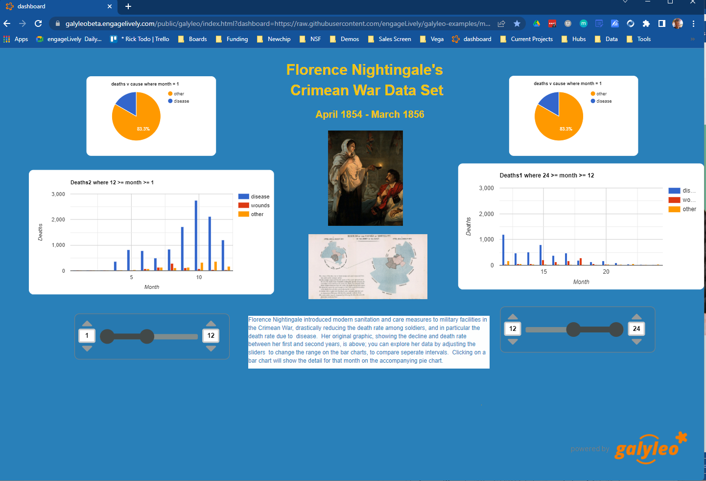
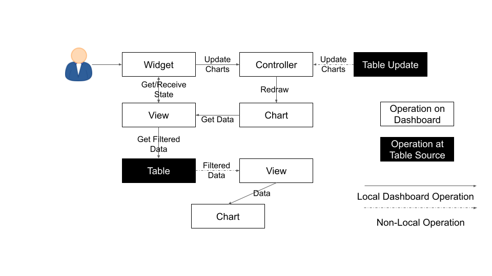
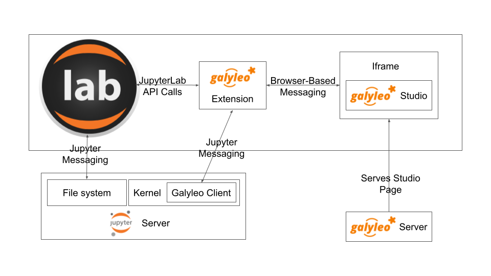
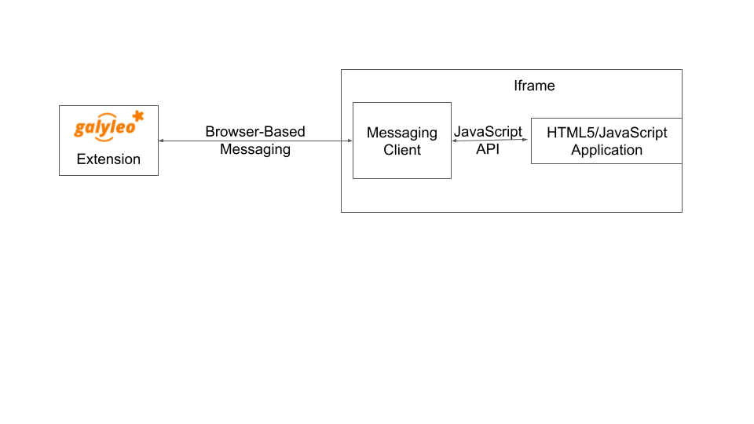

:author: Rick McGeer
:email: rick.mcgeer@engageLively.com
:institution: engageLively

:author: Andreas Bergen
:email: abergen@engageLively.com
:institution: engageLively

:author: Mahdiyar Biazi
:email: mahdi.biazi@engageLively.com
:institution: engageLively

:author: Matt Hemmings
:email: mhemmings@engageLively.com
:institution: engageLively

:author: Robin Schreiber
:email: robin.schreiber@engageLively.com
:institution: engageLively

:bibliography: mybib

------------------------------------------------------------
Galyleo: A General-Purpose Extensible Visualization Solution
------------------------------------------------------------

.. class:: abstract

Galyleo is an open-source, extensible dashboarding solution integrated with JupyterLab :cite:`jupyterlab`.  Galyleo is a standalone web application integrated as an iframe :cite:`lawson2011introducing` into a JupyterLab tab.  Users generate data for the dashboard inside a Jupyter Notebook :cite:`kluyver2016jupyter`, which transmits the data through message passing:cite:p`mdnMessage` to the dashboard;  users use drag-and-drop operations to add widgets to filter, and charts to display the data,and shapes, text, and images.   The dashboard is saved as a JSON :cite:`crockford2006application` file in the user’s filesystem in the same directory as the Notebook.

.. class:: keywords

  	
JupyterLab, JupyterLab extension, Dashboard construction, Data visualization

Introduction
------------

Current dashboarding solutions:cite:`holoviz` :cite:`holoviews` :cite:`plotly` :cite:`panel` :cite:`d2013handbook` for Jupyter either involve external, heavyweight tools, ingrained HTML/CSS coding, complex publication, or limited control over layout, and have restricted widget sets and visualization libraries.   Graphics and visualization objects require a great deal of configuration: size, position, colors, fonts, and so on must be set for each object and, often, each component, and thus library solutions involve a significant amount of fairly simple code.  Conversely, visualization involves analytics, an inherently complex set of operations.  "Visualization" tools such as Tableau or Looker combine visualization and analytics in a single application presenting through a point-and-click interface.  But point-and-click interfaces are limited in the number of operations supported, and in the complexity of operations supported.  The complexity of an operation isn't reduced by having a simple point-and-click interface; instead, the user is confronted with the challenge of trying to do something complicated by pointing.  The result is that tools encapsulate complex operations in a few buttons, and that leads to a limited number of operations with reduced options and/or tools with steep learning curves.

In contrast, Jupyter is simply a superior analytics environment in every respect over a standalone visualization tool: its various kernels and their libraries provide a much broader range of analytics capabilities; its programming interface is a much cleaner and simpler way to perform complex operations; hardware  resources can scale far more easily than the can for a visualization tool; and connectors to data sources are both plentiful and very easy to extend.

Both standalone visualization tools and Jupyter libraries have a limited set of visualization options.  Jupyter is fundamentally a *server-side platform*; Jupyter code runs in a headless server environment and presents through a web interface; however, the function of the web interface is primarily to present markdown, and offer textboxes which are used to enter Python code, which is sent to the server for evaluation and the textual results returned.  As a result, visualization in a Jupyter Notebook is either given by images rendered server side and returned as inline image tags, or by JavaScript/HTML5 libraries which are "plumbed through" to a Python library -- the Python library generates HTML5/JavaScript code which is then interpreted and the result returned.

The limiting factor here is that the visualization library must be integrated with the Python backend by a developer, and only a subset of the rich array of visualization, charting, and mapping libraries available on the HTML5/JavaScript platform is integrated.  The HTML5/JavaScript platform is as rich a client-side visualization platform as Python is a server-side platform.  

Galyleo set out to offer the best of both worlds: Python (and R, and Julia) as a rich, scalable analytics platform coupled with a rich, extensible JavaScript/HTML5 visualization and interaction platform.

Galyleo set out to offer a *no-code* client-side environment, for several reasons.

1. The Jupyter analytics community is in general comfortable with server-side analytics environments (Python, R, Julia,...) but less so with the JavaScript visualization platform.

2. As mentioned above, configuration of graphical objects takes a lot of low-value configuration code; conversely, it is relatively easy to do by hand.  

These insights lead to a mixed interface, combining a graphical, drag-and-drop interface for the design and configuration of visual objects, and a coding, server-side  interface for analytics programs.  

Extension of the widget set was also an important consideration.  Again, a widget  is a client-side object with a graphical, physical component.  Just as Galyleo is designed to be extended by adding new visualization libraries and components, so to should it be extended by adding new widgets, which are also physically designed.

Publication of interactive dashboards has been a further challenge.  A design goal of Galyleo was to offer a simple, easy publish to the web scheme, where a dashboard could be published with a single click.

These then, are the goals of Galyleo

1. Simple, drag-and-drop design of interactive dashboards in a visual editor.  The visual design of a Galyleo dashboard should be no more complex than design of a PowerPoint or Google slide, and should involve 

2. Radically simplify the dashboard-design interface by coupling it to a powerful, Jupyter back end to do the analytics work: separation of visualization and analytics concerns

3. Maximimize extensibility on both the client (visualization, widgets) and server (analytics libraries, data sources, hardware resources)

4. Easy, simple publication

Using Galyleo
-------------
The general use mode of Galyleo is that a Notebook is being edited and executed in one tab of JupyterLab, and a corresponding dashboard file is being edited and exectured in another; as the Notebook executes, it uses the Galyleo Client library to send data to the dashboard file. To JupyterLab, the Galyleo Dashboard Studio is just another editor; it reads and writes `.gd.json` files in the current directory. 

The Dashboard Studio
^^^^^^^^^^^^^^^^^^^^^
A new Galyleo Dashboard can be launched from the JupyterLab launcher or from the File>New menu:

.. figure:: new_dashboard.png

    A New Galyleo Dashboard

An existing dashboard is saved as a .gd.json file, and is denoted with the Galyleo star logo. It can be opened in the usual way, with a double-click.

Once a file is opened, or a new file created, a new  Galyleo tab opens onto it.  It resembles a simplified form of a Tableau, Looker, or PowerBI editor.  The right-hand sidebar, which collapse or expands by clicking on the arrow control, offers the ability to view Tables, and view, edit, or create Views, Filters, and Charts.  The bottom half of the right sidebar gives controls for styling of text and shapes.

.. figure:: galyleo.png

    The Galyleo Dashboard Studio

The top bar handles the introduction of decorative and styling elements to the dashboard: labels and text, simple shapes (ellipses, rectangles, polygons, lines), and images.  All images are referenced by URL.

As the user creates and manipulates the visual elements, the editor continuously saves the table as a JSON file, which can also be edited with Jupyter's builtin text editor.

Workflow
^^^^^^^^
The goal of Galyleo is simplicity and transparency.  Data preparation is handled in Jupyter, and the basic abstract item, the `GalyleoTable` is *generally* created and manipulated there, using an open-source Python library.  When a table is ready, the `GalyleoClient` library is invoked to send it to the dashboard, where it appears in the table tab of the sidebar.  The dashboard author then creates visual elements (sliders, lists, dropdowns, etc) which select rows of the table, and uses these filtered lists as inputs to charts.  The general idea is that the author should be able to seamlessly move between manipulating and creating data tables in the Notebook, and filtering and visualizing them in the dashboard.

Data Flow and Conceptual Picture
^^^^^^^^^^^^^^^^^^^^^^^^^^^^^^^^
The Galyleo Data Model and Architecture is discussed in detail below.  The central idea is to have a few, orthogonal, easily-grasped concepts which make data manipulation easy and intuitive.  The basic concepts are as follows:

1. *Table*: A Table is just what it sounds like: a list of records, equivalent to a PANDAS DataFrame or a SQL Table.  In general, in Galyleo, a Table is expected to be produced by an external source, generally a Jupyter Notebook

2. *Filter*: A Filter is a logical function which applies to a Table, and selects rows from the Table.  Each Filter works on a single column of the table.  Each Filter corresponds to a widget; widgets set the values Filter use to select table rows

3. *View* A View is a subset of a table selected by one or more filters.  To create a view, the user chooses a table, and then chooses one or more filters to apply to the table to select the rows for the View.  The user can also statically select a subset of the columns  to include
in the View.

4. *Chart* A Chart is a generic term for an object that displays data graphically.  Its input is a View or a Table.  Each Chart has a single data source.

.. figure:: galyleo_dataflow.png

Dataflow in Galyleo

With this in hand, the data flow is straightforward.  A Table is updated from an external source, or the user manipulates a widget.  When this happens, the affected item signals the dashboard controller that it has been updated.  The controller then signals all charts to redraw themselves.  Each Chart will then request updated data from its source Table or View.  A View then requests its configured filters for their current logic functions, and passes these to the source Table with a request to apply the filters and return the rows which are selected by *all* the filters (in the future, a more general Boolean will be applied; the UI elements to construct this function are under design).  The Table then returns the rows which pass the filters; the View selects the static subset of columns it supports, and passes this to its Charts, which then redraw themselves

Each item in this flow conceptually has a single data source, but multiple data targets.  There can be multiple Views over a Table, but each View has a single Table as a source.  There can be multiple charts fed by a View, but each Chart has a single Table or View as a source.

It's important to note that there are no special cases.  There is no distinction, as there is in most visualization systems, between a "Dimension" or a "Measure"; there are simply columns of data, which can be either a value or category axis for any Chart.  From this simplicity significant generality is achieved. For example, a filter selects values from any column, whether that column is providing value or category.  Applying a range filter to a category column gives natural telescoping and zooming on the x-axis of a chart, without change to the architecture.

Drilldowns
^^^^^^^^^^
An important operation for any interactive dashboard is drilldowns: expanding detail for a datapoint on a chart.  The user should be able to click on a chart and see a detailed view of the data underlying the datapoint.  This was naturally implemented in our system by associating a filter with every chart: *every chart in Galyleo is also a Select Filter, and it can be used as a Filter in a view, just as any other widget can be*.

Publishing The Dashboard
^^^^^^^^^^^^^^^^^^^^^^^^^
Once the dashboard is complete, it can be published to the web simply by moving the dashboard file to any place it get an URL (e.g. a github repo).  It can then be viewed by visiting `https://galyleobeta.engagelively.com/public/galyleo/index.html? dashboard=<url of dashboard file>`.  The attached figure shows a published Galyleo Dashboard, which displays Florence Nightingale's famous Crimean War dataset.  Using the double sliders underneath the column charts telescope the x axes, effectively permitting zooming on a range;  clicking on a column shows the detailed death statistics for that month in the pie chart above the column chart.

A Published Galyleo Dashboard

Galyleo Data Model And Architecture
-----------------------------------
The Galyleo Data Model and Architecture closely models the dashboard architecture discussed in the previous section.  As with the Dashboard Architecture, it is based on the idea of a few simple, generalizable structures, which are largely independent of each other and communicate through simple interfaces.

The GalyleoTable
^^^^^^^^^^^^^^^^
A GalyleoTable is the fundamental data structure in Galyleo.  It is a logical, not a physical abstraction; it simply responds to the GalyleoTable API.  A GalyleoTable is a pair (columns, rows), where columns is a list of pairs (name, type), where type is one of {string, boolean, number, date}, and rows is a list of lists of primitive values, where the length of each component list is the length of the list of columns and the type of the kth entry in each list is the type specified by  the kth column.

Small, public tables may be contained in the dashboard file; these are called *explicit* tables.  However, explicitly representing the table in the dashboard file has a number of disadvantages:

1. An explicit table is in the memory of the client viewing the dashboard; if it is too large, it may cause significant performance problems on the dashboard author or viewer's device

2. Since the dashboard file is accessible on the web, any data within it is public

3. The data may be continuously updated from a source, and  it's inconvenient to re-run the Notebook to update the data.

Therefore, the GalyleoTable can be of one  of three types:

1. A data server that implements the Table REST API

2. A JavaScript object within the dashboard page itself

3. A JavaScript messenger in the page that implements a messaging version of the API

An explicit table is simply a special case of (2) -- in this case, the JavaScript object is simply a linear list of rows.  

These are not exclusive.  The JavaScript messenger case is designed to support the ability of a containing application within the browser to handle viewer authentication, shrinking the security vulnerability footprint and ensuring that the client application controls the data going to the dashboard.  In general, aside from performing tasks like authentication, the messenger will call an external data server for the values themselves.

Whether in a Data Server, a containing application, or a JavaScript object, Tables support three operations:

1. Get all the values for a specific column

2. Get the max/min/increment for a specific numeric column

3. Get the rows which match a boolean function, passed in as a parameter to the operation

Of course, (3) is  the operation that we have seen above, to populate a view and a chart.  (1) and (2) populate widgets on the dashboard; (1) is designed for a select filter, which is a widget that lets a user pick a specific set of values for a column; (2) is an optimization for numeric filters, so that the entire list of values for the column need not be sent -- rather, only the start and end values, and the increment between them.

Each type of table specifies a source, additional information (in the case of a data server, for example, any header variables that must be specified in order to fetch the data), and, optionally, a polling interval.  The latter is designed to handle live data; the dashboard will query the data source at each polling interval to see if the data has changed.

The choice of these three table instantiations (REST, JavaScript object, messenger) is that they provide the key foundational building block for future extensions; it's easy to add a SQL connection on top of a REST interface, or a Python simulator.  

Filters
^^^^^^^
Tables must be filtered *in situ*.  One of the key motivators behind remote tables is in keeping large amounts of data from hitting the browser.  This is largely defeated if the entire table is sent to the dashboard and then filtered there.  As a result, there is a Filter API together with the Table API whereever there are tables.

The data flow of the previous section remains unchanged; it is simply that the filter functions are transmitted to wherever the tables happen to be.  The dataflow in the case of remote tables (whether messenger-based or REST-based) is shown here, with operations that are resident where the table is situated and operations resident on the dashboard clearly shown.

Galyleo Dataflow with Remote Tables

Comments
^^^^^^^^
Again, simplicity and orthogonality have shown tremendous benefits here.  Though filters conceptually act as selectors on rows, they may perform a variety of roles in implementations.  For example, a table produced by a simulator may be controlled by a parameter value given by a Filter function.

Extending Galyleo
-----------------
Every element of the Galyleo system, whether it is a widget, Chart, Table Server, or Filter is defined exclusively through a small set of public APIs.  This is done to permit easy extension, by either the Galyleo team, users, or third parties.  A Chart is defined as an object which has a physical HTML representation, and it supports four JavaScript methods: redraw (draw the chart), set data (set the chart's data), set options (set the chart's options), and supports table (a boolean which returns true if and only if the chart can draw the passed-in data set).  In addition, it exports out a defined JSON structure which indicates what options it supports and the types of their values; this is used by the Chart Editor to display a configurator for the chart.

Similarly, the underlying lively.next system supports user design of new filters.  Again, a filter is simply an object with a physical presence, that the user can design in lively, and supports a specific API -- broadly, set the choices and hand back the Boolean function as a JSON object which will be used to filter the data.

Integration into Jupyter Lab: The Galyleo Extension
---------------------------------------------------
Galyleo is a standalone web application that is integrated into JupyterLab using an iframe inside a JupyterLab tab for physical design.  A small JupyterLab extension was built, that implements the JupyterLab editor API.  The JupyterLab extension has two major functions: to handle read/write/undo requests from the JupyterLab menus and file browser, and receive and transmit messages from the running Jupyter kernels to update tables on the Dashboard Studio, and to handle the reverse messages where the studio requests data from the kernel.  

Galyleo Extension Architecture

Standard Jupyter and browser mechanisms are used.  File system requests come to the extension from the standard Jupyter API, exactly the same requests and mechanisms that are sent to a Markdown or Notebook editor.  The extension receives them, and then uses standard browser-based messaging (`window.postMessage`) to signal the standalone web app.  Similarly, when the extension makes a request of JupyterLab, it does so through this mechanism and a receiver in the extension gets it and makes the appropriate method calls within JupyterLab to achieve the objective.

When a kernel makes a request through the Galyleo Client, this is handled exactly the same way.  A Jupyter messaging server within the extension receives the message from the kernel, and then uses browser messaging to contact the application with the request, and does the reverse on a Galyleo message to the kernel.

This is a highly efficient method of interaction, since browser-based messaging is in-memory transactions on the client machine.

It's important to note that there is nothing Galyleo-specific about the extension: the Galyleo Extension is a general method for *any* standalone web editor (e.g., a slide or drawing editor) to be integrated into JupyterLab.  The JupyterLab connection is a few tens of lines of code in the Galyleo Dashboard.  The extension is slightly more complex, but it can be configured for a different application with a simple data structure which specifies the URL of the application, file type and extension to be manipulated, and message list.

The Jupyter Computer
--------------------
The implications of the Galyleo Extension go well beyond visualization and dashboards and easy publication in JupyterLab.  JupyterLab is billed as the next-generation integrated Development Environment for Jupyter, but in fact it is substantially more than that.  It is the user interface and windowing system for Cloud-based personal computing.  Inspired by previous extensions such as the Vega Extension, the Galyleo Extensions seeks to  provide the final piece of the puzzle.

Consider a Jupyter server in the Cloud, served from a JupyterHub such as the Berkeley Data Hub.  It's built from a base Ubuntu image, with the standard Jupyter libraries installed and, importantly, a UI that includes a Linux terminal interface.  Any Linux executable can be installed in the Jupyter server image, as can any Jupyter kernel, and any collection of libraries.   The Jupyter server has per-user persistent storage, which is organized in a standard Linux filesystem.   This makes the Jupyter server a curated execution environment with a Linux command-line interface and a Notebook interface for Jupyter execution.

A JupyterHub similar to Berkeley Data Hub (essentially, anything built from Zero 2 Jupyter Hub or Q-Hub) comes with a number of "environments".  The user chooses the environment on startup.  Each environment comes with a builtin set of libraries and executables designed for a specific task  or set of tasks.  The number of environments hosted by a  server is arbitrary, and the cost is only the cost of maintaining the Dockerfile for each environment.

An environment is easy to design for a specific class, project, or task; it's simply adding libraries and executables to a base Dockerfile.  It must be tested, of course, but everything must be.   And once it is tested, the burden of software maintenance and installation is removed from the user; the user is already in a task-customized, curated environment.  Of course, the usual installation tools (`apt`, `pip`, `conda`, `easy_install`) can be pre-loaded (they're just executables) so if the environment designer missed something it can be added by the end user.

Though a user can only be in one environment at a time, persistent storage is shared across all environments, meaning switching environments is simply a question of swapping one environment out and starting another.

Viewed in this light, a JupyterHub is a multi-purpose computer in the Cloud, with an easy-to-use UI that presents through a browser. JupyterLab isn't simply an IDE; it's the window system and user interface for this computer.  The JupyterLab launcher is the desktop for this computer (and it changes what's presented, depending on the environment); the file browser is the computer's file browser, and the JupyterLab API is the equivalent of the Windows or MacOS desktop APIs and window system that permits third parties to build applications for this.

This Jupyter Computer has a large number of advantages over a standard desktop or laptop computer.  It can be accessed from any device, anywhere on Earth with an Internet connection.  Software installation and maintenance issues are nonexistent.  Data loss due to hardware failure is extremely unlikely; backups are still required to prevent accidental data loss (e.g., erroneous file deletion), but they are far easier to do in a Cloud environment.  Hardware resources such as disk, RAM, and CPU can be added rapidly, on a permanent or temporary basis.  Relatively exotic resources (e.g., GPUs) can also be added, again on an on-demand, temporary basis.

The advantages go still further than that.  Any  resource that can be accessed over a network connection can be added to the Jupyter Computer simply by adding the appropriate accessor library to an environment's Dockerfile.  For example, a database solution such as Snowflake, BigQuery, or Amazon Aurora (or one of many others) can be "installed" by adding the relevant library module to the environment.  Of course, the user will need to order the database service from the relevant provider, and obtain authentication tokens, and so  on -- but this is far less troublesome than even maintaining the library on the desktop.

However, to date the Jupyter Computer only supports a few window-based applications, and adding a new application is a time-consuming development task.  The applications supported are familiar and easy to enumerate: a Notebook editor, of course; a Markdown Viewer; a CSV Viewer; a JSON Viewer (not inline editor), and a text editor that is generally used for everything from Python files to Markdown to CSV.

This is a small subset of the rich range of JavaScript/HTML5 applications which have significant value for Jupyter Computer users.  For example, the Ace  Code Editor supports over 110 languages and has the functionality of popular desktop editors such as Vim and  Sublime Text.  There are over 1100 open-source drawing applications on the JavaScript/HTML5 platform; multiple spreadsheet applications, the most notable being jExcel, and many more.

Up until now, adding a new application to JupyterLab involved writing a hand-coded extension in Typescript, and compiling it into JupyterLab.  However, the Galyleo Extension has been designed so that any HTML5/JavaScript application can be added easily, simply by configuring the Galyleo Extension with a small JSON file.

The promise of the Galyleo Extension is that it can be adapted to *any* open-source JavaScript/HTML5 application very easily.  The Galyleo Extension merely needs the:

* URL of the application
* File extension that the application reads/writes
* URL of an image for the launcher
* Name of the application for the file menu

The application must implement a small messaging client, using the standard JavaScript messaging interface, and implement the calls the Galyleo Extension makes.  The conceptual picture is shown here:

Galyleo Extension Application-Side messaging

And it must support (at a minimum) messages to read and write the file being edited.
