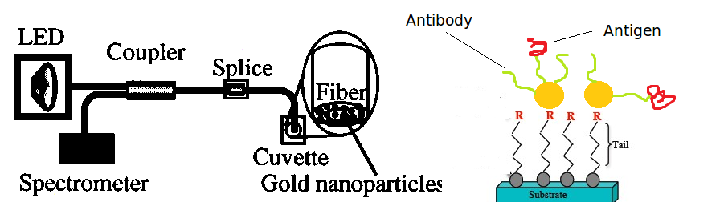
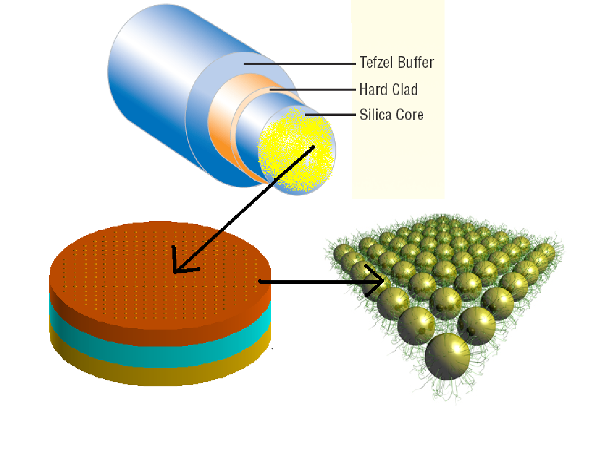
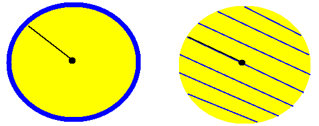
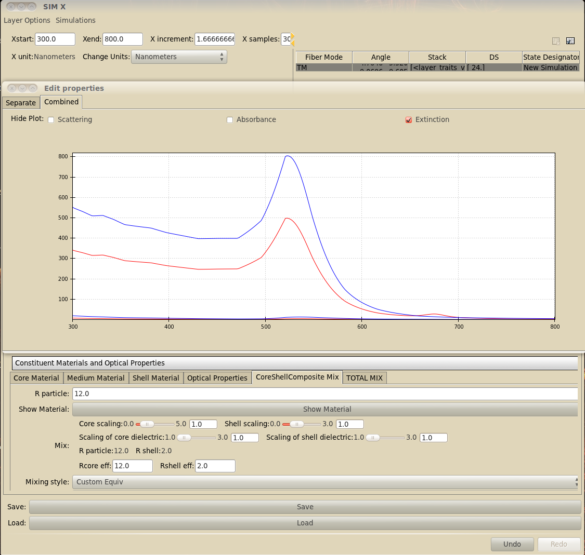
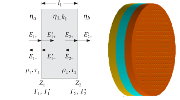
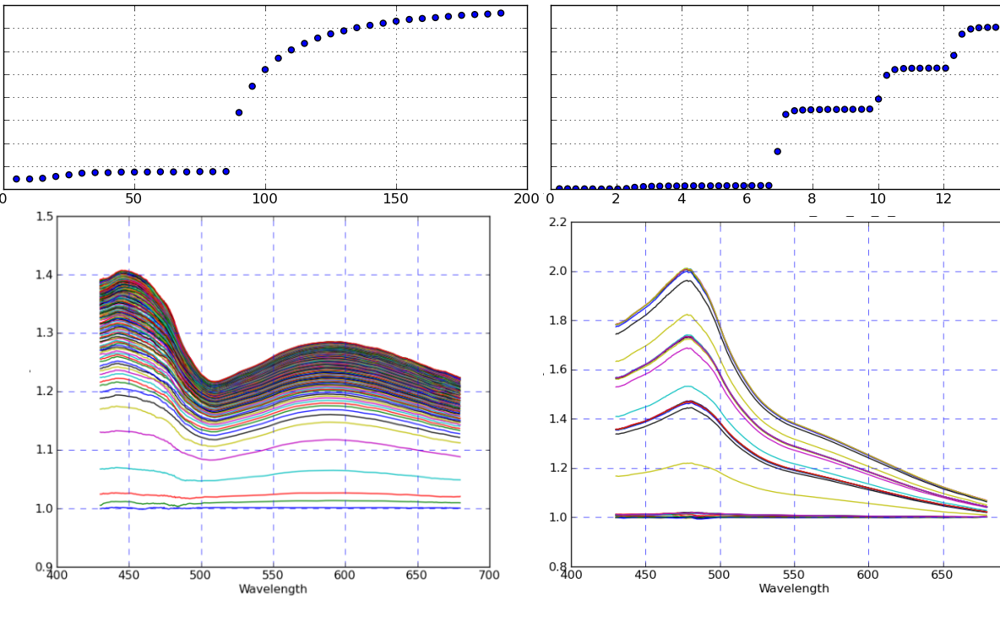
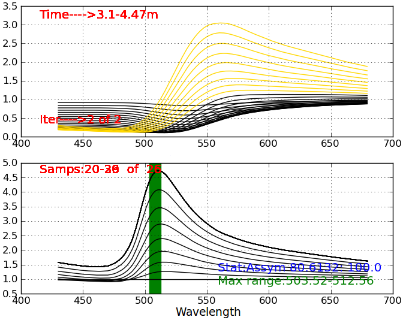

:author: Adam Hughes
:email: hugadams@gwmail.gwu.edu
:institution: The George Washington University

------------------------------------------------------
A Computational Framework for Plasmonic Nanobiosensing
------------------------------------------------------

.. class:: abstract

   Basic principles in biosensing and nanomaterials precede the introduction of a novel fiberoptic sensor.  Software limitations in the biosensing domain are presented, followed by the development of a Python-based simulation environment. Finally, the current state of spectral data analysis within the Python ecosystem is discussed.

.. class:: keywords

   nanoparticles, fiberoptic, biosensor, Python, immunoassay, plasmonics, proteins, gold nanoparticles, metallic colloids, IPython, Traits, Chaco, Pandas

Introduction
------------

Because of their unique optical properties, metallic colloids, especially gold nanoparticles (AuNPs), have found novel applications in biology.  They are utilized in the domain of *nanobiosensing* as platforms for biomolecule recognition.  Nanobiosensing refers to the incorporation of nanomaterials into biosensing apparatuses.  Sensors whose primary signal transduction mechanism is the interaction of light and metallic colloids are known as *plasmonic* sensors [*]_.

Plasmonic sensors are constructed by depositing metallic layers (bulk or colloidal) onto a substrate such as glass, or in our case, onto a stripped optical fiber.  Upon illumination, they relay continuous information about their surrounding physical and chemical environment.  These sensors behave similar to conventional assays with the added benefits of increased sensitivity, smaller apparatuses, reduced sample size, low cost, and real-time data acquisition.  Despite these benefits, nanobiosensing research in general is faced with several hinderances. 

.. [*] This exposition is germane to plasmonic sensors moreso than to other nanobiosensor subgroups.

It is often difficult to objectively compare results between research groups, and sometimes even between experimental trials.  This is mainly because the performance of custom apparatuses is highly dependent on design specifics as well as experimental conditions.  The extensive characterization process found in commercial biosensors [*]_ exceeds the resources and capabilities of the average research group. This partially due to a disproportionate investment in supplies and manpower; however, it is also due to a dearth of computational resources.  As a result, the design, conductance and interpretation of sensing experiments is largely asystematic.  To compound matters, the growing sophistication of sensing experiments is not complimented by a set of domain-specific software tools.  This lends an advantage to commercial biosensors, which are accompanied by highly customized software used to both control the experimental apparatuses as well as to extract underlying information from the data. Without a general software framework to develop such tools, it is unreasonable to expect the research community to achieve the same breadth in application when pioneering new nanobiosening technology.

.. [*] Biacore_:math:`^\copyright` and ForteBio_:math:`^\copyright` are examples of prominent nanobiosensing companies.

.. _Biacore: http://www.biacore.com/lifesciences/Application_Support/index.html?viewmode=printer

.. _ForteBio: http://www.fortebio.com/company_overview.html

Publications on novel biosensors often belaud improvement in sensitivity and cost over commercial alternatives; however, the aforementioned shortcomings relegate many new apparatuses to prototype limbo.  Until the following two freeware components are developed, new biosensors, despite any technical advantages over their commercial counterparts, will fall short in applicability.

	1. A general and systematic framework for the development and objective quantification of nanobiosensors.
	2. Domain-tailored software tools for conducting simulations and interpreting experimental data.

In regard to both points, analytical methods have been developed to interpret various aspects of plasmonic sensing [1]_; however, they've yet to be translated into a general software framework.  Commercially software for general optical system design is available; however, is expensive and not designed to encompass nanoparticles and their interactions with biomolecules.  In the following sections, an effort to begin such computational endeavors is presented in the context of our custom sensing apparatus, but is relevant in general to plasmonic biosensing.


Optical Setup
-------------

We have developed an operational benchtop setup which records rapid spectroscopic measurements in the light reflectance of a AuNP-coated optical fiber. The nanoparticles are deposited on the flat endface of the fiber, in contrast to the more method of depositing the AuNPs along the transversal length of an etched optical fiber [2]_ [3]_ [*]_.   In either configuration, only the near-field interaction affects the signal, offering an advantage over far-field methods.   The simple design is outlined in Fig. (:ref:`setup`).  Light from a bright LED is focused through a :math:`10 {\bf \times}` objective (not shown) into a :math:`125 \mu \mbox{m}` core diameter optical fiber.  AuNP-coated probes are connected into the setup via an optical splice.  The probes are dipped into samples, and the return light is captured in an OceanOptics_:math:`^\copyright` USB2000 benchtop spectrometer and subsequently output as ordered series data.



   Left: Bench-top fiberoptic configuration schematic, adapted from [4].  Right: Depiction from bottom to top of fiber endface, MPTMS monolayer, AuNPs, antibody-antigen coating. :label:`setup`

.. _OceanOptics: http://www.oceanoptics.com/

.. [*] Transversal deposition allows for more control of the fiber's optical properties; however, it makes probe creation more difficult and less reproducible. 


Fiber Surface Functionalization
-------------------------------

16nm gold nanospheres are deposited covalently onto the optical fiber through the linker molecule, (3-Mercaptopropyl)trimethoxysilane, or MPTMS [*]_.  The surface chemistry of the gold is further modified to the specifications of the experiment.  One common modification is to covalently bind a ligand to the AuNPs using Dithiobis[succinimidyl propionate] (Lomant's reagent), and then use the fiber to study specificity in antibody-antigen interactions.  This is depicted in Fig. (:ref:`setup`) right.

.. [*] MPTMS is a heterobifunctional crosslinker that binds covalently to glass and gold respectively through silane and thiol functional groups.


Modeling [*]_ the Optical System in Python
------------------------------------------

.. [*] The simulation codebase_ is generously hosted through GitHub_.

.. _codebase: http://hugadams.github.com/fibersim
.. _GitHub: http://github.com


Nanobiosensing resides at a cross-section of optics, biology and material science.  To simulate such a system requires background in all three fields, and new tools to integrate the pieces seamlessly.  Nanobiosensor modeling must describe phenomena at three distinct length scales.  In order of increasing length, these are:

	1. A description of the optical properties of nanoparticles with various surface coatings.
	2. The properties of light transmission through multi-layered materials at the fiber endface.
	3. The geometric parameters of the optics (e.g. fiber diameter, placement of nanoparticle monolayer, etc...).




   Three size regimes of the optical setup.  Top: Optical fiber with an AuNP-coated endface.  Left: Coarse approximation of a multilayered material. Right: Individual nanoparticles with protein shells. :label:`system`

These distinct regimes are shown in Fig (:ref:`system`) and will be discussed separately. It is important to note that the computational description of a *material* is identical at three lengths scales.  As such, general classes have been created and interfaced to accomadate material datafiles [5]_ and models [6]_.  This allows for a wide variety of experimental and theoretical materials to be easily incorporated into the simulation environment.

Modeling Nanoparticles
``````````````````````
AuNPs respond to their surrounding environment through a phenomenon known as *surface plasmon resonance*.  Incoming light couples to free electrons and induces surface oscillations around the nanoparticle.  The magnitude and dispersion of these oscillations is highly influenced by the dielectric media in direct contact with the particle's surface.  As such, the scattering and absorption properties of the gold particles will change in response to changes in solution, as well as when biomolecules bind to the particles.  

To model AuNPs, the complex dielectric function [*]_ of gold is imported from various sources, both from material models [5]_ and datasets [6]_. The optical properties of bare and coated spheroids is described analytically through Mie theory [7]_.  Scattering and absorption coefficients are computed using spherical Bessel functions from the *scipy.special* library of mathematical functions.  Special routines and packages are available for computing the optical properties of non-spheroidal colloids; however, they have not yet been incorporated in this package.  

.. [*] The dielectric function and shape of the particle are the only parameters required to compute its absorption and scattering cross sections.

AuNP modeling is straightforward; however, exploratory analysis is uncommon.  Enthought's ``Traits`` and ``Chaco`` packages are used extensively to provide interactivity.  To demonstrate a use case, consider a gold nanoparticle with a shell of protein coating.  The optical properties of the core-shell particle may be obtained analytically using Mie Theory [*]_; however, analysis performed at a coarser scale requires this core-shell system to be approximated as a single composite particle (Fig. (:ref:`comp`)).  With ``Traits``, it is very easy for the user to interactively adjust the mixing method parameters to ensure the scattering properties of the approximated composite are as close as possible to those of the analytical core-shell particle.  This is one of many examples in which interactivity is favorable over complex optimization techniques.

.. [*] Assuming that the shell is perfectly modeled; however, in practice the optical properties of protein mixtures are approximated by a variety of mixing models and methods.



   Left: A nanoparticle with heterogeneous core and shell dielectrics :math:`(\epsilon_1, \epsilon_2)`, of radius, :math:`r=r_1 + r_2`.  Right: Composite approximation of a homogeneous material, with effective dielectric :math:`\epsilon^\prime`, and radius, :math:`r^\prime`. :label:`comp`


<<<<<<< HEAD
   :width: 250
   :height: 175
=======
   :scale: 25
>>>>>>> d42ebc001b0f5cbcac44ee92cda188ca3e655209

   Screenshot of an interactive ``TraitsUI`` program for modeling the scenario in Fig. (:ref:`comp`): the extinction spectra of a protein-coated AuNP (blue) compared to that of an equivalent core-shell composite  (red). :label:`ss`

Modeling Material Layers
````````````````````````
The fiber endface at a more coarse resolution resembles a multilayered dielectric stack of homogeneous materials, also referred to as a thin film (Fig. (:ref:`interface`)).  In the limits of this approximation, the reflectance, transmittance and absorbance through the slab can be calculated recursively for n-layered systems [8]_.  Thin film optical software is commercially available and used extensively in optical engineering, for example, in designing coatings for sunglasses.  Unfortunately, a free user-friendly alternative is not available [*]_.  In addition, these packages are usually not designed for compatibility with nanomaterials; therefore, we have begun development of an extensible thin film Python API that incorporates nanomaterials.  This is ideal, for example, in simulating a fiber immersed in a solvent with a variable refractive index (e.g. a solution with changing salinity); the programs will ensure that as the solvent changes, the surrounding shell of the nanoparticle, and hence its extinction spectra, will update accordingly.

.. [*] Open-source thin film software is often limited in scope and seldom provides a user-interface, making an already complex physical system more convoluted.




   Left: Electromagnetic field components at each interface of a dielectric *slab* [7].  Right: Illustration of a multilayered material whose optical properties would be described by such treatment. :label:`interface`

Optical Configurations and Simulation Environment
`````````````````````````````````````````````````
With the material and multilayer APIs in place, it is straightforward to incorporate an optical fiber platform.  The light source and fiber parameters merely serve as the initial conditions of light entering the multilayer interface; thus, once the correct multilayered environment is established, it easy to compare performance between different fiberoptic configurations.  Built-in parameters already account for the material makeup and physical dimensions of many commercially available optical fibers.  A phase angle has been introduced to distinguish nanomaterial deposition on the fiber endface from transversal deposition.  This amounts to a :math:`90^{\circ}` rotation of the incident light rays at the multilayered interface. 

.. [*] The diameter of the optical fiber as well as the angle at which light rays interact with the material interface has a drastic effect on the system because each light mode contributes differently to the overall signal, which is the summation over all modes.

The entire application was designed for exploratory analysis, so adjusting most parameters will automatically trigger system-wide updates.  To run simulations, one merely automates setting ``Trait`` attributes in an iterative manner.  For example, by iterating over a range of values for the index of refraction of the AuNP shells, one effectively simulates materials binding to the AuNPs.  After each iteration, ``Numpy`` arrays are stored for the updated optical variables, i.e., extinction spectra of the particles, dielectric functions of the mixed layers and total light reflectance at the interface.  All data output is formatted as ordered series to mimic the actual output of experiments; thus, it can be analyzed side-by-side without further processing.  With this work flow, it is quite easy to run experiments and simulations in parallel as well as compare a variety of plasmonic sensors objectively.

Data Analysis
-------------

Our work flow is designed so that both experiment and simulation output ordered series spectra.  The Python packages, ``IPython``, ``Traits`` and ``Pandas``, synergistically facilitate swift data processing and visualization.  Biosensing results are information-rich, both in the spectral and temporal dimensions.  Molecular interactions on the AuNP's surface have a discernible spectral signatures from those of environmental changes.  Likewise, the broad temporal signature of a binding event stands apart from the stepwise behavior of incremental environment changes (Fig. (:ref:`glyc`)).  

These recognizable temporal and spectral signatures serve as benchmarks and aid in the comprehension of more complex experiments.  When relying on such patterns, visualization tools that retain spectral and temporal transparency prove invaluable.  Indeed with the flexibility of ``Chaco`` and ``Pandas``, simplistic, exploratory analysis emerges as a predominant means for rapidly interpreting biosensor data, with sophisticated spectral techniques merely providing supportive or ancillary information.



   Temporal evolution (top) and spectral absorbance (bottom) of the light reflectance at the fiber endface due to a protein-protein interaction (left) as opposed to the stepwise addition of glycerin(right). :label:`glyc`

Two-Dimensional Correlation Analysis (2DCA) [9]_ is a popular and specialized way to analyze multi-dimensional spectral series by projecting the entire dataset into its orthogonal synchronous and asynchronous components.  Results are then visualized as contour maps, which consolidate the entirety of the information in the dataset to merely two plots.  Using the so-called Noda's rules, one can interpret from the plots the order in which events unfold in the system.  Although this technique is powerful and useful, it has two major drawbacks in the context of biosensing.

   1.  Noda's rules change or fail to apply in certain circumstances.
   2.  Valid interpretation becomes exceedingly difficult for multi-stage events.  

In regard to the second point, most non-trivial biosensing experiments evolve in stages (binding, unbinding, purging of the sensor surface, etc...).  It is necessary to decompose a multi-stage dataset into its constituent phases, and because of high experimental variability, this usually requires manual curation.  Indeed, it is advantageous to explore and manipulate the data simultaneously, as interaction events often commence and culminate inconspicuously.  In ``Pandas``, slicing a set of ordered series data by rows (spectral dimension) and columns (temporal dimension) is extremely easy:

.. code-block:: python

   ## Read series data from tab-delimited file
   ## into a pandas DataFrame object
   from pandas import read_csv
   data=read_csv('path to file', sep='\t')  
	
   ## Select data by column index
   data[['time1', 'time2']]  

   ## Slice data by row label (wavelength)
   data.ix[500.0:750.0]

By interfacing to ``Chaco``, and using ``Pandas'`` plotting interface, we can slice, resample and visualize interesting regions in the dataspace almost effortlessly.  

Sequestering the data into event subsets simplifies information extraction.  By applying a sliding reference point and renormalizing the data each time the slice updates (see Fig. :ref:`varplot`), consistent spectral patterns, as well as intrinsic event timescales, emerge naturally.  

Python's scientific libraries provide practical tools for dynamic visualization.  These aid in the interpretation of intricate static plots, such as the contour maps of 2DCA, and sometimes supplant them altogether.  As biosensing evolves in complexity, these robust tools will continually evolve to meet the growing demand for an accessible and robust data analysis design framework.




   Top: Absorbance plot of the real-time deposition of AuNPs onto an optical fiber.  Bottom: Time-slice later in the datasets shows that the signal is dominated by signal at the surface plasmon resonance peak for gold, :math:`\lambda_{\mbox{SPR} } \approx 520 \; \mbox{nm}`.  The exemplifies the correct timescale overwhich spectral events manifest.  :label:`varplot`

Conclusions
-----------

A benchtop nanobiosensor has been developed for the realtime detection of biomolecular interactions.  This, as well as other emergent biosensing technology, is hindered by a lack of a dedicated open-source software.  In an effort to remedy this, prototypical simulation and analysis tools have been developed to assist in our research; however, they are germane to plasmonic sensors in general.  Scientific Python libraries, especially ``Chaco`` and ``Pandas``, form the core of our data analysis toolkit and are proving invaluable for the interacting with and visualizing results.  Just as it has suffused the domains of astronomy and finance, Python seems primed to emerge as a capital design platform for biosensing and its related fields.   
 
References
----------

.. [1] Anuj K. Sharma B.D. Gupta. *fiberoptic sensor based on surface plasmon resonance with nanoparticle films.* Photonics and Nanostructures - Fundamentals and Applications, 3:30,37, 2005.

.. [2] Ching-Te Huang Chun-Ping Jen Tzu-Chien Chao. *A novel design of grooved fibers for fiber-optic localized plasmon resonance biosensors.*, 
           Sensors, 9:15, August 2009.

.. [3] Wen-Chi Tsai Pi-Ju Rini Pai. *Surface plasmon resonance-based immunosensor with oriented immobilized antibody fragments on a mixed self-assembled monolayer for the determination of staphylococcal enterotoxin b.*, MICROCHIMICA ACTA, 166(1-2):115–122, February 2009.

.. [4] Mitsui Handa Kajikawa. *Optical fiber affinity biosensor based on localized surface plasmon resonance.*, 
	   Applied Physics Letters, 85(18):320–340, November 2004.

.. [5] Etchegoin Ru Meyer.  *An analytic model for the optical properties of gold.* The Journal of chemical Physics, 125, 164705, 2006.

.. [6] Christy, Johnson.   *Optical Constants of Noble Metals.* Physics Review, 6 B:4370-4379, 1972.

.. [7] Bohren Huffman.  *Absorption and scattering of light by small particles*, Wiley Publishing, 1983.

.. [8] Orfanidis, Sophocles.  *Electromagnetic Waves and Antennas.* 2008

.. [9] Yukihiro Ozaki Isao Noda. *Two-Dimensional Correlation Spectroscopy.* Wiley, 2004.

