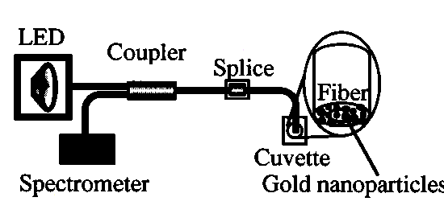
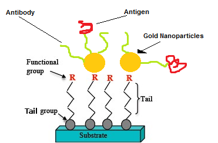
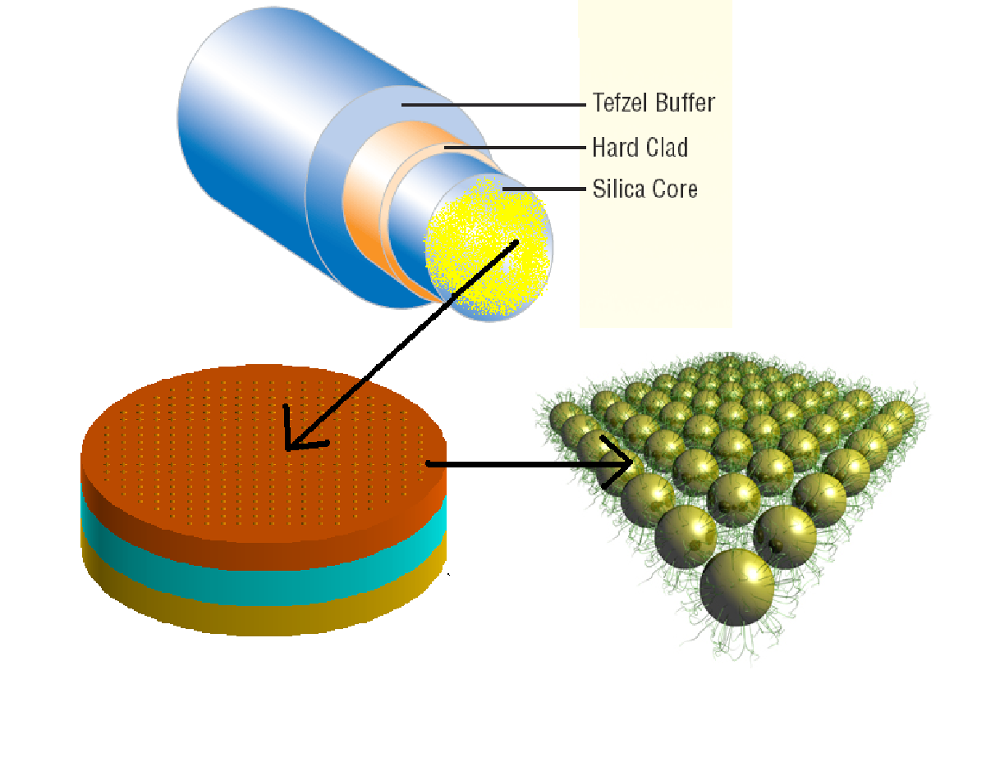
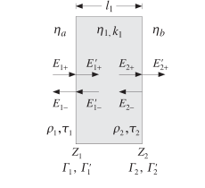

:author: Adam Hughes
:email: hugadams@gwmail.gwu.edu
:institution: The George Washington University

------------------------------------------------
Computational Tools for Fiber Optic Biosensing
------------------------------------------------

.. class:: abstract

   A novel fiber optic sensor is presented for measuring interactions between biomolecules and metallic nanoparticles.  First, some basic principles in biosensing and nanotechnology is discussed, followed by an introduction to our custom sensing apparatus.  Afterwards, a Python simulation environment for nanoparticle-based biosensors is presented, followed by an exposition on spectral data analysis within the current Python ecosystem.

.. class:: keywords

   nanoparticles, fiber optic, biosensor, python, immunoassay, plasmonics, proteins

Introduction
------------

Because of their unique optical properties, metallic colloids, especially gold nanoparticles (AuNPs), have found novel applications in biology.  Of these, nanobiosensing, or the incorporation of AuNPs as platforms for detecting proteins, DNA and other biomolecules, offers great promise.  In general, nanobiosensors are constructed by depositing metallic layers (bulk or colloids) onto a substrate such as glass[#]_, or in our case, onto a stripped optical fiber.  Once prepped, these sensors relay information about the environment in which they are immersed.  Such sensor designs mimic the behavior of conventional assays with the added benefits of increased sensitivity, smaller apparati, smaller sample sizes, low cost and the acquisition of real-time data.  Despite these benefits, nanobiosensing research is hindered by a few ubiquitous obstacles. 

Data from nanobiosensors are difficult to objectively compare between research groups, and sometimes even between experimental trials.  This is mainly because the output of customized sensing aparatii deviate both quantitatively and qualitatively from their conventional counterparts, and are highly sensitive to design parameters. Additionally, there is dearth of design protocols for optimizing sensor performance in general  These shortcomings have limited most custom apparatii to simplistic and trivial applications, negating utility over conventional and commercial technologies.   In the author's opinion, nanobiosensing results will not be comparable on an objective basis until at minimum the following criteria are met:
	1. A general quantitative modeling platform is developed that can handle the myriad of configurations and materials used to construct a nanobiosensor.
	2. User-friendly software for analyzing data from nanobiosensor simulations and experiments becomes available.

In regard to both items, analytical methods have been developed to interpret various aspects of a sensing experiment[9]_; however, they've yet to be translated into a general software framework.  Commercially available software for optical system design is available; however, is generally expensive and limited in applicability with nanoparticles, biomolecules and interactions therein.


Sensor Design
-------------

We have established a working benchtop setup which records rapid spectroscopic measurements via the return light from the end of a AuNP-coated optical fiber.  Research groups often deposit nanoparticles along the transversal end of an etched optical fiber[1]_[2]_[#]_.  In our setup, the nanoparticles are deposited on the flat endface of the fiber.  In either configuration, only the near-field interaction affects the signal, offering a large signal enhancement over far-field spectrascopic methods measurements.   The simple design is outlined in Fig. (:ref:`setup`).  Light from a bright LED is focused through a :math:`10 \times` objective (not shown) into a :math:`125 \mu m` core diameter optical fiber.  AuNP-functionalized probes are connected into the setup via an optical splice.  The probes are dipped into samples, and the return light is coupled into a spectrometer, which returns regularly spaced ordered series data.



   Current working bench-top return-light fiber sensor diagram, adapted from [3]_. :label:`setup`

16nm gold nanospheres are deposited covalently onto the optical fiber through the linker molecule, (3-Mercaptopropyl)trimethoxysilane, or MPTMS[#]_.  The surface chemistry of the gold is further modified based on the nature of the experiment.  One common modification is to covalently bind an a ligand to the gold particles Lomant's reagent (DSP), and then use the system to measure interactions to a specific antibody.  This is depicted in Fig (:ref:`antib')



Illustration of the various molecular constitutents at the fiber endface. :label:`antib`

Modeling the Optical System in Python
-------------------------------------

Nanobiosensing resides in a unique cross-section of optics, biology and material science.  To simulate such a system requires background in all three fields, and new tools to integrate the pieces seemlessly.  Nanobiosensors models must account for phenomena from three distinct length scales before superimposing the results.  From small to large, it is necessary to model:
	1. The optical properties of nanoparticles with various surface coatings.
	2. Light transmission through multiple material layers at the fiber endface.
	3. The effect of the optical configurations (e.g. where nanoparticles are deposited on the fiber, physical dimensions of the fibers etc...).




Three size regimes of the optical setup (top) optical fiber configuration, (left) thin film material interface, (right) nanoparticles with protein shells. :label:`system`

These distinct regions are shown in Fig (:ref:`system`) and will be discussed seperately, with one caveat: material parameters purvade all length scales.  As such, general classes have been created and interfaced to accomadate material datafiles and models.  This allows for a wide variety of experimental and theoretical materials to be easily incorporated into the simulation environment.

Modeling Nanoparticles
``````````````````````
To analyze gold nanoparticles, first the complex dielectric function_[#] of gold is imported from various sources, both from material models[5] and datasets[6]. The optical properties of bare and coated spheroids is described analytically by Mie theory[4].  Scattering coefficients are computed using spherical bessel functions from the scipy.special library of mathematical functions.  Special routines and packages are available for computing the optical properties of non-spheroidal colloids; however, they have not yet been incorporated in this analysis.  

Although simulating nanoparticles is straightforward, exploratory analysis therein is uncommon.  Enthought's Traits and Chaco packages are used extensively towards this end.  To exemplify this, consider the case in which one has constructed a gold nanoparticle with a shell of deposited proteins.  The optical properties of the core-shell particle may be obtained analytically using Mie Theory[#]_; however, analysis performed at a coarser scale requires this core-shell system to be approximated as a single composite particle.  With Traits, it is very easy for the user to interactively adjust the mixing method parameters to ensure the scattering properties of the aproximated composite are as close as posible to those of the analytical core-shell particle.  This is one of many examples in which interactivity is favorable over complicated optimization techniques.

.. figure:: ss.png

   Screenshot of simulation environment showing the analytical extinction spectra of a coated nanoparticle (blue) compared to an approximate core-shell composite particle (red). :label:`ss`

Modeling Material Layers
````````````````````````
The fiber endface at a more coarse resolution resembles a multilayered dielectric stack of homogenous materials[7], also referred to as a stacked thin film [see Fig. (:ref:`interface2`)].  In the limits of this approximation, the reflectance, transmittance and absorbance through the layers can be calculated recursively for n-layered systems.  Thin film optical software is commercially available and used extensively in optical design workflows, for example, in designing coatings for sunglasses.  Unfortunately, a free user-friendly alternative is hard to comeby[#]_.  In addition, these packages are usually not designed for compatibility with nanomaterials; therefore, we designed a fairly extensible thin film API that is compatible with nanoparticles.  This is ideal, for example, in simulating a fiber immersed in a solvent with a variable refractive index (e.g. a solution with changing salinity); the programs will ensure that as the solvent changes, the surrounding shell of the nanoparticle will also take this change into account, and the nanoparticle's extinction spectra will update accordingly.



   Dielectric slab showing the electric and magnetic at each dielectric interface[7]_. :label:`interface`

Optical Configurations and Simulation Environment
`````````````````````````````````````````````````
With the material and multilayer APIs in place, it is easy to incorporate an optical fiber platform.  The light source and fiber parameters determine the initial conditions for light entering the multilayer interface; thus, once the correct multilayered environment is established, it easy to compare performance between different fiber optic configurations.  This is very useful since many groups deposit material layers transversally along the optical fiber, rather than flat on the fiber endface.  Sensor performance can be directly compared between these configurations merely by shifting one parameter, the phase angle of the light rays incident on the interface, by :math:`90^\deg`[#]_.

The entire application was designed for exploratory analysis, so adjusting most parameters will automatically trigger system-wide updates accordingly.  To run simulations, one merely hijacks the Trait variables over which to iterate.  For example, by iterating over a range of values for the index of refraction of the AuNP shells, one effectively simulates materials binding to the AuNP's.  At each iteration, output it stored for all available data arrays, i.e., extinction spectra of the particles, dielectric functions of the mixed layers and total light reflectance at the interface.  All data output is formatted as ordered series to mimic the actual output of experiments; thus, they can be analyzed side-by-side without further processing.  With this workflow in place, it is quite easy to run experiments and simulations in parallel and to compare results across research groups.

Data Analysis
-------------

The workflow is designed so that both experiment and simulation output ordered series spectral data.  The Python packages, IPython, Traits and Pandas, synergistically facilitate swift and elegant data processing and visualization.  Our data is information-rich, both in the spectral and temporal dimensions.  For example, interactions that occur directly on the nanoparticle's surface as opposed overall changes in the system environment (e.g. a temperature change) stand out in their spectral profile.  Likewise, molecular binding events usually have a regular and predictable temporal distribution, setting them apart from environmental changes.  These recognizable temporal and spectral signatures serve as benchmarks and comprehension tools in more complex experiments.  When relying on these emerging patterns, visualization tools that retain spectral and temporal transparancy prove invaluable.  

A sophisticated way to analyze spectral series is through Two-Dimensional Correlation Analysis[8]_, which projects synchronous and asynchronous temporal events onto a contour map.  Using the so-called Noda's rules, one can interpret the temporal information and infer how an event unfolded in the system.  Although this technique is powerful and useful, it has two major drawbacks when applied to biosensing experiments.
	1.  Noda's rules change under different experimental and theoretical circumstances, so they are easy to misinterpret.
	2.  The temporal data becomes intractable for multiple events.  

In regard to the second point, most non-trivial biosensing experiments evolve in stages (binding, unbdinding, purging the sensor surface, etc...).  It is necessary to decompose a multi-stage dataset into its constituent phases, and because of high experimental variablity, this usually requires manual curation.  In pandas, slicing a set of ordered series data by rows (spectral dimension) and columns (temporal dimension) is extremely easy:

.. code-block:: python

   ## Read series data from tab-delimited file into a pandas DataFrame object
   from pandas import read_csv
   data=read_csv('path to file', sep='\t')  
	
   ## Select data by column index
   data[ ['time1', 'time2']]  

   ## Slice data by row label (spectral slicing)
   data.ix[500.0:750.0] #Slice wavelengths/rows by label

By interfacing to Chaco, and using Pandas's builtin Matplotlib interface, we can slice, resample and visualize interesting regions in the dataspace almost efforlessly.  

By sequestering the data into distinct subsets, it is actually quite easy to extract information.  One simple technique towards this end merely applys a sliding reference point and renormalizes the data each time the slice updates (see Fig :ref:`varplot`).  From this type of exploration, the overall timescale of events in the system naturally presents itself, which is necessary for improved optimization and interpretation. 

.. figure:: varplot.png

   Top: Absorbance data of an entire experiment referenced to the first time point.  Bottom: Time-sliced sample, re-referenced to the first timepoint in the subset.  A common spectral profile emerges, indicating the binding at the gold surface. :label:`varplot`


... Footnotes
..[#] The terms *nanobiosensor* and *assay* will be used interchangibly to describe this subclass of design platforms.  It should be noted that nanobiosensors in the context of this paper will refer to sensors based on the interaction of metallic colloids with light, technically plasmonic nanobiosensors would be categorically more accurate. 
..[#] Transversal deposition allows for more control of the fiber's optical properties; however, it makes probe creation more difficult and less reproducable. 
..[#] MPTMS is a heterobifunctional crosslinker, which binds covalently to the glass and gold through a silane tailgroup and a thiol headgroup, respectively.
..[#] The dielectric function and shape of an object is all that is required to model its absorption and scattering properties.
..[#] Assuming that the shell is perfectly modeled; however, in practice the optical properties of protein mixtures are approximated by a variety of mixing models and methods.
..[#] Thin film coating freeware is often limited in scope and seldom provides a user-interface, making an already complex physical system more convoluted.
..[#] The diameter of the optical fiber as well as the angle at which light rays interact with the material interface has a drastic effect on the system because each light mode contributes differently to the overall signal, which is the summation over all modes.

References
----------
.. [1]  Ching-Te Huang Chun-Ping Jen Tzu-Chien Chao. *A novel design of grooved fibers for fiber-optic localized plasmon resonance biosensors.*, 
           Sensors, 9:15, August 2009.
.. [2]   Wen-Chi Tsai Pi-Ju Rini Pai. *Surface plasmon resonance-based immunosensor with oriented immobilized antibody fragments on a mixed self-assembled monolayer for the determination of staphylococcal enterotoxin b.*, MICROCHIMICA ACTA, 166(1-2):115–122, February 2009.
.. [3] Mitsui Handa Kajikawa. *Optical fiber affinity biosensor based on localized surface plasmon resonance.*, 
	   Applied Physics Letters, 85(18):320–340, November 2004.
.. [4] Bohren Huffman.  *Absorption and scattering of light by small particles*, Wiley Publishing, 1983.
.. [5] Etchegoin Ru Meyer.  *An analytic model for the optical properties of gold.* The Journal of chemical Physics, 125, 164705, (2006).
.. [6] Christy Johnson.   *Optical Constants of Noble Metals.* Physics Review, 6 B:4370-4379, 1972.
.. [7] Orfanidis, Sophocles.  *Electromagnetic Waves and Antennas.* 2008
.. [8] Yukihiro Ozaki Isao Noda. *Two-Dimensional Correlation Spectroscopy.* Wiley, 2004.
.. [9] Anuj K. Sharma B.D. Gupta. *Fiber optic sensor based on surface plasmon resonance with nanoparticle films.* Photonics and Nanostructures - Fundamentals and Applications, 3:30,37, 2005.
