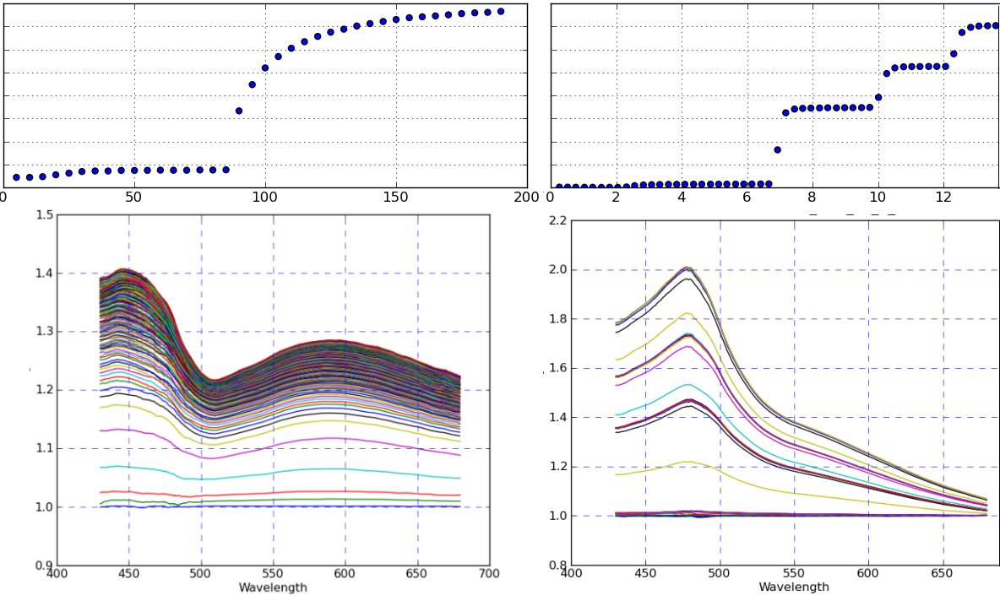

:author: Adam Hughes
:email: hugadams@gwmail.gwu.edu
:institution: The George Washington University

------------------------------------------------------
A Computational Framework for Plasmonic Nanobiosensing
------------------------------------------------------

.. class:: abstract

   Basic principles in biosensing and nanomaterials precede the introduction of a novel fiber optic sensor.  Software limitations in the biosensing domain are presented, followed by the development of a Python-based simulation environment. Finally, the current state of spectral data analysis within the Python ecosystem is discussed.

.. class:: keywords

   gold nanoparticles, fiber optics, biosensor, Python, immunoassay, plasmonics, proteins, metallic colloids, IPython, Traits, Chaco, Pandas, SEM, 

Introduction
------------

Because of their unique optical properties, metallic colloids, especially gold nanoparticles (AuNPs), have found novel applications in biology.  They are utilized in the domain of *nanobiosensing* as platforms for biomolecule recognition.  Nanobiosensing refers to the incorporation of nanomaterials into biosensing instrumentation.  Sensors whose primary signal transduction mechanism is the interaction of light and metallic colloids are known as *plasmonic* sensors. [*]_

Plasmonic sensors are constructed by depositing metallic layers (bulk or colloidal) onto a substrate such as glass, or in our case, onto a stripped optical fiber.  Upon illumination, they relay continuous information about their surrounding physical and chemical environment.  These sensors behave similarly to conventional assays with the added benefits of increased sensitivity, compact equipment, reduced sample size, low cost, and real-time data acquisition.  Despite these benefits, nanobiosensing research in general is faced with several hinderances. 

.. [*] This exposition is germane to plasmonic sensors moreso than to other nanobiosensor subgroups.

It is often difficult to objectively compare results between research groups, and sometimes even between experimental trials.  This is mainly because the performance of custom sensors is highly dependent on design specifics as well as experimental conditions.  The extensive characterization process found in commercial biosensors [*]_ exceeds the resources and capabilities of the average research group. This is partially due to a disproportionate investment in supplies and manpower; however, is also due to a dearth of computational resources.  The ad-hoc nature of emperical biosensor characterization often leads to asystematic experimental designs, implementations and conclusions between research groups.  To compound matters, dedicated software is not evolving fast enough keep up with new biosensing technology. This lends an advantage to commercial biosensors, which use highly customized software to both control the experimental apparatus and extract underlying information from the data. Without a general software framework to develop similar tools, it is unreasonable to expect the research community to achieve the same breadth in application when pioneering new nanobiosening technology.


.. [*] Biacore_:math:`^\copyright` and ForteBio_:math:`^\copyright` are examples of prominent nanobiosensing companies.

.. _Biacore: http://www.biacore.com/lifesciences/Application_Support/index.html?viewmode=printer

.. _ForteBio: http://www.fortebio.com/company_overview.html

Publications on novel biosensors often belaud improvement in sensitivity and cost over commercial alternatives; however, the aforementioned shortcomings relegate many new biosensors to prototype limbo.  Until the following two freeware components are developed, new biosensors, despite any technical advantages over their commercial counterparts, will fall short in applicability:

	1. A general and systematic framework for the development and objective quantification of nanobiosensors.
	2. Domain-tailored software tools for conducting simulations and interpreting experimental data.

In regard to both points, analytical methods have been developed to interpret various aspects of plasmonic sensing; [1]_ however, they have yet to be translated into a general software framework.  Commercial software for general optical system design is available; however, it is expensive and not designed to encompass nanoparticles and their interactions with biomolecules.  In the following sections, an effort to begin such computational endeavors is presented.  The implications are relevant plasmonic biosensing in general.


Optical Setup
-------------

We have developed an operational benchtop setup which records rapid spectroscopic measurements in the reflected light from the end of an AuNP-coated optical fiber. The nanoparticles are deposited on the flat endface of the fiber, in contrast to the commonly encountered method of depositing the AuNPs axially [*]_ along an etched region of the fiber. [2]_ [3]_   In either configuration, only the near-field interaction affects the signal, with no interference from far-field effects.   The simple design is outlined in Fig. :ref:`setup` (left).  Broadband emission from a white LED is focused through a :math:`10 {\bf \times}` objective (not shown) into the :math:`125 \mu \mbox{m}` core diameter of an optical fiber.  AuNP-coated probes are connected into the setup via an optical splice.  The probes are dipped into solutions containing biomolecules, and the return light is captured by an OceanOptics_:math:`^\copyright` USB2000 benchtop spectrometer and output as ordered series data.

.. figure:: sensor.png
   :scale: 35

   Left: Bench-top fiber optic configuration schematic, adapted from [4].  Right: Depiction from bottom to top of fiber endface, APTMS monolayer, AuNPs, antibody-antigen coating. :label:`setup`

.. _OceanOptics: http://www.oceanoptics.com/

.. [*] Axial deposition allows for more control of the fiber's optical properties; however, it makes probe creation more difficult and less reproducible. 


Fiber Surface Functionalization
-------------------------------

16nm gold nanospheres are attatched to the optical fiber via a linker molecule, (3-Aminoptopropyl)trimethoxysilane, or APTMS. [*]_  The surface chemistry of the gold may be further modified to the specifications of the experiment.  One common modification is to covalently bind a ligand to the AuNPs using Dithiobis[succinimidyl propionate] (Lomant's reagent), and then use the fiber to study specificity in antibody-antigen interactions.  This is depicted in Fig. :ref:`setup` (right).

.. [*] APTMS is a heterobifunctional crosslinker that binds strongly to glass and gold respectively through silane and amine functional groups.


Modeling [*]_ the Optical System in Python
------------------------------------------

.. [*] The simulation codebase_ is generously hosted through GitHub_.

.. _codebase: http://hugadams.github.com/fibersim
.. _GitHub: http://github.com


Nanobiosensing resides at a intersection of optics, biology, and material science.  To simulate such a system requires background in all three fields and new tools to integrate the pieces seamlessly.  Nanobiosensor modeling must describe phenomena at three distinct length scales.  In order of increasing length, these are:

	1. A description of the optical properties of nanoparticles with various surface coatings.
	2. The properties of light transmission through multi-layered materials at the fiber endface.
	3. The geometric parameters of the optics (e.g. fiber diameter, placement of nanoparticle monolayer, etc.).


.. figure:: system.png
   :scale: 15

   Three size regimes of the optical setup.  Top: Optical fiber with an AuNP-coated endface.  Left: Coarse approximation of a multilayered material. Right: Individual nanoparticles with protein shells. :label:`system`

The size regimes, shown in Fig. :ref:`system`, will be discussed separately in the following subsections. It is important to note that the computational description of a *material* is identical at all three length scales.  As such, general classes have been created and interfaced to accommodate material properties from datasets [5]_ and models [6]_.  This allows for a wide variety of experimental and theoretical materials to be easily incorporated into the simulation environment.

Modeling Nanoparticles
``````````````````````
AuNPs respond to their surrounding environment through a phenomenon known as *surface plasmon resonance*.  Incoming light couples to free electrons and induces surface oscillations on the nanoparticle.  The magnitude and dispersion of these oscillations is highly influenced by the dielectric media in direct contact with the particle's surface.  As such, the scattering and absorption properties of the gold particles will change in response to changes in solution, as well as to the binding of biomolecules.  

To model AuNPs, the complex dielectric function [*]_ of gold is imported from various sources, both from material models [5]_ and datasets. [6]_ The optical properties of bare and coated spheroids are described analytically by Mie theory. [7]_  Scattering and absorption coefficients are computed using spherical Bessel functions from the *scipy.special* library of mathematical functions.  Special routines and packages are available for computing the optical properties of non-spheroidal colloids; however, they have not yet been incorporated in this package.  

.. [*] The dielectric function and shape of the particle are the only parameters required to compute its absorption and scattering cross sections.

AuNP modeling is straightforward; however, parametric analysis is uncommon.  Enthought_'s ``Traits`` and ``Chaco`` packages are used extensively to provide interactivity.  To demonstrate a use case, consider a gold nanoparticle with a shell of protein coating.  The optical properties of the core-shell particle may be obtained analytically using Mie Theory; [*]_ however, analysis performed at a coarser scale requires this core-shell system to be approximated as a single composite particle (Fig. :ref:`comp`).  With ``Traits``, it is very easy for the user to interactively adjust the mixing parameters to ensure that the scattering properties of the approximated composite are as close as possible to those of the analytical core-shell particle.  In this example, and in others, interactivity is favorable over complex optimization techniques.

.. [*] Assuming that the shell is perfectly modeled; however, in practice the optical properties of protein mixtures are approximated by a variety of mixing models and methods.

.. figure:: comp_nps.png
   :scale: 50

   Left: A nanoparticle with heterogeneous core and shell dielectrics :math:`(\epsilon_1, \epsilon_2)`, of radius, :math:`r=r_1 + r_2`.  Right: Composite approximation of a homogeneous material, with effective dielectric :math:`\epsilon^\prime`, and radius, :math:`r^\prime`. :label:`comp`

.. figure:: ss.png
   :width: 250
   :height: 175

   Screenshot of an interactive ``TraitsUI`` program for modeling the scenario in Fig. :ref:`comp`: the extinction spectra of a protein-coated AuNP (blue) compared to that of an equivalent core-shell composite  (red). :label:`ss`

Modeling Material Layers
````````````````````````
The fiber endface at a more coarse resolution resembles a multilayered dielectric stack of homogeneous materials, also referred to as a thin film (Fig. :ref:`interface`).  In the limits of this approximation, the reflectance, transmittance, and absorbance through the slab can be calculated recursively for n-layered systems. [8]_  Thin film optical software is commercially available and used extensively in optical engineering, for example, in designing coatings for sunglasses.  Unfortunately, a free, user-friendly alternative is not available. [*]_  In addition, these packages are usually not designed for compatibility with nanomaterials; therefore, we have begun development of an extensible thin film Python API that incorporates nanomaterials.  This is ideal, for example, in simulating a fiber immersed in a solvent with a variable refractive index (e.g. a solution with changing salinity).  The program will ensure that as the solvent changes, the surrounding shell of the nanoparticle, and hence its extinction spectra, will update accordingly.

.. [*] Open-source thin film software is often limited in scope and seldom provides a user-interface, making an already complex physical system more convoluted.


.. figure:: interface_complex.png
   :scale: 80

   Left: Electromagnetic field components at each interface of a dielectric *slab* [7].  Right: Illustration of a multilayered material whose optical properties would be described by such treatment. :label:`interface`

Optical Configurations and Simulation Environment
`````````````````````````````````````````````````
With the material and multilayer APIs in place, it is straightforward to incorporate an optical fiber platform.  The light source and fiber parameters merely constrain the initial conditions of light entering the multilayer interface; thus, once the correct multilayered environment is established, it easy to compare performance between different fiber optic configurations.  Built-in parameters already account for the material makeup and physical dimensions of many commercially available optical fibers.  A phase angle has been introduced to distinguish nanomaterial deposition on the fiber endface from axial deposition.  This amounts to a :math:`90^{\circ}` rotation of the incident light rays at the multilayered interface. [*]_ 

.. [*] The diameter of the optical fiber as well as the angle at which light rays interact with the material interface has a drastic effect on the system because each light mode contributes differently to the overall signal, which is the summation over all modes.

The entire application was designed for exploratory analysis, so adjusting most parameters will automatically trigger system-wide updates.  To run simulations, one merely automates setting ``Trait`` attributes in an iterative manner.  For example, by iterating over a range of values for the index of refraction of the AuNP shells, one effectively simulates materials binding to the AuNPs.  After each iteration, ``Numpy`` arrays are stored for the updated optical variables such as the extinction spectra of the particles, dielectric functions of the mixed layers, and the total light reflectance at the interface.  All data output is formatted as ordered series to mimic the actual output of experiments; thus, simulations and experiments can be analyzed side-by-side without further processing.  With this work flow, it is quite easy to run experiments and simulations in parallel as well as compare a variety of plasmonic sensors objectively.

Data Analysis
-------------

Our work flow is designed to handle ordered series spectra generated from both experiment and simulation.  The Python packages ``IPython``, ``Traits``, and ``Pandas`` synergistically facilitate swift data processing and visualization.  Biosensing results are information-rich, both in the spectral and temporal dimensions.  Molecular interactions on the AuNP's surface have spectral signatures discernible from those of environmental changes.  For example, the slow timescale of protein binding events is orders of magnitude less than the rapid temporal response to environmental changes. 



   Temporal evolution (top) and spectral absorbance (bottom) of the light reflectance at the fiber endface due to a protein-protein interaction (left) as opposed to the stepwise addition of glycerin (right). :label:`glyc`

Fig. :ref:`glyc` illustrates a fiber whose endface has been coated with gold nanoparticles and subsequently immersed in water.  The top left plot shows the reflected light spectrum function of time.  When submerged in water, the signal is very stable. Upon the addition of micromolar concentrations of Bovine Serum Albumin (BSA), the signal steadily increases as the proteins in the serum bind to the gold.  About an hour after BSA addition, the nanoparticle binding sites saturate and the signal plateaus.

Fig. :ref:`glyc` (top right) corresponds to a different situation.  Again, an AuNP-coated fiber is immersed in water.  Instead of proteins, glycerin droplets are added.  The fiber responds to these refractive index changes in an abrupt, stepwise fashion.  Whereas the serum binding event evolves over a timescale of about two hours, the response to an abrupt environmental change takes mere seconds.  This is a simple demonstration of how timescale provides insights to the physiochemical nature of the underlying process.

The dataset's spectral dimension can be used to identify physiochemical phenomena as well.  Absorbance plots corresponding to BSA binding and glycerin addition are shown at the bottom of Fig. :ref:`glyc`.  These profiles tend to depend on the size of the biomolecules in the interaction.  The spectral profile of BSA-AuNP binding, for example, is representative of other large proteins binding to gold.  Similarly, index changes from saline, buffers and other viscous solutions are consistent with the dispersion profile of glycerin.  Small biomolecules such as amino acids have yet another spectral signature (not shown), as well as a timestamp that splits the difference between protein binding and refractive index changes.  This surprising relationship between the physiochemistry of an interaction and its temporal and spectral profiles aids in the interpretation of convoluted results in complex experiments.


.. figure:: varplot.png
   :height: 160
   :width: 250

   Top: Absorbance plot of the real-time deposition of AuNPs onto an optical fiber.  Bottom: Time-slice later in the datasets shows that the signal is dominated by signal at the surface plasmon resonance peak for gold, :math:`\lambda_{\mbox{SPR} } \approx 520 \; \mbox{nm}`.  The exemplifies the correct timescale over which spectral events manifest.  :label:`varplot`

Consistent binding profiles require similar nanoparticle coverage between fibers.  If the coating process is lithographic, it is easier to ensure consistent coverage; however, many plasmonic biosensors are created through a *wet* crosslinking process similar to the APTMS deposition described here.  Wet methods are more susceptible to extraneous factors; yet remarkably, we can use  the binding profile as a tool to monitor and control nanoparticle deposition in realtime.

Fig. :ref:`varplot` (top) is an absorbance plot of the deposition of gold nanoparticles onto the endface of an optical fiber (dataset begins at :math:`y=1`).  As the nanoparticles accumulate, they initially absorb signal, resulting in a drop in light reflectance; however, eventually the curves invert and climb rapidly.  This seems to suggest the existence of a second process; however, simulations have confirmed that this inflection is merely a consequence of the nanoparticle film density and its orientation on the fiber.  The spectral signature of the AuNP's may be observed by timeslicing the data (yellow curves) and renormalizing to the first curve in the subset.  This is plotted in Fig. :ref:`varplot` (bottom), and clearly shows spectral dispersion with major weight around :math:`\lambda=520` nm, the surface plasmon resonance peak of our gold nanoparticles.  

This approach to monitoring AuNP deposition not only allows one to control coverage, [*]_ but also provides information on deposition quality.  Depending on various factors, gold nanoparticles may tend to aggregate into clusters, rather than form a monolayer.  When this occurs, red-shifted absorbance profiles appear in the timeslicing analysis.  Because simple plots like Fig. :ref:`varplot` contain so much quantitative and qualitative information about nanoparticle coverage, we have begun an effort to calibrate these curves to measured particle coverage using scanning electron microscopy (SEM) (Fig. :ref:`sem`).  

.. [*] The user merely removes the fiber from AuNP when the absorbance reaches a preset value.

The benefits of such a calibration are two-fold. First, it turns out that the number of AuNP's on the fiber is a crucial parameter for predicting relevant biochemical quantities such as the binding affinity of two ligands.  Secondly, it is important to find several coverages that optimize sensor performance.  There are situations when maximum dynamic range at low particle coverage is desirable, for example in measuring non-equilibrium binding kinetics.  Because of mass transport limitations, estimations of binding affinity tend to be in error for densely populated monolayers.  In addition, there are coverages that impair dynamic range.  Thus, it is important to optimize and characterize sensor performance at various particle coverages.   Although simulations can estimate this relationship, it should also be confirmed experimentally. 


   SEM images of fiber endfaces with 25% (left) and 5% (right) AuNP surface coverage at 30,000 X magnification. :label:`sem`

Since most non-trivial biosensing experiments contain multiple phases (binding, unbinding, purging of the sensor surface, etc.), the subsequent data analysis requires the ability to rescale, resample and perform other manual curations on-the-fly.  ``Pandas`` provides a great tool set for manipulating series data in such a manner.  For example, slicing a set of ordered series data by rows (spectral dimension) and columns (temporal dimension) is quite simple:

.. code-block:: python

   ## Read series data from tab-delimited 
   ## file into a pandas DataFrame object
   from pandas import read_csv
   data=read_csv('path to file', sep='\t')  
	
   ## Select data by column index
   data[['time1', 'time2']]  

   ## Slice data by row label (wavelength)
   data.ix[500.0:750.0]

By interfacing to ``Chaco``, and to the ``Pandas`` plotting interface, one can slice, resample and visualize interesting regions in the dataspace quite easily.  Through these packages, it is possible for non-computer scientists to not just visualize, but to dynamically *explore* the dataset.  The prior examples of BSA and glycerin demonstrated just how much information could be extracted from the data using only simple, interactive methods.  

our interactive approach is in contrast to popular *all-in-one* analysis methods.  In Two-Dimensional Correlation Analysis (2DCA), [9]_ for example, cross correlations of the entire dataset are consolidated into two contour plots.  These plots tend to be difficult to interpret, [*]_ and become intractable for multi-staged events.  Additionally, under certain experimental conditions they cannot be interpreted at all.  It turns out that much of the same information provided by 2DCA can be ascertained using the simple, dynamic analysis methods presented here.  This is not to suggest that techniques like 2DCA are disadvantageous, merely that some of the results may be obtained more simply.  Perhaps in the future, transparent, interactive approaches will constitute the core of the spectral data analysis pipeline with sophisticated techniques like 2DCA adopting a complimentary role.

.. [*] 2DCA decomposes series data into orthogonal synchronous and asynchronous components. By applying the so-called Noda's rules, one can then analyze the resultant contour maps and infer information about events unfolding in the system.
 

Conclusions
-----------
A benchtop nanobiosensor has been developed for the realtime detection of biomolecular interactions.  It, as well as other emergent biosensing technologies, is hindered by a lack of dedicated open-source software.  In an effort to remedy this, prototypical simulation and analysis tools have been developed to assist with our plasmonic sensor and certainly have the potential for wider applicability.  Scientific Python libraries, especially ``Chaco`` and ``Pandas``, reside at the core of our data analysis toolkit and are proving invaluable for interacting with and visualizing results.  Unexpected physiochemical identifiers appear consistently within experimental results.  These binding profiles not only provide new qualitative insights, but with the help of SEM imaging, may soon open new avenues towards the difficult task of quantifying biosensor output.  Python has proven invaluable to our research, and just as it has suffused the domains of astronomy and finance, seems primed to emerge as the de-facto design platform in biosensing and its related fields.   
 
-----------------------------------------------------------------------

Acknowledgements
----------------
I would like to thank my advisor, Dr. Mark Reeves, for his devoted guidance and support.  I owe a great debt to Annie Matsko for her dedication in the lab and assistance in drafting this document.  In regard to the programming community, I must foremost thank Enthought_ and the other sponsors of the SciPy2012 conference.  Their generous student sponsorship program made it possible for me to attend for that I am gracious.  Although indebted to countless members of the Python community, I must explicitly thank Jonathan March, Robert Kern and Stéfan van der Walt for their patience in helping me through various programming quandries.  Thank you De-Hao Tsai and Vincent Hackley at the Material Measurement Laboratory at NIST for your helpful discussions and allowing our group to use your zeta-potential instrumentation.  Finally, I must thank the George Gamow Research Fellowship Program, the Luther Rice Collaborative Research Fellowship program, and the George Washington University for the Knox fellowship for generous financial support. 

.. _Enthought: http://www.enthought.com/

Referenced Works   
----------------
.. [1] Anuj K. Sharma B.D. Gupta. *Fiber Optic Sensor Based on Surface Plasmon Resonance with Nanoparticle Films.* Photonics and Nanostructures - Fundamentals and Applications, 3:30,37, 2005.

.. [2] Ching-Te Huang Chun-Ping Jen Tzu-Chien Chao. *A Novel Design of Grooved Fibers for Fiber-optic Localized Plasmon Resonance Biosensors.*, 
           Sensors, 9:15, August 2009.

.. [3] Wen-Chi Tsai Pi-Ju Rini Pai. *Surface Plasmon Resonance-based Immunosensor with Oriented Immobilized Antibody Fragments on a Mixed Self-Assembled Monolayer for the Determination of Staphylococcal Enterotoxin B.*, MICROCHIMICA ACTA, 166(1-2):115–122, February 2009.

.. [4] Mitsui Handa Kajikawa. *Optical Fiber Affinity Biosensor Based on Localized Surface Plasmon Resonance.*, 
	   Applied Physics Letters, 85(18):320–340, November 2004.

.. [5] Etchegoin Ru Meyer.  *An Analytic Model for the Optical Properties of Gold.* The Journal of Chemical Physics, 125, 164705, 2006.

.. [6] Christy, Johnson.   *Optical Constants of Noble Metals.* Physics Review, 6 B:4370-4379, 1972.

.. [7] Bohren Huffman.  *Absorption and Scattering of Light by Small Particles*, Wiley Publishing, 1983.

.. [8] Orfanidis, Sophocles.  *Electromagnetic Waves and Antennas.* 2008

.. [9] Yukihiro Ozaki Isao Noda. *Two-Dimensional Correlation Spectroscopy.* Wiley, 2004.

