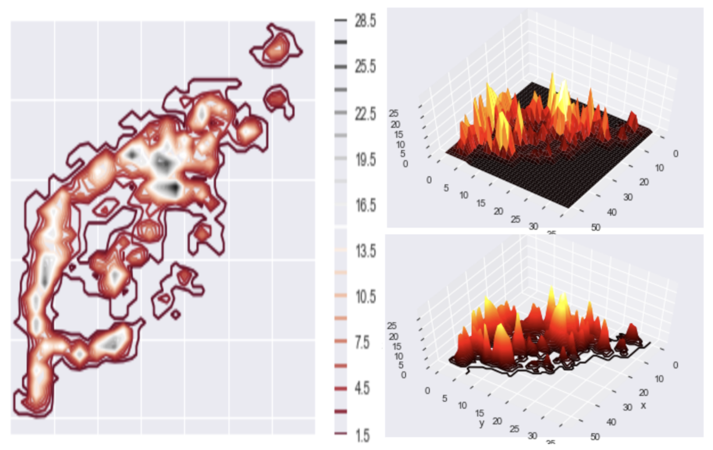
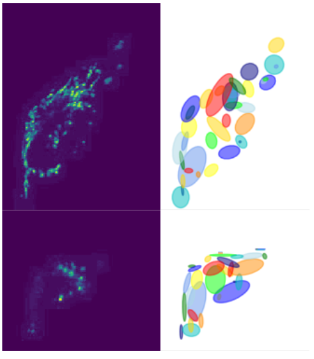
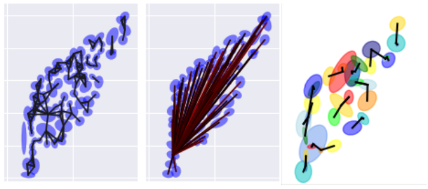
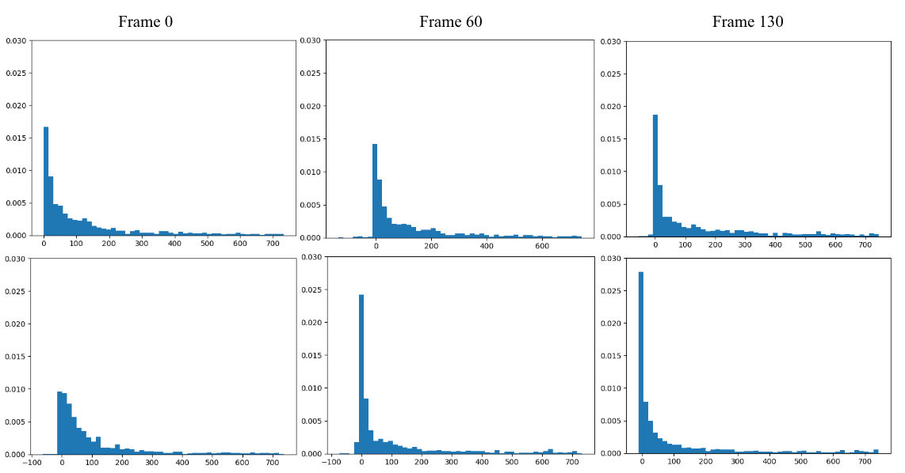

:author: Andrew Durden
:email: andrewdurden@uga.edu
:institution: Department of Computer Science, University of Georgia, Athens, GA 30602 USA

:author: Allyson T Loy
:email: allyson.loy@uga.edu
:institution: Department of Microbiology, University of Georgia, Athens, GA 30602 USA

:author: Barbara Reaves
:email: bjreaves@uga.edu
:institution: Department of Infectious Diseases, University of Georgia, Athens, GA 30602 USA

:author: Mojtaba Fazli
:email: Mojtaba@uga.edu
:institution: Department of Computer Science, University of Georgia, Athens, GA 30602 USA

:author: Abigail Courtney
:email: abigail.courtney@uga.edu
:institution: Department of Microbiology, University of Georgia, Athens, GA 30602 USA

:author: Frederick D Quinn
:email: fquinn@uga.edu
:institution: Department of Infectious Diseases, University of Georgia, Athens, GA 30602 USA

:author: S Chakra Chennubhotla
:email: chakracs@pitt.edu
:institution: Department of Computational and Systems Biology, University of Pittsburgh, Pittsburgh, PA 15232 USA

:author: Shannon P Quinn
:email: spq@uga.edu
:institution: Department of Computer Science, University of Georgia, Athens, GA 30602 USA
:institution: Department of Cellular Biology, University of Georgia, Athens, GA 30602 USA
:corresponding:
:bibliography: mybib

-------------------------------------------------------------------
Dynamic Social Network Modeling of Diffuse Subcellular Morphologies
-------------------------------------------------------------------

.. class:: abstract

The use of fluorescence microscopy has led to the development of new technologies and quantitative modeling approaches as biomedical imaging data has become amenable to analysis through computer vision and machine learning methods. Extracting and modeling quantitative knowledge of biological systems has become more common, and many molecular and cellular phenotypes can now be automatically characterized. However, much of this work is still nascent; in particular, there are a number of approaches to modeling spatial patterns of solid morphologies, such as cell membranes or nuclei, but considerably fewer approaches to modeling diffuse organellar patterns such as mitochondria or actin. Furthermore, little work has focused on the development of spatiotemporal models that capture the relationships between spatial quantities--size, shape, and distribution--as functions of time. Such models are extremely useful for characterizing conditional events, such as the addition of a toxin or invasion by a pathogen.
Here, we discuss initial work into building spatiotemporal models of diffuse subcellular morphologies, specifically the mitochondrial protein patterns of alveolar cells. We leverage principles of graph theory and consider the mitochondrial patterns an instance of a social network: a collection of vertices interconnected by edges, indicating spatial relationships. By studying the changing topology of the social networks over time, we gain a statistical understanding of the types of stresses imposed on the mitochondria by external stimuli, and can relate these effects in terms of graph theoretic quantities such as centrality, connectivity, and flow. We demonstrate how the gradients of the graph Laplacian underlying the social network, and the changes in its principal components, can yield biologically-meaningful interpretations of the evolving morphology. Our primary goal is the development of a bioimaging toolbox, built from existing open source packages in the scientific Python ecosystem (SciPy, NumPy, scikit-image, OpenCV), which builds dynamic social network models from time series fluorescence images of diffuse subcellular protein patterns, enabling a direct quantitative comparison of network structure over time and between cells exposed to different conditions.

.. class:: keywords

Biomedical Imaging, Graph Theory, Social Networks

Introduction
------------

Given the recent rise of fluorescence microscopy, live cell footage has become much more accessible. This increase in subcellular biomedical imaging data has lead to a heavy analysis of organelles with solid structure. However, the growth in modeling and classification of solid morphologies has created a large and growing gap in our ability to autonomously quantify subcellular structures of diffuse morphology, organelles and proteins like mitochondria and actin.

Being able to not only quantify the structure of a protein, but also it’s change over time using both spatial and temporal covariance, can lead to understanding the protein’s relationship with environmental variables like toxins or bacteriophages. Recently, spatial covariance has been used to quantify gene expression correlation in image like matrices representing sequenced RNA :cite:`Svensson143321`. We look to focus on both spatial and temporal covariance to achieve our goal of protein behavior quantification through the novel employ of social network analogues. A recent study of brain activity used networks to create a quantitative measure of correlated activity in fMRI images which could then easily be clustered :cite:`Drysdale4246`. There are many advantages of using a social network metric to model diffuse structures. It allows for not only the overall form of the morphology to impact the quantitative analysis, but also for the diffuseness property to influence the connectivity of the network. The heavily studied field of social network and graph theory also opens opportunity for a varied analysis of the analogue once it has been modeled.

We have begun by modeling the subcellular patterns of mitochondria in epithelial cells. Mitochondria are dynamic organelles, which undergo continual rounds of fission and fusion. These fission and fusion events are important for maintaining proper function and overall mitochondrial health :cite:`ZLN13` :cite:`WT16`. Mitochondrial fission allows for the turnover of damaged and the protection of healthy organelles. Additionally, mitochondrial fusion leads to the mixing of internal contents, which is important for responding to environmental needs :cite:`ZLN13` :cite:`KPSB08`.

The dynamics between fission and fusion creates a spectrum of mitochondrial morphologies. Further, imbalances between fission and fusion events generate phenotypes associated with mitochondrial dysfunction :cite:`ZLN13`. An excess of fission or dearth of fusion events results in fragmented mitochondria. In the fragmented phenotype, the mitochondrial network is fractured, and individual mitochondria exist in small spheres. However, an overabundance of fusion or a lack of fission events generate hyperfused mitochondria. In the hyperfusion phenotype, the mitochondrial network is overconnected, and composed of long interconnected tubules :cite:`CCI08`.

Recently, several bacterial species have been shown to cause mitochondrial perturbations during infection :cite:`SBSRC11`:cite:`FGQR15`. Through social network modeling, we hope to build a more rapid and efficient method for identifying changes in size, shape, and distribution of mitochondria as well as other diffuse organelles.

Data
----

We have constructed a library of live imaging videos that display the full spectrum of mitochondrial morphologies in HeLa cells, from fragmented to hyperfused. To visualize the mitochondria, HeLa cells were stably transfected with DsRed2-Mito-7 (DsRed2-HeLa), which fluorescently labels mitochondria red (a gift from Michael Davidson, Addgene plasmid #55838). All of our videos were taken using a Nikon A1R Confocal. Cells were kept in an imaging chamber that maintained 37 degrees C and 5% CO2 for the duration of imaging. The resonant scanning head was utilized to capture an image every ten seconds for the length of the video. The resulting  raw videos  have more than 20,000 frames per video. Each frame is of dimensions of 512x512 pixels :ref:`fig1`.

.. figure:: morpho.png

   Sample frames from each of the subsets of data. Left) LLO induced mitochondrial fragmentation Center) Wild type HeLa mitochondrial morphology Right) Mdivi-1 induced mitochondrial hyperfusion :label:`fig1`

Wild type mitochondrial morphology was captured by imaging DsRed2-HeLa cells in typical growth medium (DMEM plus 10 % fetal bovine serum)(:ref:`fig1`, center). To generate the fragmented phenotype, cells were exposed to the pore-forming toxin listeriolysin O (LLO) at a final concentration of 6 nM (:ref:`fig1`, left). Mitochondrial hyperfusion was induced through the addition of mitochondria division inhibitor-1 (mdivi-1) at a final concentration of 50µM (:ref:`fig1`, right). These subsets with different known qualitative phenotypes serve as bases upon which to condition our quantitative analyses.

Segmentation Pipeline
---------------------

While our initial input videos contain a range of cell quantities, in order for our analysis to be unbiased to the number of cells in a frame, we chose to study each cell individually. To do that we need to segment each cell. While segmentation of fluorescence microscopy images is becoming very common, this dataset has the added difficulty of the diffuse nature of the mitochondrial protein. Considering the fact that we have minimal movement between consecutive frames, we can use deformable contours with slight changes from the previous frame to build out masks. However, the diffuse structure combined with the near overlap of cells in frames makes the first mask difficult to generate autonomously. Thus, our first step, was to use ITK-SNAP software to label each cell manually in the first frame of each video. The output of this step will be VTK file (:ref:`fig2` top left).

.. figure:: seg.png

   Diagram Representing segmentation process. (Top left) Hand drawn masks of the first frame in VTK format which are used to seed the segmentation. (Top right) a series of frames from a single video with autonomously drawn contours. (Mid) Stack of frames from a single video converted to separate videos for each cell. (Bottom) single cell video unraveled as grayscale image for frame by frame network modeling. :label:`fig2`

Our segmentation process uses this VTK as a seed, then deforms the mask through an iterative dilation, thresholding, and contour detection process over the entire video resulting in a set of masks for each frame. These masks can then be used to pull out single cells over the course of the video (:ref:`fig2`). While this process was very effective at following the cells which diminished in size, we occasionally would find our model losing small discrete areas of protein mass which diverged from the more contiguous structure. To avoid this loss we added a final process of iterative dilation to prevent loss and give a more generous contour. With these adjustments, we ran into a rare problem of cell contact or overlap. In response we continued the iterative dilation with more iterations and smaller dilations checking for overlap each iteration. In the case of an overlap, which would only be a few pixels with the small dilation kernel, we used a simple xor to remove the few overlapping pixels while still allowing the mask to expand in areas uncontested by other cells. With this case being rare, we found the process more often than not followed any visible boundary between the adjacent cell.

Once we’d created a series of masks for each cell over each frame we were able to begin engineering the social network topology to create quantitative representations of the protein’s spatial behavior over the time captured in the video.

Social Network Engineering
--------------------------

To quantitatively study the spectrum of mitochondrial morphologies as well as changes between these morphologies, we needed to develop the process by which a social network is created. Our approach was to first determine nodes of our network, then follow with an affinity function to determine connectedness of the formulated nodes.

    (left) a 2D probability representation of the intensity of a sample cell. (top right) the Intensity map of the image in a 3D representation. (bottom right) the 3D contour of the same cell. :label:`fig3`

To determine our network’s nodes we viewed each frame of our videos as a normalized surface in three-dimensional euclidean space representing a bivariate probability density function of the protein structure (:ref:`fig3`). In the analogous bivariate probability density function, the pixel intensity represents the probability value of that pixel’s location in the overall protein structure. We then applied a Gaussian Filter to remove artifacts from image capture which may create false spikes in the image. After application of the filter we counted local maxima. We then used the Gaussian Mixture Model from Scikit-Learn to generate clusters over our image (:ref:`fig4`), the number of which was determined by the number of local maxima on the probability density surface. The clusters generated by the gaussian mixture model as a whole approximate the image data while individually serving as discrete regions of the protein clustered by density. Using the mean and covariances of these clusters as nodes in the network allow for the network structure to be learned purely from the protein’s topology.

In order to generate the pdf from our image data and generate our nodes we used the following functions:

.. code-block:: python

    def img_to_px(image):
        """
        Converts the image to a probability
        distribution amenable to GMM.

        Parameters
        ----------
        image : array, shape (H, W)
            8-bit grayscale image.

        Returns
        -------
        X : array, shape (N, 2)
        The data.
        """
        # We need the actual 2D coordinates of the
        #pixels.
        #The following is fairly standard practice for
        #generating a grid
        #of indices, often to evaluate some function on
        #a discrete surface.
        x = np.arange(image.shape[1])
        y = np.arange(image.shape[0])
        xx, yy = np.meshgrid(x, y)

        # Now we unroll the indices and stack them into
        #2D (i, j) coordinates.
        z = np.vstack([yy.flatten(), xx.flatten()]).T

        # Finally, we repeat each index by the number
        # of times of its pixel value.
        # That is our X--consider each pixel an
        #"event", and its value is the
        # number of times that event is observed.
        X = np.repeat(z, image.flatten(), axis = 0)
        return X

    def skl_gmm(vid, vizual = False, skipframes = 10,
        threshold_abs = 6, min_distance = 10):
        """
        Runs a warm-start GMM over evenly-spaced
        frames of the video.

        Parameters
        ----------
        vid : array, shape (f, x, y)
            Video, with f frames and spatial
            dimensions x by y.
        vizual : boolean
            True will show images and nodes
            (default: False).
        skipframes : integer
            Number of frames to skip (downsampling
            constant).

        Returns
        -------
        covars : array, shape (f, k, 2, 2)
            The k covariance matrices (each 2x2)
            for each of f frames.
        means : array, shape (f, k, 2)
            The k 2D means for each of f frames.
        """
        img = vid[0]
        if(vizual):
            plt.imshow(img)
            plt.show()
        X = image.img_to_px(img)
        PI, MU, CV = params.image_init(img, k = None,
            min_distance = min_distance,
            threshold_abs = threshold_abs)
        PR = np.array(list(map(sla.inv, CV)))
        gmmodel = GaussianMixture(n_components = CV.shape[0],
            weights_init = PI, means_init = MU,
            precisions_init = PR)
        gmmodel.fit(X)
        if(vizual):
            viz.plot_results(gmmodel.means_,
                gmmodel.covariances_, 0, img.shape[1], 0,
                img.shape[0], 0, 'this')

        covars = [gmmodel.covariances_]
        means = [gmmodel.means_]

        #set warm start to true to use previous parameters
        gmmodel.warm_start = True

        for i in range(1+skipframes, vid.shape[0], skipframes):
            img = vid[i]
            if(vizual):
                plt.imshow(img)
                plt.show()

            X = image.img_to_px(img)
            gmmodel.fit(X)
            covars = np.append(covars,
                [gmmodel.covariances_], axis = 0)
            means = np.append(means,
                [gmmodel.means_],axis = 0)
            if(vizual):
                viz.plot_results(gmmodel.means_,
                    gmmodel.covariances_,0, img.shape[1],
                    0, img.shape[0], 0, 'this')

        return means,covars

    A cell (left) and the nodes (right) as generated by a gaussian mixture model for the first (top) and last (bottom) frames of a video showing a cell fragmented by LLO :label:`fig4`

With the process for determining our nodes laid out all that was left was determining our affinity function. As a quick first best effort we set the weight to the percentage of the straight line connecting each node that is within the area of the node as determined by the component’s covariance (:ref:`fig5`, mid). Our second early effort at determining the connectedness of connections was to set a threshold determined by the spread of a component and those nodes within that spread were considered connected (:ref:`fig5`, left).

However, with our affinity function we wanted the angular spread of the gaussians to have a large impact on the weight of the connection, as opposed to looking just at the euclidean distance between the means. As a result we settled on using the probability of the presence of the mean of Node A in the gaussian describing Node B as our affinity from A to B (:ref:`fig5`, right). This alone results in an asymmetric affinity_matrix, however it could easily be made symmetric by adding the affinity matrix to its transpose.

    (Left) A partially connected network with binary connections. (Right) A single node’s weighted connection within a fully connected graph :label:`fig5`

Many well known social networks have asymmetric connections. For example, there are Twitter and Instagram, in which one member may follow another without being followed back. Even Facebook, which has a symmetric ‘friend’ connection has asymmetric weights in terms of how friends interact over the network. From a mitochondria specific biological perspective, there is little behavioral evidence to support an directed or undirected graph structure. However with a cell’s general Brownian behavior, the undirected structure seem more analogous. This element of the our graph analogue’s structure will be more cemented as we analyze the networks created.

To calculate our final affinity we use the following functions, the normpdf includes an implementation of a normal distrobution function due to discrepencies with the scipy.stats.norm implementation:

.. code-block:: python

    def normpdf(X, mu, sigma, method = 'direct'):
        """
        Evaluates the PDF under the current GMM
        parameters.

        Parameters
        ----------
        X : array, shape (N, d)
            The data.
        mu : array, shape (d,)
            Mean of the Gaussian.
        sigma : array, shape (d, d)
            Gaussian covariance.
        method : string
            'direct' is a direct implementation of the
            PDF. 'scipy' will use the scipy.stats.norm
            function to evaluate the PDF.

        Returns
        -------
        px : array, shape (N,)
            The probability density of each data point,
            given the parameters.
        """
        d = 1 if len(X.shape) == 1 else X.shape[1]
        if method == 'direct':
            # Direct implementation of the normal PDF.
            if d == 1:
                n = 1 / ((2 * np.pi * sigma) ** 0.5)
                e = np.exp(-(((X - mu) ** 2) /
                    (2 * sigma)))
                px = n * e
            else:
                det = sla.det(sigma)
                inv = sla.inv(sigma)
                p = np.einsum('ni,ji,ni->n', X - mu,
                    inv, X - mu)
                n = 1 / ((((2 * np.pi) ** d) * det)
                    ** 0.5)
                px = np.exp(-0.5 * p) * n
        else: # SciPy
            if d == 1:
                rv = stats.norm(mu, sigma)
            else:
                rv = stats.multivariate_normal(mu, sigma)
            px = rv.pdf(X)
        return px

    def aff_by_eval(means, covars):
        """
        finds an affinity table for a set of
        means and covariances representing nodes

        Parameters
        ----------
        means : array, shape (k, 2)
            the list of means with k nodes
        covars : array, shape (k, 2, 2)
            the list of covars with k nodes

        Returns
        -------
        aff_Table : array, shape (k, k)

        """
        aff_Table = np.empty([means.shape[0],0])
        for i, (mean, covar) in enumerate(zip(means,
            covars)):
            p_mus_Kx = normpdf(means,mean,covar)
            aff_Table = np.append(aff_Table,
                np.transpose([p_mus_Kx]),axis=1)
        return aff_Table

    def get_all_aff_tables(means,covars):
        """
        finds all affinity table for a set of Frames
        each with lists of means and covariances

        Parameters
        ----------
        means : array, shape (f, k, 2)
            the list of lists of means with f frames and
            k nodes
        covars : array, shape (k, 2, 2)
            the list of lists of covars with f frames
            with k nodes

        Returns
        -------
        aff_Table : array, shape (k, k)

        """
        aff_Tables = [aff_by_eval(means[0],covars[0])]
        for i in range(1,means.shape[0]):
            aff_Tables = np.append(aff_Tables,
                [aff_by_eval(means[i],covars[i])],axis =0)
        return aff_Tables

Current Insights and Future Work Discussion
-------------------------------------------

At this point in our work we’ve been able to generate networks defined by affinity tables for a cell exhibiting fragmentation over time and a control cell. What we see with these is an increase in affinity between nodes as the cell becomes more fragmented (:ref:`fig6`). This occurs due to the increase in the spread of the nodes as they fit less the image with a less present topology. We also have the nodes much closer together due to the overall decrease in area of the fragmenting protein. Meanwhile the control cell shows much less variation in the affinity distribution over time.

    A series of distribution plots of the negative log of values found in six affinity tables developed using the most recent affinity function at an early, mid, and late frame. (top) The tables generated from a control cell which show little variation in distribution. (bottom) The tables generated from the LLO cell which shows a drastic increase in connectivity over time as the cell fragments. :label:`fig6`

With these insights we can see that a graph analogue will show the change in the protein’s morphology over time. However before moving directly forward with analyses we want to refine the graph generation process. For our node generation we have begun the implementation of a gaussian mixture model which will include a uniform distribution component to act as a sort of learned threshold to ignore background noise brought into the segmented image during the dilations in the segmentation process, as will as that contained in void areas of the protein. We also want to continue refinement of the affinity function. Both looking at an undirected version of our current function, as well as the possibility of using other metrics such as a Kullback–Leibler divergence between the two nodes. This would naturally create an undirected affinity between node while taking into account the angularity of the gaussians representing the nodes. In moving forward with the network analysis, we want to continue looking at classic network metrics such as connectivity and cliques as well as using algorithms like spectral clustering on the network’s laplacian or a random walk over the network and see if more quantitative measures can characterize the cell’s morphological changes.

Grant Acknowledgment
--------------------

This project was supported in part by a grant from the National Science Foundation (#1458766).
