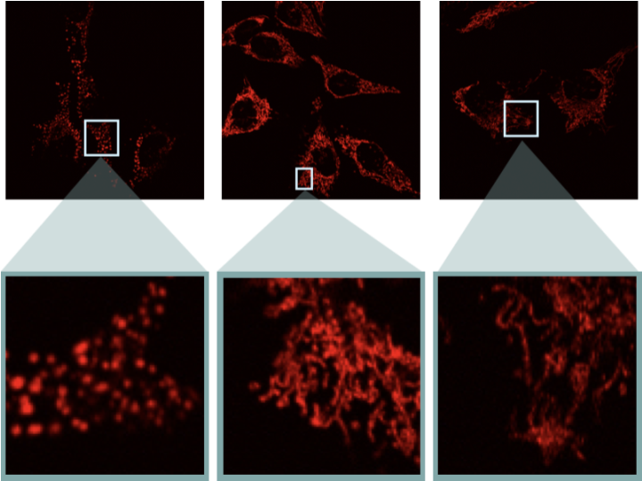
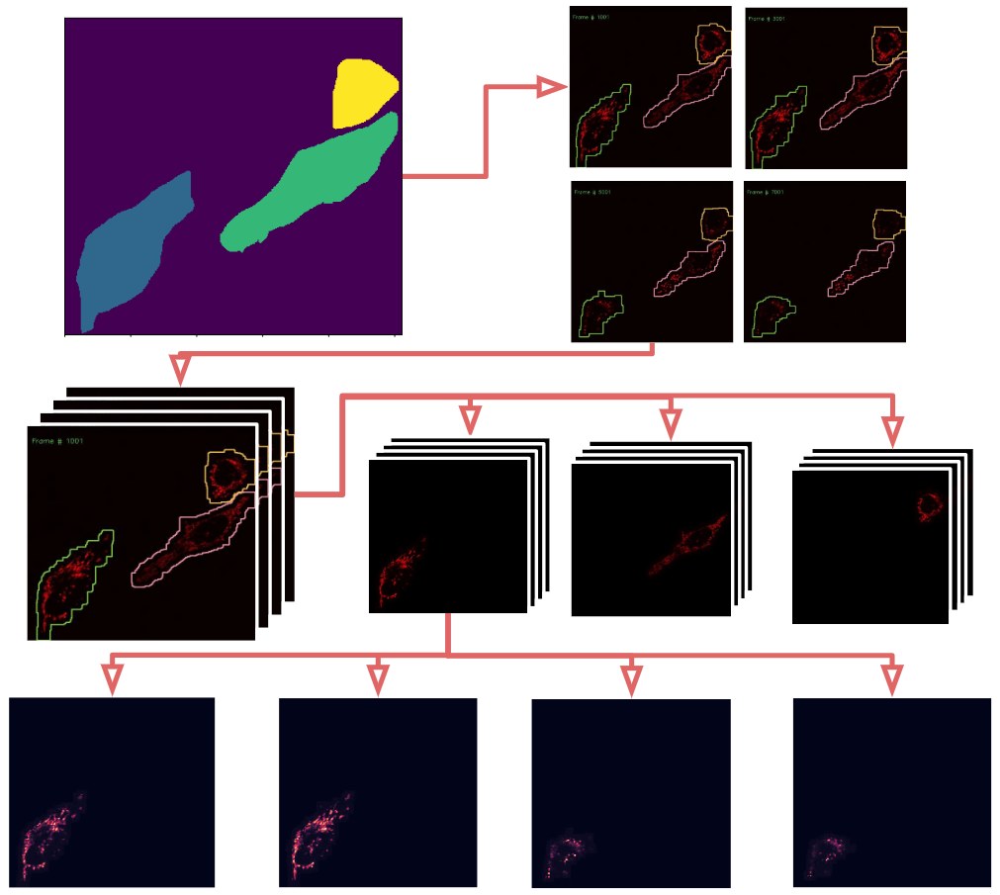

:author: Andrew Durden
:email: andrewdurden@uga.edu
:institution: Department of Computer Science, University of Georgia, Athens, GA 30602 USA

:author: Allyson T Loy
:email: allyson.loy@uga.edu
:institution: Department of Microbiology, University of Georgia, Athens, GA 30602 USA

:author: Barbara Reaves
:email: bjreaves@uga.edu
:institution: Department of Infectious Diseases, University of Georgia, Athens, GA 30602 USA

:author: Mojtaba Fazli
:email: Mojtaba@uga.edu
:institution: Department of Computer Science, University of Georgia, Athens, GA 30602 USA

:author: Abigail Courtney
:email: abigail.courtney@uga.edu
:institution: Department of Microbiology, University of Georgia, Athens, GA 30602 USA

:author: Frederick D Quinn
:email: fquinn@uga.edu
:institution: Department of Infectious Diseases, University of Georgia, Athens, GA 30602 USA

:author: S Chakra Chennubhotla
:email: chakracs@pitt.edu
:institution: Department of Computational and Systems Biology, University of Pittsburgh, Pittsburgh, PA 15232 USA

:author: Shannon P Quinn
:email: spq@uga.edu
:institution: Department of Computer Science, University of Georgia, Athens, GA 30602 USA
:institution: Department of Cellular Biology, University of Georgia, Athens, GA 30602 USA
:bibliography: mybib

-------------------------------------------------------------------
Dynamic Social Network Modeling of Diffuse Subcellular Morphologies
-------------------------------------------------------------------

.. class:: abstract

The use of fluorescence microscopy has led to the development of new technologies and quantitative modeling approaches as biomedical imaging data has become amenable to analysis through computer vision and machine learning methods. Extracting and modeling quantitative knowledge of biological systems has become more common, and many molecular and cellular phenotypes can now be automatically characterized. However, much of this work is still nascent; in particular, there are a number of approaches to modeling spatial patterns of solid morphologies, such as cell membranes or nuclei, but considerably fewer approaches to modeling diffuse organellar patterns such as mitochondria or actin. Furthermore, little work has focused on the development of spatiotemporal models that capture the relationships between spatial quantities--size, shape, and distribution--as functions of time. Such models are extremely useful for characterizing conditional events, such as the addition of a toxin or invasion by a pathogen.

Here, we discuss initial work into building spatiotemporal models of diffuse subcellular morphologies, specifically the mitochondrial protein patterns of alveolar cells. We leverage principles of graph theory and consider the mitochondrial patterns an instance of a social network: a collection of vertices interconnected by edges, indicating spatial relationships. By studying the changing topology of the social networks over time, we gain a statistical understanding of the types of stresses imposed on the mitochondria by external stimuli, and can relate these effects in terms of graph theoretic quantities such as centrality, connectivity, and flow. We demonstrate how the gradients of the graph Laplacian underlying the social network, and the changes in its principal components, can yield biologically-meaningful interpretations of the evolving morphology. Our primary goal is the development of a bioimaging toolbox, built from existing open source packages in the scientific Python ecosystem (SciPy, NumPy, scikit-image, OpenCV), which builds dynamic social network models from time series fluorescence images of diffuse subcellular protein patterns, enabling a direct quantitative comparison of network structure over time and between cells exposed to different conditions.

.. class:: keywords

Biomedical Imaging, Graph Theory, Social Networks

Introduction
------------

Given the recent rise of fluorescence microscopy, live cell footage has become much more accessible. This increase in subcellular biomedical imaging data has lead to a heavy analysis of organelles with solid structure. However, the growth in modeling and classification of solid morphologies has created a large and growing gap in our ability to autonomously quantify subcellular structures of diffuse morphology, organelles and proteins like mitochondria and actin.

Being able to not only quantify the structure of a protein, but also it’s change over time using both spatial and temporal covariance, can lead to understanding the protein’s relationship with environmental variables like toxins or bacteriophages. Recently, spatial covariance has been used to quantify gene expression correlation in image like matrices representing sequenced RNA :cite:`Svensson143321`[Svensson143321]. We look to focus on both spatial and temporal covariance to achieve our goal of protein behavior quantification through the novel employ of social network analogues. A recent study of brain activity used networks to create a quantitative measure of correlated activity in fMRI images which could then easily be clustered :cite:`Drysdale4246`[Drysdale4246]. There are many advantages of using a social network metric to model diffuse structures. It allows for not only the overall form of the morphology to impact the quantitative analysis, but also for the diffuseness property to influence the connectivity of the network. The heavily studied field of social network and graph theory also opens opportunity for a varied analysis of the analogue once it has been modeled.

We have begun by modeling the subcellular patterns of mitochondria in epithelial cells. Mitochondria are dynamic organelles, which undergo continual rounds of fission and fusion. These fission and fusion events are important for maintaining proper function and overall mitochondrial health :cite:`ZLN13`:cite:`WT16`[ZLN13, WT16]. Mitochondrial fission allows for the turnover of damaged and the protection of healthy organelles. Additionally, mitochondrial fusion leads to the mixing of internal contents, which is important for responding to environmental needs :cite:`ZLN13` :cite:`KPSB08` [ZLN13, KPSB08].

The dynamics between fission and fusion creates a spectrum of mitochondrial morphologies. Further, imbalances between fission and fusion events generate phenotypes associated with mitochondrial dysfunction :cite:`ZLN13`[ZLN13]. An excess of fission or dearth of fusion events results in fragmented mitochondria. In the fragmented phenotype, the mitochondrial network is fractured, and individual mitochondria exist in small spheres. However, an overabundance of fusion or a lack of fission events generate hyperfused mitochondria. In the hyperfusion phenotype, the mitochondrial network is overconnected, and composed of long interconnected tubules :cite:`CCI+08`[CCI+08].

Recently, several bacterial species have been shown to cause mitochondrial perturbations during infection :cite:`SBSRC11`:cite:`FGQR15`[SBSRC11, FGQR15]. Through social network modeling, we hope to build a more rapid and efficient method for identifying changes in size, shape, and distribution of mitochondria as well as other diffuse organelles.

Data
----

We have constructed a library of live imaging videos that display the full spectrum of mitochondrial morphologies in HeLa cells, from fragmented to hyperfused. To visualize the mitochondria, HeLa cells were stably transfected with DsRed2-Mito-7 (DsRed2-HeLa), which fluorescently labels mitochondria red (a gift from Michael Davidson, Addgene plasmid #55838). All of our videos were taken using a Nikon A1R Confocal. Cells were kept in an imaging chamber that maintained 37 degrees C and 5% CO2 for the duration of imaging. The resonant scanning head was utilized to capture an image every ten seconds for the length of the video. The resulting  raw videos  have more than 20,000 frames per video. Each frame is of dimensions of 512x512 pixels :ref:`fig1`.

   :label:`fig1`
   Sample frames from each of the subsets of data. Left) LLO induced mitochondrial fragmentation Center) Wild type HeLa mitochondrial morphology Right) Mdivi-1 induced mitochondrial hyperfusion

Wild type mitochondrial morphology was captured by imaging DsRed2-HeLa cells in typical growth medium (DMEM plus 10 % fetal bovine serum)(:ref:`fig1`, center). To generate the fragmented phenotype, cells were exposed to the pore-forming toxin listeriolysin O (LLO) at a final concentration of 6 nM (:ref:`fig1`, left). Mitochondrial hyperfusion was induced through the addition of mitochondria division inhibitor-1 (mdivi-1) at a final concentration of 50µM (:ref:`fig1`, right). These subsets with different known qualitative phenotypes serve as bases upon which to condition our quantitative analyses.

Segmentation Pipeline
---------------------

While our initial input videos contain a range of cell quantities, in order for our analysis to be unbiased to the number of cells in a frame, we chose to study each cell individually. To do that we need to segment each cell. While segmentation of fluorescence microscopy images is becoming very common, this dataset has the added difficulty of the diffuse nature of the mitochondrial protein. Considering the fact that we have minimal movement between consecutive frames, we can use deformable contours with slight changes from the previous frame to build out masks. However, the diffuse structure combined with the near overlap of cells in frames makes the first mask difficult to generate autonomously. Thus, our first step, was to use ITK-SNAP software to label each cell manually in the first frame of each video. The output of this step will be VTK file (:ref:`fig2` top left).

   :label:`fig2`
   Diagram Representing segmentation process. (Top left) Hand drawn masks of the first frame in VTK format which are used to seed the segmentation. (Top right) a series of frames from a single video with autonomously drawn contours. (Mid) Stack of frames from a single video converted to separate videos for each cell. (Bottom) single cell video unraveled as grayscale image for frame by frame network modeling.

Our segmentation process uses this VTK as a seed, then deforms the mask through an iterative dilation, thresholding, and contour detection process over the entire video resulting in a set of masks for each frame. These masks can then be used to pull out single cells over the course of the video (:ref:`fig2`). While this process was very effective at following the cells which diminished in size, we occasionally would find our model losing small discrete areas of protein mass which diverged from the more contiguous structure. To avoid this loss we added a final process of iterative dilation to prevent loss and give a more generous contour. With these adjustments, we ran into a rare problem of cell contact or overlap. In response we continued the iterative dilation with more iterations and smaller dilations checking for overlap each iteration. In the case of an overlap, which would only be a few pixels with the small dilation kernel, we used a simple xor to remove the few overlapping pixels while still allowing the mask to expand in areas uncontested by other cells. With this case being rare, we found the process more often than not followed any visible boundary between the adjacent cell.

Once we’d created a series of masks for each cell over each frame we were able to begin engineering the social network topology to create quantitative representations of the protein’s spatial behavior over the time captured in the video.
