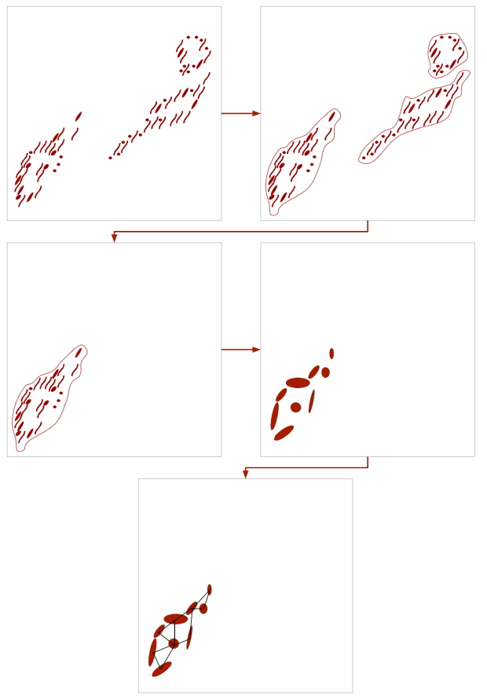

:author: Andrew Durden
:email: andrewdurden@uga.edu
:institution: Department of Computer Science, University of Georgia, Athens, GA 30602 USA

:author: Allyson T Loy
:email: allyson.loy@uga.edu
:institution: Department of Microbiology, University of Georgia, Athens, GA 30602 USA

:author: Barbara Reaves
:email: bjreaves@uga.edu
:institution: Department of Infectious Diseases, University of Georgia, Athens, GA 30602 USA

:author: Mojtaba Fazli
:email: Mojtaba@uga.edu
:institution: Department of Computer Science, University of Georgia, Athens, GA 30602 USA

:author: Abigail Courtney
:email: abigail.courtney@uga.edu
:institution: Department of Microbiology, University of Georgia, Athens, GA 30602 USA

:author: Frederick D Quinn
:email: fquinn@uga.edu
:institution: Department of Infectious Diseases, University of Georgia, Athens, GA 30602 USA

:author: S Chakra Chennubhotla
:email: chakracs@pitt.edu
:institution: Department of Computational and Systems Biology, University of Pittsburgh, Pittsburgh, PA 15232 USA

:author: Shannon P Quinn
:email: spq@uga.edu
:institution: Department of Computer Science, University of Georgia, Athens, GA 30602 USA
:institution: Department of Cellular Biology, University of Georgia, Athens, GA 30602 USA
:corresponding:
:bibliography: mybib

-------------------------------------------------------------------
Dynamic Social Network Modeling of Diffuse Subcellular Morphologies
-------------------------------------------------------------------

.. class:: abstract

The use of fluorescence microscopy has catalyzed new insights into biological
function, and spurred the development of quantitative models from rich biomedical
image datasets. While image processing in some capacity is commonplace for
extracting and modeling quantitative knowledge from biological systems at varying
scales, general-purpose approaches for more advanced modeling are few. In
particular, diffuse organellar morphologies, such as mitochondria or actin
microtubules, have few if any established spatiotemporal modeling strategies,
all but discarding critically important sources of signal from a biological system.
Here, we discuss initial work into building spatiotemporal models of diffuse
subcellular morphologies, using mitochondrial protein patterns of
cervical epithelial (HeLa) cells. We leverage principles of graph theory and
consider the diffuse mitochondrial patterns as a social network: a collection of
vertices interconnected by weighted and directed edges, indicating spatial
relationships. By studying the changing topology of the social networks over
time, we gain a mechanistic understanding of the types of stresses imposed on
the mitochondria by external stimuli, and can relate these effects in terms of
graph theoretic quantities such as centrality, connectivity, and flow. We
demonstrate how the mitochondrial pattern can be faithfully represented
parametrically using a learned mixture of Gaussians, which is then perturbed
to match the spatiotemporal evolution of the mitochondrial patterns over time.
The learned Gaussian components can then be converted to graph Laplacians,
formally defining a network, and the changes in the topology of the Laplacians
can yield biologically-meaningful interpretations of the evolving morphology.
We hope to leverage these preliminary results to implement a bioimaging
toolbox, using existing open source packages in the scientific Python
ecosystem (SciPy, NumPy, scikit-image, OpenCV), which builds dynamic social
network models from time series fluorescence images of diffuse subcellular
protein patterns. This will enable a direct quantitative comparison of network
structure over time and between cells exposed to different conditions.

.. class:: keywords

Biomedical Imaging, Graph Theory, Social Networks

Introduction
------------

Given the recent rise of fluorescence microscopy, and the subsequent proliferation
of biomedical imaging data, live cell imaging has become much more accessible.
However, the growth in quantification and modeling of biological and biomedical
phenomena has been uneven; "solid" morphologies such as cells and nuclei are much
easier to automatically segment, track, and quantify than diffuse patterns induced
by mitochondria or actin. There is a need for methodologies and software capable
of autonomous tracking, segmentation, and quantification of spatiotemporal changes
in these structures.

Understanding the spatiotemporal evolution of subcellular organelles in
response to external stimuli and modeling this behavior is critical to understanding
the effects of the stimuli on the internal state and configuration of the cell.
This can have downstream implications in the development of targeted therapies.
Recently, spatial covariance has been used to quantify gene expression correlation
in image like matrices representing sequenced RNA :cite:`Svensson143321`. Other
recent work demonstrates the benefits of measuring covariance between subcellular
structures to observe how coherent portions of the cells respond in tandem to
external stimuli :cite:`valm2017applying`. While this work used hand-crafted
pixel-level thresholds and manual labeling of pixels into organelle groupings,
it nonetheless represents the spirit of our work: developing quantifiable, data-driven
spatiotemporal models of subcellular structures.

Our work focuses on both spatial and temporal covariance to better model and
understand the response of subcellular structures to stimuli. To do this, we
draw on graph theory and cast the punctate subcellular morphologies as instances
of a social network. A recent study of brain activity used networks to create a
quantitative measure of correlated activity in functional MRI (fMRI) images
which could then easily be clustered :cite:`Drysdale4246`. There are many advantages of using a social
network model for representing diffuse structures. It captures not only the overall
spatial morphology and distribution of the protein pattern, but also intrinsically
captures relationships between different spatial components of the pattern. Finally, by permitting the network to evolve over time, the changing properties of the social network can be interpreted biologically to describe different observed phenomena: just as "traditional" social networks evolve through the addition and deletion of connections between individuals, so do such events describe precisely how the morphology, both locally in one part of the cell, and globally across multiple cells, changes in response to stimuli.

We have begun by modeling the subcellular patterns of mitochondria in cervical epithelial (HeLa) cells. Mitochondria are dynamic organelles, which undergo continual rounds of fission and fusion. These fission and fusion events are important for maintaining proper function and overall mitochondrial health :cite:`ZLN13` :cite:`WT16`. Mitochondrial fission allows for the turnover of damaged and the protection of healthy organelles. Additionally, mitochondrial fusion leads to the mixing of internal contents, which is important for responding to environmental needs :cite:`ZLN13` :cite:`KPSB08`.

The dynamics between fission and fusion creates a spectrum of mitochondrial morphologies.  Imbalances between fission and fusion events generate phenotypes associated with mitochondrial dysfunction :cite:`ZLN13`. An excess of fission or dearth of fusion events results in fragmented mitochondria; in this phenotype, the mitochondrial network is fractured, and individual mitochondria exist in small spheres. Conversely, an overabundance of fusion or a lack of fission events generate hyperfused mitochondria; in this phenotype, the mitochondrial network is overconnected, and composed of long interconnected tubules :cite:`CCI08`. Recently, several bacterial species have been shown to cause mitochondrial perturbations during infection :cite:`SBSRC11`:cite:`FGQR15`. Such unique morphologies should be detectable at a quantitative level using social network modeling.

Through social network modeling, we hope to build a more rapid and efficient method for identifying changes in size, shape, and distribution of mitochondria as well as other diffuse organelles. In this work, we present a proof-of-concept pipeline which segments cells with fluorescent stains on the mitochondria for individual analysis. Once the cells are segmented, we use a Gaussian Mixture Model (GMM) to parameterize the spatial distribution of the mitochondrial protein patterns at evenly-spaced time intervals, and allow the GMM parameters to update smoothly from the previous time point to the next. Finally, we demonstrate how the learned parameters of the GMM can be used to construct social networks for representing the mitochondria. The complete pipeline can be seen in Fig. :ref:`fig0`.

  An abstract representation of our proposed pipeline. The first frame represents the raw unsegmented image of mitochondria in three cells. The second frame demonstrates simultaneous segmentation, as a border is drawn around each cell. The third frame represents a single cell being extracted for analysis using the determined segmentation. The fourth frame shows a characteristic set of nodes determined by applying a mixture model to the distribution of fluorescent mitochondria. The final frame shows edges added to the nodes to complete the network structure. At this point in the pipeline, network analysis can be applied to the induced graph. These steps are applied to each frame of video allowing for fully temporal analysis. :label:`fig0`.

Data
----

We have constructed a library of live confocal imaging videos that display the full spectrum of mitochondrial morphologies in HeLa cells, from fragmented to hyperfused. To visualize the mitochondria, HeLa cells were stably transfected with DsRed2-Mito-7 (DsRed2-HeLa), which fluorescently labels mitochondria with red emission spectra (a gift from Michael Davidson, Addgene plasmid #55838). All of our videos were taken using a Nikon A1R Confocal. Cells were kept in an imaging chamber that maintained 37 degrees C and 5% CO2 for the duration of imaging. The resonant scanning head was used to capture an image every ten seconds for the length of the video. The resulting time series videos have more than 20,000 frames per video. Each frame is of dimensions of 512x512 pixels (Fig. :ref:`fig1`).

.. figure:: morpho.png

   Sample frames from each of the subsets of data. (Left) LLO induced mitochondrial fragmentation (Center) Wild type HeLa mitochondrial morphology (Right) Mdivi-1 induced mitochondrial hyperfusion :label:`fig1`

Wild type mitochondrial morphology was captured by imaging DsRed2-HeLa cells in typical growth medium (DMEM plus 10 % fetal bovine serum) (Fig. :ref:`fig1`, center). To generate the fragmented phenotype, cells were exposed to the pore-forming toxin listeriolysin O (LLO) at a final concentration of 6 nM (Fig. :ref:`fig1`, left). Mitochondrial hyperfusion was induced through the addition of mitochondria division inhibitor-1 (mdivi-1) at a final concentration of 50µM (Fig. :ref:`fig1`, right). These subsets with different known qualitative phenotypes serve as bases upon which to condition our quantitative analyses.

Segmentation Pipeline
---------------------

In order to avoid systemic bias in our downstream analysis pipeline as a result of
different videos containing a varied and unbounded number of cells, we chose to study each cell individually. This required segmenting each individual cell and studying its spatiotemporal dynamics in isolation from the others. While segmentation of cells from fluorescence or histology images is becoming very common, segmenting diffuse protein patterns--such as mitochondria--is much more challenging. We leveraged the fact that, given the small interval (10s) between frames of a video, overall movement between a given pair of subsequent frames would be minimal. We used deformable contours with slight updates from the previous frame to build out segmentation masks. However, the diffuse structure combined with the near overlap of cells in frames necessitated a "priming" of the segmentation pipeline with a hand-drawn mask at time 0. We used the ITK-SNAP software :cite:`py06nimg` to label each cell manually in the first frame of each video, generating a VTK file with the segmentation maps (Fig. :ref:`fig2`, top left).

.. figure:: seg.png

   Diagram of the cell segmentation process. (Top Left) Hand drawn masks of the first frame in VTK format were used to "seed" the deformable contours. (Top Right) A series of frames from a single video with autonomously drawn contours. (Middle) Stack of frames from a single video converted to separate videos for each cell. (Bottom) single cell video unraveled as grayscale image for frame by frame network modeling. :label:`fig2`

Our segmentation process used these maps as "seeds", updating the maps at each frame of the video using deformable contours: iterative dilation, thresholding, and contour detection process over the entire video, resulting in a set of masks for each frame and each cell in the frame. These masks could then be used to pull out individual cells over the course of the video (Fig. :ref:`fig2`).

While this process was very effective at following the cells, occasionally the model would lose small areas of mitochondrial mass which was sufficiently far away from the more contiguous structure. To compensate, we added a final process of iterative dilation to prevent loss and give a more generous contour. With these adjustments, we ran into a rare problem of cell contact or overlap. In response, we continued the iterative dilation with more iterations and smaller dilations checking for overlap with another map each iteration. In the case of an overlap, which would only be a few pixels with the small dilation kernel, we used a simple XOR to remove the few overlapping pixels while still allowing the mask to expand in areas unclaimed by other cells. With this case being rare, we found the process mostly followed any visible boundary of the adjacent cell.

The output of this step was the individual cell masks, one for each cell at each frame, providing a complete segmentation of each cell.

Social Network Engineering
--------------------------

To induce a network structure over the mitochondrial patterns of the segmented cells, we used a Gaussian Mixture Model (GMM). The means and covariances of the model components would represent two critical features of a social network: the individual nodes (means), and the nodes' relationships to each other (covariances). An independent model would be trained for each individual cell, and the model parameters would be permitted to evolve over the course of the videos to capture the changing underlying morphologies.

.. figure:: network1.png

    (Left) a 2D probability representation of the intensity of a sample cell. (Top Right) the Intensity map of the image in a 3D representation. (Bottom Right) the 3D contour of the same cell. :label:`fig3`

We first applied a Gaussian smoothing filter to minimize or eliminate artifacts in the video images. We then converted the frames of the video to a discrete probability distribution by normalizing the grayscale pixel intensities to sum to 1 (Fig. :ref:`fig3`). Following the conversion to a probability density, we counted local pixel maxima and used these points--both the number of maxima found, and their spatial locations--as the initial components our GMM. These components were fed into the GMM `fit()` procedure in scikit-learn (Fig. :ref:`fig4`). The learned GMM components would minimize the disparity between the joint probability density of the GMM, and the original empirical probability density of the image, parameterizing the structure of the mitochondrial pattern. Using the learned components as nodes in the final network allow for the network structure to be learned purely from the mitochondrial topology.

The code for converting a single image frame to a discrete probability density function and learn the initial GMM components are as follows:

.. code-block:: python

    def img_to_px(image):
        """
        Converts the image to a probability
        distribution amenable to GMM.

        Parameters
        ----------
        image : array, shape (H, W)
            8-bit grayscale image.

        Returns
        -------
        X : array, shape (N, 2)
        The data.
        """
        # We need the actual 2D coordinates of the
        #pixels.
        #The following is fairly standard practice for
        #generating a grid
        #of indices, often to evaluate some function on
        #a discrete surface.
        x = np.arange(image.shape[1])
        y = np.arange(image.shape[0])
        xx, yy = np.meshgrid(x, y)

        # Now we unroll the indices and stack them into
        #2D (i, j) coordinates.
        z = np.vstack([yy.flatten(), xx.flatten()]).T

        # Finally, we repeat each index by the number
        # of times of its pixel value.
        # That is our X--consider each pixel an
        #"event", and its value is the
        # number of times that event is observed.
        X = np.repeat(z, image.flatten(), axis = 0)
        return X

    def skl_gmm(vid, vizual = False, skipframes = 10,
        threshold_abs = 6, min_distance = 10):
        """
        Runs a warm-start GMM over evenly-spaced
        frames of the video.

        Parameters
        ----------
        vid : array, shape (f, x, y)
            Video, with f frames and spatial
            dimensions x by y.
        vizual : boolean
            True will show images and nodes
            (default: False).
        skipframes : integer
            Number of frames to skip (downsampling
            constant).

        Returns
        -------
        covars : array, shape (f, k, 2, 2)
            The k covariance matrices (each 2x2)
            for each of f frames.
        means : array, shape (f, k, 2)
            The k 2D means for each of f frames.
        """
        img = vid[0]
        if(vizual):
            plt.imshow(img)
            plt.show()
        X = image.img_to_px(img)
        PI, MU, CV = params.image_init(img, k = None,
            min_distance = min_distance,
            threshold_abs = threshold_abs)
        PR = np.array(list(map(sla.inv, CV)))
        gmmodel = GaussianMixture(n_components = CV.shape[0],
            weights_init = PI, means_init = MU,
            precisions_init = PR)
        gmmodel.fit(X)
        if(vizual):
            viz.plot_results(gmmodel.means_,
                gmmodel.covariances_, 0, img.shape[1], 0,
                img.shape[0], 0, 'this')

        covars = [gmmodel.covariances_]
        means = [gmmodel.means_]

        #set warm start to true to use previous parameters
        gmmodel.warm_start = True

        for i in range(1+skipframes, vid.shape[0], skipframes):
            img = vid[i]
            if(vizual):
                plt.imshow(img)
                plt.show()

            X = image.img_to_px(img)
            gmmodel.fit(X)
            covars = np.append(covars,
                [gmmodel.covariances_], axis = 0)
            means = np.append(means,
                [gmmodel.means_],axis = 0)
            if(vizual):
                viz.plot_results(gmmodel.means_,
                    gmmodel.covariances_,0, img.shape[1],
                    0, img.shape[0], 0, 'this')

        return means,covars

.. figure:: network2.png
    :scale: 57%
    :figclass: bht

    A cell (Left) and the nodes (Right) as generated by a gaussian mixture model for the first (Rop) and last (Rottom) frames of a video showing a cell fragmented by LLO :label:`fig4`

For connecting the nodes with weighted edges, we explored multiple approaches that balanced realistically encapsulating the underlying biology (i.e., did not create connections between uncorrelated objects) and computational tractability. Initially, we chose a manual distance threshold and used this as the "neighborhood size" for the radial-basis function, a common connection-weighting metric that varies smoothly from 0 (not connected) to 1 (fully connected), and is a function of the Euclidean distance between the two nodes, weighted by the neighborhood size. A second attempt to make this process more data-driven was to replace the manually-crafted neighborhood size with the Gaussian covariance in the direction of the node to be connected (:ref:`fig5`, mid). In both cases, to avoid fully-connected graphs and induce some sparsity, we set a hard threshold on the maximum distance between nodes to connect (:ref:`fig5`, left).

While these produced networks with desirable properties, they did not fully reflect the underlying biology. Critically, the latter produced networks with connectivity levels that varied wildly even between subsequent frames of the same video. We interpreted this "thrashing" as noise: while we expect some systemic changes in the topology of the network through the formation and destruction of connections between nodes, we observed considerable shifts in this topology even in the control (wild-type) videos. Therefore, we sought a method for computing edge weights between nodes that was more robust to minor fluctuations in the underlying mitochondrial protein pattern. We also desired a similarity metric less dependent on Euclidean distance: this distance measure was entirely dependent on the magnification level of the microscope, an undesirable dependency and potential source of artifacts should the method be applied on data gathered from a variety of imaging modalities.

To address these shortcomings with determining network connectivity, we instead evaluated the Gaussian components directly and used that probability as the edge weight. This not only accounted for the anisotropy in the covariance of the Gaussian components, but also captured the asymmetry between components: by decoupling the direct link to Euclidean distance, the connections could instead be weighted by how probable the location of the node under consideration was (:ref:`fig5`, right). While this did result in an asymmetric graph matrix, it more accurately reflected the dynamics of the underlying biology, captured the relationships between nodes in a more intuitive metric, and was entirely data-driven with no hand-crafted thresholds.

.. figure:: network3.png

    (Left) A partially connected network with binary connections. (Center) A single node’s weighted connection within a fully connected graph. (Right) A the strongest connection of each node as determined by our current affinity function :label:`fig5`

Many popular social networks have asymmetric connections between users. For example, Twitter and Instagram permit users to follow another without being followed back. Even Facebook, which has a symmetric "friend" connection, has asymmetric underlying weights in terms of how friends interact over the network. Biologically speaking, there is little evidence to prefer a directed graph structure over an undirected one. However, with a cell's general Brownian behavior, the undirected structure seem more analogous and flexible; we would anticipate an empirical convergence to an undirected graph if the behavior warrants. This element of the our graph structure will be more cemented as we analyze the networks created.

To calculate our network structure in terms of the Gaussian components, we use the following functions (`normpdf` includes an implementation of a multivariate Gaussian probability density function due to discrepancies with the `scipy.stats.norm` implementation):

.. code-block:: python

    def normpdf(X, mu, sigma):
        """
        Evaluates the PDF under the current GMM
        parameters.

        Parameters
        ----------
        X : array, shape (N, d)
            The data.
        mu : array, shape (d,)
            Mean of the Gaussian.
        sigma : array, shape (d, d)
            Gaussian covariance.

        Returns
        -------
        px : array, shape (N,)
            The probability density of each data point,
            given the parameters.
        """
        d = 1 if len(X.shape) == 1 else X.shape[1]
        if d == 1:
            n = 1 / ((2 * np.pi * sigma) ** 0.5)
            e = np.exp(-(((X - mu) ** 2) /
                (2 * sigma)))
            px = n * e
        else:
            det = sla.det(sigma)
            inv = sla.inv(sigma)
            p = np.einsum('ni,ji,ni->n', X - mu,
                inv, X - mu)
            n = 1 / ((((2 * np.pi) ** d) * det)
                ** 0.5)
            px = np.exp(-0.5 * p) * n
        return px

    def aff_by_eval(means, covars):
        """
        finds an affinity table for a set of
        means and covariances representing nodes

        Parameters
        ----------
        means : array, shape (k, 2)
            the list of means with k nodes
        covars : array, shape (k, 2, 2)
            the list of covars with k nodes

        Returns
        -------
        aff_Table : array, shape (k, k)

        """
        aff_Table = np.empty([means.shape[0], 0])
        for i, (mean, covar) in enumerate(zip(means,
            covars)):
            p_mus_Kx = normpdf(means, mean, covar)
            aff_Table = np.append(aff_Table,
                np.transpose([p_mus_Kx]), axis=1)
        return aff_Table

    def get_all_aff_tables(means,covars):
        """
        finds all affinity table for a set of Frames
        each with lists of means and covariances

        Parameters
        ----------
        means : array, shape (f, k, 2)
            the list of lists of means with f frames and
            k nodes
        covars : array, shape (k, 2, 2)
            the list of lists of covars with f frames
            with k nodes

        Returns
        -------
        aff_Table : array, shape (k, k)

        """
        aff_Tables = [aff_by_eval(means[0], covars[0])]
        for i in range(1, means.shape[0]):
            aff_Tables = np.append(aff_Tables,
                [aff_by_eval(means[i], covars[i])], axis =0)
        return aff_Tables

.. figure:: Hists.png
    :scale: 80%
    :figclass: w

    A series of distribution plots of the negative log of values found in six affinity tables developed using the model learned at an early, middle, and late video frame. (Top) The tables generated from a control cell which show little variation in distribution. (Bottom) The tables generated from the LLO cell which shows a drastic increase in connectivity over time as the cell fragments. :label:`fig6`

Current Insights and Future Work Discussion
-------------------------------------------

After building networks using the described GMM method for each cell under varying conditions (control/wildtype, LLO, mdivi), we have qualitatively observed systemic differences in the learned model parameters that would separate these conditions. Interestingly, as the mitochondria fragment (i.e., LLO), the GMM components become more strongly connected, not less (:ref:`fig6`). We attribute this to a misinformed intuition: as the mitochondria fragment and the underlying probability density function becomes more uniform, the GMM components will likewise become more uniform, resulting in a more uniformly connected network. The overall number of connections also increases, as the cells tend to collapse at the same time as mitochondrial fragmentation, resulting in the same number of GMM components spatially colocating in a much smaller space, effectively "forcing" connections by virtue of proximity. By comparison, the control cell shows much less variation in the distribution of network connectivity and edge weights over time; this reflects a relatively stable social network, unperturbed by external stimuli.

The next step, then, is to develop a temporal model of the GMM component evolution in terms of the social network. This would take the form of a series of graph Laplacians and observing how the Laplacians change, likely as a function of Laplacian gradients. This would highlight specific portions of the social networks that covary over space and time; in other words, it would provide insight into the coordinated fragmentation or hyperfusion of the mitochondria in response to the provided stimulus. These features could then be incorporated into a broader supervised learning pipeline to distinguish patterns and discern the effects of an unknown stimulant (e.g., drug discovery), or an unsupervised learning pipeline to identify all observed mitochondrial phenotypes.

Additional methods of analyzing the graph structure of the social network would help to determine specific phenotypic changes induced by certain stimuli. In particular, classic graph metrics such as connectivity, cliques, and eigenvector centrality would help to precisely measure the global effects of certain stimuli on the mitochondria. Other algorithms, such as spectral clustering or PageRank for global network analysis from local phenomena would provide intuition into the local changes in mitochondrial phenotype responsible for inducing the global structure. These features would be invaluable for characterizing certain specific cell-wide or even organism-wide conditions.

We also aim to improve the process through which the social network is constructed in the first place. The incorporation of a single uniform component into the overall GMM would provide a robust method of accounting for background noise in the form of a learned, data-driven threshold. Additional refinements of the affinity function that determines the existence of connections between nodes, and their weight and direction, will be pursued: the Kullback-Leibler (KL) divergence is a popular method for measuring the difference between two probability distributions, and would be a natural fit for evaluating how similar two GMM components are.

In this paper, we have presented a proof-of-concept for parameterizing and modeling spatiotemporal changes in diffuse subcellular protein patterns using GMMs. We have presented how the learned parameters of the GMM can be updated to account for changing biological phenotypes, and how these parameters can then be used to induce a social network of interacting nodes. Finally, we show how the properties of the social network can be interpreted to provide biological insights, in particular how the underlying system may be responding to some kind of stimulus. This has potential implications in fundamental biology and translational biomedicine; we aim to complete our analysis package and release it as open source for the research community to use in the near future.

Acknowledgments
---------------

This project was supported in part by a grant from the National Science Foundation (#1458766).
