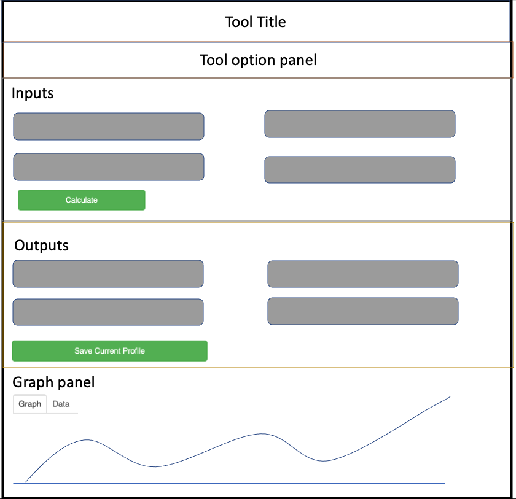
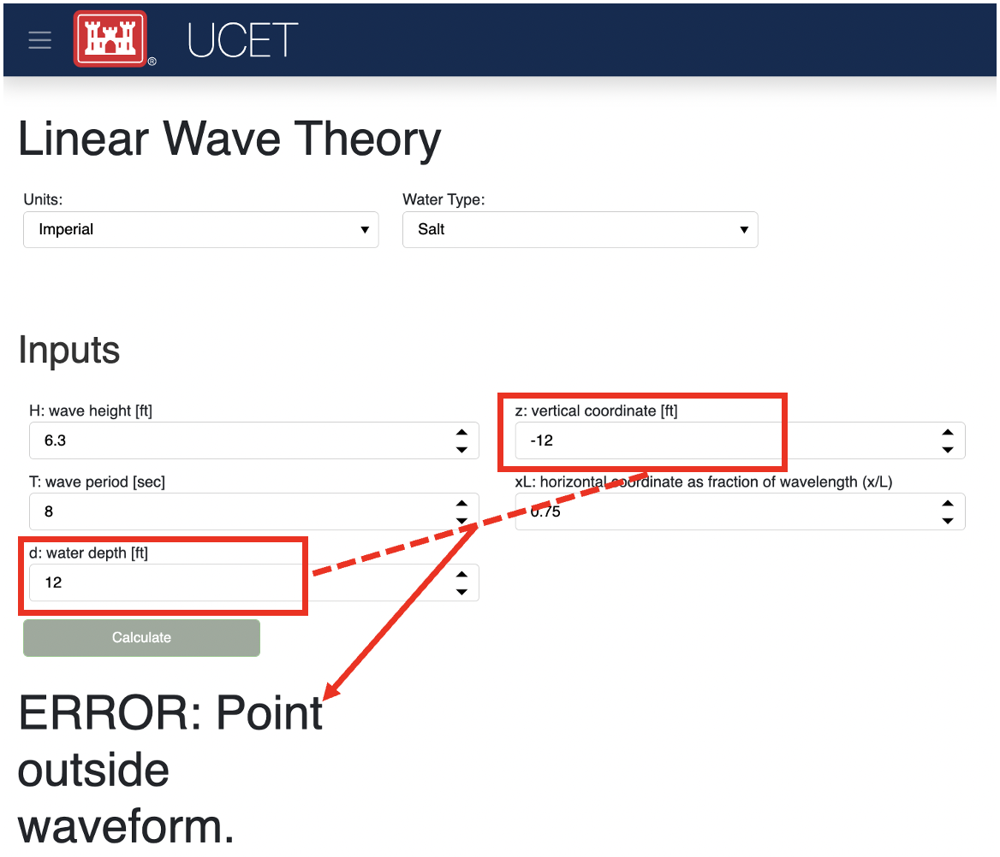
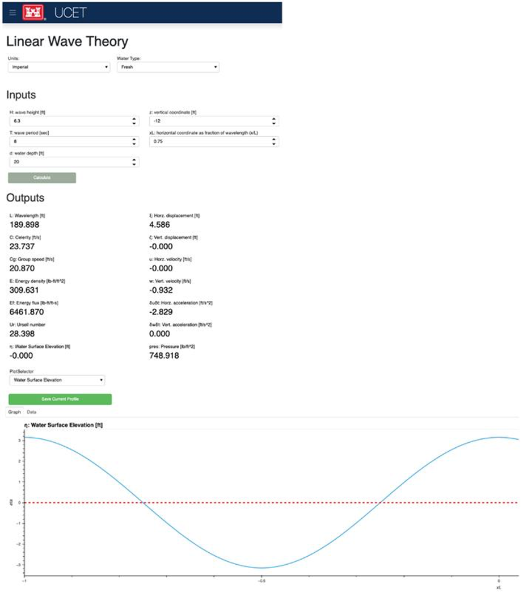
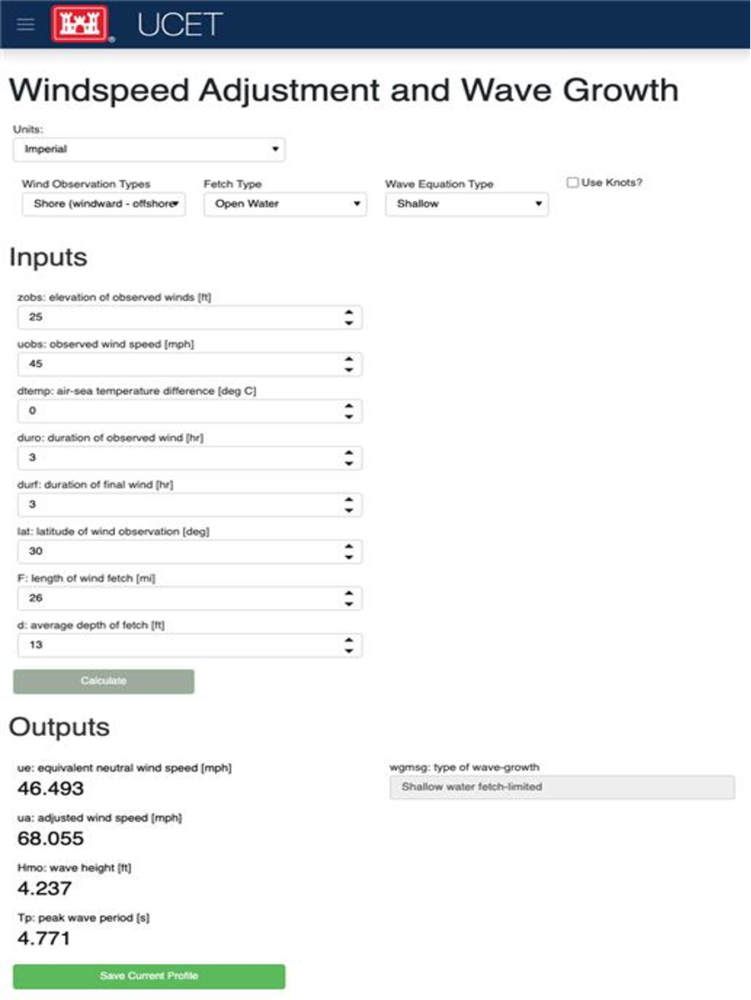

:author: Amanda Catlett
:email: amanda.r.catlett@erdc.dren.mil
:institution: ERDC

:author: Theresa R. Coumbe
:email: theresa.r.coumbe@erdc.dren.mil
:institution: ERDC

:author: Scott D. Christensen
:email: scott.d.christensen@erdc.dren.mil
:institution: ERDC

:author: Mary A. Byrant
:email: mary.a.byrant@erdc.dren.mil
:institution: ERDC

----------------------------------------------------------------------------------
USACE Coastal Engineering Toolkit and a Method of Creating a Web-Based Application
----------------------------------------------------------------------------------

.. class:: abstract

In the early 1990s the Automated Coastal Engineering Systems, ACES, was created with the goal of providing
state-of-the-art computer-based tools to increase the accuracy, reliability, and cost-effectiveness of Corps coastal
engineering endeavors. Over the past 30 years, ACES has become less and less accessible to engineers. An
updated version of ACES was necessary for use in coastal engineering. Our goal was to bring the tools in ACES to a user-friendly
web-based dashboard that would allow a wide range of users to be able to easily and quickly visualize results. We will
discuss how we restructured the code using class inheritance and the three libraries Param, Panel, and HoloViews to
create an extensible, interactive, graphical user interface. We have created the USACE Coastal Engineering Toolkit,
UCET, which is a web-based application that contains 20 of the tools in ACES. UCET serves as an outline for the process
of taking a model or set of tools and developing web-based application that can produce visualizations of the results.

.. class:: keywords

   GUI, Param, Panel, HoloViews

Introduction
------------

The Automated Coastal Engineering System (ACES) was developed in response to the charge by the LTG E. R. Heiberg III,
who was the Chief of Engineers at the time, to provide improved design capabilities to the Corps coastal specialists. [Leenknecht] In 1992, ACES
was presented as an interactive computer-based design and analysis system in the field of coastal engineering. The tools
consist of seven functional areas which are: Wave Prediction, Wave Theory, Structural Design, Wave Runup Transmission
and Overtopping, Littoral Process, and Inlet Processes. These functional areas contain classical theory describing wave
motion, to expressions resulting from tests of structures in wave flumes, and numerical models describing the exchange
of energy from the atmosphere to the sea surface. The math behind these uses anything from simple algebraic
expressions, both theoretical and empirical, to numerically intense algorithms. [Leenknecht][UG][shankar]

Originally, ACES was written in FORTRAN 77 resulting in a decreased ability to use the tool as technology has evolved.
In 2017, the codebase was converted from FORTRAN 77 to MATLAB and Python. This conversion ensured that coastal engineers
using this tool base would not need training in yet another coding language. In 2020, the Engineered Resilient Systems
(ERS) Rapid Application Development (RAD) team undertook the project with the goal of deploying the ACES tools as a web-based
application, and ultimately renamed it to: USACE Coastal Engineering Toolkit (UCET).

The RAD team focused on updating the Python codebase utilizing Python’s object-oriented programming and the newly
developed HoloViz ecosystem. The team refactored the code to implement inheritance so the code is clean, readable, and
scalable. The tools were expanded to a Graphical User Interface (GUI) so the implementation to a web-app would provide
a user-friendly experience. This was done by using the HoloViz-maintained libraries: Param, Panel, and Holoviews.

This paper will discuss some of the steps that were taken by the RAD team to update the Python codebase to create a
panel application of the coastal engineering tools. In particular, refactoring the input and output variables with the
Param library, the class hierarchy used, and utilization of Panel and HoloViews for a user-friendly experience.

Refactoring Using Param
-----------------------

Each coastal tool in UCET has two classes, the model class and the GUI class. The model class holds input and output
variables and the methods needed to run the model. Whereas the GUI class holds information for GUI visualization.
To make implementation of the GUI more seamless we refactored model variables to utilize the Param library. Param is a
library that has the goal of simplifying the codebase by letting the programmer explicitly declare the types and values
of parameters accepted by the code. Param can also be seamlessly used when implementing the GUI through Panel and
HoloViews.

Each UCET tool’s model class declares the input and output values used in the model as class parameters. Each input and
output variables are declared and given the following metadata features:

- **default**:  each input variable is defined as a Param with a default value defined from the 1992 ACES user manual
- **bounds**: each input variable is defined with range values defined in the 1992 ACES user manual
- **doc or docstrings**: input and output variables have the expected variable and description of the variable defined as a doc. This is used as a label over the input and output widgets. Most docstrings follow the pattern of <variable>:<description of variable [units, if any]>
- **constant**: the output variables all set constant equal True, thereby restricting the user’s ability to manipulate the value. Note that when calculations are being done they will need to be inside a with param.edit_constant(self) function
- **precedence**: input and output variables will use precedence when there are instances where the variable does not need to be seen.

The following is an example of an input parameter:

.. code-block:: python

  H = param.Number(
      doc='H: wave height [{distance_unit}]',
      default=6.3,
      bounds=(0.1, 200)
  )

An example of an output variable is:

.. code-block:: python

  L = param.Number(
      doc='L: Wavelength [{distance_unit}]',
      constant=True
  )

The model's main calculation functions mostly remained unchanged. However, the use of Param eliminated the need for
code that handled type checking and bounds checks.

Class Hierarchy
---------------

UCET has twenty tools from six of the original seven functional areas of ACES. When we designed our class hierarchy, we
focused on the visualization of the web application rather than functional areas. Thus, each tool’s class can be
categorized into Base-Tool, Graph-Tool, Water-Tool, or Graph-Water-Tool. The Base-Tool has the coastal engineering
models that do not have any water property inputs (such as water density) in the calculations and no graphical output.
The Graph-Tool has the coastal engineering models that do not have any water property inputs in the calculations but have
a graphical output. Water-Tool has the coastal engineering models that have water property inputs in the calculations
and no graphical output. Graph-Water-Tool has the coastal engineering models that have water property inputs in the
calculations and has a graphical output. Figure 1 shows a flow of inheritance for each of those classes.

.. figure::hierarchy.png

  The four types of tools in UCET and the hierarchy of classes used to produce a GUI for that tool

There are two types of general categories for the classes in the UCET codebase: utility and tool-specific. Utility
classes have methods and functions that are utilized across more than one tool. The Utility classes are:

-	**BaseDriver**: holds methods and functions that each tool needs to collect data, run coastal engineering models, and print data.
-	**WaterDriver**: has the methods that make water density and water weight available to the models that need those inputs for the calculations.
-	**BaseGui**: has the functions and methods for the visualization and utilization of all inputs and outputs within each tool’s GUI.
-	**WaterTypeGui**: has the widget for water selection.
-	**TabulatorDataGui**: holds the functions and methods used for visualizing plots and the ability to download the data that is used for plotting.

Each coastal tool in UCET has two classes, the model class and the GUI class. The model class holds input and output
variables and the methods needed to run the model. The model class either directly inherits from the BaseDriver or
the WaterTypeDriver.  The tool’s GUI class holds information for GUI visualization that is different from the
BaseGui, WaterTypeGUI, and TabulatorDataGui classes. In figure 1 the model classes are labeled as: Base-Tool Class,
Graph-Tool Class, Water-Tool Class, and Graph-Water-Tool Class and each has a corresponding GUI class.

Due to the inheritance in UCET, the first two questions that can be asked when adding a tool are: ‘Does this tool need
water variables for the calculation?’ and ‘Does this tool have a graph?’. The developer can then add a model class and
a GUI class and inherit based on figure 1. For instance, Linear Wave Theory is an application that yields first-order
approximations for various parameters of wave motion as predicted by the wave theory. It provides common items of
interest such as water surface elevation, general wave properties, particle kinematics and pressure as a function of
wave height and period, water depth, and position in the wave form. This tool uses water density and has multiple graphs
in its output. Therefore, Linear Wave Theory is considered a Graph-Water-Tool and the model class will inherit from
WaterTypeDriver and the GUI class will inherit the linear wave theory model class, WaterTypeGui, and TabularDataGui.

GUI Implementation Using Panel and HoloViews
--------------------------------------------
Each UCET tool has a GUI class where the Panel and HoloView libraries are implemented. Panel is a hierarchical container
that can layout panes, widgets, or other Panels in an arrangement that forms an app or dashboard.  The Pane is used to
render any widget-like object such as Spinner, Tabulator, Buttons, CheckBox, Indicators, etc. Those widgets are used to
gather user input and run the specific tool’s model.

UCET utilizes the following widgets to gather user input:

*	**Spinner**: single numeric input values
*	**Tabulator**: table input data
*	**CheckBox**: true or false values
*	**Drop down**: items that have a list of pre-selected values, such as which units to use

UCET utilizes indicators.Number, Tabulator, and graphs to visualize the outputs of the coastal engineering models.  A
single number is shown using indicators.Number and graph data is displayed using the Tabulator widget to show the data
of the graph. The graphs are created using HoloViews and have tool options such as pan, zooming, and saving.
Buttons are used to calculate, save the current run, and save the graph data.

All of these widgets are organized into 5 panels: title, options, inputs, outputs, and graph. The
BaseGui/WaterTypeGui/TabularDataGui have methods that organize the widgets within the 5 panels that most tools
follow. The “options” panel has a row that holds the dropdown selections for units and water type (if the tool is a
Water-Tool). Some tools have a second row in the “options” panel with other drop-down options. The input panel has two
columns for spinner widgets with a calculation button at the bottom left. The output panel has two columns of
indicators.Number for the single numeric output values. At the bottom of the output panel there is a button to “save the
current profile”. The graph panel is tabbed where the first tab shows the graph and the second tab shows the data
provided within the graph. An visual outline of this can ben seen in the following figure. Some of the UCET tools have
more complicated input or output visualizations and that tool’s GUI class will add or modify methods to meet the needs
of that tool.

The general outline of a UCET tool for the GUI.

Current State
-------------
UCET approaches software development from the perspective of someone within the field of Research and Development. Each
tool within UCET is not inherently complex from the traditional software perspective. However, this codebase enables
researchers to execute complex coastal engineering models in a user-friendly environment by leveraging open-source
libraries in the scientific Python ecosystem such as: Param, Panel, and HoloViews.

Currently, UCET is only deployed using a command line interface panel serve command. UCET is awaiting the Security
Technical Implementation Guide process before it can be launched as a website. As part of this security vetting process
we plan to leverage continuous integration/continuous development (CI/CD) tools to automate the deployment process. While this process is happening, we have
started to get feedback from coastal engineers to update the tools usability, accuracy, and adding suggested features.
To minimize the amount of computer science knowledge the coastal engineers need, our team created a batch script.
This script creates a conda environment, activates and runs the panel serve command to launch the app on a local host.
The user only needs to click on the batch script for this to take place.

Other tests are being created to ensure the accuracy of the tools using a testing framework to compare output from UCET
with that of the FORTRAN original code. The biggest barrier to this testing strategy is getting data from the FORTRAN to compare with Python.
Currently, there are tests for most of the tools that read a CSV file of input and output results from FORTRAN and
compare with what the Python code is calculating.

Our team has also compiled an updated user guide on how to use the tool, what to expect from the tool, and a deeper
description on any warning messages that might appear as the user adds input values. An example of a warning message
would be, if a user chooses input values that make it so the application does not make physical sense, a warning message
will appear under the output header and replace all output values. For a more concrete example: Linear Wave Theory
has a vertical coordinate (z) and the water depth (d) as input values and when those values sum is less than zero the
point is outside the waveform. Therefore, if a user makes a combination where the sum is less than zero, UCET
will post a warning to tell the user that the point is outside the waveform. See the below figure for an example
The developers have been documenting this project using GitHub and JIRA.

An example of a warning message based on chosen inputs.

Results
-------

Linear Wave Theory was described in the class hierarchy example. This Graph-Water-Tool utilizes most of the BaseGui
methods. The biggest difference is instead of having three graphs in the graph panel there is a plot selector drop down
where the user can select which graph they want to see.

  Screen shot of Linear Wave Theory

Windspeed Adjustment and Wave Growth provides a quick and simple estimate for wave growth over open-water and
restricted fetches in deep and shallow water. This is a Base-Tool as there are no graphs and no water variables for the
calculations. This tool has four additional options in the options panel where the user can select the wind observation
type, fetch type, wave equation type, and if knots are being used. Based on the selection of these options, the input
and output variables will change so only what is used or calculated for those selections are seen.

  Screen shot of Windspeed Adjustment and Wave Growth

Conclusion and Future Work
--------------------------

Thirty years ago, ACES was developed to provide improved design capabilities to Corps coastal specialists and while
these tools are still used today, it became more and more difficult for users to access them. Five years ago, there was
a push to update the code base to one that coastal specialists would be more familiar with: MATLAB and Python. Within
the last two years the RAD team was able to finalize the update so that the user can access these tools without having
years of programming experience. We were able to do this by utilizing classes, inheritance, and the Param, Panel, and
HoloViews libraries. The use of inheritance has allowed for shorter code-bases and also has made it so new tools can be
added to the toolkit. Param, Panel, and HoloViews work cohesively together to not only run the models but make a simple
interface.

Future work will involve expanding UCET to include current coastal engineering models, and completing the security
vetting process to deploy to a publicly accessible website. We plan to incorporate an automated CI/CD to ensure smooth
deployment of future versions. We also will continue to incorporate feedback from users and refine the code to ensure
the application provides a quality user experience.

References
----------

.. [Leenknecht] David A. Leenknecht, Andre Szuwalski, and Ann R. Sherlock. 1992. Automated Coastal Engineering System -Technical Reference. Technical report.

.. [panel] “Panel: A High-Level App and Dashboarding Solution for Python.” Panel 0.12.6 Documentation, Panel Contributors, 2019, https://panel.holoviz.org/.

.. [holoviz] “High-Level Tools to Simplify Visualization in Python.” HoloViz 0.13.0 Documentation, HoloViz Authors, 2017, https://holoviz.org.

.. [UG] David A. Leenknecht, et al. “Automated Tools for Coastal Engineering.” Journal of Coastal Research, vol. 11, no. 4, Coastal Education & Research Foundation, Inc., 1995, pp. 1108-24. https://usace.contentdm.oclc.org/digital/collection/p266001coll1/id/2321/

.. [shankar] N.J. Shankar, M.P.R. Jayaratne, Wave run-up and overtopping on smooth and rough slopes of coastal structures, Ocean Engineering, Volume 30, Issue 2, 2003, Pages 221-238, ISSN 0029-8018,  https://doi.org/10.1016/S0029-8018(02)00016-1

