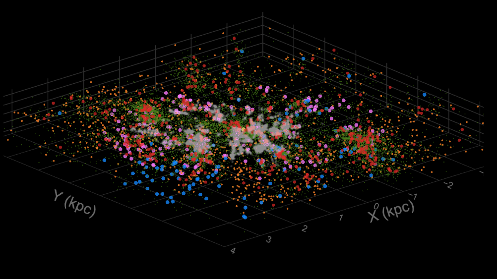
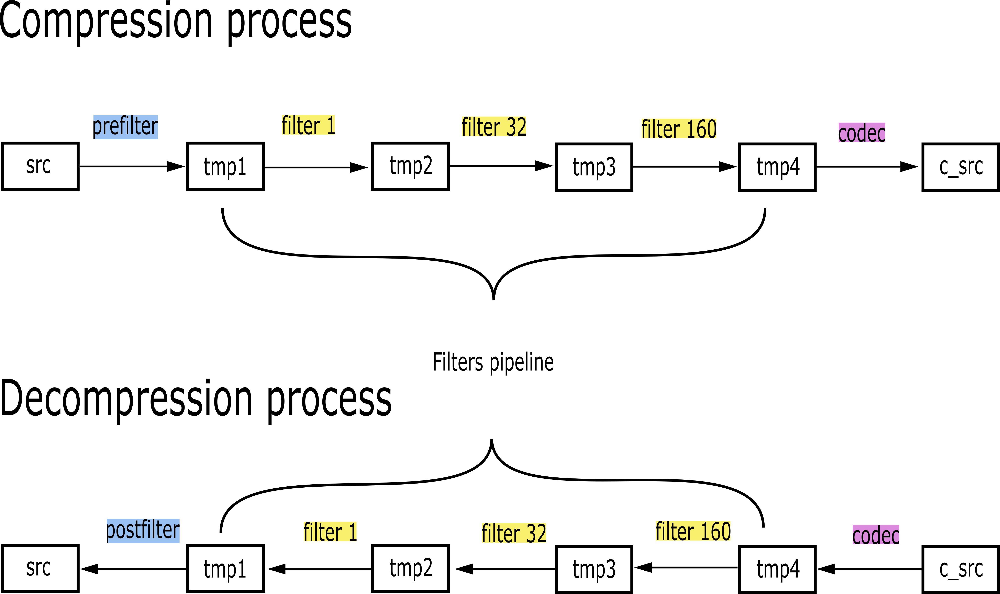

:author: Project Blosc
:email:
:institution: Project Blosc
:equal-contributor:
:bibliography: mybib

:author: Francesc Alted
:email: francesc@blosc.org
:institution: Project Blosc
:corresponding:

:author: Marta Iborra
:email: martaiborra24@gmail.com
:institution: Project Blosc

:author: Oscar Guiñón
:email: soscargm98@gmail.com
:institution: Project Blosc

:author: Sergio Barrachina
:email: barrachi@uji.es
:institution: Universitat Jaume I

---------------------------------------------------------------------------------
Using Blosc2 NDim As A Fast Explorer Of The Milky Way (Or Any Other NDim Dataset)
---------------------------------------------------------------------------------

.. class:: abstract

    N-dimensional datasets are widely used in many scientific fields. Quickly accessing subsets of these large datasets is critical for an efficient exploration experience. Blosc2 is a compression and format library that recently added support for multidimensional datasets. Compression is crucial for effectively dealing with sparse datasets, as the zeroed parts can be almost entirely suppressed, while the non-zero parts can still be stored in smaller sizes than their uncompressed counterparts. Moreover, the new double data partition in Blosc2 reduces the need for decompressing unnecessary data, which allows for top-class slicing speed.

    The Blosc2 NDim layer enables the creation and reading of n-dimensional datasets in an extremely efficient manner. This is due to a completely general n-dim 2-level partitioning, which allows for slicing and dicing of arbitrary large (and compressed) data in a more fine-grained way. Having a second partition means that we have better flexibility to fit the different partitions at the different CPU cache levels, making compression more efficient.

    As an example, we will demonstrate how Blosc2 NDim enables fast exploration of the Milky Way using the Gaia DR3 dataset. This catalog contains information on 1.7 billion stars in our galaxy, but we have chosen to include just the stars that are in a sphere of 10 thousand light-years radius (centered in the Gaia telescope), which accounts for 0.7 billion stars. The total size of this partial dataset is 3.7 TB, but when compressed, it is reduced to just 10 GB, making it easy to fit into the memory of modern computers for processing.

.. class:: keywords

    explore datasets, n-dimensional datasets, Gaia DR3, Milky Way, Blosc2, compression

Introduction
------------

The exploration of n-dimensional datasets is a common practice in many areas of science. However, one of its drawbacks is that the explored datasets size can become very large, which will slow down the exploration process significantly. In this paper, we demonstrate how Blosc2 NDim can be used to accelerate the exploration of huge n-dimensional datasets.

Blosc is a high-performance compressor optimized for binary data. Its design enables faster transmission of data to the processor cache than the traditional, non-compressed, direct memory fetch approach using an OS call to ``memcpy()``. This can be helpful not only in reducing the size of large datasets on-disk and in-memory, but also in accelerating memory-bound computations, which are typical in big data processing.

Blosc uses the blocking technique :cite:`FA10-starving-cpus` to minimize activity on the memory bus. The technique divides datasets into blocks small enough to fit in the caches of modern processors, where compression/decompression is performed. Blosc also takes advantage of SIMD (SSE2, AVX2, NEON…) and multi-threading capabilities in modern multi-core processors to maximize the compression/decompression speed.

.. figure:: sum_openmp-rainfall.png
   :scale: 40%

   Speed for summing up a vector of real float32 data using a variety of codecs that come with Blosc2. Note that the maximum speed is achieved when utilizing the maximum number of (logical) threads available on the computer (28). :label:`sum-precip`

Using Blosc compression can accelerate computations when enough cores are dedicated to the task. Figure :ref:`sum-precip` provides a real example of this.

Blosc2 is the latest version of the Blosc 1.x series, which is used in many important libraries, such as HDF5, Zarr, and PyTables. Its NDim feature excels at reading multi-dimensional slices, thanks to an innovative pineapple-style partitioning technique :cite:`BDT23-blosc2-ndim-intro`. This enables fast exploration of general n-dimensional datasets, including the 3D Gaia dataset.

The Gaia dataset
----------------

**OJO: Los números de esta parte no coinciden con los del resumen, en el resumen se habla de esfera y aquí de cubo, de 0.7 billones y no de 1.4, y ojo que la medida de distancia es ligth-years no ligth (errata en el resumen)**

The Gaia DR3 dataset is a catalog containing information on 1.7 billion stars in our galaxy. For this work, we extracted the 3D coordinates and magnitudes of 1.4 billion stars. When stored as a regular binary table, the dataset is 22 GB in size. However, we converted this tabular dataset into a 3D array of shape (10_000, 10_000, 10_000), where each cell represents a cube of 2 light year per side, and contains the magnitude of every star inside it (provided that the average distance between stars in the Milky ways is about 5 light years, very few cells will contain more than one star). This 3D array contains 700 million stars, which is a significant portion of the Gaia catalog. The brightness of each start is stored as a float32, and, therefore, the dataset size is 3.7 TB. However, by using compression via Blosc2, we can reduce its size to 10 GB. This is because the 3D array is very sparse, and Blosc2 can compress the zeroed parts almost completelly.

   Gaia DR3 dataset as a 3D array (preliminary, this is not from the dataset in this paper). :label:`gaia-3d-dset`

Figure :ref:`gaia-3d-dset` shows a 3D view of the Milky Way different type of stars. Each point is a star, and the color of each point represents the star's brightness, with the brightest stars appearing as the reddest points. Although this view provides a unique perspective, the dimensions of the cube are not enough to fully capture the spiral arms of the Milky Way.

One advantage of using a 3D array is the ability to utilize Blosc2 NDim's powerful slicing capabilities for quickly exploring parts of a dataset. For example, we could search for star clusters by extracting small cubes as NumPy arrays, and counting the number of stars in each one. A cube containing an abnormally high number of starts would be a candidate for a cluster. We could also extract a thin 3D slice of the cube and project it as a 2D image, where the pixels colors represent the brightness of the shown stars. This could be used to generate a cinematic view of a journey over different trajectories in the Milky Way.

Blosc2 NDim
-----------

Blosc2 NDim is a new feature of Blosc2 that allows to create and read n-dimensional datasets in an extremely efficient way thanks to a completely general n-dim 2-level partitioning, allowing to slice and dice arbitrary large (and compressed!) data in a more fine-grained way. Having a second partition means that we have better flexibility to fit the different partitions at the different CPU cache levels, making compression even more efficient.

.. figure:: b2nd-2level-parts.png
   :scale: 12%

   Blosc2 NDim 2-level partitioning. :label:`b2nd-2level-parts`

.. figure:: b2nd-3d-dset.png
   :scale: 40%

   Blosc2 NDim 2-level partitioning is flexible. The dimensions of both partitions can be specified in any arbitrary way that fits the expected read access patterns. :label:`b2nd-3d-dset`

With these finer-grained cubes (also known as partitions), arbitrary n-dimensional slices can be retrieved faster because not all the data necessary for the coarser-grained partition does not need to be decompressed, as usually happens in other libraries. See Figures :ref:`b2nd-2level-parts` and :ref:`b2nd-3d-dset` to learn how this works and how to set it up. Also, see Figure :ref:`read-partial-slices` :cite:`BDT23-blosc2-ndim-intro` for a comparison against other libraries that use just a single partition (e.g., HDF5, Zarr).

.. figure:: read-partial-slices.png
   :scale: 70%

   Speed comparison for reading partial n-dimensional slices of a 4D dataset. :label:`read-partial-slices`

It is important to note that Blosc2 NDim supports all data types in NumPy. This means that, in addition to the typical data types like signed/unsigned int, single and double-precision floats, bools or strings, it can also store datetimes (including units), and arbitrarily nested heterogeneous types. This allows to create multidimensional tables and more.

Support for multiple codecs, filters, and other compression features
---------------------------------------------------------------------

Blosc2 is not only a compression library, but also a framework for creating efficient compression pipelines. A compression pipeline is composed of a sequence of filters, followed by a compression codec. A filter is a transformation that is applied to the data before compression, and a codec is a compression algorithm that is applied to the filtered data. Filters can lead to better compression ratios and improved compression/decompression speeds.

Blosc2 supports a variety of codecs, filters, and other compression features. In particular, it supports the following codecs out-of-the-box:

- BloscLZ (fast codec, the default),
- LZ4 (a very fast codec),
- LZ4HC (high compression variant of LZ4),
- Zlib (the Zlib-NG variant of Zlib),
- Zstd (high compression), and
- ZFP (lossy compression for n-dimensional datasets of floats).

It also supports out-of-the-box the following filters:

- Shuffle (groups equal significant bytes together, useful for ints/floats),
- Shuffle with bytedelta (same than shuffle, but storing deltas of the consecutive same significant bytes),
- Bitshuffle (groups equal significant bits together, useful for ints/floats), and
- Truncation (truncates precision, useful for floats; lossy).

Blosc2 utilizes a pipeline architecture that enables the chaining of different filters :cite:`BDT22-blosc2-pipeline` followed by a compression codec. Additionally, it allows for pre-filters (user code meant to be executed before the pipeline) and post-filters (user code meant to be executed after the pipeline). This architecture is highly flexible and minimizes data copies between the different steps, making it possible to create highly efficient pipelines for a variety of use cases. Figure :ref:`blosc2-pipeline` illustrates how this works.

   The Blosc2 pipeline. During compression, the first function applied is the prefilter (if any), followed by the filter pipeline (with a maximum of six filters), and finally, the codec. During decompression, the order is reversed: first the codec, then the filter pipeline, and finally the postfilter (if any). :label:`blosc2-pipeline`

Furthermore, Blosc2 supports user-defined codecs and filters, allowing you to create your own compression algorithms and use them within Blosc2 :cite:`BDT22-blosc2-pipeline`. These user-defined codecs and filters can also be dynamically loaded :cite:`BDT23-dynamic-plugins`, registered globally within Blosc2, and installed via a Python wheel so that they can be used seamlessly from any Blosc2 application (whether in C, Python, or any other language that provides a Blosc2 wrapper).

Automatic tuning of compression parameters
------------------------------------------

Finding the right compression parameters for your data is probably the most difficult part of using a compression library. Which combination of code and filter would provide the best compression ratio? Which one would provide the best compression/decompression speed?

BTune is an AI tool for Blosc2 that helps you find the optimal combination of compression parameters to suit your needs. It uses a neural network that is trained on the most representative datasets to be compressed. This allows it to predict the best compression parameters based on a given balance between compression ratio and compression/decompression speed.

For example, in Table :ref:`predicted-dparams-example` there are the results for the predicted compression parameters tuning for decompression speed.  Curiously, fast decompression does not necessarily imply fast compression.  This table is provided to the user so that he/she can choose the best balance value for his/her needs.

.. table:: BTune prediction of the best compression parameters for decompression speed, depending on a balance value between compression ratio and decompression speed (0 means favoring speed only, and 1 means favoring compression ratio only). It can be seen that BloscLZ + Shuffle is the most predicted category when decompression speed is preferred, whereas Zstd + Shuffle + ByteDelta is the most predicted one when the specified balance is towards optimizing for the compression ratio. :label:`predicted-dparams-example`

   +---------+--------------------------------+--------------+--------------------+--------------------+
   | Balance | Most predicted                 |  Mean cratio | Mean cspeed (GB/s) | Mean dspeed (GB/s) |
   +=========+================================+==============+====================+====================+
   | 0.0     | blosclz-shuffle-split-5        | 2.09         | 14.47              | 48.93              |
   +---------+--------------------------------+--------------+--------------------+--------------------+
   | 0.1     | blosclz-shuffle-split-5        | 2.09         | 14.47              | 48.93              |
   +---------+--------------------------------+--------------+--------------------+--------------------+
   | 0.2     | blosclz-shuffle-split-5        | 2.09         | 14.47              | 48.93              |
   +---------+--------------------------------+--------------+--------------------+--------------------+
   | 0.3     | blosclz-shuffle-split-5        | 2.09         | 14.47              | 48.93              |
   +---------+--------------------------------+--------------+--------------------+--------------------+
   | 0.4     | zstd-shuffle-bytedelta-split-1 | 3.3          | 17.04              | 21.65              |
   +---------+--------------------------------+--------------+--------------------+--------------------+
   | 0.5     | zstd-shuffle-bytedelta-split-1 | 3.3          | 17.04              | 21.65              |
   +---------+--------------------------------+--------------+--------------------+--------------------+
   | 0.6     | zstd-shuffle-bytedelta-split-1 | 3.3          | 17.04              | 21.65              |
   +---------+--------------------------------+--------------+--------------------+--------------------+
   | 0.7     | zstd-shuffle-bytedelta-split-1 | 3.3          | 17.04              | 21.65              |
   +---------+--------------------------------+--------------+--------------------+--------------------+
   | 0.8     | zstd-shuffle-bytedelta-split-1 | 3.3          | 17.04              | 21.65              |
   +---------+--------------------------------+--------------+--------------------+--------------------+
   | 0.9     | zstd-shuffle-bytedelta-split-1 | 3.3          | 17.04              | 21.65              |
   +---------+--------------------------------+--------------+--------------------+--------------------+
   | 1.0     | zstd-shuffle-bytedelta-split-9 | 3.31         | 0.07               | 11.4               |
   +---------+--------------------------------+--------------+--------------------+--------------------+

On the other hand, in Table :ref:`predicted-cparams-example`, we can see an example of predicted compression parameter tuning for compression speed and ratio on a different dataset.

.. table:: BTune prediction of the best compression parameters for compression speed, depending on a balance value.  It can be seen that LZ4 + Bitshuffle is most predicted category when compression speed is preferred, whereas Zstd + Shuffle + ByteDelta is the most predicted one when the specified balance is towards optimize for the compression ratio. :label:`predicted-cparams-example`

   +---------+--------------------------------+--------------+--------------------+--------------------+
   | Balance | Most predicted                 |  Mean cratio | Mean cspeed (GB/s) | Mean dspeed (GB/s) |
   +=========+================================+==============+====================+====================+
   | 0.0     | lz4-bitshuffle-split-5         | 3.41         | 21.78              | 32.0               |
   +---------+--------------------------------+--------------+--------------------+--------------------+
   | 0.1     | lz4-bitshuffle-split-5         | 3.41         | 21.78              | 32.0               |
   +---------+--------------------------------+--------------+--------------------+--------------------+
   | 0.2     | lz4-bitshuffle-split-5         | 3.41         | 21.78              | 32.0               |
   +---------+--------------------------------+--------------+--------------------+--------------------+
   | 0.3     | lz4-bitshuffle-split-5         | 3.41         | 21.78              | 32.0               |
   +---------+--------------------------------+--------------+--------------------+--------------------+
   | 0.4     | lz4-bitshuffle-split-5         | 3.41         | 21.78              | 32.0               |
   +---------+--------------------------------+--------------+--------------------+--------------------+
   | 0.5     | lz4-bitshuffle-split-5         | 3.41         | 21.78              | 32.0               |
   +---------+--------------------------------+--------------+--------------------+--------------------+
   | 0.6     | lz4-bitshuffle-split-5         | 3.41         | 21.78              | 32.0               |
   +---------+--------------------------------+--------------+--------------------+--------------------+
   | 0.7     | lz4-bitshuffle-split-5         | 3.41         | 21.78              | 32.0               |
   +---------+--------------------------------+--------------+--------------------+--------------------+
   | 0.8     | zstd-shuffle-bytedelta-split-1 | 3.98         | 9.41               | 18.77              |
   +---------+--------------------------------+--------------+--------------------+--------------------+
   | 0.9     | zstd-shuffle-bytedelta-split-1 | 3.98         | 9.41               | 18.77              |
   +---------+--------------------------------+--------------+--------------------+--------------------+
   | 1.0     | zstd-shuffle-bytedelta-split-9 | 4.06         | 0.15               | 14.1               |
   +---------+--------------------------------+--------------+--------------------+--------------------+

After training the neural network, the BTune plugin can automatically tune the compression parameters for a given dataset. During inference, you can set the preferred balance by setting the :code:`BTUNE_BALANCE` environment variable to a floating point value between 0 and 1. A value of 0 favors speed only, while a value of 1 favors compression ratio only. This setting automatically adjusts the compression parameters to your data whenever a new Blosc2 data container is created.

Conclusions
-----------

TBD ...
