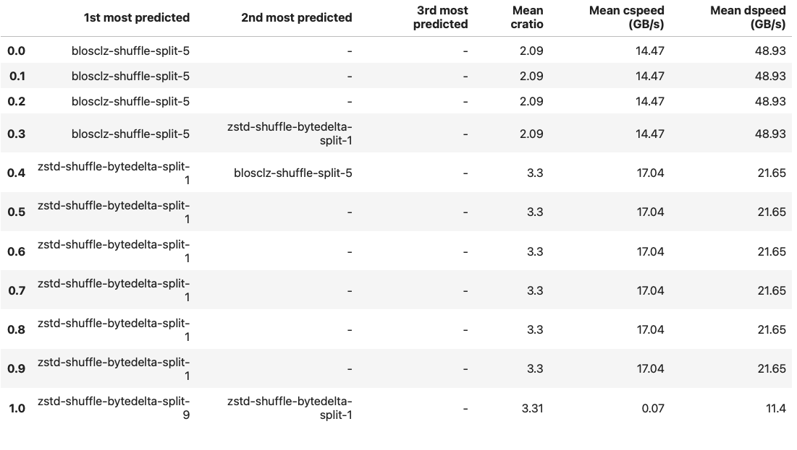

:author: Project Blosc
:email:
:institution: Project Blosc
:equal-contributor:
:bibliography: mybib

:author: Francesc Alted
:email: francesc@blosc.org
:institution: Project Blosc
:corresponding:

:author: Marta Iborra
:email: martaiborra24@gmail.com
:institution: Project Blosc

:author: Oscar Guiñón
:email: soscargm98@gmail.com
:institution: Project Blosc

:author: Sergio Barrachina
:email: barrachi@uji.es
:institution: Universitat Jaume I

---------------------------------------------------------------------------------
Using Blosc2 NDim As A Fast Explorer Of The Milky Way (Or Any Other NDim Dataset)
---------------------------------------------------------------------------------

.. class:: abstract

    N-dimensional datasets are common in many scientific fields, and quickly accessing subsets of these datasets is critical for an efficient exploration experience. Blosc2 is a compression and format library that recently added support for multidimensional datasets. Compression is crucial in effectively dealing with sparse datasets as the zeroed parts can be almost entirely suppressed, while the non-zero parts can still be stored in smaller sizes than their uncompressed counterparts. Moreover, the new double data partition in Blosc2 reduces the need for decompressing unnecessary data, which allows for top-class slicing speed.

    The Blosc2 NDim layer allows to create and read n-dimensional datasets in an extremely efficient way thanks to a completely general n-dim 2-level partitioning, allowing to slice and dice arbitrary large (and compressed!) data in a more fine-grained way. Having a second partition means that we have better flexibility to fit the different partitions at the different CPU cache levels, making compression more efficient.

    As an example, we will demonstrate how Blosc2 NDim enables a fast exploration of the Milky Way. We will use the Gaia DR3 dataset, which is a catalog of 1.7 billion stars in our galaxy. The dataset is 100 GB in size and it is stored in a 3D array of 1.7 billion rows, 6 columns and 3D coordinates (x, y, z).

.. class:: keywords

    explore datasets, n-dimensional datasets, Gaia DR3, Milky Way, Blosc2, compression

Introduction
------------

The exploration of n-dimensional datasets is a common practice in many areas of science.  One of its drawbacks is that the size of the datasets can become very large, and this can make the exploration process very slow.  In this paper we will show how Blosc2 NDim can be used to accelerate the exploration of n-dimensional datasets.

Blosc is a high-performance compressor that has been optimized for binary data. Its design allows for faster transmission of data to the processor cache than the traditional, non-compressed, direct memory fetch approach through an memcpy() OS call. This can be useful not only in reducing the size of large datasets on-disk or in-memory, but also in accelerating memory-bound computations, which is typical in vector-vector operations.

Blosc uses the blocking technique (as described here) to reduce activity on the memory bus as much as possible. The blocking technique divides datasets into blocks small enough to fit in the caches of modern processors and performs compression/decompression there. It also leverages SIMD (SSE2) and multi-threading capabilities present in modern multi-core processors to accelerate the compression/decompression process to the maximum.

.. figure:: sum_openmp-rainfall.png
   :scale: 40%

   Speed for summing up a vector of real float32 data using a variety of codecs that come with Blosc2. Observe the maximum speed is achieved when using the maximum number of (logical) threads in this computer (28). :label:`sum-precip`

Using Blosc compression can accelerate real computations when enough cores are dedicated to the task. In Figure :ref:`sum-precip` you can see a real example of this.

Blosc2 is the new iteration of the Blosc 1.x series which is used in many important libraries (HDF5, Zarr, PyTables...). In particular, the NDim feature of Blosc2 excels at reading multi-dimensional slices, thanks to its innovative pineapple-style partitioning :cite:`BDT23-blosc2-ndim-intro`. This allows for a very fast exploration of general n-dim datasets (and in particular, a 3D Milky Way dataset).

The Gaia dataset
----------------

The Gaia DR3 dataset is a catalog of 1.7 billion stars in our galaxy.  For this work, we have extracted the 3D coordinates and the magnitude of 1.4 billion stars. When stored as a regular binary table the dataset is 22 GB in size.  Here, we have converted this tabular dataset into a 3D array of shape (10_000, 10_000, 10_1000), and every cell containing the magnitude for every star inside it.  In such a cube, there are 700 million of stars (a significant part of the Gaia catalog). As the magnitude is a float32, the size of the dataset is 3.6 TB, although using compression via Blosc2 for storage, we can reduce it to 10 GB.  This is because the 3D array is very sparse, and Blosc2 can compress the zeroed parts almost entirely.

.. figure:: 3d-view-milkyway.png
   :scale: 25%

   Gaia DR3 dataset as a 3D array (preliminary, this is not from the dataset in this paper). :label:`gaia-3d-dset`

In Figure :ref:`gaia-3d-dset` you can see a 3D view of the Milky Way for a different kind of stars.  The color of the points is the magnitude of the star, where the reddest stars are the brightest ones.  In this view, we cannot see the spiral arms of the Milky Way, because the dimensions of the cube are not enough to cover the whole Milky Way.

One advantage of using a 3D array is that we can use the powerful slicing capabilities of Blosc2 NDim to explore the dataset in a very fast way.  For instance, we could explore for star clusters by extracting small cubes as NumPy arrays and counting the number of stars.  A cube containing an anormally high number of counts would be a candidate for a cluster.  We could also extract a 2D slice of the cube and plot it as a 2D image, where the color of the pixels is the magnitude of the stars.  This would allow us to create a cinematic view of a travel over different trajectories in the Milky Way.

Blosc2 NDim
-----------

Blosc2 NDim is a new feature of Blosc2 that allows to create and read n-dimensional datasets in an extremely efficient way thanks to a completely general n-dim 2-level partitioning, allowing to slice and dice arbitrary large (and compressed!) data in a more fine-grained way. Having a second partition means that we have better flexibility to fit the different partitions at the different CPU cache levels, making compression more efficient.

.. figure:: b2nd-2level-parts.png
   :scale: 12%

   Blosc2 NDim 2-level partitioning. :label:`b2nd-2level-parts`

.. figure:: b2nd-3d-dset.png
   :scale: 40%

   Blosc2 NDim 2-level partitioning is flexible: you can specify the dimensions of both partitions in any arbitrary way that fitxs you read access patterns. :label:`b2nd-3d-dset`

With these more fine-grained cubes (aka partitions), it is possible to retrieve arbitrary n-dim slices more rapidly because you don't have to decompress all the data that is necessary for the more coarse-grained partitions typical in other libraries.  See Figures :ref:`b2nd-2level-parts` and :ref:`b2nd-3d-dset` on how this works and can be setup.  Also, for a comparison against other libraries using just a single partition (HDF5, Zarr) see Figure :ref:`read-partial-slices` :cite:`BDT23-blosc2-ndim-intro`.

.. figure:: read-partial-slices.png
   :scale: 70%

   Speed comparison when reading partial n-dimensional slices of a 4-d dataset. :label:`read-partial-slices`

It is important to note that all the data types in NumPy are supported by Blosc2 NDim; that means that, besides the typical cohort of signed/unsigned int, single and double precision floats, bools or strings, you can also store e.g. datetimes (including units), or arbitrarily nested heterogeneous types (which allows, among other things to create multidimensional tables).

Support for multiple codecs, filters and other compression features
--------------------------------------------------------------------

Blosc2 is not only a compression library, but also a framework for creating efficient compression pipelines.  A compression pipeline is composed of a sequence of filters, followed by a compression codec.  A filter is a transformation that is applied to the data before compression, and a codec is a compression algorithm that is applied to the data after the filters.  Filters normally allows for better compression ratios, and/or better compression/decompression speeds.

Blosc2 supports a variety of codecs, filters and other compression features.  In particular, out-of-the-box it supports the following codecs:

- BloscLZ (fast codec; the default)
- LZ4 (a very fast codec)
- LZ4HC (high compression variant of LZ4)
- Zlib (Blosc2 uses the Zlib-NG variant)
- Zstd (high compression)
- ZFP (lossy compression for n-dimensional datasets of floats)

and the following filters:

- Shuffle (groups equal significant bytes together, useful for ints/floats)
- Shuffle with bytedelta (same than shuffle, but with a delta of every byte)
- Bitshuffle (groups equal bits together, useful for ints/floats)
- Truncation (truncates precision, useful for floats; lossy)

Blosc2 has a pipeline architecture that allows to chain different filters :cite:`BDT22-blosc2-pipeline`, followed by a compression codec.  It also allows for prefilters (user code meant to be performed before the pipeline) and postfilters (user code meant to be performed after the pipeline).  This architecture is very flexible and minimizes the data copies in the different steps, allowing to create very efficient pipelines for a variety of use cases.  See Figure :ref:`blosc2-pipeline` for how this works.

.. figure:: blosc2-pipeline.png
   :scale: 30%

   The Blosc2 pipeline. During compression the first applied function is the prefilter (if any), then the filters pipeline (with a maximum of six), and last the codec. For decompressing, the order will be reversed: first the codec, then the filters pipeline and finally the postfilter (if any). :label:`blosc2-pipeline`

In addition, Blosc2 supports user-defined codecs and filters, so you can create your own compression algorithms and use them in Blosc2 :cite:`BDT22-blosc2-pipeline`.  Also, these user-defined codecs and filters can be loaded dynamically :cite:`BDT23-dynamic-plugins`, registered globally inside Blosc2 and installed via a Python wheel, so they can be used transparently from any Blosc2 application (C, Python or any other languages that offers a Blosc2 wrapper).

Automatic tuning of compression parameters
------------------------------------------

Probably the most difficult part of using a compression library is to find the right compression parameters for your data.  Which combination of code and filter would provide the best compression ratio?  Which one the best compression / decompression speed?

BTune is a dynamic plugin for Blosc2 that helps you find the optimal combination of compression parameters for user's needs. It does so by training a neural network on the most representative datasets.  The neural network is trained on a variety of datasets, and it is able to predict the best combination of codec and filters for a given dataset.  See Figure :ref:`predicted-dparams-example` for an example.

   BTune prediction of the best compression parameters for decompression speed, depending on a balance value between compression ratio and decompression speed (0 means favor speed only, and 1 means favor compression ration only).  It can be seen that BloscLZ + Suffle is most predicted category when decompression speed is preferred, whereas Zstd + Shuffle + ByteDelta is the more predicted one when the specified balance is towards optimize for the compression ratio. Based of this table, the user can decide which value for the balance is preferred. :label:`predicted-dparams-example`

After training the neural network, it is possible to use it to automatically tune the compression parameters for a given dataset.
Blosc2 offers a very simple way to do this via the BTune plugin: just set the :code:`BTUNE_BALANCE` environment variable to a value between 0 and 1 (0 means favor speed only, and 1 means favor compression ration only).  Then, when you create a new Blosc2 data container, the compression parameters will be automatically tuned for your data.  This is a very simple way to get the best compression ratio and/or the best compression/decompression speed for your data.

