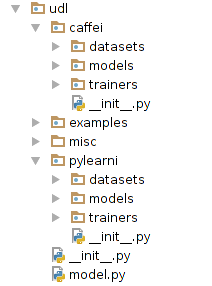

:author: Haitham Elmarakeby
:email: marakeby@vt.edu
:institution: Department of Computer Science, Virginia Tech, Blacksburg, VA, 24060

:author: Lenwood S. Heath
:email: heath@vt.edu
:institution: Department of Computer Science, Virginia Tech, Blacksburg, VA, 24060

----------------------------------------
UDL: Unified Interface for Deep Learning
----------------------------------------

.. class:: abstract

   UDL is a Python object-oriented library that provide a unified interface to use and integrate deep learning libraries. The library is a set of classes implemented on top of well-known libraries such as Pylearn2 [3]_, Caffe  [4]_, and Torch [1]_. Using UDL enables users to easily supply their own data sets, train models, get predictions, and score the performance. We provide a simple use-case that shows how using UDL can make it easy to integrate different components implemented in Pylean2, Caffe, and Scikit-learn in the same pipeline.

.. class:: keywords

   Deep Learning, Pylearn2, Caffe, Torch, Scikit-learn

Introduction
------------

UDL is an object-oriented Python library for deep learning development. The main focus of UDL is to provide a clean and consistent interface for existing deep learning libraries such as Caffe, Pylearn2, and Torch. Current Libraries enable users to define models through special kinds of markup or scripting languages.

Defining models in a language-independent script has advantages such as portability, human readability, and model-code separation. On the other side, working with configuration files is not as easy as writing code. It introduces problems that may arise in writing free text. Moreover, defining a fixed architecture limits the ability of developers to write a dynamic architecture. For example, if a developer wants to design a network that has five consecutive layers with a decreasing number of nodes in each layer, he will have to write the definition of each layer separately. In code, a developer can easily write a single *for* loop that defines the desired number of layers and the needed nodes per layer. One more problem is hyper-parameter optimization. Writing a fixed configuration file can limit the ability to optimize parameters unless you are allowed to write a template configuration file. Re-usability becomes an issue when models are purely defined in text files. The only way that we can reuse previously developed models is through copy and paste. Building a higher level system from previously developed building block is an even harder task.

Python is one of the most used languages in machine learning development. Different libraries are developed for Python, such as Numpy, Scipy, and Scikit-learn, and provide a great baseline for developing higher level systems.  We believe that the developer should be given the choice to develop his/her model in Python. Even if he chooses to write his model in a configuration file, he should have control on running the experiment in Python with full control over the execution and hyper-parameters.

Approach
--------

Our development is guided by the following ideas

- Integration. Developers do not need a library to do everything, they need a library that can integrate with their currently used libraries and can easily provide a step inside their work flow. Integration sometimes comes before functionality. Libraries with good features but with limited integration capability may end up being useless.

- Use Python. Python is a scripting language that allows developers to quickly build and test their ideas. We believe that Python is an ideal language to build prototypes. We focus on giving developers the ability to build and optimize their models in Python. 
- Keep it simple. We are focusing on providing a simple interface that works as a glue between different libraries. Although current deep learning libraries provide a large space of functionalities, the high overhead of learning new and complex interfaces hinders their usability. Providing a simpler interface on top of the current libraries, can increase the usability of deep learning libraries. The proposed interface need not limit the user control over all the aspects of the libraries.
- Keep it organized. Any deep learning experiment can be defined by data set, model, training algorithm, and scoring function. Any library can be re-organized in this structure to provide unified structure for developers.

Architecture
------------
UDL provides a simple interface to access the functionality of current deep learning libraries.
The proposed interface is compatible with the Scikit-learn interface, which makes these libraries integrate with the Scikit-learn system easily.
The current implementation effort focuses on building a layer of abstraction on top of Pylearn2 and Caffe. However more libraries can be added easily.
Below, we explain the general idea of the interface and its implementation in the case of Caffe and Pylearn2.

Interface
---------
The proposed interface is encapsulated in base class *UDModel*, which is inherited from *sklearn.base.BaseEstimator*. All the other UDL models inherit from the base *UDLModel*.

UDModel implements 6 functions, *fit, predict, transform, fit_transform, get_params, and set_params*. The *fit* function is model dependent and must be implemented in child classes. The child class has to set two attributes *configs* and *estimator* in its *fit* implementation.
*configs* is a simple dictionary that stores all the configurable parameters of the model. On the other hand, *estimator* is  a model dependent representation of the fitted model that can be used to predict an output given a new data set.

*UDLModel* provides full implementation of the other five functions based on the two attributes *configs* and *estimator*.
If the child implementation does not set these two attributes, it has to override all the *UDLModel* functions.
Each library implementation is organized under different directories; models, data sets, and trainers. The models directory contains all the core classes of the library.
All classes in this directory inherit from *UDLModel* except for helper classes that are used to define the core models such as layers in the case of Caffe.
The UDL model class encapsulates the functionality of the underlying library class. For example the *Autoencoder* class in UDL.pylearni corresponds to the *Auoencoder* class in Pylearn2.
However the UDL model adds the implementation of the base *UDLModel* in addition to the regular functionality.

Pylearn2 provide a set of Python classes that make class inheritance and adding new functionality easy. UDL models extend most of the core Pylearn2 classes, so they can used the same way the original Pylearn2 classes used.
Caffe, on the other hand, provides a set of Python messages that cannot be inherited.
UDL models encapsulate the corresponding Caffe messages and provide an easy way for initialization and accessing their attributes.

Many model classes in the underlying libraries do not know how to train themselves. However, in UDL model classes, it is required to be able to train yourself.
We use a dependency injection approach to inject the functionality need by the model to train itself. The UDL model receives in its constructor an optional argument which represents a trainer or solver.
The UDL model makes use of the supplied *Trainer* to train itself. If the user failed to supply a trainer argument, the UDL model uses its default trainer which is usually an instance of *SGDTrainer* that uses Stochastic Gradient Descent.

Another optional parameter is a *dataset_adapter*. The underlying libraries require data to be supplied in a certain shape or to be described in a certain format. *dataset_adapter* is the place to define these requirements.
It can also be used as a prepossessing stage to modify the input data. In the extreme case, it can be used to supply data instead of the regular input data argument, for example, if data is to be read from an external source.

    UDL structure showing the two interfaces corresponding to Caffe and Pylearn2. More interfaces are to be added.

Caffe
-----
Caffe is a  C++ library for deep learning. Caffe provides a Python binding with limited functionality.
Models are defined in a text-based Protocol Buffer language.
Caffe defines *layer*, *net*, and *blobs* as the main building blocks for models.
A *layer* is a basic unit that processes its input to produce some kind of output.
A *Net* is a connected set of layers. Data flows between the layers in the format of 4 dimensional array called a *Blob*.

Caffe does not officially support defining models with Python. However, they provide the core classes in a Protocol Buffer (PB) format.
The PB can be compiled using the Google compiler to generate the corresponding classes in C++ and Java.
Unlike C++ and Java, the compiler does not generate classes in Python, rather it generates a set of meta-classes.
We compiled the PB description to generate a set of Python meta-classes that are used as the base of our development.

On top of the generated meta-classes, we created a layer of Python classes that provides clean interfaces for downstream development.
The classes layer simply encapsulates meta-classes, exposes the attributes using Python properties, and provides initialization and default values.
Although this layer may go out of synchronization if the base Caffe library changes, we depend on the community to keep it up to date.

Layers act as low level building blocks, so we combined these layers into higher level models that can do certain job.
We used a fat model design, which means that the model can train itself, predict the output and maintain its in-memory state.
To do this, it has to be given the input data, the training algorithm and different parameters needed to fulfill its job.
Although not being the optimal design, our goal was to integrate with other libraries such as Scikit-learn, which uses the same design.
All the classes in this layer of models inherit from the same *UDLModel*, which implements the Scikit-learn interface.

Pylearn2
--------
Pylearn2 is a deep learning library based on Theano [1]_ that can compile models into C++ code that can run on GPUs or CPUs.
In Pylearn2, a model can be defined in a YAML markup language or simply in Python.
Pylearn2 provides an excellent python interface but it does not officially support defining models in code.
Pylearn2 provides a set of reusable models and training algorithms that can be used to define an experiment.

We extended the models provided by Pylearn2 to add more features.
As described earlier, we implemented a layer of models that can train themselves.
The extended models implement the Scikit-learn interface, namely, *fit*, *predict*,  *transform*, and *fit-transform*.

The extended model keeps the same signature of the parent model, which means that it can be easily used the same way the parent is used.
Any extra initialization arguments are added as optional parameters. In particular two extra parameters are needed to enable the model to train itself, *Trainer* and *dataset_adapter*.
The base *UDLModel* has a *get_param* function; however, the Pylearn2 model defines a function with the same name.
The Pylearn2 function is meant to return the current state of the model, while the UDLModel function is used to return just the configurable parameters of the mode. As a workaround, we changed the name of the Pylearn2 function to avoid interference.

Putting things together
-----------------------
Making it possible to define and train models in Python and implementing a unified interface for all the supported libraries enabled us to put things together.
We are able to implement a single pipeline that uses components from different libraries.
The example below shows how to use an autoencoder implemented in Pylearn2 and a logistic regression implemented in Caffe and score the results using Scikit-learn.

.. code-block:: python

    from udl.caffei.models.logistic import Logistic
    from udl.pylearni.models.autoencoder import Autoencoder
    from sklearn.pipeline import Pipeline
    from sklearn.metrics import accuracy_score

    def test(X, Y, Yt):
        auto = Autoencoder(nhid = 4)
        clf_caffe = Logistic()
        pipe = Pipeline([('autoencoder_pylearn2', auto),\
         ('logistic_caffe', clf_caffe)])
        pipe.fit(X,Y)
        pred = pipe.predict(Xt)
        accuracy = accuracy_score(Yt, pred)

The code simple use Scikit-learn pipeline to run two models in sequence. The first model is an instance of *Autoencoder* that is defined in *udl.pylearni*. The model is instantiated using the default parameters except of the number of the hidden nodes.
The second model is an instance of *Logistic* model defined in *udl.caffei* and it uses the default parmaters as well. Both models can process in-memory data and produce the desired prediction using the unified Scikit-learn interface.

Availability
------------
Source code is published and BSD-licensed on GitHub https://github.com/marakeby/udl.git. If you use UDL in published research work we encourage you to cite this article.

Conclusion
----------
Trying to fill a gap in the current implementations, we proposed a simple interface that can be easily implemented.
The proposed interface is meant to enable developers to use different libraries to implement their ideas with ease.
This will help developers to integrate features from different libraries in the same pipeline.
Comparing the performance of features implemented by different libraries can be easily done using the same code.
A sample implementation of the proposed interface is provided and made public in the UDL library.

-----------------------------

References
----------
.. .. [Atr03] P. Atreides. *How to catch a sandworm*,
           Transactions on Terraforming, 21(3):261-300, August 2003.

.. [1] Bergstra, James, et al. "Theano: A CPU and GPU math expression compiler." Proceedings of the Python for Scientific Computing Conference (SciPy). Vol. 4. 2010.

.. [2] Collobert, Ronan, Koray Kavukcuoglu, and Clément Farabet. "Torch7: A Matlab-like environment for machine learning." BigLearn, NIPS Workshop. No. EPFL-CONF-192376. 2011.

.. [3] Goodfellow, Ian J., et al. "Pylearn2: A machine learning research library." arXiv preprint arXiv:1308.4214 (2013).

.. [4] Jia, Yangqing, et al. "Caffe: Convolutional architecture for fast feature embedding." Proceedings of the ACM International Conference on Multimedia. ACM, 2014.

