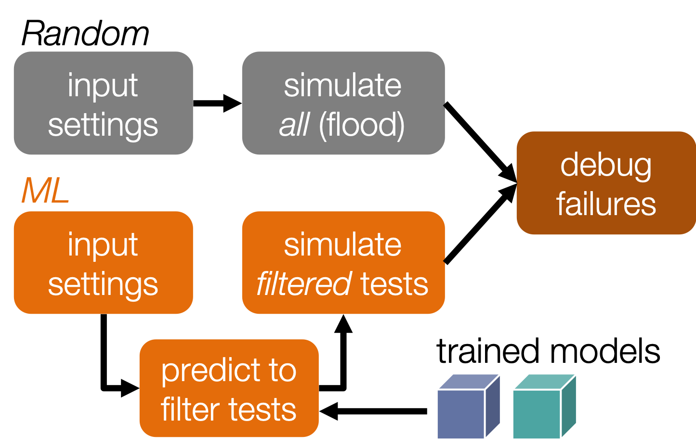
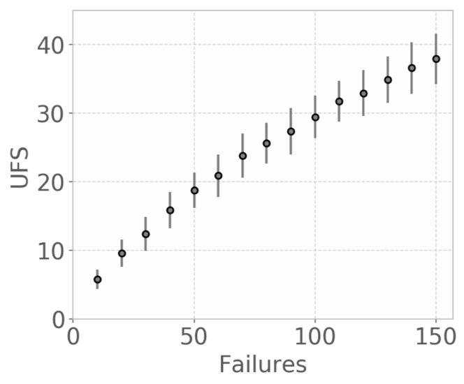
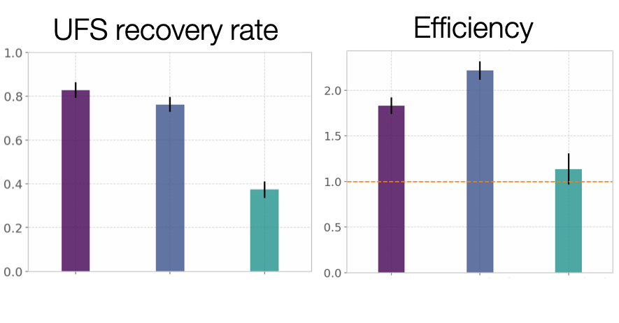
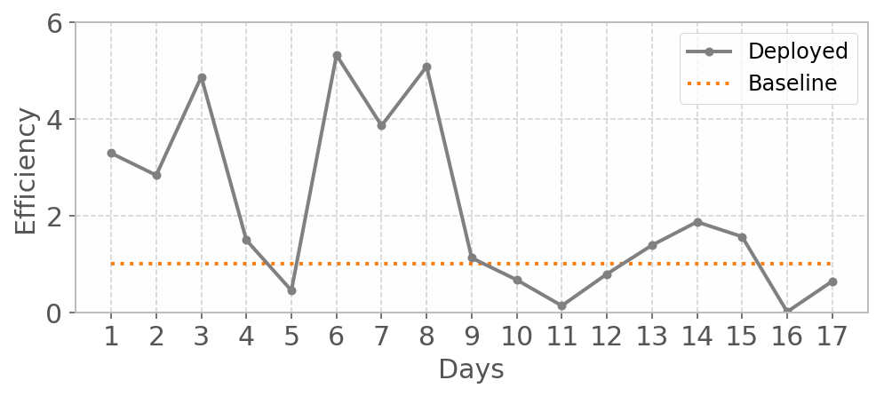
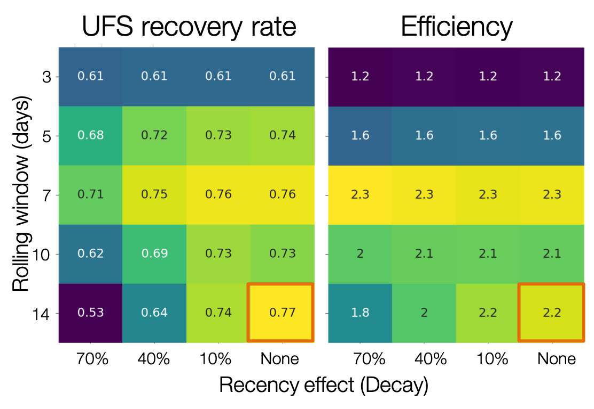
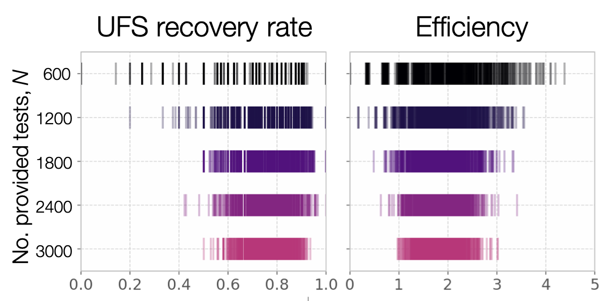
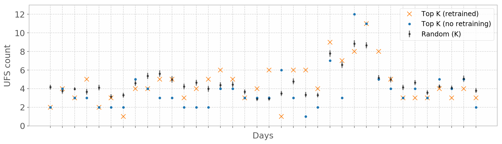

:author: Hongsup Shin
:email: hongsup.shin@arm.com
:institution: Arm Research
:corresponding:

----------------------------------------------------------------------------------
Case study: Real-world machine learning application for hardware failure detection
----------------------------------------------------------------------------------

.. class:: abstract

   When designing microprocessors, engineers must verify whether the proposed design, defined in hardware description language, does what is intended. During this verification process, engineers run simulation tests and can fix bugs if the tests have failed. Due to the complexity of the design, the baseline approach is to provide random stimuli to verify random parts of the design. However, this method is time-consuming and redundant especially when the design becomes mature and thus failure rate is low. To increase efficiency and detect failures faster, it is possible to train machine learning models by using previously run tests, and assess the likelihood of failure of new test candidates before running them. This way, instead of running random tests agnostically, engineers use the model prediction on a new set of test candidates and run a subset of them (i.e., "filtering" the tests) that are more likely to fail. Due to the severe imbalance (1% failure rate), I trained an ensemble of supervised (classification) and unsupervised (outlier detection) models and used the union of the prediction from both models to catch more failures. The tool has been deployed in an internal high performance computing (HPC) cluster early this year, as a complementary workflow which does not interfere with the existing workflow. After the deployment, I found performance instability in post-deployment performance and ran various experiments to address the issue, such as by identifying the effect of the randomness in the test generation process. In addition to introducing the relatively new data-driven approach in hardware design verification, this study also discusses the details of post-deployment evaluation such as retraining, and working around real-world constraints, which are sometimes not discussed in machine learning and data science research.

.. class:: keywords

   hardware verification, machine learning, outlier detection, deployment, retraining, model evaluation

Introduction
------------

Simulation-based hardware verification
######################################

Hardware verification is the process of checking that a given design correctly implements the specifications, which are the technical description of the computer's components and capabilities. It is recognized as the largest task in silicon development and as such has the biggest impact on the key business drivers of quality, schedule and cost. In the computer hardware design cycle, microprocessor manufacturing companies often spend 60-70% of the cycle dedicated to the verification procedure. Traditionally, two techniques have been used: formal and simulation-based (random-constraint) methods [Ioa12]_. The former adopts a mathematical approach such as theorem proving and requirement checks [Wil05]_, which provides exhaustiveness but doesn't scale well with design complexity. Due to the exponentially-growing design complexity, the more widely used approach is the simulation-based testing, which simulates a design by providing stimuli to tests. These stimuli can be considered as arbitrary values that control certain functionalities of the design that were expressed in hardware description language such as whether to turn on or off a specific setting. During simulation-based testing, verification engineers provide a set of constraints to stimuli so that they can direct tests toward a certain direction. However, it is not easy to target certain design parts deterministically and engineers often depend on previous knowledge or intuition. 

Failures (bugs) in hardware verification
########################################

Hardware verification can be compared to unit testing in software engineering, especially since design functionalities are realized in hardware description language (HDL) like Verilog. Similar to software testing, hardware verification process involves checking whether simulations of the code written in HDL with a set of given input values (i.e., tests with certain inputs), show desirable behavior. If a test returns undesirable output, it is considered as a failure (bug). To fix the failures, engineers modify the HDL source code such as by fixing "assign" statements or by correcting or adding conditions (e.g., "if" statements), and so on [Sud08]_. The HDL-level hardware verification is one of the many steps in hardware testing, which precedes physical design implementation. This low-level verification is a critical step in hardware testing because fixing a bug in a higher level (e.g., in physical design or even in a product) is more costly and challenging because it is hard to identify which previous steps have bugs.

Previous machine-learning based approach
########################################

The ultimate goal of hardware verification is to have a (close-to) failure-free design. From the simulation-based testing perspective, this is an exploration problem where machine learning can be useful. For instance, reinforcement learning algorithms can be used to explore the complex space of test stimuli by learning a reward function [Ioa12]_. However, this approach is not feasible because the simulation-based testing is non-deterministic and intractable, which makes it difficult to estimate the level of stochasticity. This is mainly because the motivation for the simulation-based approach is randomization, often implemented in multiple steps (i.e., a value in an input setting randomizes a value in the next step, which then randomizes a value of a different setting in the following step, etc.). The testing tools have not been built to track these setting values and the information on probability distributions used in the randomization process have been left out. To address this, a few studies [Bar08]_, [Fin09]_ adopted a probabilistic approach but they failed to mention actual implementation in production cycle and scalability issue. The majority of the previous research on hardware verification with the simulation-based testing approach has focused on supervised learning [Mam16]_, [Bar08]_, [Wag07]_ and evolutionary algorithms [Ber13]_, [Cru13]_. [Mam16]_ has shown a study that is the closest to this study in nature but the authors focused on high-level instruction set simulator (ISS), which generates instructions at a higher level (related to hardware performance, a high-level metric) than the design level. 

   Overview of the prototype pipeline. Top: the existing workflow (the randomized testing). Bottom: the complementary machine learning (ML) flow. By default, engineers run all tests that are randomly generated. In the ML flow, before running tests, the test candidates (input settings) are shown to the models first. The models then flag which tests are likely to fail. In the end, engineers can run the flagged test candidates only. In the final deployed version, approximately 1000 test candidates are provided to the ML flow, which passed about 400 tests. This corresponds to 10% of the number of tests in the top flow. The cubes correspond to the pre-trained machine learning models (blue: a supervised model, green: an unsupervised model). :label:`Fig.1`

Simulation-based testing in practice
####################################

In practice, engineers build a testbench to house all the components that are needed for the verification process: test generator, interface, driver, monitor, model, and scoreboard. To run tests, verification engineers define a set of values as *input settings*, which can be compared to input arguments to a function. These values are passed to the test generator, and under certain constraints, a series of subsequent values that stimulate various parts of the design are *randomly generated*. This information is then passed to the interface through the driver. The interface interacts with a design part (register-transfer level (RTL) design written in HDL) and then the returned output is fed into the monitor. To evaluate the result, the desirable output should be retrieved. This information is stored in the model, which is connected to the driver. A test is identified as a failure when the desirable output from the driver (through the model) and the output from the monitor do not match. In addition to the binary label of pass or failure, the testbench also returns a log file of the failure, if the test has failed. This log contains detailed information of the failure. Each failure log is encoded as an 8-digit hexadecimal code by a hash function. This code is called *unique failure signature (UFS)*. In general, instead of inspecting every failure log, engineers are more interested in maximizing the number of UFS that are collected after a batch of tests. Collecting a large number of UFS means failures with a great variety have been hunted down. Having a larger variety of failures is important because it means the tests have explored various parts of the design and thus, it's likely to discover failures associated with rare edge cases or problems overlooked before. Once a new UFS is found, engineers starts a debugging process to fix the failure. 

Random generation of the test settings in the test generator is used to run a batch of tests automatically almost daily to explore random parts of the design with efficiency. In practice, engineers run tests with certain input settings and collect the results after the tests are simulated. The way that engineers control the input settings varies widely. In an extreme case, they only control the seed number of a pseudo-random number generator in the test generator for the entire set of the input settings of test candidates. Normally for a test, engineers have a set of input settings, not just the seed, which either turns a setting on and off or controls stochastic behavior a setting by defining what kind of values the setting can take. For instance, if a certain input setting has a string value of *"1-5"*, it indicates that the actual stimulus that goes into the simulation can be *any integer from 1 to 5*. Unfortunately, the testbench does not track this information and it is not possible to know which value ended up getting chosen eventually. Hence, it is extremely challenging to guide a testbench to generate a specific value of the input settings. *This is why building a machine learning model is challenging because two tests with the exact same values of an input setting can result in two different outcomes.* Additionally, engineers make changes to the design almost every day, which includes a new implementation or modification in the design, or bug fixes. This affects the test behavior and in turn, data generation process, which implies that the data distribution can potentially change almost daily (i.e., frequent data drift).

Working around the stochastic test generation
#############################################

This situation requires a unique approach. It is impossible to eliminate randomness in the test generation step, which makes it difficult to guide testbench to test specific input values or parts of the system (cf. it is possible to target a specific module but the process is still not deterministic). Instead, we leave the inputs to be generated randomly and filter them afterward. By using the labeled data from previous tests (i.e., tests that were already simulated), a machine learning model (classifier) can be trained to predict whether a test will fail or pass with a given set of input settings. Then, it is possible to provide a large set of test *candidates* (a number of tests with random input setting values, i.e., providing the new input values) to the trained model that assesses which subset of the test candidates will fail. This way, it is possible to run the subset of tests only, instead of running the entire test candidates agnostically. This can bring cluster savings and make the verification process more efficient. However, the existing simulation-based testing with random constraints *should remain* because we still have to explore new design parts, which in turn provides new training data for model update. Hence, two parallel pathways can be proposed (Fig. :ref:`Fig.1`); one with the default randomized testing and the other with machine learning models, where an additional set of test candidates are provided and then only the tests flagged by the models are filtered and run. This way, it is possible to continue collecting novel data from the first pathway to explore a new input space while utilizing the data from previous tests via the ML flow.

Post-deployment analysis
########################

I used both supervised and unsupervised models to address the severe class imbalance problem and used the union of the prediction from both models. This means, a test is predicted to fail when at least one of the two models predict it will fail. With this approach, for a set of independent testing datasets, it was possible to find 80% of unique failure signatures (Fig. :ref:`Fig.3`) by running only 40% of tests on average, compared to running tests based on the original simulation-based method. The tool has been deployed in production since early this year in our internal cluster as a part of daily verification workflow, which is used by verification engineers in the production team. It is not common in both machine learning and hardware verification literature to find how suggested models perform in a real-world setting. Often machine learning studies show performance based on a single limited dataset or commonly used benchmark datasets. In this paper, I address this and attempt to provide practical insights to the post-deployment process such as decisions regarding the automation of model retraining and addressing randomness in the post-deployment period. 

   Relationship between the number of failures (x axis) and the number of unique fail signatures (UFS) on the y axis (mean and standard error). To generate the error bar, I ran 100 simulations where in each simulation, I draw :math:`N` failed tests among a pool of 250k tests and counted the number of UFs. The more failures occur, the more UFS are found. :label:`Fig.2`

Methods
-------

Data
####

Simulation-based testing is run almost every day via a testbench. Every simulated test and outcome (i.e., test success (pass or failure) and unique failure signature (UFS) if a test has failed) are stored in a database. To address the issue of data drift over time, two datasets are collected. The first dataset ("snapshot") is generated from a same version of testbench (115k tests). Model evaluation with this dataset provides information on the baseline model performance when data doesn't change over time. For the second set, a month's worth of data (ca. 6k tests per day) is collected. The second dataset ("1-month") is used specifically to simulate retraining scenarios and to challenge our model for every-day changes in the testbench (150k). Both datasets are from a specific unit of a microprocessor with a specific test scenario. The input dataset has individual tests as rows and test settings (stimuli) as columns. These settings are specified by verification engineers. The total number of settings are in the range of several hundreds. The output dataset has tests as rows and two columns, one for the pass-failure binary label and the other for the unique failure signatures of the failed tests.

Data preprocessing
##################

The input data was preprocessed based on the domain knowledge of the verification engineers. In the raw data, roughly 70% of the data was missing, which corresponds to input settings that were not modified from the defaults. Using a software analogy, this is similar to not having to specify an input argument value in a function, if it already has a default value for that argument. The engineers were able to obtain the default values, which fixed the missing data issue. There were about 20% object (i.e., non-numerical) columns. Some of them were nominal columns (e.g., "name1", "name2") but the majority turned out to be numerical values in quotes (e.g., "5", "100"), quoted ranges (e.g., "1-5", "50-100") or a dictionary with key-value pairs in quotes. For the quoted numerical values, I simply stripped the quotes and converted them to numbers. For the quoted ranges, it was not straightforward because these columns have uncertainty information in them. For instance, "1-5" means any values from 1 to 5 and there was no way to know which value was chosen in the end and also what type of probability distribution was used for the random draw. Although I initially considered treating them as nominal, I decided to take the mean of the minimum and maximum values of a range value: for "1-5", it would be represented as (1+5)/2 = 3. This way, it might be possible to preserve some numerical information about the range in the input data. For the quoted dictionary, I parsed them and expanded to multiple columns so that each key became a column in the input dataset. Finally, I dropped columns that were non-informative (i.e., single unique value) and duplicates. This resulted in about 10% increase of the number of columns, which was still in the range of several hundreds. Whenever a change is made to the design, the set of the input settings may change. In this project, on average, less than 5 columns (including 0) were either added or removed every time the tests were run. When building a training dataset from tests across multiple days with different input settings, I used the union to include all. Here, to impute missing values from the settings absent in the past, I used the domain knowledge of the verification engineers. When preprocessing a set of new test candidates for prediction, I dropped the input settings that are absent in the feature set of the pre-trained models. The output datasets did not require preprocessing.

Models
######

I used an ensemble of a supervised and an unsupervised learning models. Due to the severe class imbalance between passes and failures (near 99% pass and 1% failure rate) in the training data, it is possible to either train a supervised model with adjusted class weight or train an unsupervised model that detects outliers (i.e. failures). For the unsupervised, because the majority of the training data is passed tests, it is possible to consider the failures as outliers or abnormalities. In a preliminary analysis, I found that the supervised and the unsupervised models provided predictions that were qualitatively different; the unique failure signatures (UFS) from the supervised model’s and the unsupervised one’s predictions were not identical although there were some overlaps. Thus, when the union of both predictions were computed, there was a small increase of UFS recovery across many testing datasets. Hence, I decided to use both models and take the union of the predictions. This means, when test candidates are passed to the model for prediction, a candidate will be flagged as failure either of the supervised or the unsupervised predicts it as failure.

Due to the frequent changes in data generation process, I decided to use algorithms robust to frequent retraining and tuning (i.e., faster training time). I used a group of non-neural-net scikit-learn (v0.20.2) classifiers as supervised and isolation forest as unsupervised learning algorithms. For both cases, I conducted randomized search to tune the hyperparameters and select the best model. For the supervised, I used algorithms such as logistic regression and tree-based ensemble methods (random forest, gradient boosting, and extra trees). The winning algorithm was the logistic regression with L2 regularization, potentially because the preprocessed input data had high sparsity (i.e., more than 50% was 0 after imputation).

Engineers care more about the unique failure signatures than simple binary labels. When a number of failures are found in test simulation, if the majority have the same failure signatures, it means engineers found failures that are very similar to each other, which has little value to them; the ultimate goal of verification is to find every possible type of failure (bug) to make the design bug-free. The more UFS engineers find, the more likely to find novel failures. Moreover, if we find more UFS by running fewer tests, it bring higher efficiency in the procedure. Hence, it would make sense to have an objective function that maximizes the number of UFS found, for instance, by formulating the problem as multi-class classification where each class corresponds to a failure signature. In the training data, each failure signature is found mostly just once or a few times, which makes it difficult to use in model training. However, I found that the number of failure signatures increases with the number of failures (Fig. :ref:`Fig.2`); the more failures we find, the more unique failure signatures are retrieved. This suggests that as long as the binary approach works well and catch more failures, it will be natural to retrieve more unique failure signatures.

.. table:: Example of model candidate scores and how the best model is chosen. In the tuning process, both recall and efficiency are considered. Efficiency of 1 means the ML flow is as efficient as the random flow. This becomes the lower bound of model performance. #3 is ruled out because even though it has the highest recall, the efficiency is lower than 1 (baseline). Then, #1 is the model with the highest recall. However, instead of choosing this, I look at other candidates within a margin (0.05 in this case) from the maximum value of the recall, meaning all the candidates that have recall values between 0.70 (maximum) and 0.65 (=0.70-0.05). In this example, #2 has higher efficiency than #1 and is within the recall margin. Hence, #2 is chosen as the best model. :label:`table1`

   +------------------+----------------+----------------+
   | Model candidates | Recall         | Efficiency     |
   +==================+================+================+
   | #1               | 0.70           | 1.25           |
   +------------------+----------------+----------------+
   | #2 (chosen)      | 0.66           | 1.85           |
   +------------------+----------------+----------------+
   | #3               | 0.85           | 0.55           |
   +------------------+----------------+----------------+
   | #4               | 0.25           | 2.50           |
   +------------------+----------------+----------------+

   The unique failure signature (UFS) recovery rate (left) and efficiency (right) metrics across 15-day (1 month, the tests were not generated daily during this duration) performance for the three models (union, supervised and unsupervised). The dashed orange line in the efficiency plot shows average fail-discovery rate (the lower bound of the efficiency metric). Note that the union approach catches more UFS but lowers efficiency because more tests should be run. :label:`Fig.3`

Metrics and hyperparameter tuning
#################################

For both supervised and unsupervised models, I used recall and precision as basic metrics (for model selection in the tuning process). In general, it is not easy to evaluate unsupervised models but in this case, I have labeled datasets and hence it was possible to use the classification metrics. I also used more practical metrics to increase interpretability and address unique failure signatures, which engineers care about. I defined the following two metrics: *unique failure signature (UFS) recovery rate* and *efficiency*.

.. math::

   \text{UFS recovery rate}
   \footnote{This metric is the same as the Jaccard similarity of $S_{\hat{y}=1}$ and $S_{y=1}$. When Jaccard similarity is used as a metric between two arbitrary sets $A$ and $B$, it is often assumed that $|A - B|$ and $|B - A|$ are non-zero (i.e., $A \not\subset B$ and $B \not\subset A$). In this case, $S_{\hat{y}=1} \subset S_{y=1}$, and thus I defined the UFS recovery rate with set cardinality.} 
   = \frac{\mathrm{card}(S_{\hat{y}=1})}{\mathrm{card}(S_{y=1})}, 

where :math:`S` is a set of UFS, :math:`y` and :math:`\hat{y}` are true and predicted labels of failure (0 as pass and 1 as failure), and :math:`\mathrm{card}(S)` is the cardinality of the set :math:`S`, also known as the unique count of the set. Hence, :math:`\mathrm{card}(S_{\hat{y}=1})` means the number of the UFS in the tests that are predicted as failure and :math:`\mathrm{card}(S_{y=1})` as the total number of UFS in all failed tests in training data. This metric is similar to recall but here the focus is on the retrieval of UFS instead of the binary labels.

.. math::

   \text{Efficiency} = \frac{\text{Precision}}{\frac{\sum_{i=1}^{N} y_{i}}{N}},

where :math:`N` is the total number of the tests in the training data. In the deployment setting where both the default and ML flows exist, :math:`N` is the total number of the tests in the *default* flow. The efficiency metric is defined to easily understand how efficient the ML flow is compared to the baseline (the random flow). The numerator is the precision of the ML flow. The denominator is the proportion of the failures in training data (or the tests in the random flow), which means how often failures are found on average when running randomized tests (i.e., average fail-discovery rate). This metric can be used as a lower bound of model performance. Since engineers want to discover as many failures as possible, this would mean maximizing recall. Due to the trade-off between recall and precision, this attempt would decrease precision. However, the precision should not be lower than the average fail-discovery rate, because otherwise, the random flow would be enough or even more efficient than the ML flow at finding failures. Therefore, desired model performance should show the efficiency score larger than 1.

Since the efficiency metric provides a lower bound to model performance, when tuning the hyperparameters, instead of looking at the combination with best recall, I use the following rule to select the best model. First, the model candidates with the efficiency score smaller than 1 are dropped because they are less efficient than the baseline. Next, the maximum of the recall values from the rest of the candidates is identified. Instead of selecting the candidate with the maximum recall, I set up a recall margin (0.05) from the maximum recall and check whether there are candidates that are within the margin. Consider this as looking at not just a single model with the best recall but multiple models with close-to the best recall values. Among these candidates, I chose the one with the highest efficiency. This way, without compromising the recall too much, the model with higher efficiency can be chosen. The example is shown in Tab. :ref:`table1`.

Results
-------

For the *snapshot* dataset, the testing data (50% holdout data in 10 different sets; each set is generated independently) shows that the union predictions from the trained supervised and unsupervised models achieved a UFS recovery rate of :math:`82 \pm 2` % (mean :math:`\pm` sem) and an efficiency of :math:`1.8 \pm 0.1` (mean :math:`\pm` sem). Similar results were obtained in the *1-month* dataset (Fig. :ref:`Fig.3`). Note that in the figure, the UFS recovery rate increased for the union approach but the efficiency was sacrificed because the union approach naturally required running more tests. Since the precision score was very low (due to the class imbalance), I ran a permutation test as a sanity check (100 runs) and found the model performance was significantly different from the permuted runs (:math:`p=0.010` for the *snapshot* dataset). Overall, in both datasets, on average, the union approach flagged about 40% of the tests and was able to retrieve 80% of the unique failure signatures. This suggests that with the ML flow, it is possible to find 80% of UFS by running only 40% tests, compared to the random flow (baseline).

   First 17 days (3k-4k tests per day) of model performance (efficiency) after deployment. The performance fluctuates widely (all the way up to more than 5 then sometimes plummet to zero). Note that the models have not been retrained during this period. :label:`Fig.4`

Post-deployment analysis
------------------------

Deployment
##########

Several productions engineers and I wrote Python and shell scripts to build a command-line tool that verification engineers can run without changing their main random flow. The script takes test candidates as input and makes a binary prediction on a test candidate's success (pass or failure) based on the pre-trained models (both the supervised and the unsupervised and then their union). Whenever new test candidates are provided to the tool, the input settings of those are preprocessed so that they are consistent with the training data. The tool is provided with 1k test candidates, generated from the testbench, and it flags about 400 tests on average. The number of test candidates provided depends on the computational resources available in the internal cluster. In the flagging (i.e., prediction) process, the script returns the unique identifier of the flagged test candidates. Then it invokes a testbench simulation where only the filtered tests are run. The scripts are deployed as a part of the production team's continuous integration. 

After the deployment, model performance started showing high variability, sometimes very different from the pre-deployment model performance. Figure :ref:`Fig.4` shows the model performance of the first 17 days of post-deployment period. Note that the models were not retrained during this period. During this period, the efficiency scores were often larger than one but they changed dramatically sometimes. In the following sections, I will discuss how to identify the cause of the performance variability in the context of model retraining, and other issues found during the post-deployment stage.

   Average model performance metrics obtained by simulating retraining scenarios for the training data size (rolling window) and the relative importance of recent data (weight decay). The x axis shows decay parameter, which decides the weights applied to training data. The larger the weights, the faster the decay, meaning old tests become much less important. The y axis shows the rolling window size as the number of days. This decides the training data size; 10 means the training data consists of the tests gathered for the past 10-days. For both plots, brighter colors indicate more desirable results. The marked orange squares show the final decision on training (i.e., 14-day window without decay) :label:`Fig.5`

Data for retraining
###################

During the initial period of post-deployment, the models were manually retrained whenever major changes were made either in the tool or in the design. To automate the retraining process, I tested ideas related to the model retraining. First, for any retraining, the size of training data should be determined. Technically, it is possible to use the entire historic data from the very beginning of the testing process. However, this is not a good idea because the training data will be too big and very old tests would be useless since the design would have changed a lot since then. To determine how much training data is needed, I conducted an experiment by considering these two factors: rolling window size and weight decay. The rolling window size corresponds to :math:`N` consecutive days (:math:`N = 3, 5, 7, 10, 14`) to look back to build a training dataset. For instance, if :math:`N=7`, tests that were run for the past 7 days become the training data. 

The weight decay is related to how *fresh* the data is. If tests were generated more recently, they might be more important because the design then is more similar to the current day's compared to older tests. The multiplicative power decay is used to compute the weight :math:`w`, (:math:`w(t) = x^t`, where :math:`x` is the power parameter (0.3, 0.6, 0.9, 1 (=no decay)) and :math:`t` is the number of days counting from today). Using the power law, :math:`x=0.9` would mean tests from yesterday are 10% less important than today's. Once the weights are computed, they are applied to the objective function during training by using ``sample_weight`` parameter in scikit-learn models’ ``fit()`` module. It allows users to assign weights during model fitting for every data point. Since multiple tests are generated on a day, they each get the same weights and the weights only vary on the day-level. Note that this weight adjustment is added on top of the class weight adjustment (``class_weight='balanced'``).

All combinatorial scenarios between the rolling window and weight decay were tested via simulation across multiple datasets (Fig. :ref:`Fig.5`). When the rolling window was too small (e.g., :math:`N=3`), performance was low for both the UFS recovery rate and the efficiency, which suggests the 3-day window might be too small to construct a good training dataset. A faster decay (small power parameter) tends to mimic the effect of having a smaller rolling window and generally degraded performance. As shown in Fig. :ref:`Fig.5` as an orange box in each grid, the final decision was to have a 14-day window without any decay even though the efficiency value was slightly higher in the 7-day without any decay. This was to consider the fact that it is possible to run a smaller number of tests in the future due to the potential cluster resource constraints and thus the 7-day window might not provide enough tests for training.

   The effect of the number of tests that are provided to the models and the performance variability. Each vertical line in the raster plots represents a single simulated run. The model performance is more variable when fewer tests are provided to the models. It may imply that the performance depends on the quality of the test candidates, which can vary more if the number of the test candidates provided is smaller. The more tests we provide, the less variable the performance becomes. :label:`Fig.6`

Random-draw effect
##################

It is suspected that the fluctuation in model performance (Fig. :ref:`Fig.4`) might be related to the quality of the test candidates. This is because the test candidates were generated randomly in the testbench independently and we have no control over it. Hence, by chance, it is possible that the test candidates on a certain day might be more challenging to the models (e.g., samples that are closer to the decision boundary), which may result in low performance (i.e., "random-draw" effect). To test this idea, I simulated the effect of the random draw by varying the number of test candidates provided to the models (Fig. :ref:`Fig.6`). I found that when more candidates were provided, model performance was more stable for both UFS recovery rate and efficiency. In the actual deployment, about 1000 test candidates were provided to the tool. As shown in Fig. :ref:`Fig.6`, it is very much possible that with 1000 candidates, the efficiency can be lower than one or as high as four in certain draws. For the simulation in Fig. :ref:`Fig.6`, I drew tests from a pool of 250k tests but considering that the actual number of possible test candidates that can be ever generated is astronomical, variability in model performance due to the random-draw effect could be more severe in reality.

   Comparison in UFS *counts* between the randomly drawn K tests and the model-filtered K tests (K=400) for 36 days after deployment. The prediction probability and the anomaly score were used to rank the filtered test candidates and choose the top K tests to run (the orange crosses and blue dots), for the supervised and the unsupervised model, respectively. For the orange crosses, the models were retrained and tuned whenever the model performance was worse than the baseline, three days in a row. The blue dots show the scenario without any retraining throughout the whole period. The gray dot-line plot shows mean and 95% confidence interval of performance generated from 100 random draws from a pool of 3k tests from the random flow (daily). Since all scenarios that are compared here have the same number of tests, direct comparison of the UFS counts is available. :label:`Fig.7`

Top-K approach with periodic retraining
#######################################

Although the predictions from the supervised and the unsupervised models are binary in the deployed tool, in fact both models (logistic regression and isolation forest) can return a continuous score, which can be used as a measure of likelihood of failure. For the supervised model, this is prediction probability and for the unsupervised, this is anomaly score. In the default setting (as in the deployed tool), the supervised model classifies the candidates with the probability of failure larger than 0.5 as failures, and the unsupervised flags the ones with negative anomaly scores as outliers.

To address the random-draw effect, it might be better to use these likelihood metrics. With these metrics, the test candidates can be ranked and the tool can choose the top candidates, which are more likely to fail (prediction probability for a supervised model) or more abnormal (anomaly score of an unsupervised model) than other candidates. Then it is possible to provide a larger number of test candidates to the models, which can simply choose the top :math:`K` candidates. This allows the models to see more test candidates, which can potentially reduce the random-draw effect. It also works well with the deployed tool because the test candidate generation is very fast and doesn't cost much. Assuming that enough test candidates are provided to the models, it is not necessary to set specific cut-offs for the likelihood measures but to pick the top :math:`K` tests where :math:`K` will simply depend on the cluster resource constraints, which is more straightforward.

To test the idea of the top :math:`K` approach, I ran simulations using the tests collected during the post-deployment period, retrospectively (cf. note that tests were not run every day) (Fig. :ref:`Fig.7`) and also simulated model retraining. I set :math:`K=400`, then simulated and compared the following three scenarios:

- *Random K*: :math:`K` tests that were randomly drawn from the tests that were run in the existing random flow. Approximately, 3k-4k tests were run daily and thus, a subset of :math:`K` tests (:math:`K=400`) were randomly drawn and this process was repeated multiple times. Note that this flow does not involve the ML models. This simulation is to approximate the average outcome of the random flow when :math:`K` tests are run. It is represented as gray dot-line (mean and sem from 100 random simulations) in Fig. :ref:`Fig.7`.
- *Top K without any retraining*: Top :math:`K` candidates flagged as failure by the models. The models saw the input settings of the *tests that were run in the existing random flow* (the same 3k-4k tests from the *Random K*). Using the same tests as in the "Random :math:`K`" is important to make the comparison fair and consistent. In this scenario, both supervised and unsupervised models were never retrained. This is shown as blue dots in Fig. :ref:`Fig.7`.
- *Top K with retraining under "three-strikes" rule*: Same as the previous but both models were retrained whenever model performance was lower than the *Random K*'s, three days in a row. It is shown as orange crosses in Fig. :ref:`Fig.7`.

Since all scenarios have the same :math:`K=400`, it is possible to compare the unique failure signature (UFS) counts (the y axis in Fig. :ref:`Fig.7`) instead of the UFS recovery rate. Although the models did not always perform better than the baseline, when they did (the middle section of the figure), retraining the models based on the "three-strikes rule" did help. This rule kept the models relatively new but also helped keeping good models without retraining too frequently. In the middle section of the figure, it was possible to use the same models without retraining for almost two weeks. Theoretically, it is possible to retrain the models every day. However, model retraining is not free and it still consumes computational resources in the internal cluster. This means, too frequent retraining can undermine the benefit of using the ML models. 

This simulation was based on the 3k-4k tests that were run almost daily. To compare the model performance and the random-testing results, it was important to use the same set of tests for the simulation; the models saw the input settings of the same 3k-4k tests and made predictions which were then compared to the actual results. In this case, the models have seen only 3k-4k of test candidates but in reality, if the top :math:`K` approach is adopted, it will be possible to increase the number of candidates provided to the models, which may potentially increase model performance given that the models see a larger number of the candidates. During the mid two-week period in Fig. :ref:`Fig.7`, on average, the "top K with retraining" approach was able to obtain :math:`2.62 \pm 1.21` (mean :math:`\pm` std) more UFS compared to the random flow. According to verification engineers, even a single additional UFS is valuable once the design is mature and failure rate is low. Hence, if the top :math:`K` approach is applied with a larger number of test candidates, it will be possible to find even more UFS.

Opportunities for enhancement
#############################

This project still has room for improvement in terms of data and modeling. From the data perspective, first, it's necessary to gather more information on data drift to easily debug abnormal model performance. Aside from the above-mentioned random-draw effect, the main culprit of the decrease in model performance is a change in the design or the testbench. Currently, it is difficult to understand a change with immediacy and to measure its degree. For instance, in Fig. :ref:`Fig.7`, model performance was worse than the baseline for multiple days and it was very difficult to pinpoint the reason; the only option was to increase the retraining frequency. A possible idea to cope with this problem is to measure a change in the design or the testbench, by comparing commits although this might not necessarily reflect a high-level functional modification. Thus, further discussion with domain experts is needed to find a better solution. 

Second, the input dataset quality can be improved by reducing the randomness of the input settings. An important modeling challenge comes from the fact that two identical input settings can result in different outcomes because there is stochasticity in the test generation process. Considering that a testbench cannot be completely deterministic without a design overhaul, exposing subsequent settings controlled by the input settings can provide additional features to the input dataset. 

Third, how to measure failure signatures can be improved as well. Currently, the unique failure signatures are 8-digit hexadecimal codes from a hash function based on failure log files. Engineers do not use any similarity metrics between hexadecimal codes and whether a distance between two hexadecimal codes is meaningful is unknown. Instead of using a hash function, it is possible to directly extract semantic information from the failure logs and use it to group and label failures in a meaningful way. This can improve interpretability of the failure signatures and make it possible to build a multi-class classifier, if the log files can be categorized into several groups.

The quality of the union approach depends on the performance of both supervised and unsupervised models. Currently, the vote from each model has the same weight; when one of the models flags a test candidate, the candidate is predicted as failure. However, it is possible that the two models have different performance, meaning one model might have better reliability than the other. In fact, in the early stage of the post-deployment period, I found that the supervised model performance was better than the unsupervised but in the later stage, it was the opposite. This might have been caused by the design maturation over time, which decreased the number of failures in the training dataset. Therefore, it is possible to consider the difference in model performance when using the ensemble approach. Related to this issue, it is possible to apply different rolling window sizes to the two models. For instance, the supervised model might require a larger training dataset to obtain more failure examples. It would be possible to find the optimal rolling window size for each model by running an experiment similar to Fig. :ref:`Fig.5`.

Conclusions
-----------

Hardware verification is a costly process in microprocessor manufacturing, especially when design is mature and failures are rarely found. At this stage, the default randomized testing gets redundant and manual intervention from verification engineers is often required, which is time-consuming. By using the input setting values and test outcomes from the tests that were run previously (99% pass rate), it was possible to train machine learning models that reduce the number of tests to run by 60% while retrieving 80% of unique failure signatures on average. This indicates, engineers can run fewer tests to retrieve similar number of unique failure signatures. Currently, the models have been deployed and used by production engineers to make the verification process more efficient. 

In real-world scenarios, it is often the case where a machine learning approach faces many practical constraints. Hardware verification turns out to be a good example. Verification tests are randomly generated and the information about the randomization is intractable, which makes it difficult to control test generation or measure the degree of the stochastic behavior. Also, ML models are only useful in the later stage of hardware verification when it is not easy to find failures by running random tests because in the beginning, the random testing can find a number of failures easily. This means, to use machine learning for the failure detection in hardware verification, one will inevitably face severe class imbalance. Modifying the objective function so that it actually considers the metric of interest, unique failure signature, is not easy because simply there are not enough training examples for each signature. On top of this, the design and even the testbench itself change frequently, suggesting that the data generation process goes through frequent changes.

To address these issues, this study shows a prototype that provides test candidates and filters out failure-prone tests instead of trying to guide the testbench itself. To work with the class imbalance issues, I used both supervised and unsupervised models to address the problem as classification and outlier detection at the same time. I chose a customized approach for model selection by evaluating multiple metrics to be more practical and be able to make a compromise between the metrics. Finally, I have conducted experiments in the post-deployment process to address the details of retraining and identifying the cause of performance variability, which are often overlooked but crucial in deployment. In summary, this study proves that a machine learning approach can be used for failure detection in hardware verification. It also provides an example to work under practical constraints and investigate performance-related issues in building actual machine learning products.

Acknowledgments
---------------

I thank Wade Walker in Research, Nagesh Loke, Aneesh Balaji Ganesh Ram, Swati Ramachandran, and Mark Koob in Central Engineering at Arm for their invaluable support and help for data collection, software engineering, prototyping, discussions on metrics and objectives, and domain knowledge on hardware verification. Building a machine learning engineering product requires collaborative effort and I have been very fortunate to work with these great collaborators. I also thank Meghann Agarwal and Dillon Niederhut for reviewing the manuscript and providing useful comments, and the SciPy conference for the opportunity to present this work.

References
----------

.. [Wil05] Wile, Goss, & Roesner. 2005. Comprehensive functional verification: The complete industry cycle (Systems on silicon), Morgan Kaufmann Publishers Inc. ISBN:0127518037

.. [Ioa12] Ioannides & Eder. 2012. Coverage-directed test generation automated by machine learning - A review. ACM Trans. Design Autom. Electr. Syst.. DOI:10.1145/2071356.2071363

.. [Mam16] Mammo, Furia, Bertacco, Mahlke, & Khudia. 2016. BugMD: automatic mismatch diagnosis for bug triaging. In Computer-Aided Design (ICCAD), 2016 IEEE/ACM International Conference. DOI: 10.1145/2966986.2967010

.. [Ber13] Bernardeschi, Cassano, Cimino, & Domenici. 2013. GABES: A genetic algorithm based environment for SEU testing in SRAM-FPGAs. Journal of Systems Architecture. 59-10, Part D. DOI: 10.1016/J.SYSARC.2013.10.006

.. [Cru13] Cruz, Martinez, Fernández, & Lozano. 2013. Automated functional coverage for a digital system based on a binary differential evolution algorithm. Computational Intelligence and 11th Brazilian Congress on Computational Intelligence (BRICS-CCI & CBIC). DOI: 10.1109/BRICS-CCI-CBIC.2013.26

.. [Bar08] Baras, Dorit, Fournier, & Ziv. 2008. Automatic boosting of cross-product coverage using Bayesian networks. Haifa Verification Conference 2008: Hardware and Software: Verification and Testing. DOI: 10.1007/S10009-010-0160-Z

.. [Wag07] Wagner, Ilya, Bertacco, & Austin. 2007. Microprocessor verification via feedback-adjusted Markov models. IEEE Transactions on Computer-Aided Design of Integrated Circuits and Systems. 26-6. DOI: 10.1109/TCAD.2006.884494

.. [Fin09] Fine, Fournier, & Ziv. 2009. Using Bayesian networks and virtual coverage to hit hard-to-reach events. International Journal on Software Tools for Technology Transfer (STTT). 11-4, 291-305. DOI: 10.1007/S10009-009-0119-0

.. [Sud08] Sudakrishnan, Madhavan, Whitehead, & Renau. 2008. Understanding bug fix patterns in Verilog. Proceedings of the 2008 international working conference on Mining software repositories. 39-42. DOI: 10.1145/1370750.1370761

