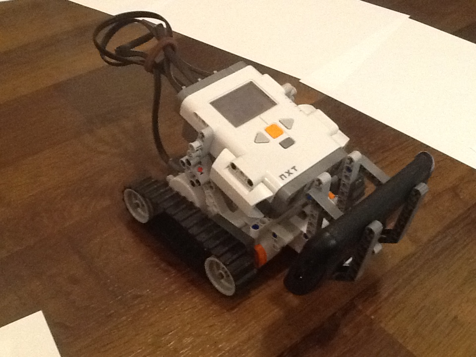
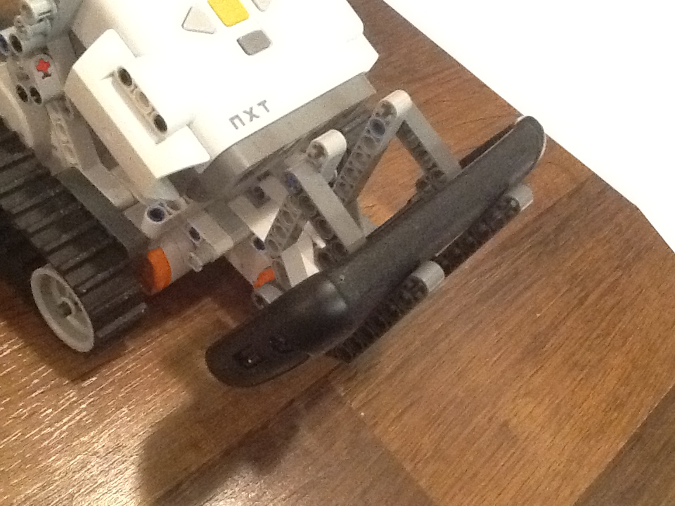
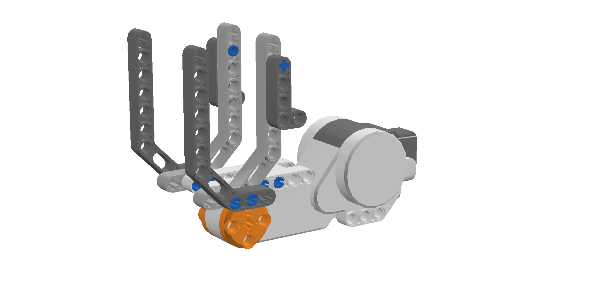
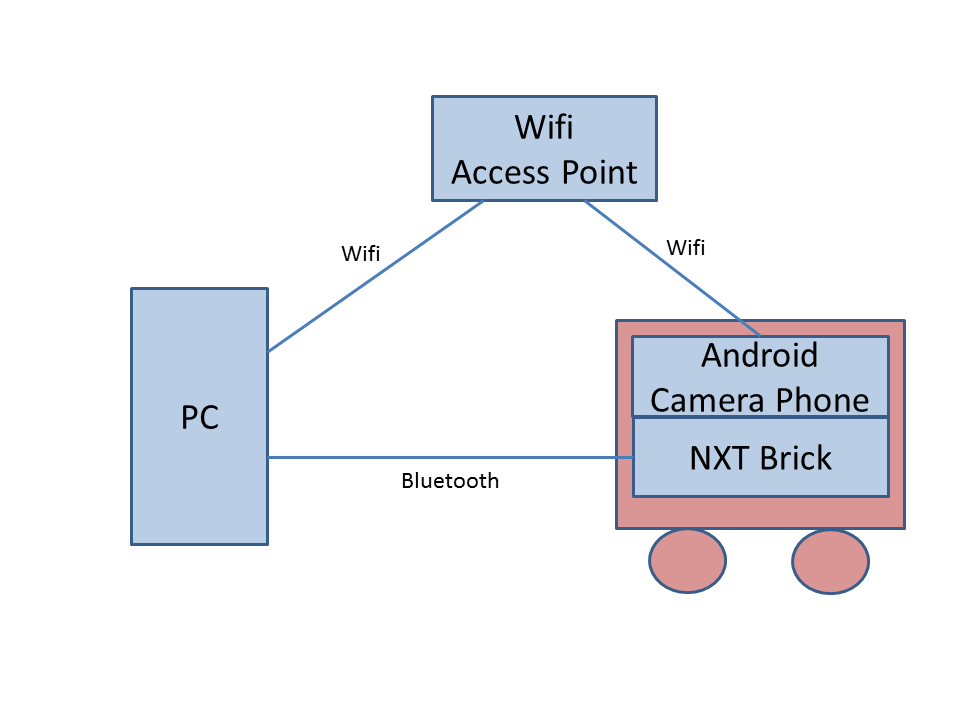
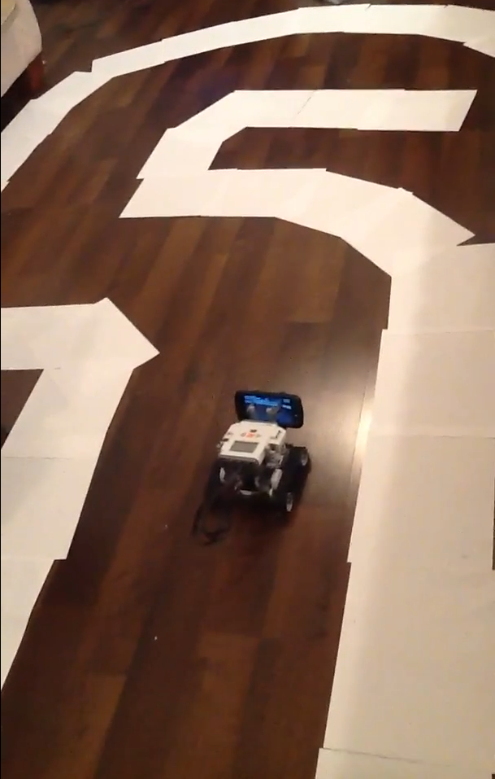

:author: Iqbal Mohomed
:email: iqbal@us.ibm.com
:institution: IBM Research

----------------------------------
Self-driving Lego Mindstorms Robot
----------------------------------

.. class:: abstract

   In this paper, I describe the workings of my personal hobby 
   project - a self-driving lego mindstorms robot. The body of the 
   robot is built with Lego Mindstorms. An Android smartphone is used 
   to capture the view in front of the robot. A user first teaches the 
   robot how to drive; this is done by making the robot go around a track 
   a small number of times. The image data, along with the user action is used 
   to train a Neural Network. At run-time, images of what is in front of the 
   robot are fed into the neural network and the appropriate driving action 
   is selected. This project showcases the power of python's libraries, as they 
   enabled me to put together a sophisticated working system in a very short amount 
   of time. Specifically, I made use of the Python Image Library to downsample 
   images, as well as the
   PyBrain neural network library. The robot was controlled using the nxt-python library.

.. class:: keywords

   self-driving, neural networks, robotics

Introduction
------------

Recently, there has been significant interest in building self-driving cars. Starting in 2004, a series of competitions were held as part of the DARPA Grand Challenge, wherein driverless vehicles outfitted with sophisticated sensing equipment navigated real-world terrain. While none of the entrants in the 2004 iteration of the competition made it to the finish line, in the 2005 iteration, five driverless vehicles successfully completed the course. More recently, there have been many exciting developments in this area, with the development of  Google's Driverless Car, and the US state of Nevada beginning the process to legalize and issue licenses for self-driving cars.

Building a self-driving car requires expensive sensing equipment. For example, the  stanford entry in the DARPA grand challenge had 5 different laser measurement system [Mon08]_. It is interesting to consider, if it is possible to create a self-driving car only using data from a camera. Around 1993, CMU created a learning system called "ALVINN" (Autonomous Land Vehicle In a Neural Network) [Pom93]_, which could control a testbed vehicle to drive on a variety of road surfaces. ALVINN worked by first "watching" a human driver's response to road conditions . After just 5 minutes of such training data in new situations, ALVINN could be trained to drive on a variety of road surfaces, and at speeds of unto 55 mies per hour. At first blush, it is starting that simply feeding image data and driver response to train a neural network would lead to a working autonomous vehicle. Earlier this year, David Singleton put up a blog post describing his weekend project – a self-driving RC car [Sin12]_. As the project dealt with a small RC vehicle in an indoor environment, the technique was simpler than that used in ALVINN. I was inspired by David's post and decided to independently replicate this project using a Lego Mindstorms robot instead of an RC car. While I started out with limited experience using Neural Networks, I succeeded in my endeavor to create a self-driving robot that can navigate a track in an indoor environment. Figure :ref:`robot1fig` shows the lego robot in action.

The purpose of this paper is to share details of how I utilized a set of Python libraries - nxt-python to control the Lego robot, Python Image Library (PIL) to process camera images, and the pyBrain library to train and use an artificial neural network - to build a self-driving Lego Mindstorms robot.

Robot Construction
------------------

I used the Lego Mindstorms NXT 2.0 set to construct the robot. The set consists of various construction elements, motors and sensors. A key element of the set is a microcomputer called the NXT Intelligent Brick. The NXT brick contains a 32-bit ARM7 microprocessor, flash memory, a battery holder, USB 2.0 port, supports Bluetooth communication and also has ports for connecting sensors and motors. While the Lego Mindstorms set contains a variety of sensors, I did not utilize any of them for this project. The motors in the Lego set are Interactive Servo Motors. Unlike regular hobbyist motors, these motors can be rotated a specific number of degrees (the Lego motors are precise to 1 degree).

The robot I constructed has two independent tracks (each controlled by a separate motor). The motors are powered and controlled by an NXT brick, which is mounted on top of the tracks. The most challenging part of the robot build was creating a secure holder for my smart phone. While the phone has two cameras (front and back), I made the glass of the phone face backwards. This resuled in an acceptable camera mounting. I took care to have the images coming from the camera show what is directly in front of the robot and minimize views that are far away. That said, I did not have to spend too much effort in optimizing the camera view. The mount I created also had a mechanism to quickly release the phone, which was useful in debugging, charging the phone, and other activities. Figure :ref:`robot2fig` shows a close up of the phone mount on the robot, and figure :ref:`robot6fig` shows a schematic of the mount.

Setup
-----

All my code (written in Python) runs on a Windows 7 PC. The PC communicates with the Lego NXT brick via Bluetooth. An Android camera phone (Google Nexus S) is attached to the Lego robot. The phone is connected to my home wireless network, as is my PC. Figure :ref:`robot5fig` shows a diagram of communication between the various components.

Driving the Lego Mindstorms robot
---------------------------------

I used the nxt-python library to interface my PC to the Lego Mindstorms robot.
While the NXT brick does possess flash memory to allow programs to reside on the robot itself, nxt-python works by executing on a PC and sending short commands to the NXT brick via Bluetooth or USB. As I want the robot to be untethered, I make use of Bluetooth.

I made use of an experimental class in nxt-python called "SynchrnonizedMotors" that makes the motors controlling the left and right track to move in unision. If care were not taken to move the two motors together, the robot could drift to one side when the intent is to move straight ahead. Ultimately, the key requirement for the robot's motion is consistency. In my implementation, the robot had three movement options: it could move straight ahead, turn left or turn right. Each action went on for a short period of time. The right motor (which ran the right-side track) is connected to PORT A of the NXT brick. Analagously, the left motor is connected to PORT B. In nxt-python, we can create a Motor object that represents the motor and provides a function like turn() to move the interactive servo motor to a specific position using a given amount of power.

.. code-block:: python

   import nxt
   
   def initBrick():
      # Define some globals to simplify code
      global b, r, l, m, mls, mrs
      # Search and connect to NXT brick (via BT)
      b = nxt.find_one_brick()
      # Create objects to control motors 
      r = nxt.Motor(b, nxt.PORT_A)
      l = nxt.Motor(b, nxt.PORT_B)
      # Create objects for synchronized motors
      # We specify the leader, follower and turn ratio
      m = nxt.SynchronizedMotors(r,l, 0)
      mls = nxt.SynchronizedMotors(l, r, 20)
      mrs = nxt.SynchronizedMotors(r, l, 20)

   # The first parameter to turn() indicates 
   # 100% or full power. To run the motor backwards,
   # a negative value can be provided. Amt indicates the
   # number of degrees to turn.
   def go(dev,amt):
      dev.turn(100,amt);

To facilitate the collection of training data, I implemented a “keyboard teleop” mode, wherein I type commands into a python CLI and get my robot to make the appropriate movement (i.e. go straight, go left or go right).

.. code-block:: python

   # cmd param is the character typed by the user
   def exec_cmd(cmd):
      if cmd == 'f':
         go(m,250)
      elif cmd == 'l':
         go(mls,250)
      elif cmd == 'r':
         go(mrs,250)
      elif cmd == 'x':
         b.sock.close()

   An image of the lego robot as it is driving along its course. :label:`robot1fig`

   A close up look at the holder mechanism for the Android phone. :label:`robot2fig`

   A schematic of the holder mechanism for the Android phone. Credit goes to Saira Karim for drawing the diagram using the free Lego Digital Designer software :label:`robot6fig`

   A diagram showing communication between various components. :label:`robot5fig`

   A view of the robot driving on the track. :label:`robot4fig`

Getting images from the camera phone
------------------------------------

I initially thought about writing my own app to capture images from my phone (an Android Nexus S). However, I found a free app called IP Webcam that allowed me to take snapshots from the phone via HTTP. Note that the IP address in the URL used to retrieve the image corresponds to the address assigned to the Android phone by the wireless AP. The lowest resolution at which I could get images was 176×144; I processed these images on the desktop before sending them to the neural network.

.. code-block:: python

   import urllib
   res=urllib.urlretrieve('http://192.168.1.12:8080/shot.jpg')

Processing the images on desktop
--------------------------------

I used the Python Imaging Library to first convert the images from the camera phone to greyscale and then lower their resolution to 100×100.

.. code-block:: python

   from PIL import Image
   im = Image.open(res[0])
   nim = im.convert('L')
   nim2 = nim.resize((100,100))

I combine the two code fragments above into a function called take_pic(), which captures an image from the 
Android phone, transforms it and returns the result.

Obtaining training data
------------------------

In order to teach the Lego robot how to drive, one must first obtain training data. Each sample of the training data consists of a low resolution greyscale image showing what is in front of the robot, and a human driver's action in that situation. 

.. code-block:: python

   # This function accepts a command from the 
   # user via the keyboard, and executes it on the robot
   def accept_execute_cmd():
      cmd = '';
      gotCmd = False;
      print "CMD: "
      while gotCmd == False:
         cmd = getch();
         #cmd = raw_input('CMD: ')
         if cmd == 'f' or cmd == 'l' or cmd == 'r':
            exec_cmd(cmd)
            gotCmd = True;
         elif cmd == 'x':
            b.sock.close()
            gotCmd = False;
            exit();
      print cmd + "\n";
      return cmd;


   def trainer():
      while True:
         # download pic from camera and downsample
         im=take_pic() 
         # get cmd from user and run it
         cmd = accept_execute_cmd() 
         # record the image and cmd
         record_data(im,cmd) 

Enter the Neural Network
------------------------

This was the key part of the project. To learn about Neural Networks, I went through Professor Andrew Ng’s lectures on Neural Networks, and played around with the assignments on the topic (recognizing hand-written digits using Neural Networks). Luckily, I found the pyBrain project, which provides a very easy interface for using Neural Nets in Python. Similar to David Singleton, I used a three level network. The first layer had 100×100 nodes. Each input node corresponds to a greyscale image captured from the camera phone. The hidden layer had 64 units (I tried other values, but like David, 64 hidden units worked well for me too). Unlike David, I only had three output units – forward, left and right.

.. code-block:: python

   from pybrain.tools.shortcuts import buildNetwork
   from pybrain.datasets import SupervisedDataSet
   from pybrain.supervised.trainers import BackpropTrainer
   net = buildNetwork(10000,64,3,bias=True)
   ds = SupervisedDataSet(10000,3)

Training the brain
--------------------

I built a "driving course" in my living room (shown in Figure :ref:`robot4fig`). I drove around the course only 10 times and trained network for about an hour.

.. code-block:: python

   def train(net,ds,p=500):
      trainer = BackpropTrainer(net,ds)
      trainer.trainUntilConvergence(maxEpochs=p)
      return trainer

Auto-drive mode
---------------

The code for auto-drive mode was pretty similar to training mode. I took an image from the camera phone, processed it (greyscale and lowered the res to 100×100) and activated it against the neural net I had trained. The output is one of three commands (forward, left or right), which I send to the same “drive(cmd)” function I used in training mode. I put a short sleep between each command to ensure the robot had enough time to complete its motion.

.. code-block:: python

   # The following function takes the Neural Network
   # and the processed image as input. It returns
   # the action selected by activating the neural
   # net. 
   def use_nnet(nnet,im):
      cmd = ''
      lst = list(im.getdata())
      res=nnet.activate(lst)
      val = res.argmax()
         if val == 0:
            cmd = 'f'
         elif val == 1:
            cmd = 'l'
         elif val == 2:
            cmd = 'r'
      return cmd

   # The auto() function takes a trained 
   # neural network as input, and drives
   # the robot. Each time through the loop,
   # it obtains an image from the phone (and 
   # downsamples it). The image data is used 
   # to activate the Neural Network, the 
   # output of which is executed on the robot.
   def auto(nnet):
      while True:
      im=take_pic()
      cmd=use_nnet(nnet,im)
      exec_cmd(cmd)
      print "executing .." + cmd
      time.sleep(3)

The Self-Driving Lego Mindstorms Robot comes to life!
-----------------------------------------------------

It worked! Mostly. About 2/3 of the time, the robot could go through the entire course without any "accidents". About 1/3 of the time, the robot’s motion takes it to a point where it can only see the track (sheets of white paper). When it gets to that state, it keeps going forward instead of making a turn. I have posted videos to YouTube as well as a blog post on my attempts [Moh12]_. Implementing a “spin-90-degrees” command might help the robot get out of that situation. But all-in-all, I’m pretty happy with the results.

Conclusions
------------

In this paper, I detail the workings of my self-driving Lego Mindstorms robot. The heart of the project
is a neural network, which is trained with camera images of the "road" ahead and user input. At run time, the same camera images are used to activate the neural network, and the resulting action is executed on the robot. While a simple vision-based system cannot be expected to perform flawlessly, acceptable performance was achieved. My experience suggests that Python programmers can utilize neural networks and camera images to quickly build other interesting applications.

Source Code
-----------

All the source code I wrote for this project is publicly available on GitHub (https://github.com/iqbalmohomed/selfdrivingrobot.git).

Acknowledgements
----------------

Big thanks go to my wife (Saira Karim) for helping me with the project. I’d 
like to reiterate that this project was inspired by 
David Singleton’s self-driving RC car and was an independent implementation of his
work. Many thanks go to him. A big thank you to Prof. Andrew Ng for the Stanford Machine 
Learning class that is freely provided online. And a thanks to the 
following projects that made mine 
possible: nxt-python, pybrain, python-imaging-library, and the free IP Webcam 
Android App.

Disclaimers
-----------

This work was done as part of a personal hobby project. The views and opinions
expressed are my own, and not related to my employer. LEGO, LEGO Mindstorms, ARM and Bluetooth
are trademarks owned by their respective owners. E&OE

References
----------
.. [Sin12] David Singleton. *How I built a neural network controlled self-driving (RC) car!*
            http://blog.davidsingleton.org/nnrccar

.. [Moh12] Iqbal Mohomed. *Self-driving Lego Mindstorms Robot*
            http://slowping.com/2012/self-driving-lego-mindstorms-robot/

.. [Tur98] Matthew A. Turk, David G. Morgenthaler, Keith D. Gremban, and Martin Marra. *VITS-A Vision System for Autonomous Land Vehicle Navigation*,
            IEEE Transactions on Pattern Analysis and Machine Intelligence, 10(3):342-361, May 1988.

.. [Pom93] Dean A. Pomerleau. *Knowledge-based Training of Artificial Neural Networks for Autonomous Robot Driving*,
           Robot Learning, 1993.
           
.. [Mon08] Michael Montemerlo, Jan Becker, Suhrid Bhat, Hendrik Dahlkamp, Dmitri Dolgov, Scott Ettinger, Dirk Haehnel, Tim Hilden, Gabe Hoffmann, Burkhard Huhnke, Doug Johnston, Stefan Klumpp, Dirk Langer, Anthony Levandowski, Jesse Levinson, Julien Marcil, David Orenstein, Johannes Paefgen, Isaac Penny, Anna Petrovskaya, Mike Pflueger, Ganymed Stanek, David Stavens, Antone Vogt, and Sebastian Thrun. *Junior: The Stanford entry in the Urban Challenge*,
            Journal of Field Robotics, 25(9):569-597, September 2008. 

