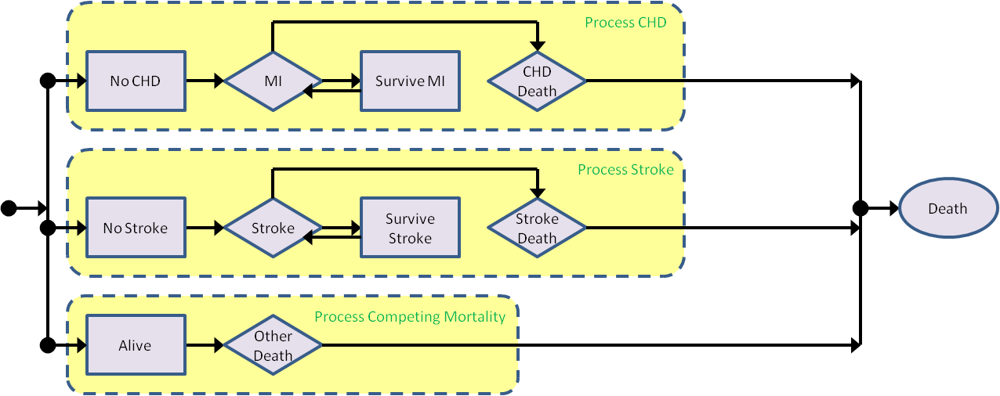
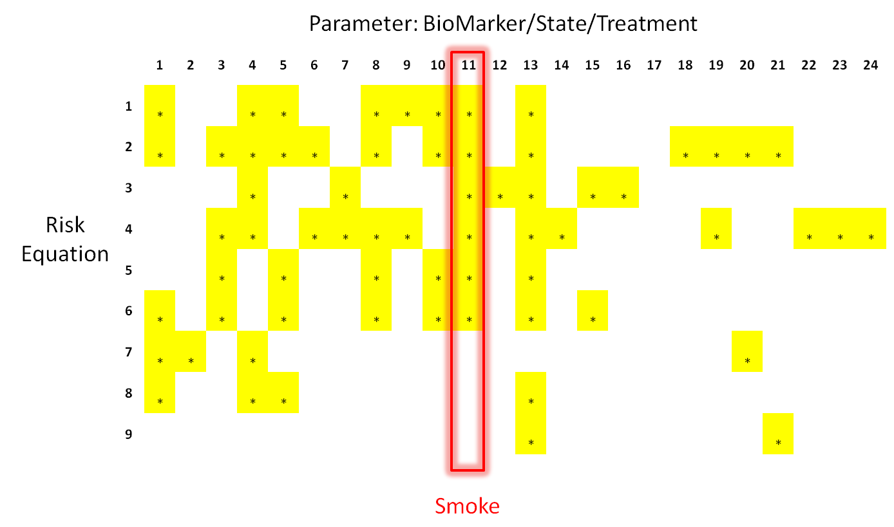

:author: Jacob Barhak
:email: jacob.barhak@gmail.com
:institution: freelancer

------------------------------------------------
 The Reference Model for Disease Progression
------------------------------------------------

.. class:: abstract

	The Reference Model for disease progression is based on a modeling framework written in Python. It is a prototype that demonstrates the use of computing power to aid in chronic disease forecast.  The model uses references to publicly available data as a source of information, hence the name for the model. The Reference Model also holds this name since it is designed to be used by other models as a reference. The model uses parallel processing and computing power to create a competition among hypothesis of disease progression. The system runs on a multi core machine and is scalable to a SLURM cluster.

.. class:: keywords

	Disease Models, High Performance Computing, Simulation

Introduction
------------

Disease modeling is a field where disease progression and its impact are studied. The field combines clinical knowledge, bio statistics, health economics, and computer science to create models. Such models are potential candidates for disease forecast tasks.

Within chronic disease models, most models target high risk diseases such as Coronary Heart Disease (CHD) and Stroke, especially with diabetes [McE10]_ , [Wil98]_,  [Ste01]_, [Kot02]_, [Cla04]_, [Ste04]_, [Hip08]_, [Zet11]_, [CDC02]_, [EBMI]_, [Mich]_, [Bar10]_, [Edd03]_, [Par09]_. Yet there are other models such as cancer models [Urb97]_, models to asses antidepressant cost-effectiveness [Ram12]_, infectious disease models [Gin09]_, and more complex models for policy makers [Che11]_. 

Although models differ from each other in structure and implementation, most models can be defined as a function that maps initial population to clinical outcomes after a certain number of years. Once clinical outcomes are established, it is possible to derive quality of life and costs [Cof02]_, [Bra03]_. Hence chronic disease models can predict economic impact or calculate cost effectiveness and therefore be valuable tools for decision makers.

Never the less, past behavior does not ensure future behavior, especially under different circumstances. Therefore the function the model represents is hard to calculate. Not only it depends on many factors such as biomarkers, health state, and treatment, it may also change with time and with unknowns. Moreover, models that work well on one population may work poorly on another population. Therefore it is recommended to validate a model against many populations [Her03]_. It is interesting to see how different models behave on the same population. The latter procedure is accomplished at the Mount Hood conference where diabetes models are compared [MH4]_. Mount Hood 6 held in 2012 and included 8 models from around the world. The Reference Model [Bar12]_ was a new model based on Python that joined the challenge and it is the main topic of this paper.

The Reference Model
-------------------
The prototype version of the model consists of three main processes: CHD, Stroke, and Competing Mortality. The model structure is shown in figure :ref:`Fig-ModelStruct`.

   The Reference Model structure. :label:`Fig-ModelStruct`

The Reference Model is composed from references to publicly available literature. This is one reason for the name. Another reason is since the model is designed to act as a reference for model developers to test new populations or equations.

Equations are typically extracted from clinical trials and represent phenomena encountered in the trial populations. One equation may perform differently on other populations where another equation may have better performance. Moreover, different equations rely on different parameters as shown in Figure :ref:`Fig-EqDiff`.

   Different risk equations found in the literature and parameters they use. When an equation uses a specific parameter, it is highlighted. Smoking status is highlighted to demonstrate the fact that the 6 first equations test for smoking. The Reference Model uses these risk equations. :label:`Fig-EqDiff`

The Reference Model is a platform where different equations can be tested on different populations to deduce fitness. Moreover, the system combines equations from different sources and tests the fitness of these equation combinations. Such a combination of equations can include hypothesis, so the user can test "what if" scenarios in case of uncertainty. 

An example of uncertainty is biomarker progression during the study. When a study is published it typically contains the initial population statistics in it, see table 1 in [Cla10]_, [ACC10]_, [Kno06]_. These statistics are sufficient to recreate a population without need to access private and restricted data. Yet this information does not always include information on biomarker progression, so the modeler can create several hypothesis to see which fits best with the equations and population information. 

This approach of using secondary published data expands the reach of the model. Instead of building a model on top of information extracted from a single population such as UKPDS [UKP98]_, the system uses models from multiple sources and compares them to multiple populations to find fitness between the sources of information. This enhances modeling capabilities significantly beyond a single data set and allows access to more populations overall. This is done while avoiding access to restricted individual data.

The Reference Model accomplishes these tasks by using computing power and a Python based disease modeling framework [Bar10]_, [Bar]_, [Mich]_. There are several main aspects of the software that are important enablers of this work:

1. Simulation language
2. Population generator
3. Simulation engine
4. Simulation launcher

These components rely on the power of the Python language and will be discussed in the following sections. 

Simulation language
-------------------

The Python language exposes itself to the degree that it can be reused. The modeling framework takes advantage of this to create a language that is a based on Python.

The modeling framework allows the user to define variables and assemble expressions with a simple syntax. The syntax consists of numerical operations and a limited set of system functions. Users can also define their own functions.

Once an expression is entered to the system it is parsed to check if it will compile well. Expression validness is established by: 1) Check if tokens used are valid operators, system variables, or reserved words and are not recursively cyclically used, 2) Check if syntax is correct by parsing and evaluation.

The system uses the ``parser`` library to figure out grammar in conjunction with the ``tokenize`` library to handle variable names. The ``re`` library is used to figure out regular expression patterns within the expression. The ``eval`` command is used by the system as a validation tool by using an evaluation dictionary that consists only of ``__builltins__, NaN, Inf`` to handle expressions that support non finite values.

Errors reported during these checks are considered compilation errors that the user receives as feedback. Since the Python interpreter provides good and meaningful error messages, the system wraps Python error messages and returns these to the user, while adding its own language specific error messages. 

After passing validity checks the expression is stored in the system database. This expression will be later reused once the system compiles files for runtime Python script.

For example, consider the following definition of a user defined function:

``CappedGaussian3`` is defined as:

.. code-block:: python

	Max(-3,Min(3,Gaussian(0,1)))

Once entered into the system the expression undergoes the following stages:

1. The tokens ``Max``, ``Min``, and ``Gaussian`` are recognized as system functions and therefore valid. 
2. The parser library successfully parses the expression, meaning there is no parenthesis mismatch or other syntax error. 
3. The expression is evaluated to make sure evaluation is possible. 
4. The expression is stored and whenever ``CappedGaussian3`` is used in the future, it will be replaced with that expression.

Here is an example of another expression that reuses the user defined function:

.. code-block:: python

	50+10*CappedGaussian3

This expression undergoes similar validity checks, yet ``CappedGaussian3`` is now recognized as a valid token representing a function. Also, it is verified that there is no recursive cyclic reuse of this token.

When this expression is compiled by the system into a Python script that will run, the expression will become Python code where the system will first calculate ``CappedGaussian3`` and then substitute the result in the expression that uses this token. The system will also recognize ``Min``, ``Max``, and ``Gaussian`` as system functions with Python implementation and will call those functions.

The runtime language is Python that implements the modeling language that is derived from Python. Keeping the languages close allowed shortening development time considerably. 

The compiled files are executed by the population generator and by the simulation engine that will be discussed in the following sections. 

Population Generator
--------------------

Constructing a population from published data is a key element. The Reference Model cross validates against as many populations as possible. Since populations typically hold restricted healthcare data, full information on many populations is not available. Yet summary statistics are available through the publication. The modeling framework is designed to allow reconstruction of a population from these statistics. 

Typically a clinical trial will describe the initial population by a table showing distributions. Table :ref:`Tab-PopDist` will be used as a simplified example:

.. table:: Simple example of population distributions. :label:`Tab-PopDist`

	+-------------------+-----------------------------------------------------+
	| **Biomarker**     | **Distribution**                                    |
	+-------------------+-----------------------------------------------------+
	| Age               | Mean 65, SD 7                                       |
	+-------------------+-----------------------------------------------------+
	| Male              | 48%                                                 |
	+-------------------+-----------------------------------------------------+
	| Smoke             | 30% for Age<50, 15% for Age>=50                     |
	+-------------------+-----------------------------------------------------+

To implement this simplified example, the system will use the internal language previously discussed. Table :ref:`Tab-PopImplement` describes the implementation. 

.. table:: Implementation of the distributions in table :ref:`Tab-PopDist`. :label:`Tab-PopImplement`

	+-------------------+-----------------------------------------------------+
	| **Biomarker**     | **Implementation**                                  |
	+-------------------+-----------------------------------------------------+
	| Age               | ``65+7*CappedGaussian3``                            |
	+-------------------+-----------------------------------------------------+
	| Male              | ``Bernoulli(0.48)``                                 |
	+-------------------+-----------------------------------------------------+
	| Smoke             | ``Bernoulli(0.15+0.15*Ls(Age,50))``                 |
	+-------------------+-----------------------------------------------------+

Age is assumed to be distributed with normal distribution. The user defined function we introduced previously is used to avoid extreme outliers. Gender and Smoke use the Bernoulli distribution. However, Smoke has a dependency on the Age parameter. The system supports such dependencies in population creation by allowing the user to reference other parameters in the population and include these in expressions. The system raises an error in case of recursive cyclic references. This is important if the population is defined out of order, e.g. the Smoke formula uses Age before the Age distribution is defined. Actually, the system resolves the order by which calculations are performed when a population generation script is compiled. 

The compiled Python script has the expressions in correct order and repeats the generation for each individual in the population. The output of running this script is a list of individuals, each with characteristics drawn from the given distributions. This mock population represents the starting conditions for the simulation engine to apply the model to. 

Simulation Engine
------------------------

The simulation engine has been described previously in [Bar10]_ and in the system documentation  [Bar]_, [Mich]_.  Therefore this paper will only briefly relate to python related issues and many aspects are simplified. 

The simulation engine applies a function to a vector for each simulation step for each individual. The function is complex and composed of rules, and state transitions happening in parallel in random order. The vector the function is applied to consists of biomarkers, states indicators, treatment parameters, costs and quality of life parameters. After each simulation step some values in the vector change and this updated vector will become the input for the same function in the next simulation step and so on. This continues until the individual dies or a predefined number of simulation steps is reached.

The modeling framework uses two mechanisms to compile the simulation files. 1) rule expansion to code, 2) state processing queue.

Rules are simple conditional assignments of the type

.. code-block:: python

	if Conditional and InState:
		AffectedParameter = Expression

Both the ``Conditional`` and the ``Expression`` are general expressions using the simulation language. Each of these expressions may contain user defined functions. The system compiles the code so that value bound checks can be incorporated into every calculated expression to maintain a strict simulation. Even though calculations are expanded, the compiled code is still readable and can be debugged since the compiled code uses the user defined names instead of ``AffectedParameter`` as variable names.

State transitions are handled by a queue that processes events of transition between states. The queue is loaded in random order and changes within simulation. Random order of events is important to allow scenarios where event 1 can happen before event 2, or event 2 happens before event 1 at the same simulation step. The Python implementation of the queue is such that the queue consists of functions that define transitions to check. These functions are automatically generated as Python code from the model structure as defined by the user. The Python script pops the next transition from the queue and calls it's state transition function. Each state transition function can change the queue or state indicator values. If this results in more events, those are added to the queue. For specific details, please consult the developer guide that arrives with the software [Bar]_, [Mich]_. 

Note that, state indicator names and variable names are readable to simplify debugging and controlled simulation reconstruction. 

Actually the implementation initializes the vector upon which the function is applied as a Python sequence of variables with names such as:

.. code-block:: python

	[Age, Gender, Smoke, ...]  = 
	  _PopulationSetInfo.Data[IndividualID-1]

	
Where ``IndividualID`` is the loop counter and ``_Population`` holds the population data created by the population generator after merging it with the model.

Actually, the population sequence is pickled and embedded within the code as well as all other data structures that created the simulation file. This is done to allow reconstructing the simulation conditions from the simulation file. This is also important for clerical back tracing purposes and for debugging.

Another such back tracing feature is saving the random state to file at the beginning of simulation. This is on top of allowing the user to select a random seed. This method facilitates recreation of a simulation even in the case of a random seed set by the system timer rather than set by the user.

The simulation engine supports simulation control through overrides. These overrides are essential to support multiple scenarios to run in parallel through the simulation launcher.

Simulation Launcher
-------------------

Simulations can be launched through the WxPython [WxP]_ based GUI. This is appropriate for testing and model development purposes. Yet this is not sufficient for running many scenarios or many repetitions to reduce the Monte Carlo error. Moreover, running the same simulation with variations on populations or equations cannot be accomplished in an automated way through the GUI. Therefore the modeling framework offers an external launcher for simulations that arrives with it as a Python script. 

The script ``SlurmRun.py`` allows running multiple simulations in a programmatic manner. The script controls the launch of the simulations and also responsible for collecting the results and creating csv reports and plots through ``matplotlib``. 

The ``SlurmRun.py`` script arrives as an example that runs a self test scenario on a SLURM cluster [SLU]_. It is setup to send summary results by email to the developer once the simulation ends. 

The script holds placeholders for modifications so that it can be adapted to new simulations. The basic idea behind the launch script is that the user provides the file name that holds the simulation data definitions pickled an zipped. This file includes the default simulation instructions. The system then sends this file for actual simulation using ``sbatch`` SLURM commands. These defaults are then overridden according to user instructions. 

User instructions include definitions of variations around the default simulation. Each such variation is described by a tuple consisting of an override value and a unique variation name string. The override value can be considered as an override for a parameter the simulation function relies on. These overrides are passed to the simulation engine in the command line as a vector. Each component in this vector represents a different override and taken from the value part of the tuple. Exchanging the override value with the unique variation name string creates a unique key sentence that can later be used to describe each simulation variation. 

The number of simulation variations is combinatorial depending on amount of options for each override in the vector. Many combinations of variations may not be meaningful or desirable. So the system contains 3 variables to restrict the number of simulation variations: 1) ``Inclusions``, 2) ``Exclusions``, 3) ``MaxDimensionsAllowedForVariations``.

``Inclusions`` is a sequence of tuples. Each tuple is composed of a set of variation sub strings. If ``Inclusions`` in not empty the system will include only variations that their variation key sentence includes all the strings in any tuple.

``Exclusions`` is also a sequence of tuples of strings. Yet the system excludes any variation that includes all sub strings in a tuple. 

``MaxDimensionsAllowedForVariations`` is the maximal Hamming distance from default allowed for simulation variations. In other words, it is an integer that holds the maximal number of override vector components allowed to change from the default.

These override mechanisms allow controlling the large number of combinations generated. The following example demonstrates the large number of variations.

The Reference Model calibration for the Mount Hood 6 Challenge used 16 populations and 48 equation/hypothesis variations. Each such simulation was repeated 20 times to reduce Monte Carlo error. This resulted in 15360 simulations that the system launched. The launcher was modified to run these simulations on a single 8 core desktop machine with Ubuntu using ``batch`` command rather than using the SLURM ``sbatch`` command. These computations took 4.5 days on this machine. 

In the future more computing power will be needed to process information since more populations and equation variations will exist.

Conclusions
-----------

Previous work was focused on merging information that is available in the literature using statistical methods [Isa06]_, [Isa10]_, [Ye12]_. The Reference Model continues in the same spirit while relying on the availability of computing power.

The Reference Model for disease progression relies on a Python based framework that provides the computational support needed for comparing a myriad of scenarios. 

The state of the art in the field of chronic disease models is such that different groups offer different models. Each such model is built from equations that depend on different parameters. Therefore equation performance differs on different populations. 

So far only a few groups have addressed the issues of comparing equation performance over populations [Sim09]_, [Par09]_. Validation of the same model with multiple populations is more common [Edd03]_. Comparisons of multiple Models against multiple populations traditionally happens at the Mount Hood conference [MH4]_. Yet this comparison involves manual labor from multiple groups and much of the modeling remains closed. The Reference Model on the other hand performs this comparison automatically under controlled conditions. The Reference Model depends on availability of published information. It relies on existing equations and human guidance. Even with the automation it offers, modelers will still need to work on extracting new equations. Yet it's availability provides advantages such as: 1) a testing facility for new equations/hypothesis. 2) similarity identifier in data sets through fitness. 3) common framework for modeling information that can be reused in other ways.

From an implementation point of view, relying on parallelization and on the regular increase in computing speed [Moo65]_ may be enhanced by using compiled languages. Such needs have been identified in the disease modeling field [McE10]_ and by the Python community [Sel09]_, [Fri09]_. So future implementations may include a python front end, while simulations will run in a compiled language to improve speed. Never the less, the use of the Python languange was a good selection for this project since it allowed rapid progress and many suitable tools.

Software Availability
---------------------

The latest version of the GPL modeling framework is available for download from the author's personal website at: [Bar]_. Previous versions are available at [Mich]_.

The Reference Model is not released at the time this paper is written.

Acknowledgment
--------------

The author wished to thank Deanna J.M. Isaman for her tutoring, inspiration, and introduction to this field. Special thanks to Chris Scheller the very capable cluster administrator.

The GPL modeling framework described above was supported by the Biostatistics and Economic Modeling Core of the MDRTC (P60DK020572) and by the Methods and Measurement Core of the MCDTR (P30DK092926), both funded by the National Institute of Diabetes and Digestive and Kidney Diseases. The modeling framework was initially defined as GPL and was funded by Chronic Disease Modeling for Clinical Research Innovations grant (R21DK075077) from the same institute. 

The Reference Model was developed independently without financial support. 

References
----------

.. [Bar12] J. Barhak. *The Reference Model for Disease Progression You Tube*: 
           Online: http://www.youtube.com/watch?v=7qxPSgINaD8&feature=youtube_gdata_player

.. [McE10] P. McEwan, K. Bergenheim, Y. Yuan, A. Tetlow, J. P. Gordon *Assessing the Relationship between Computational Speed and Precision: A Case Study Comparing an Interpreted versus Compiled Programming Language using a Stochastic Simulation Model in Diabetes Care*, 
           Pharmacoeconomics:   28(8):665-674, August 2010,  doi: 10.2165/11535350-000000000-00000

.. [Wil98] P.W.F. Wilson, R.B. D’Agostino, D. Levy, A.M. Belanger, H. Silbershatz, W.B. Kannel, *Prediction of Coronary Heart Disease Using Risk Factor Categories*,
           Circulation 97:1837-1847, 1998.

.. [Ste01] R. Stevens, V. Kothari, A. Adler, I. Stratton, *The UKPDS risk engine: a model for the risk of coronary heart disease in type II diabetes UKPDS 56*, 
           Clinical Science 101:671-679, 2001.

.. [Kot02] V. Kothari, R.J. Stevens, A.I. Adler, I.M. Stratton, S.E. Manley, H.A. Neil, R.R. Holman, *Risk of stroke in type 2 diabetes estimated by the UK Prospective Diabetes Study risk engine (UKPDS 60)*,
           Stroke 33:1776-1781, 2002, doi: 10.1161/01.STR.0000020091.07144.C7

.. [Cla04] P.M. Clarke, A.M. Gray, A. Briggs, A.J. Farmer, P. Fenn, R.J. Stevens, D.R. Matthews, I.M. Stratton, R.R. Holman, *A model to estimate the lifetime health outcomes of patients with type 2 diabetes, UK Prospective Diabetes Study (UKPDS): the United Kingdom Prospective Diabetes Study (UKPDS) Outcomes Model (UKPDS no. 68)*, 
           Diabetologia 47(10):1747-1759, 2004.

.. [Ste04] R.J. Stevens, R.L. Coleman, A.I. Adler, I.M. Stratton, D.R. Matthews, R.R. Holman, *Risk Factors for Myocardial Infarction Case Fatality and Stroke Case Fatality in Type 2 Diabetes: UKPDS 66*, 
           Diabetes Care, 27:201-207, January 2004, doi:10.2337/diacare.27.1.201

.. [Hip08] J. Hippisley-Cox, C. Coupland, Y. Vinogradova, J. Robson, R. Minhas, A. Sheikh, P. Brindle, *Predicting cardiovascular risk in England and Wales: prospective derivation and validation of QRISK2*, 
           BMJ 336:1475-1482, June 2008, doi: 10.1136/bmj.39609.449676.25x

.. [Zet11] B. Zethelius, B. Eliasson, K. Eeg-Olofsson, A.M. Svensson, S. Gudbjornsdottir, J. Cederholm, *A new model for 5-year risk of cardiovascular disease in type 2 diabetes, from the Swedish National Diabetes Register (NDR)*, 
           Diabetes Res Clin Pract. 93(2):276-84. August 2011, doi:10.1016/j.diabres.2011.05.037

.. [CDC02] CDC Diabetes Cost-effectiveness Group. *Cost-effectiveness of intensive glycemic control, intensified hypertension control, and serum cholesterol level reduction for type 2 diabetes*, 
           JAMA 287(19): 2542-2551, 2002, doi: 10.1001/jama.287.19.2542

.. [EBMI] *EBMI. Evidence-Based Medicine Integrator*  
          Online: http://code.google.com/p/ebmi/ (Accessed: 8 July 2012).

.. [Mich] Michigan Diabetes Research and Training Center. *Disease Modeling Software for Clinical Research*, 
          Online: http://www.med.umich.edu/mdrtc/cores/DiseaseModel/ (Accessed: 8 July 2012).

.. [Bar10] J. Barhak, D.J.M. Isaman, W. Ye, D. Lee, *Chronic disease modeling and simulation software*, 
           Journal of Biomedical Informatics, 43(5): 791-799, 2010, doi:10.1016/j.jbi.2010.06.003 

.. [Edd03] D.M. Eddy, L. Schlessinger, *Validation of the Archimedes Diabetes Model*. 
           Diabetes Care 26(11):3102-3110, 2003, doi: 10.2337/diacare.26.11.3102

.. [Par09] S. Paredes, T. Rocha, P. Carvalho, J. Henriques, M. Harris, M. Antunes, *Long Term Cardiovascular Risk Models' Combination - A new approach*, 
           2009. Online: https://www.cisuc.uc.pt/publication/show/2175 (Accessed: 9 July 2012).

.. [Urb97] N. Urban, C. Drescher, R. Etzioni, C. Colby. *Use of a stochastic simulation model to identify an efficient protocol for ovarian cancer screening*,
           Control Clin Trials.18(3):251-70, June 1997, doi:10.1016/S0197-2456(96)00233-4

.. [Ram12] J. Ramsberg, C. Asseburg, M. Henriksson, *Effectiveness and cost-effectiveness of antidepressants in primary care - a multiple treatment comparison meta-analysis and cost-effectiveness model*, 
           PLoS One 2012 (Accepted).
		   
.. [Gin09] J. Ginsberg, M.H. Mohebbi1, R.S. Patel1, L.Brammer, M.S. Smolinski, L. Brilliant, *Detecting influenza epidemics using search engine query data*,
           Nature (457)19, February 2009, doi:10.1038/nature07634

.. [Che11] C.H. Chen-Ritzo, *Simulation for Understanding Incentives in Healthcare Delivery*, 
           IBM, T.J. Watson Research Center, 7 December 2011. Online: http://www-304.ibm.com/industries/publicsector/fileserve?contentid=228827 (Accessed: 13 July 2012)
		   
.. [Cof02] J.T. Coffey, M. Brandle, H. Zhou, D. Marriott, R. Burke, B.P. Tabaei, M.M. Engelgau, R.M. Kaplan, W.H. Herman, *Valuing health-related quality of life in diabetes*,
           Diabetes Care 25:2238-2243, 2002, doi: 10.2337/diacare.25.12.2238

.. [Bra03] M. Brandle, H. Zhou, B.R.K. Smith, D. Marriott, R. Burke, B.P. Tabaei, M.B. Brown, W.H. Herman, *The direct medical cost of type 2 diabetes*,
           Diabetes Care 26:2300-2304, 2003, doi: 10.2337/diacare.26.8.2300

.. [Her03] W.H. Herman. *Diabetes modeling*,
           Diabetes Care 26:3182–3183, November 2003. doi: 10.2337/diacare.26.11.3182

.. [MH4] The Mount Hood 4 Modeling Group, *Computer Modeling of Diabetes and Its Complications, A report on the Fourth Mount Hood Challenge Meeting*,
         Diabetes Care 30:1638-1646, 2007, doi: 10.2337/dc07-9919

.. [Cla10] P.M. Clarke, P.G. A. Patel, J. Chalmers, M. Woodward, S.B. Harrap, J.A. Salomon, on behalf of the ADVANCE Collaborative Group. *Event Rates, Hospital Utilization, and Costs Associated with Major Complications of Diabetes: A Multicountry Comparative Analysis*,
           PLoS Med 7(2):e1000236, 2010, doi:10.1371/journal.pmed.1000236

.. [ACC10] The ACCORD Study Group, *Effects of Intensive Blood-Pressure Control in Type 2 Diabetes Mellitus*,
           N Engl J Med 362:1575-85, March 2010, doi:10.1056/NEJMoa1001286

.. [Kno06] R.H. Knopp, M. d’Emden, J.G. Smilde, S.J. Pocock, *Efficacy and Safety of Atorvastatin in the Prevention of Cardiovascular End Points in Subjects With Type 2 Diabetes: The Atorvastatin Study for Prevention of Coronary Heart Disease Endpoints in Non-Insulin-Dependent Diabetes Mellitus (ASPEN)*, 
           Diabetes Care 29:1478-1485, July 2006, doi:10.2337/dc05-2415
		   
.. [UKP98] UKPDS: *UK Prospective Diabetes Study UKPDS Group, Intensive blood-glucose control with sulphonylureas or insulin compared with conventional treatment and risk of complications in patients with type 2 diabetes UKPDS 33*,
           Lancet 352:837–853, 1998, doi:10.1016/S0140-6736(98)07019-6		   

.. [Bar] *Jacob Barhak*, Online: http://sites.google.com/site/jacobbarhak/ (Accessed: 14 July 2012)

.. [WxP] *WxPython*, Online: http://wxpython.org/ (Accessed: 14 July 2012)

.. [SLU] *SLURM: A Highly Scalable Resource Manager*,
         Online: https://computing.llnl.gov/linux/slurm/slurm.html (Accessed: 9 July 2012).

.. [Isa06] D.J.M. Isaman, W.H. Herman, M.B. Brown, *A discrete-state and discrete-time model using indirect estimates*,
           Statistics in Medicine 25:1035-1049, 2006, doi:10.1002/sim.2241.

.. [Isa10] D.J.M. Isaman, J. Barhak, W. Ye, *Indirect estimation of a discrete-state discrete-time model using secondary data analysis of regression data*,
           Statistics in Medicine 28(16):2095-2115, 2009, doi:10.1002/sim.3599. Erratum available: Statistics in Medicine 29(10):1158, 2010, doi: 10.1002/sim.3855

.. [Ye12]  W. Ye, J. Barhak, D.J.M. Isaman, *Use of Secondary Data to Estimate Instantaneous Model Parameters of Diabetic Heart Disease: Lemonade Method*, 
           Information Fusion 13(2):137–145, 2012, doi:10.1016/j.inffus.2010.08.003	 
		 
.. [Sim09] R.K. Simmons, R.L. Coleman, H.C. Price, R.R. Holman, K. Khaw, N.J. Wareham, S.J. Griffin, *Performance of the UKPDS Risk Engine and the Framingham risk equations in estimating cardiovascular disease in the EPIC-Norfolk cohort*,
           Diabetes Care 32:708-713 December 2009, doi: 10.2337/dc08-1918

.. [Moo65] G. E. Moore, *Cramming more components onto integrated circuits*, 
           Electronics, 38(8), 19 April 1965
		   
.. [Sel09] D. Seljebotn, *Fast numerical computations with Cython*,
           Proceedings of the 8th Python in Science conference (SciPy 2009), G Varoquaux, S van der Walt, J Millman (Eds.), pp. 15-22. Online: http://conference.scipy.org/proceedings/scipy2009/paper_2/ (Accessed: 12 July 2012)

.. [Fri09] A. Friedley, C. Mueller, A. Lumsdaine, *High-Performance Code Generation Using CorePy*,
		   Proceedings of the 8th Python in Science conference (SciPy 2009), G Varoquaux, S van der Walt, J Millman (Eds.), pp. 23-28. Online: http://conference.scipy.org/proceedings/scipy2009/paper_3/ (Accessed: 12 July 2012)

