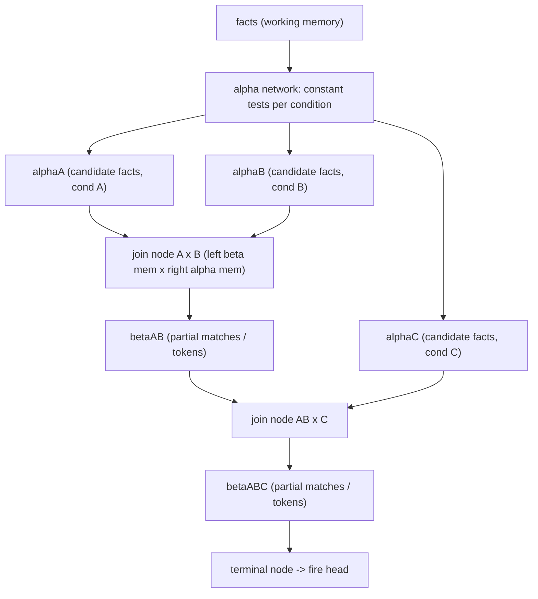
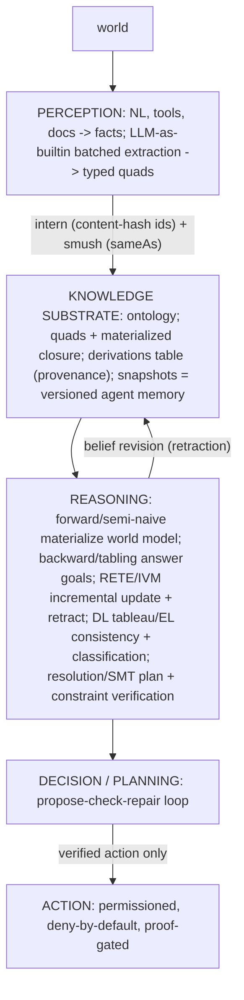

# THE SILMARIL STRIKES AGAIN

## Ontologies: from CWM to modern reasoning engines \- building better AI systems with deterministic reasoning capabilities

**SHAURYA AGARWAL**

---

# Abstract

Large language models now power many agentic systems.    
Common interaction patterns include:    
    
* plan first, then execute [@wang2023plansolve]    
* reason and act in turns, as in ReAct [@yao2023react]    
* reflect on feedback and try again, as in Reflexion [@shinn2023reflexion]    
* call external tools and APIs [@schick2023toolformer]    
* ...and more
    
These patterns make language models more useful as agents. But the agent is still largely driven by model-generated state, reasoning, and decisions.    
    
That creates four pressures:    
    
* **Grounding:** the system needs stable identities for entities and typed relations between them.    
* **Multi-hop reasoning:** the system may need conclusions that follow through several relations or rules.    
* **Coordination:** several agents or tools need a shared meaning for entities, classes, properties, and constraints.    
* **Verification and audit:** important decisions need a result that can be checked, replayed, and linked to the facts and rules that produced it.    
    
These are areas where language-model generation alone does not provide formal guarantees. Entity tracking varies across models and task complexity [@kim2023entitytracking]. Multi-hop reasoning can fail or follow plausible but incorrect paths [@yang2024latentmultihop; @bhuiya2024multihop]. Generated chain-of-thought is not necessarily a faithful account of how an answer was produced [@lanham2023faithfulness]. Model responses can also move toward a user's stated views in tested settings [@sharma2023sycophancy].    
    
Ontologies and reasoning engines provide a different layer. Ontologies represent selected entities, classes, properties, and axioms under explicit semantics [@w3c2012owl2overview]. Reasoners can then derive conclusions, answer queries, check consistency, test constraints, and record justifications under defined procedures.    
    
This paper starts with the Closed World Machine (CWM) as a historical Python reasoner. It then explains forward and backward reasoning, RETE, truth maintenance, description-logic reasoning, stratified negation, resolution, Satisfiability Modulo Theories, and the chase.    
    
The paper then shows how these methods can be composed inside a **propose-check-repair** loop for agentic systems:    
    
* the language model **proposes**    
* one or more reasoners **check**    
* failed checks return structured evidence    
* the model **repairs** the proposal    
* accepted results can move to a separate action policy    
    
The language model remains the flexible generative component. The ontology and reasoning layer provides formal checks that language generation alone does not guarantee.    
    
The paper finally discusses columnar, distributed, and GPU execution as possible ways to scale selected reasoning workloads. It does not present a completed production reasoner or new performance results.  

---

# Introduction

An LLM agent left to itself has three structural deficits. No stable identity: across a long trajectory its notion of an entity drifts, so "the counterparty" in step 2 and step 40 are different fuzzy regions. No guaranteed multi-hop inference: relation chains (ownership, reachability, eligibility through several conditions) are paths, and token prediction approximates them and silently errs at depth. No audit: a chain-of-thought is a plausible narrative, not a checkable object that can be replayed, diffed, or proved.

A reasoning engine closes exactly these gaps: stable identifiers and identity collapse for identity, forward or backward chaining for multi-hop entailment, provenance for proofs. The governing thesis, stated once and made concrete throughout: the LLM proposes, a reasoning engine disposes. The model is fast, general, generative, unverifiable; the engine is exact, bounded, replayable. An agent is the loop that wraps both and keeps the right work on the right side.

| Role | Stochastic edge (LLM) | Deterministic core (engine) |
| :---- | :---- | :---- |
| Function | language understanding and generation | identity, entailment, consistency |
| Activity | extraction, proposal, ranking | materialization, query answering, proof |
| Character | fuzzy, general, fast | exact, bounded, replayable |
| Guarantees | none | sound; complete for open-world engines |

Four pressures push systems toward this layer. Grounding: an ontology pins each entity to a distinct identifier with typed relations, so retrieval and tool calls resolve to entities, not strings. Multi-hop reasoning: a reasoner materializes the n-hop consequences once, after which reads are cheap and exact, where a single similarity pass surfaces only neighbors. Coordination: a shared ontology is the contract (agreed types, predicates, constraints) without which agents talk past each other. Verifiable retrieval and audit: a rule engine emits a proof, the derivation tree of which facts and rules produced a conclusion; for any regulated decision that is the whole point.

## The argument in a nutshell
1. Agent systems already use planning, reflection, self-critique, and external tools.
2. Those patterns do not necessarily move the acceptance decision out of the generative model.
3. The paper proposes a reasoner-mediated propose-check-repair loop.
4. The LLM proposes a fact, answer, plan, argument, or action.
5. The application grounds that proposal in an ontology-backed formal state.
6. A reasoning engine is called as a tool.
7. The reasoner returns a formal result and whatever evidence that method supports.
8. A failed check goes back to the LLM for repair.
9. A passed check can go to a separate action policy.
10. The model can remain stochastic, while selected acceptance checks can be deterministic and replayable when their formal inputs, rules, solver version, and configuration are fixed.
---

# Ontology as load-bearing infrastructure

To an engineer an ontology is a formal commitment about three things: what entities exist and how they are identified; what relations and attributes connect them; and what must be true or may be inferred. The first two give a knowledge graph; the third separates an ontology from a data model. A schema says what rows are legal; an ontology says what rows are implied. That entailment step is the point. Every serious system, cwm included, is built in layers.

| Layer | What it provides |
| :---- | :---- |
| Identity | globally unique identifiers; one resolvable name, not a join key |
| Assertion | triples, or context-subject-predicate-object quads tracking which graph asserts a fact |
| Vocabulary | classes, properties, datatypes, hierarchies; the shared terms |
| Axiom / rule | the entailment regime: subclass transitivity, property chains, cardinality, if-then rules |
| Context / provenance | named graphs, time, source, justification; not optional in a regulated setting |

Two regimes decide an architecture. Open versus closed world: under the open-world assumption absence means unknown; under the closed-world assumption absence means false (negation as failure). Forward versus backward chaining: forward (data-driven) materializes all consequences to a fixpoint and pays cost up front for cheap, complete reads; backward (goal-driven) works from a query to supporting facts and pays per query. The choice is when you pay; production systems go hybrid, materializing stable closures and answering the rest at query time.

Expressivity trades against tractability, and this single constraint shapes every real system. Full description logic is decidable but worst-case intractable. Restricted profiles recover polynomial-time reasoning and are implementable as forward-chaining rules, which is why rule engines dominate. Rule languages deliver the inference people actually want (transitivity, chaining, classification, constraint-driven derivation) with predictable performance. The pragmatic consensus for agentic systems is a graph store, a forward-chaining rule engine, first-class provenance, and a builtin mechanism that reaches out to computation and external data. That is not aspirational; it describes cwm, written in 2000\.

---

# The ur-example: how cwm works

cwm is the first widely used, general-purpose, web-scale, rule-driven forward-chaining reasoner combining one representation for facts and rules, first-class quoted graphs (a graph can be the subject or object of a statement), a pluggable builtin system, native proofs, and follow-your-nose closure. The folklore that it re-scans all rules every pass is wrong: it is an incremental, RETE-style, index-driven forward chainer with cardinality-ordered joins, interleaved builtin evaluation, recursive sub-formula reasoning with conclusion caching, and native provenance. Much of what the current generation rediscovers (graph-structured retrieval, agent memory, tool-augmented reasoning, verifiable inference) has an ancestor here.

Mental model. Load N3 documents into one mutable working formula holding facts and rules in the same syntax, where a rule is `{antecedent} log:implies {consequent}`. Run `think`: find rules, match each antecedent, instantiate the consequent for every match, repeat to a fixpoint, serialize out. It is recalculation for a graph; because derived facts trigger more rules, it cascades to a fixed point.

Data model. Everything is a `Term`: identifiers (`Symbol`, `Fragment`), typed literals whose `value()` projects to a native value (the boundary between logic and computation), variables, and `Formula`, a set of statements treated as one object and itself a `Term`, which is the move that lets a graph be quoted as a term. Interning gives one canonical object per term, so equality is pointer identity and indexing is O(1); unification with an occurs-check matches patterns against data.

Store. A statement is a quad (context, predicate, subject, object); the context is the asserting graph, which makes provenance and quoted-graph reasoning possible. The store keeps an eight-way index over every bound/unbound combination of (predicate, subject, object), so any pattern lookup is an O(1) hit and a bucket's cardinality is the planner's cost estimate. The cost is on writes: every insertion maintains all eight indexes, roughly eightfold write amplification, which the source notes dominates a typical run. Insertion also smushes (eagerly merges terms known to denote the same thing): list-chain collapse, and union-find over `owl:sameAs` with in-place rewrite. Smushing is the entity-resolution step folded into the store.

Reasoner. Each rule subscribes as a consumer of the index bucket holding triples it could match; that subscription is the RETE alpha network. A new statement in a bucket schedules only the subscribed rules, and only against the new triple; conclusions re-enter buckets and schedule more firings, cascading to a fixpoint. The loop is "each new fact wakes only the rules that care," not "for each pass scan all facts," which is the difference between O(rules x facts) per pass and incremental delta propagation. Solving one body is a cost-directed backtracking join: pop the highest-priority conjunct, ties broken by smallest cardinality (do the most selective conjunct first). Priority states order light builtins (cheap, deterministic) before store search, ordinary patterns in cardinality order, heavy builtins (fetch, parse, nested proof) after search so a known fact short-circuits the cost, and remote conjuncts batched per service.

Conclusions, builtins, provenance, closure. A conclusion instantiates the consequent with fresh variable names (safe skolemization), attaches a reason, and suppresses duplicates. Builtins are predicates in code: light versus heavy decides when to run; Function and ReverseFunction declare directionality (a mode that tells the planner which way to evaluate); MultipleFunction returns many results. The reflective builtins (dereference and parse a URI into a formula, run a nested `think` with caching, test graph entailment) are graphs reasoning about graphs, and are exactly where a modern engine registers an LLM builtin: a heavy, non-invertible MultipleFunction emitting candidate object bindings. Provenance is structural: with tracking on, the store refuses unreasoned statements and "why" reconstructs the derivation tree. Closure makes the formula expand itself by dereferencing identifiers it encounters, which is linked-data materialization, and why one process is called web-scale.

Honest limits set the agenda for modernization.

| Limit | Consequence |
| :---- | :---- |
| Single process, in-memory | capacity is RAM; no spill, sharding, or cross-core parallelism |
| Write amplification | eight buckets per statement; O(1) reads but heavy serial ingestion |
| Object-per-term overhead | every term and statement is a heap object with interning bookkeeping |
| Monotonic only | retraction does not retract consequences; truth maintenance is not done |
| Snapshot-scoped negation | closed-world negation correct only against a frozen graph |
| Serial reasoning | one-thread agenda; firing, joins, closure fetches are sequential |

The determinism contribution of cwm is the template: a quad store, an incremental cost-ordered forward chainer, a built-in escape hatch, reflective operators, and proofs. The rest of the paper keeps the template and removes the limits.

---

# The engine families

Each engine below is summarized by the determinism guarantee it contributes. The first three are closed-world rule engines on the cwm lineage; the rest broaden the foundation.

Forward chaining (semi-naive Datalog). Start from facts, fire every matching rule, add heads, repeat to a fixpoint; materialize the whole closure, after which reads are lookups. The efficient form is semi-naive evaluation: each round joins only the previous round's delta against the full relation, since any new fact must use a fact that was new last round, which is cwm firing only against the new triple, lifted to a whole delta. On synthetic data, an ancestry closure over 14 edges stabilizes in four rounds (tree depth), and a subclass-plus-type classification inflates 10 asserted type facts to 36, which is OWL-RL-style reasoning as forward rules. Contribution: exact, complete materialization of multi-hop consequences, computed once, so agent tool lookups are O(1) and the closure is identical every run.

Backward chaining (SLD resolution). Start from a goal, unify it with rule heads, turn each body into subgoals, recurse to facts; compute only what the query needs. Variable renaming per activation is mandatory, or a recursive rule aliases its variables. The duality: forward asks "given these facts, what is true," backward asks "is this true, with what bindings." On the same knowledge base, asked for one individual's types backward returns its three types where forward materialized 36 for all individuals; pay for the slice you query. Naive backward loops on left-recursion; defenses are right-recursive rules with a branch cycle guard (terminates on acyclic data) or tabling (memoize goals and answers to a fixpoint), the production-grade answer. Contribution: a minimal proof tree for one question, the faithful explanation or reason code, on demand.

RETE with retraction. The classic fast forward chainer when many rules and facts exist but few facts change per cycle. It compiles rules into a dataflow network: an alpha network of constant tests fills per-condition alpha memories; a beta network of join nodes joins partial matches (tokens) on shared variables; a terminal node fires the head per complete match. It removes temporal redundancy (retain partial-match state, propagate only deltas) and structural redundancy (rules with common body prefixes share alpha memories and joins).

*\[...cont’d on next page\]*

The decisive addition over cwm is retraction. Each derived fact records its support (the tokens that justify it); removing a fact deletes its tokens down the network and withdraws them from the supports of what they produced, and a fact that loses its last support is itself retracted, cascading. Over ancestry rules, retracting a middle edge un-derives exactly the pairs whose only path crossed it and leaves the rest, nothing recomputed; re-asserting restores the closure. The boundary is well-foundedness: support counting is correct only when derivations are acyclic. Contribution: a live belief state that fires on a stream's delta and withdraws a conclusion cleanly when its basis is gone (truth maintenance for agent memory).

Rules as a first-class concern. A body is a conjunction of positive atoms (matched against facts), builtins (inequality, comparison; evaluated as tests), and negated atoms (true when not derivable; negation as failure). Two static checks gate evaluation. Range restriction: every variable in the head, a negated literal, or a builtin must be bound by a positive literal, or the rule could derive facts with variables or evaluate a test on an unbound variable (floundering). Stratification: a negated predicate must be fully computed before any rule that negates it, so each predicate gets a level (positive dependency weakly below, negated strictly below); no valid assignment means a negative cycle and rejection. Evaluating stratum by stratum, each a semi-naive fixpoint with negation resolved against materialized lower strata, an inequality builtin removes spurious self-pairs and a negation removes already-seen candidates, so a rule reads as intended. Contribution: sound "unless / except" policy logic, with two conditions that keep it sound and decidable.

The wider landscape, one line each.

| Family | Representative methods | What it uniquely gives |
| :---- | :---- | :---- |
| Control and evaluation | naive, semi-naive, SLD, tabling (SLG), Magic Sets, QSQ | direction and fixpoint strategy; tabling terminates where SLD loops; Magic Sets give backward focus with forward efficiency |
| RETE family | RETE, TREAT, LEAPS, differential dataflow / IVM | incremental matching under change; IVM generalizes retraction to distributed high-throughput streams |
| Classical theorem proving | resolution, superposition, tableaux, DPLL/CDCL, SMT, term rewriting | prove entailment over full logic; refutation-complete for first-order logic; SMT decides rich theories |
| Description-logic reasoners | tableau, hypertableau, consequence-based saturation | open-world consistency and classification; saturation is polynomial on a tractable profile |
| Truth maintenance | JTMS, ATMS | track justifications for belief revision; ATMS reasons over many hypothetical contexts at once |
| Constraint and search | arc consistency, backtracking with MAC, local search | feasibility and resource constraints; prune the search space |
| Probabilistic | Bayesian networks, belief propagation, Markov logic, probabilistic Datalog | degrees of belief; soft weighted logic where rules are genuinely probabilistic |
| Inference modes | deductive, abductive, inductive (ILP) | abduction generates best-explanation hypotheses; induction learns the rules |
| Neuro-symbolic | KG embeddings, GNN reasoners, neural theorem provers, LLM reasoning | learned, approximate inference; the unverifiable proposer this work contrasts with proofs |

The highest-value use of the open-world engines is verification: a plan, argument set, or belief checked against a formal model before execution, with a proof or counterexample. The two canonical open-world complements and natural next builds are a tableau description-logic reasoner (model construction, the basis of OWL reasoning: satisfiability, classification, clash detection, blocking) and a resolution or superposition prover (refutation: prove a goal by deriving a contradiction from its negation). An ontology-weighted alternative swaps resolution for the chase, which extends the Datalog forward chainer with existential quantification and labeled nulls to build a universal model under the open-world assumption.

---

# Scaling the deterministic core

The guarantees above need an engine that can materialize and maintain a large closure. The single structural change: stop reasoning one match at a time over interned objects and reason set-at-a-time over columns. The abstraction is unchanged; only the substrate changes.

Representation. The columnar analog of interning is dictionary encoding: assign every term an integer id, store terms once, and represent statements as four integer columns. Joins become integer-key joins; the object-per-term overhead is gone. The id is a content hash of the term, not an auto-increment value, so any node computes the same id with no coordinator, which makes ingestion embarrassingly parallel. Physical layout is a columnar format with dictionary and run-length encoding, sorted and partitioned by predicate; a table format on top adds immutable snapshots (the principled fix for snapshot-scoped negation: a closed-world test reads a specific snapshot), transactional appends (each round is a new snapshot, no half-written reads), and metadata cardinality for join ordering without scanning data. The eightfold write amplification is gone.

| cwm | Columnar reasoner |
| :---- | :---- |
| interning (object identity) | dictionary encoding (content-hash int ids) |
| eight-way in-memory index | one sorted, partitioned relation |
| tuple-at-a-time backtracking join | set-at-a-time vectorized multi-way join |
| pop best by bucket cardinality | join ordering from table metadata |
| incremental agenda to fixpoint | semi-naive delta evaluation to fixpoint |
| dedup via index probe | anti-join against the full relation |
| light builtin per tuple | vectorized column expression |
| heavy builtin per tuple | batched async stage between rounds |
| LLM per-match call (hypothetical) | one batched inference per round on the delta |
| reason object per statement | derivations relation (queryable proofs) |
| no truth maintenance | Delete-Rederive over provenance |
| snapshot-scoped negation | stratified negation over snapshots |

Rules and fixpoint. An N3 rule is a conjunctive query whose head is the consequent: antecedent triples are scans with constants pushed down, shared variables are equi-join keys, the consequent is a projection emitting new rows. cwm's backtracking solver becomes one multi-way join per rule, and its cost-ordered conjunct selection becomes metadata-driven join ordering. The fixpoint is semi-naive: evaluate each rule forcing at least one body atom from the delta and the rest from the full relation, union, anti-join against the full relation to keep genuinely new facts, stop when the delta is empty. Pure Datalog terminates because the derivable set is bounded by a finite term universe; value-minting builtins can diverge (cwm's "or forever") and must be stratified out of the recursive core.

Builtins and the LLM. Light builtins become vectorized column expressions, often a hundred to a thousand times faster than per-row dispatch. Heavy builtins become a batched async stage between rounds. The LLM is a heavy, non-invertible, batched MultipleFunction: where cwm would call it per matching tuple, the columnar engine collects the round's whole column of bound subjects and issues one batched call. Three properties make it sound: it runs after cheap rules on the round's delta only; it is declared one-way and placed in its own stratum so its nondeterminism cannot feed a recursive cycle; and its outputs intern through the same content-hash dictionary as first-class terms carrying provenance that marks them model-derived versus rule-proved. This is the structurally correct fusion: a relational operator with a typed signature at a defined firing point, not an oracle threaded through reasoning.

Provenance and maintenance. The columnar analog of cwm's reason objects is a derivations table (derived id, rule id, round, premise ids), which is queryable: a proof is a recursive query back to base facts, so "why" is a query. The same table solves truth maintenance via Delete-Rederive: over-delete everything transitively derived from retracted facts, then re-derive any with alternative support. With snapshots this gives a versioned, auditable, incrementally maintained knowledge base, which cwm's monotonic in-memory design could not offer.

Distribution and CUDA. The set-at-a-time shape scales across a cluster and onto a GPU. It distributes well (rules are joins partitioned by key; semi-naive rounds are bulk-synchronous; content-hash ids make ingestion coordination-free) and fights back on recursion (host-driven loop), shuffle (consecutive joins use different keys, the dominant cost), and skew (power-law graphs). The design is shuffle minimization (co-partition by the recursive join key), recursion orchestration (checkpoint each round, append the delta as a snapshot, test the empty-delta barrier), and skew handling (broadcast small sides, salt hot keys). On the GPU, set-at-a-time integer-column operations are the sweet spot; the columnar move already converted branchy backtracking into regular data-parallel joins. Three workloads, in increasing payoff: rule joins as GPU hash joins with the relation kept resident so only the delta and the termination scalar cross the bus; transitive closure as sparse boolean matrix multiplication (reachability is the fixpoint of `R <- R OR (R x A)`, reached in `O(log(diameter))` steps by squaring), the biggest win, targeting exactly the multi-hop capability the agent needs most; and batched LLM inference co-located on the same device. The production shape is tiered: columnar storage at rest, a distributed engine for large relations, a GPU tier for recursive closures and the LLM builtin, routing each rule to the cheapest engine that fits. Nothing in the concept changed, only the substrate, from one heap in 2000 to a tiered columnar-and-GPU system that materializes a multi-hop, provenance-carrying world model deterministically and at scale.

---

# The deterministic core in agentic AI

The substrate is the one cwm prefigured and the columnar work scaled; the agent is the loop around it.

*\[...cont’d on next page\]*

Propose-check-repair is the central loop. The LLM proposes an artifact (fact, answer, plan, argument set); the engine checks it; on failure it returns a counterexample or unsat core that the LLM uses to repair; the loop ends on acceptance or budget. "Check" varies by claim: a derived fact must follow by the rules (backward) and keep the base consistent (DL); a plan's preconditions must hold and constraints satisfy (SMT) without violating policy (a Datalog query). The counterexample is the asset: resolution yields an unsat core, SMT a falsifying assignment, DL the clashing axioms, Datalog the violated rule. Feeding it back turns a blind retry into a targeted repair, the difference between an agent that converges and one that loops.

The patterns, briefly. Grounding: the LLM extracts mentions and candidate types, the engine assigns identifiers and smushes co-referents, so the engine, not the prompt, is the system of record for identity. Verifiable graph-structured retrieval: resolve query entities to identifiers, retrieve typed neighborhoods, and compute connecting paths (transitive closure, the GPU workload), assembled by backward chaining, every fact carrying provenance so the citation is the derivation. Planning as reasoning: the LLM proposes actions and orderings; the engine decomposes goals (backward/tabling), checks preconditions and effects (forward closure), and does constrained planning (answer-set, CSP/SMT); an uncertifiable plan never executes. Agent memory with revision: observations enter as base facts, beliefs are materialized, and retracting an observation triggers the RETE/IVM cascade that withdraws dependents and nothing else, with snapshots giving episodic time-travel. Policy as derived facts: do not encode policy in the prompt; materialize permission and prohibition by forward chaining, and let a deny-by-default action layer execute only on a proven permission fact, whose proof is the audit record. Multi-agent coordination: each agent asserts into its own named graph; a DL reasoner flags joint inconsistency and conflicts surface as entailments, not free-text negotiation. The LLM-as-builtin seam holds four invariants: batched, stratified, interned-and-attributed, confidence-aware (scores go to the probabilistic layer, not the hard core).

Cross-cutting. Provenance: every belief and action traces back through the derivations table; the proof is the replayable, diffable audit artifact an LLM-only agent cannot offer. Determinism: pin the base to a snapshot and cache model outputs keyed by input, and the engine's results are deterministic given snapshot and cache even though the model is not, which makes certification possible. Latency: place the work (materialize stable closures offline, answer the rest on demand, batch model calls, keep recursive closures GPU-resident) rather than removing guarantees. Failure modes the engine catches: hallucinated facts by consistency checks, non-termination by decidability and stratification, floundering by range restriction, cyclic retraction by a proper truth-maintenance system. Safety: verification before action, deny-by-default, with the unsat core as both stop and explanation.

---

# The guarantees an LLM cannot give, and the engine for each

An LLM can imitate any guarantee in prose but cannot ensure it, and the difference between imitating and guaranteeing is the difference between a defensible decision and an audit finding.

| \# | Guarantee the LLM lacks | What it means | Engine that supplies it |
| :---- | :---- | :---- | :---- |
| 1 | completeness of inference | every consequence found exactly, not approximately | forward chaining (semi-naive) |
| 2 | faithful explanation | the stated reason is the decision logic, not a post-hoc story | backward chaining (SLD); the proof tree |
| 3 | verification | a property proved to hold, or a counterexample, pre-commit | resolution (refutation) |
| 4 | soundness under the unknown | absence of evidence is not evidence of absence | the chase (open-world) |
| 5 | truth maintenance | a conclusion withdrawn when its basis is removed | RETE with retraction |
| 6 | sound exceptions | "X holds unless Y" with no paradox | stratified negation |

Real systems combine them; the dominant question picks the primary engine and the rest fill gaps. The comparison axes that decide the mix:

| Axis | Closed-world rule engines | Open-world classical | Probabilistic |
| :---- | :---- | :---- | :---- |
| world assumption | closed (negation as failure) | open | model-dependent |
| monotonic | yes (answer-set: no) | yes | degrees |
| negation | as failure / stable model | classical | soft / probabilistic |
| output | facts / models | proof or model | probabilities |
| decidable | yes (Datalog) | first-order no, DL yes | often hard |
| best at | materialization, queries | entailment, consistency | uncertainty, ranking |
| guarantees | sound derivations \+ proofs | sound and complete proofs | calibrated belief |

The consolidated capability-to-engine-to-guarantee map:

| \# | Agent capability | Engine | Guarantee |
| :---- | :---- | :---- | :---- |
| 1 | coherent identity | smushing / DL classify | one entity, one identifier |
| 2 | multi-hop answers | forward \+ backward \+ graph closure | exact paths, with proof |
| 3 | consistency of beliefs | DL tableau / EL | no contradictions admitted |
| 4 | plan feasibility | backward \+ SMT / ASP / CSP | certified preconditions |
| 5 | policy / permissions | forward \+ backward query | deny-by-default, proven |
| 6 | belief revision | RETE / IVM (TMS) | stale beliefs withdrawn |
| 7 | hypothesis ranking | Markov logic / probabilistic Datalog | calibrated under uncertainty |
| 8 | audit | derivations table (proofs) | replayable justification |
| 9 | LLM integration | LLM-as-builtin (stratified) | attributed, batched, bounded |

Choosing the primary engine: answer in order, and the first "yes" usually names it. Does the input change continuously and must conclusions be withdrawn when their basis disappears (RETE)? Is data incomplete, so "not stated" must not mean false (chase)? Is the task to prove or refute (resolution)? Do you need one answer and its reasons (backward)? Do you need every consequence materialized (forward)? Modifiers: disjunction points to resolution; "unless / except" adds stratified negation; schema consistency and subsumption point to a tableau / DL reasoner.

Representative regulated workloads (org-free, illustrative of the engine mix):

| Workload | Primary engine(s) | Value not otherwise possible |
| :---- | :---- | :---- |
| Beneficial-ownership / control adjudication | forward \+ chase \+ resolution | exact ultimate-owner closure; open-world flag of undisclosed control; proof of a linkage |
| Credit-style eligibility underwriting | backward \+ resolution \+ chase | deterministic adverse-action reason codes; pre-commit no-breach certificate; certain-versus-possible under incomplete data |
| Transaction / order surveillance | RETE \+ resolution | incremental alerting that withdraws on cancels and amends; a proof of the flagged pattern |
| Entitlements / access control | backward \+ resolution | deny-by-default with a proof of permission |
| Ring / network discovery | forward \+ RETE | transitive ring discovery, maintained as it changes |
| Coverage / claim determination | backward \+ resolution \+ stratified negation | a proof a claim is covered, or that an exclusion contradicts coverage; "covered unless excluded" soundly |
| Accumulation / exposure aggregation | forward \+ RETE | exact exposure rollup, maintained incrementally as data streams |
| Wording / contract verification | resolution \+ chase | prove no coverage gap or overlap; the chase exposes an uncovered layer as an existential hole |
| Delegated-authority compliance | resolution \+ forward | prove an actor stayed within authority; aggregate against capacity with a breach proof |

The single highest-value engine across these is resolution, because each must at some point prove that something is within the rules, the one thing an LLM categorically cannot do.

---

# What a production deployment additionally needs

The engines are the core; production needs a ring around them, generalized across regulated domains.

Trust and governance. Provenance as a service: every derived fact carries a full, queryable, tamper-evident, versioned derivation; the "why" is the product, not a debug log. Bitemporal reasoning: decisions reconstructable as-of a date in both valid and transaction time, for facts and rules. Rule lifecycle management: rules are governed artifacts needing version control, change approval with separation of duties, regression testing, and the same model-risk and AI-governance discipline as the model. Validation of the rule base: prove consistency, coverage, and reachability, meta-reasoning that resolution and a tableau / DL reasoner perform on the policy.

Expressiveness gaps. Uncertainty: a principled join of hard logical constraints with calibrated probability, with confidence on the propose side. Equality and identity at scale: entity resolution (one entity, one identifier across sources) needs reasoning with equality fed by a probabilistic layer, kept auditable. Defeasible reasoning: stratified negation handles "unless" but not "rule A overrides rule B," so explicit priorities and a recorded conflict-resolution order are needed. Description-logic consistency and classification: the open-world companion to the chase and resolution, the natural next build.

Scale, latency, security. Incremental maintenance at volume: billions of facts with truth maintenance need the columnar and distributed execution and Delete-Rederive; retraction must scale to the stream. Latency tiering: cache materialized closures, reserve the model for proposal steps, keep the hot path on the engine. Reasoning under access control: a fact must not be derivable from data the requester may not see; fact-level security interacts with closure and must be designed in. Integration: governed connectors and a structured-to-facts pipeline, with the model as an attributed, batched builtin for unstructured extraction, model-derived facts flagged distinctly.

Human and multi-agent operation. Human-in-the-loop: case management, escalation, and structured override capture, the override re-entering the governed lifecycle. Audience-specific explanation: the same proof rendered for a regulator, a validator, and an end user, plus counterfactuals (the smallest change that flips the decision). Multi-agent coordination: consistency, cross-agent belief revision, and coordination-free interning so agents agree on entities without a central bottleneck.

---

# Summary

A reasoner and an Ontology, makes the LLM a batched relational operator at a stratification boundary, turns provenance and truth maintenance into queryable relations, and unlocks the possibilities to make the workload distributable and GPU-resident, with multi-hop closure expressed as sparse boolean matrix multiplication.

Around that deterministic core, the wider family of reasoning engines supplies the guarantees an LLM cannot give alone: forward for complete materialization, backward for a faithful proof, RETE for truth maintenance, stratified negation for sound exceptions, the chase for soundness under incomplete data, resolution for pre-commit verification, description-logic reasoning for open-world consistency and classification.

The governing pattern is a division of labor: the LLM proposes across an open, messy world; the engine disposes with a proof; a human signs. The propose-check-repair loop, with the engine's counterexample driving targeted repair, turns a fluent proposal into an auditable decision.

This paper aims to be integrative: a coherent map from a historical reasoner to a production-grade deterministic substrate, with the agentic architecture, the engine-to-guarantee mapping, the selection heuristics, and the deployment requirements made explicit. These engines do not make the model smarter; they make its output decidable, explainable, verifiable, and sound under incomplete information, with proofs an institution can show a reviewer. That is the part that does not hallucinate, and in a regulated setting it is the part worth the most.

---
# Appendix

This paper is a follow up from  a four-hour tutorial on ontology engineering presented at the 2025 edition of SciPy. The argument in one line: the reasoning-engine ideas that Tim Berners-Lee's cwm prefigured in 2000 are the durable substrate for reliable, deterministic agentic AI today.

---

# References

* The Silmaril on GitHub: [https://github.com/shauryashaurya/The-Silmaril](https://github.com/shauryashaurya/The-Silmaril)
* Scipy 2025 presentation on YouTube: [https://www.youtube.com/watch?v=HlSqH6T-y0Q](https://www.youtube.com/watch?v=HlSqH6T-y0Q)
* TimBL’s semantic web application platform on GitHub: [https://github.com/linkeddata/swap](https://github.com/linkeddata/swap)
