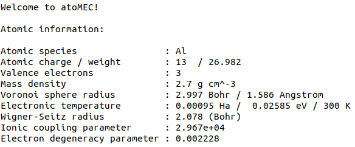

:author: Timothy J. Callow
:email: t.callow@hzdr.de
:institution: Center for Advanced Systems Understanding (CASUS), D-02826 Görlitz, Germany
:institution: Helmholtz-Zentrum Dresden-Rossendorf, D-01328 Dresden, Germany

:author: Daniel Kotik
:email: d.kotik@hzdr.de
:institution: Center for Advanced Systems Understanding (CASUS), D-02826 Görlitz, Germany
:institution: Helmholtz-Zentrum Dresden-Rossendorf, D-01328 Dresden, Germany	      

:author: Eli Kraisler
:email: eli.kraisler@mail.huji.ac.il
:institution: Fritz Haber Center for Molecular Dynamics and Institute of Chemistry, The Hebrew University of Jerusalem, 9091401 Jerusalem, Israel

:author: Attila Cangi
:email: a.cangi@hzdr.de
:institution: Center for Advanced Systems Understanding (CASUS), D-02826 Görlitz, Germany
:institution: Helmholtz-Zentrum Dresden-Rossendorf, D-01328 Dresden, Germany
   
:bibliography: main

..
   :video: http://www.youtube.com/watch?v=dhRUe-gz690

------------------------------------------------------------------------------------
Improving the accessibility of average-atom models for warm dense matter with atoMEC
------------------------------------------------------------------------------------

.. class:: abstract

   Abstract will go here.

.. class:: keywords

   computational physics, plasma physics, atomic physics, materials science

Introduction
------------

The study of matter under extreme conditions - materials exposed to temperatures, pressures or electromagnetic fields beyond ambient conditions on earth - is critical to our understanding of many important scientific and technological processes, such as nuclear fusion and various astro and planetary physics phenomena :cite:`MEC_linac`.
Of particular interest within this broad field is the warm dense matter (WDM) regime, which is typically characterized by temperatures from the kK to MK range (:math:`\sim 1-100` eV) and densities ranging from dense gases to highly compressed solids (:math:`\sim 0.01 - 1000\ \textrm{g cm}^{-3}`) :cite:`Bonitz_20`.
In this regime, it is important to account for the quantum mechanical nature of the electrons (and in some cases, the nuclei also). Therefore conventional methods from plasma physics, which either neglect quantum effects or treat them in a coarse manner, are usually not sufficiently accurate.
On the other hand, methods from condensed-matter physics and quantum chemistry, which account fully for quantum interactions, typically target the ground-state only, and are not therefore suitable for studying statistical ensembles which emerge at temperatures above zero.

Nevertheless, there are methods which can, in principle, be applied to study materials at any given temperature and density whilst formally accounting for quantum interactions. These methods are often denoted "first-principles" because, formally speaking, they yield the exact properties of the statistical quantum ensemble, under certain well-founded theoretical approximations.
Density-functional theory (DFT), initially developed as a ground-state theory :cite:`HK64,KS65` but later extended to non-zero temperatures :cite:`M65`, is one such theory and has been used extensively to study materials under WDM conditions :cite:`graziani_14`.
However, even though DFT reformulates the Schrödinger equation in a computationally efficient manner :cite:`Kohn_Nobel_lecture`, the cost of running calculations becomes prohibitively expensive at higher temperatures; formally, it scales as :math:`\mathcal{O}(N^3 T^3)`, with :math:`N` the particle number (which usually also increases with temperature) and :math:`T` the temperature :cite:`stoc_DFT`.
Furthermore, although it is formally an exact theory, in practise DFT relies on approximations for the so-called "exchange-correlation" energy, and these have not been rigorously tested under WDM conditions.
An alternative method used in the WDM community is path-integral Monte-Carlo :cite:`DGB18`, which yields essentially exact properties; however, it is even more limited by compuational cost than DFT, and in particularly becomes unfeasiable expensive at lower temperatures due to the fermion sign problem.

It is therefore of great interest to develop computationally cheap alternatives to the aforementioned methods. Some examples of promising developments in this regard include machine-learning based solutions :cite:`mala` and stochastic DFT :cite:`stoc_DFT`.
However, in this paper, we focus on an alternative class of models known as "average-atom" models. Average-atom models have a long history in plasma Physics :cite:`PRR_AA`: they account for quantum effects, typically using DFT, but reduce the complex system of interacting electrons and nuclei to a single atom immersed in a plasma (the "average" atom). An illustration of this principle (reduced to two-dimensions for visual purposes) is shown in Fig. ??.
This significantly reduces the cost relative to a full DFT simulation, because the particle number is restricted to the number of electrons per nucleus, and spherical symmetry is exploited to reduce the three-dimensional problem to one-dimension.

Naturally, in order to reduce the complexity of the problem as described, various approximations must be introduced. It is important to understand these approximations and their limitations in order for average-atom models to have genuine predictive capabalities.
Unfortunately, this is not always the case: although average-atom models share common concepts, there is no unique formal theory underpinning them and thus a variety of models and codes exist, and it is not typically clear which models can be expected to perform most accurately under which conditions.
In a previous paper :cite:`PRR_AA`, we addressed this issue by deriving an average-atom from first principles, and comparing the impact of different approximations within this model on some common properties.

In this paper, we continue this theme but now focus on computational aspects. We introduce atoMEC: an open-source average-**ato**\m code for studying **M**\atter under **E**\xtreme **C**\onditions.
The aim of atoMEC, as indicated by the title of this paper, is to improve the accessibility and understanding of average-atom models.
To the best of our knowledge, open-source average-atom codes are in scarce supply: with atoMEC, we aim to provide a tool which people can not only use to run average-atom simulations, but also to add their own models and thus facilitate comparisons of different approximations. 
The relative simplicity of average-atom codes means that they are not only efficient to run, but also efficient to develop: this means, for example, that they can be used as a test-bed for new ideas that could be later implemented in full DFT codes, and are also accessible to those without extensive prior expertise, such as students.
atoMEC aims to facilitate development by following good practise in software engineering (for example extensive documentation), a careful design structure, and of course through the choice of Python and its NumPy :cite:`numpy` and SciPy :cite:`scipy` libraries, which is arguably the most popular scientific programming language. 

This paper is structured as follows. In the next section, we briefly review the key theoretical points which are important to understand the functionality of atoMEC, assuming no prior physical knowledge of the reader.
Following that, we present the key functionality of atoMEC, discuss the code structure and algorithms, and explain how these relate to the theoretical aspects introduced.
Finally, we present an example case study: we consider Beryllium (which plays an important role in inertial confinement fusion) under a range of temperatures and densities, and probe the behaviour of a few important properties, namely the pressure, ionization state and ionization energies under these conditions.

.. figure:: test_voronoi.pdf
   :scale: 100
	   
   Illustration of the average-atom concept. The many-body and fully-interacting system of electron density (shaded blue) and nuclei (red points) on the left is mapped into the much simpler system of independent atoms on the right.
   Any of these identical atoms represents the "average-atom". The effects of interaction from neighbouring atoms are implicitly accounted for in an approximate manner through the choice of boundary conditions.

Theoretical background
----------------------

Properties of interest in the warm dense matter regime include, for example, equation-of-state data, which relates the density, energy, temperature and pressure of a material [CITE]; the mean ionization state and the electron ionization energies, which tell us about how tightly bound the electrons are to the nuclei; and the electrical and thermal conductivities.
These properties yield information pertinent to our understanding of stellar and planetary physics, the earth's core, inertial confinement fusion, and more besides.
To exactly obtain these properties, one needs (in theory) to determine the thermodynamic ensemble of the quantum states (the so-called *wave-functions*) representing the electrons and nuclei.
Fortunately, they can be obtained with reasonable accuracy using models such as average-atom models; in this section, we eloborate on how this is done.

We shall briefly review the key theory underpinning the type of average-atom models implemented in atoMEC. This is intended for readers without a background in quantum mechanics, to give some context to the purposes and mechanisms of the code.
For a comprehensive derivation of this average-atom model, we direct readers to Ref. :cite:`PRR_AA`.
The average-atom model we shall describe falls into a class of models known as *ion-sphere* models, which are the simplest (and still most widely-used) class of average-atom model. There are alternative (more advanced) classes of model such as *ion-correlation* [CITE] and *neutral pseudo-atom* models which we are not yet implemented in atoMEC and thus we don't elaborate on them here.

As demonstrated in Fig. ??, the idea of the ion-sphere model is to map a fully-interacting system of many electrons and nuclei into a set of independent atoms which do not interact explicity with any of the other spheres.
Naturally, this depends on several assumptions and approximations, but there is formal justification for such a mapping :cite:`PRR_AA`; furthermore, there are many examples in which average-atom models have shown good agreement with more accurate simulations and experimental data [CITE], which further justifies this mapping.

Although the average-atom picture is significantly simplified relative to the full many-body problem, even determining the wave-functions and their ensemble weights for an atom at finite temperature is a complex problem.
Fortunately, DFT reduces this complexity further, by establishing that the electronic *density* - a far less complex entity than the wave-functions - is sufficient to determine all physical observables.
The most popular formulation of DFT, known as Kohn-Sham DFT (KS-DFT) :cite:`KS65`, allows us to construct the *fully-interacting* density from a *non-interacting* system of electrons, simplifying the problem still.
Due to the spherical symmetry of the atom, the non-interacting electrons - known as the KS orbitals - can be represented as a product of radial and angular components,

.. math::
   :label: eq:phi

   \phi_{nlm}(\mathbf{r}) = X_{nl}(r) Y_l^m(\theta, \phi)\,,

where :math:`n,l,m` are the *quantum numbers* of the orbitals, which come from the fact that the wave-function is an eigenfunction of the Hamiltonian operator; and :math:`Y_l^m(\theta, \phi)` are the spherical harmonic functions. The radial co-ordinate :math:`r` represents the absolute distance from the nucelus.

We therefore only need to determine the radial KS orbitals :math:`X_{nl}(r)`. These are determined by solving the radial KS equation, which is similar to the Schrödinger equation for a non-interacting system, with an additional term in the potential to mimic the effects of electron-electron interaction (within the single atom).
The radial KS equation is given by

.. math::
   :label: eq:kseqn

   \left[- \left(\frac{\textrm{d}^2}{\textrm{d}r^2} + \frac{2}{r}\frac{\textrm{d}}{\textrm{d}r} - \frac{l(l+1)}{r^2} \right) + v_\textrm{s}[n](r) \right] X_{nl}(r) = \epsilon_{nl} X_{nl}(r).

We have written the above equation in a way that emphasizes that it is an eigenvalue equation, with the eigenvalues :math:`epsilon_{nl}` being the energies of the KS orbitals.

On the left-hand side, the terms in the round brackets come from the kinetic energy operator acting on the orbitals.
The :math:`v_\textrm{s}[n](r)` term is the KS potential, which itself is composed of three different terms,

.. math::
   :label: eq:kspot
	   
   v_{\textrm{s}}[n](r) = -\frac{Z}{r} + 4\pi \int_0^{R_\textrm{WS}} \textrm{d}{x} \frac{n(x)x^2}{r^>(x)} + \frac{\delta F_\textrm{xc}^\tau [n]}{\delta n(r)}\,,

where :math:`r^>(x)=\max(r,x)`. The three terms in the potential are respectively the electron-nuclear attraction, the classical Hartree repulsion, and the exchange-correlation (xc) potential.

We note that the KS potential and its constituents are function\ *als* of the electron density :math:`n(r)`. Were it not for this dependence on the density, solving Eq. :ref:`eq:kseqn` just amounts to solving an ordinary linear differential equation (ODE).
However, the electron density is in fact constructed from the orbitals in the following way,

.. math::
   :label: eq:dens
	   
   n(r) = 2\sum_{nl}(2l+1) f_{nl}(\epsilon_{nl},\mu,\tau) |X_{nl}(r)|^2\,,

where :math:`f_{nl}(\epsilon_{nl},\mu,\tau)` is the Fermi-Dirac (FD) distribution, given by

.. math::
   :label: eq:fdocc
	   
   f_{nl}(\epsilon_{nl},\mu,\tau) = \frac{1}{1+e^{(\epsilon_{nl}-\mu)/\tau}}\,.

The Fermi-Dirac distribution therefore assigns weights to the KS orbitals in the construction of the density, with the weight depending on their energy.

Therefore, the KS potential which determines the KS orbitals via the ODE (:ref:`eq:kseqn`), is itself dependent on the KS orbitals.
Consequently, the KS orbitals and its dependent quantities (the density and KS potential) must be determined via a so-called self-consistent field (SCF) procedure.
An initial guess for the orbitals, :math:`X_{nl}^0(r)`, is used to construct the initial density :math:`n^0(r)` and potential :math:`v_\textrm{s}^0(r)`.
The ODE (:ref:`eq:kseqn`) is then solved to update the orbitals.
This process is iterated until some appropriately chosen quantities - in atoMEC the total free energy, density and KS potential - are converged, i.e. :math:`n^{i+1}(r)=n^i(r),\ v_\textrm{s}^{i+1}(r)=v_\textrm{s}^i(r),\ F^{i+1} = F^i` within some reasonable numerical tolerance.
In Fig. 2, we illustrate the life-cycle of the average-atom model described so far, including the SCF procedure.
On the left-hand side of this figure, we show the physical choices and mathematical operations, and on the right-hand side, the representative classes and functions in atoMEC.
In the following section, we shall discuss some aspects of this figure in more detail.

Some quantities obtained from the completion of the SCF procedure are directly of interest.
For example, the energy eigenvalues :math:`\epsilon_{nl}` are related to the electron ionization energies, i.e. the amount of energy required to excite an electron from being bound to the nucleus to being a free (conducting) electron.
These predicted ionization energies can be used, for example, to verify experimental data [CITE] or help understand the so-called ionization potential depression effect, an important effect in WDM [CITE].
Another property that can be straightforwardly obtained from the energy levels and their occupation numbers is the mean ionization state :math:`\bar{Z}` [#f1]_,

.. math::
   :label: eq:MIS

   \bar{Z} = \sum_{n,l} (2l+1) f_{nl}(\epsilon_{nl}, \mu, \tau)

which is an important input parameter for various models, such as hydrodynamics codes used to simulate inertial confinement fusion [CITE].

Various other interesting properties can also be calculated following some postprocessing of the output of an SCF calculation. One such example is the electronic pressure :math:`P_\textrm{e}`, which is given by the functional derivative of the free energy with respect volume at fixed temperature,

.. math::
   
   P_\textrm{e} = -\frac{\delta F}{\delta V}\bigg|_\tau.

This can be evaluated using finite differences, by running two SCF calculations with radii :math:`R+\delta R` and :math:`R-\delta R`. Other methods exist for computing the pressure using the output of a single SCF calculation [CITE].
Furthermore, response properties, i.e. those resulting from an external perturbation like a laser pulse, can also be obtained from the output of an SCF cycle. These properties include for example electrical conductivities [CITE] and dynamical structure factors [CITE].
Such properties typically take as input the KS orbitals, their eigenvalues and occupation numbers, but require a larger number of orbitals than a normal SCF calculation (i.e. many orbitals with zero occupation need to be computed).

.. figure:: tikz-figure0.pdf
   :align: center
   :figclass: w
   :scale: 90

   Schematic of the average-atom model set-up and the self-consistent field (SCF) cycle.
   On the left-hand side, the physical choices and mathematical operations that define the model and SCF cycle are shown.
   On the right-hand side, the (higher-order) functions and classes in atoMEC corresponding to the items on the left-hand side are shown.
   Some liberties are taken with the code in the figure in order to improve readability.
   The dotted lines represent operations that are taken care of within the `models.CalcEnergy` function, but are shown nevertheless to improve understanding.
   

Code structure and details
--------------------------

In the following sections, we describe the structure of the code in relation to the physical problem being modelled.
Average-atom models can (at least appear) to rely on many different parameters and approximations.
In atoMEC, we have tried to structure the code in a way that makes clear which parameters come from the physical problem studied compared to choices of the model and numerical or algorithmic choices.

`atoMEC.Atom`: Physical parameters
**********************************

The first step of any simulation in WDM (which also applies to simulations in science more generally) is to define the physical parameters of the problem.
These parameters are unique in the sense that, if we had an exact method to simulate the real system, then for each combination of these parameters there would be a unique solution.
In other words, regardless of the model - be it average atom or a different technique - these parameters are always required and independent of the model.

In average-atom models, there are typically three parameters defining the physical problem:

* The **atomic species**
* The **temperature** of the material
* The **mass density** of the material

The mass density also directly corresponds to the mean distance between two nuclei (atomic centres), which in the average-atom model is equal to twice the radius of the atomic sphere.

In atoMEC, these physical parameters are controlled by the `Atom` object.
As an example, we consider Aluminium under ambient conditions, i.e. at room temperature, :math:`\tau=100\ \textrm{eV}`, and normal metallic density, :math:`\rho_\textrm{m}=2.7\ \textrm{g cm}^{-3}`.
We set this up as

.. code-block:: python
   
   from atoMEC import Atom
   Al = Atom("Al", 300, density=2.7, units_temp="K")

   Auto-generated print statement from calling the `atoMEC.Atom` object.

By default, the above code automatically prints the output seen in Fig. 3. We see that the first two arguments of the `Atom` object are the chemical symbol of the element being studied, and the temperature.
In addition, at least one of "density" or "radius" must be specified.
In atoMEC, the default (and only permitted) units for the mass density are :math:`\textrm{g cm}^{-3}`; *all* other input and output units in atoMEC are by default Hartree atomic units, and hence we specify "K" for Kelvin.

The information in Fig. 3 displays the chosen parameters in common units, as well as some other information directly obtained from these parameters.
The chemical symbol ("Al" in this case) is passed to the `mendeleev` library :cite:`mendeleev2014` to generate this data, which is used later in the calculation.

This initial stage of the average-atom calculation, i.e. the specification of physical parameters and initilization of the `Atom` object, is shown in the top row at the top of Fig. ??.

`atoMEC.models`: model parameters
*********************************

After the physical parameters are set, the next stage of the average-atom calculation is to choose the model and approximations within that class of model.
As discussed, so far the only class of model implemented in atoMEC is the ion-sphere model.
Within this model, there are still various choices to be made by the user.
In some cases, these choices make little difference to the results, but in other cases they have significant impact; the user might have some physical intuition as to which is most important, or alternatively may want to run the same physical parameters with several different model parameters to examine the effects.
Below we list some choices which are available in atoMEC, very approximately in decreasing order of impact (but this can depend strongly on the system under consideration):

* the **boundary condition** used to solve the KS equations (:ref:`eq:kseqn`)
* the treatement of the **unbound electrons**, which means those with energy above a certain threshold
* the choice of **exchange** and **correlation** functionals
* the **spin** polarization and magnetization

We do not discuss the theory and impact of these different choices in this paper. Rather, we direct readers to Refs. :cite:`PRR_AA` and ?? in which all of these choices are discussed.

In atoMEC, the ion-sphere model is controlled by the `models.ISModel` object. Continuing with our Aluminium example, we choose the so-called "Neumann" boundary condition, with a "quantum" treatment of the unbound electrons, and choose the LDA exchange functional (which is also the default). This model is set up as

.. code-block:: python
		
   from atoMEC import models
   model = models.ISModel(Al, bc="neumann",
		xfunc_id="lda_x", unbound="quantum")

.. [#f1] The summation in Eq. (:ref:`eq:MIS`) is often shown as an integral because the energies above a certain threshold form a continuous distribution (in most models).
