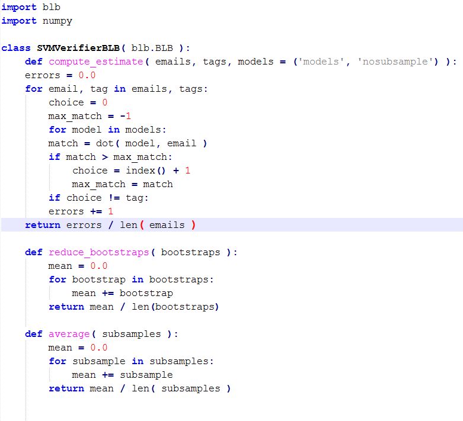
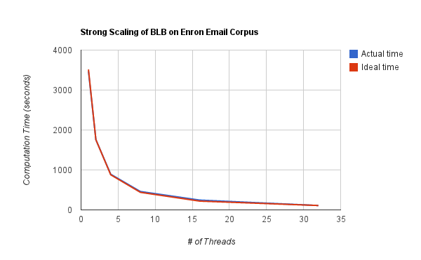

:author: Aakash Prasad
:email: aprasad91@gmail.com
:institution: University of California, Berkeley

:author: David Howard
:email: david.howard2012@gmail.com
:institution: University of California, Berkeley

:author: Shoaib Kamil
:email: skamil@cs.berkeley.edu
:institution: University of California, Berkeley

:author: Armando Fox
:email: fox@cs.berkeley.edu
:institution: University of California, Berkeley

-------------------------------------------------
Parallel High Performance Bootstrapping in Python
-------------------------------------------------

We use a combination of code-generation, code lowering, and just-in-time compilation
techniques called SEJITS (Selective Embedded JIT Specialization) to generate highly
performant parallel code for Bag of Little Bootstraps (BLB), a statistical sampling
algorithm that solves the same class of problems as general bootstrapping, but which
parallelizes better.  We do this by embedding a very small domain-specific language
into Python for describing instances of the problem and using expert-created code
generation strategies to generate code at runtime for a parallel multicore platform.
The resulting code can sample gigabyte datasets with performance comparable to
hand-tuned parallel code, achieving near-linear strong scaling on a 32-core CPU, yet
the Python expression of a BLB problem instance remains source- and 
performance-portable across platforms.  This work represents another case study in a
growing list of algorithms we have "packaged" using SEJITS in order to make 
high-performance implementations of the algorithms available to Python programmers 
across diverse platforms.

Introduction
------------

A common task domain experts are faced with is performing statistical analysis on 
data. The most prevalent methods for doing this task (e.g. coding in Python) often 
fail to take advantage of the power of parallelism, which restricts domain experts 
from performing analysis on much larger data sets, and doing it much faster than 
they would be able to with pure Python. 

The rate of growth of scientific data is rapidly outstripping the rate of 
single-core processor speedup, which means that scientific productivity is now 
dependent upon the ability of domain expert, non-specialist programmers 
(productivity programmers) to harness both hardware and software parallelism. 
However, parallel programming has historically been difficult for productivity 
programmers, whose primary concern is not mastering platform specific programming 
frameworks. At the same time, the methods available to harness parallel hardware 
platforms become increasingly arcane and specialized in order to expose maximum 
performance potential to efficiency programming experts. Several methods have been 
proposed to bridge this disparity, with varying degrees of success. 

High performance natively-compiled scientific libraries (such as SciPy) seek to 
provide a portable, high-performance interface for common tasks, but the usability 
and efficiency of an interface often varies inversely to its generality. In 
addition, SciPy's implementations are sequential, due to both the wide variety of 
parallel programming models and the difficulty of selecting parameters such as 
degree of concurrency, thread fan-out, etc. These problems are addressed in the 
literature on autotuning [CITE THINGS].

SEJITS [SEJITS]_ provides the best of both worlds by allowing very compact 
Domain-Specific Embedded Languages (DSELs) to be embedded in Python. Specializers 
are mini-compilers for these DSELs, themselves implemented in Python, which perform 
code generation and compilation at runtime; the specializers only intervene during 
those parts of the Python program that use Python classes belonging to the DSEL. BLB
is the latest such specializer in a growing collection.

ASP ("ASP is SEJITS for Python") is a powerful framework for bringing parallel 
performance to Python using targeted just-in-time code transformation. The ASP 
framework provides a skinny waist interface which allows multiple applications to 
be built and run upon multiple parallel frameworks by using a single run-time 
compiler, or specializer. Each specializer is a Python class which contains the 
tools to translate a function/functions written in Python into an equivalent 
function/functions written in one or more low-level efficiency languages.
In addition to providing support for interfacing productivity code to multiple 
efficiency code back-ends, ASP includes several tools which help the efficiency 
programmer lower and optimize input code, as well as define the front-end DSL. 
Several specializers already use these tools to solve an array of problems relevant
to scientific programmers [SEJITS]_.

Though creating a compiler for a DSL is not a new problem, it is one with which 
efficiency experts may not be familiar. ASP eases this task by providing accessible 
interfaces for AST transformation. The ``NodeTransformer``  interface in the ASP 
toolkit includes and expands upon CodePy's [CodePy]_ C++ AST structure, as well as providing 
automatic translation from Python to C++ constructs. By extending this interface, 
efficiency programmers can define their DSEL by modifying only those constructs 
which differ from standard python, or intercepting specialized constructs such as 
special function names. This frees the specializer writer from re-writing 
boilerplate for common constructs such as branches or arithmetic operations.

ASP also provides interfaces for managing source variants and platforms, to complete 
the task of code lowering. The ASP framework allows the specializer writer to specify 
Backends, which represent distinct parallel frameworks or platforms. Each backend 
may store multiple specialized source variants, and includes simple interfaces for 
selecting new or best-choice variants, as well as compiling and running the 
underlying efficiency source codes. Couple with the Mako templating language and 
ASP's AST transformation tools, efficiency programmers are relieved of writing and 
maintaining platform-specific boilerplate and tools, and can focus on providing the
best possible performance for their specializer.

Related Work
------------

Prior work on BLB includes a serial implementation of the algorithm, as described in "The Big Data Bootstrap" and a Scala implementation that runs on the Spark cluster computing framework, as described in "A Scalable Bootstrap for Massive Data". The first paper shows that the BLB algorithm produces statistically robust results on a small data set with a linear estimator function. The second paper describes how BLB scales with large data sets in distributed environments.

BLB
---------------

BLB ("Bag of Little Bootstraps") is a method to assess the quality of a statistical 
estimator, :math:`\theta(X)`, based upon subsets of a sample distribution ``X``.  :math:`\theta` might represent 
such quantities as the parameters of a regressor, or the test accuracy of a machine 
learning classifier. In order to calculate :math:`\theta`, subsamples of size :math:`K^{\gamma}`, where :math:`K=|X|` 
and :math:`\gamma` is a real number between 0 and 1, are drawn n times without replacement from X,
creating the independent subsets :math:`X_{1},X_{2},...,X_{n}`. Next, ``K`` elements are resampled with 
replacement from each subset :math:`X_{i}`, m times. This procedure of resampling with 
replacement is referred to as bootstrapping. The estimator :math:`\theta` is applied to each 
bootstrap. These results are reduced using a statistical aggregator (e.g. mean, 
variance, margin of error, etc.) to form an intermediate estimate :math:`\theta'(X_{i})`.Finally, the
mean of :math:`\theta'`  for each subset is taken as the estimate for :math:`\theta(X)`. This method is 
statistically rigorous, and in fact reduces bias in the estimate compared to other 
bootstrap methods [BLB]_. In addition, its structural properties lend themselves to 
efficient parallelization. 

DSEL for BLB
------------

A BLB problem instance is defined by the estimators and reducers it uses, its 
sampling parameters, and its input data. Our BLB specializer exposes a simple but 
expressive interface which allows the user to communicate all of these elements 
using either pure Python or a simple DSEL.

The DSEL, which is formally specified in Appendix A, is designed to concisely express
the most common features of BLB estimator computations: position-independent iteration
over large data sets, and dense linear algebra. The BLB algorithm was designed for
statistical and loss-minimization tasks. These tasks share the characteristic of
position-independant computation; they depend only on the number and value of the 
unique elements of the argument data sets, and not upon the position of these
data points within the set. For this reason, the DSEL provides a pythonic interface
for iteration, instead of a position-oriented style (i.e., subscripts and
incrementing index variables) which is common in lower-level languages. Because most 
data sets which BLB operates on will have high-dimensional data, the ability to 
efficiently express vector operations is an important feature of the DSEL. All 
arithmetic operations and function calls which operate on data are replaced in the 
final code with optimized, inlined functions which automatically handle data of any 
size without changes to the source code. In addition to these facilities, common
dense linear algebra operations may also be accessed via special function calls
in the DSEL.

The next set of problem parameters, the sampling parameters, are not represented 
directly in the DSEL; In fact, they are not referenced anywhere therein. This is 
because the sampling parameters, which comprise n, m, and :math:`\gamma`, have pattern-level 
consequences, and have no direct bearing on the executrion of users' computations. These values can
be passed as keyword arguments to the specializer object when it is created, or the 
specializer may be left to choose reasonable defaults.

The final components of a problem instance are the input data. Much of the necessary 
information about the input data is gleaned by the specializer without referring to 
the DSEL. However, a major component of what to do with the input data is expressed 
using the DSEL's annotation capability. Argument annotations, as seen in figure 1 
below, are used to determine whether or not a given input should be subsampled as 
part of the BLB pattern. This is essential for many tasks, because it allows the user
to pass in non-data information (e.g. a machine learning model vector) into the 
computation. Though the annotations are ultimately removed, the information they 
provide propagates as changes to the pattern within the execution template.

An example application of BLB is to do model verification. Suppose we have trained a
classifier :math:`\pi: \mathbb{R}^{d} \rightarrow C` where ``d`` is the dimension of our feature vectors and ``C`` is the set 
of classes. We can define :math:`\theta[Y]`  to be ``error[Y]/|Y|``, where the error function is 1 if 
:math:`\pi(y)` is not the true class of ``y``, and 0 elsewhere. If we then choose arithmetic mean 
as a statistical aggregator, the BLB method using the :math:`\gamma` we defined will provide an 
estimate of the test error of our classifier.

*figure 1. User-supplied code for model verification application using BLB 
specializer.*

The Specializer: A Compiler for the BLB DSEL
--------------------------------------------

The BLB specializer combines various tools, as well as components of the ASP framework 
and a few thousand lines of custom code, to inspect and lower productivity code at 
run time. 

The BLB DSEL is accessed by creating a new Python class which uses the base 
specializer class, ``blb.BLB``, as a parent. Specific methods corresponding to the 
estimator and reducer functions are written with the DSEL, allowing the 
productivity programmer to easily express aspects of a BLB computation which can be
difficult to write efficiently. Though much of this code is converted faithfully from
Python to C++ by the specializer, two important sets of constructs are intercepted 
and rewritten in an optimized way when they are lowered to efficiency code. The 
first such construct is the for loop. In the case of the estimator `\theta`, these 
loops must be re-written to co-iterate over a weight set. As mentioned above, the 
bootstrap step of the algorithm samples with replacement a number of data points 
exponentially larger than the size of the set. A major optimization of this operation
is to re-write the estimator to work with a weight set the same size as the subsample,
who's weights sum to the size of the original data set. This is accomplished within 
the DSEL by automatically converting for loops over subsampled data sets into 
weighted loops, with weight sets drawn from an appropriate multinomial distribusion
for each bootstrap. When this is done, the specializer converts all the operations 
in the interior of the loop to weighted operations, which is why only augmented 
assignments are permitted in the interior of loops Appendix A. The other set of 
constructs handled specially by the specializer are operators and function calls.
These constructs are specialized as described in the previous section.

Introspection begins when a specializer object is instantiated. When this occurs, 
the specializer uses Python's inspect module to extract the source code from the 
specializer object's methods named ``compute_estimate``, ``reduce_bootstraps``, and ``average``.
The specializer then uses Python's ast module to generate a Python abstract syntax 
tree for each method.

The next stage of specialization occurs when the specialized function is invoked. 
When this occurs, the specializer extracts salient information about the problem, 
such as the size and data type of the inputs, and combines it with information about
the platform gleaned using ASP's platform detector. Along with this information, each
of the three estimator ASTs is passed to a converter object, which transforms the 
Python ASTs to C++ equivalents, as well as performing optimizations. The converter 
objects referred to above perform the most radical code transformations, and more so 
than any other part of the specializer might be called a run-time compiler (with the 
possible exception of the C++ compiler invoked later on). Once each C++ AST is 
produced, it is converted into a python string whose contents are a valid C++ 
function of the appropriate name. These functions-strings, along with platform and 
problem-specific data, are used as inputs to Mako templates to generate a C++ source
file tailored for the platform and problem instance. Finally, CodePy is used
to compile the generate source file and return a reference to the compiled function 
to Python, which can then be invoked.

In addition to code lowering and parallelization, the specializer is equipped to make
pattern-level optimization decisions. These optimizations change the steps of the 
execution pattern, but do not affect the user's code. The best example of this in the
BLB specializer is the decision of whether or not to load in subsamples. Subsamples
of the full data set can be accessed by indirection to individual elements (a 
subsample is an array of pointers) or by loading the subsampled elements into a new 
buffer (loading in). Loading in subsamples encourages caching, and our experiments 
showed performance gains of up to 3x for some problem/platform combinations using 
this technique. However, as data sizes grow, the  time spent moving data or 
contending for shared resources outweighs the caching benefit. Because the 
specializer has some knowledge of the platform and of the input data sizes, it is 
able to make predictions about how beneficial loading in will be, and can modify the 
efficiency level code to decide which inputs should be loaded in and which should 
not. The specializer determines this by comparing the size of a subsample to the 
size of the shared L2 cache; if the memory needed for a single thread would consume 
more than 40% of the resources, then subsamples will not be loaded in. The value of 
40% is empirical, and determined for the particular experiments herein. In the 
future, this and other architecture-level optimizations will be made automatically 
by specializers by comparing the performance effects of such decisions on past 
problem instances.

The other major pattern-level decision for a BLB computation is choice of sampling 
parameters. These constitute the major efficiency/accuracy trade-off of the BLB 
approach. By default, the specializer sets these parameters conservatively, favoring
accuracy heavily over efficiency; The default sampling parameters are n = 25 
subsamples, m = 100 bootstraps per subsample, and :math:`\gamma` = 0.7. Though each of these values 
has clear performance implications, the specializer does not adjust them based on 
platform parameters because it does not include a mechanism to evaluate acceptable
losses in accuracy.

Empirical evidence shows that accuracy declines sharply using :math:`\gamma` less than 0.5 [BLB]_,
though does not increase much more using a higher value than 0.7. A change of .1 in 
this value leads to an order-of-magnitude change in subsample size for data sets in 
the 10-100 GB range, so the smallest value which will attain the desired accuracy 
should be chosen. The number of subsamples taken also has a major impact on 
performance. The run time of a specialized computation in these experiments could be
approximated to within 5% error using the formula :math:`t=\lceil\frac{n}{c}\rceil s` , where t is the total 	
running time, c is the number of cores in use, and s is the time to compute the 
bootstraps of a single subsample in serial. Though the result from bootstraps of a 
given subsample will likely be close to the true estimate, at least 20 subsamples 
were needed in the experiments detailed here to reduce variance in the estimate to an
acceptable level. Finally, the number of bootstraps per subsample determines how 
accurate an estimate is produced for each subsample. In the experiments described 
below, 40 bootstraps were used. In experiments not susceptible to noise, as few as 25
were used with acceptable results. Because the primary effect of additional 
bootstraps is to reduce the effect of noise and improve accuracy, care should be 
taken not to use too few.

Evaluation
----------

We evaluated the performance gains from using our SEJITS specializer by performing 
model verification of a SVM classifier on a subset of the Enron email corpus [ENRON]_. 
We randomly selected 10% (Approximately 120,000 emails) from the corpus to serve as our data set.
From each email, we extracted the counts of all words in the email, as well as the user-defined 
directory the email was filed under. We then aggregated the word counts of all the emails to 
construct a Bag-of-Words model of our data set, and assigned classes based upon directory. 
In the interest of classification efficiency, we filtered the emails to use only those from the 
20 most common classes, which preserved approximately 98% of our original data set. 
In the final count, our test data consisted of approximately 126,000 feature vectors and tags,
with each feature vector composed of approximately 96,000 8-bit features.
Using the SVM-Multiclass [SVM] library, we trained a SVM classifier to decide the 
likeliest storage directory for an email based upon its bag of words representation. 
We trained the classifier on 10% of our data set, reserving the other 90% as a test set.
We then applied the specialized code shown in figure 1 to estimate the accuracy of the 
classifier. We benchmarked the performance and accuracy of the specializer on a 
system using 4 Intel X7560 processors.

Our experiments indicate that our specialized algorithm was able to achieve performance 
gains of up to 31.6x with regards to the serial version of the same algorithm, and up
to 22.1x with respect to other verification techniques. These gains did not come at the
cost of greatly reduced accuracy; the results from repeated runs of the specialized 
code were both consistent and very close to the true population statistic.

*Figure 2. Efficiency gains from specialized code.*

As is visible from figure 2 above, our specialized code achieved near-perfect strong
scaling. In the serial case, the computation took approximately 3478 seconds.
By comparison, when utilizing all 32 available hardware contexts, the exact same 
productivity level code returned in just under 110 seconds. 

We also used SVM Multiclass' native verification utility to investigate the relative
performance and accuracy of the specializer. SVM Multiclass' utility differs critically
from our own in several ways: The former uses an optimized sparse linear algebra system,
whereas the latter uses a general dense system; the former provides only a serial 
implementation; and the algorithm (traditional cross-validation) is different from ours.
All of these factors should be kept in mind as results are compared. Nevertheless, the
specializer garnered order-of-magnitude performance improvements once enough cores were
in use. SVM Multiclass' utility determined the true population statistic in approximately
2200 seconds, making it faster than the serial incarnation of our specializer, but less
efficient than even the dual-threaded version. 

The native verification utility determined that the true error rate of the classifier on 
the test data was 67.86%. Our specializers estimates yielded a mean error rate of 67.24%,
with a standard deviation of 0.36 percentage points. Though the true statistic was outside
one standard deviation from our estimate's mean, the specializer was still capable of
delivering a reasonably accurate estimate very quickly.

Limitations and Future Work
---------------------------

Some of the limitations of our current specializer are that the targets are limited to OpenMP and Cilk. We would like to implement a GPU and a cloud version of the BLB algorithm as additional targets for our specializer. We'd like to explore the performance of a GPU version implemented in CUDA. A cloud version will allow us to apply the BLB sepcializer to problems involving much larger data sets than are currently supported. Another feature we'd like to add is the ability for our specializer to automatically determine targets and parameters based on the input data size and platform specifications.

Conclusion
----------

Using the SEJITS framework, productivity programmers are able to easily express high
level computations while simultaneously gaining order-of-magnitude performance benefits.
Because the parallelization strategy for a particular pattern of computation and hardware
platform is often similar, efficiency expert programmers can make use of DSLs embedded
in higher level languages, such as Python, to provide parallel solutions to large
families of similar problems. 

We were able to apply the ASP framework and the BLB pattern of computation to 
efficiently perform the high level task of model verification on a large data set.
This solution was simple to develop with the help of the BLB specializer, 
and efficiently took advantage of all available parallel resources.

The BLB specializer provides the productivity programmer not only with performance,
but with performance portability. Many techniques for bringing performance benefits
to scientific programming, such as pre-compiled libraries, autotuning, or parallel
framework languages, tie the user to a limited set of platforms. With SEJITS,
productivity programmers gain the performance benefits of a wide variety of platforms
without changes to source code.

This specializer is just one of a growing catalogue of such tools, which will bring
to bear expert parallelization techniques to a variety of the most common computational
patterns. With portable, efficient, high-level interfaces, domain expert programmers
will be able to easily create and maintain code bases in the face of evolving
parallel hardware and networking trends.

Acknowledgements
----------------

Armando Fox and Shoaib Kamil provided constant guidance in the development of this specializer,
as well as the ASP project.
Ariel Kleiner, Ameet Talwalkar, Purnamrita Sarkar, and Michael Jordan developed the
BLB algorithm, and published the initial paper on the subject, *Bootstrapping Big Data*.
They also consulted on effective parallelization strategies for that algorithm.
John Duchi and Yuchen Zhang helped finalize the experiment plan and select appropriate test data sets.
Richard Xia and Peter Birsinger developed the first BLB specializer interface,
and continued work on the shared-nothing cloud version of this specializer.

References
----------

.. [SEJITS] S. Kamil, D. Coetzee, A. Fox. "Bringing Parallel Performance to Python with Domain-Specific Selective Embedded Just-In-Time Specialization". In SciPy 2011.
.. [BLB] A. Kleiner, A. Talwalkar, P. Sarkar, M. Jordan. "Bootstrapping Big Data". In NIPS 2011.
.. [CodePy] CodePy Homepage: http://mathema.tician.de/software/codepy
.. [ENRON] B. Klimt and Y. Yang. "The Enron corpus: A new dataset for email classification research". In ECML 2004.
.. [SVM] SVM-Multiclass Homepage: http://svmlight.joachims.org/svm_multiclass.html
.. [Spark] M. Zaharia, M. Chowdhury, T. Das, A. Dave, J. Ma, M. McCauley, M. J. Franklin, S. Shenker, I. Stoica. "Resilient Distributed Datasets: A Fault-Tolerant Abstraction for In-Memory Cluster Computing". In USENIX NSDI 2012.

Appendix A: Formal Specification of DSEL
-------------------------------------------

::

  ## NAME indicates a valid python name, with the added 
  ## stipulation it not start with '_blb_'
  ## INT and FLOAT indicate decimal representations of 
  ## 64 bit integers and IEEE floating point numbers, 
  ## respectively
  ## NEWLINE, INDENT, and DEDENT stand for the respective
  ## whitespace elements

  P ::= OUTER_STMT* RETURN_STMT
  AUG ::= '+=' \ '-=' | '*=' | '/='
  NUM ::= INT | FLOAT
  OP ::= '+' | '-' | '*' | '/' | '**'
  COMP ::= '>' | '<' | '==' | '!=' | '<=' | '>='
  BRANCH ::= 'if' NAME COMP NAME':'

  RETURN_STMT ::= 'return' NAME | 'return' CALL

  CALL ::= 'sqrt(' NAME ')' 
 	| 'len(' NAME ')'
	| 'mean(' NAME ')'
	| 'pow(' NAME',' INT ')'
	| 'dim(' NAME [',' INT ] ')'
	| 'dtype(' NAME ')'
	| 'MV_solve(' NAME',' NAME',' NAME ')'
	| NAME OP CALL | CALL OP NAME 
	| CALL OP CALL | NAME OP NAME
	| NAME '*' NUM | CALL '*' NUM
	| NAME '/' NUM | CALL '/' NUM
	| NAME '**' NUM | CALL '**' NUM

  INNER_STMT ::= NAME '=' NUM | 
	| NAME = 'vector(' INT [',' INT]*', type='NAME ')'
	| NAME AUG CALL
	| NAME '=' 'index('[INT]')' OP NUM 
	| NAME = NUM OP 'index('[INT]')'
	| BRANCH NEWLINE INDENT INNER_STMT* DEDENT
	| 'for' NAME[',' NAME]* 'in' NAME[',' NAME]*':' NEWLINE INDENT INNER_STMT* DEDENT

  OUTER_STMT ::= NAME '=' NUM
	| NAME '=' 'vector(' INT [',' INT]*', type='NAME ')'
	| NAME '=' CALL | NAME AUG CALL
	| 'for' NAME[',' NAME]* 'in' NAME[',' NAME]*':' NEWLINE INDENT INNER_STMT* DEDENT
	| BRANCH NEWLINE INDENT OUTER_STMT* DEDENT

