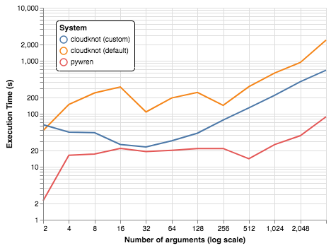
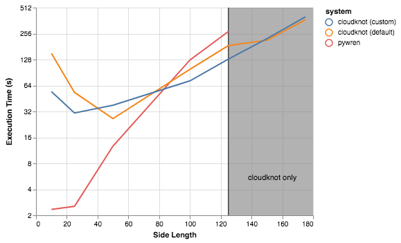
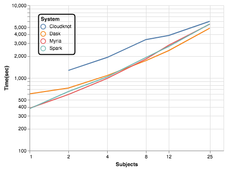

:author: Adam Richie-Halford
:email: richiehalford@gmail.com
:institution: University of Washington, Seattle, WA

:author: Ariel Rokem
:email: arokem@gmail.com
:institution: University of Washington, Seattle, WA

:bibliography: mybib

------------------------------------------------------------------
Cloudknot: A Python Library to Run your Existing Code on AWS Batch
------------------------------------------------------------------

.. class:: abstract

   We introduce cloudknot, a software library that simplifies
   cloud-based distributed computing by programmatically executing
   user-defined functions (UDFs) in AWS Batch. It takes as input
   a Python function, packages it as a container, creates all the
   necessary AWS constituent resources to submit jobs, monitors their
   execution and gathers the results, all from within the Python
   environment. Cloudknot overcomes limitations of previous similar
   libraries, such as Pywren, that runs UDFs on AWS Lambda, because most
   data science workloads exceed the AWS Lambda limits on execution
   time, RAM, and local storage.

.. class:: keywords

   Cloud computing, Amazon AWS

Introduction
------------

|warning| In the quest to minimize time-to-first-result, data scientists
are increasingly turning to cloud-based distributed computing with
commercial vendors like Amazon Web Services (AWS). Cloud computing
platforms have the advantage of scalability: users can access limitless
computing resources to meet the demands of their computational
workloads. At the same time they offer elasticity: resources are
provisioned as-needed and can be decomissioned when they are no longer
needed. In data-intensive research scenarios in which large
computational workloads are coupled with large amounts of data this
could in principle offer substantial speedups. But because of the
complexity and steep learning curve associated with a transition to
cloud computing, it remains inaccessible to many researchers.

A number of Python libraries have sought to close this gap by allowing
users to interact seamlessly with AWS resources from within their Python
environment. For example, Pywren :cite:`jonas2017` enables users to run
their existing Python code on AWS Lambda, providing convenient
distributed execution for jobs that fall within the limits of this
service (currently maximum 300 seconds of execution time, 1.5 GB of RAM,
512 MB of local storage, and no root access). These limitations are
impractical for many data-oriented workloads, that require more RAM and
local storage, longer compute times, and complex dependencies. The AWS
Batch service, on the other hand, offers a platform for these workloads.
Batch does XXX, XXX and XXX. One of the main advantages of batch,
relative to the provisioning of your own compute instances is that it
abstracts away the exact details of the infrastructure that is needed,
offering instead relatively straight-forward abstractions: a *job*,
which is an atomic task to repeat on multiple inputs, encapsulated in a
linux executable, a bash script or a Docker container, a *job
definition*, which connects the job with the compute resources it
requires, a *job queue*, which serves as a scheduler for the jobs, and a
*compute enviroment*, which defines the details of the computational
resources needed, such as number of processors, or amount of RAM.

While Batch provides useful abstractions for batch computing, the user
interface provided through the AWS web console still resists automation,
requires learning many of the terms that control its execution and does
not facilitate scripting and/or reproducibility.

Here, we introduce a new Python library: cloudknot
:cite:`cloudknot-docs` :cite:`cloudknot-repo`, that launches Python
functions as jobs on the AWS Batch service, thereby lifting these
limitations. |warning|

Methods
-------

The primary object in cloudknot is the :code:`Knot`, which employs the
single program, multiple data (SPMD) paradigm to achieve parallelism.
In this section, we describe cloudknot's approach to establishing the
single program (SP) and managing the multiple data (MD). :code:`Knot`'s
user-facing API and interactions with cloud-based resources are depicted
in Figure :ref:`fig.workflow`.

.. figure:: figures/cloudknot_workflow.pdf

   Cloudknot's SPMD workflow. The left two columns depict steps
   cloudknot takes to create the SP. The right columns depicts
   cloudknot's management of the MD. Blue rounded squares represent
   components of cloudknot's user-facing API. Yellow circles represent
   AWS resources. Grey document shapes represent containers,
   templates, or data used to communicate with cloud resources.
   :label:`fig.workflow`

Single Program (SP)
~~~~~~~~~~~~~~~~~~~

:code:`Knot` creates the single program on initialization, taking a user-defined
function (UDF) as input and wrapping it in a command line interface (CLI) that
downloads data from an Amazon Simple Storage Service (S3) bucket specified by an
input URL. The UDF is also wrapped in a Python decorator that sends its output
back to an S3 bucket. So in total, the command line program downloads input data
from S3, executes the UDF, and sends output back to S3. :code:`Knot` then
packages the CLI, along with its dependencies, into a Docker container. The
container is uploaded into the Amazon Elastic Container Registry (ECR).
Cloudknot's use of Docker allows it to handle non-trivial software and data
dependencies (see the microscopy examples later in this paper).

Separately, :code:`Knot` uses an AWS CloudFormation template to create
the AWS resources required by AWS Batch:

- AWS Identity and Access Management (IAM) Roles

  - A batch service IAM role to allow AWS Batch to make calls to other
    AWS services on the user's behalf

  - An Elastic Container Service (ECS) instance role to be attached to each
    container instance when it is launched

  - An Elastic Cloud Compute (EC2) Spot Fleet role to allow Spot Fleet to bid
    on, launch, and terminate instances if the user chooses to use Spot Fleet
    instances instead of dedicated EC2 instances.

- An AWS Virtual Private Cloud (VPC) with subnets and a security group

- An AWS Batch job definition specifying the job to be run. :code:`Knot`
  passes the location of the Docker container on AWS ECR to this job
  definition so that all jobs execute the SP.

- An AWS Batch job queue that schedules jobs onto a compute environment.

- An AWS Batch compute environment, which is a set of compute resources
  that will be used to run jobs. The user may ask :code:`Knot` to
  restrict the compute environment to only certain instance types (e.g.
  ``c4.2xlarge``) or may choose a specific Amazon Machine Image (AMI)
  to be loaded on each compute resource. Or thay may simply request a
  minimum, desires, and maximum number of virtual CPUs and let AWS Batch
  select and manage the EC2 instances.

:code:`Knot` uses sensible defaults for the job definition and compute
environment parameters so that the casual user may never need to concern
themselves with selecting an instance type or specifying an AMI. More
advanced users can their jobs' memory requirements, instance types, or
AMIs. This might be necessary if the jobs require special hardware (e.g.
GPGPU computing) or if the user wants more fine-grained control over
which resources are launched.

Finally, :code:`Knot` exposes AWS resource tags to the user so that
they can assign metadata to each created resource. This facilitates
management of cloudknot generated resources and allows the user to
quickly recognize cloudknot resources in the AWS console.

Multiple Data (MD)
~~~~~~~~~~~~~~~~~~

To operate on the MD, the :code:`Knot.map()` method serializes each
element of the input and sends it to S3, organizing the data in a schema
that is internally consistent with the expectations of the CLI. It then
launches an AWS Batch array job (or optionally, separate individual
Batch jobs) to execute the program over these data. When run, each batch
job selects its own input, executes the UDF, and returns its serialized
output to S3.

.. Talk about S3 transfers within the data center. If the instances and
   bucket are in the same region, then users shouldn't pay for transfer
   from S3 to instance and back. Only for transfer out of the data
   center (i.e. from local machine to S3 and back. We probably don't
   need to mention this detail in the paper. If we do, we should talk
   about how the use can use functions in ck.config to change their
   bucket region to match the instance region.

Finally, :code:`Knot.map()` downloads the output from S3 and returns
it to the user. Since AWS Batch, and therefore Cloudknot, allows
arbitrarily long execution times, :code:`Knot.map()` returns a list
of futures for the results, mimicking Python's concurrent futures'
:code:`Executor` objects.

Under the hood, :code:`Knot.map()` creates a
:code:`concurrent.futures.ThreadPoolExecutor` instance where each
thread intermittently queries S3 for its returned output. The results
are encapsulated in :code:`concurrent.futures.Future` objects, allowing
asynchronous execution. The user can use :code:`Future` methods such
as :code:`done()` and :code:`result()` to test for success or view the
results. This also allows them to attach callbacks to the results using
the :code:`add_done_callback()` method. For example a user may want to
perform a local reduction on results generated on AWS Batch.

API
---

The above interactions with AWS resources are hidden from the user.
The advanced and/or curious user can customize the Docker container or
CloudFormation template. But for most use cases, the user interacts
only with the :code:`Knot` object. This section provides an example
multiplying random matrices and vectors as a pedagogical introduction to
the cloudknot API.

We first import cloudknot and define the function that we would like to
run on AWS Batch. Cloudknot uses the `pipreqs` :cite:`pipreqs` package
to generate the requirements file used to install dependencies in the
Docker container on AWS ECR. So all required packages must be imported
inside the UDF itself.

.. code-block:: python

   import cloudknot as ck

   def monte_pi_count(b):
       import numpy as np
       x = np.random.rand(n)
       y = np.random.rand(n)
       return np.count_nonzero(x * x + y * y <= 1.0)

Next, we create a :code:`Knot` instance and pass the UDF using the func
argument. The name argument affects the names of resources created on
AWS. For example, in this case, the created job definition
would be named "random_mv_product-cloudknot-job-definition."

.. code-block:: python

   knot = ck.Knot(name='pi-calc', func=monte_pi_count)

We submit jobs with the :code:`Knot.map()` method:

.. code-block:: python

   import numpy as np # for np.linspace
   n_jobs, n_samples = 1000, 100000000
   args = np.ones(n_jobs, dtype=np.int32) * n_samples
   future = knot.map(args)

This will launch an AWS Batch array job with 20 child jobs, one for each
element of the input array. Cloudknot can accomodate
functions with multiple inputs by passing the :code:`map()` method a
sequence of tuples of input arguments and the :code:`starmap=True`
argument. For example, if the UDF signature were :code:`def udf(arg0,
arg1)`, one could execute :code:`udf` over all combinations of
:code:`arg0` in ``[1, 2, 3]`` and :code:`arg1` in ``['a', 'b', 'c']``
by calling

.. code-block:: python

   args = list(itertools.product([1, 2, 3],
                                 ['a', 'b', 'c']))
   future = knot.map(args, starmap=True)

We can then query the result status using :code:`future.done()`
and retrieve the results using :code:`future.result()`, which
will block until results are returned unless the user passes an
optional :code:`timeout` argument. We can also check the status
of all the jobs that have been submitted with this :code:`Knot`
instance by inspecting the :code:`knot.jobs` property, which returns
a list of :code:`cloudknot.BatchJob` instances, each of which
has its own :code:`done` property and :code:`result()` method.
So in the example above, :code:`future.done()` is equivalent to
:code:`knot.jobs[-1].done` and :code:`future.result()` is equivalent to
:code:`knot.jobs[-1].result()`. In this way, users have access to AWS
Batch job results that they have run in past sessions.

In this pedagogical example, we are estimating :math:`\pi` using the
Monte Carlo method. :code:`Knot.map()` returns a future for an array
of counts of random points that fall within the circle enclosed by the
unit square. To get the final estimate of :math:`\pi`, we need to sum
all the elements of this array and divide by four, a simple use case for
:code:`future.add_done_callback()`:

.. code-block:: python

   PI = 0.0
   n_total = n_samples * n_jobs
   def pi_from_future(future):
       global PI
       PI = 4.0 * np.sum(future.result()) / n_total

   future.add_done_callback(pi_from_future)

Lastly, without navigating to the AWS console, we can get a quick
summary of the status of all jobs submitted with this :code:`Knot` using

.. code-block:: python

   >>> knot.view_jobs()
   Job ID          Name           Status
   ----------------------------------------
   fcd2a14b...     pi-calc-0      PENDING

Examples
--------

In this section, we will present a few use-cases of cloudknot. We will
start with examples that have minimal software and data dependencies,
and increase the complexity by adding first data dependencies and
subsequently complex software and resource dependencies.

Solving differential equations
~~~~~~~~~~~~~~~~~~~~~~~~~~~~~~

Simulations executed with cloudknot do not have to comply with any
particular memory or time limitations. This is in contrast to Pywren's
limitations, which stem from the use of the AWS Lambda service. On
the other hand, cloudknot's use of AWS Batch increases the overhead
associated with creating AWS resources and uploading a Docker container
to ECR. While this infrastructure setup time can be minimized by reusing
AWS resources that were created in a previous session, this setup time
suits use-cases for which execution time is much greater than the time
required to create the necessary resources on AWS.

To demonstrate this, we used Cloudknot and Pywren to find the steady-state
solution to the two-dimensional heat equation by the Gauss-Seidel method
:cite:`templates-linear-sys`. The method chosen is suboptimal, as is the
specific implementation of the method, and serves only as a benchmarking tool.
In this fictitious example, we wish to parallelize execution both over a range
of different boundary conditions and over a range of grid sizes.

First, we hold the grid size constant at 10 x 10 and parallelize over
different temperature constraints on one edge of the simulation grid. We
investigate the scaling of job execution time as a function of the size
of the argument array. In Figure :ref:`fig.nargsscaling` we show the
execution time as a function of the length of the argument array (with
a :math:`\log_2` scale on both axes). The default :code:`Knot` instance
has a maximum of 256 vCPUs in its compute environment and a desired
vCPUs setting of 8. We testing scaling using these default parameters
and also using a custom parameters with :code:`min_vcpus=512`,
:code:`desired_vcpus=2048`, and :code:`max_vcpus=4096`. These tests
were also limited by the EC2 service limits for our region and account,
which vary by instance type but never exceeded 200 instances. The user
interested in maximizing throughput could request limit increases.
Regardless of the :code:`Knot` parameters, Pywren outperformed cloudknot
at all argument array sizes. Indeed, Pywren appears to achieve
:math:`\mathcal{O}(1)` scaling for much of the argument range, revealing
AWS Lambda's capabilities for massively parallel computation. |warning|

   Execution time to find solutions of the 2D heat equation for many
   different temperature constraints on a 10x10 grid. We show scaling
   as a function of the number of constraints for Pywren, the default
   cloudknot configuration, and a cloudknot configuration with more
   available vCPUs. Pywren outperforms cloudknot in all cases. We posit
   that the additional overhead associated with building the Docker
   image, along with EC2 service limits limited cloudknot's throughput.
   :label:`fig.nargsscaling`

For the data in Figure :ref:`fig.syssizescaling`, we still parallelized
over only five different temperature constraints, but we did so
for increasing grid sizes. Grid sizes beyond 125 x 125 required an
individual job execution time that exceeded the AWS Lambda execution
limit of 300s. So Pywren was unable to compute on the larger grid sizes.
There is a crossover point around 80 x 80 where Cloudknot outperforms
Pywren. Before this point, AWS Lambda's fast triggering and continuous
scaling surpass the AWS Batch queueing system. Conversely, past this
point the compute power of each individual EC2 instance launched by
AWS Batch is enough to compensate for the difference in queueing
performance. |warning|

   Execution time to find five solutions to the 2D heat equation
   as a function of grid size. Grid sizes above 125 x 125 exceed
   Pywren's limit on execution time of 300 sec. The cross-over point at
   around 80 x 80 occurs when it is more beneficial to have the more
   powerful EC2 instances provided by cloudknot with AWS Batch than the
   massively parallel execution provided by Pywren with AWS Lambda.
   :label:`fig.syssizescaling`

Taken together, Figures :ref:`fig.nargsscaling` and
:ref:`fig.syssizescaling` indicate that if a UDF can be executed within
AWS Lambda's execution time and memory limitations and does not have
software and data dependencies that would prohibit using Pywren, it
should be parallelized on AWS using Pywren rather than Cloudknot.
However, when similations are too large or complicated to fit well into
Pywren's stateless function framework, Cloudknot is the appropriate tool
to simplify their distributed execution on AWS. Pywren's authors note
that the AWS Lambda limits are not fixed and are likely to improve. We
agree and note only that EC2 and AWS Batch limitations are likely to
improve alongside the Lambda increases. It is likely that there will
always exist scientific workloads in the region between the two sets of
limitations.

Data Dependencies: Analysis of magnetic resonance imaging data
~~~~~~~~~~~~~~~~~~~~~~~~~~~~~~~~~~~~~~~~~~~~~~~~~~~~~~~~~~~~~~~

Because Cloudknot is run on the standard AWS infrastructure, it allows
specification of complex and large data dependencies. Dependency of
individual tasks on data can be addressed by preloading the data into
object storage on S3, and then downloading of individual bits of data
needed to complete each task into the individual worker machines.

As an example, we implemented a pipeline for analysis of human MRI
data. Human MRI data is a good use-case for a system such as Cloudknot,
because much of the analysis in computational pipelines that analyze
this type of data proceeds in an embarassingly parallel manner: even for
large data-sets with multiple subjects, a large part of the analysis is
conducted first at the level of each individual brain, and aggregation
of information across brains is typically done after many preprocessing
and analysis stages are done at the level of each individual.

For example, diffusion MRI (dMRI) is a method that measures the
properties of the connections between different regions of the brain.
Over the last few decades, this method has been used to establish the
role of these connections in many different cognitive and behavioral
properties of the human brain, and to delineate the role that the
biology of these connections plays in neurological and psychiatric
disorders :cite:`Wandell2016-ms`. Because of the interest in these
connections, several large consortium efforts for data collection have
aggregated large datasets of human dMRI data from multiple different
subjects.

In the analysis of dMRI data, the first few steps are done at the
individual level. For example: selection of regions of interest within
each image, denoising and initial modeling of the data. In a previous
study, we implemented a dMRI analysis pipeline that contained these
steps and we used it to compare several Big Data systems as a basis for
efficient scientific image processing :cite:`mehta2017comparative`.
Here, we reused this pipeline. This allows us to compare the performance
of Cloudknot directly against the performance of several alternative
systems for distributed computing that were studied in our previous
work: Spark :cite:`Zaharia2010-rp`, Myria :cite:`Halperin2014-vu` and
Dask :cite:`Rocklin2015-ra`

In Cloudknot, we used the reference implementation from this previous
study written in Python, and using methods implemented in Python and
Cython in Dipy :cite:`Garyfallidis2014`. In contrast to the other
systems, essentially no changes had to be made to the reference
implementation when using Cloudknot, except to download data from S3
into the individual instances. Parallelization was implemented only at
the level of individual subjects, and a naive serial approach was taken
at the level of each individual.

We found that with a small number of subjects this reference
implementation is significantly slower with Cloudknot compared with the
parallelized implementation in these other systems. But the relative
advantage of these systems diminshes substantially as the number of
subjects grows larger (Figure :ref:`fig.mribenchmark`), and the benefits
of parallelization across subjects starts to be more substantial. With
25 subjects (the largest number we used), Cloudknot is less than 10% slower
than Spark and Myria, and less than 25% slower than Dask (which was the
fastest at that scale, among the systems we benchmarked).

Two important caveats to this analysis: the first is that the analysis
with the other systems was conducted on a cluster with a fixed
allocation of 16 nodes (each node was an AWS r3.2xlarge instance with 8
vCPUs). The benchmark code does run faster with more nodes added to the
cluster (see :cite:`mehta2017comparative` for details). Notably, even
for the largest amount of data that was benchmarked (25 subjects),
Cloudknot deployed only two instances of the r4.16xlarge type -- each
with 64 vCPUs and 488 GB of RAM. In terms of RAM, this is the equivalent
of a 16 node cluster of r3.2xlarge, but the number of CPUs deployed to
the task is about half. As shown above, additional scaling can be
reached in Cloudknot by expanding the cluster with :code:`min_vcpus`.
The second caveat to these results is that that the comparison timing
data for the other systems is from early 2017, and some of these systems
have evolved and improved since.

   MRI analysis pipeline with data requirements. A comparison of
   Cloudknot performance to other parallel computing systems: Dask,
   Spark and Myria, based on a previous benchmark
   :cite:`mehta2017comparative`. Cloudknot is orders of magnitude
   slower for small amounts of data, but reaches within 10-25 %
   of these systems' performance for large amounts of data.

Data and software dependencies: analysis of microscopy data
~~~~~~~~~~~~~~~~~~~~~~~~~~~~~~~~~~~~~~~~~~~~~~~~~~~~~~~~~~~~~

The MRI example demonstrates the use of a large and rather complex
dataset. In addition, Cloudknot can manage complex software
dependencies. Researchers in cell biology, molecular engineering and
nano-engineering are also increasingly relying on methods that generate
large amounts of data and on analysis that requires large amounts of
compute power. For example, in experiments that evaluate the mobility of
synthetically designed nano-particles in biological tissue
:cite:`Nance2017-xp`, :cite:`Nance2012-nu`, researchers may record
movies of microscopic images of the tissue at high spatial and temporal
resolution and with wide field of view, resulting in large amounts of
image data, often stored in multiple large files.

To analyze these experiments, researchers rely on software implemented
in ImageJ for particle segmentation and tracking, such as TrackMate
:cite:`Tinevez2017-ti`. However, when applied to large amounts of data,
using TrackMate serially in each experiment can be prohibitively time
consuming. One solution is to divide the movies spatially into smaller
field of view movies, and analyze them in parallel.

ImageJ and Trackmate are both written in Java, and can be scripted using
Jython. This implies complex software dependencies, because the software
requires installation of the ImageJ Jython run-time. Because Cloudknot
relies on docker, this installation can be managed using the command
line interface (i.e. :code:`wget`). Once a docker image is created that
contains the software dependencies for a particular analysis, Python
code can be written on top of it to execute system calls that will run
the analysis. This approach was recently implemented in :cite:`Curtis2018`.

Additional complexity in this use-case is caused by the volume of data.
Because of the data size in this case, a custom AMI had to be created
from the AWS Batch AMI, that includes a larger volume (Batch AMI volumes
are limited to 30 GB of disk-space).

Conclusion
----------

|warning| Because Cloudknot's approach favors "embarrassingly parallel"
applications, one should expect near-linear scaling with an additional
fixed overhead for creating AWS resources and transmitting results
through S3. We show near-linear scaling for a scientific use-case:
analysis of human brain MRI data. This use-case demonstrates that
Cloudknot does not introduce undue overhead burden, exploiting the
scaling efficiency of underlying AWS Batch infrastructure.

Cloudknot simplifies cloud-based distributed computing by
programmatically executing UDFs in AWS Batch. This lowers the barrier to
cloud computing and allows users to launch massive compute workloads at
scale from within their Python environment. |warning|

Acknowledgements
----------------
This work was funded through a grant from the Gordon & Betty Moore
Foundation and the Alfred P. Sloan Foundation to the University of
Washington eScience Institute. Thanks to Chad Curtis and Elizabth Nance
for the collaboration on the implementation of a cloudknot pipeline for
analysis of microscopy data.

References
----------

