:authors: Mark Thoren, Cristina Suteu
:emails: mark.thoren@analog.com, cristina.suteu@analog.com
:institution: Analog Devices, Inc.

Using Python for Analysis and Verification of Mixed-mode Signal Chains for Analog Signal Acquisition
====================================================================================================

Abstract
--------

Accurate, precise, and low-noise sensor measurements are essential
before any machine can learn about (or artificial-intelligently make
decisions about) the physical world (more concisely, “garbage in,
garbage out”). Modern, highly integrated signal acquisition devices can
perform analog signal conditioning, digitization, and digital filtering
on a single silicon device, greatly simplifying system electronics.
However, a complete understanding of the signal chain properties is
still required to correctly utilize and debug these modern devices.

This paper details the analysis and verification of such a signal
acquisition system, including sensor performance limitations, analog
gain optimization, analog to digital conversion, and digital filtering,
to the point where data is ready for storage or display. Individual
signal chain elements will first be modeled in LTspice and Python /
SciPy, then verified using Python to drive low-cost instrumentation and
evaluation boards via the Linux IIO framework. While primarily for the
education space, these instruments have adequate performance for many
industrial applications. Furthermore, the techniques can easily be
adapted to other benchtop instruments.

Introduction
------------

Mixed-mode signal chains are everywhere - every time you talk on your
cell phone, a sensor (microphone) transduces a real-world physical
phenomenon (vibrating air) into an electrical signal, which is then
amplified, then digitized by an ADC (analog to digital converter), where
it is converted into digital data. And at every point along the chain
the signal is degraded in various ways that can usually be characterized
either as some form of distortion or additive noise. Once in the digital
domain, processing of the digitized data is not perfect either, but at
least it is, for all practical purposes, immune to many of the offenders
that affect analog signals - component tolerances, temperature drift,
interference from adjacent signals, supply voltage variations, and so
on.

The cell phone example was chosen because it is (almost) trivial: audio
applications are inherently constrained - the human ear has a bandwidth
of approximately 20Hz to 20kHz, a dynamic range of ~120dB between the
smallest detectable sound and the pain threshold, and while opinions
vary on how much distortion is tolerable, ADCs and DACs exist with
distortion below what the human ear can detect. And because audio
applications are so common, there are a plethora of ADCs, DACs, CODECs,
and highly integrated audio system-on-chip devices, with price points to
cover nearly every application (with the exception of high-end
audiophile equipment, of course.) So in a nutshell, affordable audio
signal chain solutions exist that are “close enough to perfect”, and
further improvement is just wasting money.

In contrast - there are instrumentation applications that push the
physical limits of what’s possible:

-  Seismic instruments can approach 140dB dynamic range
-  Load cells, pressure sensors, and torque sensors have single-digit
   ppm noise, but tiny (tens of millivolts) signal levels
-  Modern techniques facilitate high-resolution optical measurements
   from relatively low-resolution ADCs when analog and digital noise and
   interference reduction techniques are applied.

In another nutshell - there is always room for improvement in analog and
mixed signal components for instrumentation. If an ADC (or DAC) appears
on the market that advances the state of the art in speed, noise, power,
accuracy, or price, industry will happily apply it to existing problems,
then ask for more improvement.

This paper will detail some practical, hands-on examples and tools for
instrumentation signal chain design and evaluation using easily
available, affordable materials, free software, and Python scripts.

Resistance is Futile: A Fundamental Sensor Limitation
-----------------------------------------------------

All sensors, no matter how perfect, have some maximum input value (and a
corresponding maximum output - which may be a voltage, current, dial
position, etc.) and a finite noise floor - “wiggles” at the output that
exist even if the input is perfectly still. At some point, a sensor with
an electrical output will include an element with a finite resistance
(or more generally, impedance) represented by Rsensor in the diagram
below. This represents one fundamental noise limit that cannot be
improved upon - this resistance will produce, at a minimum:

Vn(RMS)= np.sqrt(4 \* K \* T \* Rsensor \* (F2-F1)) Volts of noise,
where:

Vn(RMS) is the total noise

K is Boltzmann’s constant (1.38e-23 J/K)

T is the resistor’s absolute temperature (Kelvin)

F2 and F1 are the upper and lower limits of the frequency band of
interest.

Normalizing the bandwidth to 1Hz expresses the noise density, in V/√Hz.

A sensor’s datasheet may specify a low output impedance (often close to
zero ohms), but this likely a buffer stage - which eases interfacing to
downstream circuits, but does not eliminate noise due to impedances
earlier in the signal chain.

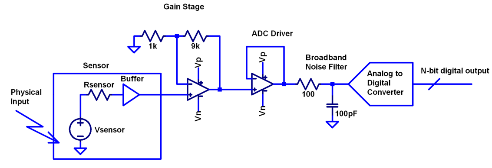

**Figure 1. Conceptual Sensor Signal Chain**

There are numerous other sensor limitations - mechanical, chemical,
optical, etc. each with their own theoretical limits. The following
analysis focuses on resistance and follows its effects through the
signal chain. Other effects can be added in later.

A Laboratory Noise Source
-------------------------

A noise generator, based on fundamental physics, is useful for both
understanding the principles of (and actual testing of) signal chains.
The circuit shown in Figure X uses a 1M resistor as a 127nV/rootHz (at
room temperature) noise source with “okay accuracy” and bandwidth. While
the accuracy is only “okay”, the advantage is that it is based on first
principles, so in a sense can act as an uncalibrated standard. The OP482
is an ultralow bias current amplifier with correspondingly low current
noise, and a voltage noise low enough that the noise due to a 1M input
impedance is dominant. Configured with a gain of 100, the output noise
is 12.7 µV/√Hz. So in a sense - this circuit is the “world’s worst
sensor”, with lots of sensor noise, but that does not actually sense
anything. (It could be used as a crude temperature sensor - but in this
application, any great departure from room temperature (~300 Kelvin)
should be corrected for.)

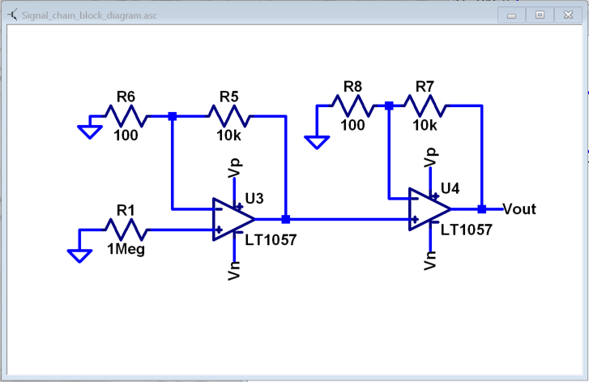

**Figure 2. Laboratory Noise Source**

The noise source was verified with an ADALM2000 USB instrument, using
the Scopy GUI’s spectrum analyzer, shown in Figure 3.

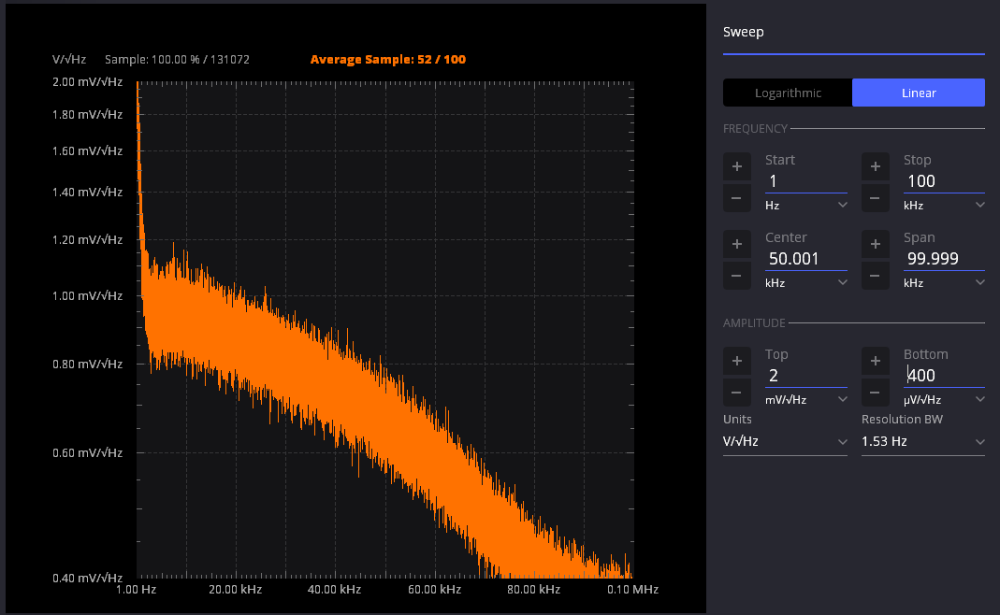

**Figure 3. Noise Generator Output
<<Placeholder - this is LTC6655 noise test jig>>**

Under the analyzer settings shown, the ADALM2000 noise floor is
<<40µV/√Hz, well below the 1.27 mV/√Hz>> of the noise source. The idea
that your test instrument must be better than the circuit parameter
being measured is intuitively obvious in this situation; what is less
obvious, or at least not thought about as much, is that this principle
should be followed all the way through the sensor signal chain.

While Scopy is useful for single, visual measurements, the functionality
can be replicated easily with the scipy.signal.periodogram function. Raw
data is collected from an ADALM2000 using the libm2k and Python
bindings, minimally processed to remove DC content (that would otherwise
“leak” into low frequency bins), and scaled to nV/√Hz. This method can
be applied to any data acquisition module, so long as the sample rate is
fixed and known, and data can be formatted as a vector of voltages.

.. code:: ipython3

    import libm2k
    import numpy as np
    import matplotlib.pyplot as plt
    from scipy.signal import periodogram, windows
    import statistics
    
    import time
    
    def open_context():
        ctx = libm2k.m2kOpen()
        ain = ctx.getAnalogIn()
        ps = ctx.getPowerSupply()
    
        return ctx, ain, ps
    
    def power_opamp(ps, value):
    
        ps.enableChannel(0, True)
        ps.enableChannel(1, True)
        ps.pushChannel(0, value)
        ps.pushChannel(1, -value)
    
    def read_ADC(ain, buffer_length, samplerate):
        ain.enableChannel(0, True)
        ain.enableChannel(1, True)
        ain.setSampleRate(samplerate)
        data = ain.getSamples(buffer_length)
        adc_noise = data[1]
        dc = np.convolve(adc_noise, (np.ones(64) / 64.0), mode='same')  # Calculate running DC average
        adc_noise = adc_noise - dc
        resistor_noise = data[0]
        dc = np.convolve(resistor_noise, (np.ones(64) / 64.0), mode='same')  # Calculate running DC average
        resistor_noise = resistor_noise - dc
    
        return adc_noise, resistor_noise
    
    def get_psd(data, samplerate):
        fs, psd = periodogram(data, samplerate, window="blackman", return_onesided=True)
    
        return fs, psd
    
    def main():
        samplerate = 100000000
        buffer_length = 4096
        supply_voltage = 5
    
        ctx, ain, ps = open_context()
        power_opamp(ps, supply_voltage)
        time.sleep(0.1)
        adc_noise, resistor_noise = read_ADC(ain, buffer_length, samplerate)
        adc_fs, adc_psd = get_psd(adc_noise, samplerate)
        resistor_fs, resistor_psd = get_psd(resistor_noise, samplerate)
        fig, axs = plt.subplots(2)
        fig.suptitle('Power Spectral Density')
        axs[0].semilogy(adc_fs, np.sqrt(adc_psd))
        axs[0].set_xlabel('frequency [Hz]')
        axs[0].set_ylabel('PSD [V/√ Hz]')
        axs[0].set_title("ADC Noise PSD")
        axs[1].semilogy(resistor_fs, np.sqrt(resistor_psd))
        axs[1].set_xlabel('frequency [Hz]')
        axs[1].set_ylabel('PSD [V/√ Hz]')
        axs[1].set_title("Resistor Noise PSD")
        plt.show()
        libm2k.contextClose(ctx)    

Thus we are now armed with a known noise source and a method to measure
said source, both of which can be used to validate signal chains.

Modeling Signal Chains in LTspice
---------------------------------

LTspice is a freely available, general-purpose analog circuit simulator
that can be applied to signal chain design. It can perform transient
analysis, frequency-domain analysis (AC sweep), and noise analysis, the
results of which can be exported and incorporated into mixed signal
models using Python.

Figure 4 shows a noise simulation of our noise generator. Results
<<(verify)>> agree with measurements above. (An op-amp with similar
properties to the OP482 was used for the simulation.)

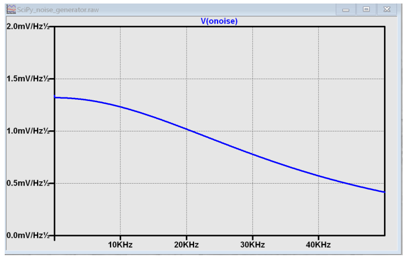

**Figure 4. LTspice model of Laboratory Noise Source**

The above circuit’s noise is fairly trivial to model, given that it is
constant for some bandwidth (in which a signal of interest would lie),
above which it rolls off with approximately a first order lowpass
response. Where this technique comes in handy is modeling non-flat noise
floors, either due to higher order analog filtering, or active elements
themselves. The classic example is the “noise mountain” that often
exists in autozero amplifiers such as the LTC2057:

.. image:: inputvoltage_noise_spectrum.png

**Figure 5. LTC2057 noise spectrum**

While that mountain looks daunting, it may not be a problem if it is
suppressed in either the analog or digital domains.

Importing LTspice noise data for frequency domain analysis in Python is
a matter of setting up the simulation command such that exact
frequencies in the analysis vector are simulated. In this case, the
noise simulation is set up for a simulation with a maximum frequency of
2.048MHz and resolution of 62.5Hz , corresponding to the first Nyquist
zone at a sample rate of 4.096Msps Figure 6 shows the simulation of the
LT2057 in a noninverting gain of 10, simulation output, and exported
data format.

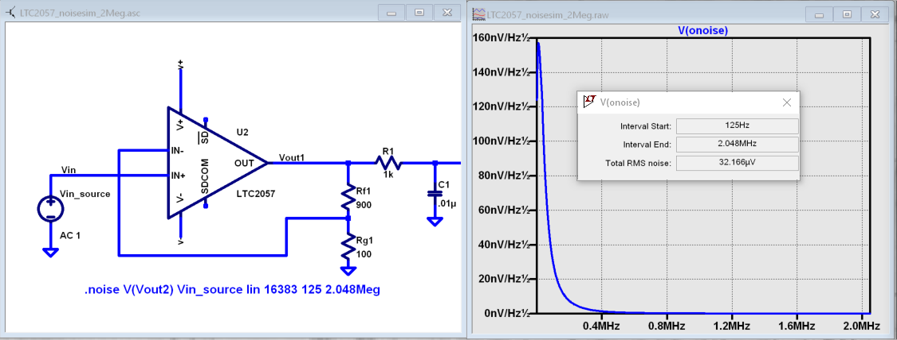

**Figure 6. LTC2057, G=+10 output noise simulation**

In order to determine the impact of a given band of noise on a signal
(signal to noise ratio) the noise is root-sum-square integrated across
the bandwidth of interest. In LTspice, plotted parameters can be
integrated by setting the plot limits, then control-clicking the
parameter label. The total noise over the entire 2.048MHz simulation is
32µVRMS. A function to implement this operation in Python is listed
below.

.. code:: ipython3

    # Function to integrate a power-spectral-density
    # The last element represents the total integrated noise
    def integrate_psd(psd, bw):
        integral_of_psd_squared = np.zeros(len(psd))
        integrated_psd = np.zeros(len(psd))
        integral_of_psd_squared[0] = psd[0]**2.0
     
        for i in range(1, len(psd)):
            integral_of_psd_squared[i] += integral_of_psd_squared[i-1] + psd[i-1] ** 2
            integrated_psd[i] += integral_of_psd_squared[i]**0.5
        integrated_psd *= bw**0.5
        return integrated_psd

Reading in the exported noise data and testing produces the following
output:

**``integ_2057_noise_only = integrate_psd(wide_ltc2057_psd, 125.0) integ_2057_noise_only[16383] Out[23]: 3.219517092537403e-05``**

showing close agreement to LTspice.

Analog to Digital Conversion
----------------------------

If the sensor’s signal will eventually reside on, or at least take a
trip through a computer, an analog to digital converter will be involved
somewhere along the way. There are numerous background references on
analog to digital converters available, and most readers will have a
sense that an analog to digital converter samples an input signal at
some point in time (or measures the average of a signal over some finite
time), and produces a numerical representation of that signal - most
often as a binary number with some value between zero and (2^N)-1 where
N is the number of bits in the output word. One important concept that
is often not covered in detail is that in many applications, the “number
of bits” can be safely ignored. Note a general principle of signal chain
design:

“The input noise of one stage should be somewhat lower than the output
noise of the preceding stage”

The number of ADC bits, and the full-scale input range, determine the
ADC’s quantization noise (refer to background references). While
quantization noise has different characteristics than thermal noise, it
is still just another noise source and is subject to the same principle.
Figure 7 shows a conceptual mixed signal chain in which a sensor with an
output range of 0 to 0.5V is interfaced to an ADC with an input range of
0 to 5V, and three digital output options:

-  Infinity-bits
-  16-bits
-  12-bits

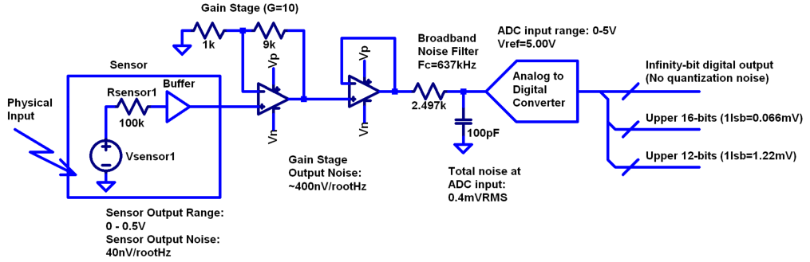

**Figure 7. Sensor Signal Chain with Digital Output**

Assume that the amplifiers are well-chosen such that their noise is
negligible. The only bandwidth limiting element is the 637kHz,
first-order filter, which has an effective noise bandwidth of 1MHz, such
that the total noise at the ADC input is about 0.4mV RMS. This is 1/3 of
a least-significant bit (LSB, or “code”) for a 12-bit converter, so for
a noiseless sensor input, the output code will either be steady, or flip
between adjacent codes. In contrast - the 16-bit output will be a
distribution of codes, with a standard deviation of about 6 codes.

Aside from quantization noise (which is unavoidable unless your ADC has
infinity bits), an ADC itself will have other noise sources that are
more akin to those of analog signal chains - thermal noise in amplifier
circuits, capacitor thermal noise in sample-and hold circuits, and
reference noise. Typically these noise sources tend to be flat or
“pink”, with a relatively Gaussian distribution. (This excludes “shaped”
noise common in sigma delta converters, but such noise is filtered
internally - if the converter is designed properly, you won’t see it.)

As with any signal chain, one noise source within an ADC often
dominates. Thus:

If a noiseless signal is applied to the input of an N-bit ADC, resulting
in either a single output code, or two adjacent output codes, then
quantization noise dominates. The Signal to Noise Ratio can be no
greater than (6.02 N + 1.76) dB. If a noiseless signal is applied to the
input of an N-bit ADC and the output is a gaussian distribution of
“many” output codes, then a thermal noise source dominates. The Signal
to Noise Ratio is no greater than 20\ *log(Vin(p-p)/(σ*\ √8)), where
Vin(p-p) is the full-scale input signal and σ is the standard deviation
of the output codes in units of voltage.

As an example of an ADC that is limited by quantization noise, consider
an AD672A, sampled at 10 MSPS and an AD871, sampled at 5MSPS. Both of
these are fairly quiet converters, as far as 12-bit converters go. The
fact that the vast majority of output codes fall into a single bin
indicates that quantization noise is greater than (or on par with) the
thermal noise.

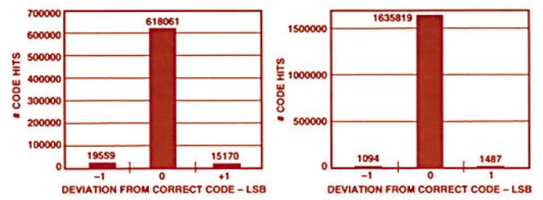

**Figure 8. a. AD672A, sampled at 10 MSPS. b. AD871, sampled at 5MSPS.**

In contrast, the figure below shows the grounded-input histogram of a
16-bit ADC. Nearly 20 codes are represented, and the standard deviation
is about 2.5 codes.

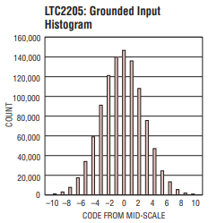

**Figure 9. LTC2205 zero-input histogram**

Very high resolution converters, such as the AD7124-8 that will be used
as an example shortly, rarely fall into the first category - thermal
noise dominates in all of the gain / bandwidth settings, and a shorted
input will always produce a fairly Gaussian distribution of output
codes.

Modeling and Measuring ADC noise
--------------------------------

Modeling the noise of a thermal-noise limited ADC’s is fairly
straightforward. The figure below shows two histograms for the 24-bit
AD7124-8, for two different internal amplifier settings.

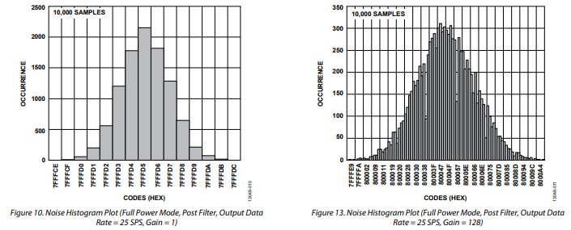

**Figure 10. AD7124 output noise**

If the noise is “well behaved” (Gaussian) and constant across the ADC’s
input span, the ADC’s time-domain noise can be modeled using Numpy’s
random.normal function:

.. code:: ipython3

    ### Simple ADC noise model
    
    import numpy as np
    
    def adc_noise_model():
        offset = 0.000 # DC offset of ADC, assumed to be perfect
        rmsnoise = 2.5 # Codes RMS
     
        noise = np.random.normal(loc=offset, scale=rmsnoise, size=1024)
        measured_noise = np.std(noise)
        print("RMS Noise from standard deviation: ", measured_noise)

Figure 11 shows a general setup for testing ADC noise and filter
response. (Exact connections are detailed in the references.) The
ADALM2000 from the previous spectrum analysis is repurposed as an
arbitrary signal generator. A Raspberry Pi 4 running a kernel with
AD7124 device driver support acts as a simple bridge between the AD7124
and a host computer. There are many ways to connect a host computer to
an ADC, but the advantage to this approach is that it uses the
industry-standard Industrial Input-Output (IIO) framework, which has a
well-established software API (including Python bindings). Application
code can run locally (on the Pi) or on a remote machine via network,
serial, or USB connection. Furthermore, the pyadi-iio abstraction layer
takes care of much of the boilerplate setup required for interfacing
with IIO devices, further simplifying the software interface.

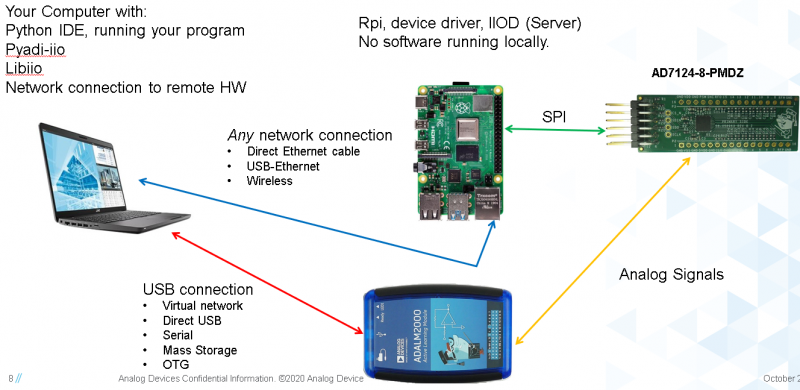

**Figure 11. ADC noise and filter measurement setup**

With communication to the AD7124-8 established, an extremely simple, yet
extremely useful test can be performed: measuring input noise directly.
Simply shorting the input to an ADC and looking at the resulting
distribution of ADC codes is a valuable (arguably essential) step in
validating a signal chain design. One subtlety about the configuration
as set by the rpi-ad7124-8-all-diff-cs0-int25 overlay is that the input
range is unipolar, so only positive values are valid. (It is still
differential, meaning, the measurement is taken BETWEEN adjacent
inputs.) This means that a converter with perfect offset will produce a
“half historgram” output, with half of the values equal to zero (because
that’s the lowest valid output value), and half of the values slightly
above zero. The solution is to apply a very small input voltage that
overcomes the offset, but does not add significant noise. Build the
circuit shown in Figure 12, which will impose a 1.25mV signal across the
input (far larger than the 15µV uncalibrated offset of the AD7124-8.)

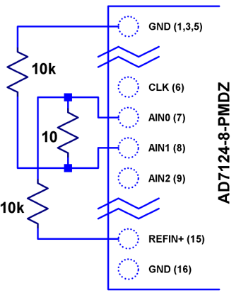

**Figure 12. Offset Circuit**

.. code:: ipython3

    #AD7124 Basic Capture
    import adi
     
    import matplotlib.pyplot as plt
    import numpy as np
    from scipy import signal
    import sys
     
    # Set up AD7124
     
    # Set a default ip address if none given as a command line argument
    # hardcoded_ip = "ip:192.168.0.235" # Example if you want to hardcode a different address
    hardcoded_ip = "ip:analog.local" # This works with ADI Kuiper Linux default config in most situations
    my_ip = sys.argv[1] if len(sys.argv) >= 2 else hardcoded_ip
    
    def setup_ad7124():
        # Establish connection to the AD7124
        my_ad7124 = adi.ad7124(uri=my_ip)
        # Set channel. Buffered receive only supports one channel
        ad_channel = 0
     
        sc = my_ad7124.scale_available
        my_ad7124.channel[ad_channel].scale = sc[-1]  # get highest range
        print(my_ad7124.channel[ad_channel].scale)
        scale = my_ad7124.channel[ad_channel].scale
        my_ad7124.rx_output_type = "SI"
     
        my_ad7124.sample_rate = 128  # sets sample rate for all channels
        my_ad7124.rx_enabled_channels = [ad_channel]
        my_ad7124.rx_buffer_size = 1024
        my_ad7124._ctx.set_timeout(100000)
        return my_ad7124
    
    def get_data(my_ad7124):
        n=1 # number of buffers
     
        for i in range(n):
            data = my_ad7124.rx()
            plt.plot(data)
            plt.title('AD7124, G=1, 128sps')
            plt.ylabel('Volts')
            plt.xlabel("Sample Number")
            plt.show()
            print(np.std(data))
     
        del my_ad7124 # Clean up

After running the `ad7124_simple_capture
script <https://github.com/mthoren-adi/precision_adc_toolbox/blob/master/ad7124_simple_capture.py>`__,
you should see an output plot similar to Figure 13.

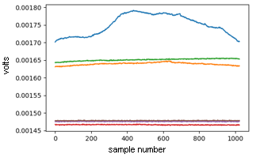

**Figure 13. Initial Warmup**

If you run the
`script <https://github.com/mthoren-adi/precision_adc_toolbox/blob/master/ad7124_simple_capture.py>`__
a couple of times right after turning on the power, you may see some
drift or “wandering”. This can be due to a number of factors - the
internal reference warming up, the external resistors warming up (and
hence drifting), or even parasitc thermmocouples, where slightly
dissimilar metals will produce a voltage in the presence of thermal
gradients. The lower traces in Figure 13 are after wrapping the AD7124
and resistor divider in antistatic bubble wrap, and waiting half an
hour. Finally, Figure 14 shows a single trace after warmup.

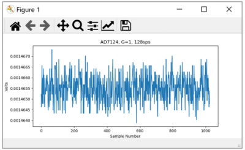

**Figure 14. Noise after warmup.**

Typical noise under these conditions is about 565nVRMS - on par with the
datasheet noise specification.

Expressing ADC Noise as a Density
---------------------------------

An ADC’s internal noise will necessarily appear somewhere between DC and
Fs/2. Ideally this noise is flat, or at least predictably shaped. In
fact, since the ADC’s total noise is spread out across a known
bandwidth, it can be converted to a noise density that can be directly
compared to other elements in the signal chain.

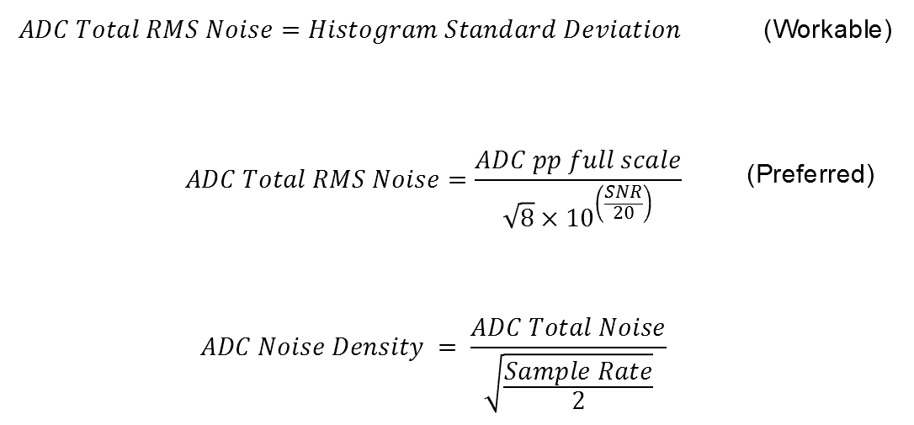

**Figure 15. ADC Total RMS Noise**

This is quite powerful - it allows the ADC’s noise to be directly
compared to the noise at the output of the last element in the analog
signal chain, which may be an ADC driver stage, a gain stage, or even
the sensor itself. Amplifiers will have a noise specification in nV/√Hz,
and well-specified sensors will have a noise density specified in terms
of the parameter being measured. For example, the ADXL1001 accelerometer
has a +/-100g input range, and an output noise of 30 µg/√Hz. The output
can be expressed in nV/√Hz by multiplying by the slope of the sensor -
20mV/g (or 20,000,000nV/g), for an output noise of 600nV/√Hz.

For the previous measurement - the total noise was 565nV at a data rate
of 128sps. So the noise density is approximately:

565nV/√64Hz = 70nV/√Hz

Going back to the principle that:

“the output referred noise of stage N should be a bit higher than the
input noise of stage N+1”

And treating the ADC as just another element in the signal chain, we can
restate this as that:

“The input noise of **the ADC** should be a bit lower than the output
noise of the preceding stage”

This is now an easy comparison, since the ADC input noise is now
expressed in the same way as your sensor, and amplifier, and the output
of your spectrum analyzer.

What this also implies is:

“Increase signal chain gain just to the point where the noise of the
last stage before the ADC is a bit higher than the ADC noise… then
**STOP**. Don’t bother increasing the signal chain gain any more -
you’re just amplifying noise, and decreasing the allowable range of
inputs”

Notice that contrary to many references, the guideline is NOT to “fill”
the ADC’s input range. There may be benefit to using more of an ADC’s
input range IF there are steps or discontinuities in the ADC’s transfer
function, but for “well behaved” ADCs (most sigma delta ADCs and modern,
high-resolution SAR ADCs), optimizing by noise is the preferred
approach.

Modeling ADC filters
--------------------

The ability to measure an ADC’s filter response is certainly a practical
tool to have at your disposal. However, in order to fully simulate
applications, a model of the filter is needed. This isn’t explicitly
provided for the AD7124-8, but a workable model can be reverse
engineered from the information provided in the datasheet.

Note that what follows is only a model of the AD7124-8 filters, it is
not a bit-accurate representation. Refer to the AD7124-8 datasheet for
all guaranteed parameters.

Figures 16 and 17 show the AD7124-8’s 10Hz and 50Hz notch filters.
Various combinations of Higher order SINC3 and SINC4 filters are also
available.

.. image:: ad7124_filter_10.png

**Figure 16. AD7124-8 10Hz notch filter**

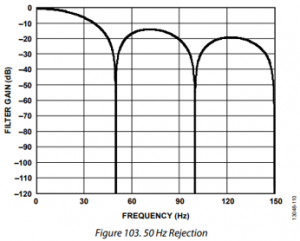

**Figure 17. AD7124 50Hz notch filter**

An Analog Averaging Circuit
~~~~~~~~~~~~~~~~~~~~~~~~~~~

Before digging any deeper into the AD7124 digital filters, let’s take a
step back and look at a circuit that’s still ubiquitous (in various
forms) in high-performance benchtop meters: the dual-slope ADC, shown in
Figure 18. Without going too deep into the details, a dual slope

converter observes and averages an input voltage for a fixed time
period, where the input voltage controls the slope of an integrator’s
output. The integrator is then switched to a known reference voltage of
opposite sign, causing the integrator to ramp back to its starting
voltage. If you ARE interested in digging deeper into the operation of a
dual-slope converter, see the dual-slope section of the Analog to
Digital Conversion Active Learning Activity

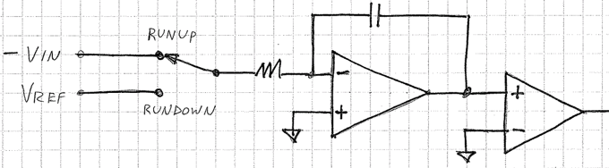

**Figure 18. Dual-slope converter schematic**

The ratio of the de-integration (“rundown”) time and integration
(“runup”) time is then equal to the ratio of the input voltage to the
reference voltage, which can then be scaled and displayed.

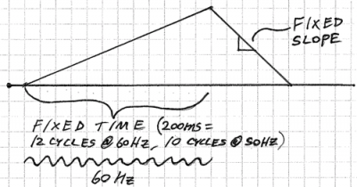

**Figure 19. Dual Slope Operation**

This results in a sin(x)/x (SINC1) lowpass filter response as shown in
Figure 20.

.. image:: sinc1_time_and_frequency.png

**Figure 20. SINC1 Filter, Impulse Response and Frequency Response**

The dual-slope circuit continuously samples the input signal, so it is
an “analog SINC1 filter”. But a similar idea in the discrete-time domain
is that of a “running average” often heard applied to economic data.
Figure 21 shows the price of Frozen Concentrated Orange Juice (FCOJ) for
a few months. For each new data point, average it with the previous 11
month’s values, and produce a new “filtered” data point. Notice that any
yearly, bi-yearly, quarterly, etc. fluctuations will be “nulled out” and
will not appear in the output data set. This is a digital (or
discrete-time) SINC1 filter, similar in concept to those in a
sigma-delta ADC. Such a filter can be modeled with the numpy ones
function, and data can be convolved directly with the filter.

.. image:: 12_month_running_average.png

**Figure 21. FCOJ price and filtering operations**

Next, let’s see if we can reverse-engineer one of the AD7124’s internal
filters. And to keep it interesting we’ll choose one with a strange
frequency response, like the simultaneous 50Hz/60Hz rejection filter
shown in Figure 22.

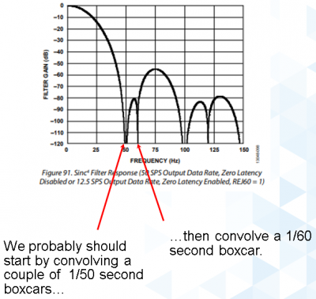

**Figure 22. AD7124-8 50/60Hz rejection filter**

Higher order SINC filters can be generated by convolving SINC1 filters.
For example, convolving two SINC1 filters (with a rectangular impulse
response in time) will result in a SINC2 response, with a triangular
impulse response. Load
`ad7124_filters.py <https://github.com/mthoren-adi/precision_adc_toolbox/blob/master/ad7124_filters.py>`__
into your Python IDE, and before running it take a look through the
code. In particular, the following snipped derives a SINC3 filter with a
null at 50Hz:

.. code:: ipython3

    ### AD7124 FILTERS
    f0 = 19200
    # Calculate SINC1 oversample ratios for 50, 60Hz
    osr50 = int(f0/50) # 384
    osr60 = int(f0/60) # 320
     
    # Create "boxcar" SINC1 filters
    sinc1_50 = np.ones(osr50)
    sinc1_60 = np.ones(osr60)
     
    # Calculate higher order filters
    sinc2_50 = np.convolve(sinc1_50, sinc1_50)
    sinc3_50 = np.convolve(sinc2_50, sinc1_50)
    sinc4_50 = np.convolve(sinc2_50, sinc2_50)
     
    # Here's the filter from datasheet Figure 91,
    # SINC4-ish filter with one three zeros at 50Hz, one at 60Hz.
    filt_50_60_rej = np.convolve(sinc3_50, sinc1_60)

Run the
`script <https://github.com/mthoren-adi/precision_adc_toolbox/blob/master/ad7124_filters.py>`__,
and observe the impulse (time domain) shapes of the filters, shown in
Figure 23.

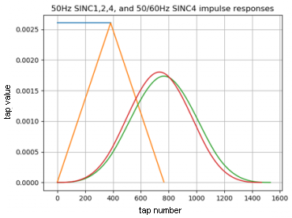

**Figure 23. Generated Filter Impulse Responses**

And finally, the frequency response can be calcualted using NumPy’s
freqz function, shown in Figure 24.

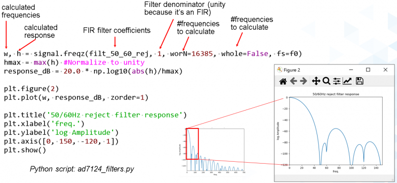

**Figure 24. Calculated Frequency Response Using Freqz**

Verifying ADC filter response
-----------------------------

The AD7124-8 is a sigma-delta ADC, in which a modulator produces a high
sample rate, but noisy (low resolution), representation of the analog
input. This noisy data is then filtered by an internal digital filter,
producing a lower rate, lower noise output. The type of filter varies
widely depending on the intended end application - an audio sigma-delta
ADC will have a filter that is flat out to 20kHz, with an output data
rate of at least 44ksps. The AD7124-8 is general-purpose, targeted at
precision applications. As such, the digital filter response and output
data rate are highly configurable. While the filter response is
well-defined in the datasheet, there are occasions when one may want to
measure the impact of the filter on a given signal. This experiment
measures the filter response by applying sinewaves to the ADC input and
analyzing the output. This method can be easily adapted to measuring
other waveforms - wavelets, simulated physical events, etc. Connect the
ADALM2000 to the EVAL-AD7124-8-PMDZ as shown in Figure 25. The 1k
resistor is to protect the AD7124-8 in case something goes wrong, as the
m2k output range is -5V to +5V, beyond the -0.3V to 3.6V absolute
maximum limits of the AD7124-8. DO NOT OMIT THIS RESISTOR.

.. image:: ad7124_m2k_circuit.png

**Figure 25. AD7124 - m2k Connections for Filter Response Measurement**

Run the `trace_ad7124_filter_with_m2k
script <https://github.com/mthoren-adi/precision_adc_toolbox/blob/master/trace_ad7124_filter_with_m2k.py>`__.
This will set the m2k’s waveform generator to generate a sinewave at
10Hz, capture 1024 data points, calculate the RMS value, then append the
result to a list. It will then step through frequencies up to 250Hz,
then plot the result as shown in Figure 25.

.. code:: ipython3

    freqs = np.linspace(1, 20, 10, endpoint=True)
    for freq in freqs:
        print("testing ", freq, " Hz")
        # send_sinewave(my_siggen, freq) function that pushes buffer on m2k's DAC
        time.sleep(5.0)
        data = capture_data(my_ad7124)
        response.append(np.std(data))  # Take RMS value of captured data
        if plt_time_domain:
            plt.plot(data)
            plt.show()
        capture_data(my_ad7124)  # Experiment - do we need to flush?? Was seeing some weird artifacts.
     
    print("\n Response \n")
    print(response)
     
    response_dB = 20.0 * np.log10(response/np.sqrt(2))
    print("\n Response [dB] \n")
    print(response_dB)
    plt.figure(2)
    plt.plot(freqs, response_dB)
    plt.title('AD7124 filter response')
    plt.ylabel('attenuation')
    plt.xlabel("frequency")
    plt.show()

The
`script <https://github.com/mthoren-adi/precision_adc_toolbox/blob/master/trace_ad7124_filter_with_m2k.py>`__
will set the m2k’s waveform generator to generate a sinewave at 10Hz,
capture 1024 data points, calculate the RMS value, then append the
result to a list. It will then step through frequencies up to 250Hz,
then plot the result as shown in Figure 26.

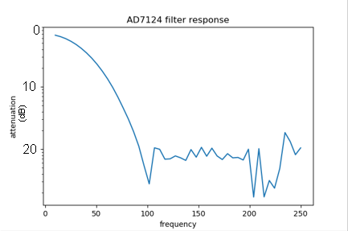

**Figure 26. AD7124 Measured Filter Response, 128sps**

So while it’s difficult to measure high attenuation values without quite
a bit more care, the response of the first couple of major “lobes” is
apparent. At this point, you’re all set up to send your own waveforms to
the AD7124 and see how it responds, just replace the sinewave data that
is pushed to the m2k with your own data.

Generating Test Noise
---------------------

Expanding on the functionality of the purely analog noise generator
above, it is very useful to be able to produce not only flat, but
arbitrary noise profiles - flat “bands”, 1/f corners, “noise mountains”
emulating peaking in some amplifiers. The code below starts with a
desired noise spectral density (which can be generated manually, or
taken from an LTspice simulation), the sample rate of the time series,
and produces a time series of voltage values that can be sent to a DAC.

.. code:: ipython3

    # Generate time series from half-spectrum. DC in first element.
    # Output length is 2x input length
    def time_points_from_freq(freq, fs=1, density=False): #DC at element zero,
        N=len(freq)
        randomphase_pos = np.ones(N-1, dtype=np.complex)*np.exp(1j*np.random.uniform(0.0, 2.0*np.pi, N-1))
        randomphase_neg = np.flip(np.conjugate(randomphase_pos))
        randomphase_full = np.concatenate(([1],randomphase_pos,[1], randomphase_neg))
        r_spectrum_full = np.concatenate((freq, np.roll(np.flip(freq), 1)))
        r_spectrum_randomphase = r_spectrum_full * randomphase_full
        r_time_full = np.fft.ifft(r_spectrum_randomphase)
    #    print("RMS imaginary component: ", np.std(np.imag(r_time_full)), " Should be close to nothing")
        if (density == True):
            r_time_full *= N*np.sqrt(fs/(N)) #Note that this N is "predivided" by 2
        return(np.real(r_time_full))

This function can be verified by controlling one ADALM2000 through a
libm2k script, and verifying the noise profile with a second ADALM2000
and the spectrum analyzer in the Scopy GUI. Figure 27 below shows four
bands of 1mV/√Hz noise being generated by one ADALM2000. The input
vector is 8192 points long at a sample rate of 75ksps, for a bandwidth
of 9.1Hz per point. Each “band” is 512 points, or 4687Hz wide.

The rolloff above ~20kHz is the SINC rolloff of the DAC. If the DAC is
capable of a higher sample rate, the time series data can be upsampled
and filtered by an interpolating filter.5 (maybe include script instead
of screen shot ??? )

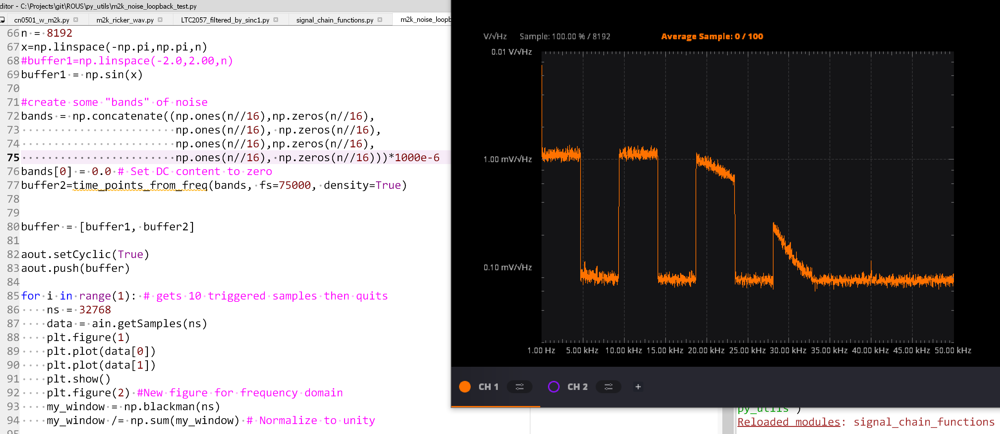

**Figure 27. Verifying arbitrary noise generator.**

This noise generator can be used in conjunction with the pure analog
generator for verifying the rejection properties of a signal chain.

Modeling and verifying ADC Noise Bandwidth
------------------------------------------

External noise sources and spurious tones above Fs/2 will fold back
(alias) into the DC-Fs/2 region - and a converter may be sensitive to
noise far beyond Fs/2 - the LTC2205 mentioned above has a sample rate of
65Msps, but an input bandwidth of 700MHz! While performance may not be
the best at such high frequencies, this converter will happily digitize
21 Nyquist zones of noise and fold them back on top of your signal. This
illustrates the importance of antialias filters for wideband ADCs. But
converters for precision applications, which are typically sigma-delta
(like the AD7124-8) or oversamping SAR architectures, in which the input
bandwidth is limited by design.

It is often useful to think of the “equivalent noise bandwidth” of a
filter, including an ADC’s built-in filter. The ENBW is the bandwidth of
a flat passband “brick wall” filter that lets through the same amount of
noise as the non-flat filter. A common example is the ENBW of a
first-order R-C filter, which is:

ENBW = fc*pi/2

where:

fc is the cutoff frequency of the filter. If broadband noise, from “DC
to daylight”, is applied to the inputs of both a 1KHz, first-order
lowpass filter and 1.57kHz brickwall lowpass filter, the total noise
power at the outputs will be the same.

The arb_enbw function below accepts a filter magnitude response, and
returns the effective noise bandwidth. A single-pole filter’s magnitude
response is calculated, and used to verify the ENBW = fc*pi/2
relationship.

.. code:: ipython3

    # Equivalent noise bandwidth of an arbitrary filter, given
    # frequency response magnitude and bandwidth per point
    def arb_enbw(fresp, bw):
        integral_of_fresp_sqared = np.zeros(len(fresp))
        integral_of_fresp_sqared[0] = fresp[0]**2.0
        for i in range(1, len(fresp)):
            integral_of_fresp_sqared[i] += integral_of_fresp_sqared[i-1] + fresp[i-1] ** 2
        return integral_of_fresp_sqared[len(integral_of_fresp_sqared)-1]*bw
     
    fmax = 200 #Hz
    numpoints = 65536
    fc = 1 #Hz
    bw_per_point = fmax/numpoints
    first_order_response = np.ndarray(numpoints, dtype = float)
    for i in range(numpoints):
        first_order_response[i] = 1.0 / (1.0 + (i*bw_per_point)**2.0)**0.5 # Magnitude = 1/SQRT(1 + (f/fc)^2)
     
    fo_enbw = arb_enbw(first_order_response, bw_per_point)
     
    predicted_ENBW = (fc*np.pi/2)
    actual_ENBW = fo_enbw

Sometimes it’s also instructive to look at not only the total noise, but
how the noise increases as the bandwidth is increased from zero to the
frequency of interest. Below is a function that returns the integral of
a noise spectrum, where the last element is the total noise.

.. code:: ipython3

    # Function to integrate a power-spectral-density
    def integrate_psd(psd, bw):
        integral_of_psd_squared = np.zeros(len(psd))
        integrated_psd = np.zeros(len(psd))
        integral_of_psd_squared[0] = psd[0]**2.0
     
        for i in range(1, len(psd)):
            integral_of_psd_squared[i] += integral_of_psd_squared[i-1] + psd[i-1] ** 2
            integrated_psd[i] += integral_of_psd_squared[i]**0.5
        integrated_psd *= bw**0.5
        return integrated_psd
     
    fo_psd = integrate_psd(first_order_response, bw_per_point)
    predicted_total_noise = (fc*np.pi/2) ** 0.5  # Predicted total noise is sqrt(pi/2)
    actual_total_noise = fo_psd[numpoints-1]

This function can be used to calculate the ENBW of an arbitrary filter
response, including the ADC’s internal filters. The cell below
calculates the filter taps and frequency response of the AD7124 SINC4
filter, 128sps sample rate.

.. code:: ipython3

    f0 = 19200
    # Calculate SINC1 oversample ratio for 128sps
    osr = int(f0/128) # 150
     
    # Create "boxcar" SINC1 filter
    sinc1 = np.ones(osr)
     
    # Calculate higher order filters
    sinc2 = np.convolve(sinc1, sinc1)
    sinc3 = np.convolve(sinc2, sinc1)
    sinc4 = np.convolve(sinc2, sinc2)
     
    w, sinc4_resp = signal.freqz(sinc4, 1, worN=8192, whole=False, fs=f0)
    sinc4_enbw_arb = arb_enbw(np.abs(sinc4_resp), w[1])
    sinc4_enbw_from_taps = fir_enbw_from_taps(sinc4)
    print("SINC4 enbw from taps: ", sinc4_enbw_from_taps)
    print("SINC4 enbw integrating response: ", sinc4_enbw_arb)

The result is that the ENBW of the SINC4, 128sps filter is about 31Hz.
Setting the test noise generator to generate a band of 1000µV/√Hz should
result in a total noise of about 5.69mVRMS. Run the following cell to
take the measurement.

.. code:: ipython3

    # Equivalent noise bandwidth of an arbitrary filter, given
    # frequency response magnitude and bandwidth per point
    def arb_enbw(fresp, bw):
        integral_of_fresp_sqared = np.zeros(len(fresp))
        integral_of_fresp_sqared[0] = fresp[0]**2.0
        for i in range(1, len(fresp)):
            integral_of_fresp_sqared[i] += integral_of_fresp_sqared[i-1] + fresp[i-1] ** 2
        return integral_of_fresp_sqared[len(integral_of_fresp_sqared)-1]*bw
     
     
    f0 = 19200
    # Calculate SINC1 oversample ratios for 50, 60Hz
    osr = int(f0/128) # 150
     
    # Create "boxcar" SINC1 filters
    sinc1 = np.ones(osr)
     
    # Calculate higher order filters
    sinc2 = np.convolve(sinc1, sinc1)
    sinc3 = np.convolve(sinc2, sinc1)
    sinc4 = np.convolve(sinc2, sinc2)
     
    w, sinc4_resp = signal.freqz(sinc4, 1, worN=8192, whole=False, fs=f0)
    sinc4_enbw_arb = arb_enbw(np.abs(sinc4_resp), w[1])
    sinc4_enbw_from_taps = fir_enbw_from_taps(sinc4)
    print("SINC4 enbw from taps: ", sinc4_enbw_from_taps)
    print("SINC4 enbw integrating response: ", sinc4_enbw_arb)

Measured results are approximately 4.5mVRMS total noise. The
oscilloscope capture of the ADC input signal is plotted next to the ADC
output data below. Note the measured peak-to-peak noise of 426mV, while
the ADC peak-to-peak noise is about 26mV. While such a high noise level
is (hopefully) unrealistic in an actual precision signal chain, this
exercise demonstrates that the the ADC’s internal filter can be counted
on to act as the primary bandwidth limiting, and hence noise reducing,
element in a signal chain.

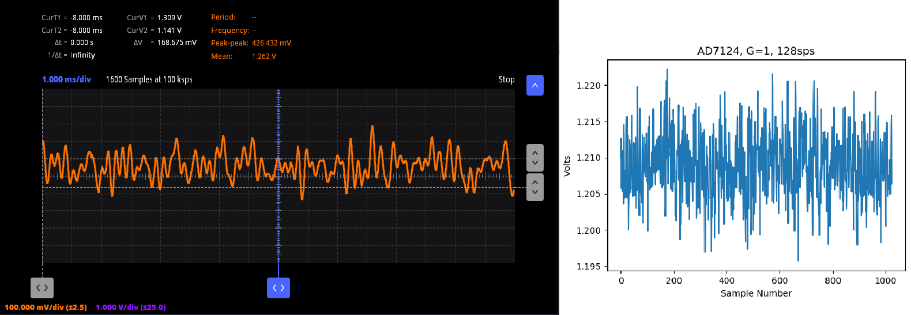

**Figure 28. Blasting the AD7124 with 1mV/√Hz**

Conclusion
----------

The techniques detailed in this paper are, individually, nothing new.
But the simultaneous existence of:

-  A large body of historical literature that over-emphasizes the
   importance of quantization noise and “getting all the bits you paid
   for”
-  Modern, thermal noise limited ADCs that have “more than enough bits”
   to push quantization noise below thermal noise.
-  Machine learning and artificial intelligence-based algorithms that
   allow circuit designers to under-emphasize sensor and signal chain
   performance

make it worthwhile to collect a few fundamental, easy to implement, and
low-cost techniques to enable signal chain modeling and verification
such that if you are seeing “garbage out”, you can at least rule out
“garbage in” as the cause.

Acknowledgements
----------------

Jesper Steensgaard - enabled/forced the paradigm shift in thinking about
signal chain design, starting with LTC2378-20.

Travis Collins - creator of Pyadi-iio (among many other things)

Adrian Suciu - Software Team Manager and contributor to libm2k

References
----------

::

   1.The Scientist & Engineer's Guide to Digital Signal Processing 
   2.Fredric Harris, "On the use of Windows..." http://web.mit.edu/xiphmont/Public/windows.pdf
   3.Derivation of SNR=f(bits) https://www.analog.com/media/en/training-seminars/tutorials/MT-229.pdf
   4.Taking the Mystery out of the Infamous Formula, "SNR = 6.02N + 1.76dB,"  https://www.analog.com/media/en/training-seminars/tutorials/MT-001.pdf
   5.Oversampling Interpolating DACs https://www.analog.com/media/en/training-seminars/tutorials/MT-017.pdf 
   6.Using Histogram Techniques to Measure ADC Noise https://www.analog.com/en/analog-dialogue/articles/histogram-techniques-measure-adc-noise.html 

