:author: Mark Thoren
:email: mark.thoren@analog.com
:institution: Analog Devices, Inc.

:author: Cristina Suteu
:email: cristina.suteu@analog.com
:institution: Analog Devices, Inc.
:corresponding:

----------------------------------------------------------------------------------------------------
Using Python for Analysis and Verification of Mixed-mode Signal Chains
----------------------------------------------------------------------------------------------------

.. class:: abstract

Any application involving sensitive measurements of the physical world starts with accurate, precise, and low-noise signal chain. Modern, highly integrated data acquisition devices can often be directly connected to sensor outputs, performing analog signal conditioning, digitization, and digital filtering on a single silicon device, greatly simplifying system electronics. However, a complete understanding of the signal chain's noise sources and noise limiting filters is still required to extract maximum performance from and debug these modern devices.

Introduction
------------

Mixed-mode signal chains are everywhere. Simply put, any system that transforms a real-world signal to an electrical representation, which is then digitized can be classified as a mixed-mode signal chain. At every point along the chain the signal is degraded in various ways that can usually be characterized either as some form of distortion or additive noise. Once in the digital domain, the processing of the digitized data is not perfect either, but at least it is, for all practical purposes, immune to many of the offenders that affect analog signals - component tolerances, temperature drift, interference from adjacent signals or supply voltage variations.

As the industry continues to push the physical limits, one thing that can be stated with certainty is this: there is always room for improvement in analog and mixed signal components for instrumentation. If an Analog to Digital Converter (ADC) or a Digital to Analog Converter (DAC) appears on the market that advances the state of the art in speed, noise, power, accuracy, or price, industry will happily apply it to existing problems, then ask for more improvement. However, in order to achieve the best acquisition system for your application, it is fundamental to be aware of the components' limitations and choose these accordingly. 

This tutorial is in extension of Converter Connectivity Tutorial [1]_ and associated code and simulation files [2]_ . A representative signal chain will be analyzed and tested, focusing on noise. Individual signal chain elements will first be modelled with the help of Python / SciPy [3]_  and LTspice [4]_ , then verified using Python to drive low-cost instrumentation and evaluation boards via the Linux Industrial Input Output (IIO) framework. While primarily for the education space, these instruments have adequate performance for many industrial applications. Furthermore, these techniques can easily be adapted to other bench-top instruments.

A Generic Mixed Signal Chain
----------------------------

Figure :ref:`mixmode` shows a generic signal chain typical of a precision instrumentation application, with a physical input and digital output. 

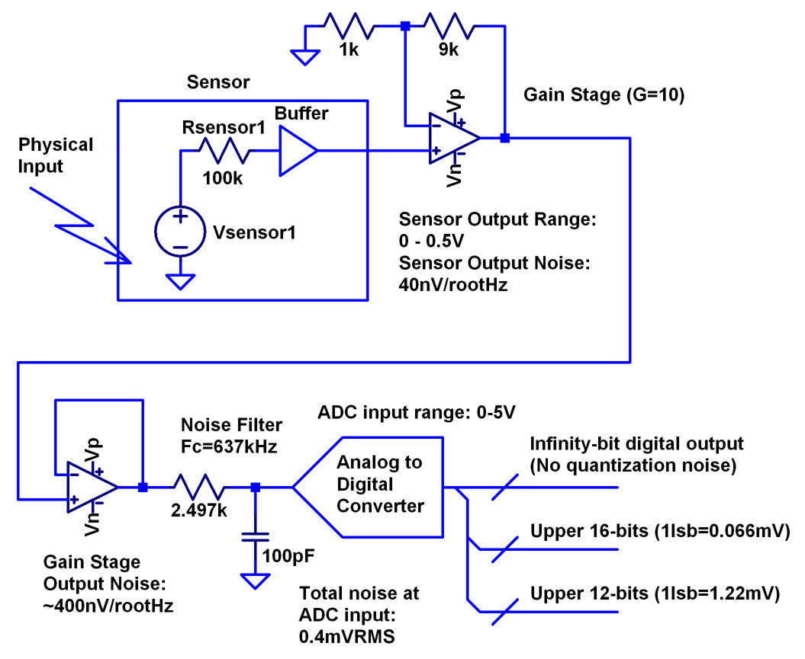

   In a mixed-mode signal chain, some physical phenomenon such as temperature, light intensity, pH, force, or torque is converted to an electrical parameter (resistance, current, or directly to voltage). This signal is then amplified, low-pass filtered, and digitized by an ADC, which may include internal digital filtering.
   :label:`mixmode`

There are numerous background references on analog to digital converters available [5]_ , and most readers will have a sense that an analog to digital converter samples an input signal at some point in time (or measures the average of a signal over some observation time), and produces a numerical representation of that signal - most often as a binary number with some value between zero and :math:`2^N - 1` where math:`N` is the number of bits in the output word.

ADC Noise Sources
---------------------------------------------------------

While there are several noise sources in Figure :ref:`mixmode`, one that is often either ignored, or over-emphasized, is the number of bits in the ADC's digital output. Historically, an ADC's "number of bits" was considered the ultimate figure of merit, where a 16-bit converter was 4 times better than a 14-bit converter [6]_ . But in the case of modern, high-resolution converters, the "number of bits" can be safely ignored. Note a general principle of signal chain design:

"The input noise of one stage should be somewhat lower than the output noise of the preceding stage"

As with any signal chain, one noise source within an ADC often dominates. Thus, if a noiseless signal is applied to an N-bit ADC:

-  results in either a single output code, or two adjacent output codes, then **quantization noise dominates**. The Signal to Noise Ratio can be no greater than (6.02 N + 1.76) dB. [7]_ 
-  results in a gaussian distribution of "many" output codes, then a **thermal noise source dominates**. The Signal to Noise Ratio is no greater than: 

   :math:`20\log(V_{in}(p-p)/(\sigma/\sqrt{8}))`, where:

   :math:`V_{in}(p-p)` is the full-scale input signal

   :math:`\sigma` is the standard deviation of the output codes in units of voltage.

Very high resolution converters, such as the AD7124-8 that will be used as an example shortly, are rarely limited by quantization noise; thermal noise dominates in all of the gain / bandwidth settings, and a shorted input will always produce a fairly Gaussian distribution of output codes. Figure :ref:`ad7124hist` , from Ref. [8]_  shows the grounded-input histogram of the AD712482, 24-bit sigma-delta ADC, with the internal Programmable Gain Amplifier (PGA) set to 1 and 128, respectively.

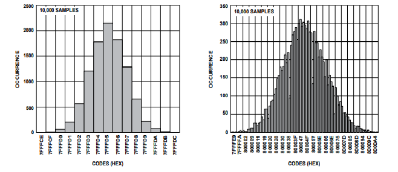

   AD7124 output noise. At a PGA gain of 1 (left), 13 codes are represented, and the standard deviation is about 2.5 codes. While quantization is visible, thermal noise is more significant. At a PGA gain of 128 (right), 187 codes are represented, quantization noise is insignificant. Truncating one or two least-significant bits (doubling or quadrupling quantization noise) would not result in a loss of information. 
   :label:`ad7124hist`

Modeling and Measuring ADC noise
--------------------------------

Modeling the noise of a thermal-noise limited ADC’s is straightforward. If the noise is "well behaved" (Gaussian, as it is in Figure :ref:`ad7124hist`) and constant across the ADC’s input span, the ADC’s time-domain noise can be modelled using Numpy’s [9]_  :code:`random.normal` function , then verified by taking the standard deviation, as seen in the Model Gaussian Noise code block.

.. -----------------------------------------------------|
.. code-block:: python

    # Model Gaussian Noise
    # See AD7124 datasheet for noise levels per mode
    offset = 0.000
    rmsnoise = 0.42e-6  # AD7124 noise
    noise = np.random.normal(loc=offset, scale=rmsnoise,
                             size=1024)
    measured_noise = np.std(noise)
    print("Measured Noise: ", measured_noise)

Figure :ref:`hwsetup` shows the general setup for testing ADC noise and filter response [1]_  .

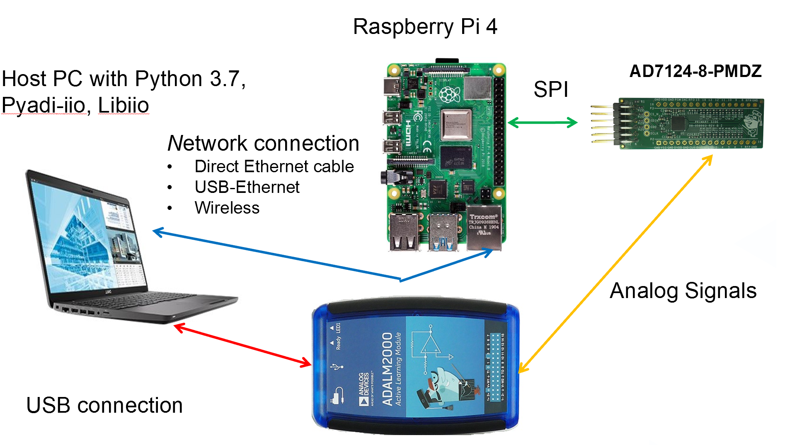

   ADC noise and filter measurement setup. The ADALM2000 (M2K) is a multifunction USB test instrument with two general-purpose analog inputs and two outputs, with sample rates of 100Msps and 150Msps, respectively. A Raspberry Pi 4 running a kernel with AD7124 device driver support acts as a simple bridge between the AD7124 and a host computer.
   :label:`hwsetup`

The AD7124 device driver falls under the industry-standard Industrial Input-Output (IIO) framework, which has a well-established software API (including Python bindings). Application code can run locally (on the Pi) or on a remote machine via network, serial, or USB connection. Furthermore, the pyadi-iio [10]_  abstraction layer takes care of much of the boilerplate setup required for interfacing with IIO devices, greatly simplifying the software interface. The AD7124-8 Basic Data Capture code block illustrates how to open a connection to the AD7124-8, configure it, capture a block of data, then close the connection.

.. -----------------------------------------------------|
.. code-block:: python

   # AD7124-8 Basic Data Capture

  import adi  # pyadi-iio library
  # Connect to AD7124-8 via Raspberry Pi
  my_ad7124 = adi.ad7124(uri="ip:analog.local")
  ad_channel = 0  # Set channel
  # Set PGA gain
  my_ad7124.channel[ad_channel].scale = 0.0002983
  my_ad7124.sample_rate = 128  # Set sample rate
  # Read a single "raw" value
  v0 = my_ad7124.channel[ad_channel].raw
  # Buffered data capture
  my_ad7124.rx_output_type = "SI"  # Report in volts
  # Only one buffered channel supported for now
  my_ad7124.rx_enabled_channels = [ad_channel]
  my_ad7124.rx_buffer_size = 1024
  my_ad7124._ctx.set_timeout(100000)  # Slow
  data = my_ad7124.rx()  # Fetch buffer of samples

  print("A single raw reading: ", v0)
  print("A few buffered readings: ", data[:16])
  del my_ad7124  # Clean up

With communication to the AD7124-8 established, an extremely simple, yet extremely useful test can be performed: measuring input noise directly. Simply shorting the input to an ADC and looking at the resulting distribution of ADC codes is a valuable step in characterizing a signal chain design. The AD7124 input is set to unipolar, so only positive values are valid; the test circuit shown in Figure :ref:`ad7124bias` ensures that the input is always positive.

.. figure:: media/ad7124_noise_circuit.png
   :scale: 40 %

   Bias Circuit for input noise measurement. A resistor divider imposes a 1.25mV signal across the AD7124-8's input, overcoming the 15µV maximum offset voltage.
   :label:`ad7124bias`

Figure :ref:`warmup` shows two, 1024-point measurements. The lower (blue) trace was taken immediately after initially applying power. 

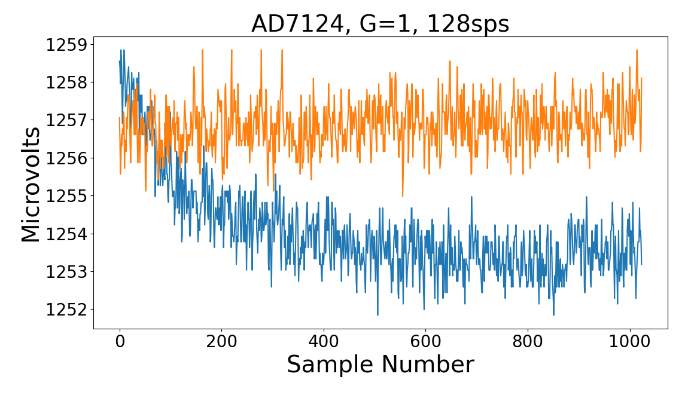

   AD7124-8 Data captures with 1.25mV input. Lower trace shows "wander" after initial power-up. Upper trace shows stable readings after a half-hour warmup time.
   :label:`warmup`

The "wandering" can be due to a number of factors - the internal reference warming up, the external resistors warming up (and hence drifting), or parasitic thermocouples, where slightly dissimilar metals will produce a voltage in the presence of thermal gradients. Measured noise after warmup is approximately 565nVRMS - on par with the datasheet noise specification.

Expressing ADC Noise as a Density
---------------------------------
The general principle of analog signal chain design (that the input noise of one stage should be somewhat lower than the output noise of the preceding stage) is an easy calculation if all elements include noise density specifications, as most well-specified sensors, and nearly all amplifiers do.

Unlike amplifiers and sensors, ADC datasheets typically do not include a noise density specification. Expressing the ADC's noise as a density allows it to be directly compared to the noise at the output of the last element in the analog signal chain, which may be an ADC driver stage, a gain stage, or the sensor itself.

An ADC’s internal noise will necessarily appear somewhere between DC and half the sample rate. Ideally this noise is flat, or at least predictably shaped. In fact, since the ADC’s total noise is spread out across a known bandwidth, it can be converted to a noise density that can be directly compared to other elements in the signal chain. Precision converters typically have total noise given directly, in volts RMS: :math:`e_{RMS} = \sigma` , where:

:math:`e_{RMS}` is the total RMS noise, calculated from the standard deviation of a grounded-input histogram of codes.

Higher speed converters that are tested and characterized with sinusoidal signals will typically have a signal to noise (SNR) specification. If provided, the total RMS noise can be calculated as:

:math:`e_{RMS} = \frac{ADCp-p}{\sqrt{8}*10^\frac{SNR}{20}}`

where:

ADCp-p is the peak-to-peak input range of the ADC

The equivalent noise density can then be calculated:

:math:`e_n = \frac{e_{RMS}}{\sqrt{\frac{fs}{2}}}`

where:

fs is the ADC sample rate in samples/second.

The total noise from Figure :ref:`warmup` after warmup was 565nV at a data rate of 128sps. The noise density is approximately:

.. math::

    565nV/\sqrt{64 Hz} = 70nV/\sqrt{Hz}

The ADC can now be directly included in the signal chain noise analysis, and leads to a guideline for optimizing the signal chain's gain:

Increase the gain just to the point where the noise density of the last stage before the ADC is a bit higher than that of the ADC, then stop. Don’t bother increasing the signal chain gain any more - you’re just amplifying noise, and decreasing the allowable range of inputs.

This runs counter to the conventional wisdom of "filling" the ADC’s input range. There may be benefit to using more of an ADC’s input range if there are steps or discontinuities in the ADC’s transfer function, but for "well behaved" ADCs (most sigma delta ADCs and modern, high-resolution Successive Approximation Register (SAR) ADCs), optimizing by noise is the preferred approach.

Measuring ADC filter response
-----------------------------

The AD7124-8 is a sigma-delta ADC, in which a modulator produces a high sample rate, but noisy (low resolution), representation of the analog input. This noisy data is then filtered by an internal digital filter, producing a lower rate, lower noise output. The type of filter varies from ADC to ADC, depending on the intended end application. The AD7124-8 is general-purpose, targeted at precision applications. As such, the digital filter response and output data rate are highly configurable. While the filter response is well-defined in the datasheet, there are occasions when one may want to measure the impact of the filter on a given signal. The AD7124-8 Filter Response code block measures the filter response by applying sinewaves to the ADC input and analyzing the output. This method can be easily adapted to measuring other waveforms - wavelets, simulated physical events. The ADALM2000 is connected to the AD7124-8 circuit as shown in Figure :ref:`ad7124m2k`. 

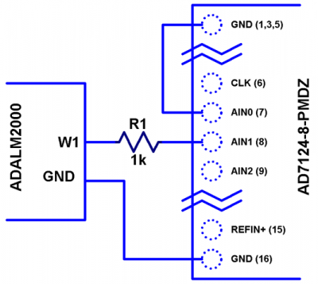

   AD7124 - m2k Connections for Filter Response Measurement. The 1k resistor protects the AD7124-8 if a malfunction occurs, as the m2k output range is -5V to +5V, beyond the -0.3V to 3.6V absolute maximum limits of the converter.
   :label:`ad7124m2k`

The AD7124-8 Filter Response code block will set the ADALM2000’s waveform generator to generate a sinewave at 10Hz, capture 1024 data points, calculate the RMS value, then append the result to a list. (The :code:`send_sinewave` and :code:`capture_data` are utility functions that send a sinewave to the ADALM2000 and receive a block of data from the AD7124, respectively [2]_ .) It will then step through frequencies up to 250Hz, then plot the result as shown in Figure :ref:`measresp`.

.. -----------------------------------------------------|
.. code-block:: python

  # AD7124-8 Filter Response
  resp = []
  freqs = np.linspace(1, 121, 100, endpoint=True)
  for freq in freqs:
      print("testing ", freq, " Hz")
      send_sinewave(my_siggen, freq)  # Set frequency
      time.sleep(5.0)                 # Let settle
      data = capture_data(my_ad7124)  # Grab data
      resp.append(np.std(data))  # Take RMS value
      if plt_time_domain:
          plt.plot(data)
          plt.show()
      capture_data(my_ad7124)  # Flush
  # Plot log magnitude of response.
  response_dB = 20.0 * np.log10(resp/0.5*np.sqrt(2))
  print("\n Response [dB] \n")
  print(response_dB)
  plt.figure(2)
  plt.plot(freqs, response_dB)
  plt.title('AD7124 filter response')
  plt.ylabel('attenuation')
  plt.xlabel("frequency")
  plt.show()

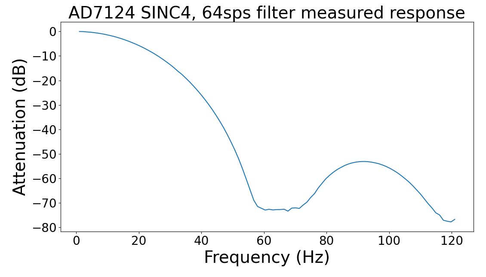

   AD7124 Measured Filter Response, 64sps SINC4 mode, showing the filter's passband, first lobe, and first two nulls.
   :label:`measresp`

While measuring high attenuation values requires a quieter and lower distortion signal generator, the response of the first few major "lobes" is apparent with this setup.

Modeling ADC filters
--------------------

The ability to measure an ADC’s filter response is a practical tool for bench verification. However, in order to fully simulate a signal chain, a model of the filter is needed. This isn’t explicitly provided for many converters (including the AD7124-8), but a workable model can be reverse engineered from the information provided in the datasheet.

Note that what follows is only a model of the AD7124-8 filters, it is not a bit-accurate representation. Refer to the AD7124-8 datasheet for all guaranteed parameters.

The AD7124's filters all have frequency responses that are combinations of various SINC functions (with a frequency response proportional to :math:`(sin{f}/f)^N` ) . These filters are fairly easy to construct, and to reverse-engineer when nulls are known.

Figure :ref:`10hznotch` from Ref. [8]_  shows the AD7124-8’s 10Hz notch filters. Various combinations of Higher order SINC3 and SINC4 filters are also available. 

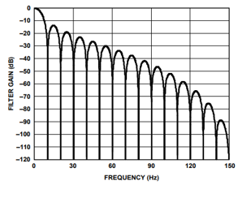

   AD7124-8 10Hz notch filter frequency response. Magnitude response is SINC1, Impulse response is simply an unweighted (rectangular) average of samples over a 100ms interval.
   :label:`10hznotch`

The simultaneous 50Hz/60Hz rejection filter shown in Figure :ref:`5060hzflt` , from Ref. [8]_ is a nontrivial example. This filter is intended to strongly reject noise from A.C. power lines, which is either 50Hz (as in Europe) or 60Hz (as in the United States).

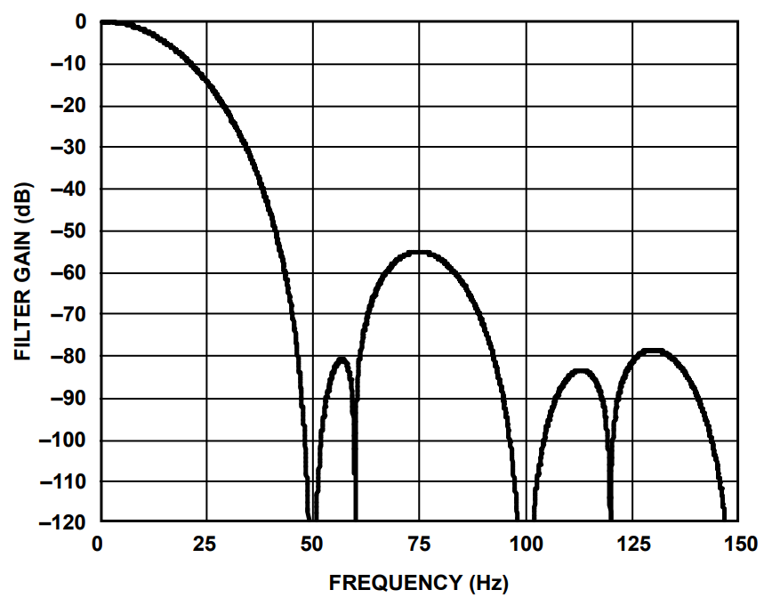

   AD7124-8 50/60Hz rejection filter response. Response is the combination of a 50Hz, SINC3 filter and a 60Hz, SINC1 filter.
   :label:`5060hzflt`

Higher order SINC filters can be generated by convolving SINC1 filters. For example, convolving two SINC1 filters (with a rectangular impulse response in time) will result in a triangular impulse response, and a corresponding SINC2 frequency response. The AD7124 Filters code block generates a SINC3 filter with a null at 50Hz, then adds a fourth filter with a null at 60Hz.

.. -----------------------------------------------------|
.. code-block:: python

    # AD7124 Filters
    f0 = 19200
    # Calculate SINC1 oversample ratios for 50, 60Hz
    osr50 = int(f0/50)  # 384
    osr60 = int(f0/60)  # 320

    # Create "boxcar" SINC1 filters
    sinc1_50 = np.ones(osr50)
    sinc1_60 = np.ones(osr60)

    # Calculate higher order filters
    sinc2_50 = np.convolve(sinc1_50, sinc1_50)
    sinc3_50 = np.convolve(sinc2_50, sinc1_50)
    sinc4_50 = np.convolve(sinc2_50, sinc2_50)

    # Here's the SINC4-ish filter from datasheet
    # Figure 91, with three zeros at 50Hz, one at 60Hz.
    filt_50_60_rej = np.convolve(sinc3_50, sinc1_60)

The resulting impulse (time domain) shapes of the filters are shown in Figure :ref:`fltimpluse`. Filter coefficient (tap) values are normalized for unity (0dB) gain at zero frequency.

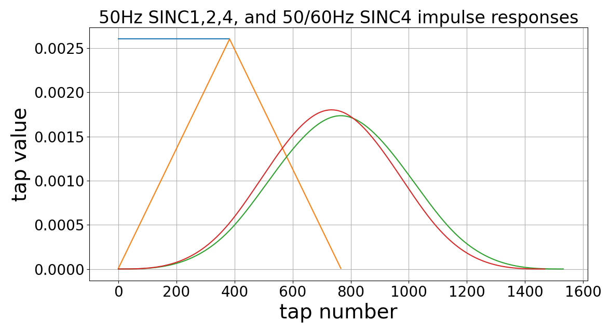

   Generated Filter Impulse Responses. Repeatedly convolving rectangular impulses produces triangular, then "Gaussian-like" impulse responses.
   :label:`fltimpluse`

And finally, the frequency response can be calculated using NumPy’s  freqz function, as seen in the AD7124 Frequency Response code block. The response is shown in Figure :ref:`fltresp`.

.. -----------------------------------------------------|
.. code-block:: python

    # AD7124 Frequency Response 

    f0 = 19200
    w, h = signal.freqz(filt_50_60_rej, 1, worN=16385,
                        whole = False, fs = f0)
    freqs = w * f0/(2.0*np.pi)
    hmax = abs(max(h))  # Normalize to unity
    response_dB = 20.0 * np.log10(abs(h)/hmax)

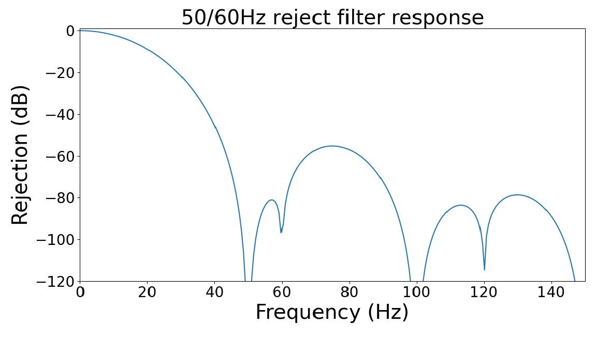

   Calculated 50/60Hz Rejection Filter Response. The composite response in the frequency domain is the product of the individual 50Hz and 60Hz filters.
   :label:`fltresp`

Resistance is Futile: A Fundamental Sensor Limitation
-----------------------------------------------------

All sensors, no matter how perfect, have some maximum input value (and a corresponding maximum output - which may be a voltage, current, resistance, or even dial position) and a finite noise floor - "wiggles" at the output that exist even if the input is perfectly still. At some point, a sensor with an electrical output will include an element with a finite resistance (or more generally, impedance) represented by Rsensor in Figure :ref:`genericsensor` This represents one fundamental noise limit that cannot be improved upon - this resistance will produce, at a minimum:

:math:`e_n(RMS) = \sqrt{4 * K * T * Rsensor * (F2-F1)}` Volts of noise,
where:

:math:`e_n(RMS)` is the total noise

K is Boltzmann’s constant (1.38e-23 J/K)

T is the resistor’s absolute temperature (Kelvin)

F2 and F1 are the upper and lower limits of the frequency band of
interest.

Normalizing the bandwidth to 1Hz expresses the noise density, in :math:`\frac{V}{\sqrt{Hz}}`.

A sensor’s datasheet may specify a low output impedance (often close to zero ohms), but this is likely a buffer stage - which eases interfacing to downstream circuits, but does not eliminate noise due to impedances earlier in the signal chain.

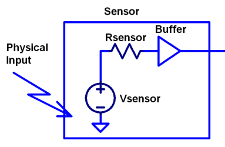

   Conceptual Sensor with Buffered Output. Noise is buffered along with the signal.
   :label:`genericsensor`

There are numerous other sensor limitations - mechanical, chemical, optical, each with their own theoretical limits and whose effects can be modelled and compensated for later. But noise is the one imperfection that cannot. 

A Laboratory Noise Source
-------------------------

A calibrated noise generator functions as a "world’s worst sensor", that emulates the noise of a sensor without actually sensing anything. Such a generator allows a signal chain's response to noise to be measured directly. The circuit shown in Figure :ref:`ananoisesrc` uses a 1M resistor as a 127nV/:math:`\sqrt{Hz}` (at room temperature) noise source with "okay accuracy" and bandwidth. While the accuracy is only "okay", this method has advantages:

-  It is based on first principles, so in a sense can act as an uncalibrated standard.
-  It is truly random, with no repeating patterns.

The OP482 is an ultralow bias current amplifier with correspondingly low current noise, and a voltage noise low enough that the noise due to a 1M input impedance is dominant. Configured with a gain of 2121, the output noise is 269 µV/:math:`\sqrt{Hz}`. 

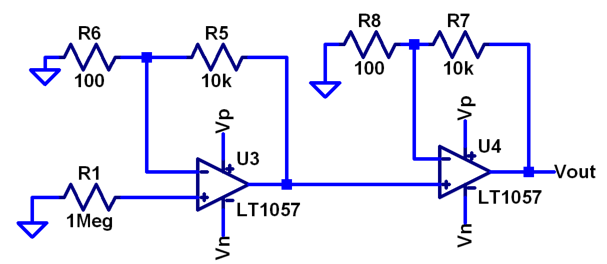

   Laboratory Noise Source. A 1M resistor serves as a noise generator, which is then amplified to a usable level by a low-noise operational amplifier.
   :label:`ananoisesrc`

The noise source was verified with an ADALM2000 USB instrument, using the Scopy [11]_  GUI’s spectrum analyzer, shown in Figure :ref:`ngoutput`.

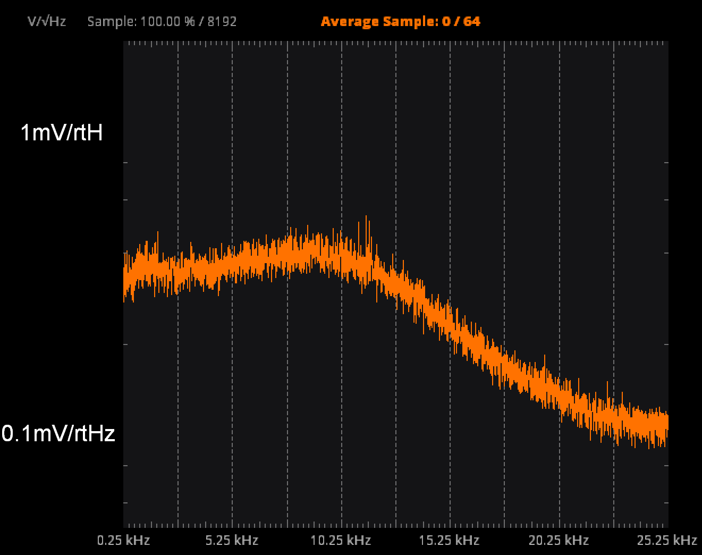

   Noise Generator Output, showing a usable noise bandwidth of approximately 10kHz.
   :label:`ngoutput`

Under the analyzer settings shown, the ADALM2000 noise floor is 40µV/:math:`\sqrt{Hz}`, well below the 269 µV/:math:`\sqrt{Hz}` of the noise source.

While Scopy is useful for single, visual measurements, the functionality can be replicated easily with the SciPy periodogram function. Raw data is collected from an ADALM2000 using the libm2k [12]_  and Python bindings, minimally processed to remove DC content (that would otherwise "leak" into low frequency bins), and scaled to nV/:math:`\sqrt{Hz}`. This method, shown in the Noise Source Measurement code block can be applied to any data acquisition module, so long as the sample rate is fixed and known, and data can be formatted as a vector of voltages.

.. -----------------------------------------------------|
.. code-block:: python

    # Noise Source Measurement
    navgs = 32  # Avg. 32 runs to smooth out data
    ns = 2**16
    vsd = np.zeros(ns//2+1)  # /2 for onesided
    for i in range(navgs):
      ch1 = np.asarray(data[0])  # Extract ch 1 data
      ch1 -= np.average(ch1)  # Remove DC
      fs, psd = periodogram(ch1, 1000000,
                            window="blackman",
                            return_onesided=True)
      vsd += np.sqrt(psd)
    vsd /= navgs

We are now armed with a known noise source and a method to measure said source, both of which can be used to validate signal chains.

Modeling Signal Chains in LTspice
---------------------------------

LTspice  is a freely available, general-purpose analog circuit simulator that can be applied to signal chain design. It can perform transient analysis, frequency-domain analysis (AC sweep), and noise analysis, the results of which can be exported and incorporated into mixed signal models using Python.

Figure :ref:`ngltspice` shows a noise simulation of the analog noise generator, with close agreement to experimental results. An op-amp with similar properties to the OP482 was used for the simulation.

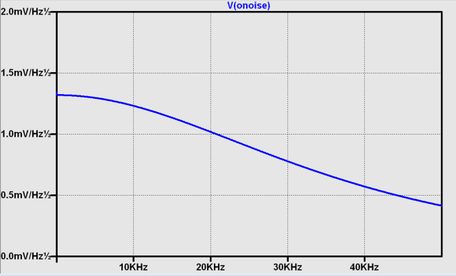

   LTspice simulation of Laboratory Noise Source, showing approximately the same usable bandwidth as the measured circuit.
   :label:`ngltspice`

Figure :ref:`ngltspice` circuit’s noise is fairly trivial to model, given that it is constant for some bandwidth (in which a signal of interest would lie), above which it rolls off with approximately a first order lowpass response. Where this technique comes in handy is modeling non-flat noise floors, either due to higher order analog filtering, or active elements themselves. The classic example is the "noise mountain" that often exists in autozero amplifiers such as the LTC2057, as seen in Figure :ref:`ltc2057nsd` , from Ref. [13]_ .

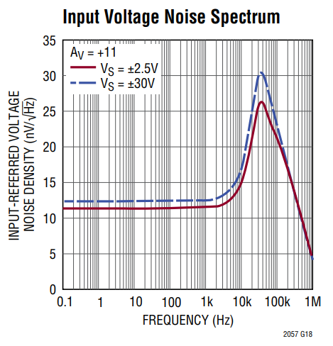

   LTC2057 noise spectrum. Noise density is flat at low frequencies, with a peak at half the internal oscillator's 100kHz frequency.
   :label:`ltc2057nsd`

Importing LTspice noise data for frequency domain analysis in Python is a matter of setting up the simulation command such that exact
frequencies in the analysis vector are simulated. In this case, the noise simulation is set up for a simulation with a maximum frequency of 2.048MHz and resolution of 62.5Hz , corresponding to the first Nyquist zone at a sample rate of 4.096 MSPS. Figure :ref:`ltc2057ltspicensd` shows the simulation of the LT2057 in a non-inverting gain of 10, simulation output, and exported data format.

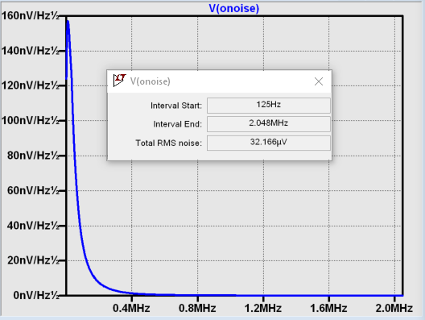

   LTC2057, G=+10 output noise simulation. LTspice provides simple tools for integrating noise, but results of any simulation can be exported and imported into Python for further analysis.
   :label:`ltc2057ltspicensd`

In order to determine the impact of a given band of noise on a signal (signal to noise ratio) the noise is root-sum-square integrated across the bandwidth of interest. In LTspice, plotted parameters can be integrated by setting the plot limits, then control-clicking the parameter label. The total noise over the entire 2.048MHz simulation is 32µVRMS. A function to implement this operation in Python is shown in the Integrate Power Spectral Density code block. 

.. -----------------------------------------------------|
.. code-block:: python

    def integrate_psd(psd, bw):
        int_psd_sqd = np.zeros(len(psd))
        integrated_psd = np.zeros(len(psd))
        int_psd_sqd[0] = psd[0]**2.0
        for i in range(1, len(psd)):
            int_psd_sqd[i] += int_psd_sqd[i-1]\
                + psd[i-1] ** 2
            integrated_psd[i] += int_psd_sqd[i]**0.5
        integrated_psd *= bw**0.5
        return integrated_psd

Reading in the exported noise data and passing to the integrate_psd function results in a total noise of 3.21951e-05, very close to LTspice's calculation.

Generating Test Noise
---------------------

Expanding on the functionality of the purely analog noise generator above, it is very useful to be able to produce not only flat, but arbitrary noise profiles - flat "bands" of noise, "pink noise", "noise mountains" emulating peaking in some amplifiers. The Generate Time-series From Half-spectrum code block starts with a desired noise spectral density (which can be generated manually, or taken from an LTspice simulation), the sample rate of the time series, and produces a time series of voltage values that can be sent to a DAC.

.. -----------------------------------------------------|
.. code-block:: python

  def time_points_from_freq(freq, fs=1, density=False):
      N = len(freq)
      rnd_ph_pos = (np.ones(N-1, dtype=np.complex)*
                    np.exp(1j*np.random.uniform
                           (0.0, 2.0*np.pi, N-1)))
      rnd_ph_neg = np.flip(np.conjugate(rnd_ph_pos))
      rnd_ph_full = np.concatenate(([1], rnd_ph_pos, [1],
                                    rnd_ph_neg))
      r_s_full = np.concatenate((freq, np.roll
                                 (np.flip(freq), 1)))
      r_spectrum_rnd_ph = r_s_full * rnd_ph_full
      r_time_full = np.fft.ifft(r_spectrum_rnd_ph)

      if (density is True):
          # Note that this N is "predivided" by 2
          r_time_full *= N*np.sqrt(fs/(N))
      return(np.real(r_time_full))

This function can be verified by controlling one ADALM2000 through a libm2k script, and verifying the noise profile with a second ADALM2000 and the spectrum analyzer in the Scopy GUI. The Push Noise Time-series to ADALM2000 code snippet generates four "bands" of 1mV/:math:`\sqrt{Hz}` noise on the ADALM2000 W2 output (with a sinewave on W1, for double-checking functionality.)

.. -----------------------------------------------------|
.. code-block:: python

    # Push Noise Time-series to ADALM2000
    n = 8192

    # create some "bands" of  1mV/rootHz noise
    bands = np.concatenate((np.ones(n//16),
                           np.zeros(n//16),
                           np.ones(n//16),
                           np.zeros(n//16),
                           np.ones(n//16),
                           np.zeros(n//16),
                           np.ones(n//16),
                           np.zeros(n//16)))*1000e-6
    bands[0] = 0.0  # Set DC content to zero
    buffer2 = time_points_from_freq(bands, fs=75000,
                                    density=True)
    buffer = [buffer1, buffer2]

    aout.setCyclic(True)
    aout.push(buffer)
	

Figure :ref:`m2k-noise-bands` shows four bands of 1mV/:math:`\sqrt{Hz}` noise being generated by one ADALM2000. The input vector is 8192 points long at a sample rate of 75ksps, for a bandwidth of 9.1Hz per point. Each "band" is 512 points, or 4687Hz wide.
The rolloff above ~20kHz is the SINC rolloff of the DAC. If the DAC is capable of a higher sample rate, the time series data can be upsampled and filtered by an interpolating filter. [14]_ 

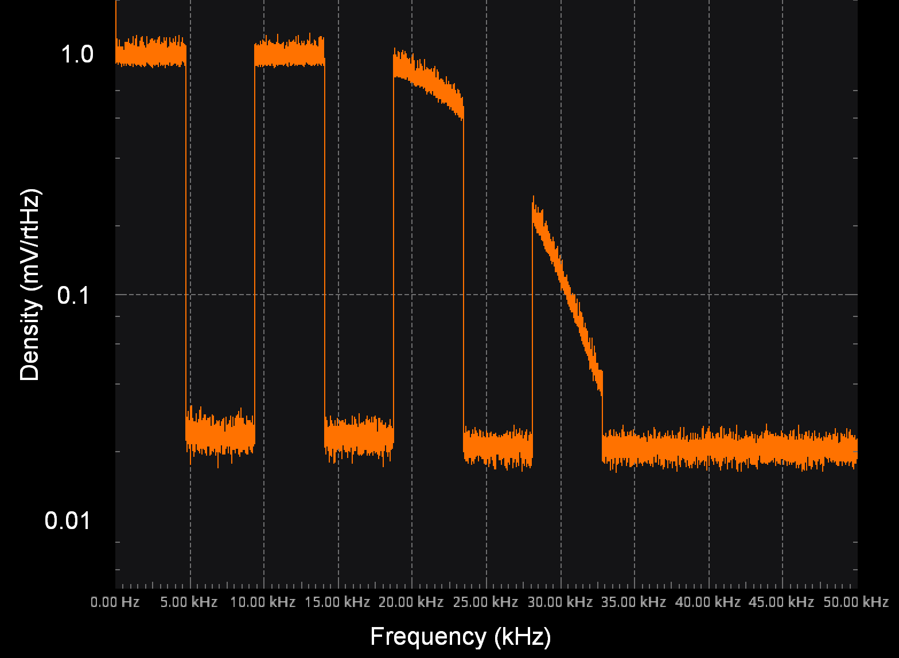

   Verifying arbitrary noise generator. Deep notches between noise bands expose the signal generator's noise floor, and show that an arbitrary noise profile can be accurately generated.
   :label:`m2k-noise-bands`

This noise generator can be used in conjunction with the pure analog
generator for verifying the rejection properties of a signal chain.

Modeling and verifying ADC Noise Bandwidth
------------------------------------------

External noise sources and spurious tones above Fs/2 will fold back (alias) into the DC-Fs/2 region - and a converter may be sensitive to noise far beyond Fs/2 - the AD872A mentioned above has a sample rate of 10Msps, but an input bandwidth of 35MHz. While performance may not be the best at such high frequencies, this converter will happily digitize 7 Nyquist zones of noise and fold them back on top of your signal. This illustrates the importance of antialias filters for wideband ADCs. But converters for precision applications, which are typically sigma-delta (like the AD7124-8) or oversampling SAR architectures, in which the input bandwidth is limited by design.

It is often useful to think of the "equivalent noise bandwidth" (ENBW) of a filter, including an ADC’s built-in filter. The ENBW is the bandwidth of a flat passband "brick wall" filter that lets through the same amount of noise as the non-flat filter. A common example is the ENBW of a first-order R-C filter, which is:

.. math::
    ENBW = fc*\pi/2

where:

fc is the cutoff frequency of the filter. If broadband noise, from "DC to daylight", is applied to the inputs of both a 1KHz, first-order lowpass filter and 1.57kHz brickwall lowpass filter, the total noise power at the outputs will be the same.

The ENBW Example code block accepts a filter magnitude response, and returns the effective noise bandwidth. A single-pole filter’s magnitude response is calculated, and used to verify the ENBW = :math:`fc*pi/2` relationship.

.. -----------------------------------------------------|
.. code-block:: python

    def arb_enbw(fresp, bw):
        int_frsp_sqd = np.zeros(len(fresp))
        int_frsp_sqd[0] = fresp[0]**2.0
        for i in range(1, len(fresp)):
            int_frsp_sqd[i] += (int_frsp_sqd[i-1] +
                                fresp[i-1] ** 2)
        return int_frsp_sqd[len(int_frsp_sqd)-1]*bw

    fmax = 200  # Hz
    numpoints = 65536
    fc = 1  # Hz
    bw_per_point = fmax/numpoints
    frst_ord = np.ndarray(numpoints, dtype=float)
    # Magnitude = 1/SQRT(1 + (f/fc)^2))
    for i in range(numpoints):
        frst_ord[i] = (1.0 /
                       (1.0 +
                        (i*bw_per_point)**2.0)**0.5)
    fo_enbw = arb_enbw(frst_ord, bw_per_point)

    predicted_ENBW = (fc*np.pi/2)
    actual_ENBW = fo_enbw

This function can be used to calculate the ENBW of an arbitrary filter response, including the AD7124's internal filters. The frequency response of the AD7124 SINC4 filter, 128sps sample rate can be calculated similar to the previous 50/60Hz rejection filter example. The arb_anbw function returns a ENBW of about 31Hz.

The ADALM2000 noise generator can be used to validate this result. Setting the test noise generator to generate a band of 1000µV/:math:`\sqrt{Hz}` should result in a total noise of about 5.69mVRMS, and measured results are approximately 5.1mVRMS total noise. The oscilloscope capture of the ADC input signal is plotted next to the ADC output data, in Figure :ref:`noiseblast` . Note the measured peak-to-peak noise of 426mV, while the ADC peak-to-peak noise is about 26mV. While such a high noise level is (hopefully) unrealistic in an actual precision signal chain, this exercise demonstrates that the ADC’s internal filter can be relied on to act as the primary bandwidth limiting, and hence noise reducing, element in a signal chain.

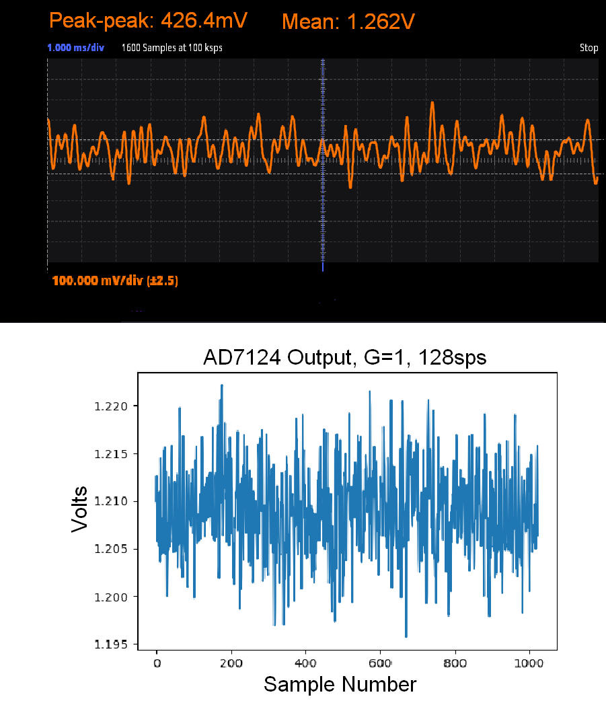

   Driving the AD7124 with 1mV/:math:`\sqrt{Hz}`. A qualitative reduction in noise is apparent; 426mV peak-to-peak noise at the ADC input results in approximately 25mV peak-to-peak noise at the ADC output. The 5.1mVRMS total output noise is close to the predicted 5.69mVRMS, given the 1mV/:math:`\sqrt{Hz}` noise density and 31Hz ENBW of the ADC's filter.
   :label:`noiseblast`

Conclusion
----------

Noise is a limiting factor in any signal chain; once noise contaminates a signal, information is lost. Before building a signal acquisition system, the application requirements must be understood, components selected accordingly, and the prototype circuit tested. This tutorial offers a collection of methods that accurately model and measure sensor and signal chain noise that can be used during the design and testing process.

The techniques detailed in this tutorial are, individually, nothing new. However, in order to achieve an adequate system, it becomes valuable to have a collection of fundamental, easy to implement, and low-cost techniques to enable signal chain modeling and verification. Even though industry continues to offer parts with increased performance, there will always be a certain limitation that one must be aware of. These techniques can not only be used to validate parts before building a mixed-mode signal chain, but also to identify design faults in an existing one. 

Acknowledgements
----------------

-  Jesper Steensgaard, who enabled/forced a paradigm shift in thinking about signal chain design, starting with the LTC2378-20.
-  Travis Collins, Architect of Pyadi-iio (among many other things).
-  Adrian Suciu, Software Team Manager and contributor to libm2k.

References
----------

.. [1] "Converter Connectivity Tutorial", https://wiki.analog.com/university/labs/software/iio_intro_toolbox, accessed 1 July, 2021.

.. [2] Analog Devices Education Tools Repository <https://doi.org/10.5281/zenodo.5105696>

.. [3] Pauli Virtanen, Ralf Gommers et al. (2020) SciPy 1.0: Fundamental Algorithms for Scientific Computing in Python. Nature Methods, 17(3), 261-272.

.. [4] "LTspice Simulator", https://www.analog.com/en/design-center/design-tools-and-calculators/ltspice-simulator.html>, accessed 1 July, 2021.

.. [5] Smith, Steven W, The Scientist & Engineer's Guide to Digital Signal Processing, https://www.analog.com/en/education/education-library/scientist_engineers_guide.html, accessed 1 July, 2021.

.. [6] Man, Ching, "Quantization Noise: An Expanded Derivation of the Equation, SNR = 6.02 N + 1.76", https://www.analog.com/media/en/training-seminars/tutorials/MT-229.pdf, accessed 1 July, 2021.

.. [7] Kester, Walt, "Taking the Mystery out of the Infamous Formula, "SNR = 6.02N + 1.76dB"" Analog Devices Tutorial, 2009,https://www.analog.com/media/en/training-seminars/tutorials/MT-001.pdf, accessed 1 July, 2021.

.. [8] "AD7124-8 Rev E" https://www.analog.com/media/en/technical-documentation/data-sheets/ad7124-8.pdf, accessed 1 July, 2021.

.. [9] Charles R. Harris, K. Jarrod Millman, et al. Array programming with NumPy, Nature, 585, 357–362 (2020)
       <DOI:10.1038/s41586-020-2649-2>

.. [10] "pyadi-iio: Device Specific Python Interfaces For IIO Drivers",https://wiki.analog.com/resources/tools-software/linux-software/pyadi-iio, accessed 1 July, 2021.

.. [11] "Scopy", https://wiki.analog.com/university/tools/m2k/scopy, accessed 1 July, 2021.

.. [12] "What is Libm2k?", https://wiki.analog.com/university/tools/m2k/libm2k/libm2k, accessed 1 July, 2021.

.. [13] "LTC2057/LTC2057HV High Voltage, Low Noise Zero-Drift Operational Amplifier", https://www.analog.com/media/en/technical-documentation/data-sheets/2057f.pdf, accessed 1 July, 2021.

.. [14] Kester, Walt, "Oversampling Interpolating DACs",  Analog Devices Tutorial, 2009, https://www.analog.com/media/en/training-seminars/tutorials/MT-017.pdf, accessed 1 July, 2021.

.. [15] Ruscak, Steve and Singer, L, "Using Histogram Techniques to Measure ADC Noise" Analog Dialogue, Volume 29, May, 1995. https://www.analog.com/en/analog-dialogue/articles/histogram-techniques-measure-adc-noise.html, accessed 1 July, 2021.

