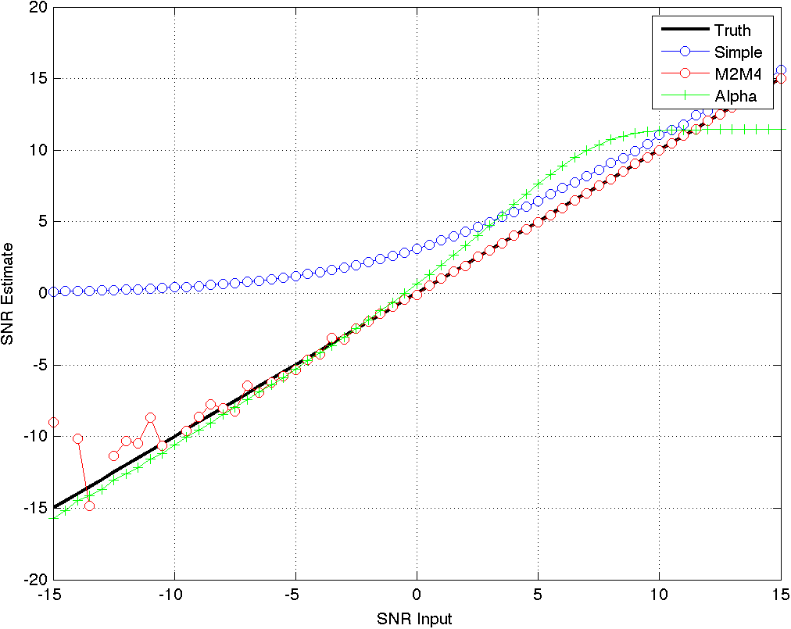
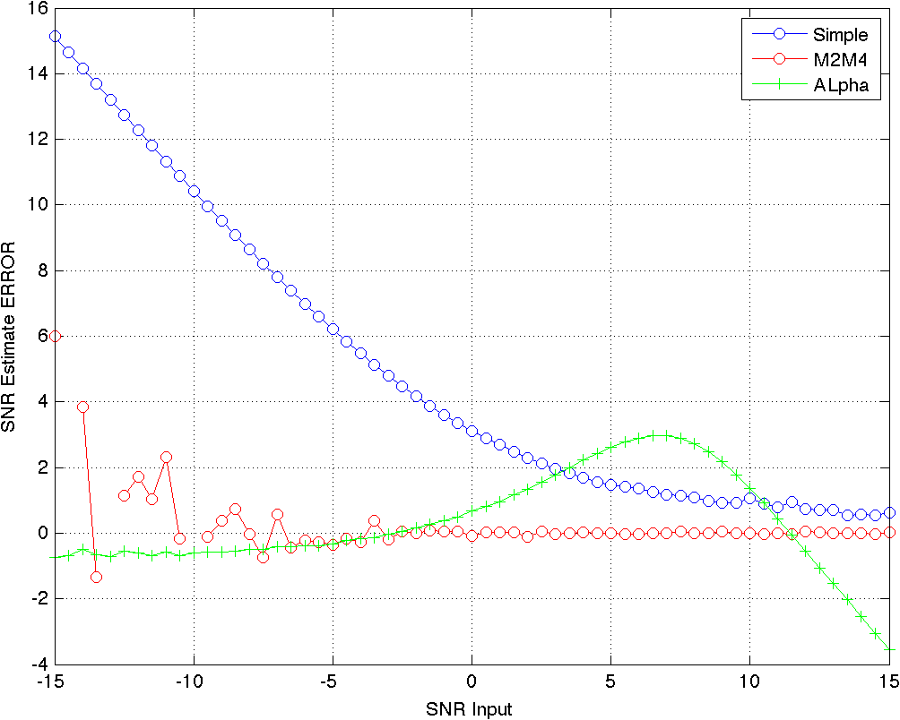

:copyright_holder: The Aerospace Corporation

:author: Kyle Logue
:email: kyle.logue@aero.org
:institution: The Aerospace Corporation

:author: Esteban Valles
:email: esteban.l.valles@aero.org
:institution: The Aerospace Corporation

:author: Andres Vila
:email: andres.i.vilacasado@aero.org
:institution: The Aerospace Corporation

:author: Alex Utter
:email: alexander.c.utter@aero.org
:institution: The Aerospace Corporation

:author: Darren Semmen
:email: darren.l.semmen@aero.org
:institution: The Aerospace Corporation

:author: Eugene Grayver
:email: eugene.grayver@aero.org
:institution: The Aerospace Corporation

:author: Sebastian Olsen
:email: sebastian.olsen@aero.org
:institution: The Aerospace Corporation

:author: Donna Branchevsky
:email: donna.branchevsky@aero.org
:institution: The Aerospace Corporation

-----------------------------------------------------------------------------------
Expert RF Feature Extraction to Win the Army RCO AI Signal Classification Challenge
-----------------------------------------------------------------------------------

.. class:: abstract

Automatic modulation classification is a challenging problem with multiple
applications including cognitive radio and signals intelligence. Most of the
existing efforts to solve this problem are only applicable when the signal to
noise ratio (SNR) is high and/or long observations of the signal are available.
Recent work has focused on applying shallow and deep machine learning (ML) to
this problem. Feature generation, where raw signal information is transformed
prior to attempting classification is a key part of this process. A big question
that researchers face is whether to let the deep learning system infer the
relevant features or build expert features based on expected signal
characteristics. In this paper, we present novel signal feature extraction
methods for use in signal classification via ML. The deep learning and combined
approaches are discussed in a simultaneous publication. Expert features were
utilized via ensemble leaning and shallow neural networks to win the Army Rapid
Capability Office (RCO) 2018 Signal Classification Challenge. The features
include both standard statistical measurements such as variance and kurtosis, as
well as measurements tailored for specific waveform families. We discuss the
best statistical descriptors along with a ranked list of signal features and
discuss individual feature importance. We then demonstrate our implementation of
these features and discuss effectiveness in estimating different modulation
classes. The methods discussed when combined with deep learning are capable of
correctly classifying waveforms at -10 dB SNR with over 63% accuracy and signals
at +10 dB SNR with over 95% accuracy from an Army RCO provided training set.

.. class:: keywords

   modulation, feature extraction, neural networks, machine learning, decision
   trees, wireless communication, signals intelligence, feature importance

Introduction
------------

All conventional communications systems are designed with the assumption that
the transmitter and receiver are cooperative and have full knowledge of the
waveform being exchanged. However, there are scenarios where the receiver does
not know what waveform (i.e. modulation, coding, etc.) has been transmitted.
Classical examples include cognitive radio network (i.e. a new terminal enters a
network and needs to figure out what waveform is being used), and signals
intelligence (i.e. interception of adversary’s communications). The problem of
waveform classifications, or more narrowly, modulation recognition has been
studied for decades [ModRec]_. Given the implication of SIGINT [#]_ applications
before cognitive radio, much of the work had not been published. Key early work
is done by Azzouz & Nandi [Nandi1]_ [Nandi2]_ [Azz1]_ [Azz2]_.

The fundamental approach taken by most authors has been to find data reduction
functions that accentuate the differences between different waveforms. These
functions are applied to input samples and decision is made by comparing the
values against a set of multi-dimensional thresholds. Determining the threshold
values by hand becomes impractical as the number of clusters and/or functions
grows. The idea to apply neural networks to help make these decisions has been
around for decades [Azz2]_. However, it is only recently that our
understanding of machine learning combined with enormous increase in
computational resources has enabled us to use ML techniques with many data
reduction functions against many simultaneous waveforms.

.. [#] Signals Intelligence

Challenge Description
---------------------

.. figure:: data-flow.pdf
    :align: center
    :figclass: w
    :scale: 100%

    Data flow through engineering features evaluation to classification and
    scoring. Light-blue denote the many variable parameters available. In the
    Army dataset, :math:`cv` is short for cross validation.
    :label:`data-flow`

The Army Rapid Capability Office is seeking innovative approaches to leverage
artificial intelligence (AI) to conduct blind radio frequency signal analysis.
To this end, they published a labeled modulation classification dataset and
created a competition [Army]_ to properly classify a pair of unlabeled test
sets. This paper details the efforts of The Aerospace Corporation’s Team
Platypus to build a modulation classification system via *traditional* expert
features and shallow machine learning classifiers. In this context, shallow
refers to the fact that the ML classifier will not build features out of the raw
data, instead the classifier will only use the expert features provided. The
winning submission from Team Platypus utilized a combination of this expert
feature engineering with a deep neural network trained on raw IQ [#]_ samples,
which are described in a simultaneous companion publication.

.. [#] In-Phase & Quadrature

The training dataset [Mitre]_ consists of 4.32 million signals each of which
containing 1024 complex (IQ) points and a label indicating the modulation type
and SNR. Modulation type is selected from one of 24 digital and analog
modulations (including a noise class), with AWGN at six different
signal-to-noise ratios (-10, -6, -2, +2, +6, or +10 dB). The complete dataset
included 30,000 rows for each modulation and SNR configuration. Sample rate is
selected from a set (200, 500, 1000, or 2000 ksps), and symbol rate is selected
from a set (4, 8, 16, or 32 samples per symbol). Neither of the rate parameters
is included in the label.

The competition consisted of assigning a likelihood score to each of the 24
possible modulation classes for each of the 100,000 rows in a pair of unlabeled
test sets.

Classifier performance is evaluated via a pre-defined equation based on the
well-known log loss metric, sometimes referred to as cross-entropy loss. The
traditional cross validation log loss equation is:

.. math::
    :label: logloss

    logloss = -\dfrac{1}{N}\sum ^{N}_{i=1}\sum ^{M}_{j=1}y_{ij}\log p_{ij}

Where N is the number of instances in the test set, M is the number of
modulation class labels (24), :math:`y_{ij}` is 1 if test instance :math:`i`
belongs to class :math:`j` and 0 otherwise, :math:`p_{ij}` is the predicted
probability that observation :math:`i` belongs in class :math:`j`. Per [Mitre]_
this is then scaled between 0 and 100.

.. math::
    :label: score

    score = \dfrac {100}{1+logloss}

Note:

* A uniform probability estimate would yield a score of 23.935, not zero.

* To get a perfect 100 score participants would need to be both 100% correct and 100% confident of every estimation.

We will also use a more standard :math:`F_1` metric for each modulation is used.
This is an excellent measurement of classifier performance since it uses both
recall :math:`r` and precision :math:`p`, which better account for true
positives and false positives:

.. math::
    :label: recall

    r = \dfrac{\sum {true\ positive}}{\sum {false\ negative}+\sum {true\ positive}}

.. math::
    :label: precision

    p = \dfrac{\sum {true\ positive}}{\sum {false\ positive}+\sum {true\ positive}}

.. math::
    :label: f1

    F_1 = \dfrac {2}{\frac {1}{r}+\frac {1}{p}}

Approach
--------

Team Platypus' approach to solve this modulation classification problem is to
combine deep neural networks and a shallow learning classifiers leveraging
custom engineering features. Both of these are supervised machine learning
systems. The engineering features that we applied to this data set are based on
traditional signal processing and digital communication techniques. Some shallow
learning classifiers, such as Extremely Randomized Trees (ERT) [ModRec]_ and
Random Forests [Nandi1]_, are decision-tree ensemble methods designed to be
robust to overfitting. Ensemble methods train multiple classifiers that will
ultimately decide the class using a majority vote or similar metric. These
constituent classifiers learn to be different by using different training
datasets and/or random parameters independent of the output. The majority voting
over this diverse set tends to mitigate the possible overfitting of the
constituent classifiers. This is a highly desirable property that becomes even
more useful in applications where the test data may have some deviations
compared to the labeled train data. The other advantage of decision-tree
ensemble methods is that they provide an estimate on whether the features are
useful in the classification process. This is further described in `Feature
Importance Evaluation`_.

Figure :ref:`data-flow` shows the general flow of data through the engineering
features evaluation system. The labeled training data is split into training,
cross-validation, and testing using a 70%-15%-15% split. When using neural
networks, the cross-validation set is the only fair method to prevent network
overfitting. When using ERT, the 15% allocated to cross-validation is appended
to the training set. Using the Army RCO score metric, the final version of this
system scored 65.281. This equates to a cross-validation log loss of 0.532. The
output of each step is written to large cache files to enable quick evaluation
of new features and integration into the next processing pipeline.

Not pictured are the later steps that merge these expert features with the
ResNeXt convolutional deep neural network and a temperature calibration step;
all of which yielded an internal final score of 76.422, which equates to a final
cross-validation log loss of 0.308.

Measurement Vectors
-------------------

Multiple transformations of the raw complex measurement vectors were made as
intermediate steps to feature extraction. Most of the reduction functions (i.e.
feature extraction) are applied to each of the transformed vectors. The
following sections describe these methods.

.. figure:: vector-importance.pdf
    :scale: 50%

    Ranked importance of measurement vectors. Numbers in the heat map indicate
    residual crossvalidation logloss. See `Feature Importance Evaluation`_ for a
    description of the ranking statistics. :label:`vec-imp`

I. Brute-Force PSK & QAM Symbol Estimation

Many common modulations can be expressed in the following form:

.. math::
    :label: ddnp

    z_{(t)} = \sum ^{\infty }_{n=0}x_{\left[ n\right] }\cdot h_{\left( t-T_{0}-nT_{s}\right)}

Where :math:`z_{(t)}` is the received baseband continuous-time signal,
:math:`x_{[n]}` are the complex-valued data symbols (each selected from some
fixed constellation, depending on modulation), :math:`T_0` is the time offset of
the first symbol, :math:`T_S` is the symbol period, and :math:`h_{(t)}` is the
pulse-shaping impulse response. This broad description includes all ordinary
PSK [#]_, APSK [#]_, and QAM [#]_ modulations, and it can be extended to include
variants such as OQPSK [#]_, :math:`\frac{\pi}{4}` QPSK, etc.

.. [#] Phase Shift Keying
.. [#] Amplitude and Phase Shift Keying
.. [#] Quadrature Amplitude Modulation
.. [#] Offset Quadrature Phase Shift Keying

Given :math:`z_{(t)}` (or its discrete-time approximation), the blind symbol
recovery operation determines :math:`T_0`, :math:`T_S`, and :math:`h_{(t)}` in
order to estimate :math:`x_{[n]}` without attempting to determine the precise
modulation type.

For the Army RCO Challenge, this process is greatly simplified because
:math:`T_S` may only take one of four discrete values: 4, 8, 16, or 32 samples
per symbol. Similarly, :math:`h_{(t)}` is always the simple rectangular pulse or
a root-raised-cosine (SRRC) filter with one of a few rolloff parameters. We
simply attempt recovery for all possible combinations of these parameters,
estimate SNR using the :math:`M_2M_4` method [Pauluzzi]_, and keep the
configuration with the highest SNR. (Note the generic, constant-envelope
:math:`M_2M_4` method will return biased results for APSK and QAM modulations,
but the max-SNR point is still accurate enough for timing estimation.)  The
pulse-shaping library can be simplified by pre-calculating discrete filter
responses for :math:`T_S=4`, and decimating all other inputs to match that
effective sampling rate.

One notable special case is OQPSK. Since the dataset has neither phase nor
frequency offsets, this signal can be trivially “converted” to QPSK by delaying
the real-part of the input signal by :math:`\frac{T_S}{2}`. This method would
not work for real-world signals, but is adequate for the Challenge.

The only remaining parameter is :math:`T_0`, which we estimated using one of two
methods. The first is Seung Joon Lee’s “absolute value nonlinearity” method
[Lee]_. The second is simple brute-force search with a step size of 1/16th of
the symbol period, retaining the output with the highest SNR (as above). The
former method is selected because it ran considerably faster and returned
essentially identical results.

Given all input parameters, we decimate :math:`z_{(t)}` to four samples per
symbol, optionally delay the in-phase part of the signal (see above), apply the
selected matched filter, then finally estimate :math:`x_{[n]}` by applying
piecewise quadratic interpolation to the filtered signal.

The resulting symbol set is not used directly, but is used to calculate various
statistics (such as the decision-directed noise power) that are used as
machine-learning features.

II. Phase Histogram

The purpose of this metric is to estimate how many different modulated phases
were present in each waveform. The goal is to provide a way to
differentiate between different M-ary PSK waveforms.

To this end, we first calculate the instantaneous phase of each input signal
:math:`\angle z_{(t)}`. Then divide the interval from 0 to :math:`2\pi` into 32
equal-size bins and count the number of samples within each bin. The resulting
histogram is circular-shifted such that the largest count is in first bin. The
output feature set is simply the vector of 32 counts, one per bin. Since the
input vector size is fixed at 1024 samples, no further normalization is
required.

Descriptive Statistics
----------------------

Descriptive statistics were applied to all vector measurands and accounted for
37% of all engineering features in the most expansive feature functions. Figure
:ref:`stat-imp` details which were of most importance. Note that some of these
features are nonlinear combinations of each other.

.. figure:: stat-importance.pdf
    :scale: 50%

    Ranked importance of descriptive statistics. See `Feature Importance
    Evaluation`_ for a description of the :math:`NN_M` statistic.
    :label:`stat-imp`

Custom Features
---------------

.. figure:: feature-importance-norm.pdf
    :scale: 50%

    Ranked importance of individual features. :math:`NN_{P1}` differs from
    :math:`NN_{P2}` in that these permutaiton importances were derived from two
    separately trained neural networks. :math:`\#_{feat}` denotes total number
    of features in each category noted left. :math:`P_{xx}` denotes power
    spectral density. Notice that the color map is normalized per column since
    metrics are difficult to compare otherwise. :label:`feat-imp`

.. figure:: top-importance.pdf
    :align: center
    :figclass: w
    :scale: 49%

    Top 30 individual engineering features sorted by neural network permutation
    importance. :label:`top-imp`

I. Decision-Directed Noise Estimation

Decision-directed noise estimation operates on recovered symbols. Given a fixed
constellation, the estimated noise for each symbol :math:`x[n]` is simply the
difference vector to the nearest constellation point. This nearest-neighbor
calculation can be run quickly using k-d trees. The estimated noise power for
each constellation is simply the mean-square power of these difference vectors.

Normally, this process would require gain and phase estimation, to correctly
align the received signal with the reference constellation. For the Challenge,
all input signals had a fixed gain and no phase or frequency offset, so this
step is not required.

The estimated noise is calculated separately for a constellation from each of
the following modulation types: BPSK [#]_, QPSK [#]_, 8PSK [#]_, 16PSK, 16APSK,
32APSK, 16QAM [#]_, 32QAM, and 64QAM. Each such estimate is then used as a
machine-learning feature.

.. [#] Binary Phase Shift Keying, each symbol representing 1 bit
.. [#] Quadrature Phase Shift Keying, each symbol representing 2 bits
.. [#] 8, 16, and 32 value PSK represent 3, 4, and 5 bits per symbol
.. [#] Similar to PSK Modulations, 16, 32, and 64 QAM represent 4, 5, and 6 bits per symbol

II. Hilbert Score

An analytic signal is a complex-valued function that has no negative frequency
components. The real and imaginary parts of an analytic signal are real-valued
functions related to each other by the Hilbert transform. The negative frequency
components of the Fourier transform of a real-valued function are superfluous,
due to the Hermitian symmetry of such a spectrum. Many techniques for modulating
and demodulating single-sideband waveforms use a Hilbert transformer as a core
block.

One the most challenging waveforms we had to deal with in this challenge is
differentiating between the AM-SSB [#]_ and AM-DSB [#]_ pair, especially given
the modulation bandwith was as little as 0.5% of the total bandwidth in some
cases. The initial intent of this method is to convert time domain data to
analytic domain. Another modulation pair that our classifiers had issues with is
differentiating QPSK and :math:`\frac{\pi}{4}` QPSK waveforms. The “Hilbert
score” feature is developed to help our classifier reduce confusion among these
similar modulations.

.. [#] Single Sideband Amplitude Modulation
.. [#] Dual Sideband Amplitude Modulation

The metric is defined as follows:

.. math::
    :label: hsm

    HSM = |\sum H\left( real\left( z[t]\cdot z_{0}\right) \right) ]
    + \sum H\left( imag\left( z[t]\cdot z_{0}\right) \right)|

Where :math:`HSM` is the Hilbert score metric, :math:`H(z)` is the Hilbert
transform, :math:`z` is the vector of input samples, and :math:`z_0` is a
rotation phasor at either 0 or 45°. This figure of merit proved to be useful to
our shallow classification algorithm.

III. DC Power

This metric is simply the 0th bin of the FFT of the complex input vector. The
feature consists of the real and imaginary part of this value, considered
separately.

IV. Simple SNR Estimation

In principle, given that at the time this metric is implemented we were already
using more precise SNR estimators, the usefulness of this simpler and noisier
estimator may not have been justified. However, the extremely randomized tree
classifier reported this metric as initially useful and we will use it as a
baseline for other metrics.

.. math::
    :label: simple

    SNR_{simple} = \dfrac{\frac{1}{2N}\sum|z[t]|^2}{Var(|z|)}

V. :math:`M_2M_4` SNR Estimation

Pauluzzi in [Pauluzzi]_ presents a comparison of different SNR estimators for
phase-shift keyed (PSK) channels with additive white Gaussian noise (AWGN)
noise. Though many of those methods are of limited accuracy at very low SNR, the
:math:`M_2M_4` method still performs well under such conditions.

:math:`M_2M_4` method uses the second and fourth moments of a waveform to
estimate its SNR. Though it is only directly applicable to constant-envelope
signals, it is still useful for relative comparisons under almost any
conditions. For simplicity, we use the generalized complex form (m-ary PSK)
regardless of modulation:

.. math::
    :label: m2m4

    SNR_{M_2M_4} = \dfrac {\sqrt {2M^{2}_{2}-M_{y}}}{M_{2}-\sqrt {2M^{2}_{2}-M_{4}}}

VI. :math:`\alpha` SNR Estimation

Many digital communication algorithms require knowledge of the operating
signal-to-noise ratio (SNR). Different algorithms exist that estimate signal and
noise power or the actual ratio between these two. However, most of the known
techniques at low SNR either fail or have very large variance. In order to
estimate SNR below 5 dB, we developed a technique that builds on the work by
Davenport [Davenport]_. This approach to SNR estimation introduces a non-linear
technique that uses the inherent properties of non-linear devices, such as a
limiter or an automatic-gain-control (AGC) device, to estimate negative SNRs. In
our case, the non-linear function used is a sign function. The properties of
these devices used for SNR estimation are well known and have been carefully
studied in the literature [Davenport]_. Similarly to many tracking loops
operating at low SNRs, this method multiplies the current sample of a given
waveform by the sign of the previous sample (under an assumption of multiple
samples per symbol).

.. math::

    S_{re}\left[ k\right] = sign(z_{re}[t] \cdot z_{re}[t-1]))

.. math::

    S_{im}\left[ k\right] = sign(z_{im}[t] \cdot z_{im}[t-1]))

.. math::

    \alpha = \dfrac {1}{N}\sum sign( S_{re}[t] + S_{im}[t])

If the signal is modulated, this process will introduce an error every time the
sign of a symbol changes. If the signal has no modulation present, then this
block is simply equivalent to a magnitude block. This operation is performed
independently on the real and imaginary component of the signal. The metric can
be plugged into the result from [Davenport]_ where for a non-coherent receiver,
the SNR can be approximated by:

.. math::
    :label: alpha

    SNR_\alpha = \dfrac {\alpha ^{2}}{1-\alpha ^{2}}

    Comparison of SNR estimation methods of a PSK modulated signal including
    novel :math:`SNR_\alpha` metric. :label:`alpha`

    Error of SNR estimation methods. :label:`alpha-err`

A comparison of the Simple, :math:`M_2M_4`, and :math:`\alpha` SNR estimators
are shown in Figure :ref:`alpha` and Figure :ref:`alpha-err`.

VII. N-M-D Power Estimation

In the :math:`SNR_{M_2M_4}` method, we see that the differences of signal
moments can be part of the core of SNR estimation algorithms. As we explored
generating new features to aid our shallow classifier, we introduced a new
feature that would simply compute the difference of two moments :math:`M_x-M_y`.
This proved to be of extremely useful as a feature generating function. This
function is not meant to compute an approximation metric for estimating SNR but
as an intermediate feature in the signal classification process.

VIII. AM Hypothesis Testing

The sample AM signals all were baseband analytic signals with a residual carrier
close to zero frequency. The feature we designed to distinguish double sideband
(DSB) vs. single sideband (SSB) depends on this assumption.

First, the carrier frequency and phase is estimated with the three-sample
discrete-Fourier-spectrum interpolator described in section III.D. of Macleod
[Macleod]_. Multiplication by the inverse of the estimated carrier signal (with
unit amplitude) makes the estimated carrier DC. Next, two transformations of
the resulting analytic signal are compared.

1. The mean is simply subtracted from the signal: if the signal is DSB, this
would result in its coherent demodulation.

2. Non-coherent demodulation is achieved by taking the modulus of the analytic
signal and subtracting off its mean over the sample time.

The feature used is the energy of the difference between these two
transformations, divided by the energy of the first transformation. When close
to zero, the signal would likely be DSB and, when close to one, SSB.

IX. Modified Allan Deviation (:math:`Mod \sigma^{2}_{y}(\tau)`)

Typically used as a tool to characterize the stability of time & frequency
sources, we applied the modified Allan deviation [NIST]_ statistic to a number
of angle measurements taken of the raw signal and several low-pass
transformations. These were computed with a Butterworth 5th-order low pass with
cutoff frequencies at 2.5% and 37.5% of the max & min sample rates in order to
filter for narrowband modulations.

.. math::
    :label: angle

    \angle z(t) = arctan2(real(z(t)),\ imag(z(t)))

This effectively captured the variability of phase over a number of averaging
taus including 1, 2, 4, 8, 16, and 32 complex samples. A nice implementation
can be found in the AllanTools [#]_ python module.

.. [#] https://pypi.org/project/AllanTools/

X. Zero Crossings

Some modulations such as :math:`\frac{\pi}{4}` QPSK are designed such that
transitions between symbols avoid passing through the origin. In general, this
is used to reduce peak-to-average signal power ratios, which removes certain
design constraints on signal amplifiers.

The zero-crossing metric is selected to detect these types of modulations.
Considering the real and imaginary parts separately, the metric examines the
sign of each sample and counts the total number of transitions from positive to
negative or vice versa.

The zero-crossing feature is calculated on the :math:`z(t)` directly, but is
most valuable on the multiple lowpass transformations.

Feature Importance Evaluation
-----------------------------

When single or multiple features were added to the feature extraction engine
they are computed over all signals in the training set. These features were then
appended to the shared cache of features from prior runs. This new larger
feature set is then sent to classification and a score is produced.

Initial feature importance is derived from the delta change in score from run to
run. This method requires close tracking of every feature and is ambiguous when
multiple features or vectors of features are added simultaneously. To address
this, several more precise approaches are used to evaluate performance.

A comparison of the following feature importance statistics can be found in
Figures :ref:`vec-imp`, :ref:`stat-imp`, :ref:`feat-imp`, and :ref:`top-imp`.

I. Gini Importance (:math:`ET_G`)

Gini importance or *mean decrease in impurity*, is implemented in
sklearn for Random Forest type classifiers as the *feature_importances_*
attribute. After training this metric is available with no additional effort or
computation, giving immediate feedback. This metric is useful for the Extra
Trees classifier specifically, but is only available for ensemble-type
classifiers. While his metric is computationally free, there are several
pitfalls described by [Cutler]_ such as incorrect valuation of correlated or
random features that make Gini importance of limited use.

II. Permutation Importance (:math:`ET_P` & :math:`NN_P`)

Permutation importance [Parr]_ can be computed for any classifier by creating a
logloss benchmark score for a test set (Eq :ref:`logloss`), then randomly
permuting 1 feature across all signals. This has the effect of keeping the
population statistics of that feature constant, but removing it's contribution
to the overall logloss score. Permutation importance is then calculated by
subtracting the predicted logloss score of the permuted set from the prior
benchmark. Since the shape of the input data is preserved, a trained classifier
does not need retraining and is therefor a *fast* metric. We denote permutation
importance for ExtraTress and our shallow neural network as :math:`ET_P` &
:math:`NN_P` respectively. Permutation importance provides the fastest & most
robust method for evaluating feature importance for any classifier.

III. Drop-Column Importance (:math:`NN_C`)

Drop-column importance [Parr]_ provides perhaps the highest quality estimate of
individual feature importance, but is *extremely* computationally expensive and
may take weeks or months to compute for even moderately sized neural networks.
An initial logloss benchmark is computed, then a feature is dropped across the
entire test population, requiring retraining of the classifier for every
feature. Resulting importance residuals are difficult to judge since the scale
is so small and correlated features often yield near zero change when removed.

IV. Max-Column Importance (:math:`NN_M`)

Max-column importance is a metric used in Figure :ref:`vec-imp`,
:ref:`stat-imp`, and :ref:`feat-imp`, to denote the maximum :math:`NN_P` across
many features grouped into a set. This is computed since the quantiles of
importances are heavily skewed toward zero since there are so many (1269)
features being compared.

V. Recursive Feature Elimination

Recursive Feature Elimination (RFE) is a technique originally designed for gene
selection [Guyon]_. This method evaluates the a feature importance estimate of
choice after training, then prunes a number of features each step attempting to
build a sorted list. This is implemented within *sklearn.feature_selection* as
*RFE*. This is also *highly* computationally intensive since it requires
retraining the classifier every step. There is value in RFE for comparing total
number of features to logloss score, especially when building a classifier for
low SWAP [#]_ implementations where computation is limited.

.. [#] Size Weight And Power

Classification Strategy & Scores
--------------------------------

From the beginning of the challenge it was clear that in scenarios where cross
validation labeled sets were used to evaluate the performance of classifiers,
that ERT have worse overall performance than neural networks. However, given
that the nature of the unlabeled sets was unknown, both techniques were pursued.

There were two unlabeled sets released to competitors. Estimates generated for
the first set using our deep neural network estimator resulted in very low and
inconsistent scores. It was apparent that the data was very unlike the training
data initially provided. Team Platypus estimates that only half of the first
unlabeled set was like the training set. Only the ERT classifier was applied to
that set due to its resiliency to overfitting. Only one of the competitors
achieved a higher score (0.8 points) for this set.

The challenge administrators disclosed that the second set contained data 95%
like the training set. As such, a combination of a ResNeXt deep convolutional
network combined with a shallow two-layer neural network comprised of
engineering features was used to submit the winning prediction. Team Platypus
held the highest submission score for the duration of the challenge.

.. figure:: team-rank.pdf
    :scale: 50%

    Final Army RCO AI Signal Classification leaderboard. :label:`team-rank`

Performance
-----------

The accuracy of estimation can be visualized as a confusion matrix, shown in
Figure :ref:`confusion`. Each row represents the true waveform, while each
column is the estimated probability. The diagonal values correspond to the
‘correct’ estimate. Brighter colors indicate higher confidence (e.g. the top
left square indicates almost 100% correct identification of the BPSK
modulation). This view allows us to quickly identify waveforms that are
challenging for our classifier such as the narrowband CPFSK/FSK/FM.

The :math:`F_1` score (see `Challenge Description`_) provides another view of
the same data. Note that while BPSK is correctly identified 100% of the time, it
is not always identified with 100% precision, making the :math:`F_1` score less
than 1.0. The performance of the classifier decreases at lower SNR. For example,
at 10 dB the :math:`F_1` score is perfect for most of the waveforms (Figure
:ref:`f1-10`). The overall classifier accuracy versus SNR is shown in Figure
:ref:`snr-acc`. Note that we achieve about 50% accuracy even at -10 dB SNR,
which is significantly better than previously published results.

.. figure:: EFNN_SNR-vs-ACC.pdf
    :scale: 50%

    Classifier Accuracy vs SNR. :label:`snr-acc`

.. figure:: EFNN_F1-Scores_10dB-only.pdf
    :scale: 50%

    :math:`F_1` scores at 10 dB SNR signals only. :label:`f1-10`

.. figure:: EFNN_F1-Scores.pdf
    :scale: 50%

    :math:`F_1` scores for all test data. :label:`f1`

.. figure:: EFNN_confusion-matrix.pdf

    Confusion matrix for all test data. :label:`confusion`

Conclusion
----------

The robust results presented in this paper show the significant progress that
has been made in application of machine learning over the past decade. However,
it is important to note that the test cases offered by the Challenge are
somewhat unrealistic. Real-world scenarios would include non-idealities like
those found in [OShea]_.

In regard to feature importance there were a number of interesting results. We
emphasize that while Gini importance (:math:`ET_G`) can approximate neural
network permutation importance (:math:`NN_P`), it can be very misleading when
given duplicate or random features. Drop-column importance provides a metric that
gives an absolute value of the individual contribution of a feature, but is
prohibitively computationally expensive and with correlated features provides
almost no value. We generally found permutation importance from our neural
networks to be the best measure of feature value in our classifiers, though all
methods still generally suffer when features correlate with other features.

We suggest that further research utilize the best statistics and features
described herein to achieve modulation classification estimates robust to the
traditional pitfalls of deep neural networks, which include generated
adversarial networks like those found in [Dong]_ and [Moosavi]_ as well as
overfitting due to lack of truth data.

Acknowledgements
----------------

The authors would like to thank the Army RCO for creating this interesting
challenge as well as our competitors who motivated us to stay up late and
reconsider our assumptions.

References
----------

.. [Army] ARMY RCO AI Signal Classification Challenge. (2018). Retrieved from https://www.challenge.gov/challenge/army-signal-classification-challenge/
.. [Mitre] MITRE Challenge. (2018). Retrieved from https://sites.mitre.org/armychallenge/
.. [Guyon] Guyon, I., Weston, J., Barnhill, S., & Vapnik, V., “Gene selection for cancer classification using support vector machines”, Mach. Learn., 46(1-3), 389-422, 2002. `doi:10.1023/A:1012487302797`__.
__ https://doi.org/10.1023/A:1012487302797
.. [Pauluzzi] Pauluzzi, D. & Beaulieu, N., “A comparison of SNR estimation techniques for the AWGN channel,” IEEE Trans. on Comm., vol. 48, no. 10, pp. 1681–1691, Oct. 2000. `doi:10.1109/26.871393`__.
__ https://doi.org/10.1109/26.871393
.. [Davenport] Davenport, W., “Signal-to-noise ratios in band-pass limiters,” J. Appl. Phys., vol. 24, no. 6, pp. 720–727, June 1953. `doi:10.1063/1.1721365`__.
__ https://doi.org/10.1063/1.1721365
.. [Springett] Springett, J., & Simon, M., “An analysis of the phase coherent-incoherent output of the bandpass limiter,” IEEE Trans. on Comm. Technology, vol. 19, no. 1, pp. 42–49, Feb. 1971. `doi:10.1109/tcom.1971.1090611`__.
__ https://doi.org/10.1109%2Ftcom.1971.1090611
.. [Lee] Lee, Seung Joon. "A new non-data-aided feedforward symbol timing estimator using two samples per symbol." IEEE Communications Letters 6.5 (2002): 205-207. `doi:10.1109/4234.1001665`__.
__ https://doi.org/10.1109%2F4234.1001665
.. [Geurts] Geurts, P., Ernst, D. & Wehenkel, L. Mach Learn (2006) 63: 3. `doi:10.1007/s10994-006-6226-1`__.
__ https://doi.org/10.1007/s10994-006-6226-1
.. [NIST] NIST SP 1065: Handbook of Frequency Stability Analysis. 2008. `doi:10.6028/nist.sp.1065`__.
__ https://doi.org/10.6028%2Fnist.sp.1065
.. [ModRec] Aisbett, Janet. "Automatic modulation recognition using time domain parameters." Signal Processing 13.3 (1987): 323-328. `doi:10.1016/0165-1684(87)90130-7`__.
__ https://doi.org/10.1016%2F0165-1684%2887%2990130-7
.. [Nandi1] Nandi, Asoke K., and Elsayed Elsayed Azzouz. "Algorithms for automatic modulation recognition of communication signals." IEEE Transactions on communications 46.4 (1998): 431-436. `doi:10.1109/26.664294`__.
__ https://doi.org/10.1109/26.664294
.. [Nandi2] Nandi, A. K., and Elsayed Elsayed Azzouz. "Automatic analogue modulation recognition." Signal processing 46.2 (1995): 211-222. `doi:10.1016/0165-1684(95)00083-p`__.
__ https://doi.org/10.1016%2F0165-1684%2895%2900083-p
.. [Azz1] Azzouz, Elsayed, and Asoke Kumar Nandi. Automatic modulation recognition of communication signals. Springer Science & Business Media, 2013. `doi:10.1007/978-1-4757-2469-1`__.
__ https://doi.org/10.1007%2F978-1-4757-2469-1
.. [Azz2] Azzouz, Elsayed Elsayed, and Asoke Kumar Nandi. "Modulation recognition using artificial neural networks." Automatic Modulation Recognition of Communication Signals. Springer, Boston, MA, 1996. 132-176. `doi:10.1007/978-1-4757-2469-1_5.`__
__ https://doi.org/10.1007%2F978-1-4757-2469-1_5
.. [Macleod] Macleod, M.D. “Fast Nearly ML Estimation of the Parameters of Real or Complex Single Tones or Resolved Multiple Tones.” IEEE Transactions on Signal Processing 46, no. 1 (1998): 141–148. `doi:10.1109/78.651200`__.
__ https://doi.org/10.1109%2F78.651200
.. [Cutler] Cutler, A., & Breiman, L. (2018). Random Forests. Retrieved from https://www.stat.berkeley.edu/~breiman/RandomForests/cc_home.htm#varimp
.. [Parr] Parr, T., Turgutlu, K., Csiszar, C., & Howard, J. (2018, March 26). Beware Default Random Forest Importances. Retrieved from https://explained.ai/rf-importance/
.. [OShea] \T. J. O’Shea, T. Roy and T. C. Clancy, "Over-the-Air Deep Learning Based Radio Signal Classification," in IEEE Journal of Selected Topics in Signal Processing, vol. 12, no. 1, pp. 168-179, Feb. 2018. `doi:10.1109/JSTSP.2018.2797022`__.
__ https://doi.org/10.1109/JSTSP.2018.2797022
.. [Dong] Dong, Yinpeng, Fangzhou Liao, Tianyu Pang, Hang Su, Jun Zhu, Xiaolin Hu, and Jianguo Li. “Boosting Adversarial Attacks with Momentum.” 2018 IEEE/CVF Conference on Computer Vision and Pattern Recognition (June 2018). `doi:10.1109/cvpr.2018.00957`__.
__ https://doi.org/10.1109%2Fcvpr.2018.00957
.. [Moosavi] Moosavi-Dezfooli, Seyed-Mohsen, Alhussein Fawzi, and Pascal Frossard. “DeepFool: A Simple and Accurate Method to Fool Deep Neural Networks.” 2016 IEEE Conference on Computer Vision and Pattern Recognition (CVPR) (June 2016). `doi:10.1109/cvpr.2016.282`__.
__ https://doi.org/10.1109%2Fcvpr.2016.282
