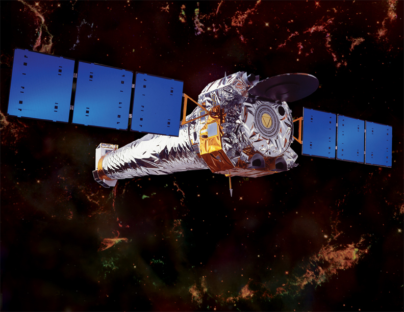
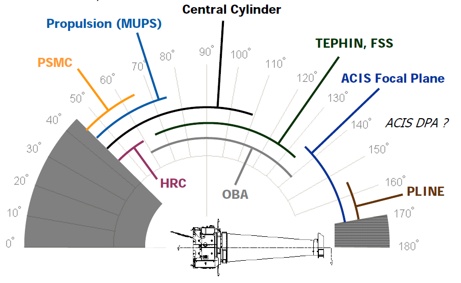
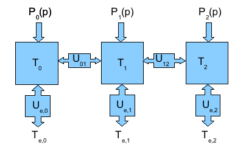
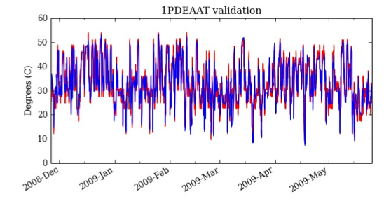
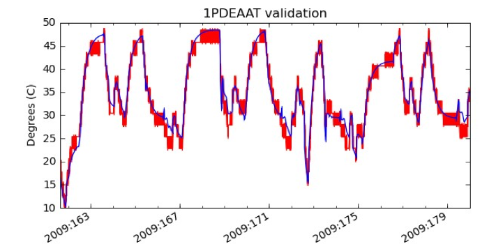
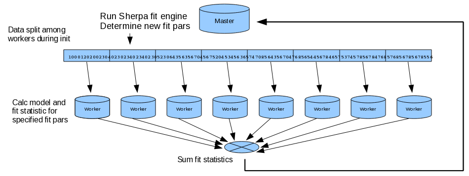

:author: Tom Aldcroft
:email: aldcroft@head.cfa.harvard.edu
:institution: Smithsonian Astrophysical Observatory

------------------------------------------------
Keeping the Chandra satellite cool with Python
------------------------------------------------

.. class:: abstract

   The Chandra X-ray Observatory has been providing groundbreaking astronomical
   data since its launch by NASA in July of 1999.  Now starting the second decade
   of science the Chandra operations team has been using Python to create
   predictive thermal models of key spacecraft components.  These models are being
   used in the mission planning and command load review process to ensure that the
   series of planned observations and attitudes for each week will maintain a safe
   thermal environment.  Speaking from my perspective as a scientist working to
   create and calibrate the models, I will discuss the process and the key
   off-the-shelf tools that made it all possible.  This includes fitting
   many-parameter models with the Sherpa package, parallel computation with
   mpi4py/MPICH2, large table manipulations with pytables/HDF5, and of course fast
   array math with NumPy.  

Motivation
------------

This paper describes the use of off-the-shelf tools in Python to tackle a
relatively challenging engineering problem facing the Chandra X-ray Observatory
satellite [CHANDRA]_.  While presenting no fundamentally new algorithms or
packages, the goal here is to take this as a case study for understanding how
scientists and engineers can make Python the foundation of their analysis
toolkit.  Some apologies are offered for the length of background material
required to tell this story.

Chandra
--------

The Chandra satellite was launched in July of 1999 as one of NASA's four "Great
Observatories".  This satellite can be compared in size and scope to the Hubble
Space Telescope except that it views the universe in X-rays instead of optical
or UV light.  Some people will argue that the universe is a much more exciting
place when viewed with X-ray photons, for then the sky comes alive with
black holes, supernova explosions, massive galaxy clusters, pulsars, and many
other highly energetic phenomena.  

Early in the mission it became apparent that temperatures on the spacecraft,
particularly on the side which normally faces the Sun, were increasing at a
rate well above pre-launch predictions.  It turned out that the ionizing
particle radiation environment was higher than expected and that it was
degrading the silverized teflon insulation which wraps much of the spacecraft.
Since this time the constraint of keeping spacecraft components within safe
operating temperatures has been a major driver in operations and schedule
planning.  Note that Chandra is in a high elliptical orbit, so unlike Hubble no
repair is possible.

Different parts of the spacecraft are heated at different pitch angles (the
angle that the telescope boresight axis makes to the sun line).  This is shown
in the figure below that shows a side view of Chandra along with the subsystems
that are sensitive over different pitch ranges.  Temperatures can be maintained
within limits by ping-ponging to different attitudes, never letting one part
get too hot.  Thus in order to plan the weekly observing schedule a few simple
models were created to predict temperatures or otherwise constrain the observing
duration at certain attitudes.

As the constraints became more significant a need developed to improve the
models in order to maintain the highest scientific output without endangering
the spacecraft.  In response, about three years ago the CXC Science Operations
Team (SOT, scientists closely involved in satellite operations) and the
engineers of the Flight Operations Team (FOT) formed a joint working group to
study thermal issues and to develop higher fidelity thermal models.  This paper
discusses one facet of the results coming out of the thermal modeling working
group.

Early in the process the author chose Python as the programming language for
supporting this effort.  Around this time NumPy had emerged as a strong (and
consolidated) numeric array manipulation tool for Python.  Adding in IPython,
Matplotlib and SciPy provided an development and interactive analysis
environment that was ideal for the task.  

Telemetry access
-----------------

A key starting point for developing complex thermal models is fast
access to thermal and other engineering data from the satellite.  The Chandra
satellite records a 32 kbit/s stream of telemetry that contains both the
science data and satellite engineering (housekeeping) data.   Although the
data volumes are meager by modern standards, the tools and data structure used
for processing and access were largely designed with mid-1990's era hardware
and storage capabilities in mind.

Two standard methods exist for retrieving archival telemetry.  Within the
Flight Operations Team (FOT) environment at the OCC the primary tool stores no
intermediate products and instead always falls back to the raw telemetry
stream.  This stream contains over 6000 individual engineering telemetry items
(MSIDs) that are interleaved according to different sampling rates and
sub-formats.  FOT engineers using this system are accustomed to waiting hours
or more to retrieve a year of data needed for analysis.

Within the Chandra X-ray Center (CXC) which is responsible for processing the
science data, the situation is somewhat better.  In this case the "Level-0
decommutation" process is done just once and the results stored in FITS files
available through an archive server.  These files each contain about two hours
of data for MSIDs that are related by subsystem (thermal, pointing control,
etc) and sampling rate.  However, access to a single MSID of interest (e.g. a
particular thermistor readout) requires retrieving and unzipping a large
amount of uninteresting data.

The solution to this problem was found in the pytables [PYT]_ package which
provides a robust interface to the powerful Hierarchical Data Format [HDF5]_
library.  Pytables/HDF5 is designed to create, update, and access very large
data tables with ease.  The key here was creating a separate HDF5 table for
each MSID which could easily store all the readouts for that MSID for the
*entire* mission.  This is especially optimal because many of the MSIDs change
infrequently and thus compress very well.  HDF5 natively supports an assortment
of compression options which makes this a snap.  Initially creating the table
based on a NumPy data array is simple using the ``createEArray`` method to
create an extendible homogenous dataset::

    filts = tables.Filters(complevel=5, complib='zlib')
    h5 = tables.openFile(filename, mode='w', filters=filts)
    h5shape = (0,) + data.shape[1:]
    h5type = tables.Atom.from_dtype(data.dtype)
    h5.createEArray(h5.root, 'data', h5type, h5shape, 
                    title=colname, expectedrows=n_rows)
    h5.createEArray(h5.root, 'quality', tables.BoolAtom(), 
               (0,), title='Quality', expectedrows=n_rows)
    h5.close()

A minor complication seen here is the boolean ``quality`` table which accounts
for bad or missing telemetry.  Once the table has been created it is a simple
matter to extend it with new data values after a communication pass::

    h5 = tables.openFile(filename, mode='a')
    h5.root.data.append(new_data)
    h5.root.quality.append(new_quality)
    h5.close()

At this time the largest individual tables have about :math:`$1.3 \times 10^9$`
rows (for the highest sampling rate of 4 times per second).  The data retrieval
speed from this archive of HDF5 tables is approximately :math:`$10^7$` items per
second.  This means that typical data retrieval requests can be handled in
seconds rather than hours.  Such an improvement changes the landscape of
questions that can be asked and then answered.

In addition to the data acquisition back-end, a user-friendly front-end was
needed to access the telemetry data in the HDF5 archive.  A challenge in this
regard was that most of the intended user community (FOT engineers) had
absolutely no experience with Python.  Thus the interface, documentation and
examples had to be clear and explicit.  The final documentation package
included a tutorial covering the telemetry access interface as well as IPython,
NumPy, and Matplotlib.

Creating a Thermal model
--------------------------

The thermal model which was developed for modeling Chandra subsystems is
illustrated in the figure below.

Here each of the boxes (:math:`$T_0$, $T_1$, $T_2$`) represents a physical node
on the spacecraft where a thermistor is located.  It is then assumed that each
node :math:`$i$` has an external heat input :math:`$P_i(p)$` and has
conductances :math:`$U_{i,j}$` to other nodes and an external heat bath with
temperature :math:`$T_{e,i}$`.  For most models the external heat input is Solar
and depends purely on the spacecraft pitch angle with respect to the Sun.  In
some cases however the heat input due to internal electronics is also
included.  Given these definitions and the nodal connectivity the temperatures
can be written in matrix form as a simple first order differential equation:

.. raw:: latex

   \vspace*{1em}
   \\
   { \footnotesize
   $
   \begin{array}{rcl}
   \mathbf{ \dot{T} } & = & \mathbf{\tilde{A} T} + \mathbf{b} \vspace*{.5em} \\
   \mathbf{ T }(t) & = & \int_0^t e^{\mathbf{\tilde{A}}(t-u)} \mathbf{b} du +
    e^{\mathbf{\tilde{A}}t}  \mathbf{T}(0) 
    \vspace*{.5em} \\
    & = & 
     \left[ \mathbf{v}_1 \; \mathbf{v}_2 \right]
     \left[
       \begin{array}{cc}
         \frac{e^{\lambda_1 t} - 1}{\lambda_1} & 0 \vspace{.3em} \\
         0 & \frac{e^{\lambda_2 t} - 1}{\lambda_2} 
        \end{array}
      \right]
     \left[ \mathbf{v}_1 \; \mathbf{v}_2 \right]^{-1} \mathbf{b} 
     \vspace*{.5em}
     \\
     && +
     \left[ \mathbf{v}_1 \; \mathbf{v}_2 \right]
     \left[
       \begin{array}{cc}
         e^{\lambda_1 t} & 0 \vspace{.3em} \\
         0 & e^{\lambda_2 t} 
        \end{array}
      \right]
     \left[ \mathbf{v}_1 \; \mathbf{v}_2 \right]^{-1}
     \mathbf{T}(0)
     \vspace*{.5em}
   \\
   \end{array}
   $
   }
   \\

The solution can be expressed analytically as long as the model parameters
(external heat inputs, conductances) are constant.  Most of the time Chandra
dwells at a particular attitude and so this is a good assumption during such a
dwell.  The computational strategy for making a model prediction of
temperatures is to identify "states" where the parameters are constant and
propagate temperatures from the beginning to the end of the state.  Then use
the end temperatures as the starting point for the next state.

The first implementation of this core model calculation was a literal
transcription of the analytic solution for each time step within a state.  This
was quite inefficient because of repeated creation and computation of
intermediate 2-d arrays.  A slight modification allowed for adding the time
dimension into the arrays and computing all time steps at once with a single
expression of NumPy dot products.  This resulted in a factor of 10-20 speed
increase.  Further optimization to avoid repeating certain calculations within
inner loops plus caching of results eventually yielded code that is 50 times
faster than in the initial literal version.  In the end the code takes less
than a second to predict a year of temperatures at 5-minute resolution for a
5-node model of the sun-pointed side of the spacecraft.

Fitting the model parameters
------------------------------

The next step is to tune the model parameters to best fit the existing thermal
data for the subsystem of interest.  In typical cases there are two to five
thermistors whose data are averaged over 5 minute intervals.  Up to five
years of such data are fit at once.

What is not immediately apparent in the concise matrix formulation
:math:`$\mathbf{ \dot{T} } = \mathbf{\tilde{A} T} + \mathbf{b} \vspace*{.5em}$`
of the thermal model is that it contains a lot of free parameters.  In addition
to the conductances and external heat bath temperatures, the external Solar
power input for each node is complicated.  First it is a function of the pitch
angle with respect to the Sun, but it also has an annual variation term (due to
the elliptical orbit) as well as a long-term change due to the continued slow
degradation of the protective insulation.  All this needs to be fit in order to
predict temperature profiles at any time, including years in advance.  One key
5-node model being used in planning operations has a total of 80 free
parameters.  All of those parameters need to calibrated using at least 5 years
of existing thermal data to train the model.

Two immediate objections can be raised.  First, that with so many free
parameters one can fit almost anything.  In a sense for this application that
is just fine, as long as the resultant model has stable predictive power beyond
the time range over which it is calibrated.  But at a more fundamental level
experience has shown that it is simply not true that the complex and coupled
time-dependent behavior of temperatures on the spacecraft can necessarily be
captured by any model with a large number of parameters.

The second objection is that fitting for so many parameters is bound for
failure.  However, what makes this problem tractable is that the many of
parameters are only loosely coupled.  This makes it possible to selectively fit
for subsets of the parameters and iteratively home in on a reasonable global
set of parameters.  Unlike many problems in parameter estimation where the
derived parameter values and uncertainties are the primary goal, in this case
it is the model prediction that matters.

The Sherpa [SHP]_ package is used to handle the actual optimization of
parameters to achieve the best model fit to the data.  Sherpa is a modeling and
fitting application for Python that contains a powerful language for combining
simple models into complex expressions that can be fit to the data using a
variety of statistics and optimization methods. It is easily extensible to
include user models, statistics and optimization methods.  For this application
the key feature is a robust implementation of the Nelder-Mead (aka Simplex)
optimization method that is able to handle many free parameters.  Sherpa
provides within the model language a natural way of manipulating and linking
model parameters using Python expressions.

The result of the fitting process is a calibrated thermal model that can be
used to accurately predict the system temperatures given the planned sequence
of maneuvers and instrument configurations.  The figure below shows an example
of the data for one thermistor "1PDEAAT" in red with the model prediction in blue.

The next plot below now shows the post-facto model prediction (blue) for a
two-week period of data (red) that is outside the calibration time range.  Most
of the features are well reproduced and the distribution of residuals is
roughly gaussian.

Parallelization of fitting
--------------------------

Despite the good model calculation performance with vectorized NumPy, fitting
for 5 years of data and dozens of parameters can benefit from the further speed
increase of parallelization.  This is particularly helpful for the exploratory
phase of developing a new model and getting the parameters in the right ball
park.   

The thermal models being discussed here can easily be parallelized by
splitting into independent time segments.  There is a slight issue with the
starting conditions for each segment, but there are straightforward ways to
finesse this problem.  In the context of a fitting application a master-worker
architecture works well.  Here the master is responsible for controlling the
fit optimization process while each of the workers takes care of all model
computations for a particular time segment.  The worker is initially sent the
time range and model definition and it is then responsible for retrieving the
appropriate telemetry data.  After initialization the model parameters for each
fit iteration are sent and the worker computes the model and :math:`$Chi^2$` fit
statistic.  All of the individual :math:`$Chi^2$` values are then summed.  In
this way the communication overhead between master and workers is minimal.  The
figure below illustrates the process.

The actual job of handling the interprocess communication and job creation is
done with the mpi4py [MPI4PY]_ package using the MPICH2 [MPICH2]_ library.  As
is often the case, the choice of these particular packages over other similar
ones was driven by the depth of documentation, availability of relevant looking
examples, and ease of installation.  Starting with no previous experience with
distributed computing, a working prototype of the parallel fitting code was
created in less than a day.  This is a testament largely to the quality of
documentation.

As for computing resources, our division within SAO is perhaps like other
academic science institutes with a collection of similarly configured linux
machines on a local network.  These are often available off-hours for
"borrowing" CPU cycles with consent of the primary user.  A more formal
arrangement (for instance using an application like Condor for distributed job
scheduling) has been in consideration but not yet adopted.  For this
application up to twelve 4-core machines were used.  Dynamic worker creation
was supported by first starting up ``mpd`` servers on the target hosts (from
file ``mpd.hosts``) with a command like the following::

  mpdboot --totalnum=12 --file=mpd.hosts --maxbranch=12

An abridged version of the basic code used for parallel fitting is shown
below.    Communication with and control of the workers is localized in three functions::

  def init_workers(metadata)
      """Init workers using values in metadata dict"""
      msg = {'cmd': 'init', 'metadata': metadata}
      comm.bcast(msg, root=MPI.ROOT)

  def calc_model(pars):
      """Calculate the model for given pars"""
      comm.bcast(msg={'cmd': 'calc_model', 'pars': pars}, 
                 root=MPI.ROOT)

  def calc_stat()
      """Calculate chi^2 diff between model and data"""
      msg = {'cmd': 'calc_statistic'}
      comm.bcast(msg, root=MPI.ROOT)
      fit_stat = numpy.array(0.0, 'd')
      comm.Reduce(None, [fit_stat, MPI.DOUBLE], 
                  op=MPI.SUM, root=MPI.ROOT)
      return fit_stat

The main processing code first uses the MPI Spawn method to dynamically
create the desired number of worker instances via the previously created ``mpd``
servers.  Then the workers receive an initialization command with the start and
stop date of the data being used in fitting.  The Sherpa user model and fit
statistic are configured, and finally the Sherpa fit command is executed::

  comm = MPI.COMM_SELF.Spawn(sys.executable,
                             args=['fit_worker.py'],
                             maxprocs=12)
  init_workers({"start": date_start, "stop": date_stop})

  # Sherpa commands to register and configure a function 
  # as a user model
  load_user_model(calc_model, 'mpimod')
  add_user_pars('mpimod', parnames)
  set_model(mpimod)

  # Configure the fit statistic
  load_user_stat('mpistat', calc_stat)
  set_stat(mpistat)

  # Do the fit
  fit()

The ``fit_worker.py`` code is likewise straightforward.  First get a
communication object to receive messages, then simply wait for messages with
the expected commands.  The ``init`` command calls the ``get_data()`` function
that gets the appropriate data given the ``metadata`` values and the ``rank`` of
this worker within the ensemble of ``size`` workers. 
::

  comm = MPI.Comm.Get_parent()
  size = comm.Get_size()
  rank = comm.Get_rank()

  while True:
      msg = comm.bcast(None, root=0)

      if msg['cmd'] == 'stop':
          break

      elif msg['cmd'] == 'init':
          x, y = get_data(msg['metadata'], rank, size)

      elif msg['cmd'] == 'calc_model':
          model = calc_model(msg['pars'], x, y)

      elif msg['cmd'] == 'calc_statistic':
          fit_stat = numpy.sum((y - model)**2)
          comm.Reduce([fit_stat, MPI.DOUBLE], None,
                      op=MPI.SUM, root=0)
  comm.Disconnect()

Putting it to work
------------------

Using the techniques and tools just described, two flight-certified
implementations of the models have been created and are being used in Chandra
operations.  One models the temperature of the power supply for the ACIS
science instrument [ACIS]_.  The other models five temperatures on the
Sun-pointed side of the forward structure that surrounds the HRMA X-ray mirror.
Each week, as the schedule of observations for the following week is assembled
the models are used to confirm that no thermal limits are violated.
Separate cron jobs also run daily to perform post-facto "predictions" of
temperatures for the previous three weeks.  These are compared to actual
telemetry and provide warning if the spacecraft behavior is drifting away from
the existing model calibration.

Summary
---------

The current Python ecosystem provides a strong platform for production science
and engineering analysis.  This paper discussed the specific case of developing
thermal models for subsystems of the Chandra X-ray Observatory satellite.
These models are now being used as part of the flight operations process.  

In addition to the core tools (NumPy, IPython, Matplotlib, SciPy) that get used
nearly every day in the author's work, two additional packages were discussed:

* Pytables / HDF5 is an easy way to handle the very large tables that are
  becoming more common in science analysis (particularly astronomy).  It is
  simple to install and use and brings high performance to scientists.
* MPI for Python (mpi4py) with the MPICH2 library provides an accessible
  mechanism for parallelization of compute-intensive tasks.

References
----------

.. [ACIS] http://cxc.harvard.edu/proposer/POG/html/ACIS.html

.. [CHANDRA] http://chandra.harvard.edu/

.. [HDF5] http://www.hdfgroup.org/HDF5/

.. [MPI4PY] http://mpi4py.scipy.org/

.. [MPICH2] http://www.mcs.anl.gov/research/projects/mpich2/

.. [PYT] http://www.pytables.org

.. [SHP] http://cxc.harvard.edu/contrib/sherpa

