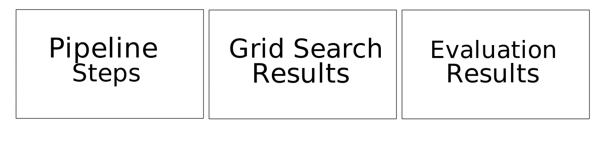
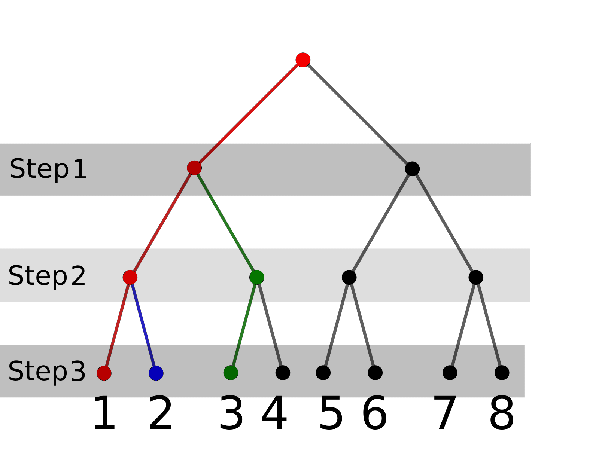

:author: Alexander Ivanov
:email: alexander.radievich@gmail.com
:institution: The Institute for Information Transmission Problems, Moscow, Russia
:institution: Skoltech Institute of Science and Technology, Moscow, Russia
:equal-contributor:

:author: Dmitry Petrov
:email: to.dmitry.petrov@gmail.com
:institution: Imaging Genetics Center, University of Southern California, Los Angeles, USA
:institution: The Institute for Information Transmission Problems, Moscow, Russia
:corresponding:
:equal-contributor:

:author: Daniel Moyer
:email: dcmoyer@gmail.com
:institution: Imaging Genetics Center, University of Southern California, Los Angeles, USA

:author: Mikhail Belyaev
:email: belyaevmichel@gmail.com
:institution: Skoltech Institute of Science and Technology, Moscow, Russia

:author: Paul Thompson
:email: pthomp@usc.edu
:institution: Imaging Genetics Center, University of Southern California, Los Angeles, USA

:video: https://github.com/neuro-ml/reskit

--------------------------------------------------------------------------------------------------
Reskit: a library for creating and curating reproducible pipelines for scientific machine learning
--------------------------------------------------------------------------------------------------

.. class:: abstract

In this work we introduce Reskit (researcher’s kit), a library for creating and
curating reproducible pipelines for scientific machine learning. A natural
extension of the Scikit-learn Pipelines to general classes of pipelines, Reskit
allows for the efficient and transparent optimization of each pipeline step.
Its main features include data caching, compatibility with most of the
scikit-learn objects, optimization constraints such as forbidden combinations,
and table generation for quality metrics. Reskit’s design will be especially
useful for researchers requiring pipeline versioning and reproducibility, while
running large volumes of experiments.

.. class:: keywords

   data science, reproducibility, python

Introduction
------------

A central task in machine learning and data science is the comparison and
selection of models. The evaluation of a single model is very simple, and can
be carried out in a reproducible fashion using the standard scikit pipeline.
Organizing the evaluation of a large number of models is tricky; while there
are no real theory problems present, the logistics and coordination can be
tedious. Evaluating a continuously growing zoo of models is thus an even more
painful task. Unfortunately, this last case is also quite common.

The task is simple: find the best combination of pre-processing steps and
predictive models with respect to an objective criterion. Logistically this can
be problematic: a small example might involve three classification models, and
two data preprocessing steps with two possible variations for each — overall 12
combinations. For each of these combinations we would like to perform a grid
search of predefined hyperparameters on a fixed cross-validation dataset,
computing performance metrics for each option (for example ROC AUC). Clearly
this can become complicated quickly. On the other hand, many of these
combinations share substeps, and re-running such shared steps amounts to a loss
of compute time.

Reskit [reskit]_ is a Python library that helps researchers manage this problem.
Specifically, it automates the process of choosing the best pipeline, i.e.
choosing the best set of data transformations and classifiers/regressors. The
researcher specifies the possible processing steps and the scikit objects
involved, then Reskit expands these steps to each possible pipeline, excluding
forbidden combinations. Reskit represents these pipelines in a convenient
pandas dataframe, so the researcher can directly visualize and manipulate the
experiments.

Reskit then runs each experiment and presents results which are provided to the
user through a pandas dataframe. For example, for each pipeline’s classifier,
Reskit could  grid search on cross-validation to find the best classifier’s
parameters and report metric mean and standard deviation for each tested
pipeline. Reskit also allows you to cache interim calculations to avoid
unnecessary recalculations.

Main features of Reskit
-----------------------

- En masse experiments with combinatorial expansion of step options, running
  each option and returning results in a convenient format for human
  consumption (Pandas dataframe).

- Step caching. Standard SciKit-learn pipelines cannot cache temporary steps.
  Reskit includes the option to save fixed steps, so in next pipeline
  specified steps won’t be recalculated.

- Forbidden combination constraints. Not all possible combinations of pipelines
  are viable or meaningfully different. For example, in a classification task
  comparing the performance of logistic regression and decision trees the
  former requires feature scaling while the latter may not. In this case you
  can block the unnecessary pair. Reskit supports general tuple blocking as
  well.

- Full compatibility with scikit-learn objects. Reskit can use any scikit-learn
  data transforming object and/or predictive model, and many other libraries
  that uses the scikit template.

- Evaluation of multiple performance metrics simultaneously. Evaluation is
  simply another step in the pipeline, so we can specify a number of possible
  evaluation metrics and Reskit will expand out the computations for each
  metric for each pipeline.

- The DataTransformer class, which is Reskit’s simplfied interface for
  specifying fit/transform methods in pipeline steps. A DataTransformer
  subclass need only specify one function.

- Tools for learning on graphs. Due to our original motivations, Reskit
  includes a number of operations for network data. In particular, it allows  a
  variety of normalization choices for adjacency matrices, as well as built in
  local graph metric calculations. These were implemented using DataTransformer
  and in some cases the BCTpy (the Brain Connectivity Toolbox python version [bct]_)

.. csv-table:: A plan of the experiment we set for our example on the scikit-learn generated classification task with fixed `random_state`.
  :header-rows: 1
  :file: papers/alexander_ivanov/plan_table.csv
  :widths: 1 10 15 15

Dependencies
------------

- Python 3.4 and higher.
- Scikit-learn [scikit]_ 0.18.1 and its dependencies. Our library was heavily
  inspired by scikit-learn Pipeline class and overall architecture of this
  library. One can think of Reskit as an extension of  scikit-learn pipelines.
- Pandas [pandas]_.
- SciPy [scipy]_, Python-Igraph [igraph]_ and NetworkX [networkx]_ for machine
  learning on networks.

How Reskit works
----------------

Let's consider an example of Reskit usage in a classification problem.  We want
to try two scalers, two dimension reduction techniques and three classifiers
for our classification problem. It's required to make grid search of models
parameters on stratified 5-fold cross-validation and validate found best
parameters on another stratified 5-fold cross-validation. Also, we don't want
to use ``MinMaxScaler`` for ``KernelPCA`` in our pipelines. Using Reskit for
this task the code has the clear structure and looks as follows:

.. code-block:: python

    from sklearn.preprocessing import StandardScaler
    from sklearn.preprocessing import MinMaxScaler

    from sklearn.svm import SVC
    from sklearn.linear_model import LogisticRegression
    from sklearn.linear_model import SGDClassifier
    from sklearn.decomposition import PCA
    from sklearn.decomposition import KernelPCA

    from sklearn.model_selection import StratifiedKFold
    from sklearn.datasets import make_classification

    from reskit.core import Pipeliner

    # Setting variants for steps by lists of tuples
    scalers = [('standard', StandardScaler()),
               ('minmax', MinMaxScaler())]
    dim_reduction = [('pca', PCA()),
                     ('k_pca', KernelPCA())]

    # Setting models
    classifiers = [('LR', LogisticRegression()),
                   ('SVC', SVC()),
                   ('SGD', SGDClassifier())]

    # Reskit needs to define steps in this manner
    steps = [('scaler', scalers),
             ('dim_reduction', dim_reduction),
             ('classifier', classifiers)]

    # Grid search parameters for our models
    param_grid = {'LR': {'penalty': ['l1', 'l2']},
                  'SVC': {'kernel': ['linear', 'poly', 
                                     'rbf', 'sigmoid']},
                  'SGD': {'penalty': ['elasticnet'],
                          'l1_ratio': [0.1, 0.2, 0.3]}}

    # Setting a quality metric that we want to optimize
    scoring='roc_auc'

    # Setting cross-validations
    grid_cv = StratifiedKFold(n_splits=5, 
                              shuffle=True, 
                              random_state=0)
    eval_cv = StratifiedKFold(n_splits=5, 
                              shuffle=True, 
                              random_state=1)

    banned_combos = [('minmax', 'k_pca')]
    pipe = Pipeliner(steps=steps, 
                     grid_cv=grid_cv, 
                     eval_cv=eval_cv, 
                     param_grid=param_grid, 
                     banned_combos=banned_combos)

.. csv-table:: Grid Search results in 'results' variable for our example on the scikit-learn generated classification task with fixed `random_state`.
  :file: papers/alexander_ivanov/results_grid_search.csv
  :header-rows: 1
  :widths: 1 250 200 512 1

    ``results`` consist of three tables: 1, 2 and 3.

We specified needed parameters, ``Pipeliner`` combined possible steps to
different pipelines and wrote it to self ``plan_table`` parameter as `pandas
DataFrame`. You can view it (`Table 1`) to check further calculation plan or
fix it.

To start calculations run ``get_results`` method of ``Pipeliner``:

.. code-block:: python

    X, y = make_classification(random_state=0)
    results = pipe.get_results(X, y, scoring=scoring)

Thus, in ``results`` variable we have experiment plan (`Table 1`), grid search
(`Table 2`) and validation (`Table 3`) results (`Fig. 1`).

For curating pipelines we used ``Pipeliner`` class. The following section
describes this class in details.

   A tree of caching temporary results. Let's say each branch is a pipeline
   labelled by a number.  Then after the first pipeline is calculated (red
   colour)  you need to recalculate in the second pipeline only last step (blue
   colour). And in the third pipeline, you already need to recalculate two
   steps (green colour).

Pipeliner class
---------------

Heart of Reskit — an object which allows you to test different data
preprocessing pipelines and prediction models at once. You will need to specify
a name of each preprocessing and prediction step and possible objects
performing each step as in the example above. Then ``Pipeliner`` will combine
these steps to different pipelines, excluding forbidden combinations; perform
experiments according to these steps and present results in convenient CSV
table. For example, for each pipeline’s classifier, ``Pipeliner`` will grid
search on cross-validation to find the best classifier’s parameters and report
metric mean and std for each tested pipeline. ``Pipeliner`` also allows you to
cache interim calculations to avoid unnecessary recalculations.

``Pipeliner`` initializes with following parameters:

``steps`` is a list of `(step_name, transformers)` tuples, where `transformers`
is a list of tuples `(step_transformer_name, transformer)`. ``Pipeliner`` will
create ``plan_table`` from this ``steps``, combining all possible combinations
of transformers, switching transformers on each step.

``eval_cv`` and ``grid_cv`` determine the grid search and the evaluation
cross-validation splitting strategies.

``param_grid`` is a dictionary with classifiers names (string) as keys. The keys are
possible classifiers names in steps. Each value corresponds to grid search
parameters for usual scikit-learn ``GridSearchCV`` object.

``banned_combos`` is a list of `(transformer_name_1, ..., transformer_name_n)` tuples.
Each row with all these transformers will be removed from plan_table.

The main method of ``Pipeliner`` that starts all calculations is ``get_results``.
After we ran calculations through this method ``Pipeliner`` passes through
``plan_table`` and makes three steps for each row.

Firstly, ``Pipeliner`` makes transformations according to specified
``caching_steps``.  If ``caching_steps`` isn't set , it just returns ``X`` and
``y``, otherwise it makes all transformations with caching temporary results in
``_cached_X`` parameter of ``Pipeliner``. The process of caching temporary
results may be considered on a tree example ( `Fig. 2`), where the same
parts of previous and current branches won't be recalculated (red colour), but
different - will be recalculated (blue and green colour).

Secondly, ``Pipeliner`` creates usual `scikit-learn` pipeline and makes grid
search to find best parameters. The mean and standard deviation with found best
parameters on defined ``grid_cv`` cross-validation are written to the table of
results (`Table 2`). Best parameters also are written to the table of results.

Thirdly, ``Pipeliner`` evaluates found in previous step best parameters on
another ``eval_cv`` cross-validation. It writes mean, standard deviation and
scores of a quality metric on ``eval_cv`` to the table of results (`Table 3`).

.. csv-table:: Validation results in 'results' variable for our example on the scikit-learn generated classification task with fixed `random_state`.
  :header-rows: 1
  :file: papers/alexander_ivanov/results_evaluation.csv
  :widths: 1 18 18 30

DataTransformer class
---------------------
 
For convenience of the researchers we added ``DataTransformer`` class — a simple 
class which allows researcher to make sklearn-like transformers through usual
functions. 

Here is example of normalizing by mean of three matrices.

.. code-block:: python

    import numpy as np

    from reskit.normalizations import mean_norm
    from reskit.core import DataTransformer

    matrix_0 = np.random.rand(5, 5)
    matrix_1 = np.random.rand(5, 5)
    matrix_2 = np.random.rand(5, 5)
    y = np.array([0, 0, 1])

    X = np.array([matrix_0,
                  matrix_1,
                  matrix_2])

    output = np.array([mean_norm(matrix_0),
                       mean_norm(matrix_1),
                       mean_norm(matrix_2)])

    def mean_norm_trans(X):
        X = X.copy()
        N = len(X)
        for i in range(N):
            X[i] = mean_norm(X[i])
        return X

    result = DataTransformer(
                func=mean_norm_trans).fit_transform(X)

    print((output == result).all())

.. code-block:: bash

    $ True

With the support of ``DataTransformer``, you can implement a needed to you
transformation and use it in ``Pipeliner`` workflow.

MatrixTransformer class
-----------------------

Particular case of ``DataTransformer`` is a ``MatrixTransformer``.

Here is the same example, but for ``MatrixTransformer`` usage. Input ``X`` for
transformation with ``MatrixTransformer`` should be a 3 dimensional array
(array of matrices). ``MatrixTransformer`` just transforms each matrix in
``X``.

.. code-block:: python

    from reskit.core import DataTransformer

    result = MatrixTransformer(
                func=mean_norm).fit_transform(X)

    print((output == result).all())

.. code-block:: bash

    $ True

Brain Connectivity Toolbox functions wrapper
--------------------------------------------

.. csv-table:: A plan of the experiment we set for our example on the UCLA dataset.
  :header-rows: 1
  :file: papers/alexander_ivanov/ucla_plan.csv
  :widths: 1 10 15 15

Brain Connectivity Toolbox [bct]_ is a popular tool in brain network research,
so many researchers familiar with its functions.  It provides you measures
that describe different structural and functional properties of brain networks.

We provide you only some basic graph metrics in Reskit, but BCT let you access
to most state of the art graph metrics that well known in this field. You can
install it via pip in terminal:

.. code-block:: bash

    $ pip3 install bctpy

With the support of ``bctpy`` we can, for instance, simply calculate
`Pagerank`. Here we use UCLA autism dataset publicly available at the UCLA
Multimodal Connectivity Database.  Data includes connectivity matrices of 51
high-functioning ASD (Autism Spectrum Disorders) subjects and 43 TD (Typically
Developing) subjects.

.. code-block:: python

    from bct.algorithms import centrality
    from reskit.datasets import load_UCLA_data

    X, y = load_UCLA_data()
    X = X['matrices']

    pagerank = centrality.pagerank_centrality
    featured_X = MatrixTransformer(
            d=0.85,
            func=pagerank).fit_transform(X)

Here is an example of using ``Pipeliner`` with BCTpy on UCLA dataset:

.. csv-table:: Grid Search results in 'results' variable for the UCLA dataset.
  :header-rows: 1
  :file: papers/alexander_ivanov/ucla_grid_search.csv
  :widths: 1 250 200 512

.. code-block:: python

    from sklearn.svm import SVC
    from sklearn.linear_model import LogisticRegression
    from sklearn.linear_model import SGDClassifier

    from sklearn.model_selection import StratifiedKFold

    from reskit.core import Pipeliner
    from reskit.core import MatrixTransformer
    from reskit.datasets import load_UCLA_data

    import bct.algorithms as bct

    X, y = load_UCLA_data()
    X = X['matrices']

    pagerank = bct.centrality.pagerank_centrality
    degrees = bct.degree.degrees_und

    # Feature extraction step variants (1st step)
    featurizers = [('pagerank', MatrixTransformer(
                                    d=0.85,
                                    func=pagerank)),
                   ('degrees', MatrixTransformer(
                                    func=degrees))]

    # Models (2rd step)
    classifiers = [('LR', LogisticRegression()),
                   ('SVC', SVC()),
                   ('SGD', SGDClassifier())]

    # Reskit needs to define steps in this manner
    steps = [('featurizer', featurizers),
             ('classifier', classifiers)]

    # Grid search parameters for our models
    param_grid = {'LR': {'penalty': ['l1', 'l2']},
                  'SVC': {'kernel': ['linear', 'poly', 
                                     'rbf', 'sigmoid']},
                  'SGD': {'penalty': ['elasticnet'],
                          'l1_ratio': [0.1, 0.2, 0.3]}}

    # Quality metric that we want to optimize
    scoring='roc_auc'

    # Setting cross-validations
    grid_cv = StratifiedKFold(n_splits=5, 
                              shuffle=True, 
                              random_state=0)
    eval_cv = StratifiedKFold(n_splits=5, 
                              shuffle=True, 
                              random_state=1)

    pipe = Pipeliner(steps=steps, 
                     grid_cv=grid_cv, 
                     eval_cv=eval_cv, 
                     param_grid=param_grid)
    results = pipe.get_results(X, y, 
                               scoring=scoring, 
                               caching_steps=['featurizer'])

``results`` variable consist of Table 4, 5 and 6.

.. csv-table:: Validation results in 'results' variable for the UCLA dataset.
  :header-rows: 1
  :file: papers/alexander_ivanov/ucla_evaluation.csv
  :widths: 1 20 17 30

Applications
------------

Reskit was originally developed for a brain network classification task. We
have successfully applied it in our own research several times [PRNI2016]_,
[ISBI2017]_. Code from two of these projects can be found at [PRNI_code]_ and
[ISBI_code]_.

In PRNI work [PRNI2016]_ we proposed a combination of network normalizations
and Reskit helped us to try these normalizations and to figure out how these
normalizations boost network classification. Firstly, we wrote all code in
usual scripts with saving temporary calculations on a disk. So, we decided to
build a library that automates this stuff and called it Reskit. The rewritten
version have similar with previous our UCLA example code structure, but with a
bigger amount of normalizations and features.

In next our paper [ISBI2017]_ we studied the extent to which brain networks
and derivative measures are unique to individual changes within human brains.
To do so, we classified brain networks pairs as either belonging to the same
individual or not. Here, we used Reskit for pairwise classification task and we
reached it with ease through using ``DataTransformer`` with implemented
especially for this task functions. 

To implement specific `Transformer` we need next template:

.. code-block:: python

    from sklearn.base import TransformerMixin
    from sklearn.base import BaseEstimator

    class MyTransformer(BaseEstimator, TransformerMixin):

        def __init__(self):
            #
            # Write here need parameters
            # Otherwise write `pass`
            #

        def fit(self, X, y=None, **fit_params):
            #
            # Write here the code if transformer need
            # to learn anything from data.
            # Usually nothing should be here,
            # just return self.
            #
            return self

        def transform(self, X):
            #
            # Write here your transformation
            #
            return X

Here is an element of code for normalization transformer:

.. code-block:: python

    class MatrixNormalizer(BaseEstimator, 
                           TransformerMixin):

        def __init__(self, norm):
            self.norm    = norm

        def fit(self, X, y=None):
            return self

        def transform(self, X):
            X_transformed = {}

            for key in X['matrices'].keys():
                X_transformed[key] = self.norm(
                                        X['matrices'][key])

            return {'pairs_data': X['pairs_data'],
                    'matrices': X_transformed}

Input ``X`` is a dictionary in format:

.. code-block:: python

    {'pairs_data': pairs_data,
     'matrices': matrices},

where ``pairs_data`` has a format like in `Table 7` and represents indices for
pairs of connectivity matrices. It's stored for generating pairwise features in
next transformer. In ``matrices`` stored a dictionary of brain connectivity
matrices that you can access by the same ID as in `Table 7`. Next, you just go
through each matrix and apply defined normalization to it. In the same manner,
we implemented the rest of transformers.

In MICCAI work [MICCAI2017]_, we compared 35 brain network building pipelines,
for figuring out how pre-processing steps affect network reliability and
reproducibility. In addition to 35 building pipelines, there was 4 various
normalizations and 9 graph metrics (in total 36 pipelines of features
extraction for each building pipeline). Again, we classified network pairs as
either belonging to the same individual or not. As an additional validation of
our pipeline, we perform gender classification using the same combinations of
building brain networks and Reskit helped us to make it too fast to include it
to paper. 

Each building pipeline was computed by special pre-processing neuroimaging
tools and stored to disk. After, we picked up appropriate brain network from
the disk and applied normalization, feature extraction and classification steps
to it. For loading needed brain network we wrote a loader that takes parameters
such as dataset path, tractography, reconstruction model etc. and gives needed
data from created path to files according to taken parameters. Next, we applied
normalizations, feature extraction and classified brain network pairs at the
end of a pipeline. Of course, it would be more naturally to implement own
transformers and just use them in usual ``Pipeliner`` workflow. To make
inconvenient usage of such transformers is a challenge that we going to solve.

To compute it faster we made all calculations on a cluster. There were
different input parameters for our script (dataset path, tractography,
reconstraction model etc.) and we created a grid of all possible combinations
for these parameters. We ran each steps combination on a separate cluster node.
``Pipeliner`` workflow can be easily distributed on different nodes by
separating ``plan_table`` on equal parts according to a number of cluster
nodes. And this is another task we are planning to do in the feature.

Our another goal was to calculate parametric reliability measure, Intraclass
Correlation Coefficient (ICC). Thus, except pairwise classification, we also
calculated ICC for each pipeline. To make these calculations we used Reskit
caching feature and clean code structure, that allowed us to reuse almost the
same code with little changes a lot of times.  To make these calculations, we
rewrote Reskit core for only ICC calculation without grid search and
evaluation. This is a common use case and this isn't included in stable release
now. We are going to implement this functionality in near feature.

As a result, we achieved the method that's useful in identifying overall trends
in brain network usefulness.

.. csv-table:: A table of pairwise indeces of dataset matrices.
  :header-rows: 1
  :file: papers/alexander_ivanov/adni_pairs_data_with_dx_group_without_isolated_nodes.csv
  :widths: 12, 14, 13, 14, 7

Future plans
------------

We believe the library is general enough to be useful in a variety of data
science contexts, and we hope that other researchers will find this library
useful in their studies. And as future plans we choose next goals:

- Calculation of metrics without applying models and the end (grid search and
  evaluation steps). More detailed motivation was described above in
  application section.

- Ability to merge multiple experiment plans. There are cases when we need to
  make calculations for not only one dataset. And pipelines steps for each
  dataset can vary. This feature provides more accurate management of
  experiments.

- Distributed computing for calculation on computing clusters. Including this
  feature will speed up calculations and these, of course, important for
  researchers.

- Ability to calculate different quality metrics after one optimization. Now in
  Reskit, you can use only the same quality metrics both for optimization of
  parameters and for validating these parameters. There are cases when you
  optimize one metric and test parameters on another metrics and we are going
  to provide this feature.

- Public repositories of DataTransformers for various purposes. Each library
  should do one thing and do it well. ``Pipeliner`` provides you convinient
  management of pipelines and DataTransformers allow you to make field oriented
  research.

- Option to save best models/pipelines according to external criteria. Now
  ``Pipeliner`` saves to a table of results only parameters of best models. It
  would be convenient to have other opportunities to choose.

- Support for Python 2.7. We use Python 3, but if Python 2 will be on demand,
  we will write Python 2 versions too.

- Backwards compatibility. We rewrote Reskit a few times and some code isn't
  compatible with our latest version. We are going to fix it and keep backward
  compatibility in feature.

Conclusion
----------

In this abstract we introduced Reskit, a library for creating and curating
reproducible pipelines for scientific machine learning. Reskit allows for the
efficient and transparent optimization of each pipeline step. Its main features
include data caching, compatibility with most of the scikit-learn objects,
optimization constraints, and table generation for quality metrics. Reskit’s
design will be especially useful for researchers requiring pipeline versioning
and reproducibility, while running large volumes of experiments.

References
----------

.. [reskit] https://github.com/neuro-ml/reskit/tree/master

.. [scikit] http://scikit-learn.org/stable/

.. [bct] https://sites.google.com/site/bctnet/

.. [pandas] http://pandas.pydata.org/

.. [scipy] https://www.scipy.org/

.. [igraph] http://igraph.org/python/

.. [networkx] https://networkx.github.io/

.. [PRNI2016] D. Petrov, Y. Dodonova, L. Zhukov, M. Belyaev, Boosting Connectome Classification via Combination of Geometric and Topological Normalization, 6th International Workshop on
   Pattern Recognition in Neuroimaging - 2016

.. [ISBI2017]  https://arxiv.org/abs/1701.07847

.. [MICCAI2017] link to paper

.. [PRNI_code] https://github.com/neuro-ml/PRNI2016

.. [ISBI_code] https://github.com/neuro-ml/structural-connectome-validation-pairwise

.. [MICCAI_code]  link to code

.. [UCLA] Brown, Jesse A., et al. The UCLA multimodal connectivity database: a web-based platform for brain connectivity matrix sharing and analysis., Frontiers in neuroinformatics 6 (2012): 28.
