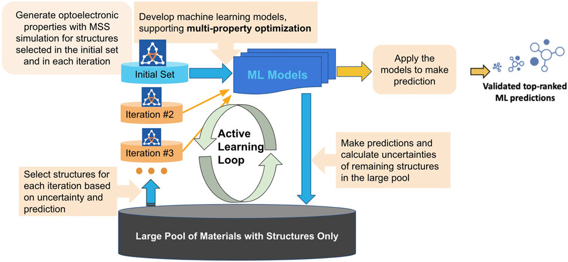

:author: Alexandr Fonari
:email: sasha.fonari@schrodinger.com
:institution: Schrödinger Inc., 1540 Broadway, 24th Floor. New York, NY 10036
:corresponding:

:author: Farshad Fallah
:email: farshad.fallah@schrodinger.com
:institution: Schrödinger Inc., 1540 Broadway, 24th Floor. New York, NY 10036

--------------------------------------------------------------------------------------------------------------------------------------
Utilizing SciPy and other open source packages to provide a powerful API for materials manipulation in the Schrödinger Materials Suite
--------------------------------------------------------------------------------------------------------------------------------------

.. class:: abstract

The use of several open source scientific packages in The Schrödinger Materials Suite will be discussed. A common workflow for materials discovery will be described, discussing how open source packages have been incorporated at every stage. Some recent implementations of machine learning for materials discovery will be discussed, and how open source packages were leveraged to achieve results faster and more efficiently.

.. class:: keywords

   materials, active learning, OLED, deposition, evaporation

Introduction
------------

Tools for computational materials discovery can be facilitated by utilizing existing libraries that cover the fundamental mathematics used in the calculations in an optimized fashion. This allows developers to devote more time to developing truly new features instead of re-inventing the wheel, improves the performance of the software, and reduces maintenance. The Schrödinger Materials Suite [Schr]_ uses a wide variety of scientific packages both in the calculation stage and visualization of results.

A common materials discovery practice is to start with reading an experimental structure of a material, compute its properties of interest (e.g. elastic constants, electrical conductivity), tune the material by modifying its structure (e.g. doping) or adding and removing atoms (deposition, evaporation), and then recompute the properties of the modified material. This cycle can be run in a high-throughput manner, enumerating different structure modifications in a systematic fashion, such as doping ratio in a semiconductor or depositing different adsorbates. Every step of this workflow can benefit from open source code.

Materials import and generation
-------------------------------

For reading and writing of material structures, several open source packages (e.g. OpenBabel [Obabel]_, RDKit [Rdkit]_) have implemented functionality for working with several extensively used formats (e.g. CIF, PDB, mol, xyz). Experimental periodic structures of materials, mainly coming from single crystal X-ray diffraction, are distributed in CIF (Crystallographic Information File), PDB (Protein Data Bank) and lately mmCIF formats [Formats]_. Correctly reading experimental structures is of significant importance, since the rest of the materials discovery workflow depends on it. In addition to  atom coordinates and periodic cell information, structural data also contains symmetry operations (listed explicitly or by the means of providing a space group) that can be used to decrease the number of computations required for a particular system taking symmetry into account. This can be important for scaling high-throughput calculations.  Both formats allow description of the positional disorder (one example being a solvent molecule not having a stable position within the cell can be described by two or more sets of coordinates). Another complication is  that experimental data spans an interval of almost a century, one of the oldest crystal structures deposited in the Cambridge Structural Database (CSD) [CSD]_, dates to 1924 [Grph]_. All these nuances present non-trivial technical challenges. Thus, it has been a continuous effort by Schrödinger (at least 39 commits went into this project) and others to correctly read and convert periodic structures in OpenBabel. By version 3.1.1 (the most recent at writing time), this effort resulted in very few (if any) known cases where OpenBabel reads incorrect structure from the experimental data. OpenBabel contains a versatile Python API that exposes most functionality of the underlying C code in a clean and ergonomic way. Non-periodic molecular formats are simpler since they only contain atom coordinates and no cell or symmetry information.

An important application of structure generation is modeling of substitutional disorder in solid alloys and materials with point defects (intermetallics, semiconductors, oxides and their crystalline surfaces). In this case the unit cell and atomic sites of the crystal or surface slab are well defined while the chemical species occupying the site may vary. In order to simulate substitutional disorder one must generate the ensemble of structures that includes all statistically significant atomic distribution in a given unit cell.  This can be achieved by a brute force enumeration of all symmetrically unique atomic structures with a given number of vacancies, impurities or solute atoms. The enumlib library implements algorithms for such a systematic enumeration of periodic structures [Enumlib]_. This allows to generate a big set of symmetrically nonequivalent materials with different compositions (e.g. doping or defect concentration). Recently, we applied this approach in simultaneous study of the activity and stability of Pt based core-shell type catalysts for the oxygen reduction reaction. We generated a set of stable doped Pt/transition metal/nitrogen surfaces using periodic enumeration. Using Quantum ESPRESSO (QE) [QE]_ to perform periodic density functional theory (DFT) calculations, we assessed surface phase diagrams for Pt alloys and  and identified the avenues for stabilizing the cost effective  core-shell systems by a judicious choice of the catalyst core material. Such catalysts may prove critical in electrocatalysis for the fuel cell applications. [TM]_.

Workflow capabilities
---------------------

In order to be able to run a massively parallel screening of materials a highly scalable and stable queuing system (job scheduler) is required. We have implemented a job queuing system on top of the most used queuing systems (SLURM, torque, etc.) and exposed a Python API to submit and monitor jobs. In order to accommodate job dependencies in the workflows, for each job a parent job (or multiple parent jobs) can be defined forming a directed graph of jobs. If a job fails (and can not be restarted), all its children (if any) will not start, thus saving queuing and computational time (some examples of workflows are provided below). This allowed us and our customers to perform massive screenings of materials and their properties. We reported a massive screening of 250,000 charge-conducting organic materials, totaling approximately 3,619,000 DFT SCF (self-consistent field) single-molecule calculations using quantum mechanics (QM) Jaguar code [Jaguar]_ that took 457,265 CPU hours (~52 years) [CScreen]_. Another case study is high-throughput molecular dynamics simulations (MD) of thermophysical properties of polymers for various applications [MDS]_. There, using Desmond code [Desmond]_ we computed the glass transition temperature (Tg) of 315 polymers and compared the results with experimental measurements [Bicerano]_. This study took advantage of GPU (graphics processing unit) support as implemented in Desmond, as well as the job scheduler API described above.

For soft materials (polymers, organic small molecules and substrates composed of soft molecules), convex hull and related mathematical methods are important for finding possible accessible solvent voids (during submerging or sorption) and adsorbate sites (during molecular deposition). These methods are conveniently implemented in SciPy [Scipy]_. We implemented molecular deposition and evaporation workflows using the Desmond MD engine as the backend. This workflow enables simulation of the deposition and evaporation of the small molecules on a substrate. As an example, organic light-emitting diodes (OLEDs) are fabricated using a stepwise process, where layers are deposited on top of previous layers. Both vacuum and solution deposition processes have been used to prepare these films, primarily as "amorphous" thin film active layers lacking long-range order. Each of these deposition techniques introduces changes to the film structure and consequently, different charge-transfer and luminescent properties [Deposition]_.

Data fitting algorithms and use cases
-------------------------------------

Whereas for the materials simulations (QM, periodic DFT, classical MD) Python, even with SciPy/NumPy can be slow, SciPy and related packages provide sophisticated numerical function optimization and fitting capabilities, below we list several examples used in the suite.

Recently we implemented convex analysis of the stress strain curve (as described here [Patrone]_). Technically, it is a constrained minimization with boundary conditions (as implemented in scipy.optimize.minimize) of a function related to the stress strain curve. The stress strain curve is obtained from a series of consequent MD simulations on deformed cells (cell deformations are defined by strain type and deformation step). The pressure tensor of a deformed cell is related to stress. This analysis allowed us to predict elongation at yield for high density polyethylene polymer and compare it with experimental data [Convex]_.

Another area where scipy.optimize is used is fitting of the bulk energies at different cell volumes (compressed and expanded) in order to obtain bulk modulus and equation of state (EOS) of a material. Technically, it is a least squares method. In the Schrödinger suite this was implemented as a part of the EOS workflow, fitting is performed on the the results obtained from a series of QE calculations performed on the original and compressed/expanded (deformed) cells. This is also an example of the loosely coupled (embarrassingly parallel) jobs. Calculations of the deformed cells only depend on the bulk calculation and do not depend on each other and thus all the deformation jobs can be submitted in parallel, this greatly facilitates high-throughput runs.

One of the more complex examples of optimization is fitting of the experimental powder diffraction intensity peaks to the indexed peaks (Pawley refinement) [Jansen]_. Here we employed the lmfit package [Lmfit]_ to perform a minimization of the multivariable Voigt-like function that represents the entire diffraction spectrum. This allows to refine (optimize) unit cell parameters coming from the indexing data as a result goodness of fit (R-factor) between experimental and simulated spectrum is reported. Powder diffraction is widely used in drug discovery to assess purity of the material and discover known or unknown crystal polymorphs that could form [Powder]_.

Machine learning techniques
---------------------------

There is great interest in machine learning assisted materials discovery. There are several components required to perform machine learning assisted materials discovery. In order to train a model, benchmark data from calculations and/or experimental data is required. Besides benchmark data, computation of the relevant descriptors is required (see below). Finally, a model based on benchmark data and descriptors is generated that allows prediction of properties for novel materials. There are several techniques to generate the model, spawning from linear or non-linear fitting to neural networks, DeepChem [Deepchem]_ and AutoQSAR [AutoQSAR]_. In the Schrödinger suite, benchmark data for small molecules and finite systems can be obtained using QM DFT molecular Jaguar code, for periodic systems, QE used, for larger polymeric and similar systems molecular dynamics Desmond code is used.

For crystalline periodic systems, we have implemented several sets of descriptors. Element descriptors (such as atomic weight, number of valence electrons in s-, p- and d-shells, electronegativity), structure descriptors (such as density, volume per atom, and packing fraction descriptors) as implemented in matminer [Matminer]_, intercalation descriptors (such as cation and anion counts, crystal packing fraction, average neighbor ionicity) [Sendek]_, 3D-based smooth overlap of atomic positions (SOAP) descriptors, as implemented in DScribe [DScribe]_. Using these descriptors and kernel regression methods to train the model, as implemented in scikit-learn [SkLearn]_, we were able to train a model that successfully predicted bulk modulus of a set of Li-containing battery related compounds.

For isolated small molecules and extended non-periodic systems, rdkit can be used to generate a large number of atomic and molecular descriptors. A lot of effort has been devoted to ensure that rdkit works on a wide variety of materials that are supported by Schrödinger suite. As at the time of writing, the 4th most active contributor to rdkit is Ricardo Rodriguez-Schmidt from Schrödinger [RdkitC].

Recently, we implemented a workflow that employs active learning (AL) for intelligent and iterative identification of promising materials candidates within a large dataset [Abroshan]_. In this approach, machine learning and DFT are combined. In the framework of AL, the predicted value with associated uncertainty is considered to decide what materials to be added in each iteration, aiming to improve the model's performance in the next iteration (Figure :ref:`figal`). There we used descriptors as implemented in rdkit to featurize the chemical structures. These descriptors generated on the initial subset of structures are given as vectors to an algorithm based on Random Forest as implemented in scikit-learn. Bayesian optimization is employed to tune the hyperparameters of the model. In each iteration, a trained model is applied for making predictions on the remaining materials in the dataset. Since it could be important to consider multiple properties in material discovery, multiple property optimization is also implemented [Kwak]_. Multiple properties are  scaled and combined into a single score value. In this particular study, for a dataset of ~9,000 molecules, the AL workflow determined the top candidates for hole (positively charged carrier) transport layer  by evaluating 550 molecules in 10 iterations using DFT calculations. Performing DFT calculations for all of the 9,000 molecules in the dataset would increase the computational cost by a factor of 15 versus the AL workflow.

   Active Learning workflow for the design and discovery of novel optoelectronics molecules. :label:`figal`

Conclusions
-----------

We present several examples of how Schrödinger Materials Suite incorporates open source software packages. There is a wide range of applications in materials science that can benefit from already existing open source. Where possible, we report issues to the package authors and submit improvements and bug fixes in the form of the pull requests. We are thankful to all who have contributed to open source libraries, and have made it possible for us to develop a platform for accelerating innovation in materials and drug discovery. We will continue contributing to these projects and we hope to further give back to the scientific community by facilitating research in both academia and industry. We hope that this report will inspire other scientific companies to give back to the open source community in order to improve the computational materials field and make science more reproducible.

References
----------
.. [Schr] Schrödinger Release (2021). Schrödinger Release 2021-2: Materials Science Suite. New York, NY: Schrödinger, LLC. http://www.schrodinger.com/materials/

.. [Obabel] N. M. O'Boyle, et al. *Open Babel: An open chemical toolbox*, Journal of cheminformatics 3.1 (2011): 1-14. https://openbabel.org/

.. [Rdkit] G. Landrum. *RDKit: A software suite for cheminformatics, computational chemistry, and predictive modeling*, (2013). http://www.rdkit.org/

.. [Formats] J. D. Westbrook, and P. MD Fitzgerald. *The PDB format, mmCIF formats, and other data formats*, Structural bioinformatics 2: 271-291 (2003).

.. [CSD] C. R. Groom, I. J. Bruno, M. P. Lightfoot and S. C. Ward. *The Cambridge Structural Database*, Acta Cryst. B72: 171-179 (2016).

.. [Grph] O Hassel, H Mark. *The Crystal Structure of Graphite*, Zeitschrift für Physik (Journal of Physics), 25: 317–337 (1924).

.. [Enumlib] G. LW Hart, and R. W. Forcade. *Algorithm for generating derivative structures*, Physical Review B 77 (22): 224115 (2008). https://github.com/msg-byu/enumlib/

.. [QE] P. Giannozzi, et al. *Advanced capabilities for materials modelling with Quantum ESPRESSO*, Journal of physics: Condensed matter 29 (46): 465901 (2017). https://www.quantum-espresso.org/

.. [TM] T. Mustard, et al. *Surface reactivity and stability of core-shell solid catalysts from ab initio combinatorial calculations*, ABSTRACTS OF PAPERS OF THE AMERICAN CHEMICAL SOCIETY. 258. (2019).

.. [Jaguar] A. D. Bochevarov, et al. *Jaguar: A high‐performance quantum chemistry software program with strengths in life and materials sciences*, International Journal of Quantum Chemistry 113 (18): 2110-2142 (2013).

.. [CScreen] N. N. Matsuzawa, et al. *Massive theoretical screen of hole conducting organic materials in the heteroacene family by using a cloud-computing environment*, The Journal of Physical Chemistry A 124 (10): 1981-1992 (2020).

.. [MDS] M. Atif F. Afzal, et al. *High-throughput molecular dynamics simulations and validation of thermophysical properties of polymers for various applications*, ACS Applied Polymer Materials 3 (2): 620-630 (2020).

.. [Desmond] D. E. Shaw, et al. *Anton 2: Raising the Bar for Performance and Programmability in a Special-Purpose Molecular Dynamics Supercomputer*, SC14: International Conference for High Performance Computing, Networking, Storage and Analysis: 41 (2014).

.. [Bicerano] J Bicerano. *Prediction of polymer properties.* cRc Press, 2002.

.. [Scipy] P. Virtanen, et al. *SciPy 1.0: Fundamental Algorithms for Scientific Computing in Python*, Nature Methods, 17(3): 261-272 (2020). https://scipy.org/

.. [Deposition] P. Winget, et al. *Organic Thin Films for OLED Applications: Influence of Molecular Structure, Deposition Method, and Deposition Conditions*, International Conference on the Science and Technology of Synthetic Metals (2022).

.. [Patrone] P. Patrone, A. Kearsley, A. Dienstfrey. *The role of data analysis in uncertainty quantification: Case studies for materials modeling*, 2018 AIAA Non-Deterministic Approaches Conference. 2018.

.. [Convex] A. R. Browning, M. A. F. Afzal, J. Sanders, A. Goldberg, A. Chandrasekaran, H. S. Kwak, M. D. Halls. *Polyolefin Molecular Simulation for Critical Physical Characteristics*, International Polyolefins Conference. 2020.

.. [Jansen] J. Jansen, R. T. Peschar, H. Schenk. *On the determination of accurate intensities from powder diffraction data. I. Whole-pattern fitting with a least-squares procedure*, Journal of applied crystallography 25(2): 231-236 (1992).

.. [Lmfit] M. Newville, et al. *LMFIT: Non-linear least-square minimization and curve-fitting for Python*, Astrophysics Source Code Library (2016): ascl-1606. https://lmfit.github.io/lmfit-py/

.. [Powder] J. A. Kaduk, et al., *Powder diffraction*, Nature Reviews Methods Primers 1: 77  (2021).

.. [Deepchem] B. Ramsundar, et al., *Deep Learning for the Life Sciences.* O'Reilly Media, 2019.

.. [AutoQSAR] S. L. Dixon, et al. *AutoQSAR: an automated machine learning tool for best-practice quantitative structure–activity relationship modeling*, Future medicinal chemistry 8 (15): 1825-1839 (2016).

.. [Matminer] L. Ward, et al., *Matminer: An open source toolkit for materials data mining*, Computational Materials Science 152: 60-69 (2018). https://hackingmaterials.lbl.gov/matminer/

.. [Sendek] A. D. Sendek, et al., *Holistic computational structure screening of more than 12000 candidates for solid lithium-ion conductor materials.* Energy & Environmental Science 10 (1): 306-320: (2017).

.. [DScribe] L. Himanen, et al. *DScribe: Library of descriptors for machine learning in materials science*, Computer Physics Communications 247: 106949 (2020). https://singroup.github.io/dscribe/latest/

.. [SkLearn] F. Pedregosa, et al., *Scikit-learn: Machine learning in Python*, Journal of Machine Learning Research 12: 2825-2830 (2011). https://scikit-learn.org/

.. [RdkitC] https://github.com/rdkit/rdkit/graphs/contributors

.. [Abroshan] H. Abroshan, et al., *Active Learning Accelerates Design and Optimization of Hole-Transporting Materials for Organic Electronics* Frontiers in Chemistry 9 (2021).

.. [Kwak] H. S. Kwak, et al., *Design of organic electronic materials with a goal-directed generative model powered by deep neural networks and high-throughput molecular simulations.*, Frontiers in Chemistry 9: 800370 (2022).
