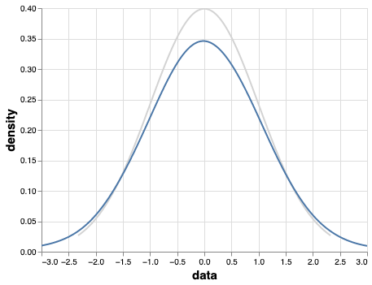
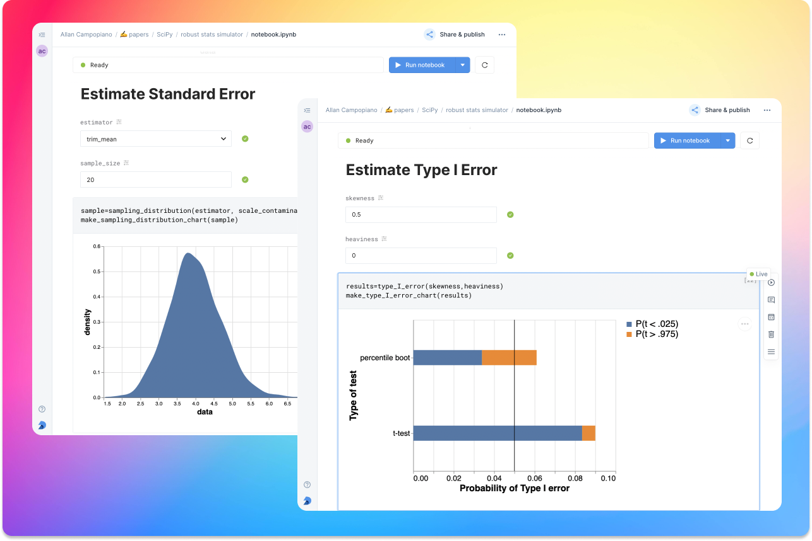

:author: Allan Campopiano
:email: allan@deepnote.com
:bibliography: mybib

----------------------------------------------------
The myth of the normal curve and what to do about it
----------------------------------------------------

.. class:: keywords

   Python, R, robust statistics, bootstrapping, trimmed mean, data science, hypothesis testing

Reliance on the normal curve as a tool for measurement is almost a given.
It shapes our grading systems, our measures of intelligence, and importantly,
it forms the mathematical backbone of many of our inferential statistical
tests and algorithms. Some even call it “God’s curve” for its supposed presence in nature :cite:`micceri1989unicorn`.

Scientific fields that deal in explanatory and predictive statistics make particular use of the normal curve,
often using it to conveniently define thresholds beyond which a result is considered statistically significant
(e.g., t-test, F-test). Even familiar machine learning models have, buried in their guts,
an assumption of the normal curve (e.g., LDA, gaussian naive Bayes, logistic & linear regression).

The normal curve has had a grip on us for some time; the aphorism by :cite:`cramer1946mathematical` still rings true for many today:

    “Everyone believes in the [normal] law of errors, the experimenters because they think it is a mathematical theorem, the mathematicians because they think it is an experimental fact.”

Many students of statistics learn that N=40 is enough to ignore the violation of the assumption of normality.
This belief stems from early research showing that the sampling distribution of the mean quickly approaches normal,
even when drawing from non-normal distributions—as long as samples are sufficiently large. This belief stems from
early research showing that the sampling distribution of the mean quickly approaches normal,
even when drawing from non-normal distributions—as long as samples are sufficiently large. It is
common to demonstrate this result by sampling from uniform and exponential distributions.
Since these look nothing like the normal curve, it was assumed that N=40 must be enough to avoid practical
issues when sampling from other types of non-normal distributions :cite:`wilcox2013introduction`. (Others
reached similar conclusions with different methodology :cite:`gleason1993understanding`.)

Two practical issues have since been identified based on this early research: (1)
The distributions under study were light tailed (they did not produce outliers),
and (2) statistics other than the sample mean were not tested and may behave differently
(e.g., Student’s t). In the half century following these early findings, many important
discoveries have been made :cite:`wilcox2013introduction`. These call into question the usefulness of
the normal curve and will be discussed in the following sections.

The contaminated normal
-----------------------

One of the most striking counterexamples of “N=40 is enough” is shown when sampling from the
so-called contaminated normal :cite:`20000755025`:cite:`tan1982sampling`.
This distribution is also bell-shaped
and symmetrical but it has slightly heavier tails when compared to the standard normal curve.
That is, it contains outliers. Consider the distributions in Figure :ref:`contnorm`. The variance of the
normal distribution is 1 but the variance of the contaminated normal is 10.9!

   Standard normal (orange) and contaminated normal (blue). :label:`contnorm`

Moreover, confidence intervals, based on the sample mean, will be over three times longer
when sampling from the contaminated curve compared to the normal curve. The point
here is that even small departures from normality, especially in the tails,
can have a large impact on commonly used statistics. The problems get even worse when looking
at the effect of contamination on statistical power and effect sizes but these findings are not
discussed in this article. Interested readers should see :cite:`wilcox1992can`.

Perhaps one could argue that the contaminated normal distribution actually represents
an extreme departure from normality and therefore should not be taken seriously; however,
distributions that generate outliers are likely common in practice
(:cite:`hill1982robustness`:cite:`micceri1989unicorn`:cite:`wilcox2009robust`).
A reasonable goal would then be to choose methods that perform well
under such situations and continue to perform well under normality.
In addition, serious issues still exist even when examining
light-tailed and skewed distributions (e.g., lognormal), and statistics
other than the sample mean (e.g., T). These finding will be
discussed in the following section.

Student’s t-distribution
------------------------

Another common statistic is the T-value obtained from Student's t-test.
As will be demonstrated, T is more sensitive to violations
of normality than the sample mean (which has already been shown to not be robust).
This is despite the fact that the t-distribution is also bell shaped, light tailed, and
symmetrical—a close relative of the normal curve.

The assumption is that T follows a t-distribution (and with large samples it approaches normality).
We can test this assumption by generating random samples from a lognormal
distribution. Specifically, 5000 datasets of sample size 20 were randomly drawn
from a lognormal distribution using SciPy's :code:`lognorm.rvs` function.
For each dataset, T was calculated and the resulting t-distribution was plotted.
Figure :ref:`tcurve` shows that the assumption that T follows a t-distribution does not hold.

.. figure:: t.png
   :scale: 50%
   :align: center

   Actual t-distribution (orange) and assumed t-distribution (blue). :label:`tcurve`

One conclusion that can be drawn from this is as follows: When sampling from skewed
distributions (e.g., lognormal), the t-test leads to increased false positive rates
(Type I Error) as seen from the left tails in :ref:`tcurve`.
You can intuit this by comparing the left tails in the chart above. The middle 95% of the blue
curve is much wider than that of the gray curve. Therefore, when we assume the t
distribution in these scenarios, we’re much more likely to incorrectly conclude statistical
significance :cite:`wilcox1998many`.

    “Surely the hallowed bell-shaped curve has cracked from top to bottom. Perhaps,
    like the Liberty Bell, it should be enshrined somewhere as a memorial to
    more heroic days — Earnest Ernest, Philadelphia Inquirer. 10 November 1974. :cite:`fashing1981myth`”

Modern robust methods
---------------------

When it comes to hypothesis testing, an intuitive way of dealing with the issues described
above would be to (1) replace the sample mean (and standard deviation) with
a robust alternative and (2) use a non-parametric resampling technique to
estimate the sampling distribution (rather than assuming a theoretical shape).
Two such candidates are the 20% trimmed mean and the percentile bootstrap test,
both of which have been shown to have practical value when dealing with issues
of outliers and non-normality :cite:`campopiano2018statslab`:cite:`wilcox2013introduction`.

The trimmed mean
****************

The trimmed mean is nothing more than sorting values, removing a proportion from each
tail, and computing the mean on the remaining values. Formally,

- Let :math:`X_1 ... X_n` be a random sample and :math:`X_{(1)} \leq X_{(2)} ... \leq X_{(n)}` be the observations in ascending order
- The proportion to trim is :math:`\gamma (0 \leq \gamma \leq .5)`
- Let :math:`g = \lfloor \gamma n \rfloor`. That is, the proportion to trim multiplied by :math:`n`, rounded down to the nearest integer

Then, in symbols, the trimmed mean can be expressed as follows:

.. math::

   \begin{aligned}
   \bar{X}_t = \frac{X_{(g+1)}+...+X_{(n-g)}}{n-2g}
   \end{aligned}

If the proportion to trim is 0.2, more than twenty percent of the values would
have to be altered to make the trimmed mean arbitrarily large or small.
The sample mean, on the other hand, can be made to go to :math:`\pm\infty` (arbitrarily large or small) by
changing a single value. The trimmed mean is more robust than the sample mean in all measures of
robustness that have been studied :cite:`wilcox2013introduction`. In particular the
20% trimmed mean has been shown to have practical value as it avoids issues
associated with the median (not discussed here)
and still protects against outliers.

The percentile bootstrap test
*****************************

In most traditional parametric tests, there is an assumption that the sampling distribution
has a particular shape (normal, f-distribution, t-distribution, etc).
We use these distributions to test the null hypothesis; however, as
discussed, the theoretical distributions are not approximated well
when even small violations of assumptions occur.
Non-parametric resampling techniques such as bootstrapping and
permutation tests build empirical sampling distributions,
and from these, one can robustly derive p-values and CIs.
One example is the percentile bootstrap test :cite:`efron1992bootstrap`:cite:`tibshirani1993introduction`.

The percentile bootstrap is simply a computational algorithm that uses the data at hand to estimate
the underlying sampling distribution of a statistic (again, rather than assuming it
takes some particular shape).  It works well with small sample sizes,
under normality, under non-normality, and it easily extends to multi-group tests
(ANOVA) and measures of association (correlation, regression).
For a two-sample case, the steps to compute the percentile bootstrap test can be described as follows:

1. Randomly resample with replacement :math:`n` values from group one
2. Randomly resample with replacement :math:`n` values from group two
3. Compute :math:`\bar{X}_1 - \bar{X}_2` based on you new sample (the mean difference)
4. Store the difference & repeat steps 1-3 many times (say, 1000)
5. Consider the middle 95% of all differences (the confidence interval)
6. If the confidence interval contains zero, there is no statistical difference, otherwise, you can reject the null hypothesis (there is a statistical difference)

In the subsequent sections of this paper, software resources will be presented for implementing and teaching robust methods
such as the percentile bootstrap test.

Implementing and teaching modern robust methods
-----------------------------------------------

Despite over a half a century of convincing findings, and thousands of papers, robust
statistical methods are still not widely adopted in applied research
:cite:`erceg2008modern`:cite:`wilcox1998many`.
This may be due to various *false* beliefs. For example,

- Classical methods are robust to violations of assumptions
- Correcting non-normal distributions by transforming the data will solve all issues
- Traditional non-parametric tests are suitable replacements for parametric tests that violate assumptions

Perhaps the most obvious reason for the lack of adoption of modern methods
is a lack of easy-to-use software and training resources. In the following sections,
two resources will be presented—one for implementing robust methods and one for teaching them.

Robust statistics for Python
****************************

Hypothesize is a robust null hypothesis significance testing (NHST) library for
Python :cite:`Campopiano2020`. It is based on Wilcox’s `WRS package <https://dornsife.usc.edu/labs/rwilcox/software>`_ for R
which contains hundreds of functions for computing robust measures of central
tendency and hypothesis testing. At the time of this writing, the WRS library
in R contains many more functions than Hypothesize and its value to researchers
who use inferential statistics cannot be understated. WRS is best experienced
in tandem with Wilcox’s book “Introduction to Robust Estimation and Hypothesis Testing”.

Hypothesize brings many of these functions into the Python library ecosystem with
the goal of lowering the barrier to modern methods—even for those who have not
had extensive training in statistics or coding. Thanks to modern browser-based
compute environments (e.g., `Deepnote <https://deepnote.com/>`_), learning to use Hypothesize is relatively
straightforward. Every statistical test is associated with a hosted interactive notebook,
pre-filled with example data and code. This means that no time is spent
copying and pasting code from docs to a locally managed compute environment.
The library is ready to use immediately.

The API for Hypothesize is organized by single- and two-factor tests, as well as
measures of association. For example, one can compare two independent groups
using the 20% trimmed mean and the percentile bootstrap test as follows
(note that Hypothesize uses the naming conventions found in WRS):

.. code-block:: python

    from hypothesize.utilities import trim_mean
    from hypothesize.compare_groups_with_single_factor \
        import pb2gen
    results=pb2gen(df.column_1, df.column_2, trim_mean)

As shown below, the results are returned as a Python dictionary containing the p-value,
confidence intervals, and other important details.

.. code-block:: python

    { 
    'ci': [-0.22625614592148624, 0.06961754796950131], 
    'est_1': 0.43968438076483285, 
    'est_2': 0.5290985245430996, 
    'est_dif': -0.08941414377826673, 
    'n1': 50, 
    'n2': 50, 
    'p_value': 0.27, 
    'variance': 0.005787027326924963 
    }

For measuring associations, several options exist in Hypothesize. One example is the
Winsorized correlation which is a robust alternative to Pearson’s R. For example,

.. code-block:: python

    from hypothesize.measuring_associations import wincor
    results=wincor(df.column_1, df.column_2, tr=.2)

returns the Winsorized correlation coefficient and other relevant statistics:

.. code-block:: python

    {
    'cor': 0.08515087411576182,
    'nval': 50,
    'sig': 0.558539575073185,
    'wcov': 0.004207827245660796
    }

Robust statistics simulator
***************************

Having a library of robust statistical functions is not enough to make modern methods
commonplace in applied research. Professors, educators, and practitioners still need
intuitive training tools that demonstrate the core issues surrounding classical
methods and how robust analogues compare.

As mentioned, computational notebooks that run in the cloud offer a unique solution to
learning beyond that of static textbooks and documentation. Since narration,
visualization, widgets (e.g., buttons, slider bars), and code can all be
experienced in a ready-to-go compute environment, learning can be interactive
and exploratory—with no overhead related local environment setup.

As a compendium to Hypothesize, and a resource for understanding and teaching robust statistics
in general, the `robust statistics simulator <https://github.com/Alcampopiano/robust_statistics_simulator)>`_
repository has been developed.
It is a notebook-based collection of interactive demonstrations aimed at clearly and visually
explaining the conditions under which classic methods fail relative to robust methods.
A hosted notebook with the rendered visualizations of the
simulations `can be accessed here <https://deepnote.com/workspace/allan-campopiano-4ca00e1d-f4d4-44a2-bcfe-b2a17a031bc6/project/robust-stats-simulator-7c7b8650-9f18-4df2-80be-e84ce201a2ff/%2Fnotebook.ipynb>`_.
and seen in Figure :ref:`sim`.

The robust statistics simulator allows the user to interact with the following parameters:

- Distribution shape
- Level of contamination
- Sample size
- Skew and heaviness of tails

Each of these characteristics can be adjusted independently in order to compare classic
approaches to their robust alternatives. The two measures that are used to evaluate
the performance of classic and robust methods are the standard error and Type I Error.

Standard error is a measure of how much an estimator varies across random samples
from our population. We want to choose estimators that have a low standard error.
Type I Error is also known as False Positive Rate. We want to choose methods that
keep Type I Error close to the nominal rate (usually 0.05). The robust statistics
simulator can guide these decisions by providing empirical evidence as to why
particular estimators and statistical tests have been chosen.

   An example of the robust stats simulator in Deepnote's hosted notebook environment :label:`sim`

Conclusion
----------

This paper gives an overview of the issues associated with the normal curve.
The concern with traditional methods, in terms of robustness to violations of
normality, have been known for over a half century and modern alternatives have
been recommended; however, for various reasons that have been discussed,
modern robust methods have not yet become commonplace in applied research settings.

One reason is the lack of easy-to-use software and teaching resources for robust statistics.
To help fill this gap, Hypothesize, a peer-reviewed and open-source Python library was developed.
In addition, to help clearly demonstrate and visualize the advantages of robust methods,
the robust statistics simulator was created. Using these tools, practitioners can begin
to integrate robust statistical methods into their inferential testing repertoire.

Acknowledgements
----------------

The author would like to Karlynn Chan and Rand R. Wilcox as well
as Elizabeth Dlha and the entire Deepnote team for their support
of this project.