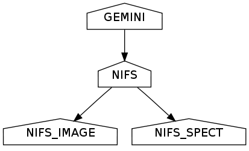
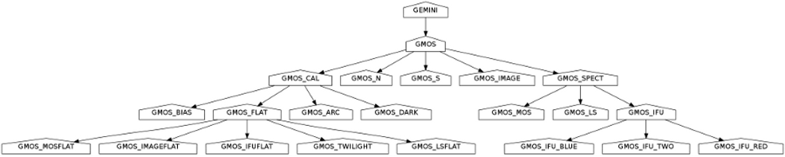
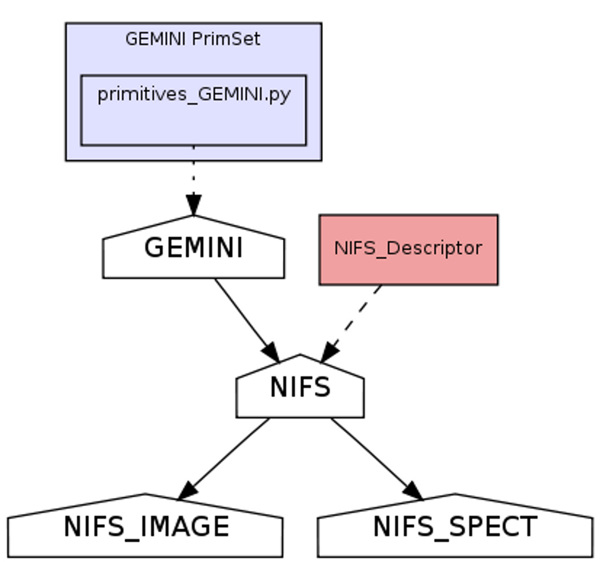
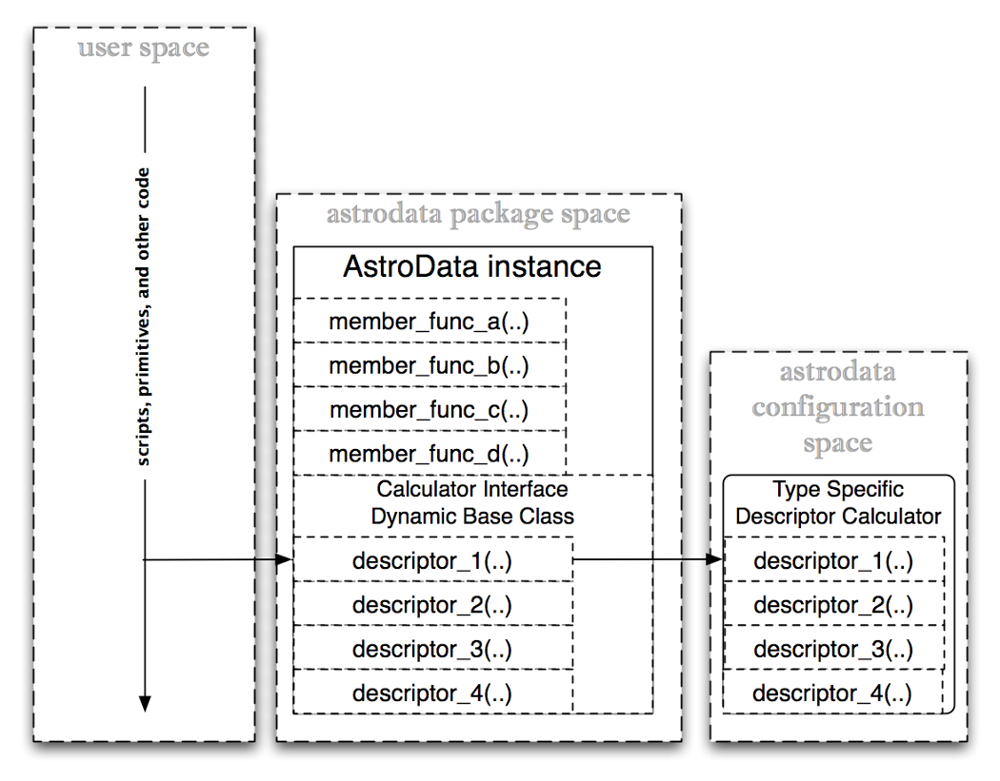

:author: Craig Allen
:email: callen@gemini.edu
:institution: Gemini Observatory

--------------------------------------------------
Astrodata
--------------------------------------------------

.. class:: abstract

    The astrodata package is a part of the Gemini Telescope's python-based Data
    Reduction Suite. It is designed to help us deal in a normalized way with
    data from a variety of instruments and instrument-modes. All Gemini
    specific code configurations are isolated in configuration packages
    separate from the astrodata source.  The configuration packages define a
    lexicon of terms associated with a family of dataset types and implements
    the behaviors associated with each terms.  

.. class:: keywords

    Python, Scientific Computing
    

The Problem Domain: Handling Data Across Instrument-Modes
---------------------------------------------------------

Gemini
======

Gemini Observatory is a multinational partnership which operates two
telescopes, Gemini North from Hilo, Hawaii, and Gemini South from La Serena,
Chile.  We mount multiple instruments simultaneously, and have a suite of
instruments which rotate onto the telescopes periodically.  These instruments
have been made by a variety of different teams and institutions from our
partner countries.

Multi-Extension FITS
====================

Gemini Observatory relies on a file format called "Multi-Extension FITS" (MEF)
format to store all datasets, one standard all instruments obey.  MEF is a
common file format in Astronomy and is an extension of the older "single
extension" FITS file format. Signle extension FITS files consited of a single
expandable ASCII header section and single binary data section. MEF extends
this so that the file appears as a list of such header-data units (HDUs).

The FITS standard contains definitions for standardized metadata in HDU
headers. For example, standard header keys are defined for the telescope,
observer, object name, the RA and DEC, and some other properties one expects to
be associated with an astronomical observation.  There are also suffient
standardized headers to describe the binary data section such as needed to load
it, such as its dimensions and pixel type (if it is pixel data).  However,
many other bits of metadata which are ubiquitous for Gemini data, such as
"gain" and "filter name", do not have standard headers names in the FITS
standard. 

Since the FITS headers are expandable there is ample information in the
datasets to retreive the desired information, but the retrieval is subject to
incidental differences in naming and storage layout. While helpful, the
list-like shape of the associated HDUList is merely one incremental improvement
toward the goal of associating these related HDUs into a cohesive whole. MEF is
limited in this regard by the fact that standard metadata to describe
relationships between extensions have not been developed. Such metadata could
for example introduce a heirarchical relationship and explicit dependencies
among extensions.  Metadata to infer such relationships does exist in the
headers but for the reasons mentioned it tends to be instrument-mode specific.

The problem domain is dominated by processes which are conceptually the same
across instrument-modes from the perspective of the user and scientist, but
which require implementations unique to the instrument-mode.

Removing Incidental Differences
===============================

Our goal with a new abstraction higher than the level of the "HDU list" is to
remove the incidental differences for the user of the new abstraction, and move
handling of the differences into type-specific compartments. Within the
compartments it is safe to make type-specific assumptions and use mode-specific
heuristics without compromising the generality of the system.

We also seek to extend the scopes at which a particular difference can be
considered "incidental". For example, in the case of dataset transformation
(reduction), most instrument-modes involve a step to "subtract the sky".  This
is generally done by taking a picture of the sky near the object and literally
subtracting its pixel values from the exposure.  However, the details of doing
sky subtraction do depend on the particular instrument-mode. There exist
important differences between imaging and spectroscopy, and between different
wavelengths, which means performing this step is type-dependent. 

Nevertheless, at the higher level of consideration, and scientifically, the
step is "the same".  Thus while the differences regarding how one performs the
sky subtraction are not, ultimately, to be accurately described as
"incidental", they can still be generalized over.  At some scopes the
differences are not considered significant so long as they are performed
*properly*.
 
At the same time, we want to maintain flexibility about which scopes we commit
to implementing in either generic or specific ways.  We want safe refactoring
paths available so that we can, for example, safely integrate instrument-mode
specific code into generalized code when possible.  But we also want a system
that allows patching an instrument-mode specific solution over a general
solution that may be failing for that instrument mode, as a quick way to
address problems to for example support time-critical nightime operation. 

These goal are accomplished by the adopting of a core classification system
which is used to assign behavior to dataset types which can be general, e.g.
"GEMINI", or a specific instrument mode, "GMOS_IFU".

Incidental Dataset Differences Normalized
=========================================

* differences in how a dataset is recognized as a particular type
* differences in low level metadata
* differences in the implementation of scientifically similar transformations
* differences in storage structure

The AstroData Class
-------------------

MEF I/O
=======

To load a MEF into an AstroData instance one generally gives the filename to
the AstroData contructor::

    ad = AstroData("trim_gN20091027S0133.fits")
    
The instance, referenced in the ``ad`` variable will have loaded the
extensions' headers and have detected type information. However, the data,
represented as a numpy array, is not loaded until referenced. AstroData relies
on the python Pyfits Library for this low level MEF access. Like the HDUList
object that pyfits returns, the AstroData instance is also iterable, behaving
as though consisting of a collection of AstroData instances, one per HDU in the
MEF.

To iterate over the list one would write a loop as so::

    for ext in ad:
        print ext.infoStr()
                
In this case ``ext`` is also an AstroData instance, created by the
iteration-related members of AstroData. The ``ext`` instance shares its single
HDU member with the original ``ad`` instance, as well as its primary header
unit, but has its own HDUlist object.  This means changes to the shared
information will be reflected in the outer AstroData object, ``ad``, but that
new HDUs appended to ``ext`` would not be appended to ``ad``.

This behavior extends the general behavior of numpy and pyfits, and is
considered desirable so that it is possible to avoid unnecessary copying of
memory, but use of the feature does require care.

The ``__getitem__(..)`` member of AstroData is overridden. It creates and
returns an AstroData instance with a new HDUList containing the HDU(s)
identified in the argument, i.e. ::
 
    adsci = ad["SCI"]
    
This call to ``__getitem__(..)`` uses causes it to use the extension naming
information to find all extensions with the name "SCI", and return an AstroData
instance containing just those found.

Astrodata Grammar
-----------------

Breaking our knowledge of our datasets into parts  involves creating a language
of terms for our family of datasets. The terms defined will belong to a grammar
understood by the astrodata package, of course.  This family of terms, or
language, turns out to be valuable in general as a tool to discuss dataflow,
separately from the implementation details.  It turns out we have good reason
to understand what the terms *mean* prior deciding how they will perform the
action satisfying that meaning.

In practice, the developer of a type-family will work interatively, creating
and testing continually improved versions of their configuration package.  This
sort of iterative "test and refactor" process is well supported by the
astrodata package, and supporting "refactoring paths" is part of our intent.
Conceptually, however, the work to define the meaning of the terms is logically
prior to implementation. These definitions are, in fact, the conceptual
specification for all configuration implementations.

The astrodata grammar is expandable, but at this time consists of three primary
types of term:

* the dataset types: *AstroData Types*

  * e.g. GMOS_SPECT is "a GMOS dataset taken in any spectroscopic mode"

* high level metadata: *Descriptors* 

  * e.g. "filter_name" is "a string value concatenation of all filters
    in the light path during the exposure"
    
* transformations: *Primitives*

  * e.g. "skySubtract" is "a transformation where sky conditions 
    at the time of the observation are
    subtracted from the exposure"

Each of these terms, once defined, will have a specific behavior associated:

* for *AstroData Type*: code to recognize the type of dataset
  based on low level metadata
* for *AstroData Descriptors*: code to calculate and return the
  high level-metadata from the low-level metadata
* for *Primitives*: code to perform the tranformation

AstroData Type
--------------

From the user of astrodata's point of view, AstroData Types are string names
accessed through AstroData members. The objects used to detect the type
criteria and assign the names to the AstroData object are hidden within the
RecipeLibrary which AstroData uses to provide type features.  The
DataClassification objects which load the type definition, also check to see if
it applies to a given HDUList object.

Many features are assigned to datasets by AstroData Type, such that behind a
common name lies implicitly type-specific behavior. Different implementations
of what is conceptually the same descriptor, or primitive, are assigned to the
same descriptor or primitive *name*, meaning the interfaces to invoking them
are regular.  Since the descriptor or high-level metadata system requires the
dataset type to know which particular *descriptor calculator* to load, the type
system cannot in turn rely on high-level metadata to recognize datasets, as
that would be circular. Thus, the classification system uses low level
metadata, ideally from the PHU, which is the 0-th HDU in the HDUList.

A typical type definition is stored as a class descending from astodata's
DataClassification class, allowing  it the ability to overwrite the base
methods if need be. However, the general intention is that in the typical case
the known members of the DataClassification parent are set in the child class
so the definition is essentially a data structure used by the parent class.
Members of DataClassification parent class execute the type check.

Here is a relatively typical type definition from our type library, in this
case for GMOS_IMAGE::

  class GMOS_IMAGE(DataClassification):
    name="GMOS_IMAGE"
    usage = """Any datset from the GMOS_N or GMOS_S
                instruments."""
    parent = "GMOS"
    requirement = ISCLASS("GMOS") & PHU(GRATING="MIRROR")

Name,
=====

The ``name`` member specifies the string name used to identify this type.

Usage
=====

The ``usage`` member is a printable string containing information about the
meaning of the type, used to generate documentation. 

Parent
======

The ``parent`` member is the string name of the parent classification, if any.
The ``parent`` member is used to build the overall classification hierarchy.
This hierarchy is in turn used to resolve conflicts in feature assignments,
children overriding parents.

Requirements
============

The ``requirement`` member contains a single instance of an astrodata
*Requirement* class, which is how the classification actually checks the
dataset in question.  Use Requirement subclasses  for logical operators allows
the appearance of compound requirments using *and*, *or*, and *not*. 

Specific checks are performed by the ISCLASS and PHU Requirement subclasses
which, respectively, check for adherance to another type definition, and check
primary header unit headers for key-value matches.  The all caps naming
convention was adopted to help these classes stand out due to their peculiar
use in the classification definitions.  

PHU Requirements:
~~~~~~~~~~~~~~~~~

The PHU class is a Requirement subclass which ultimately is the workhorse of
the system. Classifications generally resolve to sets of PHU header checks,
since ideally, being the header for the dataset as a whole, the PHU will
contain complete identifying information.  The PHU constructor accepts a
dictionary containing keys and values to check, or will roll one from its
argument list. Values are regular expressions, keys are strings but allow
modifiers to prohibit the specified match or to use regular expressions for
matching keys as well as values.

ISCLASS Requirements:
~~~~~~~~~~~~~~~~~~~~~

ISCLASS in this example is a Requirement subclass which checks that the dataset
in question is also the type named in the ISCLASS constructor argument.  No
hierarchical or other relationships are assumed due to the ISCLASS requirement.
The classification named is considered as merely shorthand for whatever checks
are associated with it.

Often the type specified in an ISCLASS Requirement will in fact be the parent,
but this is not universally true.  For example below, in the case of the base
GMOS instrument type itself, the parent and requirement classes are distinct::

  class GMOS(DataClassification):
    name="GMOS"
    usage = '''
        Applies to all data from either GMOS-North 
        or GMOS-South instruments in any mode.
        '''
    parent = "GEMINI"
    requirement = ISCLASS("GMOS_N") | ISCLASS("GMOS_S")

Since the GMOS type is an abstraction meaning "from either GMOS North or GMOS
South" this appears in the requirements.  However, the parental relationship
cannot be GMOS_N or GMOS_S as parent, because features such as Primitives or
Descriptors, if assigned to GMOS_N, for example, would be intended to override
the GMOS assignments.  Instead, GMOS overrides the instrument-agnostic GEMINI
type, which is therefore given as its explicit parent.

Logical Requirements:
~~~~~~~~~~~~~~~~~~~~~

Three Requirement subclasses execute logical operations to combine other
requirements, AND, OR, and NOT. These each override the "&", "|", and "!"
operators respectively, for convienience. By design the constructors take a
list of requirements to combine logically, though they will, again for
convienience, roll the list from arguments.

Adding New Requirements:
~~~~~~~~~~~~~~~~~~~~~~~~

This general arrangement allows easy addition of other types of requirement
classes. We know, for example, that for some types we must detect we will have
to create an "EHU" requirement object to check headers in data extensions.It
will be a simple matter to add such a class and utlize it in combination with
other requirement subclasses.

The DataClassification classes are passed the pyfits HDUList object to perform
the detection and so have complete access to the dataset. Therefore, a
classification can technically look at any characteristic of the data. However,
by policy, for efficiency reasons we specifically do not look at pixel data.

Examples
========

Access to type (aka "classification") information goes throug the AstroData
instance. The AstroData class relies internally on the Classification Library
to provide type information::

    >>> from astrodata import AstroData
    >>> ad = AstroData("trim_gN20091027S0133.fits")
    >>> ad.types
    ['GEMINI_NORTH', 'GEMINI', 'IMAGE', 'GMOS_N', 
            'GMOS_IMAGE', 'GMOS', 'PREPARED']

Also, a single type can be checked in a call to the "isType" member of
AstroData. The single line replaces groups of conditional checks that otherwise
appear in reduction scripts at Gemini::

    >>> ad.isType("GMOS_IMAGE")
    True

This saves lines in scripts but more importantly, it centralizes the type
checking heuristics.

Gemini Types Trees:
~~~~~~~~~~~~~~~~~~~

The following is a simple type tree for our NIFS instrument (Near-Infrared
Integral Field Spectrometer). It is an example of a minimalist type tree, which
covers only the instrument and its general IMAGE and SPECT modes.

   
   *NIFS Type Tree* A minimal type tree for the NIFS instrument: One each to
   identify the Instrument itself, its imaging and spectroscopic mode, as well
   as the general GEMINI type which acts as NIFS' parent type. :label:`nifs-tree`

The text and detail in Figure :ref:`gmos-tree` will be difficult to read, but I
have included it to shows a more complete tree of types, in this case for GMOS,
the Gemini Multi-Object Spectrometer.

   
   *GMOS Type Tree* This is a fully defined type tree, taken from the Gemini
   AstroData Type Library, the GMOS instrument tree,. :label:`gmos-tree`
  

AstroData Descriptors
---------------------

AstroData *Descriptors* are terms naming high-level metadata which should be
accessible for any dataset in the dataset family, either with generic or
classification-specific calculators. The code implementing descriptors are
functions bundled together in classes called Descriptor Calculators which are
assigned to particular AstroData types.

This design allows a mix of generic and special-case descriptor
implementations, using python's object oriented class definition to inherit
generic implementations while overwriting descriptor functions that require
special processing for that type. 

For example, currently the NIFS descriptor calculator is a single calculator
assigned to all NIFS data. This means this calculator has to handle both
imaging and spectroscopic data.  This can of course be done by placing
type-specific code within conditionals and using AstroData to check
classifications. Still the code can and will get convoluted if the different
types rely on very different methods to return the information.

   *NIFS Type Tree* The simple NIFS type tree showing which type has the
   Descriptor calculator assigned.

If a particular instrument-mode requires a special calculation, and if the
developers do not  want to complicate the more generic code, then another
descriptor calculator descending from the NIFS general descriptor calculator
class would be created, and the descriptor requiring special handling would be
overriden, and this class would be assigned to the type which requires a
special case, e.g. NIFS_SPECT.

Descriptor Calculator Classes
=============================

A descriptor function, associated and named with the official descriptor name,
is implemented as a member function  of a "Descriptor Calculator" (descending
from the astrodata "Calculator" base-class). An instance of the correct
calculator is stored in a private AstroData member, with there being just one
correct calculator for any given AstroData instance. The classification
hierarchy is used if multiple calculator assignments are found to apply to a
dataset. Child nodes override parent nodes, siblings or cousin nodes with
conflicting feature assignments will cause the system to complain and an
exceptions to be thrown.

Interfaces to the descriptor functions are added as members at runtime to the
AstroData instance using metaprogramming techniques. The configuration's
"CalculatorInterface" class is used as an AstroData "base" class at runtime
(this is called a mixin pattern). Currently the class is generated by a script,
but in the future this class will be dynamically generated by the
infrastructure from descriptor metadata. 

After construction of the AstroData instance, descriptors such as ``gain`` and
``filter_name`` are available to call as member functions, e.g.  continuing
from the previous examples::

    gain = ad.gain()  
    
This line will call the correct ``gain`` implementation, having loaded the
correct calculator for the dataset loaded into the "ad" variable.  The
calculator interface is constructed of "thunk" functions which proxy calls to
the calculator and are called for all types of dataset. This makes the
calculator interface a potential place to perform global features such as
validation of descriptor inputs and values or processing globally supported
parameters.  These thunk functions call the appropriate descriptor in the
calculator.

   
   *Descriptor Calls*: The Descriptors are called as members of type-specific
   Descriptor Calculators through the type-agnostic Calculator Interface, which
   is melded into AstroData via metaprogramming techniques. 
 
Examples
========

Correctly defined and assigned descriptors ensure high level metadata can be
retrieved in the same way regardless of datatype, e.g. to retrieve the
filter_name descriptor regardless of dataset type::

    >>> from astrodata import AstroData
    >>> ad = AstroData("trim_gN20091027S0133.fits")
    >>> ad.filter_name()
    'i_G0302'

Descriptors are presented as functions rather than data members to emphasize
that they are indeed functions and to allow arguments which modify the return
value, e.g. to get the filtername without the unique filter ID, filter_name
accepts the "stripID" argument::

    >>> ad.filter_name(stripID=True)
    'i'

Some descriptors apply at the header-data unit level and only work on AstroData
instances with a single extension.  For example, a GMOS image prior to being
mosaic-ed, will have three science extensions, one for each CCD in the GMOS
instruments, and each of these has its own associated gain relating to the amp
it was read out with.  A descriptor will in this case have to return a
collection if asked to return gain for the whole dataset. By default
Descriptors only return single values of a specific type, so gain must return a
double.  In general this is not an issue, since it's more common in such a case
to be iterating over AstroData-wrapped header-data units, in which case one
naturally gets single-HDU AstroData instances::

    >>> for ext in ad["SCI"]:
    ...     print ext.gain()
    ... 
    2.1
    2.337
    2.3
        
Similarly single extension AstroData instances can be picked out of the dataset
by their naming information, if present, or by the integer index::

    >>> gain_sci_1 = ad[("SCI", 1)].gain()
    >>> gain_sci_1
    2.1000000000000001
    >>> gain_1 = ad[0].gain()
    >>> gain_1
    2.1000000000000001

    
To override the default descriptor return type to return collections when
called on a multiple-extension dataset, affected descriptors support "asList"
and "asDict" arguments::

    >>> gainlist = ad.gain(asList=True)
    >>> gainlist
    [2.1000000000000001, 2.3370000000000002, 2.2999999999999998]
    
Lists are returned in order of the extensions for which there is a gain value
(e.g. "SCI" extensions), and dictionaries returned are keyed by the extension
naming information if present, or integer location in the list otherwise.

Primitives
----------

*Primitives* are the third type of term defined in the astrodata grammar.
Primitives name transformations, and conceptually recieve a list of input data
and produce a list of output data. More technically primitives recieve a
*ReductionContext*, and this is what they transform. Thus, strictly speaking
they do not have to transform datasets, and even may not transform the
ReductionContext (i.e. they may perform "the identity transformation").  

The motivation for such primitives is to execute useful code during a
reduction, for example primitives that print information to the log don't
modify the reduction context at all, much less the data in the data stream.
Also, some primitives can make queries about which files to process, and put
these filenames in the datastream. This type of primitive will not have
modified any datasets, but will have modified the reduction context which
contains all information about an ongoing primitive-based reduction.

Nevertheless, most primitives exist to reduce data, so we still think of
primitives as transforming data, and the fact that they actually transform
reduction contexts is a technical detail only sometimes important. As with
descriptors different implementations share a common name. This is so
type-specific implementations can be executed in a regular way at higher scopes
where the differences are not significant so long as incidental differences in
the dataset types are accomodated.

Unlike descriptors, primitives are not added as AstroData members but are
instead arranged into "recipes", which are simple sequential lists of
primitives. As mere lists of steps, *recipes* contain no explicit conditionals.
However, since each primitive executed is guaranteed to load an implimentation
appropriate for the input dataset, recipes have an implicit type-based
conditionality, or "type adaptativity". 

Take for example our "prepare" recipe.  The "prepare" transformation is meant
to take raw data from any instrument and produce a somewhat normalized dataset,
e.g. with standard namings, order, some validation performed, and standard
headers set correctly.

The prepare recipe::

    validateData(repair=True)
    standardizeStructure
    standardizeHeaders
    validateWCS

All Gemini data needs to be "prepared", and this recipe descibes the procedure
for them all. When executing this recipe, a list of files are fed into the
first primitive. This primitive does whatever work on the inputs it is designed
to do, and places its outputs in the reduction context, where they are used as
input for the next step. 

At each step the system checks the AstroData type of the inputs for the
about-to-be-executed step to ensure the correct primitive implementation for
that type is loaded and will be executed. 

Some of the primitives in "prepare" are general purpose primitives, shared by
all Gemini datasets and assigned to the general purpose GEMINI Primitive Set.
For example ``standardizeHeaders`` is a fairly generic operation applying to
all Gemini data.  The meager type-sensitive differences are easilly handled in
a single all purpose primitive.

On the other hand, the ``standardizeStructure`` primitive will not be the same
for all types of dataset, nor even for all the modes within an instrument.  For
example, in the case of SPECT types (spectroscopy), ``standardizeStructure``
will add the appropriate Mask Definition File from our mask definition
database, while the implementation of the same primitive for IMAGE types will
not do this, since that table-HDU does not apply to imaging.

Final Thoughts
--------------

Current and Future Activities
=============================

We are currently deploying the astrodata package internally at Gemini for
development and preliminary dataflow operations. We have a medium term project
to use astrodata's primitive transformation and automation features (aka "the
Recipe System") for Night Time Operations, but this is not in place at the
moment.

The astrodata infrastructure code is largely stable. Though there is ongoing
work, most work finishing the package is going into the astrodata_Gemini
configuration package. Descriptors for all instruments already exist, and we
are creating primitives for the GMOS instrument's imaging mode. We are making
primitives needed by GMOS-imaging as general as possible, and will hopefully
benefit from some momentum as we work through primitive sets for other
instruments and modes.  The type library of any given instrument will be filled
in detail during creation of primitives for the given types. At the moment
there are at least one type for each instrument, and one for their IMAGE and
SPECT modes as applicable. 

A fourth foundational term in the astrodata grammar exists in prototype form
and will be developed in the near future, called "AstroData Structures", used
for validation and also projecting hierarchical structure onto the dataset.

As we develop AstroData and deploy it for Gemini-specific purposes, we are
interested in working with others in the future to extend the system's
infrastructure and to support more types of data with configuration packages
designed to handle other telescope's data.  Anyone interested should contact
Craig Allen, callen@gemini.edu, at Gemini Observatory, Data Processing Software
Group.

Speaking About Data
===================

Creating a language about our data in order to inform the astrodata software
how our data should be organized has already helped us to be more efficient and
apt in our own communication about dataflow, in our design and on our work to
finished parts of the system under development. We can apply terms directly,
because they map one to one with features AstroData can provide.

A large part of the advantage that has emerged from designing the terms and
details within the configuration in the way described is that it focuses us on
concepts first, seperately from implementation.  Recipes, turn out to be good
conceptual lynchpins for human discussion on the type of reduction the recipe
performs. Software engineering details are compartmentalized to other
discussions about how to provide a well defined transformation in the case of a
particular AstroData Type.

Recipes  *support* defining common steps separately from steps that tend to
requiring specialization, but moreover they promote the practice since the
system rewards proper granularity decisions with more effective type
adaptation.  The result is that we are concieving of better ways to describe
transformations and what we are transforming.

Prior to discussing recipes as such, the high concept, four or five step
description of a particlar reduction was hidden somewhat opaquely in the
machinations of the reduction script itself. Such a script will tend to have
the high level concepts obscured by low level software plumbing.  The ability
to describe reductions in terms of reasonably short recipes allows us to focus
on this descriptive level, and yet to know that the recipe discussed in
principle *is actually what is executed*.

Our configurations are becoming not merely where the astrodata software system
is told how to  support a given instrument-mode. They are instead becoming the
official location of such knowledge, because the configurations are largely
human readable, and insofar as otherwise this knowledge is not recorded clearly
in a centralized way, but  lives in the minds and distributed web pages of
Gemini instrument scientists and data analysts.

By inspiring us to think in terms of the abstract concepts behind our data, we
create and benefit from a language about Gemini data.  This in turn is
affecting how we think about our data. In the future, when we have incorporated
the current state of affairs into our AstroData configuration package, I
suspect it will greatly inform how we incorporate new instruments into the
Gemini data family, and to match their new, powerful, observations modes, with
the new powerful data reduction features needed to support them.

Terms
-----

astrodata
    * *astrodata*, uncapitalized, is the astrodata package, i.e. 
      ``import astrodata``
      or "when importing ``astrodata`` the Classification Library will be discovered and
      loaded".
    * *AstroData*, with "CamelCase" names the AstroData class, i.e.e 
      ``ad = AstroData("f.fits")`` or "When loading a MEF into AstroData, the type
      information is always loaded and available after instantiation".
    * *Astrodata*, with an initial capital names the package in a general way, such
      as in a title or description, e.g. "The Astrodata Package can be imported
      using the name, 'astrodata'".

    Note, it's a subtle distinction, and probably best to rely primarily on
    context to know which sense was intended. 
       
HDU
    from pyfits, "Header Data Unit"
    
HDUList
    from pyfits, list-like structure returned from pyfits.open(..), and used
    internally by AstroData as the open file handle.

pyfits
    A library for loading MEF files in python, using numpy for data sections.
    see STScI, http://www.stsci.edu/resources/software_hardware/pyfits

