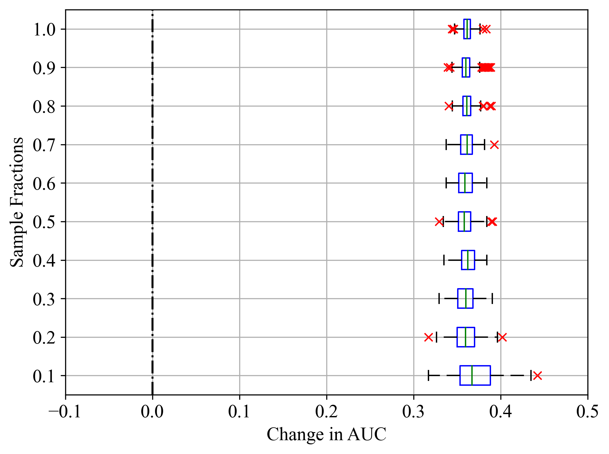
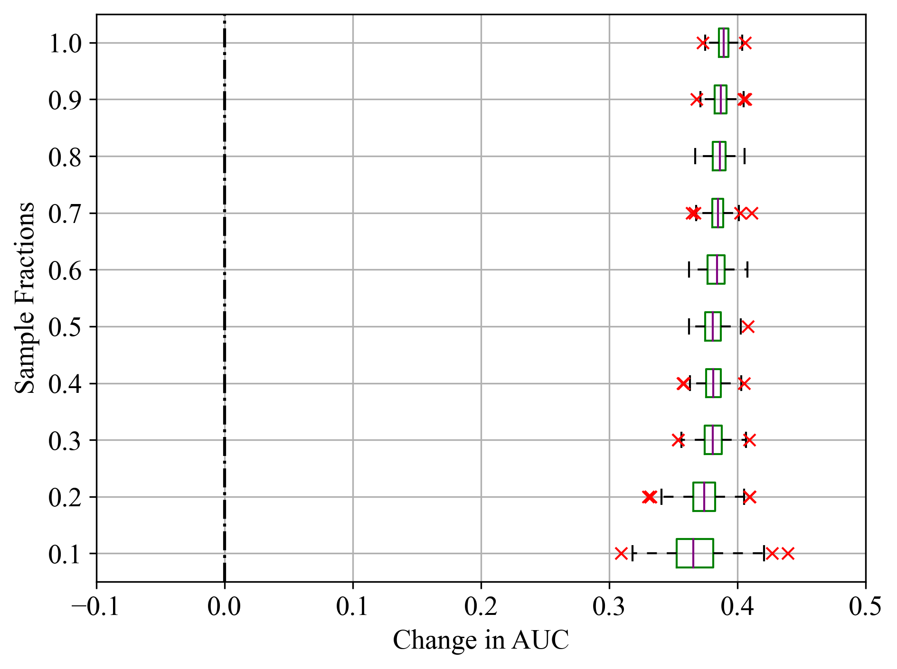
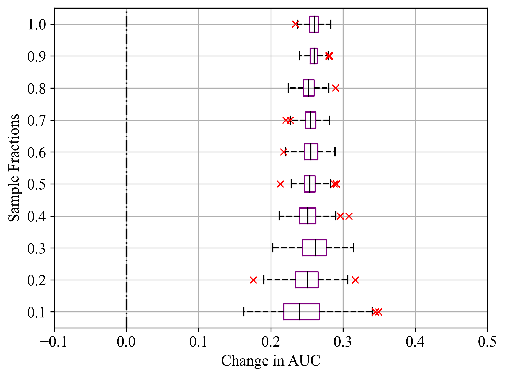

---
# Ensure that this title is the same as the one in `myst.yml`
title: Computational Resource Optimisation in Feature Selection under Class Imbalance Conditions
abstract: |
  Feature selection is crucial for reducing data dimensionality as well as enhancing model interpretability and performance in machine learning tasks. However, selecting the most informative features in large dataset, often incurs high computational costs. This study explores the possibility of performing feature selection on a subset of data to reduce the computational burden. The study uses five real-life datasets with substantial sample sizes and severe class imbalance ratios between 0.09 – 0.18. The results illustrate the stability/variability of feature importance with smaller sample fractions in different models. In this study, LightGBM exhibited the most stable performance, even with reduced sample fractions.

---

# Introduction

In the development of prediction models for real-world applications, two key challenges often arise: high-dimensionality resulting from the numerous features, and class-imbalance due to the rarity of samples in the positive class. Feature selection methods are  utilised to address issues of high-dimensionality by selecting a smaller subset of relevant features, thus reducing noise, increasing interpretability, and enhancing model performance `[@Cai2018; @Dhal2022, @Udu2023]`. 

Studies `[@Matharaarachchi2021; @Tsai2020; @Yin2013; @deHaro-Garcia2020]` on the performance of feature selections methods with class imbalance data have been undertaken on using synthetic and real-life datasets. A significant drawback noted was the computational cost of their approach on large sample sizes.  While experimental investigations of feature selection amid class imbalance conditions have been studied in the literatures, there is a need to further understand the effect of sample size on performance degradation of feature selection methods. This would offer valuable insights into tackling the associated resource expense involved in undertaking feature selection with respect to large sample sizes where class-imbalance exists, for a wide range of applications. 

This study investigates the impact of performing feature selection on a reduced dataset on feature importance and model performance, using five real-life datasets characterised by large sample sizes and severe class imbalance structures. We employ a rigorous feature selection process that utilises permutation feature importance (PFI) and evaluate the feature importance on LightGBM, random forest (RF) and SVM models. Evaluation of the feature importance was assessed using the area under the Receiver Operator Characteristics (ROC) curve, commonly referred to as AUC owing to its suitability in class imbalance problems `[@Luque2019; @Temraz2022]`. The development of the machine learning framework and data visualisation in this study was facilitated by several key Python libraries. Pandas `[@pandas1]` and NumPy `[@numpy]` were used for data loading and numerical computations, respectively. Scikit-learn `[@sklearn1]` provided tools for data preprocessing, model development, and evaluation. Matplotlib `[@matplotlib]` was employed for visualising data structures. Additionally, the SciPy `[@scipy]` library's cluster, spatial, and stats modules were crucial for hierarchical clustering, Spearman rank correlation, and distance matrix computations.

The rest of the paper is organised as follows: Section II briefly outlines the methodology adopted and present the results in Section III presents the results and discussion. The conclusion of the study is provided in Section IV.

# Methodology
## Description of datasets
Five real life datasets from different subject areas were considered in this study. Four of the datasets were obtained from the UC Irvine machine learning repository, including CDC Diabetes Health Indicator, Census Income, Bank Marketing, Statlog (Shuttle) `[@KellyUCI]`.The fifth dataset  is from damage morphology studies, Moisture Absorbed Composite `[@Osa-uwagboe2024]`. The datasets are presented in @tbl:dataset_summary. Notably,  all datasets exhibited high class imbalance ratios from 0.09 to 0.18.

:::{table} Summary of datasets used in the study
:label: tbl:dataset_summary
<table>
  <thead>
    <tr>
      <th>Dataset</th>
      <th style="text-align: center;">Features</th>
      <th style="text-align: center;">Instances</th>
      <th>Subject Area</th>
      <th style="text-align: center;">Imbalance Ratio</th>
    </tr>
  </thead>
  <tbody>
    <tr>
      <td>Diabetes health indicator</td>
      <td style="text-align: center;">20</td>
      <td style="text-align: center;">253,680</td>
      <td>Health and Medicine</td>
      <td style="text-align: center;">0.16</td>
    </tr>
    <tr>
      <td>Census income</td>
      <td style="text-align: center;">14</td>
      <td style="text-align: center;">48,842</td>
      <td>Social Science</td>
      <td style="text-align: center;">0.09</td>
    </tr>
    <tr>
      <td>Bank marketing</td>
      <td style="text-align: center;">17</td>
      <td style="text-align: center;">45,211</td>
      <td>Business</td>
      <td style="text-align: center;">0.13</td>
    </tr>
    <tr>
      <td>Statlog (shuttle)</td>
      <td style="text-align: center;">7</td>
      <td style="text-align: center;">58,000</td>
      <td>Physics and Chemistry</td>
      <td style="text-align: center;">0.18</td>
    </tr>
    <tr>
      <td>Moisture absorbed composite</td>
      <td style="text-align: center;">9</td>
      <td style="text-align: center;">295,461</td>
      <td>Mechanics of Materials</td>
      <td style="text-align: center;">0.11</td>
    </tr>
  </tbody>
</table>
:::

Building data-driven models in the presence of  high dimensionality includes several steps such as data preprocessing, feature selection, model training and evaluation. To address class imbalance issues during model training, an additional resampling step may be performed to adjust the uneven distribution of class samples `[@Udu2024; @REZVANI2023110415; @Udu2023]`. This paper, however, focuses on the feature selection method, model training, and  the evaluation metrics adopted.

##  Feature selection and model training
To maintain a model-agnostic approach that is not confined to any specific ML algorithm, this study employed PFI for feature selection. PFI assesses how each feature affects the model's performance by randomly shuffling the values of a feature and noting the resulting decrease in performance. This technique interrupts the link between a feature and its predicted outcome, thus enabling us determine the extent to which a model relies on a particular feature `[@Li2017; @sklearn1; @Kaneko2022]`. It is noteworthy that the effect of permuting one feature could be negligible when features are collinear,  and thus an important feature may report a low score. To tackle this, a hierarchical cluster on a Spearman rank-order correlation can be adopted, with a threshold taking from visual inspection of the dendrograms in grouping features into clusters and selecting the feature to retain.

# Results and Discussions
Datasets were loaded using pandas, and categorical features were encoded appropriately. The Spearman correlation matrix was computed and then converted into a distance matrix. Hierarchical clustering was subsequently performed using Ward’s linkage method, and  a threshold for grouping features into clusters was determined through visual inspection of the dendrograms, allowing for the selection of features to retain. The hierarchical cluster and spearman’s ranking for moisture absorbed composite dataset is shown in [Fig. 1a](#hiercorr-a) and [b](#hiercorr-b) respectively (Frequency Centroid – FC, Peak Frequency – PF, Rise Time – RT, Initiation Frequency – IF, Average Signal Level – ASL, Duration – D, Counts – C, Amplitude – A and Absolute Energy – AE). Based on the visual inspection of the hierarchical cluster, a threshold of 0.8 was selected, thus, retaining features RT, C, ASL, and FC. 

:::{figure} 
:alt: Hierarchical cluster and Spearman correlation for GSVS
:width: 30%
:align: center
:label: fig:hiercorr
./images/gsvs_hierclus.png
./images/gsvs_cmap.png

Feature relationship for moisture absorbed composite dataset; (a) hierarchical cluster, Spearman correlation ranking.
:::

Subsequently, the investigation proceeded in two steps. In step 1,  the entire samples of the respective dataset was used. The dataset was split into training and test sets based on a test-size of 0.25. The respective classifiers were initialised using their default hyper-parameter settings and fitted on the training data. Thereafter, PFI was computed on the fitted model with number of times a feature is permuted set to 30 repeats. Lastly, the decrease in AUC was evaluated on the test set. @tbl:result_table gives the median and interquartile (IQR) importance scores importance scores based on the decrease in AUC. Values emphasised on the table represent the highest ranked feature for the respective classifier.

In the second step, we initiate three for-loops to handle the different features, fractions of samples, and repetition of the PFI process undertaken in step 1. Sample fraction sizes were taken from 10% – 100% in increments of 10%, with the entire process randomly repeated 10 times. This provided an array of 300 AUC scores for each sample fraction and respective feature of the PFI process. To ensure reproducibility,  the random state for the classifiers, sample fractions, data split, and permutation importance were predefined.  Where possible, computation processes were done in parallel based on a joblib using the Sulis High Performance Computing platform. A sample source code of step 2 is presented:

```python
# Define the function for parallel execution
def process_feature(f_no, selected_features, df):
    for frac in np.round(np.arange(0.1, 1.1, 0.1), 2).tolist():  #loop for sample fractions
        for rand in range(10): #loop for 10 repeats of the process
            df_new = df.sample(frac=frac, random_state=rand)
            X = df_new.drop('label', axis=1)
            X = X.iloc[:, selected_features]
            y = df_new['label']
            X_train, X_val, y_train, y_val = train_test_split(X, y, random_state=rand)
            lgbm = LGBMClassifier(random_state=random_seed, n_jobs=-1)
            model= lgbm.fit(X_train, y_train)                
            r = permutation_importance(model, X_val, y_val, n_repeats=30,
                                       random_state=rand, scoring='roc_auc', n_jobs=-1)
            importances.append(r.importances[f_no])
        fractions.append(frac)
        importances_all.append(importances)
    return final_df
```


As observed in [Fig. 1a](#hiercorr-a), Frequency Centroid and Peak Frequency are in the same cluster with a highly correlated value of 0.957 shown in [Fig. 1b](#hiercorr-b) Similarly, Rise Time and Initiation Frequency are clustered with a highly negative correlation of -0.862. Amplitude and Absolute Energy also exhibited a high positive correlation of 0.981. 

:::{table} Median and IQR importance scores of features.
:label: tbl:result_table
<table border="1">
  <tr>
    <th colspan="11">Census Income</th>    <th> </th>    <th colspan="11">Bank Marketing</th>
  </tr>
  <tr>
    <th colspan="1">ID</th>    <th colspan="1">Feature</th>    <th colspan="3">LightGBM</th>    <th colspan="3">RF</th>    <th colspan="3">SVM</th>    <th></th>    <th colspan="1">ID</th>    <th colspan="1">Feature</th>    <th colspan="3">LightGBM</th>    <th colspan="3">RF</th>    <th colspan="3">SVM</th>
  </tr>
  <tr>
    <th> </th>    <th> </th>     <th>Med</th>    <th colspan="2">IQR </th>    <th>Med</th>    <th colspan="2">IQR </th>    <th>Med</th>    <th colspan="2">IQR </th>    <th> </th>    <th> </th>    <th> </th> 
    <th>Med</th>    <th colspan="2">IQR </th>    <th>Med</th>    <th colspan="2">IQR </th>    <th>Med</th>    <th colspan="2">IQR </th>
  </tr> 
  <tr>
    <th> </th>    <th> </th>     <th> </th>     <th>25<sup>th</sup></th>    <th>75<sup>th</sup></th>    <th> </th>    <th>25<sup>th</sup></th>    <th>75<sup>th</sup></th>    <th> </th>    <th>25<sup>th</sup></th>
    <th>75<sup>th</sup></th>    <th> </th>    <th> </th>    <th> </th>     <th> </th>     <th>25<sup>th</sup></th>    <th>75<sup>th</sup></th>    <th> </th>    <th>25<sup>th</sup></th>    <th>75<sup>th</sup></th>
    <th> </th>    <th>25<sup>th</sup></th>    <th>75<sup>th</sup></th>  </tr>  
<tr>
    <td>0</td>
    <td>Age</td> <td>0.077</td> <td>0.073</td> <td>0.081</td> <td>0.041</td> <td>0.039</td> <td>0.046</td> <td><10<sup>-3</sup></td> <td><10<sup>-3</sup></td> <td><10<sup>-3</sup></td> <td> </td>
    <td>1</td>   <td>Age</td> <td>0.031</td> <td>0.029</td> <td>0.034</td> <th>0.028</th> <th>0.024</th> <th>0.031</th> <td>-0.011</td> <td>-0.014</td> <td>-0.007</td>

 </tr>
 <tr>
    <td>1</td> <td>Work class</td> <td>0.029</td> <td>0.027</td> <td>0.031</td> <td>0.017</td> <td>0.014</td> <td>0.019</td> <td><10<sup>-3</sup></td> <td><10<sup>-3</sup></td> <td><10<sup>-3</sup></td>
    <td></td><td>4</td>
    <td>Job</td>
    <td>0.005</td>    <td>0.003</td>    <td>0.006</td>    <td>0.005</td>    <td>0.003</td>    <td>0.009</td>    <td>-0.001</td>    <td>-0.002</td>    <td>0.001</td>
</tr>
 <tr>
    <td>2</td><td>Final weight</td><td>0.002</td><td>0.001</td><td>0.002</td><td><10<sup>-3</sup></td><td>-0.003</td><td>0.002</td><td>0.004</td><td>-0.002</td><td>0.010</td><td></td>
    <td>6</td><td>Default</td><td>-0.002</td><td>-0.003</td><td><10<sup>-3</sup></td><td><10<sup>-3</sup></td><td><10<sup>-3</sup></td><td>0.001</td><td>0.001</td><td><10<sup>-3</sup></td> <td>0.001</td>
 </tr>
 <tr>
    <td>3</td><td>Education</td><td>0.047</td><td>0.044</td><td>0.049</td><td>0.041</td><td>0.038</td><td>0.047</td><td><10<sup>-3</sup></td><td><10<sup>-3</sup></td><td><10<sup>-3</sup></td><td></td>
    <td>9</td><td>Housing</td><th>0.042</th><th>0.037</th><th>0.044</th><td>0.026</td><td>0.023</td><td>0.028</td><th>0.025</th><th>0.022</th> <th>0.027</th>
 </tr>
 <tr>
    <td>7</td><td>Relationship</td><th>0.104</th><th>0.101</th><th>0.108</th><th>0.097</th><th>0.093</th><th>0.101</th><td><10<sup>-3</sup></td><td><10<sup>-3</sup></td><td><10<sup>-3</sup></td><td></td>
    <td>13</td><td>Day of week</td><td>0.032</td><td>0.029</td><td>0.034</td><td>0.022</td><td>0.019</td><td>0.026</td><td>0.014</td><td>0.010</td> <td>0.017</td>
 </tr>
 <tr>
    <td>8</td><td>Race</td><td>0.003</td><td>0.002</td><td>0.003</td><td>0.001</td><td><10<sup>-3</sup></th><td>0.002</td><td><10<sup>-3</sup></td><td><10<sup>-3</sup></td><td><10<sup>-3</sup></td><td></td>
 </tr>
 <tr>
    <td>10</td><td>Capital-gain</td><td>0.043</td><td>0.042</td><td>0.044</td><td>0.042</td><td>0.040</td><td>0.044</td><th>0.034</th><th>0.031</th><th>0.036</th><td></td>
 </tr>
  <tr>
    <th colspan="23"></th>
  </tr>
  <tr>
    <th colspan="11">Statlog (Shuttle)</th>
    <th> </th>
    <th colspan="11">Diabetes</th>
  </tr>
   <tr>
     <td>0</td><td>Rad Flow</td><th>0.355</th><th>0.350</th><th>0.360</th><th>0.387</th><th>0.383</th><th>0.389</th><td>0.253</td><td>0.249</td><td>0.259</td><td></td>
    <td>0</td><td>HighBP</td><th>0.128</th><th>0.127</th><th>0.129</th><th>0.128</th><th>0.128</th><th>0.130</th><th>0.066</th><th>0.065</th><th>0.067</th>
  </tr>
  <tr>
    <td>1</td><td>Fpv Close</td><td>0.005</td><td>0.005</td><td>0.005</td><td>0.012</td><td>0.011</td><td>0.013</td><td><10<sup>-3</sup></td><td><10<sup>-3</sup></td><td>0.001</td>
    <td></td><td>2</td><td>CholCheck</td><td>0.009</td><td>0.009</td><td>0.010</td><td>0.011</td><td>0.010</td><td>0.011</td><td>-0.001</td><td>-0.001</td><td>-0.001</td>
  </tr>
  <tr>
    <td>2</td><td>Fpv Open</td><td>0.241</td><td>0.239</td><td>0.244</td><td>0.274</td><td>0.270</td><td>0.277</td><th>0.319</th><th>0.316</th><th>0.322</th>
    <td></td><td>3</td><td>BMI</td><td>0.080</td><td>0.078</td><td>0.081</td><td>0.079</td><td>0.077</td><td>0.080</td><td>-0.073</td><td>-0.074</td><td>-0.072</td>
  </tr>
  <tr>
  <td colspan="11"></td><td></td><td>4</td><td>Smoker</td><td>0.004</td><td>0.004</td><td>0.005</td><td>0.004</td><td>0.004</td><td>0.005</td><td>0.026</td><td>0.025</td><td>0.027</td>
  </tr>

  <tr>
  <td colspan="23"
  </tr>
  
  <tr>
  <th colspan="11">Moisture Absorbed Composites</th>
  </tr>

  <tr>
   <td>0</td><td>Risetime</td> <td>0.005</td>    <td>0.005</td>    <td>0.005</td>    <td>0.009</td>    <td>0.008</td>    <td>0.009</td><td>0.004</td><td>0.003</td><td>0.004</td>
  </tr>
  <tr>
   <td>1</td><td>Counts</td>    <td>0.037</td>    <td>0.037</td>    <td>0.037</td>    <td>0.075</td>    <td>0.073</td>    <td>0.075</td>    <td>0.009</td>    <td>0.009</td>    <td>0.009</td>
  </tr>
  <tr> 
   <td>4</td>    <td>ASL</td>    <td>0.034</td>    <td>0.034</td>    <td>0.034</td>    <td>0.072</td>    <td>0.071</td>    <td>0.073</td>    <td><10<sup>-3</sup></td> <td><10<sup>-3</sup></td>    <td><10<sup>-3</sup></td>

  </tr>
  <tr> 
   <td>7</td>    <td>Freq. Centroid</td>    <th>0.468</th>    <th>0.466</th>    <th>0.470</th>    <th>0.463</th>    <th>0.461</th>    <th>0.465</th>    <th>0.422</th> <th>0.421</th>    <th>0.425</th>

  </tr>
</table>


:::
From @tbl:result_table, SVM tended to be have very low scores in some datasets, possibly due to its reliance of support vectors in determining the decision boundaries. Thus, features with strong influence at the decision boundary but not directly affecting the support vectors may seem less important.   For the Moisture Absorbed Composite dataset, the three classifiers reported similar scores for Frequency Centroid of 0.468, 0.466 and 0.422 respectively in @tbl:result_table. 

However, in Bank Marketing dataset, LightGBM and RF identified Feature 1 as a relatively important feature, while SVM considered it insignificant. The mutability of importance scores for the classifiers considered underscores the need to explore multiple classifiers when undertaking a comprehensive investigation of feature importance for feature selection purposes. 

:::{figure} 
:alt: Sample fractions and corresponding decrease in AUC for Final Weight feature of Census Income dataset
:width: 20%
:align: center
:label: fig:ci_boxplot
(ci_boxplot-a)=

(ci_boxplot-b)=

(ci_boxplot-c)=

Sample fractions and corresponding decrease in AUC for Final Weight feature of Census Income dataset; (a) LightGBM, (b) RF, and (c) SVM.
:::

:::{figure} 
:alt: Sample fractions and corresponding decrease in AUC for Day of Week feature of Bank Marketing dataset
:width: 20%
:align: center
:label: fig:bm_boxplot
(bm_boxplot-a)=

(bm_boxplot-b)=

(bm_boxplot-c)=

Sample fractions and corresponding decrease in AUC for Day of Week feature of Bank Marketing dataset; (a) LightGBM, (b) RF, and (c) SVM.
:::

:::{figure} 
:alt: Sample fractions and corresponding decrease in AUC for Rad Flow feature of Statlog
:width: 20%
:align: center
:label: fig:ss_boxplot
(ss_boxplot-a)=

(ss_boxplot-b)=

(ss_boxplot-c)=

Sample fractions and corresponding decrease in AUC for Rad Flow feature of Statlog (Shuttle) dataset; (a) LightGBM, (b) RF, and (c) SVM.
:::

[Fig. 2a](#ci_boxplot-a) - [c](#ci_boxplot-c) present the PFI for Final Weight feature of Census Income dataset, evaluated across different sample fractions using LightGBM, RF, and  SVM models, respectively. The decrease in AUC indicates the impact on model performance when Final Weight feature is permuted.  Generally, for smaller sample fractions, there was a higher variability in AUC and prominence of outliers. This could be attributed to the increased influence of randomness, fewer data points, and sampling fluctuations for smaller sample fractions across the datasets. It is noteworthy that reduced fractions also incur sample rarity effects of class imbalance data, which include a low stability of evaluation performance.

For LightGBM model in [Fig. 2a](#ci_boxplot-a), the median decrease in AUC was close to  zero,  indicating that Final Weight had minimal impact on model performance, as noted in @tbl:result_table. Similar results were recorded in [Fig. 3a](#bm_boxplot-a) - [c](#bm_boxplot-c) for the Day of Week feature of Bank Marketing dataset, where all models exhibited similarly high feature importance scores on the Day of Week feature. Even for sample fractions of 0.5, LightGBM appeared to give similar importance scores to using the entire data sample. RF showed moderate variability and  outliers  in certain features, indicating  an occasional significant impact when features are permuted. On the other hand, SVM exhibited a higher median decrease in AUC, indicating that the Final Weight feature had a more significant impact on its performance. Additionally, SVM showed the greatest variability and the most prominent outliers, particularly at lower sample fractions. This was noticeable in [Fig. 4a](#ss_boxplot-a) - [c](#ss_boxplot-c), where all classifiers reported similar importance scores as noted in @tbl:result_table. This variability and the presence of outliers suggest that the model's performance is less stable when features are permuted. 

PFI can provide insights into the importance of features, but it is susceptible to variability, especially with smaller sample sizes. Thus, complementary feature selection methods, could be explored to validate feature importance. Future work could investigate the variability of features under particular models and sample sizes, with a view to evolving methods of providing a more stable information to the models. 

# Conclusion
Feature selection for large datasets incurs considerable computational cost in the model development process of various machine learning tasks. This study aimed to optimise computational costs by investigating the influence of sample fractions on feature importance and model performance in datasets characterised by class imbalance. Five real-life datasets with large sample sizes from different subject fields which exhibited high class imbalance ratios of 0.09 – 0.18 were utilised. 

Due to its model-agnostic nature, PFI was adopted for feature selection process. Cluster, spatial, and stats sub-packages of SciPy were instrumental in tackling the multicollinearity effects associated with PFI. Using a rigorous PFI approach, the study revealed the variability of feature importance with smaller sample fractions in LightGBM, random forest and SVM models. LightGBM demonstrated  the most stability, even with smaller sample fractions, suggesting its relative robustness to sample size and permutation across the features and class-imbalanced datasets. SVM exhibited a high variability in feature importance and prominence of outliers.

Other feature selection methods such as shapely additive explanations, could be explored to cross-validate the importance of features. An understanding of the variability of feature importance can inform feature engineering efforts that provides means of alleviating the variability of feature importance in sample samples fractions under class imbalance conditions.

# Acknowledgement
This work was supported by the Petroleum Technology Development Fund under grant PTDF/ED/OSS/PHD/AGU/1076/17 and NISCO UK Research Centre. Computations were  performed using the Sulis Tier 2 HPC platform hosted by the Scientific Computing Research Technology Platform at the University of Warwick. Sulis is funded by EPSRC Grant EP/T022108/1 and the HPC Midlands+ consortium.

# Supplementary Material
Supplementary material is available at [Github.com/AmadiGabriel](https://github.com/AmadiGabriel).
