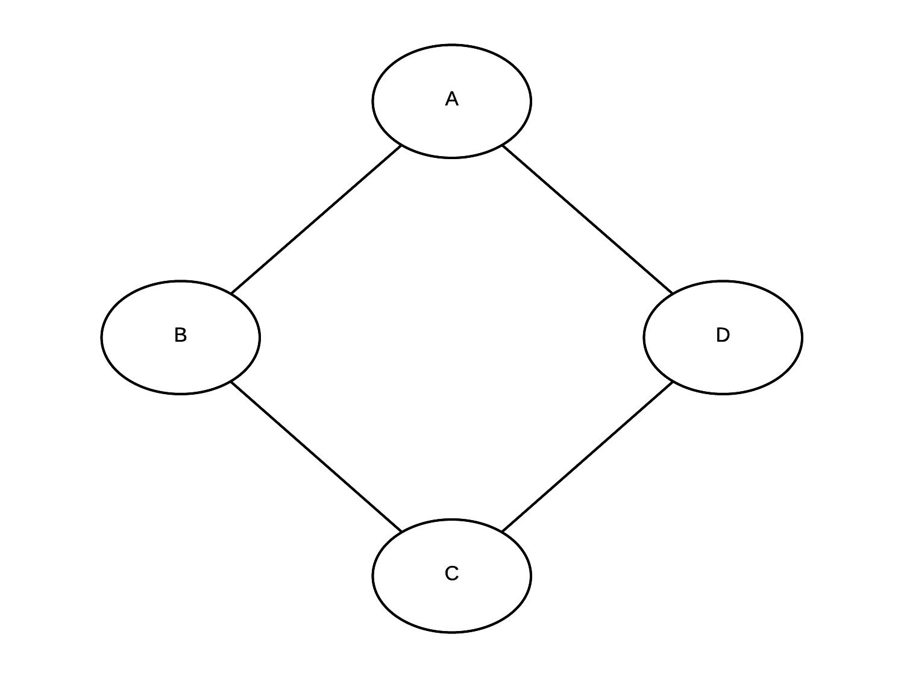

:author: Ankur Ankan
:email: ankurankan@gmail.com

:author: Abinash Panda
:email: mailme.abinashpanda@gmail.com

--------------------------------------------------
pgmpy: Probabilistic Graphical Models using Python
--------------------------------------------------

.. class:: abstract

   Probabilistic Graphical Models (PGM) is a technique of compactly representing   
   a joint distribution by exploiting dependencies between the random variables.     
   It also allows us to do inference on joint distributions in a computationally 
   cheaper way than the traditional methods. PGMs are widely used in the field 
   of speech recognition, information extraction, image segmentation, modelling 
   gene regulatory networks. 
   
   pgmpy [pgmpy]_ is a python library for working with graphical models. It allows the 
   user to create their own graphical models and answer inference or map queries over 
   them. pgmpy has implementation of many inference algorithms like 
   VariableElimination, Belief Propagation etc.

   This paper first gives a short introduction to PGMs and various other python
   packages available for working with PGMs. Then we discuss about creating and
   doing inference over Bayesian Networks and Markov Networks using pgmpy.

.. class:: keywords

   Graphical Models, Bayesian Networks, Markov Networks, Variable Elimination

Introduction
------------

Probabilistic Graphical Model (PGM) is a technique of representing Joint
Distributions over random variables in a compact way by exploiting the 
dependencies between them. PGMs use a network structure to encode the
relationships between the random variables and some parameters to represent
the joint distribution.

There are two major types of Graphical Models: Bayesian Networks and Markov Networks.

.. figure:: figure1.png
   :scale: 100%
   :align: center
   :figclass: w

   Student Model: A simple Bayesian Network. :label:`bayesian`

Bayesian Network: A Bayesian Network consists of a directed graph and a 
conditional probability distribution associated with each of the random variables. A 
Bayesian network is used mostly when there is a causal relationship between the
random variables. An example of a Bayesian Network representing a student [student]_ taking 
some course is shown in Fig :ref:`bayesian`.

   A simple Markov Model :label:`markov`

Markov Network: A Markov Network consists of an undirected graph and a few 
Factors are associated with it. Unlike Conditional Probability Distributions, a Factor
does not represent the probabilities of variables in the network; instead it represents 
the compatibility between random variables that is how much a particular state
of a random variable likely to agree with the another state of some other random
variable. An example of markov [markov]_ network over four friends A, B, C, D agreeing to
some concept is shown in Fig :ref:`markov`.

There are numerous open source packages available in Python for working with graphical 
models. ebay's  bayesian-belief-networks [bbn]_ mostly focuses on Bayesian Models and 
has implementation of a limited number of inference algorithms. Another package pymc [pymc]_
focuses mainly on Markov Chain Monte Carlo (MCMC) method. libpgm [libpgm]_ also mainly focuses
on Bayesian Networks.

pgmpy tries to be a complete package for working with graphical models and gives 
the user full control on designing the model. The source code is very well documented
with proper docstrings and doctests for each method so that users can quickly get upto speed. 
Also pgmpy provides easy extensibility and the user can write his own inference algorithms or 
elimination order algorithms without actually needing to get familiar with the source code.
 
Getting Source Code and Installing
----------------------------------
pgmpy is released under MIT Licence and is hosted on github. We can simply clone the repository 
and install it::

    git clone https://github.com/pgmpy/pgmpy
    cd pgmpy
    [sudo] python3 setup.py install

Dependencies: pgmpy runs only on python3 and is dependent on networkx, numpy, pandas and scipy
which can be installed using pip or conda as::

    pip install -r requirements.txt

or::

    conda install --file requirements.txt

Creating Bayesian Models using pgmpy
------------------------------------

A Bayesian Network consists of a directed graph which connect the random variables based on
the relation between them. It is parameterized using Conditional Probability Distributions(CPD).
Each random variable in a Bayesian Network has a CPD associated with it. If the random varible 
has parents in the network then the CPD represents :math:`P(var| Par_{var})` i.e. the probability
of that variable given its parents. In the case when the random variable has no parents it 
simply represents :math:`P(var)` i.e. the probability of that variable.

We can take the example of the CPD for the random variable grade in the student model of Fig :ref:`bayesian`.
A possible CPD for the grade variable is shown in Table :ref:`CPT`.

.. table:: Conditional Probability Table. :label:`CPT`

   +-------------------+------------+-------------+-----------+-----------+
   | Intelligence (I)  |:math:`i^0` |:math:`i^0`  |:math:`i^1`|:math:`i^1`|
   +-------------------+------------+-------------+-----------+-----------+
   | Difficulty (D)    |:math:`d^0` |:math:`d^1`  |:math:`d^0`|:math:`d^1`|
   +===================+============+=============+===========+===========+
   | :math:`g^0`       |    0.3     |    0.05     |   0.9     |   0.5     |
   +-------------------+------------+-------------+-----------+-----------+
   | :math:`g^1`       |    0.4     |    0.25     |   0.08    |   0.3     |
   +-------------------+------------+-------------+-----------+-----------+
   | :math:`g^2`       |    0.3     |    0.7      |   0.02    |   0.2     |
   +-------------------+------------+-------------+-----------+-----------+

We can represent the CPD shown in Table :ref:`CPT` in pgmpy as follows:

.. code-block:: python

   from pgmpy.factors import TabularCPD
   grade_cpd = TabularCPD(
		   variable='G',
		   variable_card=3,
                   values=[[0.3, 0.05, 0.9, 0.5],
                           [0.4, 0.25, 0.08, 0.3],
                           [0.3, 0.7, 0.02, 0.2]],
                   evidence=['I', 'D'],
                   evidence_card=[2, 2])

Now, coming back to defining a model using pgmpy. The general workflow for defining a
model in pgmpy is to first define the network structure and then add the parameters 
to it. We can create the student model shown in Fig :ref:`bayesian` in pgmpy as follows:

.. code-block:: python

   from pgmpy.models import BayesianModel
   from pgmpy.factors import TabularCPD
   student_model = BayesianModel([('D', 'G'), 
                                  ('I', 'G'), 
                                  ('G', 'L'),
                                  ('I', 'S')])
   grade_cpd = TabularCPD(
                   variable='G',
	           variable_card=3,
                   values=[[0.3, 0.05, 0.9, 0.5],
                           [0.4, 0.25, 0.08, 0.3],
                           [0.3, 0.7, 0.02, 0.2]],
                   evidence=['I', 'D'],
                   evidence_card=[2, 2])
   difficulty_cpd = TabularCPD(
		   variable='D',
                   variable_card=2,
                   values=[[0.6, 0.4]])
   intel_cpd = TabularCPD(
                   variable='I',
                   variable_card=2,
                   values=[[0.7, 0.3]])
   letter_cpd = TabularCPD(
                   variable='L',
                   variable_card=2,
                   values=[[0.1, 0.4, 0.99],
                           [0.9, 0.6, 0.01]],
                   evidence=['G'],
                   evidence_card=[3])
   sat_cpd = TabularCPD(
                   variable='S',
                   variable_card=2,
                   values=[[0.95, 0.2],
                           [0.05, 0.8]],
                   evidence=['I'],
                   evidence_card=[2])
   student_model.add_cpds(grade_cpd, difficulty_cpd, 
                          intel_cpd, letter_cpd, 
                          sat_cpd)

The network structure of a Graphical Model encodes the independence conditions between the 
random variables. pgmpy also has methods to determine the local independencies, D-Separation,
converting to a markov model etc. A few example are shown below:

.. code-block:: python

   student_model.get_cpds()
   [<TabularCPD representing P(G:3 | I:2, D:2) 
				at 0x7f196c0b27b8>,
    <TabularCPD representing P(D:2) at 0x7f196c0b2828>,
    <TabularCPD representing P(I:2) at 0x7f196c0b2908>,
    <TabularCPD representing P(L:2 | G:3) 
                                at 0x7f196c0b2978>,
    <TabularCPD representing P(S:2 | I:2) 
                                at 0x7f196c0b27f0>]

   student_model.active_trail_nodes('D')
   {'D', 'G', 'L'}

   student_model.local_independencies('G')
   (G _|_ S | D, I)

   student_model.get_independencies()
   (S _|_ I, G, L | D)
   (S _|_ D, I | G)
   (S _|_ D, I, G | L)
   (D _|_ G, L | S)
   (D _|_ I, S | G)
   (D _|_ G, L | I)
   (D _|_ G, I, S | L)
   (G _|_ D, I, L | S)
   (G _|_ I, L, S | D)
   (G _|_ D, L | I)
   (G _|_ D, I, S | L)
   (I _|_ G, L | S)
   (I _|_ G, S, L | D)
   (I _|_ D, S | G)
   (I _|_ D, G, S | L)
   (L _|_ D, G, I | S)
   (L _|_ G, I, S | D)
   (L _|_ D, G | I)

   student_model.to_markov_model()
   <pgmpy.models.MarkovModel.MarkovModel 
                                at 0x7f196c0b2470>

Creating Markov Models in pgmpy
-------------------------------

A Markov Network consists of an undirected graph which connects the random variables according to 
the relation between them. A markov network is parameterized by factors which represent the likelihood
of a state of one variable to agree with some state of other variable. 

We can take the example of a Factor over variables A and B in the network shown in Fig :ref:`markov`.
A possible Factor over variables A and B is shown in Table :ref:`FactorAB`.

.. table:: Factor over variables A and B. :label:`FactorAB`

   +-----------+-----------+-------------------+
   |  A        |  B        | :math:`\phi(A, B)`|
   +===========+===========+===================+
   |:math:`a^0`|:math:`b^0`| 30                |
   +-----------+-----------+-------------------+
   |:math:`a^0`|:math:`b^1`| 5                 |
   +-----------+-----------+-------------------+
   |:math:`a^1`|:math:`b^0`| 1                 |
   +-----------+-----------+-------------------+
   |:math:`a^1`|:math:`b^1`| 10                |
   +-----------+-----------+-------------------+

We can represent this Factor in pgmpy as follows:

.. code-block:: python

   from pgmpy.factors import Factor
   phi_a_b = Factor(varibales=['A', 'B'], 
                    cardinality=[2, 2], 
                    value=[100, 5, 5, 100])

.. table:: Factor over variables B and C. :label:`FactorBC`

   +-----------+-----------+-------------------+
   |  B        |  C        | :math:`\phi(B, C)`|
   +===========+===========+===================+
   |:math:`b^0`|:math:`c^0`| 100               |
   +-----------+-----------+-------------------+
   |:math:`b^0`|:math:`c^1`| 1                 |
   +-----------+-----------+-------------------+
   |:math:`b^1`|:math:`c^0`| 1                 |
   +-----------+-----------+-------------------+
   |:math:`b^1`|:math:`c^1`| 100               |
   +-----------+-----------+-------------------+

.. table:: Factor over variables C and D. :label:`FactorCD`

   +-----------+-----------+-------------------+
   |  C        |  D        | :math:`\phi(C, D)`|
   +===========+===========+===================+
   |:math:`c^0`|:math:`d^0`| 1                 |
   +-----------+-----------+-------------------+
   |:math:`c^0`|:math:`d^1`| 100               |
   +-----------+-----------+-------------------+
   |:math:`c^1`|:math:`d^0`| 100               |
   +-----------+-----------+-------------------+
   |:math:`c^1`|:math:`d^1`| 1                 |
   +-----------+-----------+-------------------+

.. table:: Factor over variables D and A. :label:`FactorDA`

   +-----------+-----------+-------------------+
   |  D        |  A        | :math:`\phi(D, A)`|
   +===========+===========+===================+
   |:math:`d^0`|:math:`a^0`| 100               |
   +-----------+-----------+-------------------+
   |:math:`d^0`|:math:`a^1`| 1                 |
   +-----------+-----------+-------------------+
   |:math:`d^1`|:math:`a^0`| 1                 |
   +-----------+-----------+-------------------+
   |:math:`d^1`|:math:`a^1`| 100               |
   +-----------+-----------+-------------------+		

Assuming some other possible factors as in Table :ref:`FactorBC`, :ref:`FactorCD` and :ref:`FactorDA`, we can define the complete
markov model as:

.. code-block:: python

   from pgmpy.models import MarkovModel
   from pgmpy.factors import Factor
   model = MarkovModel([('A', 'B'), ('B', 'C'),
                        ('C', 'D'), ('D', 'A')])
   factor_a_b = Factor(variables=['A', 'B'], 
                       cardinality=[2, 2], 
                       value=[100, 5, 5, 100])
   factor_b_c = Factor(variables=['B', 'C'], 
                       cardinaity=[2, 2], 
                       value=[100, 3, 2, 4])
   factor_c_d = Factor(variables=['C', 'D'], 
                       cardinality=[2, 2], 
                       value=[3, 5, 1, 6])
   factor_d_a = Factor(variables=['D', 'A'], 
                       cardinality=[2, 2], 
                       value=[6, 2, 56, 2])
   model.add_factors(factor_a_b, factor_b_c, 
                     factor_c_d, factor_d_a)

Similar to Bayesian Networks, pgmpy also has the feature for computing independencies,
converting to Bayesian Network etc in the case of Markov Networks.

.. code-block:: python

   model.get_local_independencies()
   (D _|_ B | C, A)
   (C _|_ A | D, B)
   (A _|_ C | D, B)
   (B _|_ D | C, A)

   model.to_bayesian_model()
   <pgmpy.models.BayesianModel.BayesianModel 
                                at 0x7f196c084320>

   model.get_partition_function()
   10000

Doing Inference over models
---------------------------
pgmpy support various Exact and Approximate inference algorithms. Generally, to perform 
inference over models we need to first create an inference object by passing the model to the
inference class. Once an inference object is instantiated, we can call either query method
to find the probability of some variable given evidence, or else map_query
method to know the state of the variable having maximum probability.
Let's perform inference on the student model (Fig :ref:`bayesian`)
using variable elimination :

.. code-block:: python

   from pgmpy.inference import VariableElimination
   student_infer = VariableElimination(student_model)
   prob_G = student_infer.query(variables='G')
   print(prob_G['G'])
   G       phi(G)
   G_0     0.4470
   G_1     0.2714
   G_2     0.2816

   prob_G = student_infer.query(
                    variables='G', 
                    evidence=[('I', 1), ('D', 0)])
   print(prob_G['G'])
   G       phi(G)
   G_0     0.0500
   G_1     0.2500
   G_2     0.7000

   student_infer.map_query(variables='G')
   {'G': 0}

   student_infer.map_query(
                    variables='G', 
                    evidence=[('I', 1), ('D', 0)])
   {'G': 2}

Fit and Predict Methods
-----------------------
In a general machine learning task we are given some data from which we want to compute
the parameters of the model. pgmpy simplifies working on these problems by providing 
fit and predict methods in the models. fit method accepts the given data as a pandas 
DataFrame object and learns all the parameters from it. The predict method also 
accepts a pandas DataFrame object and predicts values of all the missing variables using
the model. An example of fit and predict over the student model using some randomly 
generated data:

.. code-block:: python

   from pgmpy.models import BayesianModel
   import pandas as pd
   import numpy as np

   # Considering that each variable have only 2 states,
   # we can generate some random data.
   raw_data = np.random.randint(low=0, 
                                high=2, 
                                size=(1000, 5))
   data = pd.DataFrame(raw_data, 
		       columns=['D', 'I', 'G', 
                                'L', 'S'])
   data_train = data[: int(data.shape[0] * 0.75)]

   student_model = BayesianModel([('D', 'G'), 
                                  ('I', 'G'), 
                                  ('I', 'S'), 
                                  ('G', 'L')])
   student_model.fit(data_train)
   student_model.get_cpds()
   [<TabularCPD representing P(C:2) at 0x7f195ee5e400>,
    <TabularCPD representing P(A:2) at 0x7f195ee5e518>,
    <TabularCPD representing P(D:2) at 0x7f195ee5e2b0>,
    <TabularCPD representing P(F:2) at 0x7f195ee5e320>,
    <TabularCPD representing P(P:2 | F:2, A:2, L:2) 
                                    at 0x7f195ed620f0>,
    <TabularCPD representing P(L:2 | C:2, D:2) 
                                    at 0x7f195ed62048>]

   data_test = data[0.75 * data.shape[0] : data.shape[0]]
   data_test.drop('P', axis=1, inplace=True)
   student_model.predict(data_test)
        P
   750  0
   751  0
   752  1
   753  0
   ..  ..
   996  0
   997  0
   998  0
   999  0
   
   [250 rows x 1 columns]

Extending pgmpy
---------------
One of the main features of pgmpy is its extensibility. It has been built in a way so that 
new algorithms can be directly written without needing to get familiar with the code base. 

For example, for writing any new inference algorithm we can simply inherit the Inference class. 
Inheriting this base inference class exposes three variables to the class: self.variables,
self.cardinalities and self.factors; using these variables we can write our own 
inference algorithm. An example is shown:

.. code-block:: python

   from pgmpy.inference import Inference
   class MyNewInferenceAlgo(Inference):
       def print_variables(self):
           print('variables: ', self.variables)
           print('cardinality: ', self.cardinalities)
           print('factors: ', self.factors)

   infer = MyNewInferenceAlgo(
		student_model).print_variables()
   variables: ['S', 'D', 'G', 'I', 'L']
   cardianlity: {'D': 2, 'G': 3, 'I': 2, 
                 'S': 2, 'L': 2}
   factors: defaultdict(<class 'list'>, 
   {'D': [<Factor representing phi(D:2) 
			at 0x7f195ed61c18>, 
          <Factor representing phi(G:3, D:2, I:2) 
                        at 0x7f195ed61cf8>], 
    'I': [<Factor representing phi(S:2, I:2) 
                        at 0x7f195ed61a58>, 
          <Factor representing phi(G:3, D:2, I:2) 
                        at 0x7f195ed61cf8>, 
          <Factor representing phi(I:2) 
                        at 0x7f195ed61e10>], 
    'G': [<Factor representing phi(G:3, D:2, I:2) 
                        at 0x7f195ed61cf8>, 
          <Factor representing phi(L:2, G:3) 
                        at 0x7f195ed61e48>], 
    'S': [<Factor representing phi(S:2, I:2) 
                        at 0x7f195ed61a58>], 
    'L': [<Factor representing phi(L:2, G:3) 
                        at 0x7f195ed61e48>]})

Similarly for adding any new variable elimination order algorithm we can simply inherit from
BaseEliminationOrder and define a method named cost(self, variable) which returns the cost of eliminating 
that variable. Inheriting this class also exposes two variables: self.bayesian_model and self.moralized_graph. 
We can then call the get_elimination_order method to get the elimination order. Below is an example 
for returning an elimination order in which the variables are sorted alphabetically.

.. code-block:: python

   from pgmpy.inference import BaseEliminationOrder
   class MyEliminationAlgo(EliminationOrder):
       def cost(self, variable):
           return variable

   order = MyEliminationAlgo(student_model).get_elimination_order()
   ['D', 'G', 'I', 'L', 'S']

Conclusion and future work
--------------------------
The pgmpy library provides an easy to use API for working with Graphical Models. It is also modular enough to provide
separate classes for most commonly used graphical models like Naive Bayes, Hidden Markov Model etc.
so that the user can directly use these special cases instead of contructing them from the base models.
For machine learning problems the fit method can be used to learn parameters and predict can be used to 
predict values for newer data points. pgmpy's easy extensibility allows users to quickly prototype
and test their ideas. 

pgmpy is in a state of rapid development and some soon to come features are:

- Sampling Algorithms
- Dynamic Bayesian Networks
- Hidden Markov Models
- Support for more file formats
- Structure Learning

References
----------
.. [pgmpy] pgmpy github page https://github.com/pgmpy/pgmpy
.. [student] Koller, D.; Friedman, N. Probabilistic Graphical Models. Massachusetts: MIT Press, 2009, pp. 103-106.
.. [markov] Koller, D.; Friedman, N. Probabilistic Graphical Models. Massachusetts: MIT Press, 2009, pp. 53-54.
.. [bbn] bayesian-belief-networks github page https://github.com/eBay/bayesian-belief-networks
.. [pymc] pymc home page https://pymc-devs.github.io/pymc/
.. [libpgm] libpgm github page https://github.com/CyberPoint/libpgm
