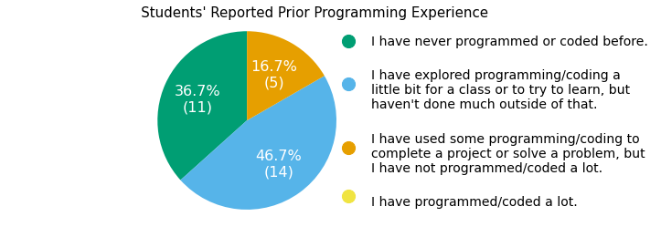
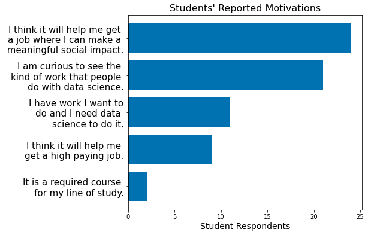
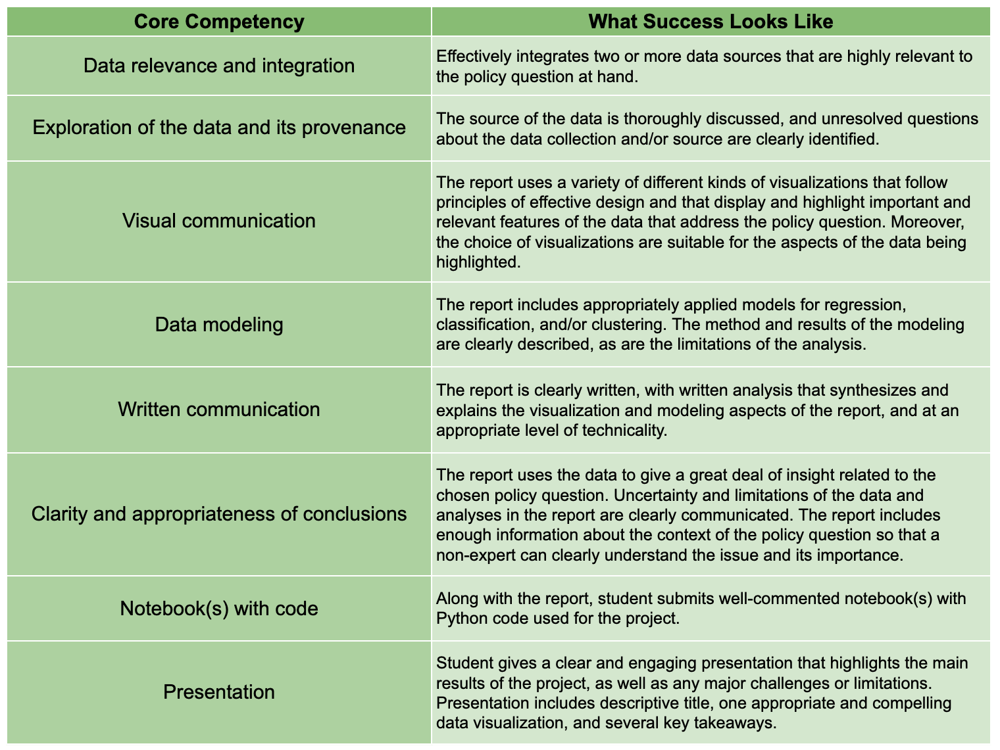

:author: Anna Haensch
:email: anna.haensch@tufts.edu
:institution: Tufts University
:institution: Data Intensive Studies Center

:author: Karin Knudson
:email: karin.knudson@tufts.edu
:institution: Tufts University
:institution: Data Intensive Studies Center

-----------------------------------------------------------------------------------------------------
Python for Global Applications:  teaching scientific Python in context to law and diplomacy students
-----------------------------------------------------------------------------------------------------

.. class:: abstract

For students across domains and disciplines, the message has been communicated loud and clear: data skills are an essential qualification for today’s job market.  This includes not only the traditional introductory stats coursework but also machine learning, artificial intelligence, and programming in Python or R. Consequently, there has been significant student-initiated demand for data analytic and computational skills sometimes with very clear objectives in mind, and other times guided by a vague sense of “the work I want to do will require this.”  Now we have options. If we train students using “black box” algorithms without attending to the technical choices involved, then we run the risk of unleashing practitioners who might do more harm than good.  On the other hand, courses that completely unpack the “black box” can be so steeped in theory that the barrier to entry becomes too high for students from social science and policy backgrounds, thereby excluding critical voices.  In sum, both of these options lead to a pitfall that has gained significant media attention over recent years: the harms caused by algorithms that are implemented without sufficient attention to human context. In this paper, we - two mathematicians turned data scientists - present a framework for teaching introductory data science skills in a highly contextualized and domain flexible environment.  We will present example course outlines at the semester, weekly, and daily level, and share materials that we think hold promise.

.. class:: keywords

   computational social science, public policy, data science, teaching with Python

Introduction
-------------
As data science continues to gain prominence in the public eye, and as we become more aware of the many facets of our lives that intersect with data-driven technologies and policies every day, universities are broadening their academic offerings to keep up with what students and their future employers demand.  Not only are students hoping to obtain more hard skills in data science (e.g. Python programming experience), but they are interested in applying tools of data science across domains that haven't historically been part of the quantitative curriculum.  The Master of Arts in Law and Diplomacy (MALD) is the flagship program of the Fletcher School of Law and International Diplomacy at Tufts University.  Historically, the program has contained core elements of quantitative reasoning with a focus on business, finance, and international development, as is typical in graduate programs in international relations.  Like academic institutions more broadly, the students and faculty at the Fletcher School are eager to seize upon our current data moment to expand their quantitative offerings.  With this in mind, The Fletcher School reached out to the co-authors to develop a course in data science, situated in the context of international diplomacy.

In response, we developed the (Python-based) course, *Data Science for Global Applications*, which had its inaugural offering in the Spring semester of 2022.  The course had 30 enrolled Fletcher School students, primarily from the MALD program.  When the course was announced we had a flood of interest from Fletcher students who were extremely interested in broadening their studies with this course.  With a goal of keeping a close interactive atmosphere we capped enrollment at 30.  To inform the direction of our course, we surveyed students on their background in programming (see Fig. :ref:`stufig1`) and on their motivations for learning data science (see Fig :ref:`stufig2`).  Students reported only very limited experience with programming - if any at all - with that experience primarily in Excel and Tableau.  Student motivations varied, but the goal to get a job where they were able to make a meaningful social impact was the primary motivation. 

   The majority of the 30 students enrolled in the course had little to no programming experience, and none reported having "a lot" of experience.  Those who did have some experience were most likely to have worked in Excel or Tableau. :label:`stufig1`

   The 30 enrolled students were asked to indicate which were relevant motivations for taking the course. Curiosity and a desire to make a meaningful social impact were among the top motivations our students expressed.   :label:`stufig2`

The MALD program, which is interdisciplinary by design, provides ample footholds for domain specific data science.  Keeping this in mind, as a throughline for the course, each student worked to develop their own quantitative policy project.  Coursework and discussions were designed to move this project forward from initial policy question, to data sourcing and visualizing, and eventually to modeling and analysis. 

In what follows we will describe how we structured our course with the goal of empowering beginner programmers to use Python for data science in the context of international relations and diplomacy.  We will also share details about course content and structure, methods of assessment, and Python programming resources that we deployed through Google Colab.  All of the materials described here can be found on the public course page `https://karink520.github.io/data-science-for-global-applications/`_.

.. _https://karink520.github.io/data-science-for-global-applications/: https://karink520.github.io/data-science-for-global-applications/

Course Philosophy and Goals
------------------------------------------

Our high level goals for the course were i) to empower students with the skills to gain insight from data using Python and ii) to deepen students' understanding of how the use of data science affects society. As we sought to achieve these high level goals within the limited time scope of a single semester, the following core principles were essential in shaping our course design. Below, we briefly describe each of these principles and share some examples of how they were reflected in the course structure. In a subsequent section we will more precisely describe the content of the course, whereupon we will further elaborate on these principles and share instructional materials. But first, our core principles:

Connecting the Technical and Social
******************************************

To understand the impact of data science on the world (and the potential policy implications of such impact), it helps to have hands-on practice with data science. Conversely, to effectively and ethically practice data science, it is important to understand how data science lives in the world. Thus, the "hard" skills of coding, wrangling data, visualizing, and modeling are best taught intertwined with a robust study of ways in which data science is used and misused. 

There is an increasing need to educate future policy-makers with knowledge of how data science algorithms can be used and misused. One way to approach meeting this need, especially for students within a less technically-focused program, would be to teach students about how algorithms can be used without actually teaching them to use algorithms. However, we argue that students will gain a deeper understanding of the societal and ethical implications of data science if they also have practical data science skills. For example, a student could gain a broad understanding of how biased training data might lead to biased algorithmic predictions, but such understanding is likely to be deeper and more memorable when a student has actually practiced training a model using different training data. Similarly, someone might understand in the abstract that the way the handling of missing data can substantially affect the outcome of an analysis, but will likely have a stronger understanding if they have had to consider how to deal with missing data in their own project.

We used several course structures to support connecting data science and Python "skills" with their context. Students had readings and journaling assignments throughout the semester on topics that connected data science with society. In their journal responses, students were asked to connect the ideas in the reading to their other academic/professional interests, or ideas from other classes with the following prompt: 

   *Your reflection should be a 250-300 word narrative.  Be sure to tie the reading back into your own studies, experiences, and areas of interest.  For each reading, come up with 1-2 discussion questions based on the concepts discussed in the readings. This can be a curiosity question, where you’re interested in finding out more, a critical question, where you challenge the author’s assumptions or decisions, or an application question, where you think about how concepts from the reading would apply to a particular context you are interested in exploring.* [#]_
 
.. [#] This journaling prompt was developed by our colleague Desen Ozkan at Tufts University.
 
These readings (highlighted in gray in Fig :ref:`outline`), assignments, and the related in-class discussions were interleaved among Python exercises meant to give students practice with skills including manipulating DataFrames in pandas [The22]_, [Mck10]_, plotting in Matplotlib [Hun07]_ and seaborn [Was21]_, mapping with GeoPandas [Jor21]_, and modeling with scikit-learn [Ped11]_. Student projects included a thorough data audit component requiring students to explore data sources and their human context in detail. Precise details and language around the data audit can be found on the course website. 

Managing Fears & Concerns Through Supported Programming
************************************************************************

We surmised that students who are new to programming and possibly intimidated by learning the unfamiliar skill would do well in an environment that included plenty of what we call *supported programming* - that is, practicing programming in class with immediate access to instructor and peer support.

In the pre-course survey we created, many students identified concerns about their quantitative preparation, whether they would be able to keep up with the course, and how hard programming might be. We sought to acknowledge these concerns head-on, assure students of our full confidence in their ability to master the material, and provide them with all the resources they needed to succeed.

A key resource to which we thought all students needed access was instructor attention. In addition to keeping the class size capped at 30 people, with both co-instructors attending all course meetings, we structured class time to maximize the time students spent actually doing data science in class. We sought to keep demonstrations short, and intersperse them with coding exercises so that students could practice with new ideas right away. Our Colab notebooks included in the course materials show one way that we wove student practice time throughout.  Drawing insight from social practice theory of learning (e.g. [Eng01]_, [Pen16]_), we sought to keep in mind how individual practice and learning pathways develop in relation to their particular social and institutional context. Crucially, we devoted a great deal of in-class time to students doing data science, and a great deal of energy into making this practice time a positive and empowering social experience. During student practice time, we were circulating throughout the room, answering student questions and helping students to problem solve and debug, and encouraging students to work together and help each other. A small organizational change we made in the first weeks of the semester that proved to have outsized impact was moving our office hours to hold them directly after class in an almost-adjacent room, to make it as easy as possible for students to attend office hours. Students were vocal in their appreciation of office hours.

We contend that the value of supported programming time is two-fold. First, it helps beginning programmers learn more quickly. While learning to code necessarily involves challenges, students new to a language can sometimes struggle for an unproductively long time on things like simple syntax issues. When students have help available, they can move forward from minor issues faster and move more efficiently into building a meaningful understanding. Secondly, supported programming time helps students to understand that they are not alone in the challenges they are facing in learning to program.  They can see other students learning and facing similar challenges, can have the empowering experience of helping each other out, and when asking for help can notice that even their instructors sometimes rely on resources like StackOverflow. An unforeseen benefit we believe co-teaching had was to give us as instructors the opportunity to consult with each other during class time and share different approaches. These instrutor interactions modeled for students how even as experienced practitioners of data science, we too were constantly learning.

Lastly, a small but (we thought) important aspect of our setup was teaching students to set up a computing environment on their own laptops, with Python, conda, and JupyterLab. Using the command line and moving from an environment like Google Colab to one’s own computer can both present significant barriers, but doing so successfully can be an important part of helping students feel like ‘real’ programmers. We devoted an entire class period to helping students with installation and setup on their own computers.

We considered it an important measure of success how many students told us at the end of the course that the class had helped them overcome sometimes longstanding feelings that technical skills like coding and modeling were not for them.

Leveraging Existing Strengths To Enhance Student Ownership
*************************************************************************

Even as beginning programmers, students are capable of creating a meaningful policy-related data science project within the semester, starting from formulating a question and finding relevant datasets. Working on the project throughout the semester (not just at the end) gave essential context to data science skills as students could translate into what an idea might mean for "their" data. Giving students wide leeway in their project topic allowed the project to be a point of connection between new data science skills and their existing domain knowledge. Students chose projects within their particular areas of interest or expertise, and a number chose to additionally connect their project for this course to their degree capstone project.

Project benchmarks were placed throughout the semester (highlighted in green in Fig :ref:`outline`) allowing students a concrete way to develop their new skills in identifying datasets, loading and preparing data for exploratory data analysis, visualizing and annotating data, and finally modeling and analyzing data.  All of this was done with the goal of answering a policy question developed by the student, allowing the student to flex some domain expertise to supplement the (sometimes overwhelming!) programmatic components. 

Our project explicitly required that students find two datasets of interest and merge them for the final analysis.  This presented both logistical and technical challenges.  As one student pointed out after finally finding open data: hearing people talk about the need for open data is one thing, but you really realize what that means when you’ve spent weeks trying to get access to data that you know exists.  Understanding the provenance of the data they were working with helped students assess the biases and limitations, and also gave students a strong sense of ownership over their final projects.  An unplanned consequence of the broad scope of the policy project was that we, the instructors, learned nearly as much about international diplomacy as the students learned about programming and data science, a bidirectional exchange of knowledge that we surmised to have contributed to student feeling of empowerment and a positive class environment.

Course Structure
-----------------------

We broke the course into three modules, each with focused reading/journaling topics, Python exercises, and policy project benchmarks: (i) getting and cleaning data, (ii) visualizing data, and (iii) modeling data.  In what follows we will describe the key goals of each module and highlight the readings and exercises that we compiled to work towards these goals.

.. figure:: Fletcher_Course_Outline.png
   :align: center
   :figclass: w
   :scale: 40%

   Course outline for a 13-week semester with two 70 minute instructional blocks each week. Course readings are highlighted in gray and policy project benchmarks are highlighted in green. :label:`outline`

Getting and Cleaning Data
**************************

Getting, cleaning, and wrangling data typically make up a significant proportion of the time involved in a data science project. Therefore, we devoted significant time in our course to learning these skills, focusing on loading and manipulating data using pandas. Key skills included loading data into a pandas DataFrame, working with missing data, and slicing, grouping, and merging DataFrames in various ways. After initial exposure and practice with example datasets, students applied their skills to wrangling the diverse and sometimes messy and large datasets that they found for their individual projects. Since one requirement of the project was to integrate more than one dataset, merging was of particular importance.

During this portion of the course, students read and discussed Boyd and Crawford's *Critical Questions for Big Data* [Boy12]_ which situates big data in the context of knowledge itself and raises important questions about access to data and privacy.  Additional readings included selected chapters from D'Ignazio and Klein's *Data Feminism* [Dig20]_ which highlights the importance of what we choose to count and what it means when data is missing. 

Visualizing Data
*****************

A fundamental component to communicating findings from data is well-executed data visualization.  We chose to place this module in the middle of the course, since it was important that students have a common language for interpreting and communicating their analysis before moving to the more complicated aspects of data modeling.  In developing this common language, we used Wilke's *Fundamentals of Data Visualization* [Wil19]_ and Cairo's *How Chart's Lie* [Cai19]_ as a backbone for this section of the course.  In addition to reading the text materials, students were tasked with finding visualizations “in the wild,” both good and bad.  Course discussions centered on the found visualizations, with Wilke and Cairo's writings as a common foundation.  From the readings and discussions, students became comfortable with the language and taxonomy around visualizations and began to develop a better appreciation of what makes a visualization compelling and readable.  Students were able to formulate a plan about how they could best visualize their data.  The next task was to translate these plans into Python.  

To help students gain a level of comfort with data visualization in Python, we provided instruction and examples of working with a variety of charts using Matplotlib and seaborn, as well as maps and choropleths using GeoPandas, and assigned students programming assignments that involved writing code to create a visualization matching one in an image. With that practical grounding, students were ready to visualize their own project data using Python. Having the concrete target of how a student wanted their visualization to look seemed to be a motivating starting point from which to practice coding and debugging. We spent several class periods on supported programming time for students to develop their visualizations.

Working on building the narratives of their project and developing their own visualizations in the context of the course readings gave students a heightened sense of attention to detail.  During one day of class when students shared visualizations and gave feedback to one another, students commented and inquired about incredibly small details of each others’ presentations, for example, how to adjust y-tick alignment on a horizontal bar chart.  This sort of tiny detail is hard to convey in a lecture, but gains outsized importance when a student has personally wrestled with it. 

Modeling Data
**************

In this section we sought to expose students to introductory approaches in each of regression, classification, and clustering in Python. Specifically, we practiced using scikit-learn to work with linear regression, logistic regression, decision trees, random forests, and gaussian mixture models. Our focus was not on the theoretical underpinnings of any particular model, but rather on the kinds of problems that regression, classification, or clustering models respectively, are able to solve, as well as some basic ideas about model assessment. The uniform and approachable scikit-learn API [Bui13]_ was crucial in supporting this focus, since it allowed us to focus less on syntax around any one model, and more on the larger contours of modeling, with all its associated promise and perils. We spent a good deal of time building an understanding of train-test splits and their role in model assessment.

Student projects were required to include a modeling component. Just the process of deciding which of regression, classification, or clustering were appropriate for a given dataset and policy question is highly non-trivial for beginners. The diversity of student projects and datasets meant students had to grapple with this decision process in its full complexity. We were delighted by the variety of modeling approaches students used in their projects, as well as by students’ thoughtful discussions of the limitations of their analysis.

To accompany this section of the course, students were assigned readings focusing on some of the societal impacts of data modeling and algorithms more broadly.  These readings included a chapter from O'Neil's *Weapons of Math Destruction* [One16]_ as well as Buolamwini and Gebru's *Gender Shades* [Buo18]_.  Both of these readings emphasize the capacity of algorithms to exacerbate inequalities and highlight the importance of transparency and ethical data practices.  These readings resonated especially strongly with our students, many of whom had recently taken courses in cyber policy and ethics in artificial intelligence. 

Assessments
------------------------

Formal assessment was based on four components, already alluded to throughout this note.  The largest was the ongoing policy project which had benchmarks with rolling due dates throughout the semester.  Moreover, time spent practicing coding skills in class was often done in service of the project.  For example, in week 4, when students learned to set up their local computing environments, they also had time to practice loading, reading, and saving data files associated with their chosen project datasets.  This brought challenges, since often students sitting side-by-side were dealing with different operating systems and data formats.  But from this challenge emerged many organic conversations about file types and the importance of naming conventions.  The rubric for the final project is shown in Fig :ref:`rubric`.

   Rubric for the policy project that formed a core component of the formal assessment of students throughout the course. :label:`rubric`

The policy project culminated with in-class “micro presentations” and a policy paper.  We dedicated two days of class in week 13 for in-class presentations, for which each student presented one slide consisting of a descriptive title, one visualization, and several “key takeaways” from the project.  This extremely restrictive format helped students to think critically about the narrative information conveyed in a visualization, and was designed to create time for robust conversation around each presentation.  

In addition to the policy project, each of the three course modules also had an associated set of Python exercises (available on the course website).  Students were given ample time both in and out of class to ask questions about the exercises.  Overall, these exercises proved to be the most technically challenging component of the course, but we invited students to resubmit after an initial round of grading.  

And finally, to supplement the technical components of the course we also had readings with associated journal entries submitted at a cadence of roughly two per module. Journal prompts are described above and available on the course website.

Conclusion
-----------

Various listings of key competencies in data science have been proposed [NAS18]_. For example, [Dev17]_ suggests the following pillars for an undergraduate data science curriculum: computational and statistical thinking, mathematical foundations, model building and assessment, algorithms and software foundation, data curation, and knowledge transference—communication and responsibility. As we sought to contribute to the training of data-science informed practitioners of international relations, we focused on helping students build an initial competency especially in the last four of these. 

We can point to several key aspects of the course that made it successful.  Primary among them was the fact that the majority of class time was spent in supported programming.  This means that students were able to ask their instructors or peers as soon as questions arose.  Novice programmers who aren't part of a formal computer science program often don't have immediate access to the resources necessary to get "unstuck." for the novice practitioner, even learning *how* to google technical terms can be a challenge.  This sort of immediate debugging and feedback helped students remain confident and optimistic about their projects.  This was made all the more effective since we were co-teaching the course and had double the resources to troubleshoot. Co-teaching also had the unforeseen benefit of making our classroom a place where the growth mindset was actively modeled and nurtured: where one instructor wasn't able to answer a question, the other instructor often could. Finally, it was precisely the motivation of learning data science in context that allowed students to maintain a sense of ownership over their work and build connections between their other courses. 

Learning programming from the ground up is difficult.  Students arrive excited to learn, but also nervous and occasionally heavy with the baggage they carry from prior experience in quantitative courses. However, with a sufficient supported learning environment it's possible to impart relevant skills. It was a measure of the success of the course how many students told us that the course had helped them overcome negative prior beliefs about their ability to code. Teaching data science skills in context and with relevant projects that leverage students’ existing expertise and outside reading situates the new knowledge in a place that feels familiar and accessible to students.  This contextualization allows students to gain some mastery while simultaneously playing to their strengths and interests.

References
-----------
.. [Boy12] Boyd, Danah, and Kate Crawford. *Critical questions for big data: Provocations for a cultural, technological, and scholarly phenomenon*. 
           Information, communication & society 15.5 (2012):662-679. https://doi.org/10.1080/1369118X.2012.678878

.. [Bui13] Buitinck, Lars, Gilles Louppe, Mathieu Blondel, Fabian Pedregosa, Andreas Mueller, Olivier Grisel, Vlad Niculae et al. *API design for machine learning software: experiences from the scikit-learn project*. arXiv preprint arXiv:1309.0238 (2013).

.. [Buo18] Buolamwini, Joy, and Timnit Gebru. *Gender shades: Intersectional accuracy disparities in commercial gender classification*. 
            Conference on fairness, accountability and transparency. PMLR, 2018. http://proceedings.mlr.press/v81/buolamwini18a.html

.. [Cai19] Cairo, Alberto. *How charts lie: Getting smarter about visual information*. 
            WW Norton & Company, 2019.

.. [Dev17] De Veaux, Richard D., Mahesh Agarwal, Maia Averett, Benjamin S. Baumer, Andrew Bray, Thomas C. Bressoud, Lance Bryant et al. *Curriculum guidelines for undergraduate programs in data science*. Annual Review of Statistics and Its Application 4 (2017): 15-30. https://doi.org/10.1146/annurev-statistics-060116-053930

.. [Dig20] D'Ignazio, Catherine, and Lauren F. Klein. *Data Feminism*.
           MIT press, 2020.

.. [Eng01] Engeström, Yrjö. *Expansive learning at work: Toward an activity theoretical reconceptualization*. Journal of education and work 14, no. 1 (2001): 133-156. https://doi.org/10.1080/13639080020028747

.. [Hun07] Hunter, J.D., *Matplotlib: A 2D Graphics Environment*. Computing in Science & Engineering, vol. 9, no. 3 (2007): 90-95. https://doi.org/10.1109/MCSE.2007.55

.. [Jor21] Jordahl, Kelsey  et al. 2021. *Geopandas/geopandas: V0.10.2*. Zenodo. https://doi.org/10.5281/zenodo.5573592.

.. [Mck10] McKinney, Wes. *Data structures for statistical computing in python*. In Proceedings of the 9th Python in Science Conference, vol. 445, no. 1, pp. 51-56. 2010. https://doi.org/10.25080/Majora-92bf1922-00a

.. [NAS18] National Academies of Sciences, Engineering, and Medicine. *Data science for undergraduates: Opportunities and options*. National Academies Press, 2018.

.. [One16] O'Neil, Cathy. *Weapons of math destruction: How big data increases inequality and threatens democracy*. 
            Broadway Books, 2016.

.. [Ped11] Pedregosa, Fabian, Gaël Varoquaux, Alexandre Gramfort, Vincent Michel, Bertrand Thirion, Olivier Grisel, Mathieu Blondel et al. *Scikit-learn: Machine learning in Python*. the Journal of machine Learning research 12 (2011): 2825-2830. https://dl.acm.org/doi/10.5555/1953048.2078195

.. [Pen16] Penuel, William R., Daniela K. DiGiacomo, Katie Van Horne, and Ben Kirshner. *A Social Practice Theory of Learning and Becoming across Contexts and Time*. Frontline Learning Research 4, no. 4 (2016): 30-38. http://dx.doi.org/10.14786/flr.v4i4.205

.. [The22] The Pandas Development Team, 2022. *pandas-dev/pandas: Pandas 1.4.2*. Zenodo. https://doi.org/10.5281/zenodo.6408044

.. [Was21] Waskom, Michael L. *Seaborn: statistical data visualization*. Journal of Open Source Software 6, no. 60 (2021): 3021. https://doi.org/10.21105/joss.03021

.. [Wil19] Wilke, Claus O. *Fundamentals of data visualization: a primer on making informative and compelling figures*. O'Reilly Media, 2019.

