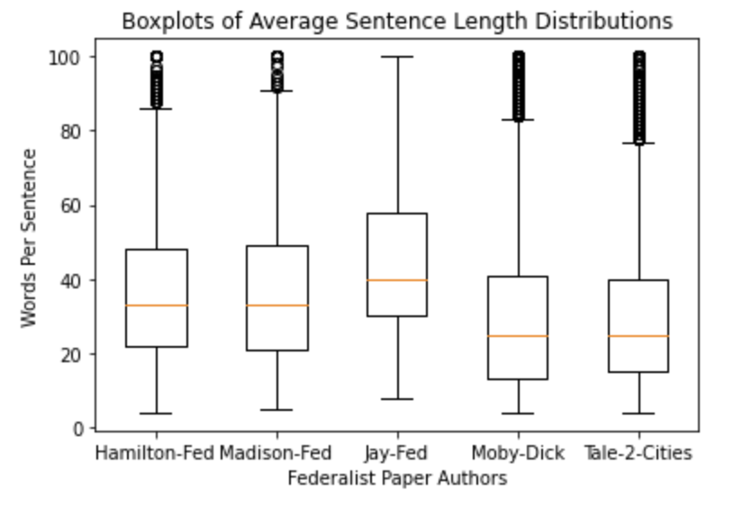

:author: Anthony Breitzman
:email: breitzman@rowan.edu
:institution: Rowan University Department of Computer Science
:bibliography: mybib

--------------------------------------------------------
An Accessible Python based Author Identification Process
--------------------------------------------------------

.. class:: abstract

   Author identification also known as ‘author attribution’ and more recently  ‘forensic linguistics’ involves identifying true authors of anonymous texts. The Federalist Papers are 85 documents written anonymously by a combination of Alexander Hamilton, John Jay, and James Madison in the late 
   1780's supporting adoption of the American Constitution.  All but 12 documents have confirmed authors based on lists provided before the 
   author’s deaths.  Mosteller and Wallace in 1963 provided evidence of authorship for the 12 disputed documents, however the analysis is 
   not readily accessible to non-statisticians.  In this paper we replicate the analysis but in a much more accessible way using modern 
   text mining methods and Python. One surprising result is the usefulness of filler-words in identifying writing styles.  The method 
   described here can be applied to other authorship questions such as linking the Unabomber manifesto with Ted Kaczynski, 
   identifying Shakespeare's collaborators, etc.  Although the question of authorship of the Federalist Papers has been studied before, what is new in this paper is we highlight a process and tools that can be easily used by Python programmers, and the methods do not rely on any knowledge of statistics or machine learning.

.. class:: keywords

   Federalist, Author Identification, Attribution, Forensic Linguistics, Text-Mining

Introduction
------------

Author attribution is a long-standing problem involving identifying true authors in anonymous texts. Recently 
the problem has garnered headlines with several high profile cases that were made 
possible with computers and text mining methods.  In 2017 *The Discovery Channel* created 
a TV series called Manhunt:Unabomber that showed how Forensic Linguistics was used to 
determine that Ted Kaczynski was the author of the Unabomber manifesto [Luu17]_. In 2016 a 
headline from *The Guardian* shook the literary world: "Christopher Marlowe credited as 
one of Shakespeare's co-writers" [Alb16]_. It was long suspected that Shakespeare collaborated with 
others, but since Marlowe was always considered his biggest rival, it was quite a surprise that the two collaborated. See [Foster]_ for other examples including the best seller Primary Colors about the Clinton campaign that was published anonymously and the question of authorship of "Twas the Night Before Christmas" as well as other examples

About this Paper
----------------
Purpose of this Paper
+++++++++++++++++++++

While forensic linguistics may be a recent name for such attribution, the idea of using statistical modeling to identify authors goes back to at 
least 1963 when Mosteller and Wallace published their ground-breaking study of the Federalist Papers [Mos63]_. Since that study was published 
in a Statistics journal, it requires a thorough understanding of statistics to understand it.  Because our audience consists 
mostly of Software Engineers instead of Statisticians, we present a more accessible analysis of the Federalist Papers which can be applied to other author attribution problems.  In this paper we endeavor to show a self-contained process that can be used for author attribution problems as well as other text-analysis problems such as gender identification of texts, genre classification, or sentiment analysis.

The Contribution of this Paper
++++++++++++++++++++++++++++++

The use of the Federalist Papers as a case study in author attribution is not new and dates to 1963 [Mos63]_. However, this paper's contribution is that it shows a process for author attribution and text mining in general that requires only knowledge of Python and requires no previous background in statistics or machine learning.

Outline of the Remaining Paper
++++++++++++++++++++++++++++++

We first describe how rudimentary author attribution was done before 1963.  We then briefly describe the notion of Exploratory Data Analysis by way of a key table before showing the Python tools necessary for building said table. We then discuss how to build a dictionary of terms for each potential author and use Python to turn that dictionary into a set of probabilities that can be used as a Naive Bayes classifier.  We then present a self-contained explanation of Naive Bayes and use it to predict the author of the disputed Federalist Papers. Finally, we show how a Python programmer who has little background in machine learning, can still successfully run numerous machine learning models to do predictions.

The Disputed Federalist Papers as a Case Study
----------------------------------------------

This brief history is shortened from [Mos63]_ which itself is a much shortened history from [Ada1]_ and [Ada2]_.  The Federalist Papers were a series of essays written by Alexander Hamilton, John Jay, 
and James Madison published under the pseudonym "Publius" 
in New York newspapers in 1787 and 1788 in support of ratification of the constitution. It is surmised that the authors were not anxious to claim the essays for decades because the 
opinions in the essays sometimes opposed positions each later supported [Mos63]_.  Hamilton was famously killed in a duel in 1804 but he left a list of the essays he wrote with his lawyer before his death.  Madison later
generated his own list a decade later and attributed any discrepancies between the lists as "owing doubtless to the hurry in which (Hamilton's) memorandum was made out" [Ada1]_.  
Of the 85 essays, the 5 essays written by Jay are not in dispute.  Another 51 by Hamilton, 14 by Madison, and 3 joint essays coauthored by Hamilton and Madison are also not in dispute.  
However, 12 essays (Federalist Nos. 49-58, 62 amd 63) were claimed by both Hamilton and Madison in their respective lists [Mos63]_.

Similarities of Hamilton and Madison as Writers
+++++++++++++++++++++++++++++++++++++++++++++++

Before Mosteller used advanced statistical modeling for author attribution, the standard approach was to look 
at things like sentence length to identify authors.  In [Mos87]_ Mosteller explains why this won't work with Hamilton and Madison because they are too similar.
  
     The writings of Hamilton and Madison are difficult to tell apart because both authors were masters of the popular Spectator style of writing-complicated and oratorical. Never use a short word if a long one will do. Double negatives are good, triple even better. To illustrate, in 1941 Frederick Williams and I counted sentence lengths for the undisputed papers and got
     means of 34.55 and 34.59 words, respectively, for Hamilton and Madison, and average standard deviations for sentence lengths of 19.2 and 20.3. [Mos87]_

To illustrate the quote above, consider the boxplot in Figure :ref:`box` of the non-disputed Federalist Papers of Hamilton, Madison, and Jay.  

   Boxplots showing Sentence Length Statistics Federalist Authors :label:`box`

We see in Figure :ref:`box` that not only do Hamilton and Madison have the same median sentence length, but they have the same 25-percentile and 75-percentile sentence length and very similar minimum and maximum sentence lengths.  In comparison John Jay tends to use 
longer sentences. In general, before 1963 this kind of analysis was used for author attribution, and it often works. However, as we see, Hamilton and Madison were very similar writers.  The boxplot above is easily generated with matplotlib and a sentence tokenizer discussed below.  We omit the code for space considerations, however all of the code discussed in this paper can be found at https://github.com/AbreitzmanSr/SciPy2023-AuthorAttribution.

Exploratory Data Analysis
+++++++++++++++++++++++++
Before jumping into modeling and code examples, we'll start with a key table that will suggest that Madison is the author of most if not all of the disputed papers.  Table :ref:`favorite1` contains a list of Hamilton's and Madison's favorite words. (Although John Jay is included in the table, he is not really of interest in this study because he has laid no claim to the disputed papers.  The only reason the 12 papers are disputed is because both Hamilton and Madison had claimed authorship of them.)

Note that Hamilton uses "upon" many times in place of "on".  In the disputed papers both terms are used at the Madison rate rather than the Hamilton rate.

Madison uses "whilst" instead of "while".  While is never used in the disputed papers but "whilst" is used in half of them.

Several words like "democratic", "dishonorable", "precision", "inconveniency", etc. are not used in any Hamilton documents but are used in both the disputed papers and Madison documents.

"While", "enough", "nomination", "kind" appear in Hamilton documents but either not at all in the disputed papers or at the Madison rate within the disputed papers

Generating the previous table is an example of what Data Scientists call Exploratory Data Analysis which is an initial investigation on data to discover patterns and trends, spot anomalies, and generate statistical summaries which might help us check assumptions and perform hypotheses about our data.

The previous table suggests Madison is the likely author of most of the disputed Federalist Papers.  But the table did materialize out of nowhere.  There are 2 key components to the previous table:
We need a method to identify words that have a high probability of being used by one author but not the other and we need a way to identify usage per 1000 words for each author

Both of those components are easily done using Python’s NLTK (Natural Language Tool-kit) library [nltk02]_.

.. raw:: latex

   \begin{table*}[htbp]
   \centering
    \begin{tabular}{|l|r|r|r|r|r|r|r|r|r|r|}
    \toprule
          & \multicolumn{5}{c|}{\% of Papers Containing Word} & \multicolumn{5}{c|}{Usage Per 1000 Words} \\
    \midrule
    word & \multicolumn{1}{c|}{Hamilton} & \multicolumn{1}{c|}{Madison} & \multicolumn{1}{c|}{Joint} & \multicolumn{1}{c|}{Disputed} & \multicolumn{1}{c|}{Jay} & \multicolumn{1}{c|}{Hamilton} & \multicolumn{1}{c|}{Madison} & \multicolumn{1}{c|}{Joint} & \multicolumn{1}{c|}{Disputed} & \multicolumn{1}{c|}{Jay} \\
    \midrule
    upon  & 100   & 21.4  & 66.6  & 16.6  & 20    & 3.012 & 0.161 & 0.312 & 0.112 & 0.107 \\
    \midrule
    on    & 98    & 100   & 100   & 100   & 100   & 3.037 & 6.817 & 6.094 & 7.077 & 4.721 \\
    \midrule
    very  & 72.5  & 85.7  & 100   & 91.6  & 60    & 0.583 & 1.04  & 0.937 & 2.209 & 1.394 \\
    \midrule
    community & 62.7  & 14.2  & 33.3  & 25    & 20    & 0.558 & 0.046 & 0.156 & 0.187 & 0.107 \\
    \midrule
    while & 39.2  & 0     & 0     & 0     & 40    & 0.291 & 0     & 0     & 0     & 0.214 \\
    \midrule
    enough & 35.2  & 0     & 33.3  & 0     & 0     & 0.267 & 0     & 0.156 & 0     & 0 \\
    \midrule
    nomination & 13.7  & 0     & 0     & 0     & 0     & 0.178 & 0     & 0     & 0     & 0 \\
    \midrule
    consequently & 5.8   & 57.1  & 0     & 41.6  & 40    & 0.032 & 0.277 & 0     & 0.337 & 0.429 \\
    \midrule
    lesser & 3.9   & 35.7  & 0     & 16.6  & 20    & 0.016 & 0.161 & 0     & 0.149 & 0.107 \\
    \midrule
    whilst & 1.9   & 57.1  & 66.6  & 50    & 0     & 0.008 & 0.277 & 0.312 & 0.337 & 0 \\
    \midrule
    although & 1.9   & 42.8  & 0     & 33.3  & 80    & 0.008 & 0.161 & 0     & 0.149 & 0.536 \\
    \midrule
    composing & 1.9   & 42.8  & 33.3  & 16.6  & 0     & 0.008 & 0.254 & 0.156 & 0.074 & 0 \\
    \midrule
    recommended & 1.9   & 35.7  & 0     & 8.3   & 20    & 0.008 & 0.138 & 0     & 0.037 & 0.429 \\
    \midrule
    sphere & 1.9   & 35.7  & 0     & 16.6  & 0     & 0.008 & 0.184 & 0     & 0.112 & 0 \\
    \midrule
    pronounced & 1.9   & 28.5  & 0     & 16.6  & 0     & 0.008 & 0.115 & 0     & 0.074 & 0 \\
    \midrule
    respectively & 1.9   & 28.5  & 0     & 16.6  & 0     & 0.008 & 0.138 & 0     & 0.074 & 0 \\
    \midrule
    enlarge & 0     & 28.5  & 0     & 16.6  & 0     & 0     & 0.115 & 0     & 0.074 & 0 \\
    \midrule
    involves & 0     & 28.5  & 0     & 16.6  & 0     & 0     & 0.092 & 0     & 0.074 & 0 \\
    \midrule
    stamped & 0     & 28.5  & 33.3  & 0     & 0     & 0     & 0.092 & 0.156 & 0     & 0 \\
    \midrule
    crushed & 0     & 21.4  & 0     & 8.3   & 0     & 0     & 0.069 & 0     & 0.037 & 0 \\
    \midrule
    democratic & 0     & 21.4  & 0     & 8.3   & 0     & 0     & 0.069 & 0     & 0.037 & 0 \\
    \midrule
    dishonorable & 0     & 21.4  & 0     & 8.3   & 0     & 0     & 0.069 & 0     & 0.037 & 0 \\
    \midrule
    precision & 0     & 21.4  & 0     & 8.3   & 0     & 0     & 0.069 & 0     & 0.037 & 0 \\
    \midrule
    reform & 0     & 21.4  & 33.3  & 16.6  & 0     & 0     & 0.161 & 0.156 & 0.074 & 0 \\
    \midrule
    transferred & 0     & 21.4  & 0     & 8.3   & 0     & 0     & 0.069 & 0     & 0.037 & 0 \\
    \midrule
    universally & 0     & 21.4  & 0     & 8.3   & 20    & 0     & 0.069 & 0     & 0.037 & 0.107 \\
    \midrule
    bind  & 0     & 14.2  & 0     & 8.3   & 20    & 0     & 0.069 & 0     & 0.037 & 0.107 \\
    \midrule
    derives & 0     & 14.2  & 33.3  & 8.3   & 0     & 0     & 0.069 & 0.156 & 0.037 & 0 \\
    \midrule
    drawing & 0     & 14.2  & 0     & 8.3   & 0     & 0     & 0.069 & 0     & 0.037 & 0 \\
    \midrule
    function & 0     & 14.2  & 0     & 8.3   & 0     & 0     & 0.069 & 0     & 0.037 & 0 \\
    \midrule
    inconveniency & 0     & 14.2  & 0     & 16.6  & 0     & 0     & 0.069 & 0     & 0.074 & 0 \\
    \midrule
    obviated & 0     & 14.2  & 0     & 8.3   & 0     & 0     & 0.069 & 0     & 0.037 & 0 \\
    \midrule
    patriotic & 0     & 14.2  & 0     & 25    & 20    & 0     & 0.069 & 0     & 0.112 & 0.107 \\
    \midrule
    speedy & 0     & 14.2  & 0     & 8.3   & 0     & 0     & 0.069 & 0     & 0.037 & 0 \\
    \bottomrule
    \end{tabular}%
    \caption{Favorite Words of Hamilton and Madison}
    \DUrole{label}{favorite1}%
    \end{table*}%
	
Building the Favorite Words Table
+++++++++++++++++++++++++++++++++

Project Gutenberg [Fed1]_ has the Federalist Papers as a plain-text e-book with each essay as an individual chapter.  The Python code required to put the plain text of the book into a long string is below.

.. code-block:: python

  import re
  from urllib import request

  #utility functions for slicing text
  def left(s, amount):
    return s[:amount]

  def right(s, amount):
    return s[-amount:]

  #Get Federalist Papers
  url="https://www.gutenberg.org/cache/epub/1404/pg1404.txt"

  response=request.urlopen(url)
  raw=response.read()
  text=raw.decode("utf-8-sig")

  #replace multiple spaces with single space
  text=re.sub("\s+", " ", text)

  #kill all the front matter of the book
  text=right(text,len(text)-text.find('FEDERALIST No.'))

  #kill back matter
  text=left(text,
         text.find('*** END OF THE PROJECT GUTENBERG'))

Project Gutenberg [Fed1]_ has the Federalist Papers stored as a book with the individual papers as chapters.  In the next code snippet we reorganize the text so that each author's Federalist papers are contained in a list.  For example the variable :code:`hamilton` will contain a list of Hamilton's 51 known Federalist Papers.

.. code-block:: python

  #returns the main text of a Federalist paper.
  def getFedText(s):
   if (len(s)>0):
    t = s + ' PUBLIUS' #additional sentinel in case 
                       #it's not there.
                       #(in most cases it is)
    i = t.find('PUBLIUS')
    t = left(t,i)
    i = t.find('State of New York')
    t = right(t,len(t)-(i+19))
    return t.strip()
   else:
    return ""

  #Break Federalist papers up into individual texts
  FedChapters=re.split('\sFEDERALIST No\. \d*\s',' '+text)

  #Store Hamilton's Federalist papers in a Hamilton 
  #list, Madison's in a Madison list, etc.
  hamilton = []
  jay = []
  madison = []
  joint = []
  disputed = []
  for i in range(len(FedChapters)):
    if (i in {2,3,4,5,64}):
     jay.append([i,[getFedText(FedChapters[i])]])
    else:
     if (i in {18,19,20}):
       joint.append([i,[getFedText(FedChapters[i])]])
     else:
       if (i in {49,50,51,52,53,54,55,56,57,58,62,63}):
          disputed.append(
                      [i,[getFedText(FedChapters[i])]])
       else:
         if (i in {10,14,37,38,39,40,41,42,43,
		     44,45,46,47,48}):
           madison.append(
                      [i,[getFedText(FedChapters[i])]])
         else:
          if (i > 0):
            hamilton.append(
                      [i,[getFedText(FedChapters[i])]])
  
  
Introduction to NLTK Tokenizers
+++++++++++++++++++++++++++++++

NLTK [nltk02]_ makes it easy to make lists of sentences, lists of words, count sentences, count words in sentences etc.  Here's an example of how to first split a text into sentences and then make a Python list of each word in each sentence.  (This could be done with split() but we would need multiple sentence delimiters and we would lose the punctuation if we weren't careful.)

.. code-block:: python

  from nltk.tokenize import sent_tokenize
  from nltk.tokenize import word_tokenize
  
  text_2sentences = "A short sentence. Another 
                     short sentence."
					
  sentences = sent_tokenize(text_2sentences)
  for x in sentences:
    print(word_tokenize(x))
	
::

  ['A','short','sentence','.']
  ['Another','short','sentence','.']

We will leverage the NLTK word tokenizer to build dictionaries of word frequencies for each author.

.. code-block:: python

  from nltk.tokenize import word_tokenize
			   
  hamiltonDicts=[]#list of dictionaries containing 
                #word freq for each of Hamilton's 
                #Federalist Papers
  madisonDicts=[]
  disputedDicts=[]
  jointDicts=[]

  def getDocDict(str1):
  #returns a dictonary containing frequencies of 
  #any word in string.
  #e.g. str1 = 'quick brown fox is quick.'
  # returns {quick:2, brown:1, fox:1, is:1}
  x = {}
  words = word_tokenize(str1.lower().strip())
  for b in words:
        if b in x:
            x[b]+=1
        else:
            x[b]=1
  return(x)

  for a in hamilton:
    hamiltonDicts.append(getDocDict(a[1][0]))
    
  for a in madison:
    madisonDicts.append(getDocDict(a[1][0]))
    
  for a in joint:
    jointDicts.append(getDocDict(a[1][0]))
    
  for a in disputed:
    disputedDicts.append(getDocDict(a[1][0]))
	

It is now straightforward to identify word usage for each author.
That is, given a word such as "upon" it is easy to identify the percent of each author’s Federalist papers that mention "upon." It’s also easy to identify the usage of "upon" per thousand words for each author.  What we haven’t addressed is how to find words that are favorites of Hamilton but not Madison and vice-versa.  We will do that by building a Naive Bayes dictionary for each author, but we will assume no prior knowledge of Naive Bayes to do so.

The code below creates a document frequency distribution of every word mentioned in the Federalist Papers.  That is, for every word mentioned, we count how many documents the word appears in.  We then remove any word that is only mentioned in one or two documents because it will have no discriminating value.  Similarly we remove any word that appears in all documents because the only words mentioned in all documents are so-called stopwords like "is", "and","the" that both authors use. Note words like "while" and "whilst" might be considered stopwords, but these will be kept because they are used by only one of the authors and thus will not reach the 80 document threshold to be discarded.

.. code-block:: python

  completeDict={}#dictionary containing any word 
                 #mentioned in any of the Federalist 
                 #papers and the number of Federalist 
                 #Papers containing the word.
				 
  kills = [',','.',"''",'',';','-',')','(']
  authDicts = [hamiltonDicts,madisonDicts,
               jointDicts,disputedDicts]
  for authDict in authDicts:
   for a in authDict:
    for x in a:
        if (x not in kills):
         if x in completeDict:
            completeDict[x]+=1
         else:
            completeDict[x]=1
            
  trimDict = set()  #subset of completeDict 
                    #that contains useful words
  for a in completeDict:
    x = completeDict[a]
    if (x >= 3 and x < 80):
        trimDict.add(a)

  print(len(completeDict),len(trimDict))

::

  8492 3967
        
At this point :code:`completeDict` contains document frequencies for the 8,492 unique words in all the Federalist papers and :code:`trimDict` contains the subset of 3,967 potentially useful words.  We now need to find words that are much more likely to be used by Hamilton than Madison and vice-versa.  For each word in :code:`trimDict` we will compute the probability that Hamilton or Madison used it.  The words where Hamilton’s probability is 5+ times more likely than Madison (or vice-versa) is an interesting word that gets selected for the previously shown Table :ref:`favorite1`.

The code below will help us get each author's favorite words.  For each word in :code:`trimDict` we will count how often each author uses it.  We next total up all of the word frequencies for each author and store them in the denominators :code:`hamiltonNBdenom` and :code:`madisonNBdenom`.

.. code-block:: python

  #build Naive Bayes Dictionaries 
  #for Hamilton and Madison
  hamiltonNBwordDicts = {}
  madisonNBwordDicts = {}

  hamiltonNBdenom = madisonNBdenom = 0

  for a in trimDict: #this is equivalent 
                     #to Laplace Smoothing
    hamiltonNBwordDicts[a]=madisonNBwordDicts[a]=1
    hamiltonNBdenom += 1
    madisonNBdenom += 1
    
  for dictionary in hamiltonDicts:
   for word in dictionary:
    if (word in trimDict):
     hamiltonNBwordDicts[word]+=dictionary[word]
     hamiltonNBdenom +=dictionary[word]
            
  for dictionary in madisonDicts:
   for word in dictionary:
    if (word in trimDict):
      madisonNBwordDicts[word]+=dictionary[word]
      madisonNBdenom += dictionary[word]

For those unfamiliar with Naïve Bayes we are just computing word frequencies of the potentially useful words for each author
and making sure no word probability is 0.  (This is called Laplace Smoothing, but essentially we’re trying to avoid cases where Hamilton uses a word very few times but Madison uses it 0 times (or vice-versa) because that will pollute our table with a bunch of useless words.) We need a denominator (consisting of the sum of frequencies of all words) in order to compute a probability of an author using the word, then the probability of an author using that word is just the frequency of the word divided by the denominator.

It is now straightforward to identify words that are favorites of Hamilton but not Madison and vice-versa as follows:

.. code-block:: python

  interesting = []
  tableData = []
  j = 0
  for i,a in enumerate(trimDict):
    h1 = hamiltonNBwordDicts[a]/hamiltonNBdenom
    m1 = madisonNBwordDicts[a]/madisonNBdenom
    if (m1/h1 > 5 or h1/m1 > 5):
      interesting.append(a)
      if (j < 10):
         tableData.append([a,m1/h1,h1/m1])
         j+=1
        
  from tabulate import tabulate
  print (tabulate(tableData, 
       headers=["FavoriteWord","Mad. Pr/Ham. Pr",
                "Ham.  Pr/Mad. Pr"]))

::

  FavoriteWord      Mad. Pr/Ham. Pr    Ham. Pr/Mad. Pr
  --------------  -----------------  -----------------
  enumeration             6.08567            0.164321
  surely                 10.1428             0.0985923
  defined                 5.07139            0.197185
  whilst                 16.482              0.0606722
  respectively            8.87493            0.112677
  address                 5.07139            0.197185
  usurped                 5.07139            0.197185
  while                   0.12191            8.20279
  obviated                5.79072            0.17269
  upon                    0.0557395         17.9406

We of course cut off the table of "interesting" words because of space considerations.  As expected, we see that the the probability of "whilst" being used by Madison is 16 times as likely as it being used by Hamilton.  Similarly, "upon" being used by Hamilton is 18 times as likely as it being used by Madison.  To get the table of author favorite words shown above in Table :ref:`favorite1` we just need to calculate the percentage of papers from each author that contain the words, and also compute the usage per 1000 words for each author.  Both of those calculations are straightforward so we omit the code, however it can be found at at https://github.com/AbreitzmanSr/SciPy2023-AuthorAttribution. 

Naive Bayes Model
-----------------

We now have everything we need to build a model to predict the author of the disputed Federalist Papers. We assume no prior knowledge of Naive Bayes, but the interested reader can see [Jur23]_ or many other books for a full derivation.  For our purposes we only care that: :math:`P(Author|word1,word2,…,wordN) = P(word1|Author)*P(word2|Author)*…*P(wordN|author)/k`.
That is, the conditional probability that a paper (:math:`word1` through :math:`wordN`) is authored by Hamilton or Madison is equal to the product of the probabilities of each word belonging to the authors then divided by a constant :math:`k`.  (The equality is only true if the words are independent.  Since we don’t care about the actual probabilities, but only which author has the larger value, we don’t need independence.)
The constant :math:`k` is actually another probability that is hard to compute, but since it’s the same for both authors all we really need is the following pseudocode:

::

  Text = [word1, word2, …, wordN]
  if (P(word1|Hamilton)*P(word2|Hamilton)*…*
     P(wordN|Hamilton) >
     P(word1|Madison)*P(word2|Madison)*…*
     P(wordN|Madison)):
        return(Hamilton)
  else:
        return(Madison)

The actual Python code shown below is slightly different than the pseudocode above. Since we are computing the product of thousands of very small values there is a risk of underflow so instead of the product of many small constants we compute the sum of the logs of many small constants (e.g.  Log(a*b) = Log(a) + Log(b)).  Thus, the Python code looks like the following:

.. code-block:: python

  import math
  #given a document return 'hamilton' if NaiveBayes prob 
  #suggests Hamilton authored it. similarly return 
  #'madison' if he is the likely author
  def NB_federalist_predict(docDict,vocab1=trimDict):
   h_pr = m_pr = 0
   for word in docDict:
    if (word in vocab1):
     h_pr += float(docDict[word])*(math.log(
          hamiltonNBwordDicts[word]/hamiltonNBdenom))
     m_pr += float(docDict[word])*(math.log(
          madisonNBwordDicts[word]/madisonNBdenom))
        
   if (h_pr > m_pr):
      return('hamilton')
   else:
      return('madison')
    
  def check_accuracy(vocab1=trimDict):
    right = wrong = 0
    for a in hamiltonDicts:
      if NB_federalist_predict(a,vocab1)=='hamilton':
        right+=1
      else:
        wrong+=1

    for a in madisonDicts:
      if NB_federalist_predict(a,vocab1)=='madison':
        right+=1
      else:
        wrong+=1
    return([100*right/(right+wrong),right,wrong])
    
    print('% correct:',check_accuracy()[0])

::

% correct: 100.0

The :code:`NB_federalist_predict` is a Naive Bayes classifier which takes in a document dictionary such as the elements in :code:`hamiltonDicts` or :code:`madisonDicts` we defined earlier in the paper.  We check the accuracy of the classifier with the straightforward function :code:`check_accuracy` that simply looks at the predictions for all the known Hamilton papers and all the known Madison papers and counts the correct and erroneous author predictions. 

The classifier will work with any vocabulary but defaults to :code:`trimDict` if no vocabulary is provided.  We will see below that this allows us to run the classifier on various word lists which may be useful for our analysis.

The last line shows that the Naive Bayes classifier correctly predicts 100% of the undisputed papers from Hamilton and Madison.  The next thing to check is the 12 disputed papers and see if they are attributed to Madison as the authors in [Mos63]_ found. For those familiar with machine learning or data mining we call the known Federalist papers, the "training" set and the disputed papers the "test" set.

Predicting Authors for the Disputed Papers
++++++++++++++++++++++++++++++++++++++++++

We saw how the predict function works above on the undisputed papers.  Now to see how various word sets can be used to predict who wrote the disputed papers consider the code and output below:

.. code-block:: python

  #the following checks accuracy on the training set and 
  #then identifies how many of the disputed papers are 
  #by each author
  def Federalist_report(words=trimDict):
    if (len(words)<10):
        print(words)
    else:
        temp = words[:9]
        temp.append('...')
        print(temp)
    print(str(check_accuracy(words)[0])+'% accuracy')
    madison = hamilton = 0
    for a in disputedDicts:
        if (NB_federalist_predict(a,words)=='madison'):
            madison+=1
        else:
            hamilton+=1
    print("disputed papers: madison:"+str(madison)+
          ', hamilton:'+str(hamilton)+'\n')
    
  Federalist_report(interesting)
  Federalist_report(['although','composing','involves',
         'confederation','upon'])
  Federalist_report(['although','obviated','composing',
         'whilst','consequently','upon'])
  Federalist_report(['against','within','inhabitants',
         'whilst','powers','upon','while'])
  Federalist_report(['against','upon','whilst',
         'inhabitants','within'])
  Federalist_report(['against','within','inhabitants',
         'whilst','upon'])
  Federalist_report(['against','while','whilst','upon',
                     'on'])
  Federalist_report(['concurrent','upon','on',
         'very','natural'])
  Federalist_report(['while','upon','on','inconveniency'])

::

  ['enumeration', 'surely', 'whilst', 'respectively', 
   'relief', 'reform', 'jury', 'dishonorable', 
   'term', '...']
  100.0% accuracy
  disputed papers: madison:12, hamilton:0

  ['although', 'composing', 'involves', 'confederation', 
   'upon']
  100.0% accuracy
  disputed papers: madison:12, hamilton:0

  ['although', 'obviated', 'composing', 'whilst', 
   'consequently', 'upon']
  96.92307692307692% accuracy
  disputed papers: madison:12, hamilton:0

  ['against', 'within', 'inhabitants', 'whilst', 'powers', 
   'upon', 'while']
  100.0% accuracy
  disputed papers: madison:12, hamilton:0

  ['against', 'upon', 'whilst', 'inhabitants', 'within']
  96.92307692307692% accuracy
  disputed papers: madison:12, hamilton:0

  ['against', 'within', 'inhabitants', 'whilst', 'upon']
  96.92307692307692% accuracy
  disputed papers: madison:12, hamilton:0

  ['against', 'while', 'whilst', 'upon', 'on']
  96.92307692307692% accuracy
  disputed papers: madison:12, hamilton:0

  ['concurrent', 'upon', 'on', 'very', 'natural']
  98.46153846153847% accuracy
  disputed papers: madison:12, hamilton:0

  ['while', 'upon', 'on', 'inconveniency']
  95.38461538461539% accuracy
  disputed papers: madison:12, hamilton:0

The :code:`Federalist_report` function shown above does two things.  It shows the vocabulary we are using to test on.  It checks the accuracy on the undisputed Federalist Papers (the training set) and then counts how many of the disputed papers (the testing set) the Naive Bayes model attributes to Madison and Hamilton.  We see that for several different subsets of the author Favorite words from Table :ref:`favorite1` the model suggests Madison is the author of all 12 of the disputed papers.  We also see that for each word-set the accuracy is at least 95% with several word-sets yielding 100% accuracy. 

More Advanced Models
--------------------

Our hand-built Naive Bayes model was useful for showing how to build a probability dictionary which was useful for our exploratory data analysis and ultimately the model was sufficient for identifying Madison as the likely author of the disputed papers.  However, Python programmers have an excellent library for running more sophisticated models called Scikit-learn [SKlearn]_. The advantage of the Scikit-learn library is it has numerous built-in models that all take the same parameters.  Thus we can prepare the data set once and run multiple models without needing to know how the underlying machine learning models work. 

Below we show how to run multiple models using only the words "against," "within," "inhabitants," "whilst," and "upon" on the undisputed and disputed Federalist Papers in less than 50 lines of code.

.. code-block:: python

  def mPercent(results):
   mcount = 0
   tcount = 0
   for a in results:
    if (a == 'm'):
     mcount+=1
     tcount+=1
   print('% Disputed attributed to Madison:',
          100.0*mcount/tcount,"\n")

  """
  Build and test multiple models via SKlearn.
  X is a dataframe consisting of known Hamilton 
    and Madison papers.
  y is a data frameconsisting of author labels.
  X_test is a dataframe consisting of disputed
  papers
  """
  smallVocab5 = ['against','within','inhabitants',
                 'whilst','upon']
  tfidf = sklearn.feature_extraction.text.
          TfidfVectorizer(analyzer="word",
          binary=False,min_df=2,
          vocabulary=smallVocab5)

  X_transformed = tfidf.fit_transform(X)
  lb = sklearn.preprocessing.LabelEncoder()
  y_transformed = lb.fit_transform(y)
  X_test_transformed = tfidf.transform(X_test)

  models = [
   KNeighborsClassifier(3),
   DecisionTreeClassifier(max_depth=5),
   RandomForestClassifier(n_estimators=25,max_depth=3),
   LinearSVC(),
   SVC(gamma=2, C=1),
   ComplementNB(),
   AdaBoostClassifier()
  ]

  CV = 5
  cv_df = pd.DataFrame(index=range(CV * len(models)))
  for model in models:
   model_name = model.__class__.__name__
   accuracies = cross_val_score(model, X_transformed,
              y_transformed,scoring='accuracy',cv=CV)
   avgAccur = 0
   for fold_idx, accuracy in enumerate(accuracies):
     print(model_name,"fold:",fold_idx,
	       "accuracy:",str(accuracy)[:5])
   print(model_name,"avg accuracy:",
           str(accuracies.mean())[:5])
   model.fit(X_transformed, y_transformed)
   y_final_predicted=model.predict(X_test_transformed)
   y_final_predicted_labeled=
      lb.inverse_transform(y_final_predicted)
   mPercent(y_final_predicted_labeled)

::
 
   KNeighborsClassifier fold: 0 accuracy: 1.0
   KNeighborsClassifier fold: 1 accuracy: 1.0
   KNeighborsClassifier fold: 2 accuracy: 1.0
   KNeighborsClassifier fold: 3 accuracy: 1.0
   KNeighborsClassifier fold: 4 accuracy: 1.0
   KNeighborsClassifier avg accuracy: 1.0
   % Disputed attributed to Madison: 100.0

   DecisionTreeClassifier fold: 0 accuracy: 1.0
   DecisionTreeClassifier fold: 1 accuracy: 0.846
   DecisionTreeClassifier fold: 2 accuracy: 1.0
   DecisionTreeClassifier fold: 3 accuracy: 1.0
   DecisionTreeClassifier fold: 4 accuracy: 1.0
   DecisionTreeClassifier avg accuracy: 0.969
   % Disputed attributed to Madison: 100.0

   RandomForestClassifier fold: 0 accuracy: 1.0
   RandomForestClassifier fold: 1 accuracy: 0.846
   RandomForestClassifier fold: 2 accuracy: 1.0
   RandomForestClassifier fold: 3 accuracy: 1.0
   RandomForestClassifier fold: 4 accuracy: 1.0
   RandomForestClassifier avg accuracy: 0.969
   % Disputed attributed to Madison: 100.0

   LinearSVC fold: 0 accuracy: 1.0 
   LinearSVC fold: 1 accuracy: 1.0
   LinearSVC fold: 2 accuracy: 1.0
   LinearSVC fold: 3 accuracy: 1.0
   LinearSVC fold: 4 accuracy: 1.0
   LinearSVC avg accuracy: 1.0
   % Disputed attributed to Madison: 100.0

   SVC fold: 0 accuracy: 1.0
   SVC fold: 1 accuracy: 1.0
   SVC fold: 2 accuracy: 1.0
   SVC fold: 3 accuracy: 1.0
   SVC fold: 4 accuracy: 1.0
   SVC avg accuracy: 1.0
   % Disputed attributed to Madison: 100.0

   ComplementNB fold: 0 accuracy: 0.923
   ComplementNB fold: 1 accuracy: 1.0
   ComplementNB fold: 2 accuracy: 1.0
   ComplementNB fold: 3 accuracy: 1.0
   ComplementNB fold: 4 accuracy: 1.0
   ComplementNB avg accuracy: 0.985
   % Disputed attributed to Madison: 100.0

   AdaBoostClassifier fold: 0 accuracy: 1.0
   AdaBoostClassifier fold: 1 accuracy: 0.846
   AdaBoostClassifier fold: 2 accuracy: 1.0
   AdaBoostClassifier fold: 3 accuracy: 1.0
   AdaBoostClassifier fold: 4 accuracy: 1.0
   AdaBoostClassifier avg accuracy: 0.969
   % Disputed attributed to Madison: 100.0
   
 
The code snippet above puts multiple Scikit-learn models [SKlearn]_ into a list and loops through each.  Inside the 
loop a 5-fold cross validation is run on the training data consisting of all known Hamilton and Madison essays.  (This just means that we randomly cut the training set into 5 slices (called folds) and test on each fold individually while using the remaining folds for training the model.)

The models are 
then run on the disputed papers and a function called :code:`mPercent` is called that calculates how many of the disputed 
papers were written by Madison.  

We note that the 5-fold cross validation is 100% accurate for each fold for the K-Nearest Neighbors model, and 
the Support-Vector classifiers.  For the other models 4 out of 5 folds were 100% accurate and overall the models
were 97% accurate or better.  All of the models predicted that the disputed papers were written by Madison.

Note Scikit-learn offers multiple Naive Bayes classifiers.  The Complement Naive Bayes model was chosen above 
because it was empirically shown by [CNB]_ to outperform other Naive Bayes models on text classification tasks.

One Last Simple Model
---------------------

We've seen several subsets of Table :ref:`favorite1` that accurately identify the authors of the known Federalist papers and also identify Madison as the author of the disputed papers.  The reader may be wondering what is the smallest set of words that can be used to make such predictions?  From Table :ref:`favorite1` it's clear that "while", "whilst", and "upon" can mostly distinguish between papers authored by Hamilton or Madison.  The use of "while" suggests Hamilton, 
while the use of "whilst" often suggests Madison, particularly if the rate is above 0.25 mentions per 1,000 
words.  If neither "while," or "whilst" is mentioned we can look for "upon."  Both authors use "upon", 
but if the rate of "upon" is at 0.9 mentions per 1,000 words or above, then it is almost certainly authored by Hamilton.

The description above can be made into a very simple decision tree.  A decision tree can be made into a series of 
if-then statements, yielding the simple model below.

.. code-block:: python

   #return usage rate per 1000 words of a target word
   #e.g. if target=='upon' appears 3 times in a 1500 
   #word essay, we return a rate of 2 per 1000 words.
   def rate_per_1000(docDict,target):
    if (target in docDict):
        wordCount=0
        for a in docDict:
            wordCount+=docDict[a]
        return(1000*docDict[target]/wordCount)
    else:
        return(0)
    
   #given a document dictionary, predict if it was 
   #authored by Hamilton or Madison
   def federalist_decison_tree(docDict):
    if ('while' in docDict):
        return('hamilton')
    else:
        if (rate_per_1000(docDict,'whilst') >= .25):
                return('madison')
        if (rate_per_1000(docDict,'upon') >= .9):
                return('hamilton')
        else:
                return('madison')
				
The simple model above is 100% accurate on the known documents, and predicts Madison as the author of the 12 disputed documents. In general, it is not recommended that we base an attribution on only three words because of a potential of overfitting, but it's interesting that these two authors that are rather similar in style, can be differentiated with such a simple model.

Conclusions
-----------
In this brief paper we presented a number of ways to solve the problem of disputed author identification.  First we did some exploratory data analysis using each author's favorite words.  We showed that the steps to build a Naive Bayes dictionary were useful in helping us to find those favorite words. We built a Naive Bayes model that 
suggested that James Madison is the likely author of the disputed Federalist Papers. We showed 
how the Scikit-learn [SKlearn]_ library could be used to build and test numerous models very quickly and easily and noted that each of these models also point to Madison as the author.  Finally, we built a very simple decision tree using only the words "while," "whilst," and "upon" which also points to Madison as the author. Note that while this is a case-study of the Federalist Papers, the methods shown here can easily be applied to other author identification problems or other text-mining tasks where we need to tokenize and explore large bodies of text.

.. [Luu17] C. Luu, "Fighting Words With the Unabomber", JSTOR.org, August 1, 2017, https://daily.jstor.org/fighting-words-unabomber/.

.. [Alb16] D. Alberge, "Christopher Marlowe credited as one of Shakespeare's co-writers," The Guardian, 23 Oct. 2016, https://www.theguardian.com/culture/2016/oct/23/christopher-marlowe-credited-as-one-of-shakespeares-co-writers.

.. [Foster] D. Foster, "Author Unknown: On the Trail of Anonymous," Henry Holt and Company, New York, 2000.

.. [Mos63] F. Mosteller and D. L. Wallace, "Inference in an Authorship Problem", Journal of the American Statistical Association, 1963, pp. 275-309,https://www.jstor.org/stable/2283270?origin=JSTOR-pdf"

.. [Mos87] F. Mosteller, "A Statistical Study of the Writing Styles of the Authors of The Federalist Papers," Proceedings of the American Philosophical Society , Jun., 1987, Vol. 131, No. 2, pp. 132-140, https://www.jstor.org/stable/986786

.. [nltk02] E. Loper and S. Bird, "NLTK: The Natural Language Toolkit," arXiv, cs/0205028, 2002. 

.. [Ada1] D. Adair, "The Authorship of the Disputed Federalist Papers," The William and Mary Quarterly 1, no. 2 (April 1944): 97–122. 

.. [Ada2] D. Adair, "The Authorship of the Disputed Federalist Papers: Part II," The William and Mary Quarterly 1, no. 3 (July 1944): 235–264.

.. [Jur23] D. Jurafsky and J. Martin, "Speech and Language Processing (Draft of 3rd edition)," Draft of January 7, 2023.

.. [Fed1] Alexander Hamilton and John Jay and James Madison,"The Project Gutenberg eBook of The Federalist Papers", Available at \url{https://www.gutenberg.org/cache/epub/1404/pg1404.txt, Last Accessed May 1, 2023

.. [SKlearn] F. Pedregosa and others.,"Scikit-learn: Machine Learning in Python," Journal of Machine Learning Research},2011, 2825--2830.

.. [CNB] J.D. Rennie and L. Shih and J. Teevan and D.R. Karger, "Tackling the poor assumptions of naive bayes text classifiers" ICML (Vol. 3, pp. 616-623), 2023.