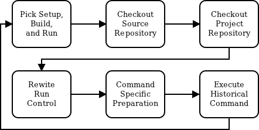

:author: Anthony Scopatz
:email: scopatz@flash.uchicago.edu
:institution: The FLASH Center for Computational Science, The University of Chicago

----------------------------------------------------------
Total Recall: flmake and the Quest for Reproducibility
----------------------------------------------------------

.. class:: abstract

   A short version of the long version that is way too long to be written as a
   short version anyway.  Still, when considering the facts from first
   principles, we find that the outcomes of this introspective approach is
   compatible with the guidelines previously established.

   In such an experiment, it is then clearl that the potential for further
   development not only depends on previous relationships found but also on
   connections made during exploitation of this novel new experimental
   protocol.

.. class:: keywords

   FLASH, reproducibility, version control

Introduction
------------
FLASH is a high-performance computing (HPC) multi-physics code which is used to perform
astrophysical and high-energy density physics simulations [FLASH]_.  It runs on the full 
range of systems from laptops to workstations to 100,000 processor super computers, such 
as the Blue Gene/P at Argonne National Laboratory.

Historically, FLASH was born from a collection of unconnected legacy codes written
primarily in Fortran and merged into a single project.  Over the past 13 years major
sections have been rewritten in other languages.  For instance, I/O is now implemented
in C.  However building, testing, and documentation are all performed in Python.

FLASH has a unique architecture which compiles *simulation specific* executables for each
new type of run.  This is aided by an object-oriented-esque inheritance model that is
implemented by inspecting the file system directory tree.  This allows FLASH to
compile to faster machine code than a compile-once strategy.  However it also
places a greater importance on the Python build system.

To run a FLASH simulation, the user must go through three basic steps: setup, build, and
execution.  Canonically, each of these tasks are independently handled by the user.
However with the recent advent of flmake - a Python workflow management utility for
FLASH - such tasks may now be performed in a repeatable way [FLMAKE]_.

Previous workflow management tools have been written for FLASH.  (For example, the
"Milad system" was implemented entirely in Makefiles.)  However, none of the prior
attempts have placed reproducibility as their primary concern.  This is in part because
fully capturing the setup metadata required alterations to the build system.

The development of flmake started by rewriting the existing build system
to allow FLASH to be run outside of the mainline subversion repository.  It separates out
a project (or simulation) directory independent of the FLASH source directory.  This
directory is typically under its own version control.

For each of the important tasks (setup, build, run, etc), a sidecar metadata
*description* file is either initialized or modified.  This is a simple
dictionary-of-dictionaries JSON file which stores the environment of the
system and the state of the code when each flmake command is run.  This metadata includes
the version information of both the FLASH mainline and project repositories.
However, it also may include all local modifications since the last commit.
A patch is automatically generated using standard posix utilities and stored directly 
in the description.

Along with universally unique identifiers, logging, and Python run control files, the
flmake utility may use the description files to fully reproduce a simulation by
re-executing each command in its original state.  While ``flmake reproduce``
makes a useful debugging tool, it fundamentally increases the scientific merit of
FLASH simulations.

The methods described herein may be used whenever
source code itself is distributed.   While this is true for FLASH (uncommon amongst compiled
codes), most Python packages also distribute their source.  Therefore the same
reproducibility strategy is applicable and highly recommended for Python simulation codes.
Thus flmake shows that reproducibility - which is notably absent from most computational science
projects - is easily attainable using only version control, Python standard library modules, 
and ever-present command line utilities.

New Workflow Features
----------------------
As with many predictive science codes, managing FLASH simulations may be a tedious 
task for both new and experienced users.  The flmake command line utility eases the 
simulation burden and shortens the development cycle by providing a modular tool 
which implements many common elements of a FLASH workflow.  At each stage 
this tool captures necessary metadata about the task which it is performing.  Thus
flmake encapsulates the following opperations:

* setup/configuration,
* building,
* execution,
* logging,
* analysis & post-processing,
* and others.

It is highly recommended that both novice and advanced users adopt flmake as it 
*enables* reproducible research while simultaneously making FLASH easier to use.  
This is accomplished by a few key abstractions from previous mechanisms used to set up,
build, and execute FLASH.  The implemntation of these abstractions are 
critical flmake features and are discussed below.  Namely they are the sepaartion 
of project directories, a serachable source path, logging, dynamic run control, and 
persisted metadata descriptions.

Independent Project Directories
=================================
Without flmake, FLASH must be setup and built from within the FLASH source directory
(``FLASH_SRC_DIR``) using the setup script and make [GMAKE]_.  While this is sufficient 
for single runs, such a strategy fails to separate projects and simulation campaigns from 
the source code. Moreover, keeping simulations next to the source makes it difficult to 
track local modifications independent of the mainline code development.

Because of these difficulties in running suites of simulations from within ``FLASH_SRC_DIR``, 
flmake is intended to be run external to the FLASH source directory.  This is known as the 
project directory.  The project directory should be managed by its own version control
systems.  By doing so, all of the project-specific files are encapsulated in a repository 
whose history is independent from the main FLASH source.   Here this directory is called 
``proj/`` though in practice it takes the name of the simulation campaign.   This 
directory may be located anywhere on the user's file system.

Source & Project Paths Searching
=====================================
After creating a project directory, the simulation source files must be assembled using
the flmake setup command.  This is analogous to executing the traditional setup script. 
For example, to run the classic Sedov problem:

.. raw:: latex

    \vspace{1em}

.. code-block:: sh

        ~/proj $ flmake setup Sedov -auto
        [snip]
        SUCCESS
        ~/proj $ ls
        flash_desc.json  setup/

.. raw:: latex

    \vspace{1em}

This command creates symbolic links to the the FLASH source files in the ``setup/`` directory.
Using the normal FLASH setup script, all of these files must live within 
``${FLASH_SRC_DIR}/source/``.  However, the flmake setup command searches additional paths to 
find potential source files.

By default if there is a local ``source/`` directory in the project directory then this  
is searched first for any potential FLASH units.  The structure of this directory mirrors 
the layout found in ``${FLASH_SRC_DIR}/source/``.  Thus if the user wanted to write a new or 
override an existing driver unit, they could place all of the relevant files in 
``~/proj/source/Driver/``.  Units found in the project source directory take precedence over 
units with the same name in the FLASH source directory.

The most commonly overridden units, however, are simulations. Yet specific simulations 
live somewhat deep in the file system hierarchy as they reside within 
``source/Simulation/SimulationMain/``.  To make accessing 
simulations easier a local project ``simulations/`` directory is first searched for any possible 
simulations.  Thus ``simulations/`` effectively aliases ``source/Simulation/SimulationMain/``. 
Continuing with the previous Sedov example the following directories are 
searched in order of precedence for simulation units, if they exist:

.. raw:: latex

    \vspace{1em}

#. ``~/proj/simulations/Sedov/``
#. ``~/proj/source/Simulation/``
        ``SimulationMain/Sedov/``
#. ``${FLASH_SRC_DIR}/source/``
        ``Simulation/SimulationMain/Sedov/``

.. raw:: latex

    \vspace{1em}

Therefore, it is common for a project directory to have the following structure if the 
project requires many modifications to FLASH that are - at least in the short term - 
inappropriate for mainline inclusion:

.. raw:: latex

    \vspace{1em}

.. code-block:: sh

    ~/proj $ ls
    flash_desc.json  setup/  simulations/  source/

.. raw:: latex

    \vspace{1em}

Logging
======================
In many ways computational simulation is more akin to experimental science than
theoretical science.  Simulations are executed to test the system at hand in analogy 
to how physical experiments probe the natural world.  Therefore, it is useful for 
computational scientists to adopt the time-tested strategy of a keeping a lab notebook
or its electronic analogy.

Various example of virtual lab notebooks exist [VLABNB]_ as a way of storing 
information about how an experiment was conducted.  The resultant data is often  
stored in conjunction with the notebook.  Arguably the corollary concept in
software development is logging.  Unfortunately, most simulation
science makes use of neither lab notebooks nor logging.  Rather than using an 
external rich- or web-client, flmake makes use of the built-in Python logger.

Every flmake command has the ability to log a message.  This follows 
the ``-m`` convention from version control systems.  These messages and associated 
metadata are stored in a ``flash.log`` file in the project directory. 

Not every command uses logging; for trivial commands which do not change state
(such as listing or diffing) log entries are not needed.  However for more serious commands 
(such as building) logging is a critical component.  Understanding that many users cannot 
be bothered to create meaningful log messages at each step, sensible and default messages
are automatically generated.  Still, it is highly recommended that the user provide
more detailed messages as needed.  *E.g.*:

.. raw:: latex

    \vspace{1em}

.. code-block:: sh

    ~/proj $ flmake -m "Run with 600 J laser" run -n 10

.. raw:: latex

    \vspace{1em}

The ``flmake log`` command may then be used to display past log 
messages:

.. raw:: latex

    \vspace{1em}

.. code-block:: sh

    ~/proj $ flmake log -n 1
    Run id: b2907415
    Run dir: run-b2907415
    Command: run
    User: scopatz
    Date: Mon Mar 26 14:20:46 2012
    Log id: 6b9e1a0f-cfdc-418f-8c50-87f66a63ca82

        Run with 600 J laser

.. raw:: latex

    \vspace{1em}

The ``flash.log`` file should be added to the version control of the project.  Entries
in this file are not typically deleted.

Dynamic Run Control
============================
Many aspects of FLASH are declared in a static way.  Such declarations happen mainly
at setup and runtime.  For certain build and run operations several parameters may 
need to be altered in a consistent way to actually have the desired effect.  Such 
repetition can become tedious and usually leads to less readable inputs.

To make the user input more concise and expressive, flmake introduces a run control
``flashrc.py`` file in the project directory.  This is a Python module which is 
executed, if it exists, in an empty namespace whenever flmake is called.  The 
flmake commands may then choose to access specific data in this file.  Please refer 
to individual command documentation for an explanation on if/how the run control
file is used.

The most important example of using ``flashrc.py`` is that the run and restart
commands will update the ``flash.par`` file with values from a ``parameters``
dictionary (or function which returns a dictionary).

.. raw:: latex

    \vspace{1em}
    \begin{center}

Initial ``flash.par``

.. raw:: latex

    \end{center}

.. code-block:: sh

    order = 3
    slopeLimiter = "minmod"
    charLimiting = .true.
    RiemannSolver = "hll"

.. raw:: latex

    \vspace{1em}
    \begin{center}

Run Control ``flashrc.py``

.. raw:: latex

    \end{center}

.. code-block:: python

    parameters = {"slopeLimiter": "mc",
                  "use_flattening": False}

.. raw:: latex

    \vspace{1em}
    \begin{center}

Final ``flash.par``

.. raw:: latex

    \end{center}

.. code-block:: sh

    RiemannSolver = "hll"
    charLimiting = .true.
    order = 3
    slopeLimiter = "mc"
    use_flattening = .false.

.. raw:: latex

    \vspace{1em}

Description Sidecar Files
============================
As a final step, the setup command generates a ``flash_desc.json`` file in the 
project directory.  This is the description file 
for the FLASH simulation which is currently being worked on.  This description 
is a sidecar file whose purpose is to store the following metadata at execution 
of each flmake command:

* the environment,
* the version of both project and FLASH source repository, 
* local source code modifications (diffs),
* the run control files (see above),
* run ids and history, 
* and FLASH binary modification times.

Thus the description file is meant to be a full picture of the way FLASH
code was generated, compiled, and executed.  Total reproducibility of a FLASH
simulation is based on having a well-formed description file.

The contents of this file are essentially a persisted dictionary which contains 
the information listed above.  The top level keys include setup, build, run, 
and merge.  Each of these keys gets added when the corresponding flmake command is
called.  Note that restart alters the run value and does not generate its own 
top-level key.

During setup and build, ``flash_desc.json`` is modified in the project directory.
However, each run receives a copy of this file in the run directory with the run
information added.  Restarts and merges inherit from the file in the previous run 
directory.

These sidecar files enable the flmake reproduce command which is capable of 
recreating a FLASH simulation from only
the ``flash_desc.json`` file and the associated source and project repositories.  
This is useful for testing and verification of the same simulation across multiple 
different machines and platforms.
It is generally not recommended that users place this file under version control
as it may change often and significantly.

Example Workflow
=====================
The fundamental flmake abstractions have now been explained
above.  A  typical flmake workflow which sets up, 
builds, runs, restarts, and merges a fork of a Sedov simulation is 
now demonstrated. First, construct the project repository:

.. raw:: latex

    \vspace{1em}

.. code-block:: sh

    ~ $ mkdir my_sedov
    ~ $ cd my_sedov/
    ~/my_sedov $ mkdir simulations/
    ~/my_sedov $ cp -r ${FLASH_SRC_DIR}/source/\
                 Simulation/SimulationMain/Sedov 
                 simulations/
    ~/my_sedov $ # edit the simulation
    ~/my_sedov $ nano simulations/Sedov/\
                 Simulation_init.F90  
    ~/my_sedov $ git init .
    ~/my_sedov $ git add .
    ~/my_sedov $ git commit -m "My Sedov project"

.. raw:: latex

    \vspace{1em}

Next, create and run the simulation:

.. raw:: latex

    \vspace{1em}

.. code-block:: sh

    ~/my_sedov $ flmake setup -auto Sedov
    ~/my_sedov $ flmake build -j 20
    ~/my_sedov $ flmake -m "First run of my Sedov" \
                                           run -n 10
    ~/my_sedov $ flmake -m "Oops, it died." restart \
                                 run-5a4f619e/ -n 10
    ~/my_sedov $ flmake -m "Merging my first run." \
                        merge run-fc6c9029 first_run
    ~/my_sedov $ flmake clean 1

.. raw:: latex

    \vspace{1em}

Why Reproducibility is Important
----------------------------------
True to its part of speech, much of \`scientific computing' has the trappings of 
science in that it is code produced to solve problems in (big-'S') Science.  
However, the process by which said programs are written is not itself typically 
itself subject to the rigors of the scientific method.  The vaulted method contains 
components of prediction, experimentation, duplication, analysis, and openess 
[GODFREY-SMITH]_.  While software engineerers often engage in such activites when 
programming, scientific developers usually forego these methods, typically to their 
detriment [WILSON]_.

Whatever the reason for this may be - ignorance, sloth, or other deadly sins - 
the impetus for adopting modern software development practices only increases 
every year.  The evolution of tools such as version control and envrionemnt 
reproducing mechanisms (via virtual machines/hypervisors) enable researchers to 
more easily capture information about software during and after production.  
Furthermore, the appearent end of Silicon-based Moore's Law has nececitated a move
to more exotic arichteture and increased parallelism to see further speed 
increases [MIMS]_. This implies that code that runs on machines now may not
be able to run on future processors without significant refactoring.  

Therefore the scientific computing landscape is such that there are presently the
tools and the need to have fully reproducible simulations.  However, most scientists
choose to not utilize these technologies.  This is akin to a chemist not keeping a
lab notebook.  The lack of reproducuibility means that many solutions to science
problems garnered through computational means are relegated to the realm of technical 
achievements.  Irreproducible reults may be novel and interesting but they are not 
science.  Unlike the current paradigm of 
computing-about-science, or 
*periscientific computing*,
reproducibility is a keystone of 
*diacomputiational science* (computing-throughout-science).

In periscientific computing, there may exist a partition between expert software 
developers and expert scientist each of whom must learn to partially speak the 
others' language.   Alternatively, when expert software engineers are not available, 
only the bare minimum development to solve computing problems in the short term is
performed.  In diacomputational science, software exists as a substrate on top of 
which science and engineering problems are solved.  Whether theoretical, simulation, 
or experimental problems are at hand the scientist has a minimum knowledge of resposible
computing tools available to them.  While the level of education required for 
diacomputaional science may seem extreme, this is in fact no greater than what we currently 
expect from scientists with regard to Statistics [WILSON]_.

The above being generally true, there are some of notable exceptions.  The first
is that there are researchers who are congnizant and repectful of these reproducibility
issues.  The efforts of these scientists help paint a less dire picture than the 
one framed above.  

The second exception is that while reproducibility is a key feature of fundemental science 
it is not the only one.  For example, openness is another point whereby the statement
"If a result is not produced openly then it is not science" holds.  Open access to 
reults - itself is a hotly contested issue [VRIEZE]_ - is certainly a component of 
computational science.  Though having open and available code 
is likely critical for pure science, it often lies outside the scope of normal research 
practice.  This is for a vareity of reasons, including the fear that releasing code too 
early or at all will negatively impact personal publication records.

Reproducibility is, therefore, imporant because without it any results generated are 
periscientific.  For diacomputational science there exist computational tools to aid 
in this endeavour, as in analouge science there are physical solutions.  Though it
is not the only critism to be levied against modern research practices, irreproducibility
is one that affects computation acutely and uniquely as compared to other spheres.

The Reproduce Command
----------------------------

The ``flmake reproduce`` command is the key feature enabling the total reproducibility
of a FLASH simulation.  This takes a description file (e.g. ``flash_desc.json``) and implicitly 
the FLASH source and project repositories and replays the setup, build, and run commands 
originally executed.  It has the following usage string:

.. raw:: latex

    \vspace{1em}

.. code-block:: sh

    flmake reproduce [options] <flash_descr>

.. raw:: latex

    \vspace{1em}

For each command, reproduction works by cloning both source and project repositories at a 
the point in history when they were run into temporary directories.  Then any local 
modifications which were present (and not under version control) are loaded from the 
description file and applied to the cloned repos.  It then copies out the run control 
file to the cloned repos and performs and command-specific modifications needed.  Finally,
it executes the appropriate command *from the cloned repository* using the original 
arguments provided on the command line.  Figure :ref:`reproduce` presents a flowsheet 
of this process.

    The reproduce command workflow. :label:`reproduce`

Thus the ``flmake reproduce`` recreates the 
original simulation using the original commands (and not the versions currently present).
The reproduce command has the following limitations:

.. raw:: latex

    \vspace{1em}

#. Source directory must be version controled,
#. Project directory must be version controled,
#. The FLASH run must depend on only the parfile, the FLASH executable and 
   FLASH datafiles, 
#. and the FLASH executable must not be modified between build and run steps.

.. raw:: latex

    \vspace{1em}

The above restrictions enforce that the run is not considered 
reproducible if at any point FLASH depends on externalities or alterations
not tracked by version control.  Additionally critical to this process 
are version contol abstractions and the capabiity to execute historical 
commands. These will be discussed in the following subsections.

Meta-Version Control
======================================

Every user and developer tends towards one version control system or 
another.  The mainline FLASH development team opperates in subversion
[SVN]_ though individual developers may prefer git [GIT]_ or mercurial 
[HG]_.  And as mentioned above, some users do not employ any source 
control management software.  In the case where the user lacks a sophisticated 
version control system, it is still possible to obtain reproducibility *if* a
clean directory tree of a recent release is available. This clean tree must
be stored in a known place, typically the ``.clean/`` subdirectory of the 
``FLASH_SRC_DIR``.  This is known as the \`release' versioning system and 
is managed entirely by flmake.

To realize reproducibility in this environment, it is necessary for the 
reproduce command to abstract core version control management features
away from the underlying technology (or lack of technology).  The following
opperations define version control in the context of reproducibility:

.. raw:: latex

    \vspace{1em}

* info, 
* checkout or clone, 
* diff, 
* and patch.

.. raw:: latex

    \vspace{1em}

The info opperation provides version control information that points to the 
current state of the repository.  For all source control management schemes
this includes a unique string id for the versioning type (e.g. \`svn' for
subversion).  For centralized version control this contains the repository 
version number, while for for distributed systems info will return the branch
and the hash of the current HEAD.  In the release system,
info simply returns the release version number.  The info data that is found
is then stored in the description file for later use.

The checkout (or sometimes clone) opperation is in effect the inverse opperation 
to info.  This opperation takes a point in history, as described by the data 
garnered from info, and makes a temporary copy of the whole repository at this 
point.  Thus no matter what evolution the code has undergone since the description 
file was written, this rolls back the source to its previous incarnation.
For centralized version control this opperation copies the existing tree, reverts it
to an clean version of HEAD, and performs a reverse merge on all commits from 
HEAD to the historical target.  For distributed systems this clones the current
repository, checkouts or updates to the historical position, and does a hard reset
to clean extraneous files.  The release system is easiest in that checkout 
simply copies over the clean subdirectory.  This opperation is performed for 
the setup, build, and run commands at reproduce time.

The diff opperation may seem less than fundemental to version control. Here however, 
diff is used to capture local modifications to the working trees of the source and
project directories.  This diffing is in place as a fail-safe against uncommitted 
changes.  For centralized and distributed systems, diffing is performed through 
the selfsame command name.  In the release system (where committing is impossible), 
diffing takes on the heavy lifting not provided by a more advanced system.  Here it is 
performed by using the posix ``diff`` tool with the recurssive switch between the 
``FLASH_SRC_DIR`` and the clean copy.  The diff opperation is executed when the 
commands are originally run.  The resultant diff string is stored in the 
description file, along with the coorresponding info.

The inverse opperation to diff, therefore, is patch.  This is used at reproduce time
after checkout to restore the working trees of the tempororary repositories to the 
same state they were in at the setup, build, and run commands original execution. 
While each source control management system has its own pathcing mechanism, the 
output of diff always returns a string which is compatible with the posix ``patch``
utility.  Therefore, for all systems (including release), the ``patch`` program 
is used.  

The above illustrates how version control abstraction may be used to define a set 
of meta-opperations which capture all versioning information provided.  This even 
included the case where no formal version control system is used.  It also 
covers the case of the \`forgetful' user who may not have committed every relevant 
local change to the repository prior to running a simulation.  What is more
is that the flmake implementation of these abstractions is only a handful of 
functions that which amount to less than 225 lines of code in Python.  Though small, 
this capability is critical to the reproduce command functioning as intended. 

Command Time Machine
======================================

Another principal feature of flmake reproducibility is its ability to execute
historical versions of the key commands (setup, build, and run) as reincarnated
by the meta-version control.  This is akin to the bootstrapping problem whereby
all of the instruction needed to reproduce a command are contained in the original
information provided.  Without this capability, the most current versions of the 
flmake commands would be acting on histrical versions of the repository.  While this
is clearly a large leap forward for the reproducibility of FLASH simulations, it 
falls well short of total reproducibility.  Thus in practice, historical flmake 
command acting on historical source are needed.  This maye be termed the \`command
time machine,' though it only travels into the past.

The implementation of the command time machine requires the highly dynamic nature 
of Python, a bit namespace slight-of-hand, and relative imports.  First note that 
module and package which are executing the flmake reproduce command may not be 
deleted from the ``sys.modules`` cache.  (Such a removal would cause quick and 
sudden runtime failures.)  This effecitvely means that everything under the 
``flash`` package name may not be modified.

Nominally, the historical version of the package would be under the ``flash`` 
namespace as well.  However, the name ``flash`` is only given at install time.
Inside of the source directory, the package is located in ``tools/python/``.
This allows the current reproduce command to add the checkout out and patched 
``{temp-flash-dir}/tools/`` directory to the front of ``sys.path`` for setup, 
build, and run.  Then the historical flmake may 
be imported via ``python.flmake`` because the ``python/`` subdirectory 
is in ``{temp-flash-dir}/tools/``.  

Modules inside of ``python`` or ``flmake`` are gaurenteed to import other
modules in their package because of the exclusive use of relative imports.
This ensures that the old commands import old commands rather then mistakenly 
importing newer iterations.  

Once the historical command is obtained, it is executed with the original 
arguments from the description file. After execution, the temprary source
directory ``{temp-flash-dir}/tools/`` is removed from ``sys.path``.  
Furthermore, any module whose name starts with ``python`` is also deleted 
from ``sys.modules``.  This cleans the environment for the next historical 
command to be run in its own temporal context.

In effect, the current version of flmake 
is located in the ``flmake`` namespace and should remain untouched while 
the reprodice command is running.  Simelteaneously, the historic flmake 
commands are given the namespace ``python``.   The time value of ``python``
changes with each command reproduced but is fully independent from the 
current flmake.  This method of renaming a package namespace on the file
system allows for one version of flmake to supervise the execution of another
in a manner relevant to reproducibility.

A Note on Replication
---------------------------------
A weaker form of reproducibility (and thus easier to obtain) is known as
*replication* [SCHMIDT]_.  Replication is the process of recreating a result
when "you take all the same data and all the same tools" [GRAHAM]_ which were
used in the original determination.  Replication is a eaker determination than
replication because at minimum the original scientist should be able to replicate
their own work.  Without replication, the same code executed twice will produce 
distinct results.  In this case no trust may be placed in the conclusions 
whatsoever.

Much as version control has given developers greater control over reproducibility, 
other modern tools are powerful instruments of replicability.  Foremost among 
these are hypervisors.  The ease-of-use and ubiquity of virtual machines (VM) in
the software ecosystem allows for the total capture and persistence of the environment
in which any computation was performed.  Such environments may be hosted and shared 
with collaborators, editors, reviewers, or the public at large.  If the original 
anaylsis was perfomed in a VM context, shared, and rerun by other scientists, this
is replicability.  Such a strategy has been proposed by C. T. Brown as a stop-gap 
meausre until diacomputational science is realized [BROWN]_.

However, as Brown admits (see comments), the delination bewteen replication and 
reproduction is fuzzy.  Consider these questions with no clear answer:

.. raw:: latex

    \vspace{1em}

* Are bit-identical results needed for replication?
* How much of the environment must be reinstated for replication
  versus reproduction?
* How much of the hardware and software stack must be recreated?
* What precisely is meant by \`the environment' and how large is it?
* For codes depending on stochastic processes, is reusing the same 
  random seed reproducibility or reproduction?

.. raw:: latex

    \vspace{1em}

Without justifiable answers to the above, ad hoc definitions have 
governed the use of replicability and reproducibility.
Yet to the quantiatively minded a "I know reproducibility when I see it" 
apporach falls short.  Thus the science of science, at least in the 
computational sphere, has much work remaining.

Even with the reproduction/replication dilema, the flmake reproduce 
command *is* a reproducibility tool.  This is because it takes the 
opposite approcah to Brown's VM-based replication.  Though the environment
is captured within the decsription file, flmake reproduce does not attempt 
to recreate this original environment at all.  The previous enviroment 
information is simply there for posterity and to help uncover any 
discrepencies which may arrise.  User specific settings on the reproducing 
machine are maintained.  This includes but is not limited to which compiler 
is used.

The claim that Brown's work and flmake reproduce represent paragons of 
replicability and reproducbibility respectively may be easily challenged.  The author, 
like Brown himself, does not presuppose to have all - or even partially 
satisfactory - answers.  What is presented here, therefore, is an attempt 
to frame the discussion and bound the option space of possibilities.
Doing so with conrete code examples is preferable to continuing to debate
this issue in the abstract.

Conclusions & Future Work
------------------------------
By capturing source code and the environment at key stages - setup, build, 
and run - FLASH simulations may be fully reproduced in the future.   Doing 
so required a wrapper utility called flmake.  The writing of this tool 
involved an overhaul of the existing system.  Though portions of flmake 
took insipration from previous systems, none were as comprehensive.  
Additionally, to the author's knowledge, no previous system included
a mechanism to non-destructively execute previous command incarnations  
a la flmake reproduce.

The creation of flmake itself was done as an exercise in reproducibility.
What has been shown here is that it is indeed possible to increase the
merit of simulation through a relatvely small, though thoughtful, amount 
of code.  It is highly encouraged that the method illustrated here be 
copied by other software-in-science [*]_.  

Moreover, in the process of determining what flmake *should* do, several 
fundemantal questions about reproducibility itself were raised.  This 
points to systemic issues within the realm of computational science
and soon, with the increasing importance of computing, science as a whole.
Unfortunately, there does not appear to be an obvious and present solution
to the problems posed.

As with any software development project, there are further improvements
and expansions that may be made to flmake.  Additional 

Acknowledgements
----------------
Dr. Milad Fatenejad provided a superb sounding board in the conception of the flmake utility
and aided in outlining the constraints of reproducibility.

The software used in this work was in part developed by the DOE NNSA-ASC OASCR Flash Center
at the University of Chicago.

References
----------
.. [BROWN] C. Titus Brown, "Our approach to replication in computational science," 
           Living in an Ivory Basement, April 2012,
           http://ivory.idyll.org/blog/replication-i.html.
.. [FLASH] FLASH Center for Computational Science, *FLASH User's Guide, Version 4.0-beta,*
            http://flash.uchicago.edu/site/flashcode/user_support/flash4b_ug.pdf, 
            University of Chicago, February 2012.
.. [FLMAKE] A. Scopatz, *flmake: the flash workflow utility,* 
            http://flash.uchicago.edu/site/flashcode/user_support/tools4b/usersguide/flmake/index.html,
            The University of Chicago, June 2012.
.. [GIT] Scott Chacon, "Pro Git," Apress (2009) DOI: 10.1007/978-1-4302-1834-0
.. [GMAKE] Free Software Foundation, The GNU Make Manual for version 3.82, 
            http://www.gnu.org/software/make/, 2010.
.. [GODFREY-SMITH] Godfrey-Smith, Peter (2003), *Theory and Reality: An introduction to 
            the philosophy of science*, University of Chicago Press, ISBN 0-226-30063-3.
.. [GRAHAM] Jim Graham, "What is \`Reproducibility,' Anyway?", Scimatic, April 2010, 
            http://www.scimatic.com/node/361.
.. [HG] Bryan O'Sullivan, "Mercurial: The Definitive Guide," O'Reilly Media, Inc., 2009.
.. [MIMS] C. Mims, *Moore's Law Over, Supercomputing "In Triage," Says Expert,*
            http://www.technologyreview.com/view/427891/moores-law-over-supercomputing-in-triage-says/
            May 2012, Technology Review, MIT.
.. [SCHMIDT] Gavin A. Schmidt, "On replication," RealClimate, Feb 2009, 
             http://www.realclimate.org/index.php/archives/2009/02/on-replication/langswitch_lang/in/.
.. [SVN] Ben Collins-Sussman, Brian W. Fitzpatrick, C. Michael Pilato (2011). 
         "Version Control with Subversion: For Subversion 1.7". O'Reilly.
.. [VLABNB] Rubacha, M.; Rattan, A. K.; Hosselet, S. C. (2011). *A Review of Electronic 
            Laboratory Notebooks Available in the Market Today*. Journal of Laboratory 
            Automation 16 (1): 90–98. DOI:10.1016/j.jala.2009.01.002. PMID 21609689. 
.. [VRIEZE] Jop de Vrieze, *Thousands of Scientists Vow to Boycott Elsevier to Protest Journal 
            Prices,* Science Insider, February 2012.
.. [WILSON] G.V. Wilson, *Where's the real bottleneck in scientific computing?* Am Sci. 
            2005;94:5.

.. [*] Please contact the author if you require aid in any reproducibility endeavours.
