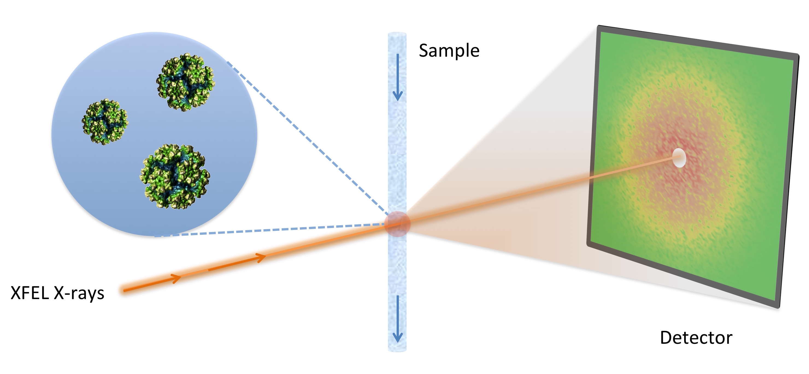
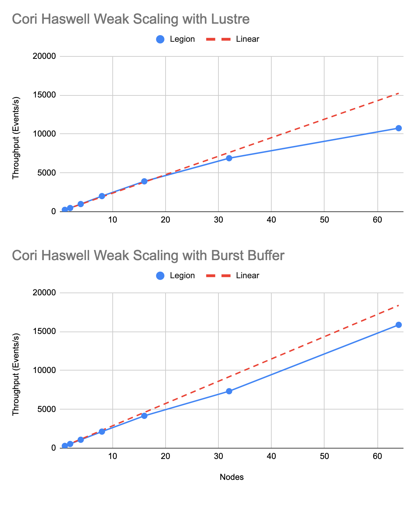
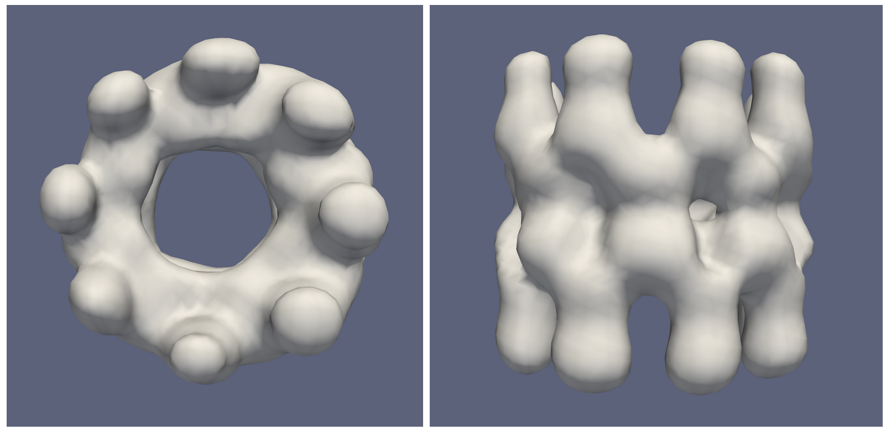

:author: Antoine Dujardin
:email: dujardin@slac.stanford.edu
:institution: SLAC National Accelerator Laboratory, 2575 Sand Hill Road, Menlo Park, CA 94025, USA

:author: Elliott Slaugther
:institution: SLAC National Accelerator Laboratory, 2575 Sand Hill Road, Menlo Park, CA 94025, USA

:author: Jeffrey Donatelli
:institution: Lawrence Berkeley National Laboratory, Berkeley, CA 94720-8142, USA

:author: Peter Zwart
:institution: Lawrence Berkeley National Laboratory, Berkeley, CA 94720-8142, USA

:author: Amedeo Perazzo
:institution: SLAC National Accelerator Laboratory, 2575 Sand Hill Road, Menlo Park, CA 94025, USA

:author: Chun Hong Yoon
:email: yoon82@slac.stanford.edu
:institution: SLAC National Accelerator Laboratory, 2575 Sand Hill Road, Menlo Park, CA 94025, USA

:bibliography: mybib

:video: <To Be Determined>

------------------------------------------
Fluctuation X-ray Scattering real-time app
------------------------------------------

.. class:: abstract

   The Linac Coherent Light Source (LCLS) at the SLAC National Accelerator Laboratory is an X-ray Free Electron Laser (X-FEL) enabling scientists to take snapshots of single macromolecules to study their structure and dynamics. A major LCLS upgrade, LCLS-II, will bring the repetition rate of the X-ray source from 120 to 1 million pulses per second and High Performance Computing capabilities in the exascale will be required for the data analysis to keep up with the future data taking rates.

   We present here a Python application for Fluctuation X-ray Scattering (FXS), an emerging technique for analyzing biomolecular structure from the angular correlations of FEL diffraction snapshots with one or more particles in the beam. This FXS application for experimental data analysis is being developed to run on supercomputers in near real-time while an experiment is taking place.

   We will discuss how we accelerated the most compute intensive parts of the application and how we used Pygion, a Python interface for the Legion task-based programming model, to parallelize and scale the application.

.. class:: keywords

   fluctuation scattering, free electron laser, real-time analysis

Introduction
------------

LCLS-II, an upgrade to LCLS
+++++++++++++++++++++++++++

The Linac Coherent Light Source (LCLS) at the SLAC National Accelerator Laboratory is an X-ray Free Electron Laser providing femtosecond pulses with an ultrabright beam approximately one billion times brighter than synchrotrons. Such a brightness allows to work with much smaller sample sizes while the shortness allows imaging below the rotational diffusion time of the molecules. With pulses of such an unprecedented brightness and shortness, scientists are able to take snapshots of single macromolecules without the need for crystallization at ambient temperature.

To push the boundaries of the science available at the lightsource, LCLS is currently being upgraded after 10 years of operation. The LCLS-II upgrade will progressively increase the sampling rate from 120 pulses per second to 1 million. At these rates, the LCLS instruments will generate multiple terabytes per second of science data and it will therefore be critical to know what data is worth saving, requiring on-the-fly processing of the data. Earlier, users could classify and preprocess their data after the experiment, but this approach will become either prohibitive or plainly impossible. This leads us to the requirement of performing some parts of the analysis in real time during the experiment.

Quasi real time analysis of the LCLS-II datasets will require High Performance Computing, potentially at the Exascale, which cannot be offered in-house. Therefore, a pipeline to a supercomputing center is required. The Pipeline itself starts with a Data Reduction step to reduce the data size, using vetoing, feature extraction, and compression in real time. We then pass the data over the Energy Sciences Network (ESnet) to the National Energy Research Scientific Computing Center (NERSC). ESNet is a high-speed network with a current capability of 100Gbps, which will have to be increased to the Tbps range. At the end of the pipeline, the actual analysis can take place on NERSC’s supercomputers. This makes the whole process, from the sample to the analysis, quite challenging to change and adapt.

However, LCLS experiments are typically high-risk / high-reward and involve novel setups, varying levels of requirements, and last only for a few days of beam time. The novelty in the science can require adaptations in the algorithms, requiring the data analysis itself to be highly flexible. Furthermore, we want to give users as much freedom as possible in the way they analyze their data without expecting them to have a deep knowledge of large-scale computer programming.

Therefore, we require real time analysis, high performance computing capabilities and a complex pipeline, while at the same time requiring enough flexibility to adapt to novel experimental setups and analysis algorithms. We believe Python helps us in this compromise pretty well.

FXS: an example analysis requiring HPC
++++++++++++++++++++++++++++++++++++++

While a variety of experiments that can be performed at LCLS, we will here focus on one specific example: Fluctuation X-ray Scattering (FXS).

X-ray scattering of particles in a solution is a common technique in the study of the structure and dynamics of macromolecules in biologically-relevant conditions and gives an understanding of their function. However, traditional methods currently used at synchrotrons suffer from the fact that the exposure time is longer than the rotation time of the particle, leading to the capture of angularly-averaged patterns.
FXS techniques fully utilize the femtosecond pulses to measure diffraction patterns from multiple identical macromolecules below the sample rotational diffusion times (Fig. :ref:`fig:fxs`). The patterns are then collected to reconstruct a 3D structure of the macromolecule or measure some of its properties. It has been described in the late 1970s :cite:`Kam1977,Kam1981` and has then been performed at LCLS before the upgrade :cite:`Pande2018,Kurta2017,Mendez2014,Mendez2016`.

   Fluctuation X-ray Scattering experiment setup. :label:`fig:fxs`

While a few hundreds of diffraction patterns might be sufficient in good conditions and for a low resolution :cite:`Kurta2017`, the number of snapshots required can be dramatically increased when working with low signal-to-noise ratios (e.g. small proteins) or when studying low-probability events. More interestingly, the addition of a fourth dimension, time, to study dynamical processes expands again the amount of data required. At these points, hundreds of millions or more snapshots could be required.

We present here a Python application for FXS data analysis that is being developed to run on supercomputing facilities at US national laboratories in near real-time while an experiment is taking place. As soon as data is produced, it is passed through a Data Reduction Pipeline on-site and sent to a supercomputer via ESNet, where reconstructions can be performed. It is critical to complete this analysis in near real-time to guide experimental decisions.

In FXS, each diffraction pattern contains several identical particles in random orientations. Information about the structure of the individual particle can be recovered by studying the two-point angular correlation of the data. To do so, the 2D images are expanded in a 3D, orientation-invariant space, where they are aggregated using the following formula:

.. math::
   :label: eq:intro

   C_2(q, q', \Delta\phi) = \frac{1}{2 \pi N} \sum_{j=1}^N \int_0^{2 \pi} I_j(q, \phi) I_j(q', \phi+\Delta\phi) d\phi

where :math:`I_j(q, \phi)` represents the intensity of the j-th image, in polar coordinates. This correlator can then be used as a basis for the actual 3D reconstruction of the data (Fig. :ref:`fig:reconstruction`), using an algorithm described elsewhere :cite:`Donatelli2015,Pande2018`.

Acceleration: getting the best out of numpy
-------------------------------------------

The expansion/aggregation step presented in Equation (:ref:`eq:intro`) was originally the most computation intensive part of the application, representing the vast majority of the computation time. The original implementation was processing each :math:`I_j(q, \phi)` image one after the other and aggregating the results. This resulted in taking 424 milliseconds per image using numpy functions and slightly better performances using numba. As we will illustrate in this section, rewriting this critical step allowed us to gain a factor of 40 in its speed, without any other libraries or tools.

Let us start by simplifying Equation (:ref:`eq:intro`). The integral corresponds to the correlation over of :math:`I_j(q, \phi)` and :math:`I_j(q', \phi)`. Thanks to the Convolution Theorem, we have

.. math::
   :label: eq:fourier

   C_2(q, q', \Delta\phi) = \frac{1}{2 \pi N} \sum_{j=1}^N F^{-1}[F[I_j(q, \phi)] \overline{F[I_j(q', \phi)]}],

where :math:`F` represents the Fourier transform over :math:`\phi`. The inverse Fourier transform being linear, we can get it outside of the sum, and on the left side. For the simplicity of the argument, we will also neglect all coefficients.

Using :math:`\psi` as the equivalent of :math:`\phi` in the Fourier transform and :math:`A_j(q, \psi)` as a shorthand for :math:`F[I_j(q, \phi)]`, we have:

.. math::
   :label: eq:A

   C_2(q, q', \Delta\phi) = \frac{1}{2 \pi N} \sum_{j=1}^N A_j(q, \psi) \overline{A_j(q', \psi)}.

We end up with the naive implementation below:

.. code-block:: python

  C2 = np.zeros(C2_SHAPE, np.complex128)
  for i in range(N_IMGS):
      A = np.fft.fft(images[i], axis=-1)
      for j in range(N_RAD_BINS):
          for k in range(N_RAD_BINS):
              C2[j, k, :] += A[j] * A[k].conj()

taking 42.4 seconds (for 100 images), using the following parameters:

.. code-block:: python

  N_IMGS = 100
  N_RAD_BINS = 300
  N_PHI_BINS = 256
  IMGS_SHAPE = (N_IMGS, N_RAD_BINS, N_PHI_BINS)
  C2_SHAPE = (N_RAD_BINS, N_RAD_BINS, N_PHI_BINS)

where :code:`N_RAD_BINS` and :code:`N_PHI_BINS` represent the image dimensions over the :math:`q`- and :math:`\phi`-axes, as well as the dataset:

.. code-block:: python

  images = np.random.random(IMGS_SHAPE)

We will note that a typical application would be processing millions of images, but let us use 100 for the example.

This naive version can be slightly accelerated using the fact that our matrix is conjugate-symmetric:

.. code-block:: python

  C2 = np.zeros(C2_SHAPE, np.complex128)
  for i in range(N_IMGS):
      A = np.fft.fft(images[i], axis=-1)
      for j in range(N_RAD_BINS):
          C2[j, j, :] += A[j] * A[j].conj()
          for k in range(j+1, N_RAD_BINS):
              tmp = A[j] * A[k].conj()
              C2[j, k, :] += tmp
              C2[k, j, :] += tmp.conj()

which takes 36.0 seconds. Let us note that this is only 1.18 times faster, far from a 2x speed-up.

That naive implementation should not be confused with a pure Python implementation, which would be expected to be slow, since we already operate on numpy arrays along the  axis. Such an implementation could be approximated by:

.. code-block:: python

  A = np.fft.fft(images[i], axis=-1)
  for j in range(N_RAD_BINS):
      for k in range(N_RAD_BINS):
          for l in range(N_PHI_BINS):
              C2[j, k, l] += A[j, l] * A[k, l].conj()

which takes 49.1 seconds per image, i.e. about 100 times slower, in accordance with the stereotype of Python being much slower than other languages.

A common acceleration strategy is to use numba:

.. code-block:: python

  @numba.jit
  def A_to_C2(A):
      C2 = np.zeros(C2_SHAPE, np.complex128)
      for j in range(N_RAD_BINS):
          C2[j, j, :] += A[j] * A[j].conj()
          for k in range(j+1, N_RAD_BINS):
              tmp = A[j] * A[k].conj()
              C2[j, k, :] += tmp
              C2[k, j, :] += tmp.conj()
      return C2

  C2 = np.zeros(C2_SHAPE, np.complex128)
  for i in range(N_IMGS):
      A = np.fft.fft(images[i], axis=-1)
      C2 += A_to_C2(A)

which takes 38.5 seconds, i.e. 10% faster than the naive implementation.

When considering our problem size of up to millions of images, processing images one at a time makes sense. However, focusing on a small batch as we have been doing in these examples, a strategy can be to have numpy and/or numba work on arrays of images, rather than the individual images. We then have the following:

.. code-block:: python

  @numba.jit
  def As_to_C2(As):
      C2 = np.zeros(C2_SHAPE, np.complex128)
      for i in range(N_IMGS):
          A = As[i]
          for j in range(N_RAD_BINS):
              C2[j, j, :] += A[j] * A[j].conj()
              for k in range(j+1, N_RAD_BINS):
                  tmp = A[j] * A[k].conj()
                  C2[j, k, :] += tmp
                  C2[k, j, :] += tmp.conj()
      return C2

  As = np.fft.fft(images, axis=-1)
  C2 = As_to_C2(As)

which takes 11.9 seconds, i.e. 3.56 times faster. We will note also here the batching of the Fast Fourier Transform.

However, such an implementation does not sound trivial using numpy… although one can recognize a nice (generalized) Einstein sum in Equation (:ref:`eq:A`), leading to:

.. code-block:: python

  As = np.fft.fft(images, axis=-1)
  C2 = np.einsum('hik,hjk->ijk', As, As.conj())

This takes 17.9 seconds, which is slower than the version using numba per batch. However, we can realize that, at this batch level, the last axis is independent from the others… and that the underlying alignment of the arrays matters. Thanks to numpy’s :code:`asfortranarray` function, however, that is not an issue. We will use the F-ordered dataset.

.. code-block:: python

  images_F = np.asfortranarray(images)

We observe, for the Einstein sum:

.. code-block:: python

  As = np.fft.fft(images_F, axis=-1)
  C2 = np.einsum('hik,hjk->ijk', As, As.conj())

taking 4.05 seconds, i.e. 4.42 times faster than the C-ordered Einstein sum and 10.5 times faster than the naive implementation.

Further than that, in our precise case, we can actually express it as a more optimized dot product:

.. code-block:: python

  As = np.fft.fft(images, axis=-1)
  C2 = np.zeros(C2_SHAPE, np.complex128)
  for k in range(N_PHI_BINS):
      C2[..., k] += np.dot(As[..., k].T,
                           As[..., k].conj())

which now brings us down to 1.37 seconds, i.e. 30.9 times faster than the naive version.

For the F-ordered case, we have:

.. code-block:: python

  As = np.fft.fft(images_F, axis=-1)
  C2 = np.zeros(C2_SHAPE, np.complex128, order='F')
  for k in range(N_PHI_BINS):
      C2[..., k] += np.dot(As[..., k].T,
                           As[..., k].conj())

taking 1.06 seconds, i.e. 1.29 times faster than the C-ordered case and 40.0 times faster than the naive implementation.
We could note that, at that speed, the main computation gets close to the time required to perform the Fast Fourier Transform, which is, in our case at least, faster on C-ordered (107 ms) than F-ordered (230 ms) data. Removing the FFT computation would yield an even starker contrast (977 ms vs. 499 ms), but would neglect the cost of the re-alignment.

In conclusion, implementing using numpy or numba naively gives significant improvement on computational speed compared to pure Python, but there is still a lot of room for improvement. On the other hand, such improvement does not necessarily require using fancier tools. In our case, we showed that batching our computation helped in the numba case. From there, a batched numpy expression looked interesting. However, it required optimizing the mathematical formulation of the problem to come up with a canonical expression, which could then be handed over to numpy. Last but not least, the memory layout can have a sizable impact on the computation, while being easy to tweak in numpy.

Parallelization: effortless scaling with Pygion
-----------------------------------------------

To parallelize and scale the application we use Pygion, a Python interface for the Legion task-based programming system :cite:`Slaughter2019`. In Pygion, the user decorates functions as *tasks*, and annotates task parameters with *privileges* (read, write, reduce), but otherwise need not be concerned with how tasks execute on the underlying machine. Pygion infers the dependencies between tasks based on their privileges and the values of arguments passed to tasks, and ensures that the program executes correctly, even when running on a parallel and distributed supercomputer.

To enable the task-based system, it is necessary to separate the data handling from the data itself. This reification of the data flow is achieved by declaring *regions*, similar to multi-dimensional Pandas dataframes :cite:`McKinney2010`. Regions contain *fields*, each of which being similar to and exposed as a numpy array. Regions can be partitioned into subregions, which can be processed by different tasks, allowing the parallelism.

We scale up to 64 nodes of NERSC’s Cori Haswell using Pygion, with 10 to 30 processes per node, to reach a throughput of more than 15,000 images per second, as illustrated in Figures :ref:`fig:scaling`. Compared to an equivalent MPI implementation, Pygion scales out of the box as it manages the load-balancing and provides high-level parallelization constructs. These constructs make it easy to rapidly explore different partitioning strategies, without writing or rewriting any communication code. This enabled us to quickly find a strategy that scales better than the straightforward but ultimately suboptimal strategy that we initially developed.

   Weak scaling behavior on Cori Haswell with Lustre filesystem (top) and Burst Buffer (bottom). :label:`fig:scaling`

As an example, the most computationally intensive part of our problem is the :math:`C_2(q, q', \Delta\phi)` computation discussed in details in the section above, which can trivially be parallelized over the last (angular) axis.
However, the image preprocessing and the Fast Fourier Transform can only be parallelized over the first (image) axis.
Given the size of the data, parallelizing between nodes would involve a lot of data movement. Parallelizing within a node, however, could help. In the MPI case (MPI+MPI), we use MPI to parallelize between nodes and within a node. To take the present optimization into account, one would have to create a 2-level structure such as::

  In each node:
    Define node-level communicator
    In each rank:
      Receive and pre-process some stacks of images
    All-to-all exchange from stacks of images
      to angular sections
    In each rank:
      Process the received angular section

where all the data exchange has to be coded by hand.

In the Pygion case, the ability to partition the data allows us to create tasks that are unaware of the extent of the regions on which they operate. We can therefore partition these regions both over the image axis and the angular one. We end up with

.. code-block:: python

  @task(privileges=[...])
  def node_level_task(...):
      for i, batch in enumerate(data_batches):
          preprocess(input_=batch,
                     output=A_image_partition[i])
      for i in range(NUMBER_OF_PROCESSES):
          process(input_=A_angular_partition[i],
                  output=C2_angular_partition[i])

where the data exchange is implied by the image-axis partition :code:`A_image_partition` and the angular-axis partition :code:`A_angular_partition` of the same region :code:`A`.

Results
-------

To test our framework, a dataset of 100,000 single-particle diffraction images was simulated from a lidless chaperone (mm-cpn) in its open state, using Protein Data Bank entry 3IYF :cite:`Zhang2010`. These images were processed by the algorithm described above to get the 2-point correlation function, :math:`C_2(q, q', \Delta\phi)`, described in Equation (:ref:`eq:intro`). This correlation function was first filtered and reduced using the methods described in :cite:`Pande2018`, and then the reconstruction algorithm in :cite:`Donatelli2015` was applied to reconstruct the electron density of the chaperone from the reduced correlations, yielding the reconstruction shown in Figure :ref:`fig:reconstruction`.

   Reconstruction of a lidless chaperone (mm-cpn) in its open state from simulated diffraction patterns. :label:`fig:reconstruction`

Interestingly, the size of the correlation function only increases with the desired resolution and is independent from the number of images in the dataset. Therefore, the post-processing of the correlation function and the reconstruction algorithm do not scale with the amount of data being processed.

Conclusion
----------

The Linac Coherent Light Source provides scientists with the ability of X-ray diffraction patterns with much higher brightness and much shorter timescales, allowing experiments not possible elsewhere.
With its upgrades LCLS-II in 2021 and LCLS-II-HE (High Energy) in 2025, LCLS experiments will produce up to millions of X-ray pulses per second and generate incommensurable amounts of data.
In some cases, such as the FXS technique described in this paper, the processing of the dataset will require High Performance Computing at a scale that can no longer be provided in-house.

We mentioned that Python gives us and our users the flexibility to adapt the analysis pipeline to new experiments. The main drawback of Python is that implementing new algorithms without relying on specialized libraries can be problematically slow. However, we illustrate with our example that spending some time optimizing the math of the problem (rather than the code) and being aware of the strengths and weaknesses of numpy and numba can allow us to achieve drastically better performances, without the need to develop or use external libraries.

Finally, we used Pygion to manage the parallelization of the problem, which allows us to design applications that scale much more naturally than MPI at a given level of coding effort.
