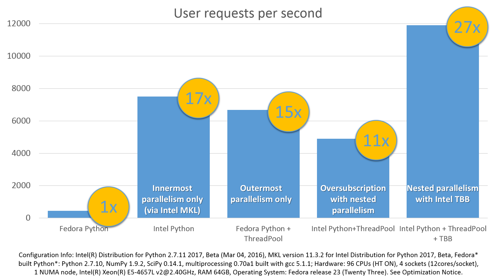
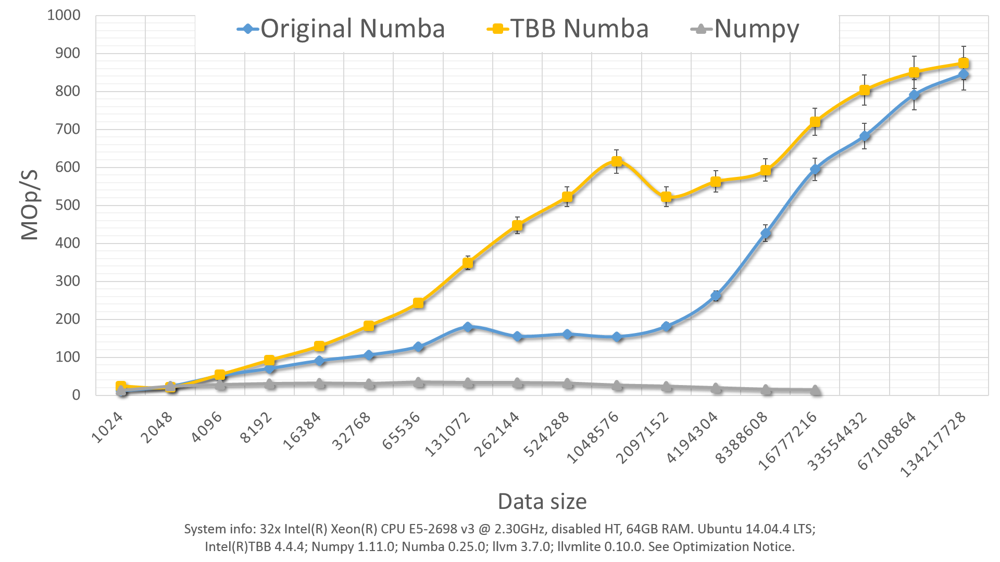

:author: Anton Malakhov
:email: Anton.Malakhov@intel.com
:institution: Intel Corporation
:year: 2016

:video: https://youtu.be/kfQcWez2URE

-----------------------------------------------
Composable Multi-Threading for Python Libraries
-----------------------------------------------

.. class:: abstract

   Python is popular among numeric communities that value it for easy to use number crunching modules like [NumPy]_, [SciPy]_, [Dask]_, [Numba]_, and many others.
   These modules often use multi-threading for efficient multi-core parallelism in order to utilize all the available CPU cores.
   Nevertheless, their threads can interfere with each other leading to overhead and inefficiency if used together in one application.
   The loss of performance can be prevented if all the multi-threaded parties are coordinated.
   This paper describes usage of Intel |R| Threading Building Blocks (Intel |R| TBB), an open-source cross-platform library for multi-core parallelism [TBB]_, as the composability layer for Python modules.
   It helps to unlock additional performance for numeric applications on multi-core systems.

.. class:: keywords

   Multi-threading, Over-subscription, Parallel Computations, Nested Parallelism, Multi-core, Python, GIL, Dask, Joblib, NumPy, SciPy, Numba, TBB

.. [NumPy] NumPy, http://www.numpy.org/
.. [SciPy] SciPy, https://www.scipy.org/
.. [Dask]  Dask, http://dask.pydata.org/
.. [Numba] Numba, http://numba.pydata.org/
.. [TBB]   Intel(R) TBB open-source site, https://www.threadingbuildingblocks.org/

Motivation
----------
The fundamental shift toward parallelism was loudly declared more than 11 years ago [HSutter]_ and multi-core processors have become ubiquitous nowadays [WTichy]_.
However, the adoption of multi-core parallelism in the software world has been slow and Python along with its computing ecosystem is not an exception.
Python suffers from several issues which make it suboptimal for parallel processing.

.. [HSutter] Herb Sutter, "The Free Lunch Is Over", Dr. Dobb's Journal, 30(3), March 2005.
             http://www.gotw.ca/publications/concurrency-ddj.htm
.. [WTichy]  Walter Tichy, "The Multicore Transformation", Ubiquity, Volume 2014 Issue May, May 2014. DOI: 10.1145/2618393.
             http://ubiquity.acm.org/article.cfm?id=2618393

The parallelism with multiple isolated processes is popular in Python but it is prone to inefficiency due to memory-related overhead.
On the other hand, multi-threaded parallelism is known to be more efficient but with Python, though it suffers from the limitations of the global interpreter lock [GIL]_, which prevents scaling of Python programs effectively serializing them.
However, when it comes to numeric computations, most of the time is spent in native code where the GIL can easily be released and programs can scale.

.. [GIL] David Beazley, "Understanding the Python GIL", PyCON Python Conference, Atlanta, Georgia, 2010.
         http://www.dabeaz.com/python/UnderstandingGIL.pdf

Scaling parallel programs is not an easy thing.
There are two fundamental laws which mathematically describe and predict scalability of a program: Amdahl's Law and Gustafson-Barsis' Law [AGlaws]_.
According to Amdahl's Law, speedup is limited by the serial portion of the work, which effectively puts a limit on scalability of parallel processing for a fixed-size job.
Python is especially vulnerable to this because it makes the serial part of the same code much slower compared to implementations  in some other languages due to its deeply dynamic and interpretative nature.
Moreover, the GIL makes things serial often where they potentially can be parallel, further adding to the serial portion of a program.

.. [AGlaws] Michael McCool, Arch Robison, James Reinders, "Amdahl's Law vs. Gustafson-Barsis' Law", Dr. Dobb's Parallel, October 22, 2013.
            http://www.drdobbs.com/parallel/amdahls-law-vs-gustafson-barsis-law/240162980

Gustafson-Barsis' law offers some hope stating that if the problem-size grows along with the number of parallel processors, while the serial portion grows slowly or remains fixed, speedup grows as processors are added.
This might relax the concerns regarding Python as a language for parallel computing since the serial portion is mostly fixed in Python when all the data-processing is hidden behind libraries like NumPy and SciPy which are written in other languages.
Nevertheless, a larger problem size demands more operational memory to be used for processing it, but memory is a limited resource.
Thus, even working with "Big Data", it must be processed by chunks that fit into memory, which puts a limit for the growth of the problem-size.
As result, the best strategy to efficiently load a multi-core system is still to fight against serial regions and synchronization.

Nested Parallelism
------------------
One way to do that is to expose parallelism on all the possible levels of an application, for example, by making outermost loops parallel or exploring functional or pipeline types of parallelism on the application level.
Python libraries that help to achieve this are Dask [Dask]_, Joblib [Joblib]_, and even the built-in :code:`multiprocessing` module [mproc]_ (including its :code:`ThreadPool` class).
On the innermost level, data-parallelism can be delivered by Python modules like NumPy [Numpy]_ and SciPy [SciPy]_.
These modules can be accelerated with an optimized math library like Intel |R| Math Kernel Library (Intel |R| MKL) [MKL]_, which is multi-threaded internally using OpenMP [OpenMP]_ (with default settings).

.. [mproc]  Python documentation on *multiprocessing*, https://docs.python.org/library/multiprocessing.html
.. [Joblib] Joblib, http://pythonhosted.org/joblib/
.. [OpenMP] The OpenMP(R) API specification for parallel programming, http://openmp.org/
.. [MKL]    Intel(R) MKL, https://software.intel.com/intel-mkl

When everything is combined together, it results in a construction where code from one parallel region calls a function with another parallel region inside.
This is called *nested parallelism*.
It is an efficient way for hiding latencies of synchronization and serial regions which are an inevitable part of regular NumPy/SciPy programs.

Issues of Over-subscription
---------------------------
Nevertheless, the libraries named above do not coordinate the creation or pooling of threads, which may lead to *over-subscription*, where there are more active software threads than available hardware resources.
It can lead to sub-optimal execution due to frequent context switches, thread migration, broken cache-locality, and finally to a load imbalance when some threads have finished their work but others are stuck, thus halting the overall progress.

For example, OpenMP (used by NumPy/SciPy) may keep its threads active for some time to start subsequent parallel regions quickly.
Usually, this is a useful approach to reduce work distribution overhead.
Yet with another active thread pool in the application, it impairs better performance because while OpenMP worker threads keep consuming CPU time in busy-waiting loops, the other parallel work cannot start until OpenMP threads stop spinning or are preempted by the OS.

Because overhead from linear over-subscription (e.g. 2x) is not always visible on the application level (especially for small systems), it can be tolerated in many cases when the work for parallel regions is big enough.
However, in the worst case a program starts multiple parallel tasks and each of these tasks ends up executing an OpenMP parallel region.
This results in quadratic over-subscription (with default settings) which ruins multi-threaded performance on systems with a significant number of threads (roughly more than ten).
In some big systems, it may not even be possible to create as many software threads as the number of hardware threads multiplied by itself due to insufficient resources.

Threading Composability
-----------------------
Altogether, the co-existing issues of multi-threaded components define *threading composability* of a program module or a component.
A perfectly composable component should be able to function efficiently among other such components without affecting their efficiency.
The first aspect of building a composable threading system is to avoid creation of an excessive number of software threads, preventing over-subscription.
That effectively means that a component and especially a parallel region cannot dictate how many threads it needs for execution (*mandatory parallelism*).
Instead, it should expose available parallelism to a work scheduler (*optional parallelism*), which is often implemented as a user-level work stealing task scheduler that coordinates tasks between components and parallel regions and map them onto software threads.
Since such a task scheduler shares a single thread pool among all the program modules and native libraries, it has to be efficient enough to be attractive for high-performance libraries.
Otherwise, these libraries will not be able or willing to switch their own threading model to the new scheme.

Intel Solution
--------------
.. figure:: components.png

   Intel |R| Threading Building Blocks is used as a common runtime for different Python modules. :label:`components`

Intel's approach to achieve threading composability is to use Intel |R| Threading Building Blocks (Intel |R| TBB) library as the common work scheduler, see Figure :ref:`components`.
Intel |R| TBB is an open-source, cross-platform, mature and recognized C++ library for enabling multi-core parallelism.
It was designed for composability, as well as optional and nested parallelism support.

In the Intel |R| Distribution for Python 2017 Beta and later, as part of Intel |R| TBB release 4.4 Update 5, I introduce an experimental module which unlocks the potential for additional performance for multi-threaded Python programs by enabling threading composability between two or more thread-enabled libraries.
Thanks to threading composability, it can accelerate programs by avoiding inefficient thread allocation as discussed above.

The TBB module implements a :code:`Pool` class with the standard Python interface using Intel |R| TBB which can be used to replace Python's :code:`ThreadPool`.
Python allows users to dynamically replace any object (e.g. class or function) at runtime (*monkey patching*).
Thanks to this technique implemented in class :code:`Monkey`, no source code change is needed in order to enable single thread pool across different Python modules.
The TBB module also switches Intel |R| MKL to use TBB-based threading layer, which automatically enables composable parallelism [ParUniv]_ for NumPy and SciPy calls.

.. [ParUniv] Vipin Kumar E.K. *A Tale of Two High-Performance Libraries*,
             The Parallel Universe Magazine, Special Edition, 2016.
             https://software.intel.com/intel-parallel-universe-magazine

Usage example
-------------
For our first experiment, we need Intel |R| Distribution for Python [IntelPy]_ to be installed along with the Dask [Dask]_ library which simplifies parallelism with Python.

.. [IntelPy] Intel(R) Distribution for Python, https://software.intel.com/python-distribution

.. code-block:: sh

    # install Intel(R) Distribution for Python
    <path to installer of the Distribution>/install.sh
    # setup environment
    source <path to the Distribution>/bin/pythonvars.sh
    # install Dask
    conda install dask

The code below is a simple program using NumPy that validates QR decomposition by multiplying computed components and comparing the result against the original input:

.. code-block:: python
    :linenos:

    import time, numpy as np
    x = np.random.random((100000, 2000))
    t0 = time.time()
    q, r = np.linalg.qr(x)
    test = np.allclose(x, q.dot(r))
    assert(test)
    print(time.time() - t0)

And here is the same program using Dask:

.. code-block:: python
    :linenos:

    import time, dask, dask.array as da
    x = da.random.random((100000, 2000),
                   chunks=(10000, 2000))
    t0 = time.time()
    q, r = da.linalg.qr(x)
    test = da.all(da.isclose(x, q.dot(r)))
    assert(test.compute()) # threaded
    print(time.time() - t0)

Here, Dask splits the array into 10 chunks and processes them in parallel using multiple threads.
However, each Dask task executes the same NumPy matrix operations which are accelerated using Intel |R| MKL under the hood and thus multi-threaded by default.
This combination results in nested parallelism, i.e. when one parallel component calls another component, which is also threaded.

The reason why the Dask version was set to have only 10 tasks is to model real-life applications with limited parallelism on the outermost level, which is quite typical for functional and pipeline types of parallelism.
Such cases might benefit the most from enabling parallelism at inner levels of the code.
In the case when the top-level parallelism can load all the available cores and is well-balanced, nested parallelism is not that likely to improve performance (but can make it much worse without a composable threading solution).

Here is an example of running the benchmark program in three different modes:

.. code-block:: sh
    :linenos:

    python bench.py                   # Default MKL
    OMP_NUM_THREADS=1 python bench.py # Serial MKL
    python -m TBB bench.py            # Intel TBB mode

.. figure:: dask_qr_bench.png
   
   Execution times for QR validation example. :label:`qrpic`

Figure :ref:`qrpic` shows performance results acquired on a 32-core (no hyper-threading) machine with 64GB memory. The results presented here were acquired with cpython v3.5.1; however, there is no performance difference with cpython v2.7.1.
The Dask version runs slower than the NumPy version with the default setting because 10 outermost tasks end up calling 10 OpenMP-based parallel regions that create 10 times more threads than available hardware resources.

The second command runs this benchmark with innermost OpenMP parallelism disabled.
It results in the worst performance for the NumPy version since everything is now serialized.
Moreover, the Dask version is not able to close the gap completely since it has only 10 tasks, which can run in parallel, while NumPy with parallel MKL is able to utilize the whole machine with 32 threads.

The last command demonstrates how Intel |R| TBB can be enabled as the orchestrator of multi-threaded modules.
The TBB module runs the benchmark in the context of :code:`with TBB.Monkey():` which replaces the standard Python *ThreadPool* class used by Dask and also switches MKL into TBB mode.
In this mode, NumPy executes in more than twice the time compared to the default NumPy run.
This happens because TBB-based threading in MKL is new and not as optimized as the OpenMP-based MKL threading implementation.
However despite that fact, Dask in TBB mode shows the best performance for this benchmark, 46% improvement compared to default NumPy.
This happens because the Dask version exposes more parallelism to the system without over-subscription overhead, hiding latencies of serial regions and fork-join synchronization in MKL functions.

.. [#] For more complete information about compiler optimizations, see our Optimization Notice [OptNote]_

Case study
----------
The previous example was intentionally selected to be small enough to fit into this paper with all the sources.
Here is another case study [FedLitC]_ that is closer to real-world applications.
It implements a recommendation system similar to the ones used on popular web-sites for generating suggestions for the next application to download or the next movie to watch.
However, the core of the algorithm is still quite simple and spends most of the time in matrix multiplication.
Figure :ref:`casestudy` shows results collected on an older machine with a bigger number of cores.

.. [FedLitC] Alexey Fedotov, Vasilij Litvinov, "Faster, Python!" (in Russian), CodeFest, Novosibirsk, 2016
             http://2016.codefest.ru/lecture/1117

    Case study results: Generation of User Recommendations. :label:`casestudy`

The leftmost result in Figure :ref:`casestudy` was acquired on pure, non-accelerated Python that comes by default on Fedora 23.
It is used as the base of comparison.
Running the same application without modifications with Intel |R| Distribution for Python results in a 17 times speedup.
One reason for this performance increase is that Intel |R| MKL runs computations in parallel.
Thus, for the sake of experiment, outermost parallelism was implemented on the application level processing different user requests in parallel.
For the same system-default python, the new version helped to close the gap with the MKL-based version though not completely: executing 15 times faster than the base.
However, running the same parallel application with the Intel Distribution resulted in worse performance (11x).
This is explained by overhead induced by over-subscription.

In order to remove overhead, the previous experiment was executed with the TBB module on the command line.
It results in the best performance for the application - 27 times speedup over the base.

Numba
-----
NumPy and SciPy provide a rich but fixed set of mathematical instruments accelerated with C extensions.
However, sometimes one might need non-standard math to be as fast as C extensions.
That's where Numba [Numba]_ can be efficiently used.
Numba is a Just-In-Time compiler (JIT) based on LLVM [LLVM]_.
It aims to close the gap in performance between Python and statically typed, compiled languages like C/C++, which also have popular implementation based on LLVM.

.. [LLVM] The LLVM Compiler Infrastructure, http://llvm.org/

Numba implements the notion of universal functions (ufunc, a scalar function which can be used for processing arrays as well) defined in SciPy [ufunc]_ and extends it to a computation kernel that can be not only mapped onto arrays but can also spread the work across multiple cores.
The original Numba version implements it using a pool of native threads and a simple work-sharing scheduler, which coordinates work distribution between them.
If used in a parallel numeric Python application, it adds a third thread pool to the existing threading mess described in previous sections.
Thus, our strategy was to put it on top of the common Intel |R| TBB runtime as well.

.. [ufunc] Universal functions (ufunc), SciPy documentation
           http://docs.scipy.org/doc/numpy/reference/ufuncs.html

The original version of Numba's multi-threading runtime was replaced with a very basic and naive implementation based on TBB tasks.
Nevertheless, even without nested parallelism and advanced features of Intel |R| TBB such as work partitioning algorithms, it resulted in improved performance.

Figure :ref:`numbatbb` shows how original Numba and TBB-based versions perform with the Black Scholes [BSform]_ benchmark implemented with Numba.
Whether the problem size is small or big, they work at almost the same speed.
However, TBB-based Numba performs up to 3 or 4 times faster for the problem sizes in between.

The following code is a simplified version of this benchmark that gives an idea how to write parallel code using Numba:

.. [BSform] Fischer Black, Myron Scholes, "The Pricing of Options and Corporate Liabilities", Journal of Political Economy 81 (3) 1973: 637-654. doi:10.1086/260062

.. code-block:: python
    :linenos:

    import numba as nb, numpy.random as rng
    from math import sqrt, log, erf, exp

    @nb.vectorize('(f8,f8,f8,f8,f8)',target='parallel')
    def BlackScholes(S, X, T, R, V):
        VqT = V * sqrt(T)
        d1 = (log(S / X) + (R + .5*V*V) * T) / VqT
        d2 = d1 - VqT
        n1 = .5 + .5 * erf(d1 * 1./sqrt(2.))
        n2 = .5 + .5 * erf(d2 * 1./sqrt(2.))
        eRT  = exp(-R * T)
        return S * n1 - X * eRT * n2 # Call price
        # Put price = (X * eRT * (1.-n2) - S * (1.-n1))

    price  = rng.uniform(10., 50., 10**6) # array
    strike = rng.uniform(10., 50., 10**6) # array
    time   = rng.uniform(1.0, 2.0, 10**6) # array
    BlackScholes(price, strike, time, .1, .2)

Here is the scalar function :code:`BlackScholes`, consisting of many elementary and transcendental operations, which is applied (*broadcasted*) by Numba to every element of the input arrays.
Additionally, :code:`target='parallel'` specifies to run the computation using multiple threads.
The real benchmark also computes the put price using :code:`numba.guvectorize`, uses an approximated function instead of :code:`erf()` for better SIMD optimization, optimizes the sequence of math operations for speed, and repeats the calculation multiple times.

    Black Scholes benchmark running with Numba on 32 threads. :label:`numbatbb`

Limitations and Future Work
---------------------------
Intel |R| TBB does not work well for blocking I/O operations because it limits the number of active threads.
It is applicable only for tasks, which do not block in the operating system.
If your program uses blocking I/O, please consider using asynchronous I/O that blocks only one thread for the event loop and so prevents other threads from being blocked.

The Python module for Intel |R| TBB is in an experimental stage and might be not sufficiently optimized and verified with different use-cases.
In particular, it does not yet use the master thread efficiently as a regular TBB program is supposed to do.
This reduces performance for small workloads and on systems with small numbers of hardware threads.

As was discussed above, the TBB-based implementation of Intel |R| MKL threading layer is yet in its infancy and is therefore suboptimal.
However, all these problems can be eliminated as more users will become interested in solving their composability issues and Intel |R| MKL and the TBB module are further developed.

.. [OptNote] https://software.intel.com/en-us/articles/optimization-notice
.. [#] For more complete information about compiler optimizations, see our Optimization Notice [OptNote]_

Another limitation is that Intel |R| TBB only coordinates threads inside a single process while the most popular approach to parallelism in Python is multi-processing.
Intel |R| TBB survives in an oversubscribed environment better than OpenMP because it does not rely on the particular number of threads participating in a parallel computation at any given moment, thus the threads preempted by the OS do not prevent the computation from making an overall progress.
Nevertheless, it is possible to implement a cross-process mechanism to coordinate resources utilization and avoid over-subscription.

A different approach is suggested by the observation that a moderate over-subscription, such as from two fully subscribed thread pools, does not significantly affect performance for most use cases.
In this case, preventing quadratic over-subscription from the nested parallelism (in particular, with OpenMP) can be a practical alternative.
Therefore, the solution for that can be as simple as "Global OpenMP Lock" (GOL) or a more elaborate inter-process semaphore that coordinates OpenMP parallel regions.

Conclusion
----------
This paper starts with substantiating the necessity of broader usage of nested parallelism for multi-core systems.
Then, it defines threading composability and discusses the issues of Python programs and libraries which use nested parallelism with multi-core systems, such as GIL and over-subscription.
These issues affect performance of Python programs that use libraries like NumPy, SciPy, Dask, and Numba.

The suggested solution is to use a common threading runtime library such as Intel |R| TBB which limits the number of threads in order to prevent over-subscription and coordinates parallel execution of independent program modules.
A Python module for Intel |R| TBB was introduced to substitute Python's ThreadPool implementation and switch Intel |R| MKL into TBB-based threading mode, which enables threading composability for mentioned Python libraries.

The examples referred in the paper show promising results, where, thanks to nested parallelism and threading composability, the best performance was achieved.
In particular, QR decomposition example is faster by 46% comparing to the baseline implementation that uses parallelism only on the innermost level.
This result was confirmed by the case study of a recommendation system where 59% increase was achieved for the similar base.
And finally, Intel |R| TBB was proved as a mature multi-threading system by replacing threading runtime implemented in Numba and achieving more than 3 times speedup on several problem sizes.

Intel |R| TBB along with the Python module are available in open-source [TBB]_ for different platforms and architectures while Intel |R| Distribution for Python accelerated with Intel |R| MKL is available for free as a stand-alone package [IntelPy]_ and on anaconda.org/intel channel.

References
----------

.. figure:: opt-notice-en_080411.png
   :figclass: b
.. |C| unicode:: 0xA9 .. copyright sign
   :ltrim:
.. |R| unicode:: 0xAE .. registered sign
   :ltrim:
