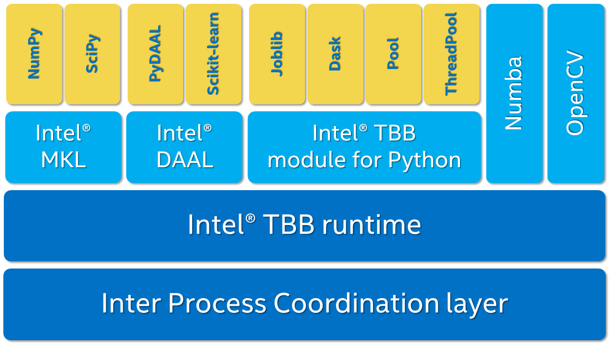

:author: Anton Malakhov
:email: Anton.Malakhov@intel.com
:institution: Intel Corporation

-----------------------------------------------
Composable Multi-Threading for Python Libraries
-----------------------------------------------

.. class:: abstract

   Python is popular among numeric communities that value it for easy to use number crunching modules like Numpy/Scipy, Dask, Numba, and many others.
   These modules often use multi-threading for efficient parallelism (on a node) in order to utilize all the available CPU cores.
   But being used together in one application, their threads can interfere with each other leading to overheads and inefficiency.
   The lost performance can still be recovered if all the multi-threaded parties are coordinated.
   This paper describes usage of Intel |R| Threading Building Blocks (Intel |R| TBB), an open-source cross-platform library for multi-core parallelism, as coordination layer for Python libraries which helps to extract additional performance for numeric applications on multi-core system.

.. class:: keywords
   Multi-threading, GIL, Over-subscription, Parallel Computations, Parallelism, Threading, Dask, Joblib, Numpy, Scipy

Over-subscription
-----------------
Multi-processing parallelism in Python is prone to inefficiency due to memory-related overheads. On the other hand, multi-threaded parallelism is know to be more efficient but with Python, it suffers from the global interpreter lock (GIL) :cite:`gil` which prevents scaling of Python programs. However, when it comes to numeric computations, most of the time is spent in native codes where the GIL can easily be released and programs can scale. This is why Python libraries such as Dask and Numba can use multi-threading to greatly speed up the computations. But when used together, e.g. when a Dask task calls Numba's threaded ufunc, it leads to the situation where there are more active software threads than available hardware resources. This situation is called over-subscription and it can lead to sub-optimal execution due to frequent context switches, thread migration, broken cache-locality, and finally to a load imbalance when some threads finished their work but others are stuck along with the overall progress.

Another example are Numpy/Scipy libraries. When they are accelerated using Intel |R| Math Kernel Library (Intel |R| MKL) like the ones shipped as part of Intel |R| Distribution for Python. Intel MKL is by default is threaded using OpenMP which is known for its inherent restrictions. In particular, OpenMP threads keep busy-waiting after the work is done - which is usually useful to reduce work distribution overhead for the next possible parallel region; but with another active thread pool in application, it plays against performance because while OpenMP worker threads keep consuming CPU time in busy-waiting, the other parallel work like Numba's ufunc (with :code:`target=parallel`) cannot start until OpenMP threads stop spinning or are pre-empted by the OS.

Though overheads from linear over-subscription (e.g. 2x) are not always visible on the application level for small systems and can be tolerable in many cases when the work for parallel region is big enough. But the worst case is when a program starts multiple parallel tasks and each of these tasks ends up executing an OpenMP parallel region. This results by default in quadratic over-subscription which ruins multi-threaded performance on systems with significant number of threads (roughly, tens and more).

Especially, over-subscription is bad for Many Integrated Core (MIC) systems such as Intel |R| Xeon Phi which support more than 2 hundred hardware threads. In such big systems, sometimes it is not even possible to create as many software threads as the number of hardware threads multiplied by itself. It will just eat up all the available RAM.

Threading Composability
-----------------------

   Intel |R| Threading Building Blocks is used as a common coordinating runtime for different Python modules. :label:`components`

Our approach to solve these co-existence problems is to share one thread pool among all the program modules and native libraries so that one user-level task scheduler will take care of composability between them. Intel |R| Threading Building Blocks (Intel TBB) library works as such a task scheduler in our solution, see Figure :ref:`components`. Intel |R| TBB is open-source, cross-platform, recognized C++ library for enabling multi-core parallelism. It was designed for composability and nested parallelism support from its foundation so that preventing of over-subscription is a specialization of this library.

In the Intel |R| Distribution for Python* 2017 Beta and later as part of Intel |R| TBB release 4.4 Update 4, I introduce an experimental module which unlocks opportunities for additional performance for multi-threaded Python programs by enabling threading composability between two or more thread-enabled libraries. Threading composability can accelerate programs by avoiding inefficient threads allocation as discussed above.

The TBB module implements :code:`Pool` class with the standard Python interface using Intel |R| TBB which can be used to replace Python's *ThreadPool*. Thanks to the monkey-patching technique implemented in class :code:`Monkey`, no source code change is needed in order to enable single thread pool across different Python modules. It also enables TBB-based threading layer for Intel |R| MKL which automatically enables composable parallelism for Numpy and Scipy calls.

TBB module
----------
For our first experiment, we need Intel |R| Distribution for Python* :cite:`intelpython` to be installed along with Dask :cite:`dask` library which simplifies parallelism with Python.

.. code-block:: sh

    # install Intel(R) Distribution for Python*
    <path to installer of the Distribution>/install.sh
    # setup environment
    source <path to the Distribution>/bin/pythonvars.sh
    # install Dask
    conda install dask

Now, let's write a simple program using Numpy that validates QR decomposition by multiplying resulted components and comparing result agianst original input:

.. code-block:: python
    :linenos:

    import time, numpy as np
    x = np.random.random((100000, 2000))
    t0 = time.time()
    q, r = np.linalg.qr(x)
    test = np.allclose(x, q.dot(r))
    assert(test)
    print(time.time() - t0)

And same program using Dask:

.. code-block:: python
    :linenos:

    import time, dask, dask.array as da
    x = da.random.random((100000, 2000),
                   chunks=(10000, 2000))
    t0 = time.time()
    q, r = da.linalg.qr(x)
    test = da.all(da.isclose(x, q.dot(r)))
    assert(test.compute()) # threaded
    print(time.time() - t0)

Here, Dask splits the array into 10 chunks and processes them in parallel using multiple threads. But each Dask task executes the same Numpy matrix operations which are accelerated using Intel |R| MKL under the hood and thus multi-threaded by default. This combination results in nested parallelism, i.e. when one parallel component calls another component which is also threaded.

Let's run it in 3 different modes:

.. code-block:: sh
    :linenos:

    python bench.py                   # Default MKL
    OMP_NUM_THREADS=1 python bench.py # Serial
    python -m TBB bench.py            # Intel TBB mode

.. figure:: dask_qr_bench.png
   
   Execution times for QR validation example. :label:`qrpic`

Figure :ref:`qrpic` shows times (lower is better) acquired on 32-core (no HT) machine with 64GB RAM. By default, Dask version runs worse than Numpy version because 10 outermost tasks end up calling 10 OpenMP-based parallel regions which creates 10 times more threads than available hardware resourses.

The second command runs this benchmark with innormost OpenMP parallelism disabled. It results in the worst performance for Numpy version since everything is now serialized. And Dask version is not able to close the gap completely since it has only 10 tasks which can run in parallel while Numpy with parallel MKL is able to utilize the whole machine with 32 threads.

The last command demostrates how Intel TBB can be enabled as orchestrator of multi-threaded modules. TBB module runs the benchmark in context of :code:`with TBB.Monkey():` which replaces standard Python *ThreadPool* class used by Dask and also switches MKL into TBB mode. Numpy with TBB shows more than double time comparing to default Numpy run. This happens because TBB-based threading in MKL is new and not as optimized as OpenMP-based MKL threading implementation. But despite that fact, Dask in TBB mode shows the best performance for this benchamark, more than 50% improvement comparing to default Numpy. This happens because the Dask version exposes more parallelism to the system without oversubscription overheads, hiding latencies of serial regions and fork-join synchronization in MKL functions.

   
Numba
-----
Another area where we applied Intel TBB is Numba. I replaced multi-threading runtime used by original Numba with implementation based on TBB tasks. It improved performance even without nested parallelism:
[Diagram here]

[TODO: add another example with nested parallelism based on Numba and the performance data]

Multi-processing
----------------
[TODO: I can show that TBB helps even with multiprocessing parallelism and discuss ways how it can be further improved]

Disclaimers
-----------
TBB module does not work well for blocking I/O operations, it is applicable only for tasks which do not block in the operating system. This version of TBB module is experimental and might be not sufficiently optimized and verified with different use-cases. In particular, it does not yet use master thread efficiently as regular TBB program is supposed to do. But all these problems well go away as more users will be interested in solving theirs composability issues and the TBB module is further developed.

.. |C| unicode:: 0xA9 .. copyright sign
   :ltrim:
.. |R| unicode:: 0xAE .. registered sign
   :ltrim:
