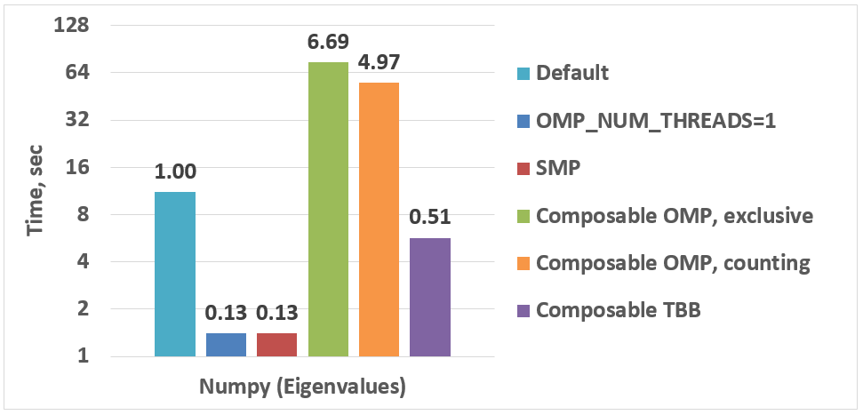

:author: Anton Malakhov
:email: Anton.Malakhov@intel.com
:institution: Intel Corporation
:year: 2017

:author: Anton Gorshkov
:email: Anton.V.Gorshkov@intel.com
:institution: Intel Corporation
:year: 2017

:author: Terry Wilmarth
:email: Terry.L.Wilmarth@intel.com
:institution: Intel Corporation
:year: 2017

:video: Unknown

---------------------------------------------------------------------
Composable Multi-Threading and Multi-Processing for Numeric Libraries
---------------------------------------------------------------------

.. class:: abstract

   Python is popular among numeric communities that value it for easy to use number crunching modules like [NumPy]_, [SciPy]_, [Dask]_, [Numba]_, and many others.
   These modules often use multi-threading for efficient multi-core parallelism in order to utilize all the available CPU cores.
   Nevertheless, their threads can interfere with each other leading to overhead and inefficiency if used together in one application.
   The loss of performance can be prevented if all the multi-threaded parties are coordinated.
   This paper describes and compares three approaches to such coordination for both multi-threading and multi-processing cases: using static affinity masks, OpenMP parallel region serialization and work stealing scheduler from  Intel |R| Threading Building Blocks (Intel |R| TBB) [TBB]_.
   It helps to unlock additional performance for numeric applications on multi-core systems.

.. class:: keywords

   Multi-threading, Multi-processing, Over-subscription, Parallel Computations, Nested Parallelism, Multi-core, Python, GIL, Dask, Joblib, NumPy, SciPy, Numba, TBB, OpenMP

.. [NumPy] NumPy, http://www.numpy.org/
.. [SciPy] SciPy, https://www.scipy.org/
.. [Dask]  Dask, http://dask.pydata.org/
.. [Numba] Numba, http://numba.pydata.org/
.. [TBB]   Intel(R) TBB open-source site, https://www.threadingbuildingblocks.org/

Motivation
----------
The fundamental shift toward parallelism was loudly declared more than 11 years ago [HSutter]_ and multi-core processors have become ubiquitous nowadays [WTichy]_.
However, the adoption of multi-core parallelism in the software world has been slow and Python along with its computing ecosystem is not an exception.
Python suffers from several issues which make it suboptimal for parallel processing.

.. [HSutter] Herb Sutter, "The Free Lunch Is Over", Dr. Dobb's Journal, 30(3), March 2005.
             http://www.gotw.ca/publications/concurrency-ddj.htm
.. [WTichy]  Walter Tichy, "The Multicore Transformation", Ubiquity, Volume 2014 Issue May, May 2014. DOI: 10.1145/2618393.
             http://ubiquity.acm.org/article.cfm?id=2618393

The parallelism with multiple isolated processes is popular and widely used in Python since it allows to avoid the issues with the Python infamous global interpreter lock [GIL]_, but it is prone to inefficiency due to memory-related overhead.
On the other hand, multi-threaded parallelism is known to be more efficient but has all the limitations of the GIL, which prevents scaling of Python programs effectively serializing them.
However, when it comes to numeric computations, most of the time is spent in native code where the GIL can easily be released and programs can scale.
Thus both multi-processing and multi-threading approaches are valuable for Python users and have its own areas of applicability.

.. [GIL] David Beazley, "Understanding the Python GIL", PyCON Python Conference, Atlanta, Georgia, 2010.
         http://www.dabeaz.com/python/UnderstandingGIL.pdf

Scaling parallel programs is not an easy thing.
There are two fundamental laws which mathematically describe and predict scalability of a program: Amdahl's Law and Gustafson-Barsis' Law [AGlaws]_.
According to Amdahl's Law, speedup is limited by the serial portion of the work, which effectively puts a limit on scalability of parallel processing for a fixed-size job.
Python is especially vulnerable to this because it makes the serial part of the same code much slower compared to implementations in some other languages due to its deeply dynamic and interpretative nature.
Moreover, the GIL makes things serial often where they potentially can be parallel, further adding to the serial portion of a program.

.. [AGlaws] Michael McCool, Arch Robison, James Reinders, "Amdahl's Law vs. Gustafson-Barsis' Law", Dr. Dobb's Parallel, October 22, 2013.
            http://www.drdobbs.com/parallel/amdahls-law-vs-gustafson-barsis-law/240162980

Gustafson-Barsis' law offers some hope stating that if the problem-size grows along with the number of parallel processors, while the serial portion grows slowly or remains fixed, speedup grows as processors are added.
This might relax the concerns regarding Python as a language for parallel computing since the serial portion is mostly fixed in Python when all the data-processing is hidden behind libraries like NumPy and SciPy which are written in other languages.
Nevertheless, a larger problem size demands more operational memory to be used for processing it, but memory is a limited resource.
Thus, even working with "Big Data", it must be processed by chunks that fit into memory, which puts a limit for the growth of the problem-size.
As result, the best strategy to efficiently load a multi-core system is still to fight against serial regions and synchronization.

Nested Parallelism
------------------
One way to do that is to expose parallelism on all the possible levels of an application, for example, by making outermost loops parallel or exploring functional or pipeline types of parallelism on the application level.
Python libraries that help to achieve this are Dask [Dask]_, Joblib [Joblib]_, and even the built-in :code:`multiprocessing` module [mproc]_ (including its :code:`ThreadPool` and :code:`Pool` classes).
On the innermost level, data-parallelism can be delivered by Python modules like NumPy [NumPy]_ and SciPy [SciPy]_.
These modules can be accelerated with an optimized math library like Intel |R| Math Kernel Library (Intel |R| MKL) [MKL]_, which is multi-threaded internally using OpenMP [OpenMP]_ (with default settings).

.. [mproc]  Python documentation on *multiprocessing*, https://docs.python.org/library/multiprocessing.html
.. [Joblib] Joblib, http://pythonhosted.org/joblib/
.. [OpenMP] The OpenMP(R) API specification for parallel programming, http://openmp.org/
.. [MKL]    Intel(R) MKL, https://software.intel.com/intel-mkl

When everything is combined together, it results in a construction where code from one parallel region calls a function with another parallel region inside.
This is called *nested parallelism*.
It is an efficient way for hiding latencies of synchronization and serial regions which are an inevitable part of regular NumPy/SciPy programs.

Issues of Over-subscription
---------------------------
Nevertheless, the libraries named above do not coordinate the creation or pooling of threads, which may lead to *over-subscription*, where there are more active software threads than available hardware resources.
It can lead to sub-optimal execution due to frequent context switches, thread migration, broken cache-locality, and finally to a load imbalance when some threads have finished their work but others are stuck, thus halting the overall progress.

For example, OpenMP (used by NumPy/SciPy) may keep its threads active for some time to start subsequent parallel regions quickly.
Usually, this is a useful approach to reduce work distribution overhead.
Yet with another active thread pool in the application, it impairs better performance because while OpenMP worker threads keep consuming CPU time in busy-waiting loops, the other parallel work cannot start until OpenMP threads stop spinning or are preempted by the OS.

Because overhead from linear over-subscription (e.g. 2x) is not always visible on the application level (especially for small systems), it can be tolerated in many cases when the work for parallel regions is big enough.
However, in the worst case a program starts multiple parallel tasks and each of these tasks ends up executing an OpenMP parallel region.
This results in quadratic over-subscription (with default settings) which ruins multi-threaded performance on systems with a significant number of threads (roughly more than ten).
In some big systems, it may not even be possible to create as many software threads as the number of hardware threads multiplied by itself due to insufficient resources.

Threading Composability
-----------------------
Altogether, the co-existing issues of multi-threaded components define *threading composability* of a program module or a component.
A perfectly composable component should be able to function efficiently among other such components without affecting their efficiency.
The first aspect of building a composable threading system is to avoid creation of an excessive number of software threads, preventing over-subscription.
That effectively means that a component and especially a parallel region cannot dictate how many threads it needs for execution (*mandatory parallelism*).
Instead, it should expose available parallelism to a work scheduler (*optional parallelism*), which is often implemented as a user-level task scheduler that coordinates tasks between components and parallel regions and map them onto software threads.
Since such a task scheduler shares a single thread pool among all the program modules and native libraries, it has to be efficient enough to be attractive for high-performance libraries.
Otherwise, these libraries will not be able or willing to switch their own threading model to the new scheme.

Setting Affinity Masks
----------------------
There are at least two ways to practically implemenent so called *optional parallelism* - by fixing standard Python mechanisms to write parallel code and by improving threading layers (like OpenMP or Intel |R| TBB).
The first way looks simplier but works only with Python and the second one is much more common but much more tricky.  In this paper we will describe both of these approaches.

Let's start with the first one. Since one of the common ways of making parallel code in Python is to employ pools (with threads or processes), an obvious idea is to fix them in such a way that each pool worker can use not the whole CPU but only some particular cores.
E.g. if we have 8 core CPU and want to create 2 worker pool, we can limit number of threads per pool worker to 4. In case of using process pool the best way to do it is to set appropriate affinity mask for each worker process.
E.g. for our example the first process will use cores from 0 to 3 and the second - cores from 4 to 7. Furthermore, since both OpenMP and Intel |R| TBB will use affinity masks while initialization, they limit number of threads per each process to 4.
As a result we've got a simple way of sharing threads between pool workers without any over-subscription issues.

In case of multi-threading the idea we use stays near the same, but instead of setting process affinity masks we just limit number of threads per each pool worker using threading runtime API (e.g. :code:`omp_set_num_threads()` function for OpenMP).

To implement this approach we've created an additional Python module called *SMP.py*. It works with both thread and process pools from :code:`multiprocessing` and :code:`concurrent.futures` modules using *monkey patching* technique that allows to use this solution without any code modifications in customer script.
To run it one should use the following command:

.. code-block:: sh

    python -m SMP -f <oversubscription_factor> scirpt.py

Option :code:`-f <oversubscription_factor>` sets allowable over-subscription factor that will be used to compute number of threads per pool worker. By default it equals to 2. It means that in our example 8 threads will be used per process.

Serialization of OpenMP Parallel Regions
----------------------------------------
The second approach we'd like to describe here is more common and based on OpenMP runtime. Basic idea is to use the only thread pool and run different parallel regions on it sequentially, one by one.
To implement serial region execution it's needed to have some lock that should be acquired before running the next parallel section. Futhermore this idea can be easily extended to the case of multiple processes.
To do this the lock should be global like system-wide semaphore.

This approach was implemented in Intel |R| OpenMP* runtime as a preview feature that can be enabled using the following option:

.. code-block:: sh

    KMP_COMPOSABILITY=mode=exclusive python script.py

As a result, each OpenMP parallel region will be executed exclusively that allows to eliminate over-subscription issues as well.

It's also needed to mention that in multi-processing case several thread pools will exist, one per process.
Because of the global lock, only one of these pools will work at a time that may help to improve performance, but many co-existing threads may still cause resource exhaustion issues.

.. [#] (*) Other names and brands may be claimed as the property of others.

Cross-Process Work Stealing Task Scheduler for Intel |R| TBB
------------------------------------------------------------
.. figure:: components.png

   Intel |R| Threading Building Blocks is used as a common runtime for different Python modules. :label:`components`

The third approach is also based on using the only thread pool but from Intel |R| TBB. And this time the work stealing task scheduler is used to map the set of tasks to the set of threads.
As it is shown on figure :ref:`components`, different components, that may be used in a script, work on top of the shared Intel |R| TBB pool. That allows one to dynamically balance the load across multiple tasks from multiple modules.
In more details this approach for multi-threading case is described in our previous paper [SciPy16]_.

Here we are presenting an extended approach that covers multi-processing case as well. It works in following way. In each separate process there is a thread pool.
Before starting of any thread in any pool one should acquire system-wide semaphore with maximum value equals to number of CPU hardware threads.
To acquire the semaphore greedy algorithm is used that may lead to a situation when some processes do not have pool workers.
But according to the architecture of our solution, each process has at least one master thread to compute.
Thus total number of working threads for all running processes doesn't exceed double number of CPU hardware threads in worse case (instead of quadratic over-subscripton case one could face with before).
To make this solution truly dynamic an additional worker thread is added to each Intel |R| TBB thread pool which allows to acquire threads that become free in other processes to eliminate CPU underutilization.

But from the point of view of simultaniously existing threads we still may face with resource exhaustion issues. Since we can't just move a thread from one process to another it may happen that there are too many threads alive at the same time.
To eliminate such issues we've implemented an algorithm of killing unused threads in case of detection the lack of resources.

This solution has a significant difference from an OpenMP with global lock approach - it allows to process several parallel regions simultaniously and futhermore provides an ability to do work balancing on the fly.
Of course, such behaviour is more flexible but has bigger overhead due to truly dynamic scheduler.

.. [SciPy16] Anton Malakhov, "Composable Multi-Threading for Python Libraries", Proc. of the 15th Python in Science Conf. (SCIPY 2016), July 11-17, 2016.

Balanced QR Decomposition with Dask
-----------------------------------
For our experiments, we need Intel |R| Distribution for Python [IntelPy]_ to be installed along with the Dask [Dask]_ library which simplifies parallelism with Python.

.. [IntelPy] Intel(R) Distribution for Python, https://software.intel.com/python-distribution

.. code-block:: sh

    # install Intel(R) Distribution for Python
    <path to installer of the Distribution>/install.sh
    # setup environment
    source <path to the Distribution>/bin/pythonvars.sh
    # install Dask
    conda install dask

The code below is a simple program using Dask that validates QR decomposition by multiplying computed components and comparing the result against the original input:

.. code-block:: python
    :linenos:

    import time, dask, dask.array as da
    x = da.random.random((440000, 1000),
                         chunks=(10000, 1000))
    for i in range(3):
        t0 = time.time()
        q, r = da.linalg.qr(x)
        test = da.all(da.isclose(x, q.dot(r)))
        test.compute(num_workers=44)
        print(time.time() - t0)

Here, Dask splits the array into 44 chunks and processes them in parallel using multiple threads.
However, each Dask task executes the same NumPy matrix operations which are accelerated using Intel |R| MKL under the hood and thus multi-threaded by default.
This combination results in nested parallelism, i.e. when one parallel component calls another component, which is also threaded.
Further we will talk mostly about multi-threading case but according to our investigations all conclusions that will be shown are applicable for multi-processing case as well.

Here is an example of running the benchmark program in five different modes:

.. code-block:: sh
    :linenos:

    python bench.py         # Default OpenMP mode
    KMP_BLOCKTIME=0 OMP_NUM_THREADS=4 \
        python bench.py     # Tunned OpenMP mode
    python -m SMP bench.py  # OpenMP + SMP mode
    KMP_COMPOSABILITY=mode=exclusive \
        python bench.py     # Composable OpenMP mode
    python -m TBB bench.py  # Composable TBB mode

.. figure:: dask_static.png

   Execution times for balanced QR decomposition workload. :label:`sdask`

Figure :ref:`sdask` shows performance results acquired on a 44-core (88-thread) machine with 128 GB memory. The results presented here were acquired with cpython v3.5.2; however, there is no significant performance difference with cpython v2.7.12.
By default Dask will process a chunk in a separate thread so there will be 44 threads on the top level. Also each chunk will be computed in parallel with 44 OpenMP workers.
Thus there will be 1936 threads in total which tries to acquire 44 cores that is not effective.

An obvious way to improve performance is to tune OpenMP runtime using environment variables. First of all it's needed to limit total number of threads.
Let's set 2x over-subsctiption instead of quadratic as our target. Since we work on 88-thread machine, to archive it we should set number of threads per parallel region to 4 ((88 CPU threads / 44 top level threads) * 2x over-subscription).
Also we noticed that reducing period of time after which OpenMP worker will go to sleep helps to improve performance in such workloads with over-subscription (it works best for multi-processing case but helps for multi-threading as well).
That's why another option here is KMP_BLOCKTIME that sets to zero. As one can see such simple optimizations allows to reduce computational time to more than 3x.

The third mode with *SMP.py* module in fact does the same optimizations but automatically and shows the same level of performance as the second one. Moreover it is more flexible and allows to work carefully with several thread/process pools in scope of one application even if they have different sizes.
Thus we invite to use it as an advanced alternative to manual OpenMP tunning.

The fourth and fifth modes represents our dynamic OpenMP and Intel |R| TBB based approaches. Both modes allow to improve default result but exclusive execution with OpenMP works faster.
As it was described above OpenMP based solution allows to process chunks one by one without any over-subscription. And since each separate chunk can utilize the whole CPU - such approach works fine here.
In contrast work stealing task scheduler from  Intel |R| TBB is truly dynamic and tries to use the only thread pool to process all given tasks simultanioulsy. As a result one has worse cache utilization as well as bigger overhead of work balancing.

.. [#] For more complete information about compiler optimizations, see our Optimization Notice [OptNote]_

Balanced Eignevalues Search with NumPy
--------------------------------------
The code below performs an algorithm of eigenvalues and right eigenvectors search in a square matrix using Numpy:

.. code-block:: python
    :linenos:

    import time, numpy as np
    from multiprocessing.pool import ThreadPool
    x = np.random.random((256, 256))
    p = ThreadPool(44)
    for j in range(3):
        t0 = time.time()
        p.map(np.linalg.eig, [x for i in range(1024)])
        print(time.time() - t0)

In this example we process several matricies from an array in parallel using :code:`ThreadPool` while each separate matrix is computed using OpenMP parallel regions from Intel |R| MKL.
As a result, simillary to QR decomposition benchmark we've faced with quadratic oversubscription here.
But this code has a distinctive feature - in spite of parallel execution of eigenvalues search algorithm it can't fully utilize all available CPU cores. That's why an additional level of parallelizm we used here may significantly improve overall benchmark performance.

   Execution time for balanced eignevalues search workload. :label:`snumpy`

Figure :ref:`snumpy` shows benchmark execution time in the same five modes as we used for QR decomposition.
As previously the best choice here is to limit number of threads statically eigher using manual settings or *SMP.py* module. Such approach allows to obtain more than 3x speed-up.
But this time Intel |R| TBB based approach looks much better than serialization of OpenMP parallel regions. And the reason is low CPU utilization in each separate chunk.
In fact exclusive OpenMP mode leads to serial matrix processing, one by one, so significant part of the CPU stays unsed.
As a result, execution time in this case becomes even larger than by default.

Unbalanced QR Decomposition with Dask
-------------------------------------
In previous sections we looked into balanced workloads where amount of work per thread on top level is near the same.
It's rather expected that for such cases the best solution is static one. But what if one need to deal with dynamic workloads where amount of work per thread or process may vary?
To investigate such cases we've developed unbalanced versions of our static benchmarks. An idea we used is the following. There is a single thread pool with 44 workers.
But this time we will perform computations in three stages. The first stage will use only one thread from the pool which is able to fully utilize the whole CPU.
During the second stage half of top level threads will be used (22 in our examples). And on the third stage the whole pool will be employed (44 threads).

The code above demonstrates unbalanced version of QR decomposition workload:

.. code-block:: python
    :linenos:

    import time, dask, dask.array as da
    def qr(x):
        t0 = time.time()
        q, r = da.linalg.qr(x)
        test = da.all(da.isclose(x, q.dot(r)))
        test.compute(num_workers=44)
        print(time.time() - t0)
    x01 = da.random.random((440000, 1000),
                           chunks=(440000, 1000))
    x22 = da.random.random((440000, 1000),
                           chunks=(20000, 1000))
    x44 = da.random.random((440000, 1000),
                           chunks=(10000, 1000))
    qr(x01)
    qr(x22)
    qr(x44)

To run this benchmark we've used the already familiar four modes: default, OpenMP with *SMP.py*, composable OpenMP and composable Intel |R| TBB.
We don't give here the results of OpenMP with manual optimizations since it's very close to the mode "OMP + SMP" 

.. figure:: dask_dynamic.png

   Execution times for unbalanced QR decomposition workload. :label:`ddask`

Figure :ref:`ddask` demonstrates time of execution for all four modes. First observation here is that static *SMP.py* approach can't provide us the best performance in case of unbalanced workloads.
Since we have the only pool here with fixed number of workers and don't know which of these workers will be really used and how intensively, it's difficult to set an appropriate number of threads statically.
So we limit number of threads per parallel region based on size of the pool only. As a result, on the first stage just a few threads are really used that leads to performance degradation.
From the other hand the second and the third stages work well. But it total we have mediocre result.

Work stealing scheduler from Intel |R| TBB works better than default version but due to redundunt work balancing in this particular case it has significant overhead and not the best performance result.

And the best execution time one can obtain using exclusive OpenMP mode. Since it's enough work to do in each parallel region, just their serialization allows to eliminate over-subscription issues and get the best performance - near 34% speed-up.

Unbalanced Eigenvalues Search with NumPy
----------------------------------------
The second dynamic exapmle we'd like to discuss is based on eigenvalues search algorithm from NumPy:

.. code-block:: python
    :linenos:

    import time, numpy as np
    from multiprocessing.pool import ThreadPool
    from functools import partial

    x = np.random.random((256, 256))
    y = np.random.random((8192, 8192))
    p = ThreadPool

    t0 = time.time()
    mmul = partial(np.matmul, y)
    p.map(mmul, [y for i in range(6)], 6)
    print(time.time() - t0)

    t0 = time.time()
    p.map(np.linalg.eig, [x for i in range(1408)], 64)
    print(time.time() - t0)

    t0 = time.time()
    p.map(np.linalg.eig, [x for i in range(1408)], 32)
    print(time.time() - t0)

In this workload we have same three stages. The second and the third stage computes eignevalues and the first one performs matrix multiplication.
The reason of why we don't use eignevalues search for the first stage as well is that it can't fully load CPU as we planned.

.. figure:: numpy_dynamic.png

   Execution time for unbalanced eignevalues search workload. :label:`dnumpy`

From figure :ref:`dnumpy` one can see that the best solution for this workload is work stealing scheduler from Intel |R| TBB which allows to reduce execution time on 35%.
*SMP.py* module works even slower than default version due to the same issues as described for unbalanced QR decomposition example.
And as for the mode with serialization of OpenMP parallel regions - it works significantly slower than default version since there is no enough work for each parallel region that leads to CPU underutilization.

Acceptable Level of Over-subscription
-------------------------------------
One more thing we'd like to discuss here is which level of over-subscription is acceptable from performance point of view.
In other words starting from which size of top level thread or process pool we face with performance issues due to over-subscription.
To check it we run our balanced eigenvalues search workload with different pool sizes from 1 to 88 (since we have machine with 88-thread CPU).

.. figure:: scalability_multithreading.png

   Multi-threading scalability of eigenvalues seach workload. :label:`smt`

Figure :ref:`smt` shows scalability results for multi-threading case. Two modes are compared here: default one and OpenMP with *SMP.py* as the best approach for this benchmark.
As one can see, visible difference in execution time between these two methods starts from 8 threads in top level pool and becomes larger while size of pool increases.

.. figure:: scalability_multiprocessing.png

   Multi-processing scalability of eigenvalues seach workload. :label:`smp`

Multi-processing scalability results are shown on figure :ref:`smp`.
They can be obtained from the same eigenvalues search workload if one just replaces :code:`ThreadPool` to :code:`Pool`.
And results here are very similar to multi-threading case - over-subscription effects become visible starting from 8 processes on top level of parallelization.

Solutions Applicability
-----------------------
Let's summarize all the results we obtained earlier.
All three suggested approaches to fight with over-subscription issues are valuable and allow to obtain significant performance increase for both multi-threading and multi-processing cases.
Moreover they are complement each over and have their own fields of applicability.

.. figure:: recommendation_table.png

   How to choose the best approach to deal with over-subscription issues. :label:`rtable`

*SMP.py* module works perfectly for the balanced workloads where each pool uses all its workers with near the same load level. And compared with manual tunning of OpenMP options it's more stable since it can work with any pools with different sizes in scope of application without performance degradation.
And what is also important - it works with Intel |R| TBB as well.

Exclusive mode for OpenMP runtime works best with unbalanced benchmarks for the cases there it's enough work for each innermost parallel region.

And truly dynamic work stealing scheduler from Intel |R| TBB allows to obtain the best performance if innermost parallel regions can't fully utilize the whole CPU and have varying amount of work to do.

To summarize all our conclusions we've prepared the table that should help to choose which approach will work best for your case (see figure :ref:`rtable`).

Limitations and Future Work
---------------------------
All the solutions we described in this paper are preview features and should be seen as "Proof Of Concept".

*SMP.py* module currently works only based on the pool size and doesn't take into account its real usage. We think it can be improved in future to trace task scheduling pool events and so to become more flexible.
*SMP.py* module works only for Linux currently.

OpenMP with global lock solution works fine with parallel regions with high CPU utilization but has significant performance gap in other cases, so can be improved. E.g. it can use semaphore instead of mutex to allow to run multiple parallel regions at the same time and thus to impove overall CPU utilization.

Intel |R| TBB does not work well for blocking I/O operations because it limits the number of active threads.
It is applicable only for tasks, which do not block in the operating system.
If your program uses blocking I/O, please consider using asynchronous I/O that blocks only one thread for the event loop and so prevents other threads from being blocked.

The Python module for Intel |R| TBB is in an experimental stage and might be not sufficiently optimized and verified with different use-cases.
In particular, it does not yet use the master thread efficiently as a regular TBB program is supposed to do.
This reduces performance for small workloads and on systems with small numbers of hardware threads.

The TBB-based implementation of Intel |R| MKL threading layer is yet in its infancy and is therefore suboptimal.
However, all these problems can be eliminated as more users will become interested in solving their composability issues and Intel |R| MKL and the TBB module are further developed.

.. [OptNote] https://software.intel.com/en-us/articles/optimization-notice
.. [#] For more complete information about compiler optimizations, see our Optimization Notice [OptNote]_

Conclusion
----------
This paper starts with substantiating the necessity of broader usage of nested parallelism for multi-core systems.
Then, it defines threading composability and discusses the issues of Python programs and libraries which use nested parallelism with multi-core systems, such as GIL and over-subscription.
These issues affect performance of Python programs that use libraries like NumPy, SciPy, Dask, and Numba.

Three approaches are described as potential solution. The first one is to statically limit number of threads created inside each pool worker. The second one is serialization of OpenMP parallel regions.
And the third one is to use a common threading runtime library such as Intel |R| TBB which limits the number of threads in order to prevent over-subscription and coordinates parallel execution of independent program modules.

The examples referred in the paper show promising results, where, thanks to nested parallelism and threading composability, the best performance was achieved.
In particular, balanced QR decomposition and eigenvalues search examples are 3x faster comparing to the baseline implementation. Unbalanced versions of these benchmarks are by 34% and 35% faster than the baseline accordingly.

These improvements were achived due to different approaches. It demonstrates that all three described solutions are valuable and complement each other. We've compared suggested approaches and provided recommendations of when it makes sense to employ each of them.

All described solutions are available in open-source while Intel |R| Distribution for Python accelerated with Intel |R| MKL is available for free as a stand-alone package [IntelPy]_ and on anaconda.org/intel channel.

References
----------

.. figure:: opt-notice-en_080411.png
   :figclass: b
.. |C| unicode:: 0xA9 .. copyright sign
   :ltrim:
.. |R| unicode:: 0xAE .. registered sign
   :ltrim:
