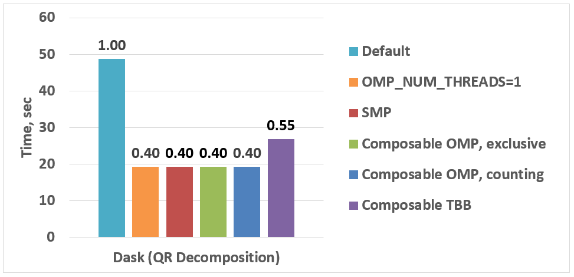

:author: Anton Malakhov
:email: Anton.Malakhov@intel.com
:institution: Intel Corporation
:corresponding:

:author: Anton Gorshkov
:email: Anton.V.Gorshkov@intel.com
:institution: Intel Corporation
:equal-contributor:

:author: Terry Wilmarth
:email: Terry.L.Wilmarth@intel.com
:institution: Intel Corporation

:year: 2017
:video: Unknown yet

---------------------------------------------------------------------
Composable Multi-Threading and Multi-Processing for Numeric Libraries
---------------------------------------------------------------------

.. class:: abstract

   Python is popular among scientific communities that value its simplicity and power coming along with numeric libraries like [NumPy]_, [SciPy]_, [Dask]_, [Numba]_, and many others.
   These modules often use multi-threading for efficient multi-core parallelism in order to utilize all the available CPU cores which counts keep increasing.
   Nevertheless, their threads can interfere with each other leading to overhead and inefficiency if used together in one application on machines with large number of cores.
   The loss of performance can be prevented if all the multi-threaded parties are coordinated.
   This paper continues the work started in [AMala16]_ by introducing more approaches to such coordination for both multi-threading and multi-processing cases:
   using static settings, limiting the number of simultaneously active [OpenMP]_ parallel regions, and optional parallelism with Intel |R| Threading Building Blocks (Intel |R| [TBB]_).
   These approaches help to unlock additional performance for numeric applications on multi-core systems.

.. class:: keywords

   Multi-threading, Multi-processing, Oversubscription, Parallel Computations, Nested Parallelism, Multi-core, Python, GIL, Dask, Joblib, NumPy, SciPy, TBB, OpenMP

.. [AMala16] Anton Malakhov, "Composable Multi-Threading for Python Libraries", Proc. of the 15th Python in Science Conf. (SCIPY 2016), July 11-17, 2016.
.. [NumPy] NumPy, http://www.numpy.org/
.. [SciPy] SciPy, https://www.scipy.org/
.. [Dask]  Dask, http://dask.pydata.org/
.. [Numba] Numba, http://numba.pydata.org/
.. [TBB]   Intel(R) TBB open-source site, https://www.threadingbuildingblocks.org/
.. [OpenMP] The OpenMP(R) API specification for parallel programming, http://openmp.org/

1. Motivation
-------------
The fundamental shift toward parallelism was loudly declared more than 11 years ago [HSutter]_ and multi-core processors have become ubiquitous nowadays [WTichy]_.
However, the adoption of multi-core parallelism in the software world has been slow and Python along with its computing ecosystem is not an exception.
Python suffers from several issues which make it suboptimal for parallel processing.

.. [HSutter] Herb Sutter, "The Free Lunch Is Over", Dr. Dobb's Journal, 30(3), March 2005.
             http://www.gotw.ca/publications/concurrency-ddj.htm
.. [WTichy]  Walter Tichy, "The Multicore Transformation", Ubiquity, Volume 2014 Issue May, May 2014. DOI: 10.1145/2618393.
             http://ubiquity.acm.org/article.cfm?id=2618393

In particular, Python infamous global interpreter lock [GIL]_ makes it hard to scale an interpreter-dependent code
using multiple threads, effectively serializing them.
Thus the parallelism with multiple isolated processes is popular and widely used in Python
since it allows to avoid the issues with GIL but it is prone to inefficiency due to memory-related overhead.
However, when it comes to numeric computations with libraries like Numpy,
most of the time is spent in C extensions without accessing Python data structures.
It allows to release the GIL during computations and which enables scaling of compute-intensive applications.
Thus, both multi-processing and multi-threading approaches are valuable for Python users and have its own areas of applicability.

.. [GIL] David Beazley, "Understanding the Python GIL", PyCON Python Conference, Atlanta, Georgia, 2010.
         http://www.dabeaz.com/python/UnderstandingGIL.pdf

Indeed, scaling parallel programs is not an easy thing.
There are two fundamental laws which mathematically describe and predict scalability of a program:
Amdahl's Law and Gustafson-Barsis' Law [AGlaws]_.
According to Amdahl's Law, speedup is limited by the serial portion of the work,
which effectively puts a limit on scalability of parallel processing for a fixed-size job.
Python is especially vulnerable to this because it makes the serial part of the same code much slower
compared to implementations in some other languages due to its deeply dynamic and interpretative nature.
Moreover, the GIL serializes operations that could be potentially executed in parallel, further adding to the serial portion of a program.

.. [AGlaws] Michael McCool, Arch Robison, James Reinders, "Amdahl's Law vs. Gustafson-Barsis' Law", Dr. Dobb's Parallel, October 22, 2013.
            http://www.drdobbs.com/parallel/amdahls-law-vs-gustafson-barsis-law/240162980

Gustafson-Barsis' law offers some hope stating that if the problem-size grows along with the number of parallel processors,
while the serial portion grows slowly or remains fixed, speedup grows as processors are added.
This might relax the concerns regarding Python as a language for parallel computing
since the serial portion is mostly fixed in Python when all the data-processing is hidden behind libraries like NumPy and SciPy.
Nevertheless, a larger problem-size demands more operational memory to be used for processing it, but memory is a limited resource.
Thus, even if problem-size is nearly unlimited, like for "Big Data", it has to be processed by chunks that fit into memory.
Overall, the limited growth of the problem-size on a single node leaves us with the scalability defined by Amdahl's Law anyway.
As a result, the best strategy to efficiently load a multi-core system is still to avoid serial regions and synchronization.

1.1. Nested Parallelism
-----------------------
One way to avoid serial regions is to expose parallelism on all the possible levels of an application, for example,
by making outermost loops parallel or exploring functional, flow graph, or pipeline types of parallelism on the application level.
Python libraries that help to achieve this are Dask, Joblib, and the built-in :code:`multiprocessing` and :code:`concurrent.futures` modules.
On the innermost level, data-parallelism can be delivered by Python modules like [NumPy]_ and [SciPy]_.
These modules can be accelerated with an optimized math libraries like Intel |R| Math Kernel Library (Intel |R| [MKL]_),
which is multi-threaded internally using OpenMP (with default settings).

.. [MKL]    Intel(R) MKL, https://software.intel.com/intel-mkl
.. [Joblib] Joblib, http://pythonhosted.org/joblib/

When everything is combined together,
it results in a construction where code from one parallel region calls a function with another parallel region inside.
This is called *nested parallelism*.
It is an efficient way for hiding serial regions which are an inevitable part of regular NumPy/SciPy programs.

1.2. Issues of Oversubscription
-------------------------------
Nevertheless, the libraries named above do not coordinate the creation or pooling of threads, which may lead to *oversubscription*,
where there are much more active software threads than available hardware resources.
For sufficiently big machines with roughly more than 16 cores,
it can lead to sub-optimal execution due to frequent context switches, thread migration, broken cache-locality,
and finally to a load imbalance when some threads have finished their work but others are stuck, thus halting the overall progress.

For example, Intel OpenMP [*]_ runtime library (used by NumPy/SciPy)
may keep its threads active for some time to start subsequent parallel regions quickly.
Usually, this is a useful approach to reduce work distribution overhead.
However, with another active thread pool in the application,
it impairs performance because while OpenMP worker threads keep consuming CPU time in busy-waiting loops,
the other parallel work cannot start until OpenMP threads stop spinning or are preempted by the OS.

.. [*] Other names and brands may be claimed as the property of others.

Because overhead from linear oversubscription (e.g. 2x) is not always visible on the application level
(especially for smaller number of processor cores),
it can be tolerated in many cases when the work for parallel regions is big enough to hide the overhead.
However, in the worst case a program starts multiple parallel tasks and each of these tasks ends up executing an OpenMP parallel region.
This results in quadratic oversubscription (with default settings) which ruins multi-threaded performance on systems with a significant number of threads.
Within some big systems like Intel |R| Xeon Phi |TM|, it may not be even possible to create as many software threads as the number of hardware threads multiplied by itself due to insufficient resources.

1.3. Threading Composability
----------------------------
Altogether, the co-existing issues of multi-threaded components define *threading composability* of a program module or a component.
A perfectly composable component should be able to function efficiently among other such components without affecting their efficiency.
The first aspect of building a composable threading system is to avoid creation of an excessive number of software threads, preventing oversubscription.
That effectively means that a component and especially a parallel region cannot dictate how many threads it needs for execution (*mandatory parallelism*).
Instead, it should expose available parallelism to a run-time library, which provides control over the number of threads or
which automatically coordinates tasks between components and parallel regions and map them onto available software threads (*optional parallelism*).

1.4. OMP_NUM_THREADS=1
----------------------
The most common way in the industry to solve the issues of oversubscription is to disable the nested level of parallelism
or carefully adjust it according to the number of application threads,
which is usually accomplished through setting environment variables controlling OpenMP run-time library
(example: :code:`OMP_NUM_THREADS=1`).
We are not discouraging from using this approach as it might be good enough to solve the problems in majority of use cases.
However, it has few deficiencies, which one might want to keep in mind on the way for better performance:

#. There might be not enough parallelism on the application level thus blindly disabling data parallelism can result in underutilization and so in slower execution.
#. Global settings provided once and for all cannot take into account different parts or stages of the application, which can have opposite requirements for better performance.
#. Setting right values might require from regular users deep enough understanding of the issue, architecture of the application, and the system it uses.
#. There are more settings to take into account like :code:`KMP_BLOCKTIME` and especially various thread affinity settings.
#. The issue is not limited solely to OpenMP. Many Python packages like Numba, PyDAAL, OpenCV, and Intel's optimized SciKit-Learn are based on Intel |R| TBB or custom threading runtime.

2. New approaches
-----------------
Our goal is to provide alternative solutions for composing multiple levels of parallelism across multiple threading libraries
with better or at least the same performance comparing to usual approaches
while simplifying interface and requiring less knowledge and decisions from end-users.
We prepared and evaluated few approaches that we now discuss in this paper.

2.1. Static Settings
--------------------
One of the common ways of making parallel code in Python is to employ process or threads *pools* (or *executors*)
provided through standard library.
These pools are also used by other Python libraries implementing parallel computations like Dask and Joblib.
We suggest to fix them in such a way that each pool worker being used to call nested parallel computation
can use only some particular number of processor cores.

For example, if we have an eight core CPU and want to create a pool of two workers,
we can limit the number of threads per pool worker to four.
When using a process pool, the best way to do so is to set thread affinity mask accordingly for each worker process
thus limiting any threads created within this process to operate only on specified processor cores.
In our example, the first process will use cores 0 through 3 and the second process will use cores 4 through 7.
Furthermore, since both OpenMP and Intel |R| TBB respect the incoming affinity mask during initialization,
they limit the number of threads per each process to four.
As a result, we have a simple way of sharing threads between pool workers without any oversubscription issues.

In case of a multi-threading pool being used for application-level parallelism, the idea is the same,
just instead of setting process affinity masks, we limit number of threads per each pool worker using threading runtime API.
For example, we use :code:`omp_set_num_threads()` function for specifying number of threads for OpenMP.
This approach is pretty much the same as when :code:`OMP_NUM_THREADS` environment variable is specified for entire application.
The difference is that we use knowledge of how many outermost workers are requested by application and
how much hardware parallelism is available on the machine,
then making the necessary calculation automatically and applying them for specific instance of pool.
It is more flexible approach for applications which might use pools of different sizes within the same run.

To implement this approach we have created Python module called *smp* (coming from static or symmetric multi-processing).
It works with both thread and process pools from :code:`multiprocessing` and :code:`concurrent.futures` modules
using *monkey patching* technique that allows to use this solution without any code modifications in user applications.
To run it, one should use one of the following commands:

.. code-block:: sh

    python -m smp app.py
    python -m smp -f <oversubscription_factor> app.py

Optional argument :code:`-f <oversubscription_factor>` sets oversubscription factor that will be used
to compute number of threads per pool worker.
By default it equals to 2, which means that in our example, 8 threads will be used per process.
Allowing this limited degree of oversubscription by default, we hope that for most applications benefits from load balancing
will overweight the overheads incurred by it, as discussed in details in p3.5.
Though, for particular examples we show in this paper, the best performance is achieved with :code:`-f 1` specified on the command line.

2.2. Limiting Simultaneous OpenMP Parallel Regions
--------------------------------------------------
The second approach relies on modifications to the OpenMP runtime.
The basic idea, is to prevent oversubscription by not allowing concurrent parallel regions to collide,
which resembles in a sense "Global OpenMP Lock" as was suggested in [AMala16]_.
The actual implementation suggests two modes for scheduling parallel regions: *exclusive* and *counting*.
Exclusive mode implements exclusive lock that is acquired before running a parallel region and releases it after the work is done.
Counting mode implements mechanism equivalent to semaphore, which allows multiple parallel regions with small number of threads as long
as the total number of threads does not cross the limit.
When the limit is exceeded, it blocks in a similar way as the lock in exclusive mode until requested resources become available.
This idea is easily extended to the case of multiple processes using Inter Process Coordination (IPC) mechanisms such as
system-wide semaphore.

The exclusive mode approach is implemented in the Intel |R| OpenMP* runtime library being released
as part of Intel |R| Distribution for Python 2018 [#]_ as an experimental preview feature.
To enable this mode, :code:`KMP_COMPOSABILITY` environment variable should be set, for example:

.. [#] It was also introduced on Anaconda cloud along with the version 2017.0.3 in limited, undocumented form.
.. code-block:: sh

    env KMP_COMPOSABILITY=mode=exclusive python app.py

This enables each OpenMP parallel region to run exclusively, eliminating the worst oversubscription effects.

With the composability mode on, the multi-processing coordination is enabled automatically on the first usage.
In this case, each process has its own pool of OpenMP worker threads.
While these threads are coordinated across the processes preventing oversubscription,
that many co-existing threads can still cause resource exhaustion issue.

2.3. Coordinated Thread Pools with Intel |R| TBB
------------------------------------------------
The last approach has been initially introduced in our previous paper [AMala16]_.
It is based upon using Intel |R| TBB as a single engine for coordinating parallelism across all the Python pools and modules.
Its work stealing task scheduler is used to map tasks onto a limited set of TBB worker threads
while monkey-patching technique applied in TBB module for Python redirects Python's :code:`ThreadPool` on top of TBB tasks.
That allows to dynamically balance the load across multiple tasks from different modules but has been limited to multi-threading only.

In this paper we extended this approach by introducing the InterProcess Communication (IPC) layer for Intel |R| TBB.
As shown in figure :ref:`components`, different modules that can be mixed into single application,
work on top of the shared Intel |R| TBB pool, which is also coordinated across multiple processes.

.. figure:: components.png

   Intel |R| TBB provides a common runtime for Python modules and coordinates threads across processes. :label:`components`

TBB module for Python introduces shared library *libirml*, which is recognized by Intel |R| TBB library as a thread pool provider.
Before creating any new worker thread, this library acquires an IPC semaphore.
The semaphore is initialized with maximum value set to the number of CPU hardware threads.
When all the allowed threads are allocated, no additional threads can be created.

Because of this greedy algorithm, some TBB processes can be left without worker threads at all.
This is legitimate situation within optional parallelism paradigm implemented in Intel |R| TBB,
which does not prevent master threads from making progress and completing computation even without worker threads joined.
Thus, even in the worst case, counting all the worker and master threads, 
the total number of active threads for all the running processes does not exceed twice of the number of CPU hardware threads,
which excludes situation of quadratic oversubscription.

When first process finishes computations, TBB lets worker threads to return back to the pool releasing resources for the semaphore.
A special monitor thread implemented in libirml detects this situation allowing the rest of the processes
to acquire relinquished resources and to add threads on the fly to ongoing computations in order to improve CPU utilization.

However, without removing excessive threads, such a solution would not prevent resource exhaustion issue.
Since we cannot move a thread from one process to another, it can happen that there are too many threads allocated at the same time,
which prevents processes in need to create more threads in order to balance the load.
To fix this issue, we implemented algorithm that disposes unused threads when a shortage of resources is detected.

This TBB-based approach to the coordination is more dynamic and flexible than one based on OpenMP
because it allows to repurpose and to rebalance threads more flexible, achieving better load balancing overall.
Even in counting composability mode, OpenMP needs to wait for all the requested threads to join
while Intel |R| TBB allows threads joining parallel computations when the work has already been started.

IPC mode for TBB module should be enabled manually via explicit command line key :code:`--ipc`, for example:

.. code-block:: sh

    python -m tbb --ipc app.py

3. Evaluation
-------------
All the results for this paper have been acquired on 2-socket system with Intel |R| Xeon |R| CPU E5-2699 v4
(2.20GHz, 22 cores * 2 hyper-threads) and 128 GB RAM. This system consists of 88 hardware threads in total.

For our experiments, we used [Miniconda]_ distribution along with the packages of
Intel |R| Distribution for Python [IntelPy]_ installed from anaconda.org/intel

.. [Miniconda] Miniconda, https://conda.io/miniconda.html
.. [IntelPy] Intel(R) Distribution for Python, https://software.intel.com/python-distribution

   Execution times for balanced QR decomposition workload. :label:`sdask`

.. code-block:: sh

    # activate miniconda environment
    source <path to miniconda3>/bin/activate.sh
    # install packages from the Intel channel
    conda install -c intel numpy dask tbb smp
    # this setting is used for default runs
    export KMP_BLOCKTIME=0

We installed the following versions of the packages for our experiments:
Python 3.5.3, mkl 2017.0.3-intel_6, numpy 1.12.1_py35-intel_8, dask 0.15.0-py35_0, tbb 2017.0.7-py35_intel_2, smp 0.1.3-py_2.
We also used experimental build of OpenMP (``libiomp``) library, which will be available since version 2018 of the ``openmp`` package.
Multi-threading results in exclusive composability mode can be reproduced using openmp 2017.0.3-intel_8 as well
when setting ``KMP_FOREIGN_THREAD_LOCK`` (deprecated).

Here is an example of how to run the benchmark programs in different modes:

.. code-block:: sh

    # Default mode
    python bench.py
    # Serialized OpenMP mode
    env OMP_NUM_THREADS=1 python bench.py
    # SMP module, oversubscription factor = 1
    python -m smp -f 1 bench.py
    # Composable OpenMP, exclusive mode
    env KMP_COMPOSABILITY=mode=exclusive python bench.py
    # Composable OpenMP, counting mode
    env KMP_COMPOSABILITY=mode=counting  python bench.py
    # Composable TBB mode (multithreading only)
    python -m tbb bench.py

For our examples, we will talk mostly about the multi-threading case, but according to our investigations,
all conclusions that will be shown are applicable for the multi-processing case as well
unless additional memory copying happens between the processes, which is out of scope for this paper.

3.1. Balanced QR Decomposition with Dask
----------------------------------------
The code below is a simple program using Dask that validates QR decomposition function by multiplying computed components and comparing the result against the original input.

.. code-block:: python
    :linenos:

    import time, dask, dask.array as da
    x = da.random.random((440000, 1000),
                         chunks=(10000, 1000))
    for i in range(3):
        t0 = time.time()
        q, r = da.linalg.qr(x)
        test = da.all(da.isclose(x, q.dot(r)))
        test.compute()
        print(time.time() - t0)

Dask splits the array into 44 chunks and processes them in parallel using multiple threads.
However, each Dask task executes the same NumPy matrix operations which are accelerated using Intel |R| MKL under the hood and thus multi-threaded by default.
This combination results in nested parallelism, i.e. when one parallel component calls another component, which is also threaded.
It is repeated in order to distingish warming-up effects in the first iterations from how it works for real computations.

Figure :ref:`sdask` shows the performance results for the code above.
By default, Dask processes a chunk in a separate thread, so there are 44 threads on the top level.
Please note that by default, Dask creates a thread pool with 88 workers,
but only half of them are used since there are only 44 chunks.
Chunks are computed in parallel with 44 OpenMP workers each.
Thus, there can be 1936 threads competing for 44 cores, which results in oversubscription and poor performance.

A simple way to improve performance is to tune the OpenMP runtime using the environment variables.
First, we need to limit total number of threads.
Since we work on an 88-thread machine, we want single thread per parallel region
( (88 CPU threads / 88 workers in thread pool) * 1x over-subscription).
We also noticed that reducing period of time after which Intel OpenMP worker threads goes to sleep,
helps to improve performance in such workloads with oversubscription
(this works best for the multi-processing case but helps for multi-threading as well).
We achieve this by setting KMP_BLOCKTIME to zero by default.
These simple optimizations allows reduce the computational time by 2.5x.

The third mode with *smp* module specifying ``-f 1`` in fact does the same optimizations but automatically,
and shows the same level of performance as for ``OMP_NUM_THREADS=1``.
Moreover, it is more flexible and allows to work carefully with several thread/process pools in the application scope,
even if they have different sizes.
Thus, we suggest it as a better alternative to manual OpenMP tuning.

The remaining modes represents our dynamic OpenMP- and Intel |R| TBB-based approaches.
Both modes improve the default result, but OpenMP gives us the fastest time.
As described above, the OpenMP-based solution allows processing chunks one by one without any oversubscription,
since each separate chunk can utilize the whole CPU.
In contrast, the work stealing task scheduler of Intel |R| TBB is truly dynamic
and uses a single thread pool to process all the given tasks simultaneously.
As a result, besides higher overhead for work distribution, it has worse cache utilization.

.. [#] For more complete information about compiler optimizations, see our Optimization Notice [OptNote]_

3.2. Balanced Eigenvalues Search with NumPy
-------------------------------------------
The code below processes an algorithm of eigenvalues and right eigenvectors search in a square matrix using Numpy:

.. figure:: numpy_static.png
   :figclass: tb

   Execution time for balanced eigenvalues search workload. :label:`snumpy`

.. code-block:: python
    :linenos:

    import time, numpy as np
    from multiprocessing.pool import ThreadPool
    x = np.random.random((256, 256))
    p = ThreadPool(88)
    for j in range(3):
        t0 = time.time()
        p.map(np.linalg.eig, [x for i in range(1024)])
        print(time.time() - t0)

In this example we process several matrices from an array in parallel using Python's :code:`ThreadPool`
while each separate matrix is computed in parallel by Intel |R| MKL.
As a result, similarly to QR decomposition benchmark before, we stuck with quadratic oversubscription here.
However, this code has a distinctive feature, in spite of parallel execution of eigenvalues search algorithm,
it cannot fully utilize all available CPU cores.
That is why an additional level of parallelism we used here may significantly improve overall benchmark performance.

Figure :ref:`snumpy` shows benchmark execution time using the same modes as for QR decomposition example.
As previously the best choice here is to limit number of threads statically either using manual settings or *smp* module.
Such approach allows to obtain more than 7x speed-up.
However in this case, Intel |R| TBB based approach looks much better than composable OpenMP modes.
The reason is insufficient parallelism in each separate chunk.
In fact, exclusive mode of composable OpenMP leads to serial matrix processing, one by one,
so significant part of the CPU stays unused.
As a result, execution time in this case becomes even larger than by default.
The result of counting mode can be further improved on Intel |R| MKL side
if parallel regions are adjusted to request less threads.

3.3. Unbalanced QR Decomposition with Dask
------------------------------------------
In previous sections we have covered balanced workloads where amount of work per thread on top level is mostly the same.
As we expected, the best strategy for such cases is based on static approaches.
However, what if one need to deal with dynamic workloads where amount of work per thread or process may vary?
To investigate such cases we have prepared unbalanced versions of our static benchmarks.
The idea is the following.
The benchmark creates outermost thread pool for 44 workers.
However, this time we will perform computations in three stages.
The first stage uses only one thread from the pool, which is able to fully utilize the whole CPU.
During the second stage, half of top level threads is used (22 in our examples).
And on the third stage, the whole pool is employed (44 threads).

The code below demonstrates *unbalanced* version of QR decomposition workload:

.. code-block:: python
    :linenos:

    import time, dask, dask.array as da
    def qr(x):
        t0 = time.time()
        q, r = da.linalg.qr(x)
        test = da.all(da.isclose(x, q.dot(r)))
        test.compute(num_workers=44)
        print(time.time() - t0)
    sz = (440000, 1000)
    x01 = da.random.random(s, chunks=(440000, 1000))
    x22 = da.random.random(s, chunks=(20000, 1000))
    x44 = da.random.random(s, chunks=(10000, 1000))
    qr(x01); qr(x22); qr(x44)

To run this benchmark, we used the four modes: default, with smp module, composable OpenMP and Intel |R| TBB.
We do not show results for ``OMP_NUM_THREADS=1`` since they are very close to the results for the SMP mode.

.. figure:: dask_dynamic.png
   :figclass: t

   Execution times for unbalanced QR decomposition workload. :label:`ddask`

Figure :ref:`ddask` demonstrates execution time for all the modes.
The first observation here is that static SMP approach does not achieve good performance with imbalanced workloads.
Since we have a single thread pool with a fixed number of workers,
it is unknown which of workers are used and how intensively.
Accordingly, it is difficult to set an appropriate number of threads statically.
Thus, we limit the number of threads per parallel region based on the size of the pool only.
As result, in the first stage just a few threads are really used, which leads to underutilization and slow performance.
On the other hand, the second and third stages work well.
However, overall we have a mediocre result.

The work stealing scheduler of Intel |R| TBB works better than the default version,
but due to redundant work balancing in this particular case it has significant overhead,
thus achieving just slightly better result.

The best execution time comes from using composable OpenMP modes.
Since there is sufficient work to do in each parallel region,
allowing each chunk to be calculated one after the other avoids oversubscription and results in the best performance.

3.4. Unbalanced Eigenvalues Search with NumPy
---------------------------------------------
The second dynamic example present here is based on eigenvalues search algorithm from NumPy:

.. code-block:: python
    :linenos:

    import time, numpy as np
    from multiprocessing.pool import ThreadPool
    from functools import partial

    x = np.random.random((256, 256))
    y = np.random.random((8192, 8192))
    p = ThreadPool(44)

    t0 = time.time()
    mmul = partial(np.matmul, y)
    p.map(mmul, [y for i in range(6)], 6)
    print(time.time() - t0)

    t0 = time.time()
    p.map(np.linalg.eig, [x for i in range(1408)], 64)
    print(time.time() - t0)

    t0 = time.time()
    p.map(np.linalg.eig, [x for i in range(1408)], 32)
    print(time.time() - t0)

.. figure:: numpy_dynamic.png
   :figclass: t

   Execution time for unbalanced eigenvalues search workload. :label:`dnumpy`

In this workload, we have same three stages.
The second and the third stage computes eigenvalues and the first one performs matrix multiplication.
The reason for why we do not use eigenvalues search for the first stage as well is that it cannot fully load CPU as we intended.

From figure :ref:`dnumpy` we can see that the best solution for this workload is Intel |R| TBB mode,
which allows to reduce execution time to 67% of the default mode.
SMP module works even slower than the default version due to the same issues
as described for unbalanced QR decomposition example.
Composable OpenMP modes work significantly slower than default version
since there is not enough work for each parallel region, which leads to CPU underutilization.

3.5. Impact of nested parallelism and oversubscription
------------------------------------------------------
Experiments of this section demonstrate benefits of using nested parallelism and
when oversubscription start impacting performance.
We took our balanced eigenvalues search workload (p3.2) to run it in default and the best performing SMP modes.
Then we run it with various sizes for the top level thread and process pool, from 1 to 88 workers.

.. figure:: scalability_multithreading.png
   :figclass: b

   Multi-threading scalability of eigenvalues search workload. :label:`smt`

   Multi-processing scalability of eigenvalues search workload. :label:`smp`

.. [#] For more complete information about compiler optimizations, see our Optimization Notice [OptNote]_

Figure :ref:`smt` shows the scalability results for the multi-threading case.
The difference in execution time between these two methods starts from 8 threads in top level pool
and becomes larger as the pool size increases.

The multi-processing scalability results are shown in figure :ref:`smp`.
They can be obtained from the same example by replacing :code:`ThreadPool` by :code:`Pool`.
The results are very similar to the multi-threading case:
oversubscription effects become visible starting from 8 processes at the top level of parallelization.

4. Solutions Applicability and Future Work
------------------------------------------
In summary, all the three evaluated approaches to compose parallelism are valuable
and can provide significant performance increases for both multi-threading and multi-processing cases.
Ideally, we would like to find a single solution, which works well for all the cases.
However, the presented approaches rather complement each other and have their own fields of applicability.

The SMP module works perfectly for balanced workloads where all the outermost workers have same amount of work.
Compared with manual tuning of OpenMP settings, this approach is more stable,
since it can work with pools of different sizes within the scope of a single application without performance degradation.
It also covers other threading libraries such as Intel |R| TBB.

The composable OpenMP mode works best with unbalanced benchmarks for the cases
where there is enough work to load each innermost parallel region.

The dynamic task scheduler from Intel |R| TBB provides the best performance
when innermost parallel regions cannot fully utilize the whole CPU and/or have varying amounts of work to process.

Though, this empirical evidence might not be enough to properly generalize our experience while there are a lot of
other variables and moving targets, we did our best to summarize conclusions and suggest practical guidance
in the following table as a starting point for tuning performance of applications with nested parallelism:

.. figure:: recommendation_table.png
   :figclass: h

Threads created for blocking I/O operations are not subject for performance degradation because of the oversubscription.
In fact, it is recommended to maintain much higher number of threads because they are mostly blocked in the operation system.
If your program uses blocking I/O, please consider using asynchronous I/O instead
that blocks only one thread for the event loop and so prevents other threads from being blocked.

We encourage the readers to try suggested composability modes and use them in production environment,
if this provides better results.
However, there are still some potential enhancements that can be implemented
and we need real customers with feedback and specific use cases
in order to keep working in this whole direction and prioritize the improvements.

The *smp* module works only on Linux currently though can be expanded to all the other platforms as well.
It bases its calculations only on the pool size and does not take into account its real usage.
We think it can be improved in future to trace task scheduling pool events and so to become more flexible.

The composable mode of Intel OpenMP* runtime library is currently limited by Linux platform as well.
It works fine with parallel regions with high CPU utilization,
but it has significant performance gap in other cases, which we believe can be improved.

The IPC mode of the TBB module for Python is a preview feature, which might be insufficiently optimized and verified
with different use cases.
Also, the TBB-based threading layer of Intel |R| MKL might be suboptimal comparing to the default OpenMP-based threading layer.

However, all these problems can be eliminated as more users will become interested in using nested parallelism
in prodution environment and as all the mentioned here software is further developed.

.. [OptNote] https://software.intel.com/en-us/articles/optimization-notice

5. Conclusion
-------------
This paper starts by substantiating the necessity of broader usage of nested parallelism for multi-core systems.
Then, it defines threading composability and discusses the issues of Python programs and libraries,
which use parallelism with multi-core systems, such as GIL and oversubscription.
These issues affect the performance of Python programs that use libraries like NumPy, SciPy, SciKit-learn, Dask, and Numba.

Three approaches are suggested as potential solutions.
The first one is to limit statically the number of threads created on the nested parallel level.
The second one is to coordinate execution of OpenMP parallel regions.
The third one is to use a common threading runtime using Intel |R| TBB extended to multi-processing parallelism.
All these approaches limit the number of active threads in order to prevent penalties of oversubscription.
They coordinate parallel execution of independent program modules to improve overall performance.

The examples presented in the paper show promising results while achieving the best performance
using nested parallelism in threading composability modes.
In particular, balanced QR decomposition and eigenvalues search examples are 2.5x and 7.5x faster
compared to the baseline implementations.
Imbalanced versions of these benchmarks are 34-35% faster than the baseline.

These improvements are achieved with all different approaches,
demonstrating that the three solutions are valuable and complement each other.
We have compared suggested approaches and provided recommendations of when it makes sense to employ each of them.

All the described modules and libraries are available as open source software and
included as part of the free Intel |R| Distribution for Python product.
The Distribution is available as a stand-alone installer [IntelPy]_and as a set of packages on anaconda.org/intel channel.

References
----------

.. figure:: opt-notice-en_080411.png
   :figclass: b
.. |C| unicode:: 0xA9 .. copyright sign
   :ltrim:
.. |R| unicode:: 0xAE .. registered sign
   :ltrim:
.. |TM| unicode:: 0x2122 .. trade mark sign
   :ltrim:
