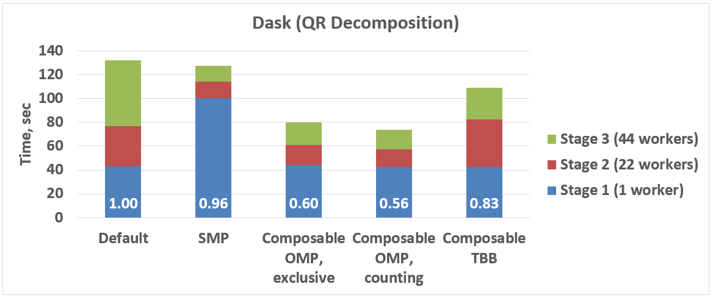
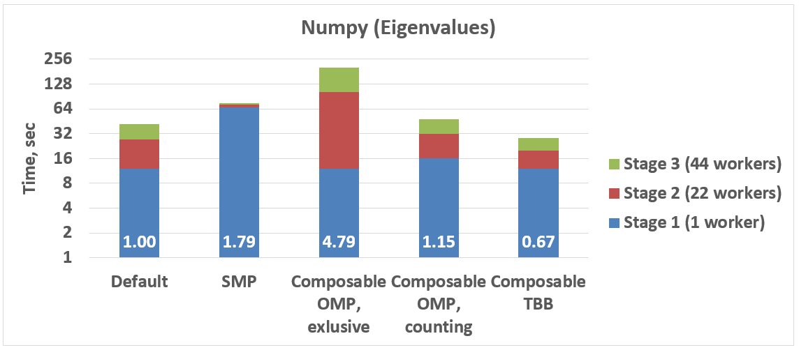

:author: Anton Malakhov
:email: Anton.Malakhov@intel.com
:institution: Intel Corporation
:corresponding:

:author: Anton Gorshkov
:email: Anton.V.Gorshkov@intel.com
:institution: Intel Corporation
:equal-contributor:

:author: Terry Wilmarth
:email: Terry.L.Wilmarth@intel.com
:institution: Intel Corporation

:year: 2017
:video: Unknown yet

---------------------------------------------------------------------
Composable Multi-Threading and Multi-Processing for Numeric Libraries
---------------------------------------------------------------------

.. class:: abstract

   As the number of cores in central processing units continues to grow, numeric libraries such as [NumPy]_, [SciPy]_, [Dask]_, and [Numba]_ continue to exploit multi-threading to provide higher throughput for their customers.
   When these libraries are used in a single Python application, unorchestrated use of threads can lead to a significant overhead resulting in inefficient use of the cores present in the system.
   This paper continues the work on coordinating multi-threaded parallelism started in [AMala16]_.
   In particular, we investigate the use of static settings, limiting the number of simultaneous active [OpenMP]_ parallel regions, and optional parallelism with Intel |R| Threading Building Blocks (Intel |R| [TBB]_).
   We show how these approaches help unlock additional performance boost for numeric applications on multi-core systems.

.. class:: keywords

   Multi-threading, Multi-processing, Oversubscription, Parallel Computations, Nested Parallelism, Multi-core, Python, GIL, Dask, Joblib, NumPy, SciPy, TBB, OpenMP

.. [AMala16] Anton Malakhov, "Composable Multi-Threading for Python Libraries", Proc. of the 15th Python in Science Conf. (SCIPY 2016), July 11-17, 2016.
.. [NumPy] NumPy, http://www.numpy.org/
.. [SciPy] SciPy, https://www.scipy.org/
.. [Dask]  Dask, http://dask.pydata.org/
.. [Numba] Numba, http://numba.pydata.org/
.. [TBB]   Intel(R) TBB open-source site, https://www.threadingbuildingblocks.org/
.. [OpenMP] The OpenMP(R) API specification for parallel programming, http://openmp.org/

1. Motivation
-------------
The fundamental shift toward parallelism that was announced more than 11 years ago in [HSutter]_ has made multi-core processors ubiquitous [WTichy]_.
Adoption of these ideas by software developers, however, has not been as rapid and Python with all of its ecosystem is not an exception.
In fact, there is a number of issues that can seriously affect parallel processing in Python [REFS_TO_EXAMPLES_WITH_PROBLEMS].

.. [HSutter] Herb Sutter, "The Free Lunch Is Over", Dr. Dobb's Journal, 30(3), March 2005.
             http://www.gotw.ca/publications/concurrency-ddj.htm
.. [WTichy]  Walter Tichy, "The Multicore Transformation", Ubiquity, Volume 2014 Issue May, May 2014. DOI: 10.1145/2618393.
             http://ubiquity.acm.org/article.cfm?id=2618393

In particular, the infamous Python's global interpreter lock [GIL]_ effectively serializes multiple threads and, therefore, makes it challenging to scale an interpreter-dependent code with threads.
As a result, developers turn their attention to multiple isolated processes that let them avoid GIL issues at a price of memory-related overhead.
However, when it comes to numeric computations with libraries like Numpy,
most of the time is spent in the so-called C extensions with no access to Python data structures.
As a result, the GIL can be released during such computations thus allowing for better scaling of compute-intensive applications.
Therefore, both multi-processing and multi-threading approaches are valuable for Python users and have their own areas of applicability.

.. [GIL] David Beazley, "Understanding the Python GIL", PyCON Python Conference, Atlanta, Georgia, 2010.
         http://www.dabeaz.com/python/UnderstandingGIL.pdf

Scaling parallel programs is challenging.
There are two fundamental laws which mathematically describe and predict scalability of a program:
Amdahl's Law and Gustafson-Barsis' Law [AGlaws]_.
According to Amdahl's Law, speedup is limited by the serial portion of the work,
which effectively puts a limit on scalability of parallel processing for a fixed-size job.
Python is especially vulnerable to this because it makes the serial part of the same code much slower
compared to implementations in other languages due to its deeply dynamic and interpretative nature.
In addition, the GIL serializes operations that could be potentially executed in parallel, further adding to the serial portion of a program.

.. [AGlaws] Michael McCool, Arch Robison, James Reinders, "Amdahl's Law vs. Gustafson-Barsis' Law", Dr. Dobb's Parallel, October 22, 2013.
            http://www.drdobbs.com/parallel/amdahls-law-vs-gustafson-barsis-law/240162980

Gustafson-Barsis' law states that if the problem size grows along with the number of parallel processors, while the serial portion grows slowly or remains fixed, speedup increases as processors are added.
This law eases the concerns regarding Python as a language for parallel computing
when the amount of serial computation in a Python code is fixed, and all the data-processing is hidden behind libraries like NumPy and SciPy.
However, a larger problem size demands more operational memory to compute, but memory is a limited resource.
Even if problem size is nearly unlimited, as it is for "Big Data", it still has to decomposed into chunks that fit into memory.
This limited growth of the problem size on a single node results in the scalability limitations defined by Amdahl's Law anyway.
Thus, the best strategy to efficiently load a multi-core system is still to avoid serial regions and synchronization.

1.1. Nested Parallelism
-----------------------
To avoid serial regions, we expose parallelism at all possible levels of an application. For example,
we make outermost loops parallel, and explore functional, flow graph, or pipeline types of parallelism on the application level.
Python libraries that help to achieve this are Dask, Joblib, and the built-in :code:`multiprocessing` and :code:`concurrent.futures` modules.
On the innermost level, data-parallelism can be delivered by Python modules like [NumPy]_ and [SciPy]_.
These modules can be accelerated with optimized math libraries like Intel |R| Math Kernel Library (Intel |R| [MKL]_),
which is multi-threaded internally using OpenMP (with default settings).

.. [MKL]    Intel(R) MKL, https://software.intel.com/intel-mkl
.. [Joblib] Joblib, http://pythonhosted.org/joblib/

When everything is combined together, the situation arises where code from one parallel region calls a function with another parallel region inside.
This is called *nested parallelism*.

1.2. Issues of Oversubscription
-------------------------------
The libraries named above do not coordinate the creation or pooling of threads, which may lead to *oversubscription*,
a situation in which there are many more active software threads than available hardware resources.
For sufficiently big machines with roughly more than 16 cores,
oversubscription can lead to sub-optimal execution due to frequent context switches, excessive thread migration, poor cache locality,
and load imbalance.

For example, Intel OpenMP [*]_ runtime library (used by NumPy/SciPy)
may keep its threads active to facilitat the rapid start of subsequent parallel regions.
This is usually a useful approach to reduce work distribution overhead, but
when another active thread pool exists in the application,
it can impact performance.  This is because the waiting OpenMP worker threads consume CPU time busy-waiting, while the other parallel work cannot start until OpenMP threads stop spinning or are preempted by the OS.

.. [*] Other names and brands may be claimed as the property of others.

Because overhead from linear oversubscription (e.g. 2x) is not always visible on the application level
(especially for smaller numbers of processor cores),
it can be tolerated in many cases when the work for parallel regions is big enough to hide the overhead.
However, in the worst case, a program starts multiple parallel tasks and each of these tasks ends up executing an OpenMP parallel region.
This results in quadratic oversubscription (with default settings) which ruins multi-threaded performance on systems with a significant number of threads. For some larger systems like Intel |R| Xeon Phi |TM|, it may not even be possible to create as many software threads as the number of hardware threads squared due to insufficient resources.

1.3. Threading Composability
----------------------------
The co-existing issues of multi-threaded components together define the *threading composability* of a program module or component.
A perfectly composable component should be able to function efficiently among other such components without affecting their efficiency.
The first aspect of building a composable threading system is to avoid creation of an excessive number of software threads, preventing oversubscription.
A component or a parallel region should not dictate how many threads it needs for execution (*mandatory parallelism*).
Instead, components or parallel regions essentially expose available parallelism to a runtime library, which in turn can provide control over the number of threads or
can automatically coordinate tasks between components and parallel regions and map them onto available software threads (*optional parallelism*).

1.4. Restricting Number of Threads used in Nested Levels
--------------------------------------------------------
A common way to solve oversubscription issues involving the OpenMP runtime library is to disable nested parallelism or to carefully adjust it according to the number of application threads. This is usually accomplished by setting environment variables controlling the OpenMP runtime library. For example, :code:`OMP_NUM_THREADS=1` restricts the number of threads used in an OpenMP parallel region to 1.
We do not discourage the use of this approach as it might be sufficient to solve the problem for many use cases.
However, this approach can have potential performance-reducing drawbacks:

#. There may not be enough parallelism at the outer application level. Blindly disabling nested parallelism can result in underutilization, and consequently, slower execution.
#. Globally setting the number of threads once does not take into account different components or phases of the application which can have differing requirements for optimal performance.
#. Setting the optimal value requires the user to have a deep understanding of the issues, the architecture of the application, and the system it uses.
#. There are additional settings to take into account like :code:`KMP_BLOCKTIME` (time a thread spins before going to sleep) and thread affinity settings.
#. The issue is not limited to OpenMP. Many Python packages like Numba, PyDAAL, OpenCV, and Intel's optimized SciKit-Learn are based on Intel |R| TBB or a custom threading runtime.

2. New approaches
-----------------
Our goal is to provide alternative solutions for composing multiple levels of parallelism across multiple threading libraries
with same or better performance compared to the usual approaches.
At the same time, we wish to keep the interface for this simple, requiring less deep knowledge and fewer decisions from end-users.
We evaluate several new approaches in this paper.

2.1. Static Settings
--------------------
A common way to parallelize Python code is to employ process or threads *pools* (or *executors*)
provided through a standard library.
These pools are also used by other Python libraries implementing parallel computations like Dask and Joblib.
We modify these pools so that each pool worker calling a nested parallel computation
can only use a particular number of processor cores.

For example, if we have an eight core CPU and want to create a pool of two workers,
we limit the number of threads per pool worker to four.
When using a process pool, we set the thread affinity mask for each worker process
so that any threads created within a particular process operate only on a specific set of processor cores.
In our example, the first process will use cores 0 through 3 and the second process will use cores 4 through 7.
Since both OpenMP and Intel |R| TBB respect the incoming affinity mask during initialization,
they limit the number of threads per process to four.
As a result, we have a simple way of sharing threads between pool workers without any oversubscription issues.

When a multi-threading pool is used for application-level parallelism, the idea is the similar. Instead of setting process affinity masks, we limit the number of threads per pool worker using the threading runtime API.
For example, we can use :code:`omp_set_num_threads()` to limit the number of threads for OpenMP parallel regions.
This approach is similar to how :code:`OMP_NUM_THREADS` environment variable can be specified for the entire application.
The difference is that here, we can use knowledge of how many outermost workers are requested by the application and
how much hardware parallelism is available on the machine,
and then calculate an appropriate number of threads automatically and apply it for the specific pool instance.
This is a more flexible approach for applications which might use pools of different sizes within the same run.

To implement this approach, we have created a Python module called *smp* (static or symmetric multi-processing).
It works with both thread and process pools from :code:`multiprocessing` and :code:`concurrent.futures` modules
using the *monkey patching* technique that enables us to use this solution without any code modifications in user applications.
To run it, we use one of the following commands:

.. code-block:: sh

    python -m smp app.py
    python -m smp -f <oversubscription_factor> app.py

The optional argument :code:`-f <oversubscription_factor>` sets an oversubscription factor that will be used
to compute the number of threads per pool worker.
By default itis 2, which means that in our example, 8 threads will be used per process.
By allowing this limited degree of oversubscription by default, many applications achieve better load balance and performance that
will outweigh the overhead incurred by the oversubscription, as discussed in p3.5.
For the particular examples we show in this paper, the best performance is achieved with :code:`-f 1` specified on the command line, indicating that any amount of oversubscription leads to non-optimal performance for those applications.

2.2. Limiting Simultaneous OpenMP Parallel Regions
--------------------------------------------------
The second approach relies on modifications to the OpenMP runtime.
The basic idea is to prevent oversubscription by not allowing multiple parallel regions (on different top-level application threads) to run simultaneously.
This resembles the "Global OpenMP Lock" that was suggested in [AMala16]_.
The implementation provides two modes for scheduling parallel regions: *exclusive* and *counting*.
Exclusive mode implements an exclusive lock that is acquired before running a parallel region and released after the parallel region completes.
Counting mode implements a mechanism equivalent to a semaphore, which allows multiple parallel regions with small number of threads to run simultaneously, as long
as the total number of threads does not exceed a limit.
When the limit is exceeded, the mechanism blocks in a similar way to the exclusive lock until the requested resources become available.
This idea is easily extended to the multiple process case using Inter-Process Coordination (IPC) mechanisms such as
a system-wide semaphore.

The exclusive mode approach is implemented in the Intel |R| OpenMP* runtime library being released
as part of Intel |R| Distribution for Python 2018 [#]_ as an experimental preview feature.
To enable this mode, :code:`KMP_COMPOSABILITY` environment variable should be set, for example:

.. [#] It was also introduced on Anaconda cloud along with the version 2017.0.3 in limited, undocumented form.
.. code-block:: sh

    env KMP_COMPOSABILITY=mode=exclusive python app.py

This enables each OpenMP parallel region to run exclusively, eliminating the worst oversubscription effects.

With composability mode in use, multi-processing coordination is enabled automatically on the first usage.
Each process has its own pool of OpenMP worker threads.
While these threads are coordinated across the processes preventing oversubscription,
creating a large number of threads per process can still cause resource exhaustion.

2.3. Coordinated Thread Pools with Intel |R| TBB
------------------------------------------------
Our last approach was introduced in a previous paper [AMala16]_.
It is based on using Intel |R| TBB as a single engine for coordinating parallelism across all Python pools and modules.
TBB's work stealing task scheduler is used to map tasks onto a limited set of TBB worker threads
while the monkey-patching technique is applied in a TBB module for Python that implements Python's :code:`ThreadPool` on top of TBB tasks.
This approach makes it possible to dynamically balance the load across multiple tasks from different modules but is limited to the multi-threading case.

In this paper, we extended this approach by introducing an InterProcess Communication (IPC) layer for Intel |R| TBB.
As shown in figure :ref:`components`, different modules that are combined into a single application,
work on top of the shared Intel |R| TBB pool, which is coordinated across multiple processes.

.. figure:: components.png

   Intel |R| TBB provides a common runtime for Python modules and coordinates threads across processes. :label:`components`

The TBB module for Python introduces a shared library, *libirml*, which is recognized by Intel |R| TBB library as a thread pool provider.
Before creating any new worker thread, this library acquires an IPC semaphore.
The semaphore is initialized with maximum value set to the number of CPU hardware threads.
When all the allowed threads are allocated, no additional threads can be created.

Because of this greedy algorithm, some TBB processes can be left without worker threads at all.
This is a legitimate situation within the optional parallelism paradigm implemented in Intel |R| TBB,
which does not prevent master threads from making progress and completing computation even without worker threads joined.
Thus, even in the worst case, counting all the worker and master threads,
the total number of active threads for all the running processes does not exceed twice the number of CPU hardware threads.

When the first process finishes its computation, TBB puts the  worker threads back in the pool and releases resources for the semaphore.
A special monitor thread implemented in libirml detects this situation and the rest of the processes are allowed
to acquire the relinquished resources and to add threads on the fly to ongoing computations in order to improve CPU utilization.

However, if we don't remove excess threads, this solution does not prevent resource exhaustion.
Since we cannot move threads from one process to another, there can be too many threads allocated at the same time.
This prevents processes with fewer threads from creating more threads to balance the load.
To fix this issue, we implemented an algorithm that disposes of unused threads when a shortage of resources is detected.

This TBB-based approach to coordination is more dynamic and flexible than one based on OpenMP
because it allows to repurpose and rebalance threads more flexibly, achieving better load balancing overall.
Even in counting composability mode, OpenMP needs to wait for all the requested threads to become available,
while Intel |R| TBB allows threads to join parallel computations already in progress.

The TBB IPC module should be enabled manually via explicit command line key :code:`--ipc`, for example:

.. code-block:: sh

    python -m tbb --ipc app.py

3. Evaluation
-------------
The results for this paper were acquired on a 2-socket system with Intel |R| Xeon |R| CPU E5-2699 v4
(2.20GHz, 22 cores * 2 hyper-threads) and 128 GB RAM. This system consists of 88 hardware threads in total.

For our experiments, we used [Miniconda]_ distribution along with the packages of
Intel |R| Distribution for Python [IntelPy]_ installed from anaconda.org/intel

.. [Miniconda] Miniconda, https://conda.io/miniconda.html
.. [IntelPy] Intel(R) Distribution for Python, https://software.intel.com/python-distribution
.. figure:: dask_static.png
   :figclass: b

   Execution times for balanced QR decomposition workload. :label:`sdask`

.. code-block:: sh

    # activate miniconda
    source <path to miniconda3>/bin/activate.sh
    # create & activate environment from the Intel channel
    conda create -n intel3 -c intel numpy dask tbb smp
    source activate.sh intel3
    # this setting is used for default runs
    export KMP_BLOCKTIME=0

We installed the following versions of the packages for our experiments:
Python 3.5.3, mkl 2017.0.3-intel_6, numpy 1.12.1_py35-intel_8, dask 0.15.0-py35_0, tbb 2017.0.7-py35_intel_2, smp 0.1.3-py_2.
We also used an experimental build of OpenMP (``libiomp``) library, which will be available in version 2018 of the ``openmp`` package.
Multi-threading results in exclusive composability mode can be reproduced using openmp 2017.0.3-intel_8 as well
when setting ``KMP_FOREIGN_THREAD_LOCK`` (deprecated).

Here is an example of how to run the benchmark programs in different modes:

.. code-block:: sh

    # Default mode
    python bench.py
    # Serialized OpenMP mode
    env OMP_NUM_THREADS=1 python bench.py
    # SMP module, oversubscription factor = 1
    python -m smp -f 1 bench.py
    # Composable OpenMP, exclusive mode
    env KMP_COMPOSABILITY=mode=exclusive python bench.py
    # Composable OpenMP, counting mode
    env KMP_COMPOSABILITY=mode=counting  python bench.py
    # Composable TBB mode (multithreading only)
    python -m tbb bench.py

For our examples, we will talk mostly about the multi-threading case, but according to our investigations,
all conclusions that will be shown are applicable for the multi-processing case as well
unless additional memory copying happens between the processes, which is out of scope for this paper.

Please find these benchmarks along with install and run script at [compbench]_

.. [compbench] Repository for composability benchmarks, https://github.com/IntelPython/composability_bench

3.1. Balanced QR Decomposition with Dask
----------------------------------------
The code below is a simple program using Dask that validates a QR decomposition function by multiplying computed components and comparing the result against the original input.

.. code-block:: python
    :linenos:

    import time, dask, dask.array as da
    x = da.random.random((440000, 1000),
                         chunks=(10000, 1000))
    for i in range(3):
        t0 = time.time()
        q, r = da.linalg.qr(x)
        test = da.all(da.isclose(x, q.dot(r)))
        test.compute()
        print(time.time() - t0)

Dask splits the array into 44 chunks and processes them in parallel using multiple threads.
However, each Dask task executes the same NumPy matrix operations which are accelerated using Intel |R| MKL under the hood and thus multi-threaded by default.
This combination results in nested parallelism, i.e. when one parallel component calls another component, which is also threaded.
The execution is repeated numerous times, with results taken from later iterations, in order to avoid the cache-warming effects present in the first iterations.

Figure :ref:`sdask` shows the performance for the code above.
By default, Dask processes a chunk in a separate thread, so there are 44 threads at the top level.
By default, Dask creates a thread pool with 88 workers,
but only half of them are used since there are only 44 chunks.
Chunks are computed in parallel with 44 OpenMP workers each.
Thus, there can be 1936 threads competing for 44 cores, which results in oversubscription and poor performance.

A simple way to improve performance is to tune the OpenMP runtime using the environment variables.
First, we limit the total number of threads.
Since we have an 88-thread machine, we limit OpenMP to a single thread per parallel region
( (88 CPU threads / 88 workers in thread pool) * 1x over-subscription).
We also noticed that reducing the period of time after which an Intel OpenMP worker thread goes to sleep helps to improve performance in workloads with oversubscription
(this works best for the multi-processing case but helps for multi-threading as well).
We achieve this by setting KMP_BLOCKTIME to zero by default.
These simple optimizations reduce the computational time by 2.5x.

The third approach using *smp* module and specifying ``-f 1``does similar optimizations automatically,
and shows the same level of performance as for ``OMP_NUM_THREADS=1``.
The approach is more flexible and works with several thread/process pools in the application scope,
even if they have different sizes.
Thus, it is a better alternative to manual OpenMP tuning.

The remaining approaches are our dynamic OpenMP- and Intel |R| TBB-based approaches.
Both approaches improve the default result, but OpenMP gives us the fastest time.
As described above, the OpenMP-based solution allows processing of chunks one by one without any oversubscription,
since each separate chunk can utilize the whole CPU.
In contrast, the work stealing task scheduler of Intel |R| TBB is truly dynamic
and uses a single thread pool to process all the given tasks simultaneously.
As a result, besides higher overhead for work distribution, it has worse cache utilization.

.. [#] For more complete information about compiler optimizations, see our Optimization Notice [OptNote]_

3.2. Balanced Eigenvalues Search with NumPy
-------------------------------------------
The code below processes eigenvalues and right eigenvectors search in a square matrix using Numpy:

.. figure:: numpy_static.png
   :figclass: tb

   Execution time for balanced eigenvalues search workload. :label:`snumpy`

.. code-block:: python
    :linenos:

    import time, numpy as np
    from multiprocessing.pool import ThreadPool
    x = np.random.random((256, 256))
    p = ThreadPool(88)
    for j in range(3):
        t0 = time.time()
        p.map(np.linalg.eig, [x for i in range(1024)])
        print(time.time() - t0)

In this example we process several matrices from an array in parallel using Python's :code:`ThreadPool`
while each separate matrix is computed in parallel by Intel |R| MKL.
Similar to the QR decomposition benchmark above, we used quadratic oversubscription here.
This code has the distinctive feature that, in spite of parallel execution of eigenvalues search algorithm,
it cannot fully utilize all available CPU cores.
The additional level of parallelism we use here significantly improves the overall benchmark performance.

Figure :ref:`snumpy` shows benchmark execution time using the same modes as inthe QR decomposition example.
The best choice for this benchmark was to limit number of threads statically either using manual settings or the *smp* module, and obtained a more than 7x speed-up.
Also, Intel |R| TBB based approach performed much better than composable OpenMP.
The reason for this was that there was insufficient parallelism present in each separate chunk.
In fact, exclusive composability mode in OpenMP leads to serial matrix processing, so a significant part of the CPU stays unused.
As a result, the execution time in this case becomes even larger than by default.
The result of counting mode can be further improved on Intel |R| MKL side
if parallel regions can be adjusted to request fewer threads.

3.3. Unbalanced QR Decomposition with Dask
------------------------------------------
In previous sections, we discussed balanced workloads where the amount of work per thread at the top level is mostly the same.
As we expected, the best strategy for such cases is based on static approaches.
However, what if we need to deal with dynamic workloads where the amount of work per thread or process varies?
To investigate such cases we have prepared unbalanced versions of our static benchmarks.
Each benchmark creates an outermost thread pool for 44 workers.
We will perform computations in three stages.
The first stage uses only one thread from the pool, which is able to fully utilize the whole CPU.
During the second stage, half of the top level threads are used (22 in our example).
In the third stage, the whole pool is employed (44 threads).

The code below shows this *unbalanced* version of QR decomposition workload:

.. code-block:: python
    :linenos:

    import time, dask, dask.array as da
    def qr(x):
        t0 = time.time()
        q, r = da.linalg.qr(x)
        test = da.all(da.isclose(x, q.dot(r)))
        test.compute(num_workers=44)
        print(time.time() - t0)
    sz = (440000, 1000)
    x01 = da.random.random(sz, chunks=(440000, 1000))
    x22 = da.random.random(sz, chunks=(20000, 1000))
    x44 = da.random.random(sz, chunks=(10000, 1000))
    qr(x01); qr(x22); qr(x44)

To run this benchmark, we used the four approaches: default, with smp module, composable OpenMP and Intel |R| TBB.
We do not show results for ``OMP_NUM_THREADS=1`` since they are very close to the results for the SMP approach.

   Execution times for unbalanced QR decomposition workload. :label:`ddask`

Figure :ref:`ddask` demonstrates execution time for all the approaches.
The first observation here is that the static SMP approach does not achieve good performance with imbalanced workloads.
Since we have a single thread pool with a fixed number of workers,
it is unknown which of workers are used and how intensively.
Accordingly, it is difficult to set an appropriate number of threads statically.
Thus, we limit the number of threads per parallel region based on the size of the pool only.
As a result, just a few threads are used inthe first stage, which leads to underutilization and slow performance.
The second and third stages work well, but overall we have a mediocre result.

The work stealing scheduler of Intel |R| TBB works slightly better than the default version,
but due to redundant work balancing in this particular case it has significant overhead.

The best execution time comes from using composable OpenMP.
Since there is sufficient work to do in each parallel region,
allowing each chunk to be calculated one after the other avoids oversubscription and results in the best performance.

3.4. Unbalanced Eigenvalues Search with NumPy
---------------------------------------------
The second dynamic example present here is based on eigenvalues search algorithm from NumPy:

.. code-block:: python
    :linenos:

    import time, numpy as np
    from multiprocessing.pool import ThreadPool
    from functools import partial

    x = np.random.random((256, 256))
    y = np.random.random((8192, 8192))
    p = ThreadPool(44)

    t0 = time.time()
    mmul = partial(np.matmul, y)
    p.map(mmul, [y for i in range(6)], 6)
    print(time.time() - t0)

    t0 = time.time()
    p.map(np.linalg.eig, [x for i in range(1408)], 64)
    print(time.time() - t0)

    t0 = time.time()
    p.map(np.linalg.eig, [x for i in range(1408)], 32)
    print(time.time() - t0)

   Execution time for unbalanced eigenvalues search workload. :label:`dnumpy`

In this workload, we have the same three stages.
The second and the third stage computes eigenvalues and the first one performs matrix multiplication.
The reason we do not use eigenvalues search for the first stage as well is that it cannot fully load the CPU as we intended.

From figure :ref:`dnumpy` we can see that the best solution for this workload is Intel |R| TBB mode,
which reduces execution time to 67% of the default mode.
SMP module works even slower than the default version due to the same issues
as described for the unbalanced QR decomposition example.
Composable OpenMP works significantly slower than the default version
since there is not enough work for each parallel region, which leads to CPU underutilization.

3.5. Impact of nested parallelism and oversubscription
------------------------------------------------------
The experiments in this section demonstrate the benefits of using nested parallelism and
determine what degree of oversubscription impacts performance.
We took our balanced eigenvalues search workload (p3.2) and ran it in default and the best performing SMP modes.
Then we ran it with various sizes for the top level thread and process pool, from 1 to 88 workers.

.. figure:: scalability_multithreading.png
   :figclass: b

   Multi-threading scalability of eigenvalues search workload. :label:`smt`

.. figure:: scalability_multiprocessing.png
   :figclass: t

   Multi-processing scalability of eigenvalues search workload. :label:`smp`

.. [#] For more complete information about compiler optimizations, see our Optimization Notice [OptNote]_

Figure :ref:`smt` shows the scalability results for the multi-threading case.
The difference in execution time between these two methods starts from 8 threads in top level pool
and becomes larger as the pool size increases.

The multi-processing scalability results are shown in figure :ref:`smp`.
They can be obtained from the same example by replacing :code:`ThreadPool` by :code:`Pool`.
The results are very similar to the multi-threading case:
oversubscription effects become visible starting from 8 processes at the top level of parallelization.

4. Solutions Applicability and Future Work
------------------------------------------
In summary, all three evaluated approaches to compose parallelism are valuable
and can provide significant performance increases for both multi-threading and multi-processing cases.
Ideally, we would like to find a single solution, which works well in all cases.
Instead, the presented approaches complement each other and have their own fields of applicability.

The SMP approach works perfectly for balanced workloads where all the outermost workers have same amount of work.
Compared with manual tuning of OpenMP settings, this approach is more stable,
since it can work with pools of different sizes within the scope of a single application without performance degradation.
It also covers other threading libraries such as Intel |R| TBB.

The composable OpenMP mode works best with unbalanced benchmarks for cases
where there is enough work to load each innermost parallel region.

The dynamic task scheduler from Intel |R| TBB provides the best performance
when innermost parallel regions cannot fully utilize the whole CPU and/or have varying amounts of work to process.

This empirical evidence might not be enough to properly generalize our experience while there are a lot of
other variables and moving targets, but we did our best to summarize conclusions and suggest practical guidance
in the following table as a starting point for tuning performance of applications with nested parallelism:

.. figure:: recommendation_table.png
   :figclass: h

Threads created for blocking I/O operations are not subject to performance degradation caused by oversubscription.
In fact, it is recommended to maintain a higher number of threads because they are mostly blocked in the operating system.
If your program uses blocking I/O, please consider using asynchronous I/O instead
that blocks only one thread for the event loop and so prevents other threads from being blocked.

We encourage readers to try suggested composability modes and use them in production environments,
if this provides better results.
However, there are potential enhancements that can be implemented
and we need feedback and realistic use cases
in order prioritize the improvements.

The *smp* module works only on Linux currently, but can be extended to other platforms as well.
It bases its calculations only on the pool size and does not take into account its real usage.
We think it can be improved in future to trace task scheduling pool events and become more flexible.

The composability mode of Intel OpenMP* runtime library is currently limited to Linux platform as well.
It works well with parallel regions with high CPU utilization,
but it has a significant performance gap in other cases, which we believe can be improved.

The IPC mode of the TBB module for Python is a preview feature, which might be insufficiently optimized and verified
with different use cases.
Also, the TBB-based threading layer of Intel |R| MKL might be suboptimal compared to the default OpenMP-based threading layer.

All these problems can be eliminated as more users become interested in using nested parallelism
in a prodution environment and as all software mentioned here is further developed.

.. [OptNote] https://software.intel.com/en-us/articles/optimization-notice

5. Conclusion
-------------
In this paper, we discussed the necessity of broader usage of nested parallelism for multi-core systems, and defines threading composability.  We address the issues, such as GIL and oversubscription, of Python programs and libraries that use parallelism with multi-core systems.
These issues affect the performance of Python programs that use libraries like NumPy, SciPy, SciKit-learn, Dask, and Numba.

Three approaches are suggested as potential solutions.
The first approach is to statically limit the number of threads created on the nested parallel level.
The second one is to coordinate execution of OpenMP parallel regions.
The third one is to use a common threading runtime using Intel |R| TBB extended to multi-processing parallelism.
All these approaches limit the number of active threads in order to prevent penalties of oversubscription.
They coordinate parallel execution of independent program modules to improve overall performance.

The examples presented in the paper show promising results while achieving the best performance
using nested parallelism in threading composability modes.
In particular, balanced QR decomposition and eigenvalues search examples are 2.5x and 7.5x faster
compared to the baseline implementations.
Imbalanced versions of these benchmarks are 34-35% faster than the baseline.

These improvements are achieved with all different approaches,
demonstrating that the three solutions are valuable and complement each other.
We have compared suggested approaches and provided recommendations for when it makes sense to employ each of them.

All the described modules and libraries are available as open source software and
included as part of the free Intel |R| Distribution for Python product.
The Distribution is available as a stand-alone installer [IntelPy]_ and as a set of packages on anaconda.org/intel channel.

References
----------

.. figure:: opt-notice-en_080411.png
   :figclass: b
.. |C| unicode:: 0xA9 .. copyright sign
   :ltrim:
.. |R| unicode:: 0xAE .. registered sign
   :ltrim:
.. |TM| unicode:: 0x2122 .. trade mark sign
   :ltrim:
