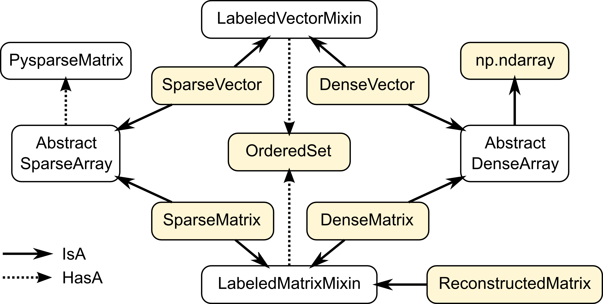
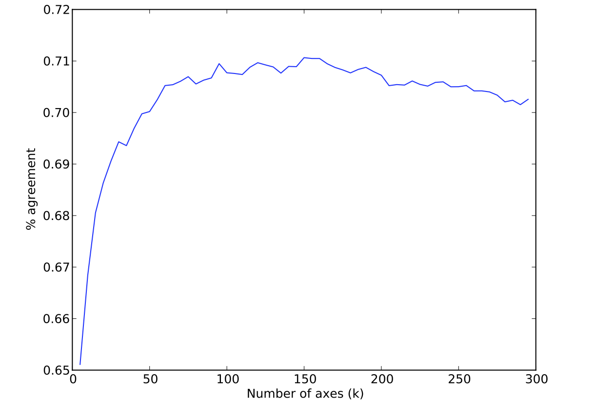

:author: Rob Speer
:email: rspeer@mit.edu
:institution: MIT Media Lab

:author: Kenneth Arnold
:email: kcarnold@mit.edu
:institution: MIT

:author: Catherine Havasi
:email: havasi@mit.edu
:institution: MIT

------------------------------------------------------
Divisi: Learning from Semantic Networks and Sparse SVD
------------------------------------------------------

.. class:: abstract

    Singular value decomposition (SVD) is a powerful technique for finding
    similarities and patterns in large data sets. SVD has applications in
    text analysis, bioinformatics, and recommender systems, and in
    particular was used in many of the top entries to the Netflix
    Challenge. It can also help generalize and learn from knowledge
    represented in a sparse semantic network.
    Although this operation is fundamental to many fields, it requires a
    significant investment of effort to compute an SVD from sparse data
    using Python tools. Divisi is an answer to this: it combines NumPy,
    PySparse, and an extension module wrapping SVDLIBC, to make Lanczos'
    algorithm for sparse SVD easily usable within cross-platform Python
    code.
    Divisi includes utilities for working with data in a variety of sparse
    formats, including semantic networks represented as edge lists or
    NetworkX graphs. It augments its matrices with labels, allowing you to
    keep track of the meaning of your data as it passes through the SVD,
    and it can export the labeled data in a format suitable for separate
    visualization GUIs.


Introduction
------------
Singular value decomposition (SVD) is a way of factoring an arbitrary
rectangular matrix, in order to express the data in terms of its *principal
components*. SVD can be used to reduce the dimensionality of a large matrix, a
key step in many domains, including recommender systems, text mining, search,
statistics, and signal processing.

The *truncated SVD*, in which only the largest principal components are
calculated, is a particularly useful operation in many fields because it can
represent large amounts of data using relatively small matrices. In many
applications, the input to the truncated SVD takes the form of a
very large, sparse matrix, most of whose entries are zero or unknown.

Divisi provides the Lanczos algorithm [Lan98]_ for performing a sparse,
truncated SVD, as well as useful tools for constructing the input matrix and
working with the results, in a reusable Python package called ``divisi2``.
It also includes important operations for preparing data such as
normalization and mean-centering. More experimentally, Divisi also
includes implementations of some SVD-inspired algorithms
such as CCIPCA [Wen03]_ and landmark multi-dimensional scaling
[Sil04]_.

Using singular value decomposition, any matrix :math:`A` can be factored into
an orthonormal matrix :math:`U`, a diagonal matrix :math:`\Sigma`, and an
orthonormal matrix :math:`V^T`, so that  :math:`A = U\Sigma V^T`. The singular
values in :math:`\Sigma` can be ordered from largest to smallest, where the
larger values correspond to the vectors in :math:`U` and :math:`V` that are
more significant components of the initial :math:`A` matrix. The largest
singular values, and their corresponding rows of :math:`U` and columns of
:math:`V`, represent the principal components of the data.

To create the truncated SVD,  discard all but the first :math:`k`
components -- the principal components of :math:`A` -- resulting in the smaller
matrices :math:`U_k`, :math:`\Sigma_k`, and :math:`V^T_k`. The
components that are discarded represent relatively small variations in the
data, and the principal components form a low-rank approximation of the
original data. One can then reconstruct a smoothed version of the input matrix as an 
approximation: :math:`A \approx U_k\Sigma_k V^T_k = A_k`.

To make it easier to work with SVD in understandable Python
code, Divisi provides an abstraction over sparse and dense matrices that
allows their rows and columns to be augmented with meaningful labels, which
persist through various matrix operations.

The documentation for installing and using Divisi is hosted at http://csc.media.mit.edu/docs/divisi2/.

Architecture
------------

Divisi is built on a number of other software packages. It uses NumPy
[Oli10]_ to represent dense matrices, and PySparse [Geu08]_ to
represent sparse ones, and uses a Cython wrapper around SVDLIBC [Roh10]_
to perform the sparse SVD. It can optionally use NetworkX [Net10]_ to
take input from a directed graph such as a semantic network.

Divisi works with data in the form of *labeled arrays*. These arrays can be
sparse or dense, and they can be 1-D vectors or 2-D matrices.



   Relationships between the main classes in Divisi 2.0, as well as
   some externally-defined classes.

Figure 1 shows the relationships between classes in Divisi2. The
yellow-highlighted classes are the ones that are intended to be instantiated.
The core representations use multiple inheritance: for example, the properties
of a SparseMatrix are separately defined by the fact that it is sparse and the
fact that it is a 2-D matrix.

Sparse arrays encapsulate a PysparseMatrix from the ``pysparse`` package, while
dense arrays are a subclass of ``numpy.ndarray`` and therefore support most
NumPy operations. Both representations support NumPy-style "fancy indexing".

A vector contains a single, optional list of labels: if it exists,
each entry in the list corresponds to one entry in the vector. A matrix may
have two lists of labels: one assigns a label to each row, and another assigns
a label to each column. The purpose of these labels is to associate a meaning
with each entry in a vector or matrix, so that code can look up entries by what
they *mean* instead of simply by their position in the matrix.

The label lists themselves are instances of Divisi's OrderedSet class, which
augments a list with a dictionary of its values, so that it can perform the
``.index()`` operation -- finding an entry by its value -- in constant time.
This enables methods such as ``SparseMatrix.row_named(label)``, efficiently
returning the row with a particular label.

.. note: this next paragraph could be clearer

One more important class is ReconstructedMatrix, which lazily evaluates the
matrix product of two DenseMatrices. This allows using the SVD as an
approximation to a large matrix, but stores that large approximate matrix as a
product of its SVD factors instead, which requires much less memory.

Next, we will explain the features of Divisi through three examples: performing
latent semantic analysis (LSA) over documents from the Brown corpus, making
movie recommendations from a MovieLens data set, and drawing conclusions based
on ConceptNet (a semantic network of general knowledge).

Latent semantic analysis
------------------------

One common use for Divisi is to make a topic model from a number of documents
using latent semantic analysis (LSA). LSA typically consists of constructing a
bag-of-words matrix of the words that appear in various documents, normalizing
that matrix using tf-idf, and taking the SVD.

We'll use as an example a collection of 44 documents from the "news"
section of the Brown corpus, a sample of which is available through NLTK:

>>> import nltk
>>> nltk.download('brown')
>>> len(nltk.corpus.brown.fileids(['news']))
44

When searching for articles about, say, books, we don't generally care
whether the document contained "book" or "books". NLTK includes the
Porter stemmer, which strips off endings:

>>> stemmer = nltk.PorterStemmer()
>>> stemmer.stem('books')
'book'

In the most basic form of LSA, each document is treated as a "bag of
words", ignoring all sequence and punctuation. The following function
yields all the stemmed words from a document in the Brown corpus:

>>> import re; word_re = re.compile(r'[A-Za-z]')
>>> categories=['news']
>>> fileids = nltk.corpus.brown.fileids(categories)
>>> def normalized_words(fileid):
...    for word in nltk.corpus.brown.words(fileid):
...        if word_re.match(word):
...            yield stemmer.stem(word.lower())

Now that we have the input data, we can load it into a Divisi sparse
matrix. The function ``divisi2.make_sparse`` [#]_ creates a sparse
matrix from a list of entries, each of which is a tuple of ``(value,
row, col)``:

.. [#] The version of Divisi described in this paper, Divisi 2.0, would be
   installed in a namespace package called ``csc``. Divisi 2.2 can now be
   imported directly as ``divisi2``, but references to ``csc.divisi2`` still
   work.

>>> from csc import divisi2
>>> entries = ((1, term, doc)
...            for doc in fileids
...            for term in normalized_words(doc))
>>> matrix = divisi2.make_sparse(entries)
>>> print matrix
SparseMatrix (8976 by 44)
         ca01       ca02       ca03       ca04     ...
the      1.55e+02   1.34e+02   1.50e+02   1.60e+02
fulton  14.000000      ---        ---        ---  
counti  17.000000   8.000000   2.000000      ---  
grand    4.000000      ---     3.000000      ---  
juri    19.000000      ---     5.000000      ---  
said    24.000000  14.000000  17.000000   3.000000
...

A Divisi sparse matrix behaves like a NumPy array, but has additional
facilities for labeling entries. Notice that ``row`` and ``col`` were both
specified as strings (a term and a filename) rather than
numbers. The ``row_labels`` and ``col_labels`` attributes keep track
of what label is assigned to each row or column index: [#]_:

.. [#] Example output in this paper is truncated or rounded for brevity.

>>> matrix.row_labels
<OrderedSet of 8976 items like the>
>>> matrix.col_labels
<OrderedSet of 44 items like ca01>
>>> matrix[0,0]
155.0
>>> matrix.entry_named('the', 'ca01')
155.0

That entry indicates that the word "the" appeared 155 times in the
first document alone. Such common words would overwhelm the analysis:
we should give less weight to words that appear in nearly every
document. Also, a document that is twice as long as average should not
necessarily be twice as influential. The standard solution to these
problems is called *tf-idf normalization* and is one of several
normalization capabilities provided by Divisi:

>>> normalized = matrix.normalize_tfidf().squish()

All Divisi normalization routines return a copy of their input. The
final ``.squish()`` call deals with words like "the": since they
appear in every document, their idf value, and thus the value of every
entry in the corresponding row, is 0. Rows and columns that are all
zeros leave part of the SVD result unconstrained, so we remove them
for numerical stability.

Next we can compute the SVD. The only parameter is the number of
singular values ("components") to keep. The optimal value depends on
the corpus and task at hand; it essentially controls how much you want
to fill in gaps in your data. Since the corpus is small, we
arbitrarily choose 10 for this example.

>>> u, sigma, v = normalized.svd(k=10)

Here, ``sigma`` is an array of diagonal entries; the actual diagonal
matrix :math:`\Sigma` is given by ``np.diag(sigma)``.

Since :math:`A \approx U \Sigma V^T`, we can execute various queries
simply by matrix multiplication. For example, which documents are
likely to contain terms like "book"? That's just a row of
:math:`A`. Using the approximation, we can compute that row:

>>> from pprint import pprint
>>> booky = divisi2.dot(u.row_named('book'),
                divisi2.dot(np.diag(sigma), v.T))
>>> pprint(booky.top_items(3))
[('ca44', 0.0079525209393728428),
 ('ca31', 0.0017088410316380212),
 ('ca18', 0.0010004880691358573)]

``divisi2.dot`` is a wrapper around ``numpy.dot`` that ensures that
labels are maintained properly.

Reconstructing an approximate matrix
````````````````````````````````````

Divisi provides simpler ways of working with matrix reconstructions:
the ``ReconstructedMatrix`` class:

>>> reconstructed = divisi2.reconstruct(u, sigma, v)
>>> booky2 = reconstructed.row_named('book')
>>> assert np.allclose(booky, booky2)

Another common query, often seen in blog posts, is which articles are
similar to the one in question. Mathematically, which other document
has the term vector with the highest dot product with the term vector
of this document? The answer is again found in a matrix slice, this
time of

.. raw:: latex

    \[A^TA = V\Sigma U^T\,U\Sigma V^T = V\Sigma^2V^T.\]

Again, Divisi provides functionality for easily slicing similarity matrices:

>>> similar_docs = \
...   divisi2.reconstruct_similarity(v, sigma)\
...     .row_named('ca44')
>>> pprint(similar_docs.top_items(3))
[('ca44', 0.99999999999999978),
 ('ca31', 0.82249752503164653),
 ('ca33', 0.6026564223332086)]

By default, ``reconstruct_similarity`` normalizes the result values to
lie between -1 and 1.


Making recommendations
----------------------

In the above example, we assumed that unspecified entries in the input matrix
were zero, representing a lack of knowledge. When using SVD over a data set
whose numeric values do not meaningfully start at zero, some adjustments are
necessary.

In the domain of movie recommendations, for example, the input data often takes
the form of star ratings that people assign to movies, ranging from 1 to 5. A
5-star rating and a 1-star rating are as different as can be, so a 5-star
rating certainly does not have the meaning of "a 1-star rating, but five times
more so".

In fact, the scale of ratings differs among people and movies. A movie rater
may be very stingy with high ratings, so if they give a movie five stars it is
very meaningful. Likewise, a movie could be widely panned, receiving a 1.1 star
rating on average, so when someone gives the movie five stars it says that
there is something very different about their taste in movies.

The movie rating problem can be broken down into two steps [Kor09]_: accounting
for the *biases* in ratings inherent to each movie and each person, and
learning how people's particular preferences differ from those biases. We can
represent the second step as an SVD where zero *does* represent a lack of
information, and add the biases back in when we reconstruct the matrix.

To begin the example, load the MovieLens dataset of 100,000 movie ratings
[Kon98]_, which is provided free from http://grouplens.org:

>>> from csc import divisi2
>>> from csc.divisi2.dataset import movielens_ratings
>>> movie_data = divisi2.make_sparse(
      movielens_ratings('data/movielens/u')).squish(5)

The "squish" method at the end discards users and movies with fewer than 5
ratings.

With this data, for example, we can query for the movies with the
highest row bias (and therefore the highest average rating):

>>> import numpy as np
>>> movie_goodness = movie_data.row_op(np.mean)
>>> movie_goodness.top_items(5)
[('Pather Panchali (1955)', 4.625),
 ('Close Shave, A (1995)', 4.4910714285714288),
 ("Schindler's List (1993)", 4.4664429530201346),
 ('Wrong Trousers, The (1993)', 4.4661016949152543),
 ('Casablanca (1942)', 4.4567901234567904)]

.. we might want to squish from here on if we're low on space.

We use the ``SparseMatrix.mean_center()`` method to remove the biases, leaving
only the differences from the mean, calculate a 20-dimensional truncated SVD
from those differences, and reconstruct an approximate matrix that predicts
people's movie ratings.

>>> movie_data2, row_shift, col_shift, total_shift =\
...   movie_data.mean_center()
>>> recommendations = divisi2.reconstruct(
...   U, S, V,
...   shifts=(row_shift, col_shift, total_shift))

Let's look in particular at user number 5, who rated 174 movies. We can get a
vector of their recommendations and query for the best ones:

>>> recs_for_5 = recommendations.col_named(5)
>>> recs_for_5.top_items(5)
[('Star Wars (1977)', 4.816),
 ('Return of the Jedi (1983)', 4.549),
 ('Wrong Trousers, The (1993)', 4.529),
 ('Close Shave, A (1995)', 4.416),
 ('Empire Strikes Back, The (1980)', 4.392)]

We see that this user should really like the Star Wars Trilogy, but this is
unsurprising because the user in fact already told MovieLens they liked those
movies. To get true recommendations, we should make sure to filter for movies
they have not yet rated.

>>> recs_for_5 = recommendations.col_named(5)
>>> unrated = list(set(xrange(movie_data.shape[0]))
...   - set(recs_for_5.nonzero_indices()))
>>> rec[unrated].top_items(5)
[('Wallace & Gromit: [...] (1996)', 4.197),
 ('Terminator, The (1984)', 4.103),
 ('Casablanca (1942)', 4.044),
 ('Pather Panchali (1955)', 4.004),
 ('Dr. Strangelove [...] (1963)', 3.998)]

And on the other end of the scale, if we look for the best anti-recommendation
in ``(-rec[unrated])``, we find that user 5 should give "3 Ninjas: High Noon At
Mega Mountain" a rating of 0.24 stars.

SVD alone does not make a cutting-edge, high-quality recommender system, but it
does a reasonable part of the job. This process has been used as a component of
many recommender systems, including the Netflix Prize-winning system, Bellkor's
Pragmatic Chaos [Kor09]_, and Divisi makes it easy to do in Python.

Learning from a semantic network
--------------------------------

Divisi contains methods for learning from data in a semantic network in
NetworkX format. The network can contain labeled nodes and labeled edges with
weights on each edge, and can build matrices that relate these to each other in
a variety of ways.

This is an important feature of Divisi, because it extends its scope to data
that is not traditionally represented as a matrix. It can learn from and
generalize patterns that appear in any semantic network, and it is especially
effective if that network contains redundancies or incomplete information. For
this reason, we often use it to learn from ConceptNet [Hav07]_, a network
of people's general "common sense" knowledge about the real world. A graph
representation of ConceptNet 4.0 is included with Divisi 2.0.

The ``divisi2.network`` module defines the various ways to extract
information from these labeled semantic networks. Its ``sparse_triples()``
function turns the list of edges into a list of (value, rowlabel, columnlabel)
triples that can be used to build a sparse matrix, and uses the arguments
``row_labeler`` and ``col_labeler`` to specify how the values are assigned to
labels. ``sparse_matrix()`` goes the extra step to turn these triples into a
matrix.

In many cases, the labeler will give two results for each edge, because each
edge connects two nodes. When the row and column labelers both give two
results, they will be paired up in contrary order. The next example will
clarify why this is useful.

One simple labeler is ``'nodes'``, which extracts the source and target nodes
of each edge. If an edge of weight 1 connects "dog" to "bark", then because of
the contrary order rule,  ``sparse_matrix(graph, 'nodes', 'nodes')`` will put a
1 in the entry whose row is "dog" and column is "bark", as well as the entry
whose row is "bark" and whose column is "dog".  The resulting overall matrix is
the adjacency matrix of the graph.

``'features'`` is a more complex labeler: it takes the edge label into account
as well, and describes an incoming or outgoing edge, including the node on the
other side of it. The idea is that a node can be combined with a feature to
completely describe an edge.

For example, consider a weight-1 edge from "dog" to "mammal", labeled with
"IsA", expressing the assertion that "a dog is a mammal". The matrix
``sparse_matrix(graph, 'nodes', 'features')`` will then express both the fact
that the node "dog" has the feature "IsA mammal", and that "mammal" has the
feature "dog IsA".

These features are represented with Divisi as 3-tuples of (*direction*, *edge
label*, *node label*), where *direction* is "left" or "right" depending on
whether this is an incoming or outgoing edge.

Other possible labelers are "relations", which extracts just the edge label,
and "pairs", extracting the source and target nodes as tuples, and more can be
defined as functions.

The process called AnalogySpace [Spe08]_ involves making a node vs.
feature matrix of common sense knowledge and generalizing it with a truncated
SVD. We will show an example of doing this with ConceptNet here.

Learning from ConceptNet
````````````````````````
Start by loading the pre-defined ConceptNet 4.0 graph:

>>> conceptnet_graph = divisi2.load(
      'data:graphs/conceptnet_en.graph')

We can break this graph down into nodes and features, and see a sample of what
it looks like:

>>> from csc.divisi2.network import sparse_matrix
>>> A = sparse_matrix(graph, 'nodes', 'features',
                      cutoff=3)
>>> print A
SparseMatrix (12564 by 19719)
         IsA/spor   IsA/game   UsedFor/   UsedFor/
baseball 3.609584   2.043731   0.792481   0.500000
sport       ---     1.292481      ---     1.000000
yo-yo       ---        ---        ---        ---
toy         ---     0.500000      ---     1.160964
dog         ---        ---        ---     0.792481
...

And with that, we can make a truncated SVD and reconstruct an approximation to
A:

>>> U, S, V = A.svd(k=100)
>>> Ak = divisi2.reconstruct(U, S, V)
>>> Ak.entry_named('pig', ('right', 'HasA', 'leg'))
0.15071150848740383
>>> Ak.entry_named('pig',
                   ('right', 'CapableOf', 'fly'))
-0.26456066802309008

As shown in the earlier LSA example, we can also reconstruct an approximation
to the similarity matrix :math:`A^T A`, describing how similar the nodes are
to each other:

>>> sim = divisi2.reconstruct_similarity(U, S)
>>> sim.entry_named('horse', 'cow')
0.827
>>> sim.entry_named('horse', 'stapler')
-0.031
>>> sim.row_named('table').top_items()
[('table', 1.000), ('newspaper article', 0.694),
 ('dine table', 0.681), ('dine room table', 0.676),
 ('table chair', 0.669), ('dine room', 0.663),
 ('bookshelve', 0.636), ('table set', 0.629),
 ('home depot', 0.591), ('wipe mouth', 0.587)]

Recall that ``reconstruct_similarity`` normalizes its values to
between -1 and 1. Here, this normalization makes some nodes, such as
"newspaper article" and "home depot", get a spuriously high weight
because their truncated SVD vectors had low magnitude.  When ranking
possible similarities -- or, for that matter, predictions for new
assertions that could be true -- we have found it more useful to
normalize the vectors to unit vectors *before* the SVD, so that nodes
that are weakly described by the SVD do not end up magnified.

Divisi allows for this with the SparseMatrix methods
``normalize_rows()``, ``normalize_cols()``, and
``normalize_all()``. (tf-idf normalization, like in the LSA example,
is also an option, but it is inappropriate here because it
de-emphasizes common concepts.) The first two scale the rows or
columns, respectively, of the input so that they become unit vectors.
However, normalizing the rows can further distort the magnitudes of
the columns, and vice versa, and there is no way to exactly normalize
both the rows and columns of an arbitrary matrix.

We have found that a compromise works best: normalize each entry by the
geometric mean of its row and column magnitudes. This is what
``SparseMatrix.normalize_all()`` does, and we favor it in this case because not
only does it put all the rows and columns on approximately the same scale, it
also increases the predictive accuracy of the reconstructed SVD (which we will
be able to quantify in a moment).

In this representation, we can look again at the similarities for "table":

>>> U, S, V = A.normalize_all().svd(k=100)
>>> sim = divisi2.reconstruct_similarity(U, S)
>>> sim.row_named('table').top_items()
[('table', 1.718), ('desk', 1.195),
 ('kitchen', 0.988), ('chair', 0.873),
 ('restaurant', 0.850), ('plate', 0.822),
 ('bed', 0.772), ('cabinet', 0.678),
 ('refrigerator', 0.652), ('cupboard', 0.617)]

Choosing parameters
```````````````````
So far, we have used two parameters in this process without justification: the
method of normalization, and the value of *k*.

Instead of simply tweaking these parameters by hand, we can bring in some test
data and search for the parameters that maximize the predictive value of the
SVD. Because what we care about is the relative ranking of statements, not the
numerical values they are assigned, a traditional mean-squared evaluation does
not exactly make sense.

However, using Divisi, we can evaluate how often the relative ranking of a pair
of assertions agrees with the ranking that a human would give them. In the case
of ConceptNet, we have already acquired many such human-evaluated statements
from evaluations such as the one in [Spe08]_, so we use those as the
source of gold-standard rankings.

The ``ReconstructedMatrix.evaluate_ranking()`` method is what we use to compare
pairwise rankings in this way. We can use it, first of all, to confirm that
``normalize_all()`` performs better than the other possible normalization
methods on ConceptNet, leaving *k* fixed at 100. The results are:

* Without normalization: 68.47% agreement
* Using ``normalize_rows``: 67.66% agreement
* Using ``normalize_cols``: 67.30% agreement
* Using ``normalize_all``: 70.77% agreement

Then, after applying that normalization method, we can try truncated SVDs with various values of *k*.

>>> from csc.divisi2.network import conceptnet_matrix
>>> conceptnet = conceptnet_matrix('en').normalize_all()
>>> testdata = divisi2.load('usertest_data.pickle')
>>> accuracy_data = []
>>> for k in xrange(1, 200):
...     U, S, V = conceptnet.svd(k=k)
...     rec = divisi2.reconstruct(U, S, V)
...     correct, total, accuracy =\
...         rec.evaluate_ranking(testdata)
...     accuracy_data.append(accuracy)

Plotting the resulting ``accuracy_data`` shows a plateau of good values of *k*,
roughly between *k* = 100 and *k* = 200.



   Evaluating the predictive accuracy of the truncated SVD on
   ConceptNet for various values of *k*. 

.. Working with categories
.. -----------------------

.. there's a tutorial on this too

.. Understanding results
.. ---------------------
.. show a Luminoso or SVDview screenshot without going into too much detail

Memory use and scalability
``````````````````````````
The main use case of Divisi2 is to decompose a sparse matrix whose entries fit
in memory. The objects that primarily consume memory are:

* The linked lists that comprise the PySparse matrix
* The compressed-sparse-column copy of this matrix used by SVDLIBC
* The dense matrices U and V, and the vector S, that are returned by SVDLIBC
  and used directly by NumPy
* The optional OrderedSets of labels (each using a Python list and dictionary)

Each nonzero entry in a sparse matrix and each entry in a dense matrix requires
the space of a C double (assumed to be 8 bytes). The PySparse matrix also
requires an integer (4 bytes), acting as a pointer, for each entry and each
row.  (This implementation incidentally limits matrices to having fewer than
:math:`2^{31}` nonzero entries.)

So, without labels, a rank :math:`k` decomposition of an :math:`m \times n`
matrix with `z` non-zero entries requires :math:`(20z + 4m + 8k(m+n))` bytes,
plus a negligible amount of overhead from Python and C structures. As a
practical example, it is possible within the 4 GB memory limit of 32-bit
CPython to take a rank-100 decomposition of a :math:`10^6 \times 10^6` matrix
with :math:`10^8` entries, or a rank-10 decomposition of a :math:`10^7 \times
10^7` matrix with :math:`10^8` entries, each of which requires 3.6 GB plus
overhead.

In order to support even larger, denser data sets, Divisi 2.2 includes an
experimental implementation of Hebbian incremental SVD that does not require
storing the sparse data in memory.

Conclusion
-----------
The SVD is a versatile analysis tool for many different kinds of
data. Divisi provides an easy way to compute the SVD of large sparse
datasets in Python, and additionally provides Pythonic wrappers for
performing common types of queries on the result.

Divisi also includes a variety of other functionality. For example, it
can analyze combinations of multiple matrices of data, a technique
called *blending*, which is useful for drawing conclusions from
multiple data sources simultaneously.

Further documentation about Divisi2, including the presentation from SciPy
2010, is available at http://csc.media.mit.edu/docs/divisi2/.

References
----------
.. [Kor09] Y. Koren, R. Bell, and C. Volinsky. *Matrix Factorization Techniques
           for Recommender Systems*. Computer, 42(8):30-37, August 2009.

.. MovieLens

.. [Kon98] J.\  Konstan, J. Riedl, A. Borchers, and J. Herlocke. *Recommender Systems: A GroupLens Perspective*. Papers from the 1998 Workshop on Recommender Systems, Chapel Hill, NC. 1998.

.. Networkx

.. [Net10] NetworkX Developers. *NetworkX*. Viewable online at:http://networkx.lanl.gov/, 2010.

.. Svdlibc

.. [Roh10] Doug Rohde. *SVDLIBC*. Viewable online at: http://tedlab.mit.edu/~dr/SVDLIBC/, 2010.

.. pysparse

.. [Geu08] Roman Geus, Daniel Wheeler, and Dominique Orban. *PySparse*. Viewable online at: http://pysparse.sourceforge.net/, 2008.

.. numpy

.. [Oli10] Travis Oliphant. *Guide to Numpy*. Viewable online at: http://www.tramy.us/, 2010.

.. Lmds

.. [Sil04] Vin de Silva and Joshua B. Tenenbaum. *Sparse multidimensional scaling using landmark points*. Stanford University Technical Report, 2004.

.. ccipca

.. [Wen03] Juyang Weng and Yilu Zhang and Wey-Shiuan Hwang. *Candid covariance-free incremental principal component analysis*. IEEE Transactions on Pattern Analysis and Machine Intelligence, 25(8):1034-1040, August 2003.

.. lanczos

.. [Lan98] Cornelius Lanczos and William R. Davis (ed). *Collected published papers with commentaries*. North Carolina State University, 1998.

.. cnet

.. [Hav07] Catherine Havasi, Robert Speer, and Jason Alonso. *ConceptNet 3: a Flexible, Multilingual Semantic Network for Common Sense Knowledge*. Recent Advances in Natural Language Processing, September 2007.

.. aspace

.. [Spe08] Robert Speer and Catherine Havasi and Henry Lieberman. *AnalogySpace: Reducing the Dimensionality of Common Sense Knowledge*. Proceedings of AAAI 2008, July 2008.
