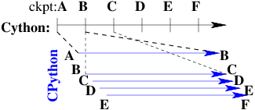
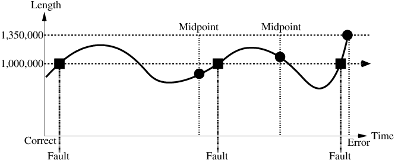
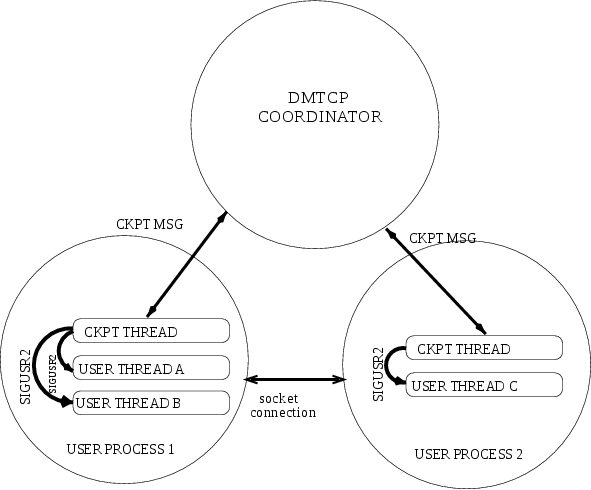

:author: Kapil Arya
:email: kapil@ccs.neu.edu
:institution: Northeastern University

:author: Gene Cooperman
:email: gene@ccs.neu.edu
:institution: Northeastern University

:video: http://www.youtube.com/watch?v=1l_wGZz0JEE

============================================
DMTCP: Bringing Checkpoint-Restart to Python
============================================

.. class:: abstract

DMTCP (Distributed MultiThreaded CheckPointing) is a mature
checkpoint-restart package.  It operates in user-space without kernel
privilege, and adapts to application-specific requirements through plugins.
While DMTCP has been able to checkpoint Python and IPython "from  the
outside" for many years, a Python module has recently been created to
support DMTCP.  IPython support is included through a new DMTCP plugin.
A checkpoint can be requested interactively within a
Python session, or under the control of a specific Python program.
Further, the Python program can execute specific Python code prior
to checkpoint, upon resuming (within the original process), and upon
restarting (from a checkpoint image).  Applications of DMTCP are demonstrated
for: (i) Python-based graphics using VNC; (ii) a Fast/Slow technique
to use multiple hosts or cores to check one Cython computation in parallel;
and (iii) a reversible debugger, FReD, with a novel reverse-expression
watchpoint feature for locating the cause of a bug.

.. class:: keywords

   checkpoint-restart, DMTCP, IPython, Cython, reversible debugger

Introduction
============

DMTCP (Distributed MultiThreaded CheckPointing) [Ansel09]_ is a mature
user-space checkpoint-restart package.  One can
view checkpoint-restart as a generalization of pickling.  Instead of
saving an object to a file, one saves the entire Python session to a
file.  Checkpointing graphics in Python is also supported |---| by
checkpointing a virtual network client (VNC) session with Python running
inside that session.

DMTCP is available as a Linux package for many popular Linux distributions.
DMTCP can checkpoint Python or IPython from the *outside*, i.e. by treating
Python as a black box. To enable checkpointing, the Python interpreter
is launched in the following manner:

.. code-block:: sh

     $ dmtcp_checkpoint python <args>
     $ dmtcp_command --checkpoint

The command ``dmtcp_command`` can be used at any point to create a
checkpoint of the entire session.

However, most Python programmers will prefer to request a checkpoint
interactively within a Python session, or else programmatically from
inside a Python or Cython program.

DMTCP is made accessible to Python programmers as a Python module.  Hence, a
checkpoint is executed as ``import dmtcp; dmtcp.checkpoint()``.  This Python
module provides this and other functions to support the features of DMTCP.
The module for DMTCP functions equally well in IPython.

This DMTCP module implements a generalization of a saveWorkspace function,
which additionally supports graphics and the distributed processes of
IPython.  In addition, three novel uses of DMTCP for helping
debug Python are discussed.

1.  Fast/Slow Computation |---| Cython provides both traditional
    interpreted functions and compiled C functions.  Interpreted
    functions are slow, but correct.  Compiled functions are fast,
    but users sometimes declare incorrect C types, causing the
    compiled function silently return a wrong answer.  The idea
    of fast/slow computation is to run the compiled version on
    one computer node, while creating checkpoint images at regular
    intervals.  Separate computer nodes are used to check each interval
    in interpreted mode between checkpoints.

2.  FReD |---| a Fast Reversible Debugger that works closely with
    the Python pdb debugger, as well as other Python debuggers.

3.  Reverse Expression Watchpoint |---| This is a novel feature
    within the FReD reversible debugger.  Assume a bug occurred in the past.
    It is associated with the point in time when a certain 
    expression changed.  Bring the user back to a pdb session
    at the step before the bug occurred.

The remaining sections describe: the
`DMTCP-Python Integration through a Python Module`_; and several
extensions of the integration of DMTCP with Python.  The extensions
include support for `Checkpointing Python-Based Graphics`_;
`Checking Cython with Multiple CPython Instances`_ (fast/slow technique); and
`Reversible Debugging with FReD`_. More information about DMTCP is added in
`Appendix: Background of DMTCP`_.

DMTCP-Python Integration through a Python Module
================================================

A Python module, ``dmtcp.py``, has been created to support checkpointing
both from within an interactive Python/IPython session and programmatically
from within a Python or Cython program.  
DMTCP has been able to asynchronously generate checkpoints of a Python
session for many years.  However, most users prefer the more fine-grained
control of a Python programmatic interface to DMTCP.  This allows one
to avoid checkpointing in the middle of a communication with an external
server or other atomic transaction.

A Python Module to Support DMTCP
--------------------------------

Some of the features of ``module.py`` are best illustrated through an example.
Here, a checkpoint request is made from within the application.

.. code-block:: python

   ...
   import dmtcp
   ...
   # Request a checkpoint if running under checkpoint
   # control
   dmtcp.checkpoint()
   # Checkpoint image has been created
   ...

It is also easy to add pre- and post-checkpoint processing actions.

.. code-block:: python

   ...
   import dmtcp
   ...
   def my_ckpt(<args>):

       # Pre processing
       my_pre_ckpt_hook(<args>)
       ...
       # Create checkpoint
       dmtcp.checkpoint()
       # Checkpoint image has been created
       ...
       if dmtcp.isResume():
           # The process is resuming from a checkpoint
           my_resume_hook(<args>)
           ...
       else:
           # The process is restarting from a previous
           # checkpoint
           my_restart_hook(<args>)
           ...

       return
   ...

The function :code:`my_ckpt` can be defined in the application by the
user and can be called from within the user application at any point.

Extending the DMTCP Module for Managing Sessions
------------------------------------------------

These core checkpoint-restart services are further extended to
provide the user with the concept of multiple sessions. A checkpointed
Python session is given a unique session id to distinguish it from other
sessions.  When running interactively, the user can view the list of
available checkpointed sessions.  The current session can be replaced by
any of the existing session using the session identifier.

The application can programmatically revert to an earlier session as
shown in the following example:

.. code-block:: python

   ...
   import dmtcp
   ...
   sessionId1 = dmtcp.checkpoint()
   ...
   sessionId2 = dmtcp.checkpoint()
   ...

   ...
   if <condition>:
       dmtcp.restore(sessionId2)
   else:
       dmtcp.restore(sessionId1)

.. Note that only session id is used to restore to a previous session. It
  is also possible to enhance the DMTCP module to pass extra arguments to
  the restore function. Those extra arguments can be made available to the
  :code:`dmtcp.isRestart()` path. The application can thus take a
  different branch now instead of following the same route.

Save-Restore for IPython Sessions
---------------------------------

To checkpoint an IPython session, one must consider the configuration
files. The configuration files are typically stored in user's home
directory. During restart, if the configuration files are missing, the
restarted computation may fail to continue.  Thus, DMTCP must checkpoint
and restore all the files required for proper restoration
of an IPython session.

Attempting to restore all configuration files during restart poses yet
another problem: the existing configuration files might have newer
contents. Overwriting these newer files with copies from the checkpoint time
may result in the loss of important changes.

To avoid overwriting the existing configuration files, the files related
to IPython session are restored in a
temporary directory.  Whenever IPython shell attempts to open a file in
the original configuration directory, the filepath is updated to point to
the temporary directory. Thus, the files in the original configuration
directory are never modified.
Further, the translation from original to temporary path is transparent
to the IPython shell.

Save-Restore for Parallel IPython Sessions
------------------------------------------

DMTCP is capable of checkpointing a distributed computations with
processes running on multiple nodes. It automatically checkpoints and
restores various kinds of inter-process communication mechanisms such as
shared-memory, message queues, pseudo-ttys, pipes and network sockets. 

An IPython session involving a distributed computation running on a
cluster is checkpointed as a single unit. DMTCP allows restarting the
distributed processes in a different configuration than the original.
For example, all the processes can be restarted on a single computer for
debugging purposes.
In another example, the computation may be restarted on a
different cluster altogether.

Checkpointing Python-Based Graphics
===================================

Python is popular for scientific visualizations. It is possible to
checkpoint a Python session with active graphics windows by using VNC.
DMTCP supports checkpoint-restart of VNC server. In this case, a VNC
server can be started automatically. The process environment is modified
to allow the Python interpreter to communicate with the VNC server
instead of the X-window server. For visualization, a VNC client can be
fired automatically to display the graphical window.  During checkpoint,
the VNC server is checkpointed as part of the computation, while the VNC
client is not. During restart, the Python session and the VNC server are
restored from their checkpoint images, and a fresh VNC client is
launched. This VNC client communicates with the restored server and
displays the graphics to the end user.

.. code-block:: python

   ...
   import dmtcp
   ...
   # Start VNC server
   dmtcp.startGraphics()

   ...

   # Start VNC viewer
   dmtcp.showGraphics()

   # generate graphics (will be shown in the VNC viewer)
   ...

To understand the algorithm behind the code, we recall some VNC
concepts. X-window supports multiple virtual screens. A VNC server
creates a new virtual screen. The graphics contained in the VNC server
is independent of any X-window screen. The VNC server process persists
as a daemon. A VNC viewer displays a specified virtual screen in a
window in a console.  When python generates graphics, the graphics is
sent to a virtual screen specified by the environment variable
:code:`$DISPLAY`.

The command :code:`dmtcp.startGraphics()` creates a new X-window screen
by creating a new VNC server and sets the :code:`$DISPLAY` environment
variable to the new virtual screen.  All python graphics are now sent to
this new virtual screen.  The additional screen is invisible to the
python user until the python command :code:`dmtcp.showGraphics()` is
given. The Python Command :code:`dmtcp.showGraphics()` operates by
invoking a VNC viewer.

At the time of checkpoint, the VNC server process is checkpointed along
with the python interpretor while the VNC viewer is not checkpointed.

On restart, the VNC server detects the stale connection to the old VNC
viewers. The VNC server perceives this as the VNC viewer process that
has now died. The DMTCP module then launches anew VNC viewer to connect
to the VNC server.

Checking Cython with Multiple CPython Instances
===============================================

A common problem for compiled versions of Python such as
Cython [Behnel10]_ is how to check
whether the compiled computation is faithful to the interpreted
computation.  Compilation errors can occur if the compiled code
assumes a particular C type, and the computation violates that
assumption for a particular input.  Thus, one has to choose
between speed of computation and a guarantee that that the
compiled computation is faithful to the interpreted computation.

A typical scenario might be a case in which the
compiled Cython version ran for hours and produced an unexpected
answer.  One wishes to also check the answer in a matter of hours,
but pure Python (CPython) would take much longer.

Informally, the solution is known as a *fast/slow* technique.
There is one *fast* process (Cython), whose correctness is checked by multiple
*slow* processes (CPython).
The core idea is to run the compiled code, while creating checkpoint
images at regular intervals.  A compiled computation interval is checked
by copying the two corresponding checkpoints (at the beginning and end of
the interval) to a separate computer node for checking.  The computation
is restarted from the first checkpoint image, on the checking node.
But when the computation is first restarted, the variables for all
user Python functions are set to the interpreted function object.
The interval of computation is then re-executed in interpreted mode
until the end of the computation interval.  The results at the end of
that interval can then be compared to the results at the end of the same
interval in compiled mode.

Figure :ref:`fast-slow` illustrates the above idea.
A similar idea has been used by [Ghoshal11]_ for distributed speculative
parallelization.

   Fast Cython with Slow CPython "checking" nodes. :label:`fast-slow`

Note that in order to compare the results at the end of a
computation interval, it is important that the interpreted version
on the checker node stop exactly at the end of the interval, in order
to compare with the results from the checkpoint at the end of the same
interval.  The simplest way to do this is to add a counter to a
frequently called function of the end-user code.  The counter is incremented
each time the function is called.  When the counter reaches a pre-arranged
multiple (for example, after every million calls), the compiled version
can generate a checkpoint and write to a file the values of variables
indicating the state of the computation.  The interpreted version
writes to a file the values of variables indicating its own state of
the computation.

.. code-block:: python

  mycounter = 0
  def freq_called_user_fnc(<args>):
      global mycounter
      mycounter += 1
      if mycounter % 1000000 == 0:
          # if running as Cython:
          if type(freq_called_user_fnc) == type(range):
              # write curr. program state to cython.log
              dmtcp.checkpoint()
              if dmtcp.isRestart():
                  # On restart from ckpt image,
                  #   switch to pure Python.
          else: # else running as pure Python
              # write curr. program state to purePython.log
              sys.exit(0)
      ...
      # original body of freq_called_user_fnc
      return

The above code block illustrates the principles.  One compares cython.log and
purePython.log to determine if the compiled code was faithful to the
interpreted code.  If the Cython code consists of direct C calls between
functions, then it will also be necessary to modify the functions of
the C code generated by Cython, to force them to call the pure Python
functions on restart after a checkpoint. 

Reversible Debugging with FReD
==============================

While debugging a program, often the programmer over steps and has to
restart the debugging session. For example, while debugging a program,
if the programmer steps over (by issue :code:`next` command inside the
debugger) a function :code:`f()` only to determine
that the bug is in function :code:`f()` itself, he or she is left with no
choice but to restart from the beginning.

*Reversible debugging* is the capability
to run an application "backwards" in time inside a debugger. If the
programmer detects that the problem is in function :code:`f()`, instead
of restarting from the beginning, the programmer  can issue a :code:`reverse-next`
command which takes it to the previous step. He or she  can then issue
a :code:`step` command to step into the function in order to find the
problem.

.. figure:: fred-arch-python.png

   Fast Reversible Debugger. :label:`fred-arch`

FReD (Fast Reversible Debugger) [Arya12]_, [FReD13]_ is a reversible debugger
based on
checkpoint-restart. FReD is implemented as a set of Python scripts and
uses DMTCP to create checkpoints during the
debugging session. FReD also keeps track of the debugging history. Figure
:ref:`fred-arch` shows the architecture of FReD.

A Simple UNDO Command
---------------------

The *UNDO* command reverses the effect of a previous debugger command
such as :code:`next`, :code:`continue` or :code:`finish`.
This is the most basic of reversible debugging commands.

The functionality of the UNDO command for debugging Python is
trivially implemented.  A checkpoint is taken at the beginning of the debugging
session and a list of all debugging commands issued since the
checkpoint are recorded.

To execute the UNDO command, the debugging session is restarted from the
checkpoint image, and the debugging commands are automatically
re-executed from the list excluding the last command.  This takes the
process back to before the debugger command was issued.

In longer debugging sessions, checkpoints are taken at frequent
intervals to reduce the time spent in replaying the debugging history.

More complex reverse commands
-----------------------------

.. figure:: commands.png

   Reverse Commands. :label:`reverse-xxx`

Figure :ref:`reverse-xxx` shows some typical
debugging commands being executed in forward as well as backward
direction in time.

Suppose that the debugging history appears as :code:`[next,next]`
i.e. the user issued two :code:`next` commands. Further, the second next
command stepped over a function :code:`f()`.
Suppose further that FReD takes checkpoints before each of these commands.
In this situation, the implementation for :code:`reverse-next` command is trivial:
one restarts from the
last checkpoint image. However, if the command issued were
:code:`reverse-step`, simply restarting from the previous checkpoint
would not suffice.

In this last case, the
desired behavior is to take the debugger to the last statement of
the function :code:`f()`. In such a situation one needs to decompose the
last command into a series of commands.
At the end of
this decomposition, the last command in the history is a :code:`step`.
At this point, the
history may appear as: :code:`[next,step,next, ...,next,step]`.
The process is then restarted from the last checkpoint and the
debugging history is executed excluding the last :code:`step` command.
Decomposing a command into a series of commands terminating
with :code:`step` is non-trivial, and an algorithm for that decomposition
is presented in [Visan11]_ .

A typical debugging session in FReD with Python
~~~~~~~~~~~~~~~~~~~~~~~~~~~~~~~~~~~~~~~~~~~~~~~

.. code-block:: python

   $ fredapp.py python -mpdb a.py
   (Pdb) break main
   (Pdb) run
   (Pdb) fred-checkpoint
   (Pdb) break 6
   (Pdb) continue
   (Pdb) fred-history
     [break 6, continue]
   (Pdb) fred-reverse-next
   (Pdb) fred-history
     [break 7, next, next, next, next, next, next, next,
      next, next, next, step, next, next, next, where]

Reverse Expression Watchpoints
------------------------------

The *reverse expression watchpoint* automatically finds the location of
the fault for a given expression in the history of the program
execution.  It brings the user directly to a statement (one that is not
a function call) at which the expression is correct, but executing the
statement will cause the expression to become incorrect.

   Reverse Expression Watchpoint. :label:`reverse-watch`

Figure :ref:`reverse-watch` provides a simple example.  Assume that a
bug occurs whenever a linked list has length longer than one million.
So an expression :code:`linked_list.len() <= 1000000` is assumed to be
true throughout.  Assume that it is too expensive to frequently compute
the length of the linked list, since this would require :math:`O(n^2)`
time in what would otherwise be a :math:`O(n)` time algorithm.  (A more
sophisticated example might consider a bug in an otherwise
duplicate-free linked list or an otherwise cycle-free graph.  But the
current example is chosen for ease of illustrating the ideas.)

If the length of the linked list is less than or equal to one million,
we will call the expression "good".  If the length of the linked list is greater
than one million, we will call the expression "bad".  A "bug" is defined as a
transition from "good" to "bad".  There may be more than one such
transition or bug over the process lifetime.  Our goal is simply to find
any one occurrence of the bug.

The core of a reverse expression watchpoint is a binary search.  In
Figure :ref:`reverse-watch`, assume a checkpoint was taken near the
beginning of the time interval.  So, we can revert to any point in the
illustrated time interval by restarting from the checkpoint image and
re-executing the history of debugging commands until the desired point
in time.

Since the expression is "good" at the beginning of Figure
:ref:`reverse-watch` and it is "bad" at the end of that figure, there
must exist a buggy statement |---| a statement exhibiting the transition
from "good" to "bad".  A standard binary search algorithm converges to a
case in which the current statement is "good" and the next statement
transitions from "good" to "bad".  By the earlier definition of a "bug",
FReD has found a statement with a bug.  This represents success.

If implemented naively, this binary search requires that some statements
may need to be re-executed up to :math:`\log_2 N` times.  However, FReD
can also create intermediate checkpoints.  In the worst case, one can
form a checkpoint at each phase of the binary search.  In that case, no
particular sub-interval over the time period needs to be executed more
than twice.

A typical use of reverse-expression-watchpoint
~~~~~~~~~~~~~~~~~~~~~~~~~~~~~~~~~~~~~~~~~~~~~~

.. code-block:: python

   $ ./fredapp.py python -mpdb ./autocount.py
   -> import sys, time
   (Pdb) break 21
     Breakpoint 1 at /home/kapil/fred/autocount.py:21
   (Pdb) continue
     > /home/kapil/fred/autocount.py(21)<module>()
   # Required for fred-reverse-watch
   (Pdb) fred-checkpoint
   (Pdb) break 28
     Breakpoint 2 at /home/kapil/fred/autocount.py:28
   (Pdb) continue
     ...  <program output> ...
     > /home/kapil/fred/autocount.py(28)<module>()
   (Pdb) print num
     10
   (Pdb) fred-reverse-watch num < 5
   (Pdb) print num
     4
   (Pdb) next
   (Pdb) print num
     5

Conclusion
==========

DMTCP is a widely used standalone checkpoint-restart package. We have
shown that it can be closely integrated with Python. Specifically,
parallel sessions with IPython, alternating interpreted and compiled
execution modes, graphics, and enhancing Python debugger with
reversibility. The implementation can be extended by the end users to
augment the capabilities of Python beyond the simple example of
checkpoint-restart.

Acknowledgment
==============

This work was partially supported by the National Science Foundation
under Grant OCI-0960978.

References
==========

.. [Ansel09] Jason Ansel, Kapil Arya, and Gene Cooperman.
           *DMTCP: Transparent Checkpointing for Cluster Computations
           and the Desktop*,
           23rd IEEE International Symposium on Parallel and Distributed
           Processing (IPDPS-09), 1-12, 2009
           http://dmtcp.sourceforge.net/.

.. [Arya12] Kapil Arya, Tyler Denniston, Ana Maria Visan, and Gene
           Cooperman.
           *FReD: Automated Debugging via Binary Search through a
           Process Lifetime*,
           http://arxiv.org/abs/1212.5204.

.. [FReD13] FReD (Fast Reversible Debugger) Software.
            https://github.com/fred-dbg/fred

.. [Behnel10] R. Bradshaw, S. Behnel, D. S. Seljebotn, G. Ewing, et al.
               *Cython: The Best of Both Worlds*,
               Computing in Science Engineering, 2010.

.. [Ghoshal11] Devarshi Ghoshal, Sreesudhan R. Ramkumar, and
               Arun Chauhan.
               *Distributed Speculative Parallelization using Checkpoint
               Restart*,
               Procedia Computer Science, 2011.

.. [Rieker06] Michael Rieker, Jason Ansel, and Gene Cooperman.
           *Transparent User-Level Checkpointing for the Native POSIX
           Thread Library for Linux*,
           Proceeding of PDPTA-06, 492-498, 2006.

.. [Visan11] Ana-Maria Visan, Kapil Arya, Gene Cooperman, and Tyler
           Denniston.
           *URDB: A Universal Reversible Debugger Based on Decomposing
           Debugging Histories*,
           In Proc. of 6th Workshop on Programming Languages and Operating
           Systems (PLOS'2011) (part of Proc. of 23rd ACM SOSP), 2011.

Appendix: Background of DMTCP
=============================

   Architecture of DMTCP. :label:`dmtcp-arch`

DMTCP [Ansel09]_ is a
transparent checkpoint-restart package with its roots going back eight
years [Rieker06]_.  It works completely in user space
and does not require any changes to the application or the operating
system.  DMTCP can be used to checkpoint a variety of user applications
including Python.

Using DMTCP to checkpoint an application is as simple as executing the
following commands:

.. code-block:: sh

   dmtcp_checkpoint ./a.out
   dmtcp_command -c
   ./dmtcp_restart_script.sh

DMTCP automatically tracks all local and remote child processes and
their relationships.

As seen in Figure :ref:`dmtcp-arch`, a computation running under DMTCP
consists of a centralized coordinator process and several user
processes. The user processes may be local or distributed.  User
processes may communicate with each other using sockets, shared-memory,
pseudo-terminals, etc.  Further, each user process has a checkpoint
thread which communicates with the coordinator.

DMTCP Plugins
-------------

.. figure:: plugin-architecture-simple.png

   DMTCP Plugins. :label:`dmtcp-plugins`

DMTCP plugins are used to keep DMTCP modular. There is a separate plugin
for each operating system resource. Examples of plugins are pid plugin,
socket plugin, and file plugin. Plugins are responsible for
checkpointing and restoring the state of their corresponding resources.

The execution environment can change between checkpoint and restart. For
example, the computation might be restarted on a different computer
which has different file mount points, a different network address, etc.
Plugins handle such changes in the execution environment by virtualizing
these aspects. Figure :ref:`dmtcp-plugins` shows the layout of DMTCP
plugins within the application.

DMTCP Coordinator
-----------------
DMTCP uses a stateless centralized process, the DMTCP coordinator, to
synchronize checkpoint and restart between distributed processes.
The user interacts with the  coordinator through the console to initiate
checkpoint, check the status of the computation, kill the computation, etc.
It is also possible to run the coordinator as a daemon process, in which
case, the user may communicate with the coordinator using the command
``dmtcp_command``.

Checkpoint Thread
-----------------
The checkpoint thread waits for a checkpoint request from the DMTCP
coordinator.  On receiving the checkpoint request, the checkpoint thread
quiesces the user threads and creates the checkpoint image. To quiesce
user threads, it installs a signal handler for a dedicated POSIX signal
(by default, SIGUSR2).
Once the checkpoint image has been created, the user threads are allowed
to resume executing application code. Similarly, during restart, once the
process memory has been restored, the user threads can resume executing
application code.

Checkpoint
----------
On receiving the checkpoint request from the coordinator, the checkpoint
thread sends the checkpoint signal to all the user threads of the
process.  This quiesces the user threads by forcing them to block inside
a signal handler, defined by the DMTCP.  The checkpoint image is created
by writing all of user-space memory to a checkpoint image file. Each
process has its own checkpoint image.  Prior to checkpoint, each plugin
will have copied into user-space memory any kernel state associated
with its concerns.  Examples of such concerns include network sockets,
files, and pseudo-terminals.  Once the checkpoint image has been
created, the checkpoint thread "un-quiesces" the user threads and they
resume executing application code.

At the time of checkpoint, all of user-space memory is written to a
checkpoint image file.  The user threads are then allowed to resume
execution.  Note that user-space memory includes all of the run-time
libraries (libc, libpthread, etc.), which are also saved in the
checkpoint image.

In some cases, state outside the kernel must be saved.  For example, in
handling network sockets, data in flight must be saved.  This is done by
draining the network data by sending a *special cookie* through the
"send" end of each socket in one phase.  In a second phase, after a
global barrier, data is read from the "receive" end of each socket until
the special cookie is received. The in-flight data has now been copied
into user-space memory, and so will be included in the checkpoint image.
On restart, the network buffers are *refilled* by sending the in-flight
data back to the peer process, which then sends the data back into the
network.

Restart
-------
As the first step of restart phase, all memory areas of the process are
restored. Next, the user threads are recreated. The plugins then receive
the restart notification and restore their underlying resources,
translation tables, etc.  Finally, the checkpoint thread "un-quiesces" the
user threads and the user threads resume executing application code.

