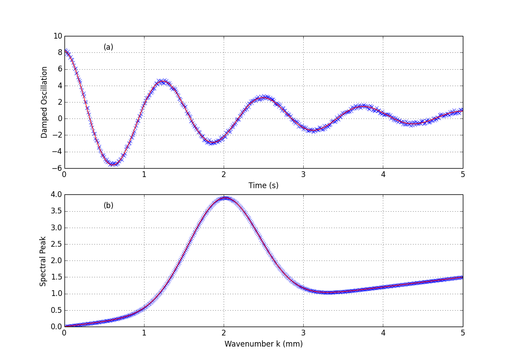

:author: G William Baxter
:email: gwb6@psu.edu
:institution: Physics, School of Science, Penn State Erie - The Behrend College

----------------------------------------------------------------
Scientific Computing with SciPy for Undergraduate Physics Majors
----------------------------------------------------------------

.. class:: abstract

The physics community is working to improve the undergraduate curriculum to include computer skills that graduates will need in the workforce.  At Penn State Erie, The Behrend College, we have added computational tools to our Junior/Senior physics laboratory, PHYS421w Research Methods.  The course emphasizes Python software tools (SciPy) for data analysis rather than traditional programming.  The course uses real experiments to motivate the mastery of these tools.  

.. class:: keywords

   laboratory, computing, software tools, experiment

Introduction
------------

There is a growing debate within the physics community as to what skills a physics graduate with a Bachelor degree must have to be successful in industry or academia [Chonacky2008]_, [Landau2006]_.  The computer has become such a basic tool for data acquisition, process control, and analysis that an undergraduate physics degree should include computer skills.  However, while some undergraduate physics degrees require one or more courses in programming, often C++ programming, many physics degrees require no computer courses at all [Fuller2006]_.  To remedy this, computing could be taught by way of a new course [Kaplan2004]_, [Spencer2005]_, by adding the material to an existing course [Caballero2014]_, [Timberlake2008]_, [Serbanescu2011]_, [Nakroshis2013]_ or both [Taylor2006]_.  Many degree programs are limited by their total number of credits so that adding a computing course would require removing an existing course.  Easier is to add the material to an existing course.  At Penn State Erie, we added the material to our advanced laboratory, PHYS 421w Research Methods [Hanif2009]_.  

In those majors that include computation, the emphasis is often on either simulation or programming numerical techniques.  A strong case can be made that a student would benefit from less traditional programming and more *computing with software tools*, by which we mean analyzing data or solving problems with software which might be created by someone else.  At Penn State Erie, we require a traditional introductory course in C++ programming, but we have added an emphasis on computing with software tools to our advanced laboratory, PHYS 421w Research Methods.  

Research Methods Laboratory
---------------------------

.. table:: Partial list of available experiments for PHYS421w. :label:`experiment`

   =====================================================  =========
   Experiment                                              Type
   =====================================================  =========
   Charge to Mass Ratio of the Electron                     Exp
   Cavendish Measurement of G                               Exp
   Millikan Oil Drop Measurement of e                       Exp
   Harmonic Motion and Torsion Oscillators                  Exp
   Domains and Bubbles in a Magnetic Film                   Exp
   Two-slit Interference, One Photon at a Time              Exp
   Earth's Field Nuclear Magnetic Resonance                 Exp
   Vibrations of a Vertical Chain Fixed at One End          Exp
   Video Microscop of Brownian Motion                       Exp
   Diffusivity in Liquids                                   Exp
   Percolation                                              Sim
   Scaling Properties of Random Walks                       Sim
   Critical Temperature of a Two Dimensional Ising Model    Sim
   =====================================================  =========

PHYS 421w Research Methods is a 3 credit lab in which each student chooses three experiments from classical and modern physics. See Table :ref:`experiment` for a partial list of experiments.  Most are physical experiments, but students are allowed to do a computer simulation for their third experiment.  Note that the data acquisition and analysis can be very different for different experiments.  Some involve adjusting a parameter and making a measurement, others involve extracting measurements from a time series of measurements, and others involve extracting a measurement from a series of images.  

The course's guiding principles are: 

- Experiments should be as close as possible to the way physics is really done including submitting LaTeX papers for peer-reviewed grading.  
- Emphasis is on software tools for analysis and publication rather than on numerical techniques.
- Software tools presented will be needed in the experiments.  However useful they may be, we do not introduce tools which do not apply to any of these experiments.  
- All software will be free and open-source.  

Students are strongly motivated to learn when they believe the material will be useful in their future careers.  Here, the emphasis is on a *realistic* experimental experience.  Students have 4 weeks to setup, perform, analyze, and write up the results of each experiment.  Papers must adhere to the standards for publication in an American Physical Society (APS) Physical Review journal.  Papers are reviewed by a set of anonymous reviewers who comment on each paper.  Authors have the opportunity to rewrite their paper and submit it for a final review.  Papers must be written in LaTeX with the APS RevTeX extensions.  

The course is taken by Junior and Senior level physics majors and some engineering students seeking a minor in physics.  Students entering the course typically have had one or more computer programming classes using C++ taught by the Computer Science Department.  On average, their programming skills are poor.  They have some familiarity with Microsoft Word and Excel.  Excel is a good package for business; but, it has serious limitations for scientific work, despite being used for nearly all introductory science labs at Penn State Erie.  These limitations include: poor handling of uncertainties and error bars, limited fit functions, no Fourier transforms, and no image processing capability.  They are very poorly prepared for the manipulation and analysis of experimental data.  

The course begins with two lectures introducing the Unix/Linux operating system.  It  continues with 4 lectures on LaTeX and BibTeX.  Each lecture is followed by a homework assignment which allows the student to practice the day's topic.  Then a series of lectures on Scientific Python tools follow as shown in Table :ref:`tools`.  Students receive custom documentation [1]_ on each topic with many examples showing the commands and the results as well as homework on each topic for practice.  

.. [1] Materials are available for download from  https://sites.psu.edu/teachingexperimentalphysics/.  

.. table:: Software tool categories. :label:`tools`

   ============================= ============================= ===============
   Software Tools Topic          Included Tools                     Covered?
   ============================= ============================= ===============
   Visualization                 matplotlib                    Always   
   Modeling and Fitting          scipy.optimize.leastsq        Always
   Array Operations              python, numpy                 Always
   Statistics and Uncertainty    numpy.statistics & special    Always
   Special Functions             numpy.special                 As Needed
   Image Processing              numpy, PIL, scipy.ndimage     As Needed
   Frequency Space               numpy.fft                     As Needed
   Differential Equations        scipy.integrate.odeint        Always
   [Monte Carlo Techniques]      python                        As Needed 
   ============================= ============================= ===============

We begin with plotting and *visualization*.  Viewing data is the first step to determining what to do with it.  Students often have little experience with error bars and histograms and no experience with when or how to use logarithmic scales.  This topic also includes reading and writing of data files.  We follow this with a discussion of and exercises on *modeling and fitting*.  Students are given five noisy data sets.  With no additional information on each, they first determine the correct functional form and necessary parameters and initial conditions.  Then they must determine the best-fit parameters with uncertainties on all parameters and plot the fitted curve through the data.  "Guessing" the functional form is difficult for many students, but they are strongly motivated by the fact that they know they will have to use this skill in their upcoming experiments.  Examples of the data sets and fitted curves are shown in figure :ref:`fitting`.  Notice that there is little discussion of the numerical technique.  We are choosing to treat this as a *tool* and save discussions of the details of the numerical technique for a numerical analysis course, an optional course in our major but not a requirement.  

   Examples of two data sets used for fitting practice.  Students are given only a simple data file with no additional information.  They must decide on the appropriate function and the necessary fit parameters.  In **(a)**, :math:`y(t)=8.0e^{-0.5t}\cos{(5.0t)}+0.25` and in **(b)** :math:`y(k)=3.3e^{-2.5(k-2.0)^2} + 0.30k` .  :label:`fitting`

Some may be concerned that focusing on software tools rather than numerical methods may lead students to believe that they never need a deeper understanding of the numerical methods upon which these tools depend.  I believe this risk is small.  Using fitting as an example, we do discuss in a very general way the method of least squares.  As they use the tool, students quickly learn that a poor initial guess often leads to nonsensical results and wonder "why?"   I believe it likely that, having used a tool, students will be *more motivated* to learn the numerical methods on which it depends.  

The *array operations* material is introduced so that students will be able to rescale and manipulate data once it is read from a file.  For example, to collect spectra, we use a grating spectrometer, a light sensor and LABview to get a series of data points (12 per degree) from the m=1 spectral lines on one side of the center line to approximately the same point on the other side.  Using this data, the student must determine the zero angle point, average angles and signals on both sides, and convert to wavelengths.  The *statistics* material is used to introduce students to a serious discussion of uncertainty, error, and distributions.  We discuss and calculate standard deviations both theoretically and for real data.  And we explore non-Gaussian distributions such as the Poisson and binomial distributions which occur in real experiments.  

Other topics are introduced as needed depending on which experiments students have chosen.  *Image processing* is introduced when any students are doing experiments which take data in the form of images (such as the magnetic film, vibrations of a vertical chain, and video microscopy).  The specific goal is the extraction of useful data from images.  Specific material includes image formats and conversion to matrix form, region of interest, background subtraction, thresholding, and filtering to find lines or points. *Special functions* is introduced when experiments will produce data that has a functional form of Bessel, Legendre, or other special functions.  These occur often in optics, electrostatic, and wave problems.  Without knowing how to access these functions in numpy, fitting or modeling the data would not be possible.  *Frequency space* introduces the Fourier transform, FFT, windowing and the power spectrum.  It is particularly useful for analyzing experiments which have either a temporal or spatial periodicity.  The *differential equations* material is introduced so that it can be used in a Junior/Senior classical mechanics class offered the following semester.  

Discussion
----------

We have no formal assessment in place; however, anecdotal evidence is positive.  Returning graduates have specifically cited the ability to fit experimental data as valuable in graduate school.  Faculty have said they value research students who have learned to plot and fit data in this course, and some students have set up our software tool environments on their own computers.  From my perspective as professor, the quality of student figures and analysis in PHYS 421w has dramatically improved.  It remains a challenge to convince some students that they need to know more than Microsoft Excel; but, students are more interested in learning software tools when they see their utility and know they will need to use them.   Ideally, any course following PHYS 421w should reinforce these skills by also requiring students to use these computer tools; however, at Penn State Erie, it has been difficult to get faculty to include computer skills in upper-level courses; at present only classical mechanics uses any computer tools. This course and its software tools materials remain a work in progress.      

Acknowledgements
----------------

I gratefully acknowledge the assistance and feedback of the students of PHYS 421w at Penn State Erie, The Behrend College.  

References
----------
.. [Caballero2014] M. Caballero and S. Pollock, *A model for incorporating computation without changing the course: An example from middle-division classical mechanics*, American Journal of Physics 82 (2014) pp231-237.

.. [Chonacky2008] N. Chonacky and D. Winch, *Integrating computation into the undergraduate curriculum: A vision and guidelines for future developments*, American Journal of Physics, 76(4&5) (2008) pp327-333.

.. [Fuller2006] R. Fuller, *Numerical Computations in US Undergraduate Physics Courses*, Computing in Science and Engineering, September/October 2006, pp16-21.

.. [Hanif2009] M. Hanif, P. H. Sneddon, F. M. Al-Ahmadi, and R. Reid, *The perceptions, views and opinions of university students about physics learning during undergraduate laboratory work*, Eur J. Phys, 30, 2009, pp85-96.

.. [Kaplan2004] D. Kaplan, *Teaching computation to undergraduate scientists*, SIGSCE, Norfolk, VA, March 3-7, 2004.

.. [Landau2006] R. Landau, *Computational Physics: A better model for physics education?*, Computing in Science and Engineering, September/October 2006, pp22-30.

.. [Nakroshis2013] P. Nakroshis, *Introductory Computational Physics Using Python*, unpublished course notes, 2013.

.. [Serbanescu2011] R. Serbanescu, P. Kushner, and S. Stanley, *Putting computation on a par with experiments and theory in the undergraduate physics curriculum*, American Journal of Physics, 79 (2011), pp919-924.

.. [Spencer2005] R. Spencer, *Teaching computational physics as a laboratory sequence*, 73, (2005), pp151-153.

.. [Taylor2006] J. Taylor and B. King, *Using Computational Methods to Reinvigorate an Undergraduate Physics Curriculum*, Computing in Science and Engineering, September/October 2006, pp38-43.

.. [Timberlake2008] T. Timberlake and J. Hasbun, *Computation in classical mechanics*, American Journal of Physics, 76 (2008), pp334-339.

