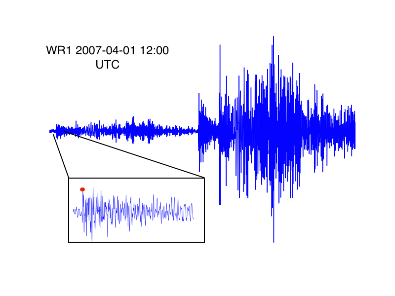
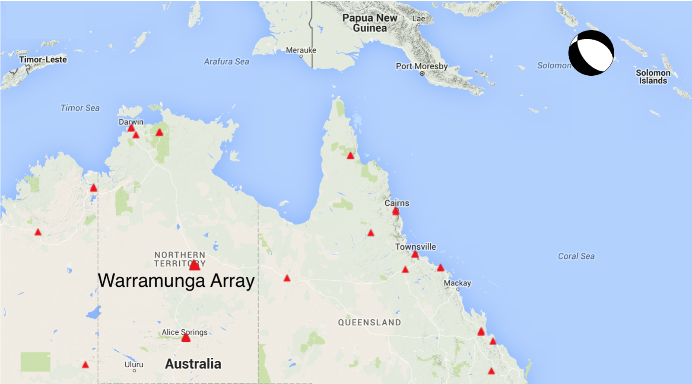
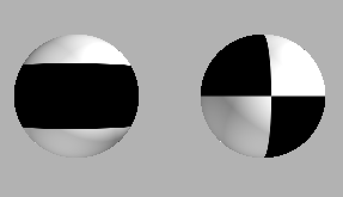
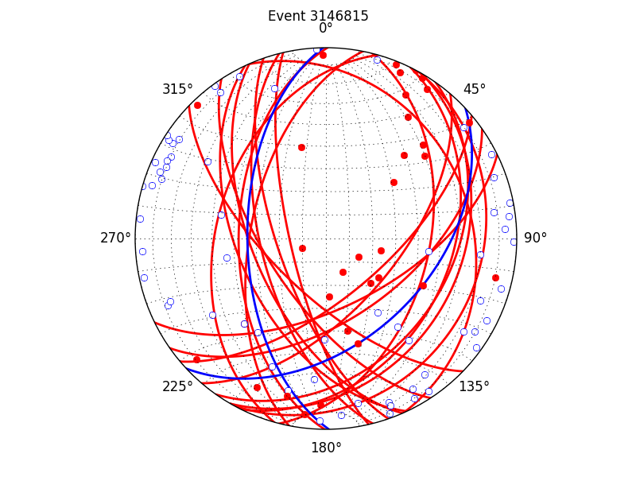
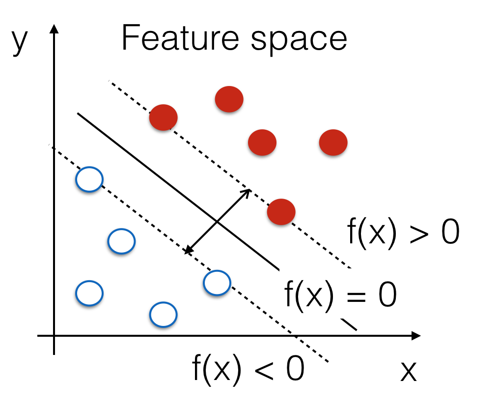
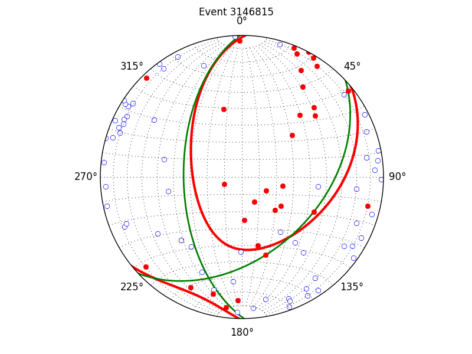
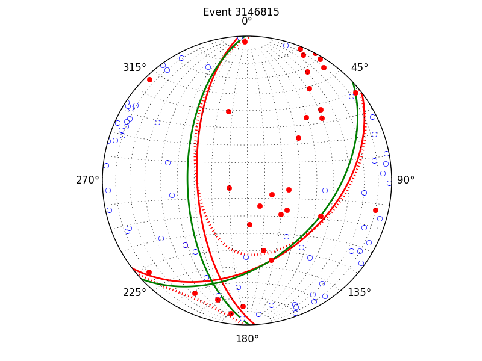
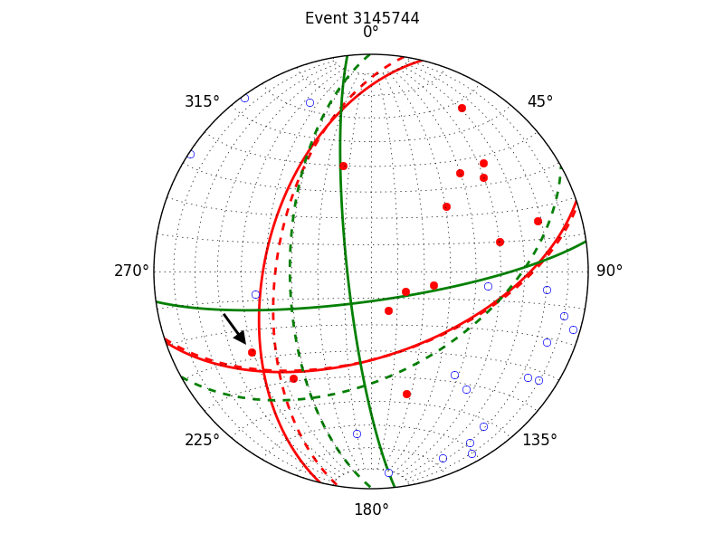
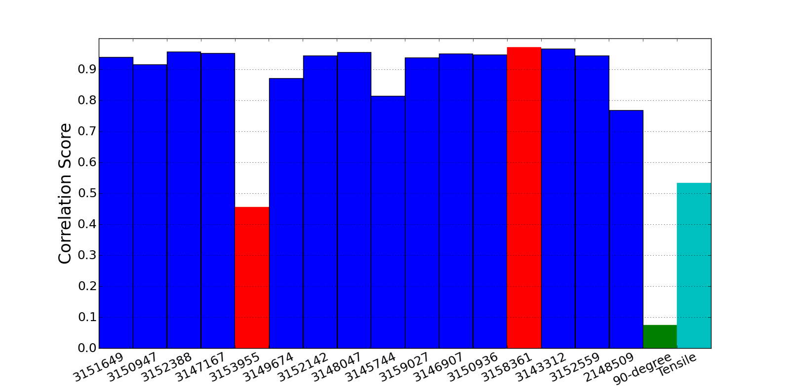
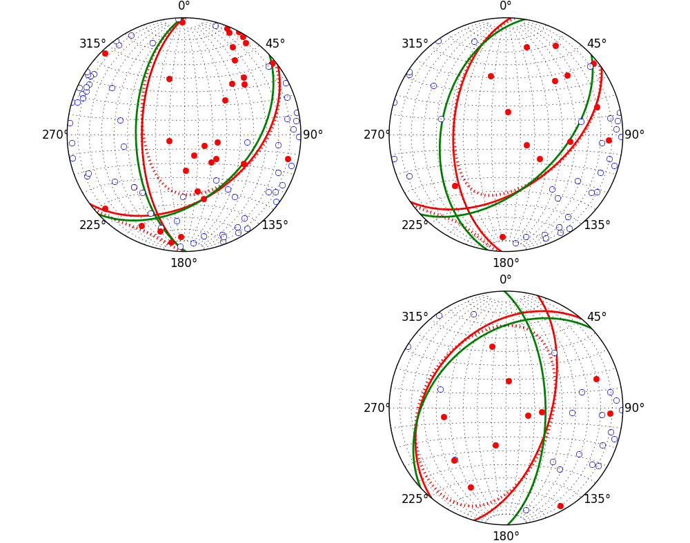

:author: Ben Lasscock
:email: blasscoc@gmail.com
:institution: Geotrace Technologies

-------------------------------------
Generalized earthquake classification
-------------------------------------

.. class:: abstract

	   
   We characterize the source of an earthquake based on identifying
   the nodal lines of the radiation pattern it produces. These
   characteristics are the mode of failure of the rock (shear or
   tensile), the orientation of the fault plane and direction of
   slip. We will also derive a correlation coefficient comparing the
   source mechanisms of different earthquakes.  The problem is
   formulated in terms of a simple binary classification on the
   surface of the sphere. Our design goal was to derive an algorithm
   that would be both robust to misclassification of the observed data
   and suitable for online processing. We will then go on to derive a
   mapping which translates the learned solution for the separating
   hyper-plane back to the physics of the problem, that is, the
   probable source type and orientation. For reproducibility, we will
   demonstrate our algorithm using the example data provided with the
   HASH earthquake classification software, which is available online.

.. class:: keywords

   machine learning, earthquake, hazard, classification.

Introduction
------------

In this paper we are going to explain how to classify earthquake data
using a support vector classifier (SVC) and then how to interpret the
result physically. We will be drawing on the scikit-learn [sklearn]_
project for the SVC, the ObsPy seismological Python package [ObsPy]_ for some
utility routines and mplstereonet [mplstereonet]_, which is a matplotlib [mpl]_
plugin for visualization.

Much of the discussion will center around deriving a mapping from the
solution of the SVC to the physical process that originated the
earthquake. The key concept we will be elaborating on is
understanding the relationship between what we call input and feature
spaces of the SVC. The results of the classification are curves
separating points on the surface of the focal sphere (the input
space), which is the domain of the input data.  However, the physics
and understanding of the result lies in the representation of the
solution in the feature space, which a higher dimensional space
where the classifier may linearly separate the data.

For the sake of reproducibility, the demonstration will use the same
dataset provided with the the US Geological Survey (USGS) HASH
software. HASH [HASH]_ is an earthquake classification code
provided by the USGS and it is built upon an earlier package called
FPFIT, which implements a least squares classifier. For each case we
will be comparing and contrasting our solutions with those generated
by HASH, which we generally expect to be similar.  

Our discussion will include annotated software explaining the important
steps in the computation.  We will be contributing software [#]_ to
reproduce the results of this paper.

.. [#] https://github.com/blasscoc/FocalMechClassifier

	    	   
   A seismogram measured at the WR1 node of the Warramunga seismic array
   showing displacement due to an aftershock of the April 2007 Solomon
   Islands earthquake. The red dot indicates the first break motion.
   The data was obtained by querying the IRIS database 
   http://ds.iris.edu/ds/nodes/dmc/data/types/events/. :label:`seismogram`
   

	    	   
   A portion of the Australian seismic network showing the location
   of the Warramunga seismic array, the map was obtained from
   http://www.fdsn.org/networks/detail/AU/. :label:`WR1.png`

Problem statement
-----------------

Consider a particular example where we would apply the analysis
presented in this paper. In Fig. :ref:`seismogram`, we show a
seismogram (recording) of an earthquake that was located in Solomon
Islands. The black and white glyph is a graphical representation of
the type of focal mechanism. The orientation of the nodal lines of
this glyph displays the orientation of the fault plane.  The
recording shown was made by the WR1 node of the Warramunga seismic
array, which is part of the Australian seismic network, shown
partially in Fig. :ref:`WR1.png`. The goal of hazard monitoring in
this case would be to characterize the deformation of the earth (focal
mechanism) that caused this earthquake. This analysis would involve
first locating the source spatially and then classifying its focal
mechanism, and importantly the orientation of the fault plane. The
orientation of the fault plan is important because displacement of the
sea-floor can cause the formation of tsunamis. The algorithm discussed in 
this paper provides the analysis of the focal mechanism, with the 
extension that we can also compare the spectrum of the solution with a 
past events located in this area. This additional information may be 
useful for decision making regarding what action should be taken given 
the risk of a historical (or perhaps modeled) scenario repeating.

We proceed by detailing exactly the parameters of the problem at hand.
The raw data are recordings of the initial arrival of energy from this
earthquake, measured across a seismic network. From each recording,
the initial displacement (or first motion) is identified (or picked),
as shown by a red dot in Fig. :ref:`WR1.png`.  Consider this is as a
radiation amplitude from the earthquake measured at a particular
location. Further measurements across the seismic network begin to
inform the shape of the radiation pattern created by the
event. However, a radiation pattern measured far from the event
becomes distorted because of the refraction of the seismic wave as it
propagates through the earth.  To remove this distortion, this energy
must migrated, along an estimated ray path, back to the neighborhood of
the estimated source location . We call this neighborhood the focal
sphere. The process of picking, locating and migrating seismic events
is beyond the scope of this paper. However, seismograms can be
requested from the IRIS database [#]_ and a suite of Python tools for
processing this data is made available by the ObsPy [ObsPy]_ Python
project.

.. [#] http://www.iris.edu

The input data to our analysis is the polarity (signed amplitude) of
the picks, and the azimuth and co-latitude of the observation migrated
onto the focal sphere.The design goal is to provide an online tool for
characterizing the source mechanism. The emphasis is on robustness of
the algorithm, without the need for post facto processing of the
data. We also need a system that provides natural metrics of
similarity between seismic events.

Physically, the initial arrival of energy will be in the form of a
compressional wave. The amplitude of these compressional waves are
solutions to the scalar wave equation, which are the spherical
harmonic functions [#]_. Hence any function that classifies the
polarity data should be a superposition of these spherical
harmonics. We will learn this classifying function using the
SVC. However, it is the spectral representation (harmonic content) of
the radiation pattern that contains the physical meaning of the solution.

.. [#] http://docs.scipy.org/doc/scipy/reference/generated/scipy.special.sph_harm.html

In Sec. Theory_ we will review the basic results we need from the
theory of seismic sources. In Sec. `Existing Least Squares Methods`_
we will review existing methods for classifying earthquake data.
The Sec. `Earthquake - Learning with Kernels`_ reviews the Python code
used in the classification, and derives a mapping between the input
space of the problem, to the feature space (represented by the
spectrum). In Sec. `Physical Interpretation`_ we translate this
spectral representation back to the physics of the problem, and explain
how to evaluate the correlation metric. In Sec. `Discussion`_ we provide
an example of the analysis and then we wrap things up with Sec. 
`Conclusions`_.
       
Theory
------

.. raw:: latex
 
   \begin{table}
   \begin{tabular} {ccc}
   Source & (Fault normal/slip) & Template \cr
   \hline
   Shear &
   (31) + (13) & $-i(Y_{12} + Y_{-12})$\cr
	Tensile & 
	(3) & $\alpha Y_{00} + 4\sqrt{5} Y_{02}$\cr
   Tangential & 
   (3) & $Y_{02} - \frac{i}{2}(Y_{22} + Y_{-22})$\ .
   \end{tabular}

   \caption{Describes the angular variation of the displacement due to
   three types of earthquake sources in terms of a basis of spherical
   harmonic functions.  The source templates summarized are shear,
   tensile and tangential dislocation.  The brackets $(\cdot,\cdot)$
   define the template direction of the fault normal and the direction of
   slip in rectangular coordinates.  The constant $\alpha = 2 +
   3\frac{\lambda}{\mu}$, where $\lambda$ and $\mu$ are the first Lamé
   parameter and the shear modulus respectively.}
   
   \end{table}

The observed displacement created by the collective motion of
particles along a fault plane is described by the theory of seismic
sources. We will not go into all the details here, but the reference
on seismic source theory we follow is Ben-Menahem and Singh
[Ben81]_. The key result we will draw upon is a formula for the
displacement for various types of seismic sources summarized in Table
4.4 of [Ben81]_, which is presented in terms of Hansen vectors.
Physically, a shear type failure would represent the slip of rock
along the fault plane and a tensile failure would represent cracking of
the rock. The results of [Ben81]_ are general, however we are only
modeling the angular variation of the displacement due to the
compressional wave measured radially to the focal sphere. From this
simplification we can translate solutions of [Ben81]_ into solutions
for just the angular variation using the basis of spherical harmonic
functions, which we tabulate in Table 1. Notes on translating between
[Ben81]_ and Table 1 are summarized in the `Appendix`_. This
result gives us an analytical expression for the spectral content of
seismic sources given a certain orientation of the fault plane. We
will use this information to find general solutions in Sec. 
`Physical Interpretation`_.

The amplitude of the radiation pattern cannot typically be migrated
back to the location of the event unless an accurate model of seismic
attenuation is available, which is not generally the case, even in
commercial applications. However, supposing the source type and
orientation were known, then the sign of this radiation pattern is a
function that must classify the polarity data on the focal sphere. As
an example, in Fig. :ref:`beachballs` we render in, 3-dimensions, the
signed radiation pattern predicted for shear and tensile source, in a
particular orientation.

	    	   
   Rendered in 3-dimensions, (left) the signed radiation pattern for
   a possible tensile type source. (right) Similarly for the case of
   shear type source. Figures are generated using SciPy's spherical 
   harmonic functions and Mayavi. :label:`beachballs`

The black areas of this beachball diagram represents the region where
the displacement at the source is radially outward (vice versa for the
white regions). The nodal lines represent the separating margin
between classes of data (outward and inward displacement). For the
shear source, the nodal lines are called the fault and auxiliary planes
respectively.

One observation we can immediately take away from Fig
:ref:`beachballs` is that two diagrams are topologically
different. The nodal lines of the shear source are great circles,
which is not the case from the tensile source. That means there is no
rotation or smooth deformation that can make one look like the other.
This suggests that the two source are distinguishable, but also
that there is some potential of identifying admixtures of the two
based on their spectral content. 

Existing Least Squares Methods
------------------------------

	 
   For event 3146815 from north1 dataset (blue) preferred nodal line estimated
   by HASH, (red) a sample from the set of acceptable estimates. :label:`yarn`

Currently, a common method (called FPFIT [FPFIT]_) for earthquake
classification is to assume that shear failure is the source
mechanism, and then, through a least squares optimization, find the
fault plane orientation that minimizes the rate of misclassification
to the data. A modern code built upon FPFIT is the HASH algorithm
[HASH]_. The HASH software is available for download from the USGS
[#]_ website. The HASH software comes with an example "NorthRidge"
dataset which we will use to demonstrate our method. We compare the
results of our algorithm with the results of HASH, which is the
current state of the art. HashPy [HashPy]_ is a Python project for
that provides a wrapper for HASH.

.. [#] http://earthquake.usgs.gov/research/software/index.php

Figure :ref:`yarn` demonstrates how the FPFIT algorithm works.  The
coordinate system in the figure is a stereonet projection [mplstereonet]_ of the
lower half space of a sphere. The solid red (open blue) dots are
positive (negative) polarity measured across a seismic network for the
3146815 event, which was taken from the Northridge dataset
"north1.phase" supplied with the HASH software. Recall, FPFIT is a
least squares method, however the function it is optimizing need not
be convex. As such, there are many solutions that have a
similar goodness of fit.  Using a grid search method, FPFIT draws a
ensemble of these possible solutions (red lines). The blue line is the
preferred or most likely solution.

Earthquake - Learning with Kernels
----------------------------------
:label:`kernels`
   

	    	   
   A schematic of the optimization strategy of the SVC.
   The dashed lines represent the edges of the separating margin. The blue open and
   red closed dots are the polarity data represented in a feature space.
   The dashed lines represent a separating margin between the two classes, the solid
   line represents the optimal separating hyper-plane. :label:`svc`

In this section we discuss the classification algorithm we develop
using the scikit-learn [sklearn]_ library. Whilst our interest was
classification of earthquakes, the algorithm is applicable for any
classification problem defined on a sphere.

Define the input space of the problem as the surface of the focal
sphere, represented for example by the stereonet in
Fig. :ref:`yarn`. The data is not linearly separable on this
space. The strategy of the SVC is to project the problem into a higher
dimensional feature space. And in this feature space, determine the
best hyper-plane to separate the two classes of data by maximizing the
width of the separating margin, subject to the constraint that the
classes are either side of the separating margin, Fig. :ref:`svc`
shows a schematic of the algorithm. An important feature of the SVC is
that it is robust to misclassification close to the descision
boundary.  Physically these are curves where the amplitude of the
radiation is becoming small and then changing sign. What we believe to
be more important than the overall rate of misclassification of the
algorithm, is the stability of the result given erroneous input data.

.. code-block:: python

   from sklearn import svm

   def classify(cartesian_coords, polarity,
                                kernel_degree=2):
       """
       cartesian_coords - x, y, z coordinates on
       sphere polarity (1,-1) first break polarity
       kernel_degree - truncates the dimension of
       expansion.
       """

       # C : slack variable, use the default of 1.0
       poly_svc = svm.SVC(kernel='poly',
            degree=kernel_degree,
            coef0=1, C=1.0).fit(cartesian_coords,
	                        polarity)
				
       intercept = poly_svc.intercept_
       # Angle [0,pi] - the colatitude
       colat = arccos(poly_svc.support_vectors_[:,2])
       # Angle [0,2*pi] measured as azimuth
       azim = arctan2(poly_svc.support_vectors_[:,1],
		      poly_svc.support_vectors_[:,0])
       # The lagrange multipliers * class,
       # classes are labeled -1 or 1.
       dual_coeff = poly_svc.dual_coef_[0,:]
       # Remember which points where mis-classified 
       in_sample = poly_svc.predict(c_[inputs])

       return (dual_coeff, azim, colat,
		    intercept, in_sample)

A Python implementation of the support vector classifier [#]_ is included 
in scikit-learn. The projection to a higher dimensional space is done 
using a kernel, and evaluated in the input space using the kernel trick.
For classification on a sphere, we need to use an inner product kernel, 
which has the form

.. [#] http://scikit-learn.org/stable/modules/generated/sklearn.svm.SVC.html

.. math::
   :type: equation

   k(\vec{x},\vec{x}_{i}) = (\langle \vec{x}, \vec{x}_{i} \rangle + 1)^{d}\ .
	 
Here "d" is the degree of the kernel. The parameter "C" in the above code
snippet is a slack variable. This provides a soft thresholding, which 
allows for some misclassification; the default value is usually
sufficient.
   
.. raw:: latex

   Given a set of data $y_{i}$, the support vector machine learns a
   corresponding set of coefficients $\alpha_{i}$ and intercept
   $\beta_{0}$, which determines a classifying function in the input
   space, \begin{equation} f(\vec{x}) = \sum_{i=1}^{N}
   \alpha_{i}y_{i}k(\vec{x},\vec{x}_{i}) + \beta_{0}\ .
   \end{equation} In our application, the zero of this function is the
   nodal line, and the sign of the function is a prediction for
   the direction of the displacement radial to the focal sphere, given
   the observed data.  Not all of the data is relevant for determining
   the best separating margin, many of the coefficients $\alpha_{i}$
   may be zero. The support vectors are the locations of the data where
   $\alpha_{i}$ are non-zero. The product $\alpha_{i}y_{i}$ associated
   with each of the support vectors are called the dual coefficients
   (see the code snippet).
	 

   For event 3146815 from the NorthRidge dataset. The green nodal line is 
   estimated by HASH and the red nodal line is estimated by the SVC. 
   :label:`class-example`

In Fig. :ref:`class-example` we demonstrate the SVC classifier applied
to an event from the Northridge dataset. The red line represents zeros
of the classifying function f(x), the green line is the solution for the fault
(and auxiliary) planes determined by HASH. Note that the auxiliary
plane is computed using the aux_plane function provided by the ObsPy
library [ObsPy]_. The learned nodal line is simply connected, the zeros of the
classifying function f(x) have been determined using matplotlib's contour
function.

Both the HASH solution and the learned solution have a similar rate of
misclassification.  However the learned solution is still
unsatisfactory to us because we cannot make physical sense of the
result. What we want is an explanation of the type of source mechanism
and its orientation.  To be physically meaningful, we need an
expression for the nodal lines in terms of its spectrum in the basis of
spherical harmonic functions. In this basis we can then use the seismic
source theory of [Ben81]_ to relate the result to a physical process.
What we want is to determine the spectral content of f(x), 

.. math::
   :type: equation

   f(\vec{x}) = \sum_{l=1}^{\infty}\sum_{m=-l}^{l} \hat{f}_{lm}Y_{lm}(\theta,\psi)

that is, we want to derive its representation in the feature space.
The steps in deriving this representation are to first expand the inner
product kernel in terms of the Legendre polynomials [Scholkopf]_,

.. raw:: latex

   \begin{equation}
   a_{l} = \int_{-1}^{1}\ dx\ (x + 1)^{d} P_{l}(x)
   \end{equation}
   
   \begin{align*}
   a_{l} &=
   \begin{cases}
   \frac{2^{d+1}\Gamma(d+1)}{\Gamma(d+2+l)\Gamma(d+1-l)} + \frac{1}{2}\sqrt{\frac{1}{\pi}}\beta_{0}\delta_{l0}  & \text{if } l \leq d \\
   0       & \text{otherwise}
   \end{cases}\ .
   \end{align*}

When we do this, we see that the degree parameter provides a natural truncation on the complexity of the
function we are learning. This gives us an intermediate result which expresses the separating margin
in terms of Legendre polynomials

.. math::
   :type: equation

   f(\vec{x}) = \sum_{i=1}^{N}\alpha_{i}y_{i}\sum_{l=1}^{\infty}a_{l}P_{l}(\langle \vec{x}, \vec{x}_{i} \rangle)\ .
	 

The next step is to apply the addition theorem to express this in terms of the spherical harmonics,

.. math::
   :type: equation

    P_{l}(\langle\vec{x},\vec{x}_{i}\rangle) = \sum_{m=-l}^{l} Y^{*}_{lm}(\theta^{\prime},\psi^{\prime})\
                              Y_{lm}(\theta,\psi)\ .

The result is a formula for the spectral content of the focal mechanism given the dual coefficients
estimated by the support vector classifier,

.. math::
   :type: equation
	  
	  \hat{f}_{lm} = \frac{4\pi}{2l + 1}\sum_{i=1}^{N}\alpha_{i} y_{i} a_{l} \
	                         Y^{*}_{lm}(\theta^{\prime},\psi^{\prime})\ .

Finally, suppose we have solutions for the classification from two different
sources, either observed or modeled from Table 1. A natural metric for
comparing the two sources is a correlation coefficient,

.. math::
   :label: correl
   :type: equation
	  
   \rho = \frac{\Vert \langle g, f\rangle \Vert}{\Vert g\Vert\Vert f \Vert}\ .

Using the orthogonality condition of the spherical harmonic functions,
we can show that inner product is,

.. math::
   :type: eqnarray
   
   \langle g, f\rangle &=& \int d^{3}x\ g^{*}(\vec{x}) \  f(\vec{x}) \cr
                       &=& \sum_{l=0}^{\infty}\sum_{m,n} \hat{g}^{*}_{ln}\hat{f}_{lm}\ ,

here the integral is over the surface of the focal sphere and the
star-notation means complex conjugation.

In the context of hazard monitoring, we could use the as a metric of
risk, without having to propose a source mechanism or fault plane
orientation.

Physical Interpretation
-----------------------

In the previous section we derived the general earthquake
classification algorithm and a metric of correlation. Now suppose we
were to assume a model for the source mechanism (e.g shear failure),
how would we estimate the most likely orientation of the fault plane
in this model?

First of all, in Table 1, we have a template for the spectral content
of the shear source given a particular orientation.  Using this
template we compute a function g(x), and then generate a rotation in
the input space to realign it with the classifying function f(x).  This
rotation would be estimated by optimizing a correlation coefficient
with respect to the Euler angles,

.. math::
   :type: eqnarray
   
   \langle g, f\rangle &=& \arg\max_{\alpha, \beta, \gamma}\
   \int d^{3}x\ g^{*}(R(\alpha, \beta, \gamma)\vec{x}) \  f(\vec{x})\  \cr   

Here, R represents a rotation matrix.  This would be a relatively
complicated procedure in the input space because we would need to
re-evaluate the function g(x) at each iteration of the
optimization. It is far more efficient to instead generate rotations
in the feature space. To do this we borrow from quantum theory, and
present Wigner's D-matrices,

.. math::
   :type: eqnarray

   g(R(\alpha, \beta, \gamma)\vec{x}) &=& \sum_{l=0}^{\infty}\sum_{m,n}\
                                     D^{l}_{mn}(\alpha, \beta, \gamma) \hat{g}_{ln}Y_{lm}(\theta,\psi)\ .

Wigner's D-matrices are operators which generate rotations in the
feature space of the problem. This means that we can translate a
template solution (Table 1.) in a particular orientation, to a
solution in any arbitrary orientation, by acting on its spectral
content.
   
.. code-block:: python
		
   from scipy.optimize import minimize
       
   def _corr_shear(x, alm):
       strike, dip, rake = x
       # Wigner is ZYZ Euler rotation, \gamma = -rake
       D = WignerD2(strike, dip, -rake).conjugate()
       # Template (13)/(31) : glm = (0, -1j, 0, -1j, 0)
       prop = (inner(D[:,3], alm) +
                      inner(D[:,1], alm))*1j
       # Maximize, not minimize.
       return -norm(prop)
       
   def corr_shear(Alm):
       # pick a good starting point.
       x0 = _scan_shear(alm)
       f = lambda x : _corr_shear(x,alm)
       results = minimize(f, x0=x0,
                bounds=((0,2*pi), (0,pi), (0,2*pi)))
       return rad2deg(results.x), results.fun

The function corr_shear shown in the code snippet implements the
optimization of the above equation. The function WignerD2 implements
the Wigner-D matrices defined in [Morrison]_, the variable "prop" is
the projection of the learned solution onto the rotated template shear
solution shown in Table 1, and Alm is the learned spectral
content of the source.  The initial guess is found scanning a coarse
grid to find the best the quadrant with the highest initial
correlation. This stops SciPy's default minimization [scipy]_
getting stuck in a local minima.

   For event 314681 from NorthRidge dataset. The green nodal line 
   estimated by HASH and the solid red line is the optimal solution for 
   the nodal lines derived from the SVC assuming a shear source. The 
   dashed red line is the nodal line estimated by the SVC. 
   :label:`class-dc`

As an example, in Fig. :ref:`class-dc` we show the classification results 
for the 3146815 event. The (dashed red) line shows the nodal line of the 
classifier function. The (solid red) line is the template shear solution, 
orientated by optimizing the correlation function, and the (solid green) 
line shows the preferred 
solution estimated by HASH.  

Discussion
-----------

In Figures :ref:`class-example` and :ref:`class-dc` we have shown examples of the classification
and fault plane estimation methods. In this section we want to explore the robustness of the
algorithm and try to gain some insight into the utility of the correlation functions.

	    
   For event 3145744 from the NorthRidge dataset. The color scheme for 
   each subplot as in Fig. :ref:`class-dc`, the dashed lines are solutions
   without the station reversal being applied. The black arrow points to
   datum for which the polarity is flipped. :label:`flipped`

The HASH program has an input (scsn.reverse) which identifies stations
whose polarity was found to be erroneous in the past. These reversals
are applied post facto to correct the input polarity data.  We will
use this feature to demonstrate an example where the support vector
and least squares classifiers behave differently. In Fig
:ref:`flipped` we give an example where we flipped the polarity of a
single datum (indicated by the black arrow). The corresponding
solutions are shown with (solid lines) and without (dashed lines) the
benefit of the polarity correction. The datum that was changed is
close to the nodal line estimated by the SVC, which, given the soft
thresholding, is forgiving of misclassification along its separating
margin. The SVC solution for the nodal line is largely unchanged. On
the other hand, the strategy of FPFIT is to minimize the overall rate
of misclassification. And indeed, in each case, it finds the optimal
solution on this basis. In fact, in terms of misclassified point,
FPFIT outperforms the SVC classifier. But we would question whether
minimizing the overall rate of misclassification is reasonable from an
applied perspective.  Consider that since the nodal line represents a
point where the radiation pattern is changing sign, we expect that the
signal to noise level will be smaller in this region.  Conversely,
from the point of view of the SVC, these are also the points that are
most informative to the proper location of its separating
margin. Indeed, many of the best quality picks far from the nodal
lines will not influence the solution for the separating plane (recall
dual coefficients can be zero). And it is reasonable that data of the
correct class located far from the separating margin should not
influence the solution. Looking at the problem from this perspective
the solution of the SVC is more reasonable.

   The correlation score for each event in the Northridge dataset, comparing
   to event 3146815. (red) The events with maximum and minimum correlation score.
   (green) The correlation between 3146815 and itself rotated by 90-degrees strike,
   (cyan) the correlation between 3146815 and the tensile source found in
   Table 1. :label:`corr`

Finally, we derived a metric of similarity based on a correlation
score Eq. :ref:`correl`.  To provide an example of how we might use
this correlation score, we take the event 3146815, which has the
largest number of data associate with it, and compute the correlation
coefficient with each of the other events in the Northridge
dataset. According to [HASH]_, the NorthRidge dataset we 
analyzed is expected to contain similar source mechanisms and
certainly we see that the correlation score is high for the majority
of the events. To test the sensitivity of the metric, we also compute
the correlation between event 3146815 and itself rotated by 90-degrees
strike, and we see that this has low correlation, which we would
expect.
   

   The color scheme for each subplot as in Fig. :ref:`class-dc`.
   (top left) The solution for event 3146815, (top right) the solution for
   events 3158361 and (bottom right) 3153955. Events 3158361 and 3153955
   represent the maximum and minimum correlation score
   with event 3146815. :label:`highlo`
	    
In Fig. :ref:`highlo` we provide a visualization of the events with the
highest (top right) and lowest (bottom right) correlation score
comparing with event 3146815 (top left).  The orientation of the nodal
lines for event 3153955, which has the lowest correlation score,
indeed is qualitatively different than the solution for
event 3146815. Qualitatively, we have demonstrated that the
correlation score is a reasonable metric of similarity. Determining
the actual statistical significance of the correlation score is left
as future work.

   
Conclusions
-----------

We have presented a tool for classifying and comparing earthquake
source mechanisms using tools from the scientific Python ecosystem. The 
important steps were to define the problem in terms of classification, 
which is solved robustly by the scikit-learn [sklearn]_ support vector 
classifier. We then used results
from seismic source theory [Ben81]_ to derive a mapping between the
input and feature spaces of the classification problem. Using the
representation of the solution in the feature space, we derived a
correlation coefficient.

This allowed us to generalize the earthquake classification to support
both shear and tensile sources. As a particular example, we showed how
maximizing correlation with the template shear solution could be used
to estimate fault plane orientation. The key to efficiency here was to 
generate rotations in the feature space of the problem using Wigner's D
matrices.

At each step along the way, we made a comparison with similar solutions
obtained with the HASH algorithm [HASH]_, and found good general
agreement. However, we argued that for this application, the
optimization strategy of the SVC should prove more robust to
misclassification than the least squares method.

Finally, we showed qualitatively, that the correlation coefficient
provided a good metric for comparison between sources within the
Northridge dataset.  This technique has some promise as a tool for
earthquake monitoring.

Appendix 
--------
:label:`App`

The template solutions shown in Table 1 were derived from solutions
tabulated in Table 4.4 of [Ben81]_.  Here, [Ben81]_ gives the
solutions for the first P-wave arrival in terms of the
Hansen vector L (in spherical polar coordinates) of the form,

.. math:: 
   :type: equation
	
   \vec{L}_{lm}(r,\theta,\phi) = \vec{\nabla} h^{2}_{l}(r) \tilde{Y}_{lm}(\theta,\phi) \ ,
   
where \"h\" is the spherical Hankel functions of a second kind. The
amplitudes of the first break are required to be measured radially to
the focal sphere, the projection of the Hansen vector radially is,

.. math:: 
   :type: equation

   \hat{r}\cdot \vec{L}_{lm}(r,\theta,\phi) = \frac{\partial}{\partial r} h^{2}_{l}(r) \tilde{Y}_{lm}(\theta,\phi) \ .
   
The angular variation is given by the spherical harmonic function,
up to an overall phase associated with radial
component. Asymptotically (measurements are made far from the source),
in this limit the Hankel functions tend to [Morse53]_,

.. math:: 
   :type: equation
	 
   h_{l}^{2}(x) = \frac{1}{x}(i)^{l+1}{\exp}^{-ix}\ ,

which introduces a relative phase when collecting terms of different
degree.  We also note that the normalization of the spherical harmonics
used in [Ben81]_ does not include the Cordon Shortley phase
convention. Since we are using Wigner-D matrices to generate
rotations, it is convenient to use that convention,

.. math:: 
   :type: equation

   \tilde{Y}_{lm}(\theta,\phi) = (-1)^{m}\sqrt{\frac{4\pi(l+m)!}{(2l+1)(l-m)!}} Y_{lm}(\theta,\phi)\ .

The reference implementation [#]_ includes its own sph_harm function
to add this phase factor.  With these adjustments, the amplitudes (up
to an overall constant) for a common set of source mechanism, in terms
of the spherical harmonics, are given in Table 1.

.. [#] https://github.com/blasscoc/FocalMechClassifier

References
----------
.. [Ben81] A. Ben-Menahem and S. J. Singh *Seismic Waves and Sources*
	   Springer-Verlag New York Inc., 1981

.. [Aki02] K. Aki and P. G. Richards *Quantitative Seismology, second ed.*
	   University Science Books, 2002

.. [Morse53] M. Morse and F. Feshbach, Methods of theoretical physics
	     Feschbach Publishing LLC, 1953

.. [HASH] J. L. Hardeback and P. M. Shearer,
	  A New Method for Determining First-Motion Focal Mechanisms,
	  Bulletin of the Seismological Socity of America, Vol. 92, pp 2264-2276, 2002
	  
.. [FPFIT] Reasenberg, P., and D. Oppenheimer (1985).
	   FPFIT, FPPLOT, and FPPAGE: FORTRAN computer programs for calculating and displaying earthquake
	   faultplane solutions, U.S. Geol. Surv. Open-File Rept. 85-739, 109 Pp.

.. [Morrison] M. A. Morrison and G. A. Parker, 
    Australian Journal of Physics 40, 465 (1987).
   
.. [Scholkopf] B. Scholkopf and A. Smola, 
    Learning with Kernels, The MIT Press, 2002

.. [sklearn] Fabian Pedregosa, Gaël Varoquaux, Alexandre Gramfort, Vincent Michel, Bertrand Thirion, Olivier Grisel, Mathieu Blondel, Peter Prettenhofer, Ron Weiss, Vincent Dubourg, Jake Vanderplas, Alexandre Passos, David Cournapeau, Matthieu Brucher, Matthieu Perrot, Édouard Duchesnay. Scikit-learn: Machine Learning in Python, Journal of Machine Learning Research, 12, 2825-2830 (2011)

	     
.. [scipy] Stéfan van der Walt, S. Chris Colbert and Gaël Varoquaux. The NumPy Array: A Structure for Efficient Numerical Computation, Computing in Science & Engineering, 13, 22-30 (2011), DOI:10.1109/MCSE.2011.37 (publisher link)

.. [mpl] John D. Hunter. Matplotlib: A 2D Graphics Environment, Computing in Science & Engineering, 9, 90-95 (2007), DOI:10.1109/MCSE.2007.55

.. [ObsPy] M. Beyreuther, R. Barsch, L. Krischer, T. Megies, Y. Behr and J. Wassermann (2010),
	   ObsPy: A Python Toolbox for Seismology,
	   SRL, 81(3), 530-533,
	   DOI: 10.1785/gssrl.81.3.530

.. [HashPy] hashpy,
      https://github.com/markcwill/hashpy,
      DOI:10.5281/zenodo.9808

.. [mplstereonet] mplstereonet,
		  https://pypi.python.org/pypi/mplstereonet
