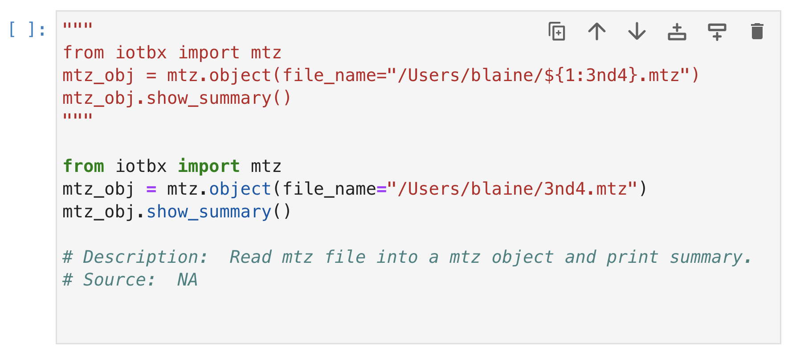
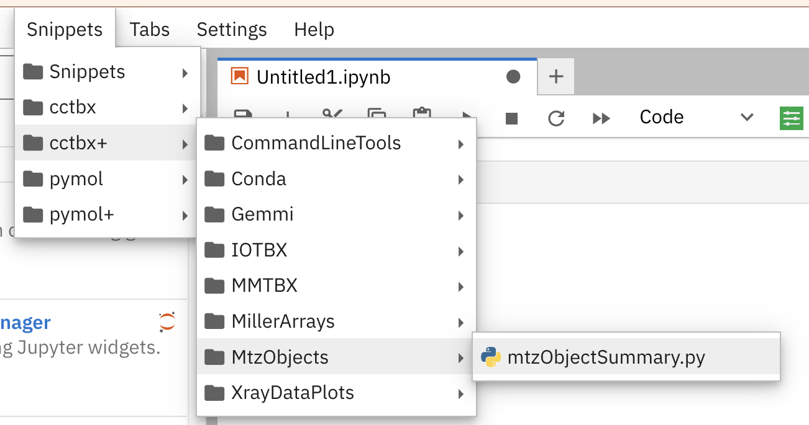
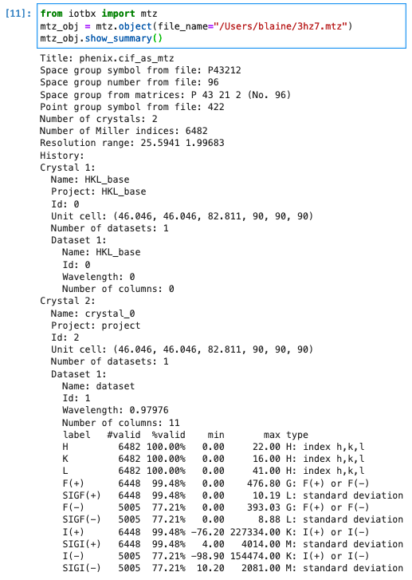
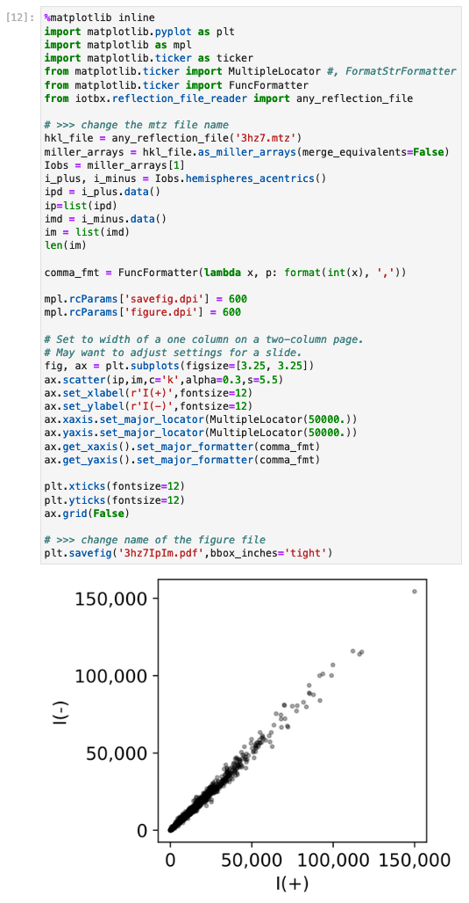
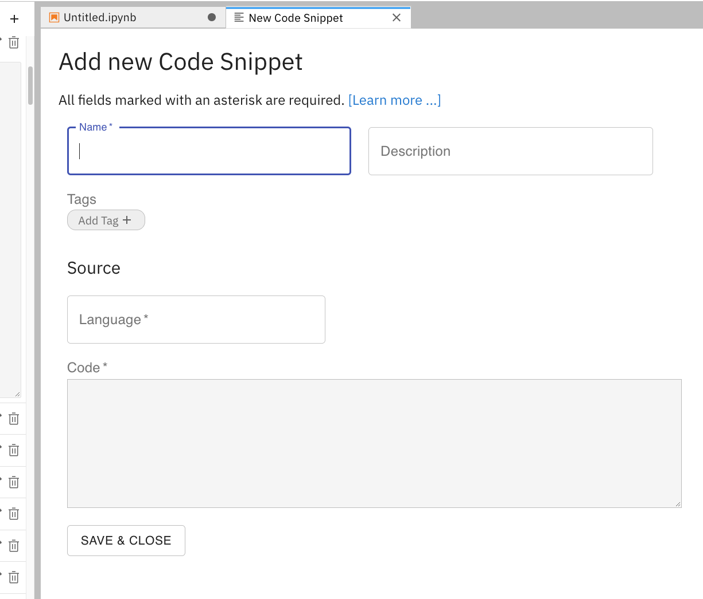
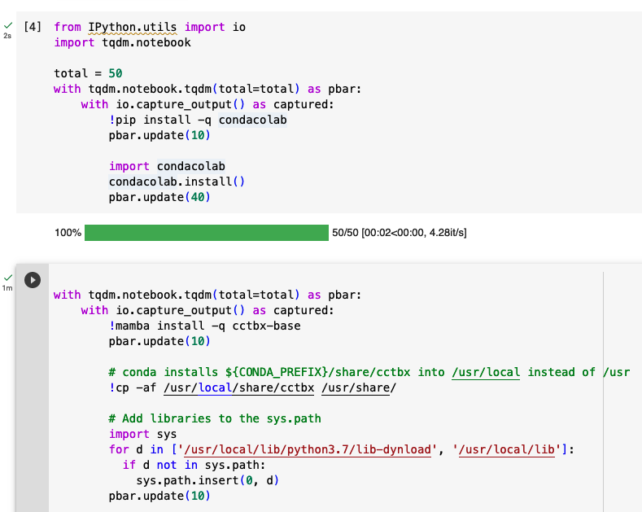
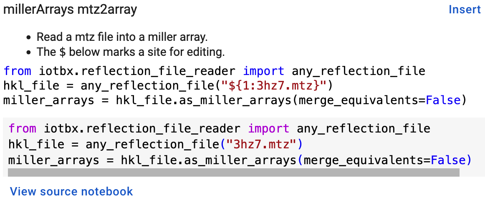

:author: Blaine H. M. Mooers
:email: blaine-mooers@ouhsc.edu
:institution: Dept of Biochemistry and Molecular Biology, University of Oklahoma Health Sciences Center, Oklahoma City, OK 97104
:institution: Stephenson Cancer Center, University of Oklahoma Health Sciences Center, Oklahoma City, OK 97104
:institution: Laboratory of Biomolecular Structure and Function, University of Oklahoma Health Sciences Center, Oklahoma City, OK 97104
:institution: Biomolecular Structure Core, Oklahoma COBRE in Structural Biology, University of Oklahoma Health Sciences Center, Oklahoma City, OK 97104
:orcid: 0000-0001-8181-8987
:corresponding: Blaine H. M. Mooers
:bibliography: mybib

-----------------------------------------------------------
0465 Biomolecular Crystallographic Computing with Jupyter
-----------------------------------------------------------

.. class:: abstract

   The ease of use of Jupyter notebooks has helped biologists enter scientific computing,
   especially in protein crystallography, where a collaborative community develops extensive
   libraries, user-friendly GUIs, and Python APIs. The APIs allow users to use the libraries in Jupyter.
   To further advance this use of Jupyter, we developed a collection of code fragments that use
   the vast *Computational Crystallography Toolbox* (cctbx) library for novel analyses. We made versions
   of this library for use in JupyterLab and Colab. We also made versions of the snippet library
   for the text editors VS Code, Vim, and Emacs that support editing live code cells in Jupyter
   notebooks via the GhostText web browser extension. Readers of this paper may be inspired to adapt this latter capability
   to their domains of science.

.. class:: keywords

   literate programming, reproducible research, scientific rigor, electronic notebooks, JupyterLab, Jupyter notebooks, Colab notebook, OnDemand notebooks, computational structural biology, computational crystallography, biomolecular crystallography, protein crystallography, biomolecular structure, computational molecular biophysics, biomedical research, data visualization, scientific communication, GhostText, text editors, snippet libraries, SciPy software stack, interactive software development

Introduction
--------------

Biomolecular crystallography involves the determination of the molecular structure of proteins and nucleic acids and their complexes by using X-rays, neutrons, or electrons.
The molecular structure determines the protein's biological function, so the experimentally determined structures provide valuable insights vital for understanding biology and developing new therapies in medicine.
The recent *resolution revolution* in cryo-electron microscropy (cryo-EM) :cite:`Kuehlbrandt14` and the breakthrough in protein structure prediction with neural networks now provide complementary sources of insights into biomolecular structure :cite:`Jumper21`, :cite:`Mirdita22`, :cite:`Chowdhury2022`. 
However, the crystallographic approach continues to play a vital role because it still supplies the most precise structures, :cite:`Foerster19`.

About half of the crystal structures of protein molecules are refined with the program *Phenix* :cite:`Liebschner19`. 
This program has a user-friendly GUI that supports standard analyses :cite:`Echols12`.
Phenix runs on top of *cctbx* :cite:`GrosseKunstleve02`.
The Computational Crystallography Toolbox (*cctbx*) provides a transparent API, so most users of *Phenix* are barely aware that it relies on *cctbx*.
However, nonstandard analyses are not avilable in *Phenix* and require accessing the functions in the *cctbx* library (e.g., :cite:`DeZitter22`).
The backend *cctbx* was written in C++ in the early 2000s for speed and to provide customized data structures for crystallography.
Likewise, the GUI-driven *Olex2* small molecule refinement program uses *cctbx* for many of its crystallographic computations :cite:`Bourhis15`.

To ease the use of *cctbx* by general users, the C++ interfaces, classes, and functions of *cctbx* are exposed to Python via the *Boost.Python* Library :cite:`Abrahams03`.
Recently, dependency management in *cctbx* was reworked by leveraging the Anaconda infrastructure to ease its installation.
In psite of these conveniences, the widespread adoption of Python by field practitioners over the past decade, and the presence of several on-line tutorials about *cctbx*, many structural biologists still find *cctbx* hard to master and adoption has remained low.
This difficulty drove several groups to develop software libraries (e.g. *reciprocalspaceship* :cite:`Greisman21`, *GEMMI* :cite:`Wojdyr22`) that reinvent some features of *cctbx* while utilizing the more familiar pandas dataframes in place of *cctbx*'s customized data structures. 
In contrast to these new competitors, *cctbx* has more extensive coverage of advanced crystallographic data analysis tasks and is more throughly tested as the result running underneath Phenix for almost two decades. 
*cctbx* remains the utlimate library for building advanced crystallographic data anlayses tools, so the field would benefit if *cctbx* were easier to use.

To foster adoption of cctbx, we present a collection of cctbx code snippets to be used in Jupyter notebooks :cite:`jupyter`.
Jupyter provides an excellent platform for exploring the *cctbx* library and prototyping new analysis tools.
The Python API of *cctbx* simplifies running *cctbx* in Jupyter via a kernel specific for its conda environment.
We formatted the snippet library for several snippet extensions for the Classic Notebook and for Jupyter Lab.
To overcome the absence of tab triggers in the Jupyter ecosystem to invoke the insertion of snippets, we also made the snippets available for leading text editors.
The user can use the GhostText browser plugin to edit the contents of a Jupyter cell in a full-powered external editor.
GhostText enables the user to experience the joy interactive computing in Jupyter while working from the comfort of their favorite text editor.
These multiple modalities of using *cctbx* in Jupyter that we describe below may inspire workers in other domains to build similar snippet libraries for domain-specific software.

Results
---------

We provide a survey of the snippet library that we have customized for several snippet extensions in JupyterLab and Google Cobalt.

jupyterlabcctbxsnips
++++++++++++++++++++++++
We developed the *jupyterlabcctbxsnips* library of code templates for the JupyterLab extension *jupyterlab-snippets* (`https://github.com/QuantStack/jupyterlab-snippets`).
Access to the code templates or snippets requires the editing of the Jupyter notebook from inside of JupyterLab, a browser-based IDE for displaying, editing, and running Jupyter notebooks.

JupyterLab supports more comprehensive workflows for academic work than what is possible in the Classic Jupyter Notebook application.
For example, it enables the writing or editing of a document in a pane next to the Jupyter notebook.
This variant is useful for writing documentation, protocols, tutorials, blog posts, and manuscripts next to the notebook that is being described.
The document can be a plain text, html, markdown, LaTeX, or even an org-mode file if one activates the text area with GhostText while running one of several advanced text editors (see the section below about GhostText).
The editing of a document next to the related Jupyter notebook supports reproducible research and reduces costly context switching.

We made a variant of the library, *jupyterlabcctbxsnipsplus* (`https://github.com/MooersLab/jupyterlabcctbxsnipsplus`), that has a copy of the code in a block comment (Fig. :ref:`codePlus`).
In the commented code, suggested sites for editing are indicated by tab stops that are marked with dollar signs.

   A snippet from the *jupyterlabcctbxsnipsplus* library with duplicate code in a comment block. The dollar sign marks the start of a tab stop. The comment block guides the editing of the active code. :label:`codePlus`

The figure below (Fig. :ref:`cctbxplusPulldown`) shows part of the cascading menus for the *jupyerlabcctbxsnipsplus* library after it has been installed successfully.
The submenus correspond to the names of subfolders in the *cctbx+* folder in the snippets folder, which was manually created inside of the Jupyter folder in the local library folder (i.e., :code:`~/Library/Jupyter/multimenus_snippets/cctbx+` on macOS).

   The cascading menus for the *jupyterlabcctbxsnipsplus* library for the jupyterlab-snippets version 0.4.1 extension in JupyterLab version 3.5.2. :label:`cctbxplusPulldown`

Each final menu item is linked to a Python snippet file.
The selection of a snippet file by clicking on it with the left-mouse button inserts its content into a new cell below the current cell.

In contrast, the *mtzOjbectSummary.py* snippet was selected from the *cctbx* submenu and lacks the comment block.
This code was inserted in the current notebook cell (Fig. :ref:`Fig5mtzSummary`).
The code in this cell was be executed by entering **Shift-Enter**.

   The code and output from the *mtzObjectSummary.py* snippet in JupyterLab. :label:`Fig5mtzSummary`

The *mtzObjectSummary.py* snippet prints a summary of an mtz file.
A mtz file is a binary file that contains diffraction data in a highly customized data structure (Fig. :ref:`Fig5mtzSummary`).
The data in this mtz file has columns of I(+) and I(-).
These are the Bijvoet pairs of diffraction intensities.
These pairs are related by symmetry and should have equal intensity values within experimental error.
The differences in intensities are a measure of the presence of anomalous scattering.
Anomalous scattering can be measured for elements like sulfur and phosphorus that are part of the native protein and nucleic acid structures and heavier elements like metals that are naturally occurring as part of metalloproteins or that were purposefully introduced by soaking crystals or that were incorporated covalently into the protein (e.g., selenomethionine) or nucleic acid (e.g., 5-bromouracil) during its synthesis.

The anomalous differences can be used to determine the positions of the anomalous scattering atoms.
Once the positions of the anomalous scatterers are known, it is possible to work out the positions of the lighter atoms in the protein.
We use these data to make the I(+) vs I(-) scatter plot below (Fig. :ref:`ipmpplot`).
The mtz file contains data for SirA-like protein (DSY4693) from Desultobacterium hafniense, Northeast Structural Genomics Consortium Target DhR2A.
The diffraction data were retrieved from the Protein Data Bank, a very early open science project that recently celebrated its 50th anniversary :cite:`wwPDB18`.

The I(+) vs I(-) plot below (Fig. :ref:`ipmpplot`) was made after reading the X-ray data into a cctbx Miller array, a data structure designed for handling X-ray data in *cctbx*.
The I(+) and I(-) were eventually read into separate lists.
We plot the two lists against each other in a scatter plot using *matplotlib* :cite:`matplotlib`.
There is no scatter from the :math:`x=y` line in this plot if there is no anomalous signal.
The larger the anomalous signal, the greater the scatter.
The departure from this line is expected to be greater for intensities of large magnitude.

   The code snippet to generate a Ip versus Im plot and the corresponding plot generated by the code. :label:`ipmpplot`

Plots of this nature are useful for detecting very weak anomalous signals from native anomalous scatters like sulfur and phosphorous.
The collection of the anomalous signal from native scatters enables structure determination without having to spend the extra time and money to introduce heavier atoms that are not native to the protein.
The measurement of the very weak signal from native anomalous scatterers is still at the edge of what is technically possible.
It has rarely been achieved with in-house intruments.
Success generally requires the faster multi-million dectectors at beamlines, tunable wavelengths of synchrotron raditation avialble at one of 30+ laboratories around the world, and cryogenic temperatures (-173 C) maintained by a cryo-stream of nitrogen gas that slows radiation damage long enough to collect complete datasets.

However, recently, several groups have completed successful native phasing experiments at room temperature by collecting data from large numbers of crystals and merging the data :cite:`Yabukarski22`, :cite:`Greisman22`.
The advantages of room temperature data collection include avoidance of conformational changes in the protein induced by supercooling the crystal.
The room temperature data were collected from each crystal briefly before radiation damage degraded the diffraction too much.
This is a remarkable achievement because the merging of diffraction data from many crystals in various orientations enhances the experimental error; this error can mask the weak anomalous signal that is being sought.

The plot (Fig. :ref:`ipmpplot`) was adapted from an example in the *reciprocalspaceship* project from the Hekstra Lab :cite:`Greisman21`.
This new project takes a more Pythonic approach than *cctbx* by utilizing many of the packages in the SciPy stack that did not exist when cctbx was initiated.
For example, it uses the *pandas* package to manage diffraction data whereas *cctbx* uses a special C++ data structure for diffraction data that predates *pandas* by almost a decade.
The utilization of *pandas* enables easier integration with the other components of the SciPy software stack including machine learning packages.

The *cctbx* is most easily installed into its own environment by using Anaconda with the command :code:`conda create -n my_env -c conda-forge cctbx-base python=3.11`.

The atomic coordinates of the biomolecular structures are the other major type of data that are intimately associated with diffraction data.
The fixed file format of Protein Data Bank coordinate files with the file extension of *pdb* originated in the 1970s with the birth of the Protein Data Bank, but very large biological macromolecules have been determined over the past two decades that exceeded the limits on the number of atoms permitted in one file.
To address this and other shortcomings of the PDB file format, the PDBx/mmCIF (Protein Data Bank Exchange macromolecular Crystallogrpahic Information Framework) file format was recently made the new data standard :cite:`Westbrook22`.
The *cctbx* has been adapted to read mmCIF files.

taggedcctbxsnips
+++++++++++++++++++++

The Elyra-snippets extension for Jupyter Lab supports the use of tagged snippets (`https://elyra.readthedocs.io/en/latest/user_guide/code-snippets.html`).
Each snippet is in a separate JavaScript file with the *json* file extension :ref:`taggedcctbxsnips`.

   Snapshot of a list of snippets in JupyterLab supported by the Elyra-snippet extension. The 80 *cctbx* snippets have been narrowed to seven snippets by entering the `mtz` tag. Additional tags can be entered to further narrow the list of candidate snippets. :label:`taggedcctbxsnips`

Each snippet file has a set of metadata.
These data include a list of tags.
The tags are used to find the snippet while editing a Jupyter notebook in JupyterLab.
We made a version of the cctbxsnips library for the Elyra-snippets extension (`https://github.com/MooersLab/taggedcctbxsnips`).

.. figure:: ./figs/elyra-new-snippet.png
   :align: center
   :scale: 20%
   :figclass: bht

   The GUI to create a new snippet via the Elyra-snippet extension for JupyterLab. :label:`elyra-new-snippet`

To add a new snippet, click on the + in the upper right of the Code Snippets icon (Fig. :ref:`elyra-new-snippet`).
This will open new GUI (see below) for creating a snippet.
The value of *Name* should be one word or a compound word.
The value of *Description* describes in one or more sentences what the snippet does.
The values of the *Tags* field are used to narrow the listing of snippets in the menu.
The value of the *Source* is the programming language; the value is Python in this example.
The *Code* can be entered by selecting code in a notebook cell or copying and pasting from a script file.

colabcctbxsnips
+++++++++++++++++++

The Google Colab notebook enables the running of software on Googles's servers in a computational notebook that resembles the Jupyter notebook.
Colab notebooks are useful for workshop settings where there is no time for installing software on a heterogeneous mix of operating systems when the attendees are following the presentation by using their own computers.

Colab notebooks do no support external extensions, but they have built-in support for snippets.
However, the Colab notebook has built-in support for snippets.
A particular snippet library is stored in a dedicated Google Colab notebook rather than in individual files.
The notebook of snippets is stored on the user's Google Drive account.
While the software installed in a Colab session is lost upon logging out, the snippets remain available on the next login.

After the snippet notebook is installed, the user opens a new notebook to use the snippets.
From that new notebook, the list of snippets will be exposed by clicking on the **<>** icon in the left margin of the notebook.
Click on the `Insert` button in the upper righthand corner of the snippet to copy the snippet to the current code cell in the notebook.

We developed the *colabcctbxsnips* library and stored it in a Colab Notebook (`https://github.com/MooersLab/colabcctbxsnips`).
Two snippets have the code for installing *mamba* and then *cctbx* (Fig. :ref:`colab`).
These code snippets have to be run before *cctbx* can be accessed.
The two code fragments take less than two minutes to install the required software.

   Snippets from the *cctbx* library for installing *mamba* and then *cctbx* on Google Colab. :label:`colab`

The Colab snippet system also lacks support for tab triggers and tab stops.
We address this problem by supplying a copy of the snippet with the sites of the tab stops marked up like a yasnippet snippet.
Unlike the case of the *jupyterlabcctbxsnipsplus* library, the marked up copy of the code snippet is displayed only in the preview of the snippet and is not inserted into the code cell along with the active code (Fig. :ref:`colabplus`).

   Preview of a Colab code snippet. The preview contains two copies of the code. The bottom copy of the code will be inserted into the current code cell. The top copy of the code serves as a guide to sites to be edited. The dollar sign marks the start of a tab stop where the enclosed placeholder value may need to be changed. :label:`colabplus`

Snippets for OnDemand Notebooks at HPCs
+++++++++++++++++++++++++++++++++++++++++++++++++++++

We have also worked out how to deploy this snippet library in OnDemand notebooks at High-Performance Computing centers.
These notebooks resemble Colab notebooks in that JupyterLab extensions cannot be installed.
However, they do not have any alternate support for accessing snippets from menus in the GUI.
Instead, we had to create IPython magics for each snippet that load the snippet's code into the code cell.
This system would also work on Colab and may be preferred by expert users because the snippet names used to invoke the Ipython magic are under autocompletion.
We offer a variant library that inserts a commented out copy of the code that has been annotated with the sites that are to be edited by the user.

cctbxsnips for leading text editors
++++++++++++++++++++++++++++++++++++++++

To support the use of the *cctbx* code snippets in text editors, we made versions of the library for Emacs, Vim, Neovim, Visual Studio Code, Atom, and Sublime Text3.
We selected these text editors because they are the most advanced and most popular with software developers and because they are supported by the GhostText project described below :ref:`ghosttext`.

For Emacs, we developed a library for use with the yasnippets package (`https://github.com/MooersLab/cctbxsnips-Emacs`).
Emacs supports repel-driven software development, which resembles the interactive software development experience in Jupyter notebooks.
Emacs also supports the use of literate programming in several kinds of documents, including the very popular org-mode document :cite:`Schulte12`.
Code blocks in these documents can be given a **jupyter** option with a Jupyter kernel name that enables running a specific Jupyter kernel including one mapped to a conda environment that has the *cctbx* package installed.
A similar examples using the molecular graphics package PyMOL is demonstrated in this short video (`https://www.youtube.com/watch?v=ZTocGPS-Uqk&t=2s`).

Using GhostText to edit Jupyter cells from a favorite text editor
++++++++++++++++++++++++++++++++++++++++++++++++++++++++++++++++++++++++++
:label:`ghosttext`

By adding the GhostText extension (`https://ghosttext.fregante.com/`) to the web browser and a server to one of several leading text editors, it is possible to send the text from the browser through a WebSocket to a server in the text editor.
Thus, it is possible to edit the contents of a computational notebook cell from inside a text editor.
Changes made in the text editor instantly appear in the notebook and vice versa.
By applying the power of a text editor to computational notebooks, experienced developers can continue to use familiar editing commands and tools in their preferred text editor.

GhostText is a Javascript program developed by Federico Brigante, a prolific JavaScript developer.
Versions of the extension are available for the Google Chrome, Firefox, Edge, Opera, and Safari.
The extension for the Google Chrome browser works in the Brave browser, and the extension for Firefox works in the Waterfox and Icecat browsers.
GhostText was developed initially for Sublime Text 3, so Sublime Text 3 can serve as a positive control even if another editor in the list is the favored editor.
(Sublime Text 3 is available for most platforms for a free trial period of infinite length.)

The snippet extensions for the Classic Jupyter Notebook and JupyterLab lack support for tab triggers to insert snippets as you type and tab stops inside the snippet to advance to sites in the snippet that may need to be edited.
These two features are standard in the software that supports the use of snippet libraries in most text editors.

As a quick reminder, tab triggers in text editors insert chunks of computer code after the user enters the tab trigger name and hits the TAB key (Fig. :ref:`tabtrigger`).
The tab trigger name can be as short as several letters.
Many text editors and IDEs have pop-up menus that aid the selection of the correct tab trigger.
Tab stops are sites within the code snippet where the cursor advances to after entering TAB again.
These sites often have placeholder values that can be either edited or accepted by entering TAB again.
Sites with identical placeholder values can be mirrored so that a change in value at one site is propagated to the other tab stops with the same placeholder value.
The absence of tab stops can increase the number of bugs introduced by the developer by overlooking parameter values in the code snippet that need to be changed to adapt the snippet to the current program.

.. Figure:: ./figs/tabtrigger.png
   :align: center
   :scale: 55%
   :figclass: bht

   Example of a tab trigger being entered in Sublime Text 3 editor and appearing in a Jupyter Notebook cell. A pop-up menu lists the available snippets. The list was narrowed to one snippet by the entry of three letters. :label:`tabtrigger`

The text editor also needs to be extended with a server that enables two-way communication with the web page via a WebSocket.
Edits made on the browser side of the WebSocket are immediately sent to an open page in the Text Editor and vice versa; however, the text editor's snippets and other editing tools only work in the text editor.

The connection can be closed from either side of the WebSocket.
It is closed on the web browser side via an option in GhostTest’s pulldown menu, and it closed on the text editor side by closing the active buffer.

For example, the server for *Emacs* is provided by the *atomic-chrome* package that is available in the Milkypostman’s Emacs Lisp Package Archive (MELPA) and on GitHub (`https://github.com/alpha22jp/atomic-chrome`).
The configuration for *atomic-chrome* in my Emacs initialization file (e.g., init.el) is listed below (Fig. :ref:`atomicconfig`).
The third line in Code listing 1 sets the default Emacs mode (equivalent to a programming language scope): We set it to Python for Jupyter code cells.
Atomic-chrome uses text-mode by default.
You can change the default mode to other programming languages that you may use in Jupyter, like Julia or R.
The last three lines specify the Emacs mode to be used when text is imported from the text areas on github.com, Overleaf.com, and 750words.com.
Similar configuration options are available in the other text editors, or you manually change the language scope for the window with the text imported from Jupyter.

.. Figure:: ./figs/atomicChrome.png
   :align: center
   :scale: 97%
   :figclass: bht

   Emacs lisp code to configure the atomic-chrome package for Emacs. This configuration opens Jupyter notebooks in the Python major mode and the 750words.com webpage in the LaTeX major mode. :label:`atomicconfig`

*GhostText* provides keyboard shortcuts to improve productivity.
These shortcuts keep the developer's hands on the keyboard and avoid breaks in context by moving the hand to the mouse.
The shortcut by operating system is as follows: macOS, command-shift-K; Linux, control-shift-H; and Windows, control-shift-K.

To support the use of *GhostText* to edit electronic notebooks containing code from the *cctbx* library, we have made variants of a collection of *cctbx* snippets for *Visual Studio Code*, *Atom*, *Sublime Text 3*, *Vim*, *NeoVim*, and *Emacs*.
For *Vim* and *NeoVim*, the snippets are available for the *UltiSnips*, *Snipmate*, and *neosnippets* plugins.
The snippets are available for download on GitHub (`https://github.com/MooersLab`).
From our experience, Sublime Text 3 has the easiest setup while Emacs provides the highest degree of customization.
The *cctbx* snippet library was previously only available for use in Jupyter notebooks via extensions for the Classic Jupyter Notebook application or Jupyter Lab.

Note that the snippet library cannot be used with the program *nteract* (`https://nteract.io/`).
The *nteract* is an easy-to-install and use desktop application for editing and running Jupyter notebooks offline.
The ease of installation makes the *nteract* application popular with new users of Jupyter notebooks.
Obviously *nteract* is not browser-based, so it cannot work with *GhostText*.
*nteract* has yet to be extended to support the use of code snippet libraries, but *nteract* allows the switching of jupyter kernels between code cells.

While the focus of this report is on Jupyter and Colab notebooks, the *cctbxsnips* snippet library can be used to aid the development of Python scripts in plain text files, which have the advantage of easier version control.
The snippets can also be used in other kinds of literate programming documents that operate off-line like org-mode files in Emacs and the *Quarto* (`http://quarto.org`) markdown representation of Jupyter notebooks.
*Quarto* is available for several leading text editors.
In the later case, you may have to extend the scope of the editing session in the editor to include Python source code.

Discussion
-------------

What is new
++++++++++++++

We report a set of code template libraries for doing biomolecular crystallographic computing in Jupyter.
These template libraries only need to be installed once because they persist between logins.

We also include support for Colab notebooks where the snippets also persist between logins but other installed software is lost upon logging out of a session.
The templates include the code for installing the software required for crystallographic computing.
The installation templates automate as many as seven installation steps.
Once the user inserts the installation snippet code to the top of a given Colab notebook, the user only needs to rerun these blocks of code upon logging into Colab to be able to reinstall the software.
The Colab notebook user can also  modify the installation templates to install the crystallographic software on their local machine and run then the notebook in Jupyter Classic and JupyterLab.
Examples of such adaptations are provided on a dedicated GitHub web page.
The template libraries presented here lower an important barrier to the use of Colab by those interested in crystallographic computing on the cloud.

We also report the use of GhostText to edit notebook code cells in Jupyter notebooks and text documents in JupyterLab.
This capability enables a user to use an external text editor to edit code.
The user can thereby take advantage of the support for tab triggers and tab stops in the external editor.
This support can ensure faster and more accurate writing and editing of new code.

Relation to other work with snippet libraries
+++++++++++++++++++++++++++++++++++++++++++++++++++

This snippet library is among the first that is domain specific.
Most snippet libraries are for programming languages or for hypertext languages like HTML, markdown, and LaTeX.
The average snippet in these libraries also tends to be quite short, and the size of the libraries tends to be quite small.
The audience for these libraries are the millions of professional programmers and web page developers.
We reasoned that domain-specific snippet libraries with long code fragments are a great coding tool that should be brought to the aid of the tens of thousands of workers in biological crystallography.

The other area where domain-specific snippets have been provided is in molecular graphics.
A pioneering scripting wizard provided templates for use in the molecular graphics program RasMol :cite:`Horton99`.
In addition, the conscript program provided a converter from *RasMol* to *PyMOL* :cite:`Mottarella10`.
We also provided snippets for *PyMOL*, which has about 100,000 users, for use in text editors :cite:`Mooers21a` and Jupyter notebooks :cite:`Mooers21b`.
The former supports tab triggers and tab stops; the latter does not.

Opportunities for interoperability
++++++++++++++++++++++++++++++++++++++

The set of template libraries can encourage synergistic interoperability between software packages that are supported by the snippet libraries.
That is, the development of notebooks that use two or more software packages and even two or more programming languages.
More general and well-known examples of interoperability include the Cython packages in Python that enable the running of C++ code inside Python :cite:`Behnel11`, the *reticulate* package that enables the running of Python code in R :cite:`Ushey23`, and the *PyCall* package in Julia that enables the running of the Python packages in Julia (`https://github.com/JuliaPy/PyCall.jl`).
The latter package is widely used to run matplotlib in Julia.
Interoperability already occurs between *CCP4* :cite:`Agirre23`, *clipper* :cite:`McNicholas18`, *GEMMI* :cite:`Wojdyr22`, *reciprocalspaceship* :cite:`Greisman21`, *Careless* :cite:`Dalton22`, and *cctbx* and to a limited extent between *cctbx* and *PyMOL*.
The snippet libraries reported here can promote taking advantage of this interoperability in Jupyter and Colab notebooks.
We hope that our effort will help raise awareness of interoperability issues among the community.

Snippets in the age of AI-assisted autocompletion
+++++++++++++++++++++++++++++++++++++++++++++++++++++

Snippet libraries of domain specific software may not be as redundant as they first appear in the age of chatbots.
The code fragments of domain-specific libraries have a limited presence on GitHub, so they may be underrepresented in large language models.
In addition, chatbots are desinged to return text rather than code.
However, *copilot* and *tabnine* were designed for code completion and are good at autosuggesting code fragments.
Via GhostText, it is possible to run *copilot* or *tabnine* in a text editor while editing Jupyter notebook cells.

Conclusions
-----------
Our explorations suggest that code snippets for domain-specific software libraries have several roles to play in supporting the use of such libraries.
First, the snippets illustrate possible uses of the library, thereby, playing educational and inspirational roles.
Second, the snippets can speed up the assembly of scripts while reducing the time spent on debugging, thereby, playing a produtivity enhancement role.
We hope that the *cctbxnsips* library will inspire the creation of similar libraries in other domains.

Acknowledgments
----------------------

This work was supported in part by the following grants: Oklahoma Center for the Advancement of Science and Technology HR20-002, National Institutes of Health grants R01 CA242845, P30 CA225520, and P30 AG050911-07S1.
In addition, we thank the Biomolecular Structure Core of the NIH supported Oklahoma COBRE in Structural Biology (PI: Ann West, P20 GM103640 and P30 GM145423).

