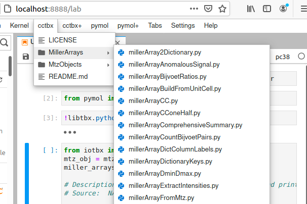
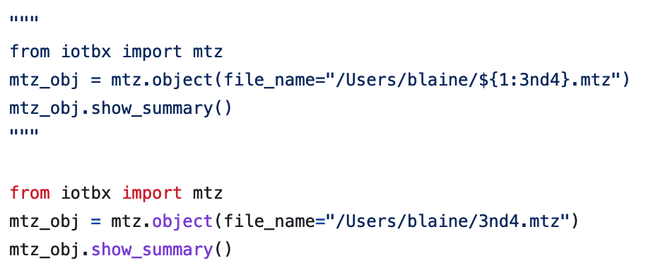

:author: Blaine H. M. Mooers
:email: blaine-mooers@ouhsc.edu
:institution: Dept of Biochemistry and Molecular Biology, University of Oklahoma Health Sciences Center, Oklahoma City, OK 97104
:institution: Stephenson Cancer Center, University of Oklahoma Health Sciences Center, Oklahoma City, OK 97104
:institution: Laboratory of Biomolecular Structure and Function, University of Oklahoma Health Sciences Center, Oklahoma City, OK 97104
:institution: Biomolecular Structure Core, Oklahoma COBRE in Structural Biology, University of Oklahoma Health Sciences Center, Oklahoma City, OK 97104
:orcid: 0000-0001-8181-8987
:corresponding: Blaine H. M. Mooers
:bibliography: mybib

-----------------------------------------------------------
Biomolecular Crystallographic Computing with Jupyter
-----------------------------------------------------------

.. class:: abstract

   The ease of use of Jupyter notebooks has helped biologists enter scientific computing,
   especially in protein crystallography, where a collaborative community develops extensive
   libraries, user-friendly GUIs, and Python APIs. The APIs allow users to use the libraries in Jupyter.
   To further advance this use of Jupyter, we developed a collection of code fragments that use
   the vast *Computational Crystallography Toolbox* (cctbx) library for novel analyses. We made versions
   of this library for use in JupyterLab and Colab. We also made versions of the snippet library
   for the text editors VS Code, Vim, and Emacs that support editing live code cells in Jupyter
   notebooks via GhostText. Readers of this paper may be inspired to adapt this latter capability
   to their domains of science.

.. class:: keywords

   literate programming, reproducible research, scientific rigor, electronic notebooks, JupyterLab, Jupyter notebooks, Colab notebook, computational structural biology, computational crystallography, biomolecular crystallography, protein crystallography, biomolecular structure, computational molecular biophysics, biomedical research, data visualization, scientific communication, GhostText, text editors, snippet libraries, SciPy software stack

Introduction
--------------

Biomolecular crystallography involves the determination of the molecular structure of proteins and nucleic acids and their complexes by using X-rays, neutrons, or electrons.
The molecular structures determines the protein's biological function, so the experimentally determined structures provide valuable insights vital for understanding biology and to developing new therapies in medicine.
The recent *resolution revolution* in cryo-EM and the breakthrough in protein prediction with deep learning models now provide complimentary sources of insights to biomolecular structure, but the crystallographic approach continues to play a vital role because it still supplies the most precise structures :cite:`Kuehlbrandt14`, :cite:`Jumper21`.

Biological crystallographers are familiar with Jupyter's browser-based environment and interactive cells, especially after *ColabFold* enabled running *AlphaFold2* from *Colab* notebooks :cite:`Mirdita22`.
Nonetheless, most protein crystallographers continue to use well-developed, user-friendly GUIs to run crystallographic software in routine analyses (e.g., *CCP4* :cite:`Agirre23`, *Phenix* :cite:`Liebschner19`, *CNS* :cite:`Brunger98`).
However, these users sometimes need non-routine analyses that require new code.

The Computational Crystallography Toolbox (*cctbx*) provides a vast library of computational crystallography software written in C++ following an object-oriented programming paradigm and wrapped with Python :cite:`GrosseKunstleve02`.
This library was designed to contain reusable C++ code.
Its development in the late 1990s was driven by limitations on software reusability and error handling in Fortran77, the dominant programming language used in crystallographic computing at the time.
The C++ interfaces, classes and functions are exposed to Python via the Boost.Python Library :cite:`Abrahams03` 
This *cctbx* library is used to build build higher order analysis tools.
The group lead by Paul Adams that developed *cctbx* and used it to develop the *Phenix* software package that includes a graphical user interface.
*Phenix* is widely used today and it able to continue to grow and evolve that to the object-oriented approach built into *cctbx*.

The *cctbx* library was hard to install three years ago due to its complex dependencies, but the addition of the *cctbx* package to Anaconda dramatically eased the installation of *cctbx*.
The lowering of this barrier to the installation of *cctbx* has raised interest in the use of *cctbx* for novel data analyses.
Several online tutorials and workshops have attempted to address this problem, but the adoption of *cctbx* remains low.
This is somewhat surprising considering the widespread adoption of Python in the past decade by the field.
Difficulty with using *cctbx* has inspired some outside groups to reinvent many capabilities using modules from the SciPy software stack (e.g. *reciprocalspaceship* :cite:`Griesman21`, *GEMMI* :cite:`Wojdyr22`).

To ease the use of *cctbx* by my lab and others to develop custom crystallographic analyses, we assembled a collection of *cctbx* code snippets for use in Jupyter notebooks.
Jupyter provides an excellent platform for exploring the *cctbx* library and developing new analysis tools.
The Python API of *cctbx* simplifies running *cctbx* in Jupyter via a kernel specific for its conda environment.
We formatted the snippet library for several snippet extensions for the Classic Notebook and for Jupyter Lab.
To overcome the absence of tab triggers in the Jupyter ecosystem to invoke the insertion of snippets, we also made the snippets available for leading text editors.
The user can use the GhostText browser plugin to edit the contents of a Jupyter cell in a full-powered external editor.
GhostText enables the user to experience the joy interactive computing in Jupyter while working from the comfort of their favorite text editor.

Results
---------

jupyterlabcctbxsnips
++++++++++++++++++++++++
To ease the running of cctbx in Jupyter notebooks, we developed the jupyterlabcctbxsnips of code templates.
Access to the code templates or snippets requires the editing of the Jupyter notebook from inside of JupyterLab , a browser based IDE for Jupyter notebooks.
This JupyterLab enables the writing or editing of a document in a pane next to the Jupyter notebook.
This is useful for writing up documentation, protocols, tutorials, blog posts, and manuscripts next to the notebook that is being described.
The document can be plain text, html, markdown, LaTeX, or even org-mode if one activates the text area with GhostText (see below :ref:`ghosttext`) while running Emacs.

The figure below (Fig. :ref:`pulldown`) shows part of the cascading menus for the cctbx library after it has been installed successfully.
The submenus correspond to the names of subfolders in the cctbx folder in the multimenus_snippets folder, which you create inside of the Jupyter folder in your local library folder (i.e., ~/Library on the Mac).
Each ultimate menu item is a Python snippet file.
The selection of a snippet file by clicking on it with the left-mouse button inserts its content into a new cell below the current cell.
The *millerArrayFromMtz.py* snippet at the bottom of the pulldown menu was selected and inserted in the figure below.
Commented lines have text that describes what this snippet does.
The code in this cell would be executed by entering Shift-Enter.

   The cascading menus for the cctbx library. :label:`pulldown`

The *mtzObjectSummary.py* snippet prints a summary of an mtz file; a mtz file is a binary file that contains diffraction data in a highly customized data structure (Fig. :ref:`mtzsummary`.
The data in this mtz has columns of I(+) and I(-).
These are the Bijvoet pairs of diffraction intensities.
These pairs are related by symmetry and should have equal intensity values within experimental error.
The differences in intensities are a measure of the presence of anomalous scattering.
Anomalous scattering can be measurable for elements like sulfur and phosphorous that are part of the native protein and nucleic acid structures and heavier element like metals that are naturally occurring as part of metalloproteins or that were purposefully introduced by soaking crystals or that incorporated covalently into the protein (e.g., selenomethionine) or nucleic acid (e.g., 5-bromouracil) during its synthesis.

The anomalous differences can be used to determine the positions of the anomalous scattering atoms.
Once the positions of the anomalous scatterers are known, it is possible to work out the positions of the lighter atoms in the protein. 
We use these data to make a I(+) vs I(-) scatter plot below.
The mtz file contains data for SirA-like protein (DSY4693) from Desultobacterium hafniense, Northeast Structural Genomics Consortium Target DhR2A.
The diffraction data were retrieved from the Protein Data Bank, a very early open science project that recently celebrated its 50th anniversary :cite:`wwPDB18`. 

.. figure:: ./figs/Fig5mtzSummary.png
   :align: center
   :scale: 50%
   :figclass: bht

   The output from *millerArrayFromMtz.py* snippet. :label:`mtzsummary`

The I(+) vs I(-) plot below (Fig. :ref:`ipmplot`) was made after reading the X-ray data into a cctbx Miller array, a data structure designed for handling X-ray data in cctbx.
The I(+) and I(-) were eventually read into separate lists.
We plot the two lists against each other in a scatter plot using *matplotlib* :cite:`matplotlib`.
There is no scatter in this plot if there is no anomalous signal.
The larger the anomalous signal, the greater the scatter from the $x=y$ line.
The departure from this line is expected to be greater for intensities of large magnitude.

.. figure:: ./figs/Fig2IpImPlot.png
   :align: center
   :scale: 50%
   :figclass: bht

   The Ip Im plot. :label:`ipmpplot`

Plots of this nature are useful for detecting very weak anomalous signals from native anomalous scatters like sulfur and phosphorous.
The collection of the anomalous signal from native scatters enables structure determination without having to spend the extra time and money to introduce heavier atoms that are not native to the protein.
The measurement of the very weak signal from anomalous scatterers is at the edge of what is technically possible by using two million dollar detectors and synchrotron radiation at one of of the thirty plus synchrotron radiation laboratories around the world.
These facilities provide X-rays that 10,000 times more intense than the X-rays generated with in-house X-ray generators.
Usually, the X- data are collected at -173 degrees Celsius in a cryostream of nitrogen gas to prolong the life of the crystal while exposed to such intense X-rays.
The typical absorbed radiation dose of a large protein crystal 200 x 200 x 200 microns in size in the X-ray beam at synchrotron radiation laboratory during a 10-minute diffraction experiment is sufficient to kill 100,000 adult humans.
While radiation damage sets in upon initial exposure of the crystal, the cooling prolongs the amount of time over which the crystal gives useful data.

However, recently, several groups have completed successful native phasing experiments at room temperature by collecting data from large numbers of crystals :cite:`Yabukarski22`, :cite:`Greisman22`.
The advantages of room temperature data collection include avoidance of conformational changes in the protein induced by supercooling the crystal.
The room temperature data were collected from each crystal briefly before radiation damage degraded the diffraction too much.
This is a remarkable achievement because the merging of diffraction data from many crystals in various orientations enhances the experimental error; this error can mask the weak anomalous signal that is being sought.

The plot (Fig. :ref:`ipmpplot` was adapted from an example in the *reciprocalspaceship* project from the Hekstra Lab :cite:`Greisman21`.
This new project takes a more Pythonic approach than *cctbx* by utilizing many of the packages in the SciPy stack that did not exist when cctbx was initiated.
For example, it uses the *pandas* package to manage diffraction data whereas *cctbx* uses a special C++ data structure for diffraction data that predates *pandas* by almost a decade.
The utilization of *pandas* enables easier integration with the other components of the SciPy software stack including machine learning packages.

The *cctbx* is most easily installed into its own environment by using Anaconda with the command conda :code:`create -n my_env -c conda-forge cctbx-base python=3.11`.

The *jupyterlabcctbxsnipsplus* is the variant of the *jupyterlabcctbxsnips* library with comments to guide editing of the snippets (https://github.com/MooersLab/jupyterlabcctbxsnipsplus).
The snippet code contains its duplicate in a comment with the sites of tab stops marked with dollar signs and braces as in a the code for a snippet (Fig. :cite:`snipsplus`).
Upon insertion of the snippet into a notebook cell, the commented out code is included.

   The snippet code with a duplicated copy in a comment. :label:`snipsplus`

taggedcctbxsnips
+++++++++++++++++++

colabcctbxsnips
++++++++++++++++++

The Google Colab notebook enables the running of software on Googles's servers in an computational notebook that resembles the Jupyter notebook.
Colab notebooks are useful for workshop settings where there is no time for installing software on a heterogeneous mix of operating systems when the attendees are using their own computers.

In the Colab notebook, that are no external extensions.
However, the Colab notebook has built-in support for snippets.
A particular snippet library is stored in a dedicated Google Colab notebook rather than in individual files.
The notebook of snippets is stored on the user's Google Drive account.
While the software installed in a Colab session is lost upon logging out, the snippets remain available on the next login.

After the snippet notebook is installed, the user opens a new notebook to use the snippets.
From that new notebook, the list of snippets will be exposed by clicking on the **<>** icon in the left margin of the notebook.
This exposes a list of snippets. 
Click on the `Insert` button in the upper righthand corner of the snippet to copy the snippet to the current code cell in the notebook.

We developed the  *colabcctbxsnips* library and stored it in a Colab Notebook (https://github.com/MooersLab/colabcctbxsnips).
Two snippets have the code for installing *mamba* and then *cctbx* (Fig. :ref:`colab`).
These code snippets have to be run before cctbx can be accessed.
The two code fragments take less than two minutes to install the required software. 

.. figure:: ./figs/colab.png
   :align: center
   :scale: 31%
   :figclass: bht

   Snippets for installing *mamba* and then *cctbx* on Google Colab. :label:`colab`

The Colab snippet system also lacks support for tab triggers and tab stops.
We address this problem by supplying a a copy of the snippet with the sites of the tab stops marked up like a yasnippet snippet.
Unlike the case of the *jupyterlabcctbxsnipsplus* library, the marked up copy of the code snippet is displayed only in the preview of the snippet and is not inserted in the code cell along with the active code (Fig. :ref:`colabplus`).

.. figure:: ./figs/colabplus.png
   :align: center
   :scale: 21%
   :figclass: bht

   Preview of a Colab snippet with the template code. The dollar sign marks the start of a snippet. :label:`colabplus`

cctbxsnips for text editors
+++++++++++++++++++++++++++++++

To support the use of the *cctbx* code snippets in text editors, we make versions of the library for Emacs, Vim, Visual Studio Code, Atom, and Sublime Text3.
We selected these text editors because they are the most advanced and most popular with software developers and because they are supported by GhostText project described below :ref:`ghosttext`.

For Emacs, we developed a library for use with the yasnippet package (https://github.com/MooersLab/cctbxsnips-Emacs).
Emacs supports repel-driven software development, which resembles the interactive software development experience in Jupyter notebooks.
Emacs also supports the use of literate programming in several kinds of documents, including the very popular org-mode document.
Code blocks in these documents can be given a **jupyter** option with a Jupyter kernel name that enables running a specific Jupyter kernel including one mapped to a conda environment that has the *cctbx* package installed.
A similar examples using the molecular graphics package PyMOL is demonstrated in this short video (https://www.youtube.com/watch?v=ZTocGPS-Uqk&t=2s).

Using GhostText to edit Jupyter cells from a favorite text editor 
+++++++++++++++++++++++++++++++++++++++++++++++++++++++++++++++++++++++++++
:label:`ghosttext`

The snippet extensions for the Classic Jupyter Notebook and JupyterLab lack support for tab triggers to insert snippets was you type and tab stops inside the snippet to advance to sites in the snippet that may need to be edited.
These two features are standard in the software that supports the use of snippet libraries in most text editors.
By adding the GhostText extension to the web browser and a server to one of several leading text editors, it is possible to send the text from the browser through a WebSocket to a server in the text editor.
Thus, it is possible to edit the contents of a computational notebook cell from inside a text editor.
Changes made in the text editor instantly appear in the notebook and vice versa.
By applying the power of a text editor to computational notebooks, experienced developers can continue to use familiar editing commands and tools.

As a quick reminder, tab triggers in text editors insert chunks of computer code after the user enters the tab trigger name and hits the TAB key (Fig. :ref:`tabtrigger`).
The tab trigger name can be as short as several letters.
Many text editors and IDEs have pop-up menus that aid the selection of the correct tab trigger.
Tab stops are sites within the code snippet where the cursor advances to after entering TAB again.
These sites often have placeholder values that can be either accepted by entering TAB again or edited.
Sites with identical placeholder values can be mirrored so that a change in value at one site is propagated to the other tab stops with the same placeholder value.
The absence of tab stops can increase the number of bugs introduced by the developer by overlooking parameter values in the code snippet that need to be changed to adapt the snippet to the current program.
The lack of support for tab triggers and tab stops in computational notebooks can dampen the enthusiasm of experienced developers for using computational notebooks.
Of course, one solution is to write an extension for Jyptyer Notebook or JuptyerLab in JavaScript that supports tab triggers and tab stops.

.. Figure:: ./figs/tabtrigger.png
   :align: center
   :scale: 55%
   :figclass: bht

   Example of a tab trigger being entered in Sublime Text 3 editor and appearing in a Jupyter Notebook cell. A pop-up menu lists the available snippets.  The list was narrowed to one snippet by the entry of three letters. :label:`tabtrigger`

Another approach is to send the text in the active code cell to a powerful text editor on your local computer via the browser extension known as GhostText https://ghosttext.fregante.com/.
GhostText is a Javascript program developed by Federico Brigante, a prolific JavaScript developer. Versions of the extension are available for the Google Chrome, Firefox, Edge, Opera, and Safari. The extension for the Google Chrome browser works in the Brave browser, and the extension for Firefox works in the Waterfox and Icecat browsers.

The text editor also needs to be extended with a server that enables two-way communication with the web page via a WebSocket.
Edits made on the browser side of the WebSocket are immediately sent to an open page in the Text Editor and vice versa; however, the text editor's snippets and other editing tools only work in the text editor.
The connection can be closed from either side of the WebSocket.
It is closed on the web browser side via an option in GhostTest’s pulldown menu, and it closed on the text editor side by closing the active buffer.

A Jupyter notebook with two code snippets from the cctbxsnips library for the Sublime Text 3 editor are shown in Fig. :ref:`twocells`.
The two code cells have been run, and the output from the second cell is printed in the notebook.
The first cell is being edited to change the name of the mtz file that is to be read.
A pop-up menu in Jupyter has appeared with a list of candidate file names.

.. Figure:: ./figs/twoCodeCells.png
   :align: center
   :scale: 70%
   :figclass: bht

   Two code cells with executed Jupyter code cells. :label:`twocells`

The servers for the editors are editor specific.
The following text editors are supported: Visual Studio Code, Vim, NeoVim, Emacs, Atom, and Sublime Text 3. GhostText was developed initially for Sublime Text 3, so Sublime Text 3 can serve as a positive control even if another editor in the list is your favorite editor. (Sublime Text 3 is available for most platforms for a free trial period of infinite length.)

For example, the server for Emacs is provided by the atomic-chrome package that is available in the Milkypostman’s Emacs Lisp Package Archive (MELPA) and on GitHub (https://github.com/alpha22jp/atomic-chrome).
The configuration for atomic-chrome in my Emacs initialization file (e.g., init.el) is listed below (Fig. :ref:`atomicconfig`).
The third line in Code listing 1 sets the default Emacs mode (equivalent to a programming language scope): I set it to Python for Jupyter code cells.
Atomic-chrome uses text-mode by default.
You can change the default mode to other programming languages that you may use in Jupyter, like Julia or R.
The last three lines specify the Emacs mode to be used when text is imported from the text areas of webpages on github.com, Overleaf.com, and 750words.com.
Similar configuration options are available in the other text editors, or you manually change the language scope for the window with the text imported from Jupyter.

.. Figure:: ./figs/atomicChrome.png
   :align: center
   :scale: 92%
   :figclass: bht

   Emacs lisp to configure atomic-chrome. :label:`atomicconfig`

Ghost Text provides a keyboard shortcut for the browser to open or close the connection to the text editor.
These shortcut keep the developer's hands on the keyboard and avoid breaks in context by moving the hand to the mouse.
The shortcut by operating system is as follows: macOS, command-shift-K; Linux, control-shift-H; and Windows, control-shift-K.

I have been using GhostText daily since mid-May 2022 with Emacs and either Google Chrome or Firefox; I have infrequently encountered three difficulties.
First, other servers inside Emacs can occupy the port for GhostText and block the atomic-chrome server.
I have had to kill the offending server or restart Emacs. Second, saving the text in the Emacs buffer to a file can cause the text to become out of sync with the text in the editor and on the web page.
The lack of updating can lead to a loss of work; making intermediate saves of the text on the web server is safer than saving to a local file.
Of course, the final text can be saved locally.
Third, multiple open editors with GhostText servers installed can compete for the same WebSocket.
This problem is solved by closing the editor that is not in current use or configuring its server to use an alternate WebSocket.

To support the use of *GhostText* to edit electronic notebooks containing code from the *cctbx* library, we have made variants of a collection of *cctbx* snippets for *Visual Studio Code*, *Atom*, *Sublime Text 3*, *Vim*, *NeoVim*, and *Emacs*. For *Vim* and *NeoVim*, the snippets are available for the *UltiSnips*, *Snipmate*, and *neosnippets* plugins.
The snippets are available for download on GitHub (https://github.com/MooersLab/MooersLab/blob/main/README.md#cctbxsnips-for-editors).
I found that *Sublime Text 3* had the most effortless setup while *Emacs* provided the highest degree of customization.
This snippet library was previously only available for use Jupyter notebooks via extensions for the Classic Jupyter Notebook application or Jupyter Lab.

Note that the snippet library cannot be used with the program *nteract* (https://nteract.io/).
The *nteract* is an easy-to-install and use desktop application for editing and running Jupyter notebooks offline.
The ease of installation makes nteract popular with new users of Jupyter notebooks.
Obviously *nteract* is not browser-based, so it cannot work with *GhostText*.
*nteract* has yet to be extended to support the use of code snippet libraries.

While the focus of this report was on the use of the *GhostText* browser plugin to edit Jupyter notebooks hosted in a web browser, the *cctbxsnips* snippet library can be used to aid the development of Python scripts in plain text files, which have the advantage of saner version control.
The snippets can also be used in other kinds of literate programming documents that operate off-line like org-mode files in Emacs and the *Quarto* (http://quarto.org) markdown representation of Jupyter notebooks.
*Quarto* is available for several leading text editors.
In the later case, you may have to extend the scope of the editing session in the editor to include Python source code.

Discussion
-------------

What is new
++++++++++++++

We report a set of code template libraries for doing biomolecular crystallographic computing in Jupyter.
These template libraries only need to be installed once because they persist between logins.
These templates include the code for installing the software required for crystallographic computing.
These installation templates save time because the installation process involves as many as seven operations that would be difficult to remember.
Once the user adds the installation code to the top of a given notebook, the user only needs to rerun these blocks of code upon logging into Colab to be able to reinstall the software.
The user can modify the installation templates to install the software on their local machines.
Examples of such adaptations are provided on a dedicated GitHub web page.
The template libraries presented here lower an important barrier to the use of Colab by those interested in crystallographic computing on the cloud.

Relation to other work with snippet libraries
+++++++++++++++++++++++++++++++++++++++++++++++++++

To the best of our knowledge, we are the first to provide snippet libraries for crystallographic computing.
This snippet library is among the first that is domain specific.
Most snippet libraries are for programming languages or for hypertext languages like HTML, markdown and LaTeX.
The average snippet also tends to be quite short and the size of the libraries tends to be quite small.
The audience for these libraries are millions of professional programmers and web page developers.
We reasoned that this great tool should be brought to the aid of the thousands of workers in crystallography.

The other area where domain specific snippets have been provided is in molecular graphics.
The pioneering work on a scripting wizard provided templates for use in the molecular graphics program RasMol :cite:`Horton99`.
The conscript program provided a converter from *RasMol* to *PyMOL* :cite:`Mottarella10`.
We also provided snippets for *PyMOL*, which has 100,000 users, for use in text editors :cite:`Mooers21a` and Jupyter notebooks :cite:`Mooers21b`.
The former support tab triggers and tab stops; the latter does not.

We have also worked out how to deploy this snippet libraries in OnDemand notebooks at High-Performance Computing centers.
These notebooks resemble Colab notebooks in that JupyterLab extensions cannot be installed.
However, they do not have any alternate support for accessing snippets from menus in the GUI.
Instead, we had to create IPython magics for each snippet that load the snippet's code into the code cell.
This system would also work on Colab and may be preferred by expert users because the snippet names used to invoke magic are under autocompletion.
That is, the user enters the start of a name and IPython suggests the remainder of the name in a pop-up menu.
We offer a variant library that inserts a commented out copy of the code that has been annotated with the sites that are to be edited by the user.

Opportunities for interoperability
++++++++++++++++++++++++++++++++++++++

The set of template libraries can encourage synergistic interoperability between software packages supported by the snippet libraries.
That is the development of notebooks that use two or more software packages and even programming languages.
More general and well-known examples of interoperability include the Cython packages in Python that enable the running of C++ code inside Python, the *reticulate* package that enables the running of Python code in R :cite:`Ushey23`, and the PyCall package in Julia that enables the running of the Python packages in Julia (https://github.com/JuliaPy/PyCall.jl).
The latter package is widely used to run matplotlib in Julia.
Interoperability already occurs between the CCP4 :cite:`Agirre23`, clipper :cite:`McNicholas18`, gemmi :cite:`Wojdyr22`, reciprocalspaceship :cite:`Greisman21`, Careless :cite:`Dalton22`,and *cctbx* projects and to a limited extent between *cctbx* and *PyMOL*, but interoperability could be more widespread if the walls around the software silos were lowered.
The snippet libraries provided here can prompt taking advantage of this interoperability in Jupyter and Colab notebooks.

Acknowledgments
----------------------

This work was supported by the Oklahoma Center for the Advancement of Science and Technology: HR20-002, the  National Institutes of Health grants: R01 CA242845, P30 CA225520, and P30 AG050911-07S1. In particular, we thank the Biomolecular Structure Core of the COBRE in Structural Biology (PI: Ann West, P20 GM103640, P30 GM145423).

