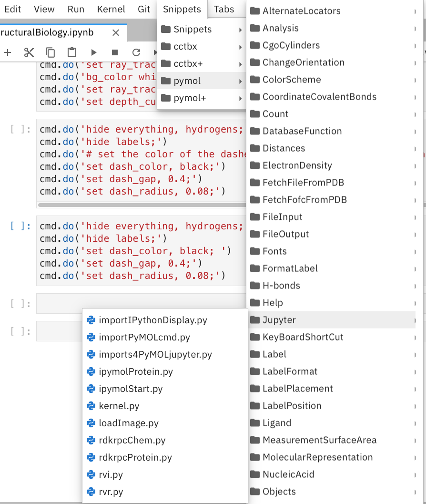
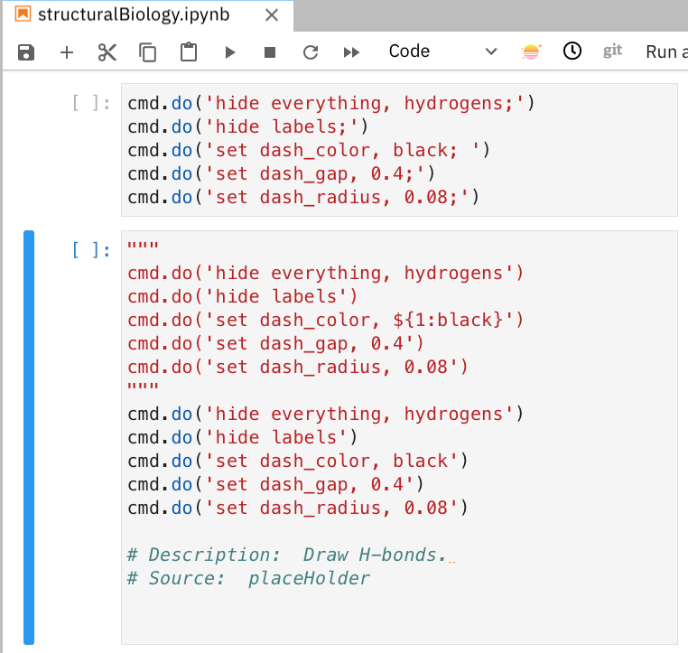
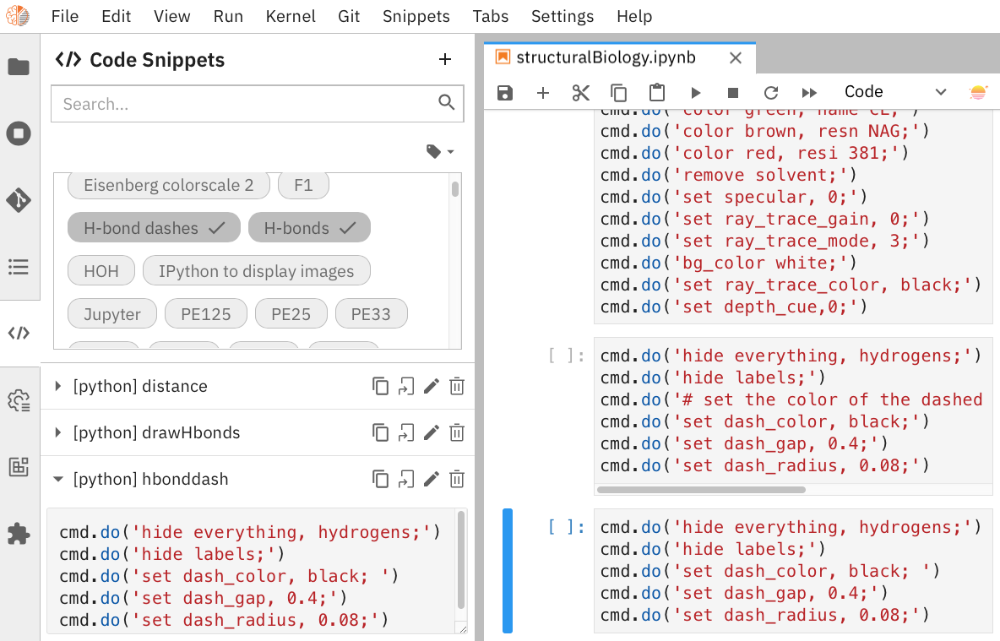
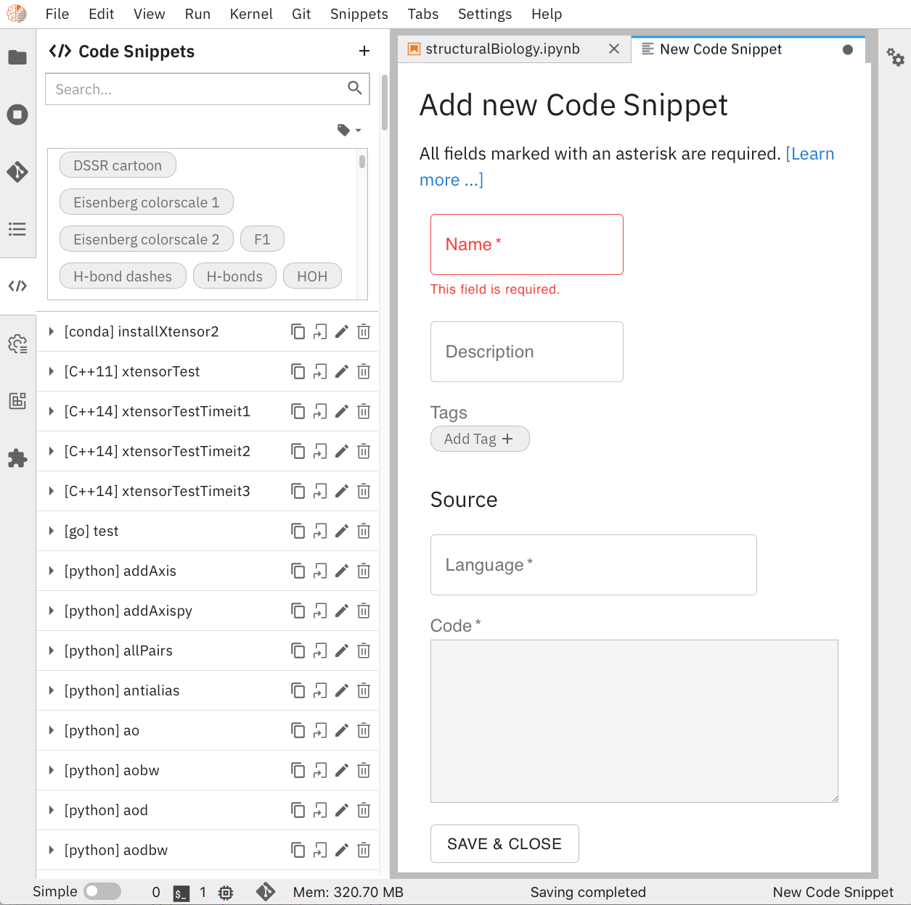
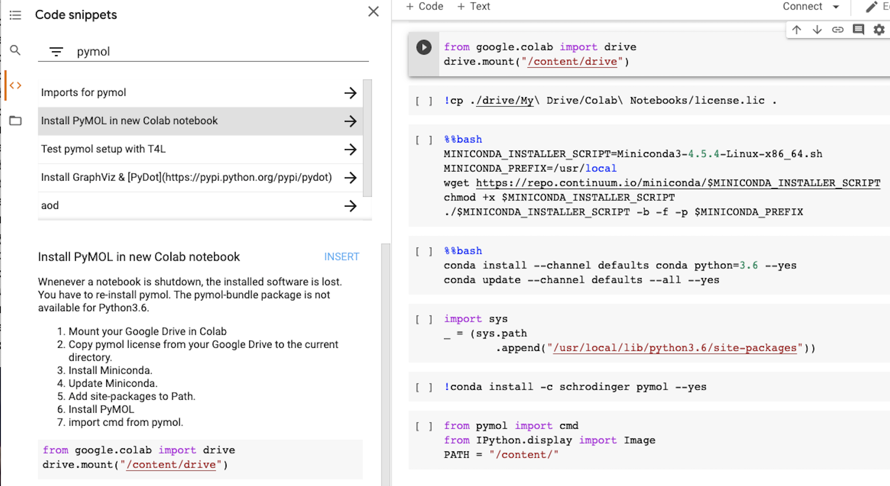
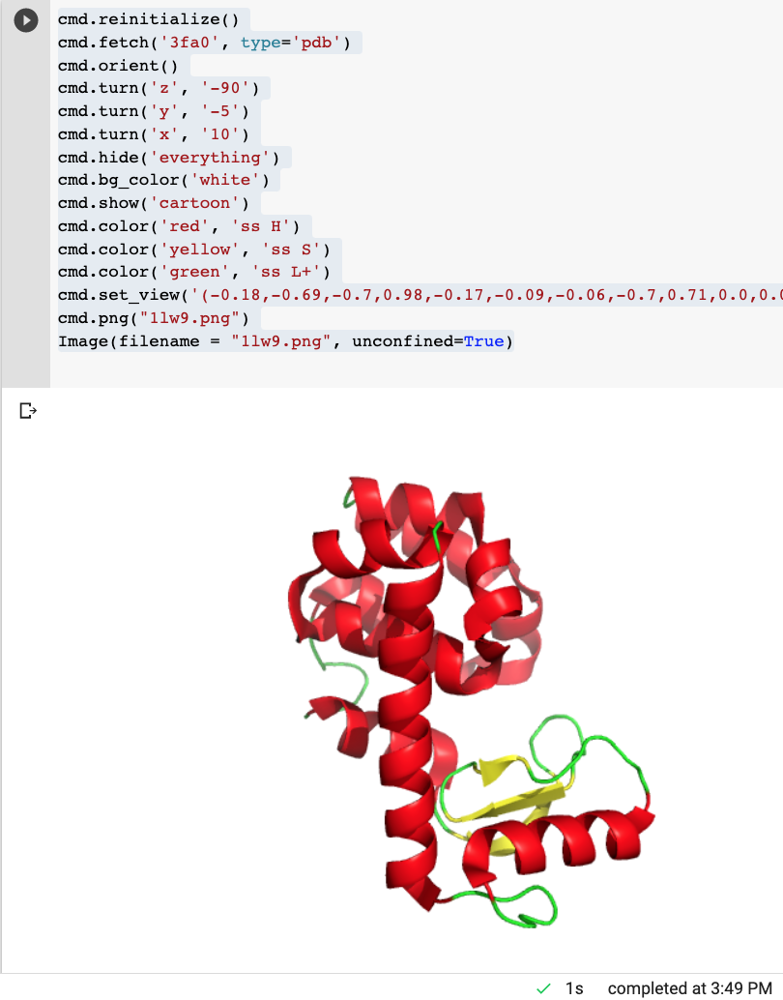

:author: Blaine H. M. Mooers and Francis A. Acquah
:email: blaine-mooers@ouhsc.edu
:institution: Dept of Biochemistry and Molecular Biology, University of Oklahoma Health Sciences Center, Oklahoma City, OK 97104
:institution: Stephenson Cancer Center, University of Oklahoma Health Sciences Center, Oklahoma City, OK 97104
:institution: Laboratory of Biomolecular Structure and Function, University of Oklahoma Health Sciences Center, Oklahoma City, OK 97104
:institution: Biomolecular Structure Core, Oklahoma COBRE in Structural Biology, University of Oklahoma Health Sciences Center, Oklahoma City, OK 97104
:orcid: 0000-0001-8181-8987
:corresponding: Blaine H. M. Mooers

:author: Francis A. Acquah
:email: francis.asieduacquah@gmail.com
:institution: Dept of Biochemistry and Molecular Biology, University of Oklahoma Health Sciences Center, Oklahoma City, OK 97104
:orcid: 0000-0002-4534-9156

------------------------------------------------------------------------
Amalgamated molecular visualization in Colab (Warning: still assembling)
------------------------------------------------------------------------

.. class:: abstract

Protein crystallography produces most of the protein structures used in structure-based drug design.
The process of protein structure determination is computationally intensive and error-prone because many software packages are involved.
Here, we attempt to support the reproducibility of this computational work by using Jupyter notebooks to document the decisions made, the code, and selected output.
We have made libraries of code templates to ease running the crystallography packages in Jupyter notebooks when editing them with JupyterLab or Colab.
Our combined use of GitHub, snippet libraries, Jupyter notebooks, JupyterLab, and Colab will help modernize the computing done by structural biologists.

.. class:: keywords

   literate programming, reproducible research, scientific rigor, electronic notebooks, Colab, computational structural biology,  biomolecular structure, biomedical research, protein-drug interactions, RNA-drug interactions, molecular graphics, molecular visualization, scientific communication, molecular artwork, computational molecular biophysics

Introduction
------------

Chemists, biochemists, and pharmacologists frequently need to visualize the structures of both small and large molecules with molecular graphics software. 
Historically, this software has been expensive and proprietary. 
However, open-source alternatives are now widely available. 
In addition, several Python packages support molecular visualization in Jupyter notebooks (e.g., rdkit, nglview, py3dmol, and PyMOL). 
The first package supports 2-D views of small molecules. 
The following two packages provide interactive 3-D views of small molecules and proteins. 
The fourth package provides static images of 3-D molecular scenes that are of publication quality. 
The first and last packages also support numerous kinds of structural analysis in addition to molecular visualization. 
They were also designed to be run on local computers via desktop applications.

However, users can now run these packages in Google Colaboratory, Google Colab, or just Colab [Carn18]_ [Cola21]_. 
Colab provides a universally accessible computing platform. 
Universal access to this cloud platform eliminates the problem of installing software on heterogeneous personal computers. 
This feature of Colab can save time and frustration for both instructors and students in laboratories, classrooms, and workshops [Nelson20]_. 
The user interacts with the cloud computing resources by interacting with an electronic computational notebook known as the Colab Notebook, which is related to the Jupyter Notebook. 
The latter has become the de facto computing platform in scientific computing.

The Colab notebook provides access to generic scientific computing packages preinstalled on Colab. 
This software includes widely used numerical computing packages like NumPy and pandas. 
If the required software is already available on Colab, the user can import the packages or modules and start executing code blocks in the notebook. 
Unfortunately, molecular graphics packages are not part of this software collection.

One solution to this issue is to install this software via Anaconda. 
However, Anaconda must be retrieved and installed in the correct location in Colab. 
These software installation steps are complex and take time if executed individually. 
This complexity can discourage new users.

To address this and other problems with adding software to Colab, we created code fragments that reduce these tasks to a single click of an icon by the user. 
We added these code fragments to snippet libraries for each molecular graphics package. 
The new libraries are called colabrdkit, colabpy3dmolsnips, and colabnglviewsnips. 
In the case of PyMOL, we reformatted the published pymolpysnips library for Colab and named colabpymolpysnips.

The installed software is lost when the user logs out of Colab. 
This loss is inconvenient because the installation step takes 6-8 minutes. 
A second code fragment archives the installed software as a tar file and stores the tar file on the user's Google Drive. 
A third fragment retrieves the tar file and unpacks it in the correct location after the user logs into Colab again. 
This third step takes less than a minute and reduces the inconvenience of reinstalling software at the beginning of each Colab work session.

We have shared these libraries on GitHub (see https://mooerslab.github.io/polyglotmolviz). 
GitHub provides a modern means of distributing code and correcting errors.

We combine the use of GitHub repositories, domain-specific code snippet libraries, and Google Colab to support polyglot molecular visualization in the cloud, where the user can combine the powerful features of several software packages in a single computational notebook. 
The code generating the images resides in the notebook, thereby supporting reproducible research. 
We think this approach will advance the field by improving productivity and reproducibility.

Methods
-------

We created snippet libraries for each package to support molecular visualization in Colab.
We created a GitHub site for each library to ease the downloading of only those libraries that interest users (Table :ref:`libraries`).
This modularization of the project should ease the correction and augmentation of individual libraries as the extensions, and structural biology software packages evolve.
We only provided libraries for JupyterLab because the Jupyter Project plans to phase out support for the Jupyter Notebook software.
Among the several alternative extensions for code snippets in JupyterLab, we choose jupyterlab-snippets [jLsnip]_ and Elyra [Elyra]_ because these two extensions are actively maintained and have different features.
We also support a snippet library for Jupyter notebooks on Google Colab as described below because Colab provides access to GPUs, which can accelerate some of the larger computational tasks.

The jupyterlab-snippets extension
*********************************

The jupyterlab-snippets extension adds a snippet menu to the JupyterLab menu bar.
The user accesses the snippets through a cascading pulldown menu.
Each snippet resides in a separate plain text file without any formatting.
This feature dramatically eases adding new snippets by users and eases keeping the snippets under version control.
The snippets are stored in the Jupyter data directory (which is found by entering :code:`jupyter --path`; it is in ~/Library/Jupyter/snippets on Mac OS).
Each snippet library is stored in a separate subfolder, which appears on the menu bar as a part of a cascading pulldown menu (Figure :ref:`snippetCascade`).

   Cascading pull-down menu for the Jupyter categories of the jupyterlabpymolpysnips library. :label:`snippetCascade`

We clustered snippets into categories. 
Each category has a cascading submenu.
Clicking on a snippet name in the submenu triggers its insertion into the current cell in the notebook.
The nested menu hierarchy serves well the user who is familiar with the content of the snippet libraries.

Like most other snippet extensions for Jupyter Notebook and JupyterLab, the jupyterlab-snippets extension does not support tab stops or tab triggers.
These are common features of snippet libraries for most text editors and IDEs that accelerate the editing of parameter values in snippets.
The tab stops are particularly valuable because they direct the user to sites that may need changes in their parameter values, and they guide the user to all of the site to ensure that none are overlooked.
The overlooking of parameter values that require changing can be a major source of bugs.
The tab triggers are also often mirrored, so a change at one instance of the same parameter will be propagate automatically to other identical instances of the parameter.
To compensate for the lack of tab triggers, we include a second copy of the code in the same snippet but in a comment and with the tab triggers marked with curly braces and numbers (Figure :ref:`compareSnips`).
The user uses the code in the comment to direct their editing of the active code.
The user can delete the commented out comment when they have finished editing.
Separate versions of the libraries were made with commented out code.
These versions are distinguished by having "plus" appended to their names.

   Comparison of active code in the bottom code block and the commented out code above the active code from a code snippet. The commented lines of code serve as guides for editing because they have curly braces marking sites to be considered for editing. The commented lines of code compensate for the absence of tab stops. :label:`compareSnips`

The elyra-code-snippet extension
********************************

A menu icon labeled with `</>` provides access to snippets in the elyra-code-snippet-extension system.
After the icon is clicked, the snippets appear in the left margin of the JupyterLab GUI.
Snippets from all libraries appear in alphabetical order.
The user can scroll through the list of snippets.
Hovering the mouse cursor over the snippet's name triggers the display of a description of the snippet.

   The GUI from the elyra-code-snippet extension for accessing code snippets is shown on the left. A preview of the *hbonddash* snippet is shown in the lower left. A Jupyter notebook with the inserted the *hbonddash* snippet is shown on the right. :label:`hbondElyra`

Alternatively, the user can enter a search term in the search box at the top of the menu to reduce the list of snippets.
The search terms can be part of a snippet name or a tag stored with each snippet.

A tag icon displays all of the available tags in the snippets as separate icons.
The user can select tags to be used to choose snippets by clicking on the icons.

Each snippet is displayed with several icons (Figure :ref:`hbondElyra`).
A triangular toggle can trigger the display of the snippet in a textbox.
A pencil icon enables the editing of the code.
Other icons enable copying the code to the clipboard, inserting code into the current cell in the notebook, and deleting the snippet.

A plus sign in the upper-righthand corner opens a GUI for the creation of a new snippet.
The GUI occupies a new tab in the window that houses the Jupyter notebooks.
The GUI has a text box for each kind of metadata: name, description, tags, language, and the snippet code.
There is a save button at the bottom to add the new snippet to the current library.

   The GUI from elyra-code-snippet extension for the creation of new snippets. The Learn more link takes the user to the documentation on Read-the-docs. :label:`newElyraSnip`

Each snippet is stored in a separate JSON file.
Each JSON file has the snippet code plus several rows of metadata, including a list of tags and the programming language of the snippet.
The latter provides a sanity check.
For example, an attempt to insert a C++ snippet into a notebook with an active Python kernel will trigger the opening of a window with a warning.

All of the snippets reside in the folder \url{JUPYTER_DATA/metadata/code-snippets}.
This is the directory \url{~/Library/Jupyter/metadata/code-snippets} on the Mac.
There are no subfolders for individual snippet libraries, unlike the jupyterlab-snippets extension.
The snippets from multiple libraries are stored together in the code-snippets folder.
The tag system can be used to select all snippets from one library.
The tag system serves well the user who is not familiar with the content of the installed libraries.
The user can download the snippets from GitHub as zip file and then uncompress this file and move the snippet files to the final destination.

Colab snippet library
*********************

The Colab snippet system resembles the Elyra snippet system in that the snippets appear in a menu to the left of the notebook and that search terms in a search box retrieve snippets.
However, the Colab system differs from the Elyra system ins that the snippets are stored in one or more Jupyter notebooks. 
The user's Google Drive stores the notebook of snippets.
The user enters the url for the notebook in a the Tools --> Settings --> Site --> Custom Snippet Notebook URL.
Multiple URLs for multiple notebooks can be entered at one time.
The user logs out of Colab and upon logging in again to install the snippets.
The user will see the newly added snippets in the left margin after opening the snippet menu by clicking on the `</>` icon.

Each snippet had a markdown cell followed by a code cell.
The markdown cell contained the name of the snippet, a description of what the snippet does, and the structural biology software.
These features are searched in the search box to narrow the list of snippets to inspect for selection.

The first snippet in each notebook provided the steps for installing the software on Colab.
The markdown cell listed these installation steps.
Then a series of code snippets contained the code for carrying out the steps.
This installation snippet was the only one in a notebook that contained more then one code snippet.

   Code snippet for installing PyMOL on Colab. The <> icon opens a menu on the left side that lists all of the snippets. The search term 'pymol' was used to reduce the list of candidate snippets. The highlighted snippets name 'Install PyMOL is new Colab notebook'. Selecting this snippets opens the snippet below. The snippet description is displayed followed by the seven blocks of code. The description includes the seven steps for installing the molecular graphics programs. Clicking with the mouse cursor on 'INSERT' in blue inserts the code into in the cells on the notebook on the fight. :label:`ColabPyMOL`

A search box at the top of the list of snippets is used to recover a snippet (Figure :ref:`ColabPyMOL`.
The user enters a snippet name in the search box to display the snippet and its documentation.
The user hits the 'Install' button to install the snippet's code at the current position in the  notebook.
Unlike the Elyra snippets which insert a whole snippet into one code block, a Colab snippet can have multiple code blocks that are inserted into the notebook at the current position of the mouse cursor.
One snippet can have different types of code blocks.
For example, the snippet in Figure :ref:`ColabPyMOL` has a three blocks of Python code, two blocks of shell commands, and two blocks of bash cell magics with multiple lines of bash commands.

The list snippet for a library will print in a table below the current cell a list of the snippets in the library and a brief description. 
This table is stored in a pandas DataFrame that can be searched with the pandas search function.
This table can also be searched for key terms with the search function in the notebook.
The code block and output can be hidden by clicking on the three blue dots on the left margin of the cell. 

Notebooks on Colab open very quickly, but the user must reinstall their software on each login.
We ease this annoying task by supplying the complete chain of installation steps.
For example, the installation of the molecular graphics program PyMOL requires seven code blocks of different types.
Some involve the use of curl, and others use the conda package management system.
We include all steps in one snippet, which is uniquely possible with the snippet system for Colab (Figure :ref:`ColabPyMOL`). 
The user only has to select one snippet and then run each code block in succession.

The use of Colab requires that the user has a Google account and a Google Drive.
Many structural biologists already have both.

Notebooks with sample workflows
*******************************

We created a library of Jupyter Notebooks with sample workflows.
This library of notebooks is only representative and not exhaustive because the combinatorial explosion of possible workflows makes covering all workflows impractical.
These notebooks can serve as templates for the creation of new notebooks and are available on our GitHub site [MLGH]_.

Availability of the snippet libraries
*************************************

We have shared these libraries on GitHub [MLGH]_.
Each library is also archived in zenodo.

Results
-------

We describe here a set of libraries of code templates to support computational crystallography in Jupyter Notebooks on the cloud and on local computers.
The libraries and notebooks can be loaded on and run on Google Colab where the user can share the notebook with collaborators or gain access to GPUs and TPUs.
The user uploads the libraries and notebook to their Google Drive account and accesses the notebook from Colab.
The storage of the libraries and notebooks on Google Drive persists between logins to Google Colab, but the crystallographic software must be reinstalled on each use of Colab.
These libraries are installed only once; however, the crystallographic software must be reinstalled upon each login.
We describe below installation scripts in the form of snippets that can be quickly run at the top of a Notebook to minimize the effort required to re-install the software.
Another limitation of the Colab snippet system is that snippets from all libraries are stored in one pool and have to be accessed by either scrolling through a long list or by entering the snippet name in a search box.
We addressed this limitation with a snippet for each library that prints a list of the available snippets with a short description.
This list can span more than the length of a paper, but it can be collapsed to hide it or can be deleted when no longer needed.
After the snippet is pulled out of the list by the search box, more detailed documentation about the snippet is displayed. 
Next, we describe the content of each library with representative output in the Colab notebook.

Structure determination and refinement workflows with Phenix
************************************************************

A team of professional software developers based at the Berkeley-Lawrence National Laboratory (BLNL) develops the Phenix software to refine protein crystal structures determined from X-ray diffraction data [Adam02]_. 
The project includes several collaborators located around the world who develop auxiliary components of the package.
Phenix uses Python to interface with the Computational Crystallography Tool Box (CCTBX), which is written in C++ for speed [Gros02]_.
CCTBX is also wrapped in Python and can be imported at as module.
While Python eases the use of CCTBX, mastery of CCTBX requires at least an intermediate level of Python programming skills.
On the other hand, Phenix is easy to use via the command line or a GUI and has become of the most popular software packages for biological crystallography.

The Phenix project greatly eased the incorporation of simulated annealing into crystal structure refinement by hiding the tedious preparation of the required parameter files from the user.
Simulated annealing involves molecular dynamics (MD) simulation at high temperatures to move parts of a molecular model out of local energy minima and into conformations that fit the experimental data better.
Twenty minutes of applying simulated annealing to an early model that still has numerous errors can significantly improve the model while saving the user a day or more of the tedious manual rebuilding of the molecular model.
The PDB file does not have sufficient information about chemical bonding for MD simulations.
The molecular dynamics software that carries out the simulated annealing requires two parameter files and the coordinate file.
The preparation and debugging of the parameter files manually takes many hours, but Phenix automates this task.

More recently, Phenix has been extended to refine crystal structures with neutron diffraction data and for structure determination and refinement with cryo-EM data [Lieb19]_.
The addition of support for cryo-EM help address the recent need for the ability to fit atomic models to cryo-EM maps that have recently become available at near atomic resolution because of the dramatic improvements in detector technology.
Users can interact with Phenix via a GUI interface or the command line, as mentioned before, but users can also use PHIL, domain-specific language scripting language for more precise parameter settings for Phenix.
In addition, users can use the :code:`phenix.python` interpreter. 
Unfortunately, the phenix.python interpreter is still limited to Python2, whereas CCTBX has been available for Python3 for over a year.

Jupyter Lab and its extensions are also best run with Python3.
The most practical approach to using Phenix in Jupyter Lab is to invoke Phenix by utilizing the shell rather than using Python.
For example, the command shown below invokes statistical analysis of the B-factors in a Protein Data Bank (PDB) file by using one line of code in the shell.
The PDB file uses a legacy, fixed-format file for storing the atomic coordinates and B-factors of crystal structures.
The B-factors are a measure of the atomic motion, statistical disorder, or both in individual atoms in a protein structure.
The PDB file format was defined and popularized by the Protein Data Bank, a repository for atomic coordinates and structural data that has over 170,000 entries from around the world.
The PDB was started in 1972 and unified with the branches in Japan and Europe in 2003 as the wwPDB [Berm03]_.
The wwPDB continues to play a central role in promoting the principles of open science and reproducible research in structural biology.

Since 2019, the wwPDB requires the PDBx/mmCIF format for new depositions [Adam19]_.
Many structural biology software packages now have the ability to read files in the PDBx/mmCIF format.

.. code-block:: bash

    !phenix.b_factor_statistics 1lw9.pdb 

The output form this command is printed below the cell that invokes the command. 
Some of the output is shown below.

.. code-block:: bash
    
    Starting phenix.b_factor_statistics
    on Wed Jun  2 04:49:01 2021 by blaine
    
    Processing files:
    
      Found model, /Users/blaine/pdbFiles/1lw9.pdb
    
    Processing PHIL parameters:
    
      No PHIL parameters found
    
    Final processed PHIL parameters:
    
      data_manager {
        model {
          file = "/Users/blaine/pdbFiles/1lw9.pdb"
        }
        default_model = "/Users/blaine/pdbFiles/1lw9.pdb"
      }
    
    
    Starting job
    Validating inputs
                    min    max   mean <Bi,j>   iso aniso
       Overall:    6.04 100.00  24.07    N/A  1542     0
       Protein:    6.04 100.00  23.12    N/A  1328     0
       Water:      9.98  55.93  30.47    N/A   203     0
       Other:     14.11  35.47  21.10    N/A    11     0
       Chain  A:   6.04 100.00  24.07    N/A  1542     0
       Histogram:
           Values      Number of atoms
         6.04 - 15.44       309
        15.44 - 24.83       858
        24.83 - 34.23       187
        34.23 - 43.62        78
        43.62 - 53.02        32
        53.02 - 62.42        16
        62.42 - 71.81         8
        71.81 - 81.21         6
        81.21 - 90.60         2
        90.60 - 100.00       46
    
    Job complete
    usr+sys time: 1.92 seconds
    wall clock time: 2.93 seconds

There are several dozen commands that can be run via the shell and return useful output that can be captured in one Jupyter Notebook rather than in dozens of log files.
The output can be copied and pasted into a new cell and then reformatted in markdown as a table or the copied output be used as input data to make a plot with matplotlib.
While these are basic data science tasks, they are intimidating to new users of Jupyter and some of the details are easy for more experienced users to forget.
To overcome this problem, we supply snippets that demonstrate how to transform the output and that can be used as templates by the users.  

These commands are becoming harder to find as the on-line documentation has been migrating to serving only the GUI interface.
The bash script files that run the Phenix commands can be found on Mac OSX by running the following command: 

.. code-block:: bash

    !ls /Applications/phenix-*/build/bin/phenix.\*

These shell scripts invoke Python scripts that capture the command line arguments and pass them to the Phenix Python interpreter.
This Python script files can be found on Mac OSX by running the following command: 

.. code-block:: bash

    !ls /Applications/phenix-1.19.2-4158/modules/phenix/phenix/command_line/*.py.

Molecular graphics with PyMOL
*****************************

The end result of the crystal structure refinement in Phenix is a set of atomic coordinates.
They can be displayed in one of the many available molecular graphics programs like PyMOL [PyMO21]_.
If PyMOL is available in the current Python environment, PyMOL's Python API can be accessed by importing the *cmd* class.
In addition, it is useful to import the *Image* class from IPython to be able to upload images written to disk by PyMOL.

.. code-block:: bash

    from pymol import cmd
    from IPython.display import Image

After installing PyMOL in Colab as outlines in Figure :ref:`ColabPyMOL` and the PyMOL snippet library, the *T4L* snippet was inserted into a Colab notebook and executed.
The snippet includes the IPython command that was used to upload the image into the Notebook as shown in Figure :ref:`ColabT4L`. 

   The code of the *T4L* snippet inserted into a code block in Colab. :label:`ColabT4L`.

There are several other methods of importing images including using Markdown or HTML code.

Discussion
----------

Amazon introduced the first cloud computing service in 2006; there are now over 200 services.
These services have the advantage of providing access to computer hardware and software.
These services can lower barriers for those labs that have limited access to computer hardware or that have trouble with installing software.
Many of these services supply disk spaces and access to CPUs, GPUs, and sometimes TPUs.
Access to basic services is often free with additional services, computing power, and disk space being available for a modest fee. 
In principle, consumer computers could be used as an interface for doing all manner of crystallographic computing on the cloud.

Why Colab?
**********

Colab was developed internally and first released for public use in 2018.
Numerous research papers in the physical and medical sciences have been published that used Colab.
Google Colab provides fast and easy access for users with a Google account and Google drive, so many workers in crystallography already have the prerequisites.
Many readers are also familiar with Jupyter Notebooks (10 million shared on GitHub as of early 2021).
Jupyter Notebooks can be loaded onto Google Drive and then opened in Colab.
Colab is a specialized IDE for editing Jupyter Notebooks.
the Colab interfaces has more features that the easy-to-use nteract IDE, but fewer features than JupyterLab.
Colab provides almost instant loading of specific Jupyter notebooks but at the cost of needing reinstall the software used in a notebook upon logging in again or after a 12-hour session.
The first point lower the barrier to resuming work while the second point can be addressed by including the code for installing the required software at the head of the notebook.

Microsoft has stopped supporting its Azure Notebook and has asked users to migrate to several alternative approaches.
One approach is to use of Visual Studio Code (VSC) rather to JupyterLab to edit and run Jupyter notebooks locally and on Microsoft's cloud service.
VSC is an advanced text editor that has stronger support for code snippets because it supports the use of tab triggers and tab stops, two important features that are missing from Colab, JupyterLab, and the Classic Jupyter Notebook.
However, VSC is so feature-rich that it can be over-whelming for some beginning users.
To support a wider group of users, we developed the libraries for Google Colab.
We plan to develop libraries for editing Jupyter Notebooks in VSC.

What is new
***********

We report a set of code template libraries for doing biomolecular crystallographic computing on Colab.
These template libraries only need to be installed once because they persist between logins.
These templates include the code for installing the software required for crystallographic computing.
These installation templates save time because the installation process involves as many as seven operations that would be difficult to remember.
Once the user adds the installation code to the top of a given notebook, the user only needs to rerun these blocks of code upon logging into Colab to be able to reinstall the software.
The user can modify the installation templates to install the software on their local machines.
Examples of such adaptations are provided on a dedicated GitHub webpage.
The template libraries presented here lower an important barrier to the use of Colab by those interested in crystallographic computing on the cloud.

Relation to other work with snippet libraries
*********************************************

To the best of our knowledge, we are the first to provide snippet libraries for crystallographic computing.
This library is among the first that is domain specific.
Most snippet libraries are for programming languages or for hypertext languages like HTML, markdown and LaTeX.
The average snippet also tends to be quite short and the size of the libraries tends to be quite small.
The audience for these libraries are millions of professional programmers and web page developers.
We reasoned that this great tool should be brought to the aid of the thousands of workers in crystallography.

The other area where domain specific snippets have been provided is in molecular graphics.
The pioneering work on a scripting wizard provided templates for use in the molecular graphics program RasMol [Hort99]_.
The conscript program provided a converter from RasMol to PyMOL [Mott10]_.
Language converters for translating code between the leading molecular graphics programs would allow users to more easily find and use the optimal molecular graphics program for the task at hand.

We also provided snippets for PyMOL, which has 100,000 users, for use in text editors [Moo21a]_ and Jupyter notebooks [Moo21b]_.
The former support tab triggers and tab stops; the latter does not.

The libraries have to be molecular graphics program specific because molecular graphics programs have been written in a range of programming languages.
The user issues the commands in either in a general programming language like Python or a a domain specific language (DSL) like pml.
It would cause confusion to mix snippets from multiple languages.
To counter this growing tower of babel, the OpenStructure initiative was formed [Bias13]_. 

We have also worked out how to deploy this snippet libraries in OnDemand notebooks at High-Performance Computing centers.
These notebooks resemble Colab notebooks in that JupyterLab extensions cannot be installed.
However, they do not have any alternate support for accessing snippets from menus in the GUI.
Instead, we had to create IPython magics for each snippet that load the snippet's code into the code cell.
This system would also work on Colab and may be preferred by expert users because the snippet names used to invoke magic are under autocompletetion.
That is, the user enters the start of a name and IPython suggests the remainder of the name in a pop-up menu.
We offer a variant library that inserts a commented out copy of the code that has been annotated with the sites that are to be edited by the user.

Opportunities for Interoperability
**********************************

The set of template libraries can encourage synergistic interoperability between software packages supported by the snippet libraries.
That is the development of notebooks that use two or more software packages and even programming languages.
More general and well-known examples of interoperability include the Cython packages in Python that enable the running of C++ code inside Python, the reticulate package that enables the running of Python code in R , and the PyCall package in Julia that enables the running of the Python packages in Julia.
The latter package is widely used to run matplotlib in Julia.
Interoperability already occurs between the CCP4, clipper, and CCTBX projects and to a limited extent between CCTBX and PyMOL, but interoperability could be more widespread if the walls around the software silos were lowered.
The snippet libraries provided here can prompt interoperability on Colab by their proximity on Colab.

Polyglot snippets
*****************

The unique feature of the Colab snippets is that a given snippet can contain multiple cells.
The cells can be a mix of markdown (text cells) and code cells.
The cells can also use a mix of programming languages invoked by different cell magics.
Cell magics are an alternate method to kernels for switching between programming languages.
The code for defining various cell magics are included in our snippet library.
The supported compiled programming languages include C, C++, Julia, and Fortran2008.
The bash cell magic is built into Colab.
This ability to two or more programming languages in one snippet leads to polyglot snippets.
Some operations involving two or more programming languages need to be executed sequentially.
These can be best grouped together in one snippet.
This feature of polyglot snippets save time because the user does not have to reinvent the workflow by finding and inserting into the notebook a series of snippets.

Ubiquitous computing platform on the cloud
******************************************

Colab provides the user with a ubiquitous instance of Ubuntu.
Colab is accessed by opening Jupyter Notebooks stored on the users' Google Drive account.
Colab can be accessed from devices that can access the Google Drive account.
The opening of the Colab instance is rapid in contrast to the Binder service where the building of a new Ubuntu instance requires a wait of many minutes.
In addition, the Colab session remains active for up to 12 hours on the free plan and longer on paid plans whereas a Binder instance closes after ten minutes of inactivity.
Binder is an open-source project while Colab is a closed source project.
Colab maintains the Ubuntu operating system so the user does not need to spend time on software updates.

Acknowledgements
----------------

This work is support in part by these National Institutes of Health grants: R01 CA242845, P20 GM103640, P30 CA225520, P30 AG05091.

References
----------

.. [Adam02] P. D. Adams, R. W. Grosse-Kunstleve, L.-W. Hung, T. R. Ioerger, A. J. McCoy, N. W. Moriarty, R. J. Read, J. C. Sacchettini, N. K. Sauter, and T. C. Terwilliger.
            *PHENIX: building new software for automated crystallographic structure determination*,
            Acta Cryst. D58(11):1948–1954, November 2002.
            doi: 10.1107/S0907444902016657

.. [Adam19] P. D. Adams, P. V. Afonine, K. Baskaran, H. M. Berman, J. Berrisford, G. Bricogne, D. G. Brown, S. K. Burley, M. Chen, Z. Feng, C. Flensburg, A. Gutmanas, J. C. Hoch, Y. Ikegawa, Y. Kengaku, E. Krissinel, G. Kurisu, Y. Liang, D. Liebschner, L. Mak, J.L Markley, N. W. Moriarty, G. N. Murshudov, M. Noble, E. Peisach, I. Persikova, B. K. Poon, O. V. Sobolev, E. L. Ulrich, S. Velankar, C. Vonrhein, J. Westbrook, M. Wojdyr, M. Yokochi, and J. Y. Young.
            *Announcing mandatory submission of PDBx/mmCIF format files for crystallographic depositions to the Protein Data Bank (PDB)*,
            Acta Crystallographica Section D: Structural Biology, 75(4):451-454, April 2019.
            doi: 10.1107/S2059798319004522
            
.. [Beg21] M. Beg, J. Belin, T. Kluyver, A. Konovalov, M. Ragan-Kelley, N. Thiery, and H. Fangohr.
            *Using Jupyter for reproducible scientific workflows*,
            Computing Sci. \& Eng., 23(2):36-46, April 2021. 
            doi: 10.1109/MCSE.2021.3052101
            
.. [Berm03] H. Berman, K. Hendrick, and H. Nakamura. 
            *Announcing the worldwide Protein Data Bank*,
            Nature Structural \& Molecular Biology, 10(12):980, December 2003.
.. no doi available
            
.. [Bias13] M. Biasini, T. Schmidt, S. Bienert, V. Mariani, G. Studer, J. Haas, N. Johner, A. D. Schenk, A. Philippsen, and T. Schwede. 
            *OpenStructure: an integrated software framework for computational structural biology*,
            Acta Cryst. D69(5):701–709, May 2013.
            doi: 10.1107/S0907444913007051
            
.. [Brun98] A.T. Br{\"u}nger, P.D. Adams, G.M. Clore, W.L. Delano, P. Gros, R.W. Grosse-Kunstleve, J.-S. Jiang, J. Kuszewski, M. Nilges, N. S. Pannu, R. J. Read, L. M. Rice, T. Simonson, and G. L. Warren.
            *Crystallography \& NMR system: A new software suite for macromolecular structure determination*,
            Acta Cryst. D54(5):905-921, May 1998.
            doi: 10.1107/S0907444998003254
           
.. [Burn17] T. Burnley, C.M. Palmer, and M. Winn. 
            *Recent developments in the CCP-EM software suite*,
            Acta Cryst. D73(6):469-477, June 2017.
            doi: 10.1107/S2059798317007859
            
.. [Carn18] T. Carneiro, R. V. M. Da N{\'o}brega, T. Nepomuceno, G.-B. Bian, V. H. C. De Albuquerque and P. P. Reboucas Filho.
            *Performance analysis of google colaboratory as a tool for accelerating deep learning applications*,
            IEEE Access 6:61677-61685, November 2018.
            doi: 10.1109/ACCESS.2018.2874767
            
.. [Cola21] https://colab.research.google.com
            
.. [ELSN]   https://elyra.readthedocs.io/en/latest/user_guide/code-snippets.html
            
.. [Elyra]  https://github.com/elyra-ai/elyra/blob/master/docs/source/getting_started/overview.md 
            
           
.. [Godd18] T. D. Goddard, C.C. Huang, E.C. Meng, E.F. Pettersen, G.S. Couch, J. H. Morris, and T. E. Ferrin. 
           *UCSF ChimeraX: Meeting modern challenges in visualization and analysis*,
           Protein Sci., 27(1):14-25, January 2018.
           doi: 10.1002/pro.3235.
           
.. [Gran21] B. E. Granger and F. Pérez.
           *Jupyter: Thinking and Storytelling With Code and Data*,
           Computing in Science & Engineering, 23(2):7-14, March-April 2021.
           doi: 10.1109/MCSE.2021.3059263
           
.. [Gros02] R. W. Grosse-Kunstleve, N. K. Sauter, N. W. Moriatry, P. D. Adams. 
           *The Computational Crystallography Toolbox: crystallographic algorithms in a reusable software framework*,
           J Appl Cryst, 35(1):126-136, February 2002.
           doi: 10.1107/S0021889801017824.
           
.. [Hopk17] J.B. Hopkins, R. E. Gillilan, and S. Skou.
           *BioXTAS RAW: improvements to a free open-source program for small-angle X-ray scattering data reduction and analysis*,
           J. Appl. Cryst., 50(5):1545–1553, October 2017.
           doi: 10.1107/S1600576717011438
           
.. [Hort99] R. M. Horton.
           *Scripting Wizards for Chime and RasMol*,
           Biotechniques, 26(5):874-876, May 1999.
           doi: 10.2144/99265ir01 
           
.. [Kluy16] T. Kluyver, B. Ragan-Kelley, F. P{\'e}rez, B. Granger, M. Bussonnier, J. Frederic, K. Kelley, J. Hamrick, J. Grout, S. Corlay, P. Ivanov, D. Avila, S. Abdalla, C. Willing, and Jupyter Development Team.
           *Jupyter Notebooks -- a publishing format for reproducible computational workflows*,
           In F. Loizides and B. Schmidt (Eds.), Positioning and Power in Academic Publishing: Players, Agents and Agendas (pp, 87-90).
           doi: 10.3233/978-1-61499-649-1-87
           
.. [jLsnip] https://github.com/QuantStack/jupyterlab-snippets
           
.. [Lieb19] D. Liebschner, P. V. Afonine, M. L. Baker, G. Bunkóczi, V. B. Chen, T. I. Croll, B. Hintze, L.-W. Hung, S. Jain, A. J. McCoy, N.W. Moriarty, R. D. Oeffner, B. K. Poon, M. G. Prisant, R. J. Read, J. S. Richardson, D. C. Richardson, M. D. Sammito, O. V. Sobolev, D. H. Stockwell, T. C. Terwilliger, A. G. Urzhumtsev, L. L. Videau, C. J. Williams, and P. D. Adams. 
           *Macromolecular structure determination using X-rays, neutrons and electrons: recent developments in Phenix*,
           Acta Cryst., D75(10):861-877, October 2019.
           doi: 10.1107/S2059798319011471
           
.. [Mana21] K. Manalastas-Cantos, P. V. Konarev, N. R. Hajizadeh, A. G. Kikhney, M. V. Petoukhov, D. S. Molodenskiy, A. Panjkovich, H. D. T. Mertens, A. Gruzinov, C. Borges, M. Jeffries, D. I. Sverguna, and D. Franke.
           *ATSAS 3.0: expanded functionality and new tools for small-angle scattering data analysis*,
           J. Appl. Cryst., 54(1):343–355, February 2021.
           doi: 10.1107/S1600576720013412

.. [Mott10] S. E. Mottarella, M. Rosa, A. Bangura, H. J. Bernstein, and P. A. Craig.
           *Conscript: RasMol to PyMOL script converter*,
           Biochem. Mol. Biol. Educ., 38(6):419-422, November 2010.
           doi: 10.1002/bmb.20450
           
.. [MLGH]   https://github.com/MooersLab
           
.. [Moo21a] B. H. M. Mooers and M. E. Brown.
           *Templates for writing PyMOL scripts*,
           Pro. Sci., 30(1):262-269, January 2021.
           doi: 10.1002/pro.3997

.. [Moo21b] B. H. M. Mooers.
           *A PyMOL snippet library for Jupyter to boost researcher productivity*,
           Computing Sci. \& Eng., 23(2):47-53, April 2021.
           doi: 10.1109/mcse.2021.3059536
           
.. [Nelson20] M. J. Nelson and Amy K. Hoover
           *Notes on using Google Colaboratory in AI education*,
           ITiCSE '20: Proceedings of the 2020 ACM conference on innovation and Technology in Computer Science Education, 533-534, June 2020. 
           doi: 10.1145/3341525.3393997

.. [Nguy17] H. Nguyen, D. A. Case, and A.S. Rose.
           *NGLview--interactive molecular graphics for Jupyter notebooks*,
           Bioinformatics, 34(7):1241-1242, April 2017.
           doi: 10.1093/bioinformatics/btx789
           
.. [PyMO21] https://pymol.org/2/
           
.. [Rese20] https://blog.jupyter.org/reusable-code-snippets-in-jupyterlab-8d75a0f9d207
            
.. [SciP20] P. Virtanen, R. Gommers, T. E. Oliphant, M. Haberland, T. Reddy, D. Cournapeau, E. Burovski, P. Peterson, W. Weckesser, J. Bright, S. J. {van der Walt}, M. Brett, J. Wilson, K. J. Millman, N. Mayorov, A. R. J.Nelson, E. Jones, R. Kern, E. Larson, C. J. Carey, I. Polat, Y. Feng, E. W. Moore, J. {VanderPlas}, D. Laxalde, J. Perktold, R. Cimrman, I. Henriksen, E. A. Quintero, C. R. Harris, A. M. Archibald, A. H. Ribeiro, F. Pedregosa, P. {van Mulbregt}, Paul and {SciPy 1.0 Contributors}.
           *{{{SciPy} 1.0: Fundamental Algorithms for Scientific Computing in Python}}*,
           Nature Methods, 17(3):261-272, February 2020.
           doi: 10.1038/s41592-019-0686-2
           
.. [Winn11] M. D. Winn, C. C. Ballard, K. D. Cowtan, E. J. Dodson, P. Emsley, P. R. Evans, R .M. Keegan, E. B. Krissnel, A. G. W. Leslie, A. McCoy, S. J. McNicholas, G .N. Murshudov, N. S. Pannu, E. A. Potteron, H .R. Powell, R. J. Read, A. Vagin, and K. S. Wilson. 
           *Overview of the CCP4 suite and current developments*,
           Acta Cryst., D67(4):235-242, April 2011. 
           doi: 10.1107/S0907444910045749
