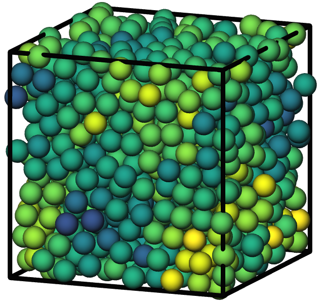
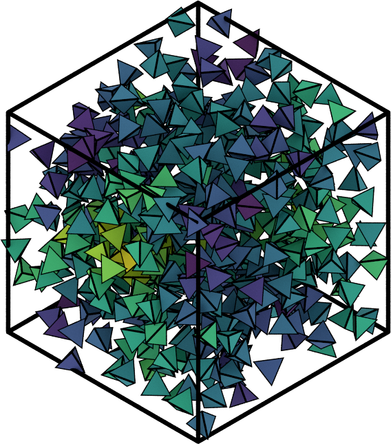
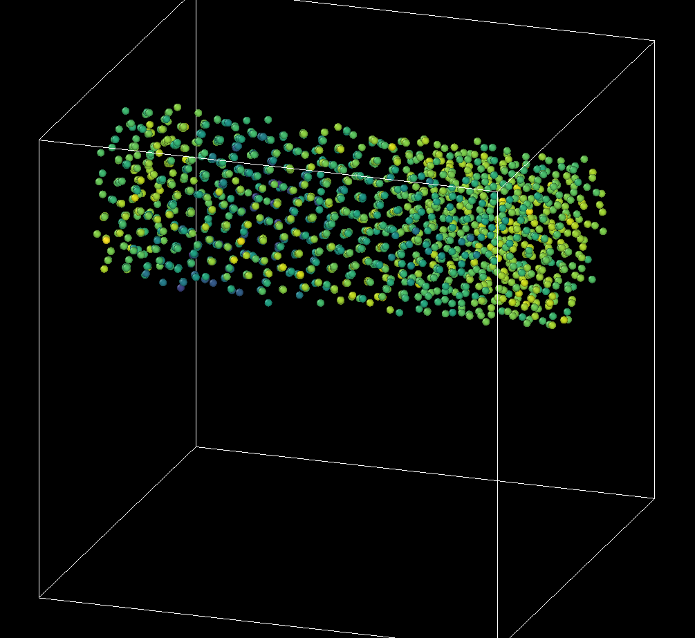

:author: Bradley D. Dice
:email: bdice@umich.edu
:institution: Department of Physics, University of Michigan, Ann Arbor

:author: Vyas Ramasubramani
:email: vramasub@umich.edu
:institution: Department of Chemical Engineering, University of Michigan, Ann Arbor

:author: Eric S. Harper
:email: harperic@umich.edu
:institution: Department of Materials Science & Engineering, University of Michigan, Ann Arbor

:author: Matthew P. Spellings
:email: mspells@umich.edu
:institution: Department of Chemical Engineering, University of Michigan, Ann Arbor

:author: Joshua A. Anderson
:email: joaander@umich.edu
:institution: Department of Chemical Engineering, University of Michigan, Ann Arbor

:author: Sharon C. Glotzer
:email: sglotzer@umich.edu
:institution: Department of Physics, University of Michigan, Ann Arbor
:institution: Department of Chemical Engineering, University of Michigan, Ann Arbor
:institution: Department of Materials Science and Engineering, University of Michigan, Ann Arbor
:institution: Biointerfaces Institute, University of Michigan, Ann Arbor

:bibliography: paper

-------------------------------------------------------------------------------------
Analyzing Particle Systems for Machine Learning and Data Visualization with ``freud``
-------------------------------------------------------------------------------------

.. class:: abstract

The ``freud`` Python library analyzes particle data output from molecular dynamics simulations.
The library's design and its variety of high-performance methods make it a powerful tool for many modern applications.
In particular, ``freud`` can be used as part of the data generation pipeline for machine learning (ML) algorithms for analyzing particle simulations, and it can be easily integrated with various simulation visualization tools for simultaneous visualization and real-time analysis.
Here, we present numerous examples both of using ``freud`` to analyze nano-scale particle systems by coupling traditional simulational analyses to machine learning libraries and of visualizing per-particle quantities calculated by ``freud`` analysis methods.
We include code and examples of this visualization, showing that in general the introduction of ``freud`` into existing ML and visualization workflows is smooth and unintrusive.
We demonstrate that among Python packages used in the computational molecular sciences, ``freud`` offers a unique set of analysis methods with efficient computations and seamless coupling into powerful data analysis pipelines.

.. class:: keywords

   molecular dynamics, analysis, particle simulation, particle system, computational physics, computational chemistry

Introduction
------------

.. figure:: freud_scales.pdf
   :align: center
   :scale: 80 %
   :figclass: w

   Common Python tools for simulation analysis at varying length scales.
   The freud library is designed for nanoscale systems, such as colloidal crystals and nanoparticle assemblies.
   In such systems, interactions are described by coarse-grained models where particles' atomic constituents are often irrelevant and particle anisotropy (non-spherical shape) is common, thus requiring a generalized concept of particle "types" and orientation-sensitive analyses.
   These features contrast the assumptions of most analysis tools designed for biomolecular simulations and materials science.
   :label:`fig:scales`

The availability of "off-the-shelf" molecular dynamics engines (e.g. HOOMD-blue :cite:`Anderson2008,Glaser2015`, LAMMPS :cite:`Plimpton1995`, GROMACS :cite:`Berendsen1995`) has made simulating complex systems possible across many scientific fields.
Simulations of systems ranging from large biomolecules to colloids are now common, allowing researchers to ask new questions about reconfigurable materials :cite:`Cersonsky2018a` and develop coarse-graining approaches to access increasing timescales :cite:`Simon2019`.
Various tools have arisen to facilitate the analysis of these simulations, many of which are immediately interoperable with the most popular simulation tools.
The ``freud`` library is one such analysis package that differentiates itself from others through its focus on colloidal and nano-scale systems.

Due to their diversity and adaptability, colloidal materials are a powerful model system for exploring soft matter physics :cite:`Glotzer2007`.
Such materials are also a viable platform for harnessing photonic :cite:`Cersonsky2018a`, plasmonic :cite:`Tan2011BuildingDNA`, and other useful structurally-derived properties.
In colloidal systems, features like particle anisotropy play an important role in creating complex crystal structures, some of which have no atomic analogues :cite:`Damasceno2012`.
Design spaces encompassing wide ranges of particle morphology :cite:`Damasceno2012` and interparticle interactions :cite:`Adorf2018` have been shown to yield phase diagrams filled with complex behavior.

The ``freud`` Python package offers a unique feature set that targets the analysis of colloidal systems.
The library avoids trajectory management and the analysis of chemically bonded structures, which are the province of most other analysis platforms like MDAnalysis and MDTraj (see also :ref:`fig:scales`) :cite:`Michaud-Agrawal2011,McGibbon2015`.
In particular, ``freud`` excels at performing analyses based on characterizing local particle environments, which makes it a powerful tool for tasks such as calculating order parameters to track crystallization or finding prenucleation clusters.
Among the unique methods present in ``freud`` are the potential of mean force and torque, which allows users to understand the effects of particle anisotropy on entropic self-assembly :cite:`VanAnders2014c,VanAnders2014d,Karas2016,Harper2015,Anderson2017`, and various tools for identifying and clustering particles by their local crystal environments :cite:`Teich2019`.
All such tasks are accelerated by ``freud``'s extremely fast neighbor finding routines and are automatically parallelized, making it an ideal tool for researchers performing peta- or exascale simulations of particle systems.
The ``freud`` library's scalability is exemplified by its use in computing correlation functions on systems of over a million particles, calculations that were used to illuminate the elusive hexatic phase transition in two-dimensional systems of hard polygons :cite:`Anderson2017`.
More details on the use of ``freud`` can be found in :cite:`Ramasubramani2019`.
In this paper, we will demonstrate that ``freud`` is uniquely well-suited to usage in the context of data pipelines for visualization and machine learning applications.

Data Pipelines
==============

The ``freud`` package is especially useful because it can be organically integrated into a data pipeline.
Many research tasks in computational molecular sciences can be expressed in terms of data pipelines; in molecular simulations, such a pipeline typically involves:

1. **Generating** an input file that defines a simulation.
2. **Simulating** the system of interest, saving its trajectory to a file.
3. **Analyzing** the resulting data by computing and storing various quantities.
4. **Visualizing** the trajectory, using colors or styles determined from previous analyses.

However, in modern workflows the lines between these stages is typically blurred, particularly with respect to analysis.
While direct visualization of simulation trajectories can provide insights into the behavior of a system, integrating higher-order analyses is often necessary to provide real-time interpretable visualizations in that allow researchers to identify meaningful features like defects and ordered domains of self-assembled structures.
Studies of complex systems are also often aided or accelerated by a real-time coupling of simulations with on-the-fly analysis.
This simultaneous usage of simulation and analysis is especially relevant because modern machine learning techniques frequently involve wrapping this pipeline entirely within a higher-level optimization problem, since analysis methods can be used to construct objective functions targeting a specific materials design problem, for instance.

Following, we provide demonstrations of how ``freud`` can be integrated with popular tools in the scientific Python ecosystem like TensorFlow, Scikit-learn, SciPy, or Matplotlib.
In the context of machine learning algorithms, we will discuss how the analyses in ``freud`` can reduce the 6N-dimensional space of particle positions and orientations into a tractable set of features that can be fed into machine learning algorithms.
We will further show that ``freud`` can be used for visualizations even outside of scripting contexts, enabling a wide range of forward-thinking applications including Jupyter notebook integrations, versatile 3D renderings, and integration with various standard tools for visualizing simulation trajectories.
These topics are aimed at computational molecular scientists and data scientists alike, with discussions of real-world usage as well as theoretical motivation and conceptual exploration.
The full source code of all examples in this paper can be found online [#]_.

.. [#] https://github.com/glotzerlab/freud-examples

Performance and Integrability
-----------------------------

Using ``freud`` to compute features for machine learning algorithms and visualization is straightforward because it adheres to a UNIX-like philosophy of providing modular, composable features.
This design is evidenced by the library's reliance on NumPy arrays :cite:`Oliphant2006a` for all inputs and outputs, a format that is naturally integrated with most other tools in the scientific Python ecosystem.
In general, the analyses in ``freud`` are designed around analyses of raw particle trajectories, meaning that the inputs are typically :math:`(N, 3)` arrays of particle positions and :math:`(N, 4)` arrays of particle orientations, and analyses that involve many frames over time use `accumulate` methods that are called once for each frame.
This general approach enables ``freud`` to be used for a range of input data, including molecular dynamics and Monte Carlo simulations as well as experimental data (e.g. positions extracted via particle tracking) in both 3D and 2D.
The direct usage of numerical arrays indicates a different usage pattern than that of tools, such as MDAnalysis :cite:`Michaud-Agrawal2011` and MDTraj :cite:`McGibbon2015`, for which trajectory parsing is a core feature.
Due to the existence of many such tools which are capable of reading simulation engines' output files, as well as certain formats like ``gsd`` [#]_ that provide their own parsers, ``freud`` eschews any form of trajectory management and instead relies on other tools to provide input arrays.
If input data is to be read from a file, binary data formats such as ``gsd`` or NumPy's ``npy`` or ``npz`` are strongly preferred for efficient I/O.
Though it is possible to use a library like Pandas to load data stored in a comma-separated value (CSV) or other text-based data format, such files are often much slower when reading and writing large numerical arrays.
Decoupling ``freud`` from file parsing and specific trajectory representations allows it to be efficiently integrated into simulations, machine learning applications, and visualization toolkits with no I/O overhead and limited additional code complexity, while the universal usage of NumPy arrays makes such integrations very natural.

.. [#] https://github.com/glotzerlab/gsd

.. figure:: comparison_12_neighbors.pdf
   :align: center
   :scale: 60 %

   Comparison of runtime for neighbor finding algorithms in ``freud`` and SciPy for varied system sizes. See text for details.
   :label:`fig:scipycomparison`

In keeping with this focus on composable features, ``freud`` also abstracts and directly exposes the task of finding particle neighbors, the task most central to all other analyses in  ``freud``.
Since neighbor finding is a common need, the neighbor finding routines in ``freud`` are highly optimized and natively support periodic systems, a crucial feature for any analysis of particle simulations (which often employ periodic boundary conditions).
In figure :ref:`fig:scipycomparison`, a comparison is shown between the neighbor finding algorithms in ``freud`` and SciPy :cite:`Jones2001`.
For each system size, :math:`N` particles are uniformly distributed in a 3D periodic cube such that each particle has an average of 12 neighbors within a distance of :math:`r_{cut} = 1.0`.
Neighbors are found for each particle by searching within the cutoff distance :math:`r_{cut}`.
The methods compared are ``scipy.spatial.cKDTree``'s ``query_ball_tree``, ``freud.locality.AABBQuery``'s ``queryBall``, and ``freud.locality.LinkCell``'s ``compute``.
The benchmarks were performed with 5 replicates on a 3.6 GHz Intel Core i3-8100B processor with 16 GB 2667 MHz DDR4 RAM.

Evidently, ``freud`` performs very well on this core task and scales well to larger systems.
The parallel C++ backend implemented with Cython and Intel Threading Building Blocks makes ``freud`` perform quickly even for large systems :cite:`Behnel2011,Intel2018`.
Furthermore, ``freud`` supports periodicity in arbitrary triclinic volumes, a common feature found in many simulations.
This support distinguishes it from other tools like ``scipy.spatial.cKDTree``, which only supports cubic boxes.
The fast neighbor finding in ``freud`` and the ease of integrating its outputs into other analyses not only make it easy to add fast new analysis methods into ``freud``, they are also central to why ``freud`` can be easily integrated into workflows for machine learning and visualization.

Machine Learning
----------------

A wide range of problems in soft matter and nano-scale simulations have been addressed using machine learning techniques, such as crystal structure identification :cite:`Spellings2018`.
In machine learning workflows, ``freud`` is used to generate features, which are then used in classification or regression models, clusterings, or dimensionality reduction methods.
For example, Harper et al. used ``freud`` to compute the cubatic order parameter and generate high-dimensional descriptors of structural motifs, which were visualized with t-SNE dimensionality reduction :cite:`Harper2019,vanDerMaaten2008`.
The library has also been used in the optimization and inverse design of pair potentials :cite:`Adorf2018`, to compute fitness functions based on the radial distribution function.
The open-source ``pythia`` [#]_ library offers a number of descriptor sets useful for crystal structure identification, leveraging ``freud`` for fast computations.
Included among the descriptors in ``pythia`` are quantities based on bond angles and distances, spherical harmonics, and Voronoi diagrams.

Computing a set of descriptors tuned for a particular system of interest (e.g. using values of :math:`Q_l`, the higher-order Steinhardt :math:`W_l` parameters, or other order parameters provided by ``freud``) is possible with just a few lines of code.
Descriptors like these (exemplified in the ``pythia`` library) have been used with TensorFlow for supervised and unsupervised learning of crystal structures in complex phase diagrams :cite:`Spellings2018,TensorFlow2015`.

.. [#] https://github.com/glotzerlab/pythia

Another useful module for machine learning with ``freud`` is ``freud.cluster``, which uses a distance-based cutoff to locate clusters of particles while accounting for 2D or 3D periodicity.
Locating clusters in this way can identify crystalline grains, helpful for building a training set for machine learning models.

To demonstrate a concrete example, we focus on a common challenge in molecular sciences: identifying crystal structures.
Recently, several approaches have been developed that use machine learning for detecting ordered phases :cite:`Schoenholz2015,Spellings2018,Fulford2019,Steinhardt1983,Lechner2008`.
The Steinhardt order parameters are often used as a structural fingerprint, and are derived from rotationally invariant combinations of spherical harmonics.
In the example below, we create face-centered cubic (fcc), body-centered cubic (bcc), and simple cubic (sc) crystals with added Gaussian noise, and use Steinhardt order parameters with a support vector machine to train a simple crystal structure identifier.
Steinhardt order parameters characterize the spherical arrangement of neighbors around a central particle, and combining values of
:math:`Q_l` for a range of :math:`l` often gives a unique signature for simple crystal structures.
This example demonstrates a simple case of how ``freud`` can be used to help solve the problem of structural identification, which often requires a sophisticated approach for complex crystals.

.. figure:: noisy_structures_q6.pdf
   :align: center
   :scale: 100 %

   Histogram of the Steinhardt :math:`Q_6` order parameter for 4000 particles in simple cubic, body-centered cubic, and face-centered cubic structures with added Gaussian noise.
   :label:`fig:noisystructuresq6`

In figure :ref:`fig:noisystructuresq6`, we show the distribution of :math:`Q_6` values for sample structures with 4000 particles.
Here, we demonstrate how to compute the Steinhardt :math:`Q_6`, using neighbors found via a periodic Voronoi diagram.
Neighbors with small facets in the Voronoi polytope are filtered out to reduce noise.

.. code-block:: python

   import freud
   import numpy as np
   from util import make_fcc

   def get_features(box, positions, structure):
       # Create a Voronoi compute object
       voro = freud.voronoi.Voronoi(
           box, buff=max(box.L)/2)
       voro.computeNeighbors(positions)

       # Filter the Voronoi NeighborList
       nlist = voro.nlist
       nlist.filter(nlist.weights > 0.1)

       # Compute Steinhardt order parameters
       features = {}
       for l in [4, 6, 8, 10, 12]:
           ql = freud.order.LocalQl(
               box, rmax=max(box.L)/2, l=l)
           ql.compute(positions, nlist)
           features['q{}'.format(l)] = ql.Ql.copy()

       return features

   # Create a freud box object and an array of
   # 3D positions for a face-centered cubic
   # structure with 4000 particles
   fcc_box, fcc_positions = make_fcc(
       nx=10, ny=10, nz=10, noise=0.1)

   structures = {}
   structures['fcc'] = get_features(
       fcc_box, fcc_positions, 'fcc')
   # ... repeat for all structures

Then, using Pandas and Scikit-learn, we can train a support vector machine to identify these structures:

.. code-block:: python

   # Build dictionary of DataFrames,
   # labeled by structure
   structure_dfs = {}
   for i, struct in enumerate(structures):
       df = pd.DataFrame.from_dict(structures[struct])
       df['class'] = i
       structure_dfs[struct] = df

   # Combine DataFrames for input to SVM
   df = pd.concat(structure_dfs.values())
   df = df.reset_index(drop=True)

   from sklearn.preprocessing import normalize
   from sklearn.model_selection import train_test_split
   from sklearn.svm import SVC

   # We use the normalized Steinhardt order parameters
   # to predict the crystal structure
   X = df.drop('class', axis=1).values
   X = normalize(X)
   y = df['class'].values
   X_train, X_test, y_train, y_test = train_test_split(
       X, y, test_size=0.33, random_state=42)

   svm = SVC()
   svm.fit(X_train, y_train)
   print('Score:', svm.score(X_test, y_test))
   # The model is ~98% accurate.

To interpret crystal identification models like this, it can be helpful to use a dimensionality reduction tool such as Uniform Manifold Approximation and Projection (UMAP) :cite:`McInnes2018`, as shown in figure :ref:`fig:steinhardtumap`.
The low-dimensional UMAP projection shown is generated directly from the Pandas ``DataFrame``:

.. code-block:: python

    from umap import UMAP
    umap = UMAP()

    # Project the high-dimensional descriptors
    # to a two dimensional manifold
    data = umap.fit_transform(df)
    plt.plot(data[:, 0], data[:, 1])

.. figure:: steinhardt_umap.pdf
   :align: center
   :scale: 80 %

   UMAP of particle descriptors computed for simple cubic, body-centered cubic, and face-centered cubic structures of 4000 particles with added Gaussian noise.
   The particle descriptors include :math:`Q_l` for :math:`l \in \{4, 6, 8, 10, 12\}`.
   Some noisy configurations of bcc can be confused as fcc and vice versa, which accounts for the small number of errors in the support vector machine's test classification.
   :label:`fig:steinhardtumap`

Visualization
-------------

Many analyses performed by the ``freud`` library provide a ``plot(ax=None)`` method (new in v1.2.0) that allows their computed quantities to be visualized with Matplotlib.
Additionally, these plottable analyses offer IPython representations, allowing Jupyter notebooks to render a graph such as a radial distribution function :math:`g(r)` just by returning the compute object at the end of a cell.
Analyses like the radial distribution function or correlation functions return data that is binned as a one-dimensional histogram -- these are visualized with a line graph via ``matplotlib.pyplot.plot``, with the bin locations and bin counts given by properties of the compute object.
Other classes provide multi-dimensional histograms, like the Gaussian density or Potential of Mean Force and Torque, which are plotted with ``matplotlib.pyplot.imshow``.

The most complex case for visualization is that of per-particle properties, which also comprises some of the most useful features in ``freud``.
Quantities that are computed on a per-particle level can be continuous (e.g. Steinhardt order parameters) or discrete (e.g. clustering, where the integer value corresponds to a unique cluster ID).
Continuous quantities can be plotted as a histogram over particles, but typically the most helpful visualizations use these quantities with a color map assigned to particles in a two- or three-dimensional view of the system itself.
For such particle visualizations, several open-source tools exist that interoperate well with ``freud``.
Below are examples of how one can integrate ``freud`` with ``plato`` [#]_, ``fresnel`` [#]_, and OVITO [#]_ :cite:`Stukowski2010`.

.. [#] https://github.com/glotzerlab/plato
.. [#] https://github.com/glotzerlab/fresnel
.. [#] https://ovito.org/

plato
=====

   Interactive visualization of a Lennard-Jones particle system, rendered in a Jupyter notebook using ``plato`` with the ``pythreejs`` backend.
   :label:`fig:platopythreejs`

``plato`` is an open-source graphics package that expresses a common interface for defining two- or three-dimensional scenes which can be rendered as an interactive Jupyter widget or saved to a high-resolution image using one of several backends (PyThreejs, Matplotlib, ``fresnel``, POVray [#]_, and Blender [#]_, among others).
Below is an example of how to render particles from a HOOMD-blue snapshot, colored by the density of their local environment :cite:`Anderson2008,Glaser2015`.
The result is shown in figure :ref:`fig:platopythreejs`.

.. [#] https://www.povray.org/
.. [#] https://www.blender.org/

.. code-block:: python

   import plato
   import plato.draw.pythreejs as draw
   import numpy as np
   import matplotlib.cm
   import freud
   from sklearn.preprocessing import minmax_scale

   # snap comes from a previous HOOMD-blue simulation
   box = freud.box.Box.from_box(snap.box)
   positions = snap.particles.position

   # Compute the local density of each particle
   ld = freud.density.LocalDensity(
       r_cut=3.0, volume=1.0, diameter=1.0)
   ld.compute(box, positions)

   # Create a scene for visualization,
   # colored by local density
   radii = 0.5 * np.ones(len(positions))
   colors = matplotlib.cm.viridis(
       minmax_scale(ld.density))
   spheres_primitive = draw.Spheres(
       positions=positions,
       radii=radii,
       colors=colors)
   scene = draw.Scene(spheres_primitive, zoom=2)
   scene.show()  # Interactive view in Jupyter

fresnel
=======

   Hard tetrahedra colored by local density, path traced with ``fresnel``.
   :label:`fig:fresneltetrahedra`

``fresnel`` [#]_ is a GPU-accelerated ray tracer designed for particle simulations, with customizable material types and scene lighting, as well as support for a set of common anisotropic shapes.
Its feature set is especially well suited for publication-quality graphics.
Its use of ray tracing also means that an image's rendering time scales most strongly with the image size, instead of the number of particles -- a desirable feature for extremely large simulations.
An example of how to integrate ``fresnel`` is shown below and rendered in figure :ref:`fig:fresneltetrahedra`.

.. [#] https://github.com/glotzerlab/fresnel

.. code-block:: python

    # Generate a snapshot of tetrahedra using HOOMD-blue
    import hoomd
    import hoomd.hpmc
    hoomd.context.initialize('')

    # Create an 8x8x8 simple cubic lattice
    system = hoomd.init.create_lattice(
        unitcell=hoomd.lattice.sc(a=1.5), n=8)

    # Create tetrahedra, configure HPMC integrator
    mc = hoomd.hpmc.integrate.convex_polyhedron(seed=123)
    mc.set_params(d=0.2, a=0.1)
    vertices = [( 0.5, 0.5, 0.5),
                (-0.5,-0.5, 0.5),
                (-0.5, 0.5,-0.5),
                ( 0.5,-0.5,-0.5)]
    mc.shape_param.set('A', vertices=vertices)

    # Run for 5,000 steps
    hoomd.run(5e3)
    snap = system.take_snapshot()

    # Import analysis & visualization libraries
    import fresnel
    import freud
    import matplotlib.cm
    from matplotlib.colors import Normalize
    import numpy as np
    device = fresnel.Device()

    # Compute local density and prepare geometry
    poly_info = \
        fresnel.util.convex_polyhedron_from_vertices(
            vertices)
    positions = snap.particles.position
    orientations = snap.particles.orientation
    box = freud.box.Box.from_box(snap.box)
    ld = freud.density.LocalDensity(3.0, 1.0, 1.0)
    ld.compute(box, positions)
    colors = matplotlib.cm.viridis(
        Normalize()(ld.density))
    box_points = np.asarray([
        box.makeCoordinates(
            [[0, 0, 0], [0, 0, 0], [0, 0, 0],
             [1, 1, 0], [1, 1, 0], [1, 1, 0],
             [0, 1, 1], [0, 1, 1], [0, 1, 1],
             [1, 0, 1], [1, 0, 1], [1, 0, 1]]),
        box.makeCoordinates(
            [[1, 0, 0], [0, 1, 0], [0, 0, 1],
             [1, 0, 0], [0, 1, 0], [1, 1, 1],
             [1, 1, 1], [0, 1, 0], [0, 0, 1],
             [0, 0, 1], [1, 1, 1], [1, 0, 0]])])

    # Create scene
    scene = fresnel.Scene(device)
    geometry = fresnel.geometry.ConvexPolyhedron(
        scene, poly_info,
        position=positions,
        orientation=orientations,
        color=fresnel.color.linear(colors))
    geometry.material = fresnel.material.Material(
        color=fresnel.color.linear([0.25, 0.5, 0.9]),
        roughness=0.8, primitive_color_mix=1.0)
    geometry.outline_width = 0.05
    box_geometry = fresnel.geometry.Cylinder(
        scene, points=box_points.swapaxes(0, 1))
    box_geometry.radius[:] = 0.1
    box_geometry.color[:] = np.tile(
        [0, 0, 0], (12, 2, 1))
    box_geometry.material.primitive_color_mix = 1.0
    scene.camera = fresnel.camera.fit(
        scene, view='isometric', margin=0.1)
    scene.lights = fresnel.light.lightbox()

    # Path trace the scene
    fresnel.pathtrace(scene, light_samples=64,
                      w=800, h=800)

OVITO
=====

   A crystalline grain identified using ``freud``'s ``LocalDensity`` module and cut out for display using OVITO. The image shows a tP30-CrFe structure formed from an isotropic pair potential optimized to generate this structure :cite:`Adorf2018`.
   :label:`fig:ovitoselection`

OVITO is a GUI application with features for particle selection, making movies, and support for many trajectory formats :cite:`Stukowski2010`.
OVITO has several built-in analysis functions (e.g. Polyhedral Template Matching), which complement the methods in ``freud``.
The Python scripting functionality built into OVITO enables the use of  ``freud`` modules, demonstrated in the code below and shown in figure :ref:`fig:ovitoselection`.

.. code-block:: python

   import freud

   def modify(frame, input, output):

       if input.particles != None:
           box = freud.box.Box.from_matrix(
               input.cell.matrix)
           ld = freud.density.LocalDensity(
               r_cut=3, volume=1, diameter=0.05)
           ld.compute(box, input.particles.position)
           output.create_user_particle_property(
               name='LocalDensity',
               data_type=float,
               data=ld.density.copy())

Conclusions
-----------

The ``freud`` library offers a unique set of high-performance algorithms designed to accelerate the study of nanoscale and colloidal systems.
These algorithms are enabled by a fast, easy-to-use set of tools for identifying particle neighbors, a common first step in nearly all such analyses.
The efficiency of both the core neighbor finding algorithms and the higher-level analyses makes them suitable for incorporation into real-time visualization environments, and, in conjunction with the transparent NumPy-based interface, allows integration into machine learning workflows using iterative optimization routines that require frequent recomputation of these analyses.
The use of ``freud`` for real-time visualization has the potential to simplify and accelerate existing simulation visualization pipelines, which typically involve slower and less easily integrable solutions to performing real-time analysis during visualization.
The application of ``freud`` to machine learning, on the other hand, opens up entirely new avenues of research based on treating well-known analyses of particle simulations as descriptors or optimization targets.
In these ways, ``freud`` can facilitate research in the field of computational molecular science, and we hope these examples will spark new ideas for scientific exploration in this field.

Getting ``freud``
-----------------

The ``freud`` library is tested for Python 2.7 and 3.5+ and is compatible with Linux, macOS, and Windows.
To install ``freud``, execute

.. code-block:: bash

    conda install -c conda-forge freud

or

.. code-block:: bash

    pip install freud-analysis

Its source code is available on GitHub [#]_ and its documentation is available via ReadTheDocs [#]_.

.. [#] https://github.com/glotzerlab/freud
.. [#] https://freud.readthedocs.io/

Acknowledgments
---------------

Thanks to Jin Soo Ihm for benchmarking the neighbor finding features of ``freud`` against SciPy.
The ``freud`` library's code development and public code releases are supported by the National Science Foundation, Division of Materials Research under a Computational and Data-Enabled Science & Engineering Award # DMR 1409620 (2014-2018) and the Office of Advanced Cyberinfrastructure Award # OAC 1835612 (2018-2021).
B.D. is supported by a National Science Foundation Graduate Research Fellowship Grant DGE 1256260.
M.P.S acknowledges funding from the Toyota Research Institute; this article solely reflects the opinions and conclusions of its authors and not TRI or any other Toyota entity.
Data for Figure 7 generated on the Extreme Science and Engineering Discovery Environment (XSEDE), which is supported by National Science Foundation grant number ACI-1053575; XSEDE award DMR 140129.
