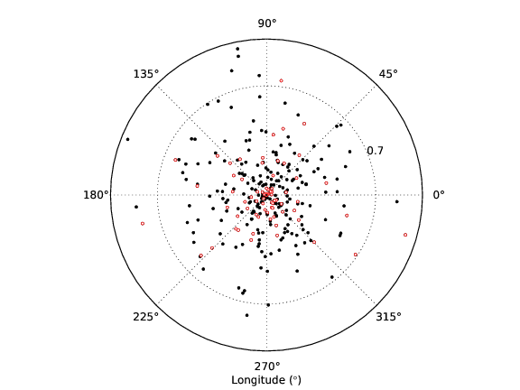
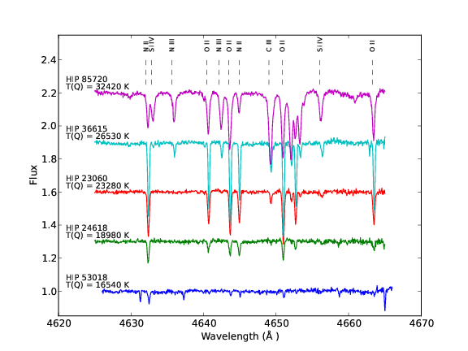
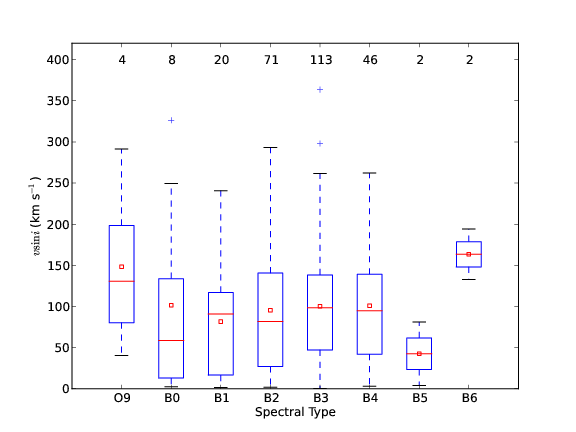

:author: Gustavo Bragança
:email: ga.braganca@gmail.com
:institution: Observatório Nacional, Brazil

:author: Simone Daflon
:email: daflon@on.br
:institution: Observatório Nacional, Brazil

:author: Katia Cunha
:email: cunha@email.noao.edu
:institution: Observatório Nacional, Brazil; National Optical Astronomy
              Observatory, University of Arizona, U. S. A.

:author: Thomas Bensby
:email: tbensby@astro.lu.se
:institution: Lund Observatory, Sweden

:author: Sally Oey
:email: msoey@umich.edu
:institution: University of Michigan, U. S. A.

:author: Gregory Walth
:email: gwalth@email.arizona.edu
:institution: Steward Observatory, U. S. A.

--------------------------------------------------------------------
Using Python to Study Rotational Velocity Distributions of Hot Stars
--------------------------------------------------------------------

.. class:: abstract

   Stars are fundamental pieces that compose our Universe. By
   studying them we can better comprehend the environment in which we
   live. In this work, we have studied a sample of 350 nearby O and B
   stars and have  characterized them in aspects of their multiplicity,
   temperature, spectral classifications, and projected rotational
   velocity.

   Python is a robust language with a steep learning curve, i.e. one
   can make rapid progress with it. In this proceeding, we will
   present how we used Python in our research.

.. class:: keywords

   Astronomy, Stars, Galactic Disk

Introduction
------------

The study of O and B stars is an important key to understanding how star
formation occurs. When these stars are born, they have the greatest mass,
temperature and rotation. Their mass can go from 2.5 up to 120 times
the Solar mass, their temperatures ranging from 11,000 K up to 60,000 K,
and rotation up to 400 km/s.

By definition, a star is born when it starts synthesizing Hydrogen into
Helium through nuclear fusion. The star performs this nucleosynthesis
during some 90% of their life. When stars are at this stage, they
are called dwarfs. Most of the studied stars on this work are dwarfs.
Due to their young age, dwarf stars have not lost too much of their
mass, and so, the majority of their stellar properties are kept unchanged.
This helps us understand how these stars formed.

Stars are born inside molecular clouds and, usually, a molecular cloud
can generate several stars. After their formation, these stars compose
a stellar association, that, in its infancy, is still gravitationally
bounded. With their unchanged properties, it is possible to trace the
membership of these stars and then verify if some stars are from the
same association.

The Python programming language is very powerful, robust, clean and
easy to learn.
The scripting nature allows the
programmer to have a dynamic workflow and not lose too much time
with debugging and compiling.
With a set of packages, like `Scipy <http://www.scipy.org/>`__,
`Numpy <http://www.numpy.org/>`__ and
`Matplotlib <http://matplotlib.org/>`__, Python becomes very suited for
scientific research.
On the last years,
it has been widely adopted in the Astronomic community and
several astronomical packages are being translated to Python or just recently
being created.
All of these motivated us to use Python in our research.

In this proceedings, we relate how we used Python in our research. A
more profound scientific analysis can be found at [Brag12]_.

Research development
--------------------

Sample Characterization
~~~~~~~~~~~~~~~~~~~~~~~

The observed sample of stars is displayed in Figure :ref:`coords` in
terms of their Galactic longitude and heliocentric distance projected
onto the Galactic plane. The stars in the sample are all nearby
(:math:`\sim80`\% are within 700 pc) and relatively bright
(:math:`V\sim 5-10`).

We used Python allied to the Matplotlib package to construct the plot
presented in Figure :ref:`coords` and all plots of this work. The code
for this plot is:

.. code-block:: python

   import numpy as np
   import matplotlib.pyplot as plt

   # Distance projected on the Galactic plane
   proj_dist = distance_vector * np.cos(latitude_vector)

   plt.polar(longitude_vector, proj_dist, 'k.')
   for i in binary_list:
       for j, star in enumerate(stars_id_list):
           #Compare stellar IDs
           if i == star:
               plt.plot(longitude_vector[j],
                        proj_dist[j],
                        'wo', ms=3, mec='r')
   # Configure aesthetics and save
   plt.ylim([0,1])
   plt.yticks([0.7]])
   plt.xlabel(u'Longitude (${\degree}$)')

   Polar plot showing the positions of the sample stars projected onto
   the Galactic plane. The plot is centered on the Sun. The open red
   circles are spectroscopic binaries/multiple systems identified in
   our sample. :label:`coords`

As we have said before, stars usually are born in groups.
Thus, a great majority of them are binaries or belong to multiple
systems. For a spectroscopic study, as was this, the only problem
occurs when the spectrum of one observation has two or more objects.
The identification of these objects was done on a visual inspection
and with support of the works of [Lefe09]_ and [Egle08]_.
Since the study of these stars was outside the scope of our project,
we discarded them. These objects are represented in Figure
:ref:`coords` as red circles.

Our sample is composed of high-resolution spectroscopic observations
with wavelength coverage from 3350 up to 9500 Angstrons.
Sample spectra are shown
in Figure :ref:`spectra` in the spectral region between 4625 and
4665 Angstrom, which contains spectral lines of C, N, O, and Si. The
code to plot this Figure is:

.. code-block:: python

   # set some constants
   # stars ID
   HIP = ['53018', '24618', '23060', '36615', '85720']
   # temperature of each star
   T = ['16540', '18980', '23280', '26530', '32420']
   # spectral lines to be identified
   lines = ['N II', 'Si IV', 'N III', 'O II', 'N III',
            'O II', 'N II', 'C III', 'O II', 'Si IV',
            'O II']
   # wavelength of spectral lines
   lines_coord = [4632.05, 4632.80, 4635.60, 4640.45,
                  4642.10, 4643.50, 4644.89, 4649.00,
                  4650.84, 4656.00, 4663.25]
   # displacement values
   displace = [0, 0.3, 0.6, 0.9, 1.2]

   # iterate on stars
   for i, star_id in enumerate(HIP):
      # load spectra
      norm = np.loadtxt('HIP' + star_id + '.dat')
      # if it is the first star,
      # make small correction on wavelength
           if i == 0:
         norm[:,0] += 1
      # plot and add texts
      plt.plot(norm[:,0], norm[:,1] + displace[i], '-')
      plt.text(4621, 1.065 + displace[i],
               'HIP '+ star_id, fontsize = 10)
      plt.text(4621, 1.02 + displace[i],
               'T(Q) = ' + T[i] + ' K', fontsize = 10)

   # add line identification
   for i, line_id in enumerate(lines):
      plt.vlines(lines_coord[i], 2.25, 2.40,
                 linestyles = 'dashed', lw=0.5)
      plt.text(lines_coord[i], 2.45, line_id,
               fontsize = 8, ha = 'center',
               va = 'bottom', rotation =' vertical')

   # define aesthetics and save
   plt.xlabel(u'Wavelength (\u212B )')
   plt.ylabel('Flux')
   plt.axis([4620, 4670, 0.85, 2.55])

   Example spectra of five sample stars in the region 4625-4665
   Angstrom. Some spectral lines are identified. The spectra were
   arbitrarily displaced in intensity for better viewing.
   :label:`spectra`

To analyze the spectra images we have used `IRAF <http://iraf.noao.
edu/>`__ (Image and Reduction Analysis Facility), which is a suite of
softwares to handle astronomic images developed by the NOAO [1]_.
We had to do several tasks on our spectra (e.g. slice them at a certain
wavelength and normalization) to prepare our sample for further
analysis. Some of these tasks had to be done manually and on a
one-by-one basis, but some others were automated. The automation could
have been done through IRAF scrips, but fortunately, the
STSCI [2]_ has developed a Python wrapper for IRAF called
`PyRAF <http://www.stsci.edu/institute/software_hardware/pyraf>`__.
For example, we show how we used the IRAF task SCOPY to cut images from a
list using pyRAF:

.. [1] National Optical Astronomy Observatory
.. [2] Space Telescope Science Institute

.. code-block:: python

   from pyraf import iraf

   # Starting wavelength
   iraf.noao.onedspec.scopy.w1 = 4050
   # Ending wavelength
   iraf.noao.onedspec.scopy.w2 = 4090

   for name in list_of_stars:
       # Spectrum to be cut
       iraf.noao.onedspec.scopy.input = name
       # Name of resulting spectrum
       result = name.split('.fits')[0] + '_cut.fits'
       iraf.noao.onedspec.scopy.output = result
       # Execute
       iraf.noao.onedspec.scopy(mode = 'h')

We also have performed a spectral classification on the stars and,
since this was not done using Python, more information can be obtained
from the original paper.

We have obtained effective temperature (Teff) from a calibration
presented in [Mass89]_ that uses the photometric reddening-free
parameter index :math:`Q` ([John58]_).

A histogram showing the distribution of effective temperatures for OB
stars with available photometry is shown in Figure :ref:`TqHist`.
The effective temperatures of the target sample peak around 17,000 K,
with most stars being cooler than 28,000 K.

.. figure:: f6.png

   Histogram showing the distribution of effective temperatures for the
   studied sample. :label:`TqHist`

Projected rotational velocities
~~~~~~~~~~~~~~~~~~~~~~~~~~~~~~~

We have obtained projected rotational velocities (:math:`v\sin i`) for
266 stars of our sample (after rejecting spectroscopic
binaries/multiple systems) using measurements of full width at half 
maximum of He I lines and interpolation in a synthetic grid from
[Dafl07]_.
We did not use Python to obtain :math:`v\sin i`, so, for more
information, we suggest the reader to look in the original paper.
However, to analyze the stars :math:`v\sin i` we used Python, especially
the matplotlib package for visualization analysis and the
`Scipy.stats <http://docs.scipy.org/doc/scipy/reference/stats.html>`__
package for statistics analysis.

The `boxplot <http://en.wikipedia.org/wiki/Box_plot>`__
is a great plot to compare several distributions side by
side. In this work, we used a boxplot to analyze the :math:`v\sin i`
for each spectral type subset, as can be seen in Figure :ref:`boxplot`.
The average :math:`v\sin i` for the stars in each spectral type bin
is roughly constant, even considering the least populated bins.
The code used to plot it was:

   Box plot for the studied stars in terms of the spectral type.
   The average :math:`v\sin i` for the stars in each spectral type bin
   is roughly constant, even considering the least populated bins.
   :label:`boxplot`

.. code-block:: python

   #Start boxplot
   bp = plt.boxplot(box, notch=0)
   # Define color of medians
   plt.setp(bp['medians'], color='red')
   # Add small box on the mean values
   plt.scatter(range(1,9), mean_vector,
               c='w', marker='s', edgecolor='r')
   # Set labl for the axis
   plt.xlabel(u'Spectral Type')
   plt.ylabel(r'$v\sin i$ (km s$^{-1}$)')
   # Set limit for the axis
   plt.axis([0, 9, 0, 420])
   # Set spectral types on the x-axis
   plt.xticks(range(1,9), ['O9', 'B0', 'B1',
              'B2', 'B3', 'B4', 'B5', 'B6'])
   # Put a text with the number of objects on each bin
   [plt.text(i+1, 395, WSint(length[i]), fontsize=12,
    horizontalalignment='center') for i in range(0,8)]
   # Save figure

And the distribution of :math:`v\sin i` for the stars of our sample is
presented on Figure :ref:`vsiniDist`. The distribution has
a modest peak at low :math:`v\sin i` (:math:`\sim0-50` km/s) but it is
overall flat (a broad distribution) for :math:`v\sin i` roughly between
0 and 150 km/s; the number of stars drops for higher values of
:math:`v\sin i`. [Abt02]_ provide the cornerstone work of the
distributions of projected rotational velocities of the so-called
field OB stars. To compare our sample with Abt's, we subselected our
sample on magnitude and Abt's sample on spectral type. Both
distributions are shown on the bottom panel of Figure :ref:`vsiniDist`.
The code used to build this plot follows:

.. figure:: f8.png

   Histogram of :math:`v\sin i` distribution of our sample on the top
   panel. The bottom panel compares the normalized distribution of a
   subsample of stars in our sample with a magnitude cut in
   :math:`V = 6.5` and a sample with 312 field stars (spectral types
   O9–B4 IV/V) culled from [Abt02]_.
   :label:`vsiniDist`

.. code-block:: python

   # Plot vsini distribution
   # Top Panel
   ax1 = plt.subplot2grid((3, 1),(0, 0), rowspan = 2)
   #Create histogram
   ax1.hist(vsini_vector, np.arange(0,400,50),
            histtype = 'step', ec='black',
            color='white', label = 'This study')
   # Configure aesthetics
   ax1.set_ylabel(r'Number of stars')
   ax1.legend(loc = 'upper right')
   ax1.set_xticks([])
   ax1.set_yticks(range(0,100,20))
   # Bottom Panel
   # Plot our sample subselected on V < 6.5
   ax2 = plt.subplot2grid((3, 1), (2, 0))
   # Set weights to obtain a normalized distribution
   weights = np.zeros_like(brighter_than_65) +
             1./brighter_than_65.size
   # Plot Abt's subselected sample
   ax2.hist(brighter_than_65, np.arange(0, 400, 50),
            weights = weights, histtype = 'step',
            ec='black', color='white',
            label = 'This study (V<6.5)')
   # Set weights to obtain a normalized distribution
   weights = np.zeros_like(abtS)+1./abtS.size
   ax2.hist(abtS, np.arange(0,400,50), weights = weights,
            histtype = 'step', ec='black', color='white',
            ls= 'dashed',
            label = 'Abt et al. (2002) O9-B4 IV/V')
   # Configure aesthetics and save
   ax2.set_xlabel(r'$v\sin i$ (km s$^{-1}$)')
   ax2.set_ylabel(r'Percentage of stars')
   ax2.legend(loc = 'upper right',prop={'size':13})
   ax2.set_yticks(np.arange(0,0.5,0.1))
   ax2.set_ylim([0,0.45])
   plt.subplots_adjust(hspace=0)

There is evidence that there are real differences between the
:math:`v\sin i` distributions of cluster members when compared to
field ([Wolf07]_, [Huan08]_); there are fewer slow rotators in the
clusters when compared to
the field or the stars in clusters tend to rotate faster.
Using literature results ([Hump84]_, [Brow94]_, [Zeeu99]_, [Robi99]_,
[Merm03]_, [Tetz11]_), we separated our sample into four different
categories according to the star's membership: field,
cluster, association and runaway.
We have merged our sample with that of [Dafl07]_ in which their results
were obtained using the same methodology as ours.
We present in Figure :ref:`ClusterAssociation` the distributions of
stars belonging to clusters and from associations.

.. figure:: f9.png

   Distribution of :math:`v\sin i` for the studied samples of OB
   association (top panel) and cluster members (lower panel) are shown
   as red dashed line histograms.
   The black solid line histograms represent the combined sample: stars
   in this study plus 143 star members of clusters and associations
   from [Dafl07]_. Both studies use the same methodology to derive
   :math:`v\sin i`.
   :label:`ClusterAssociation`

We have used the Kolmogorov-Smirnov (KS) statistics to test the null
hypothesis that membership subsamples are drawn from the same
population. For this we used the `ks_2samp
<http://docs.scipy.org/doc/scipy/reference/generated/scipy.stats.
ks_2samp.html#scipy.stats.ks_2samp>`__
task available on the
`scipy.stats <http://docs.scipy.org/doc/scipy/reference/stats.html>`__
package. The resulting values are available in Table
:ref:`mtable`. Note that, any differences
between the distributions of clusters and associations in this
study are not very clear and may not be statistically significant;
larger studies are needed. Also, the runaway subsample  seems to be
more associated with the dense cluster environments, as expected
from a dynamical ejection scenario.

.. table:: Resulting values for the KS test for the membership
           groups. :label:`mtable`

   +-------------+-------+-------------+---------+---------+
   |             | Field | Association | Cluster | Runaway |
   +-------------+-------+-------------+---------+---------+
   | Field       |   --  |    92%      |   88%   |   18%   |
   +-------------+-------+-------------+---------+---------+
   | Association |   92% |    --       |   50%   |   40%   |
   +-------------+-------+-------------+---------+---------+
   | Cluster     |   88% |    50%      |   --    |   71%   |
   +-------------+-------+-------------+---------+---------+
   | Runaway     |  18%  |    40%      |   71%   |   --    |
   +-------------+-------+-------------+---------+---------+

Conclusions
-----------

We have investigated a sample of 350 OB stars from the nearby Galactic
disk. Our focus was to realize a first characterization of this sample.
We obtained effective temperature using a photometric calibration and
determined that the temperature distribution peaks around 17,000 K,
with most stars being cooler than 28,000 K.

We calculated the projected
rotational velocities using the full width at half measure of He I
lines and found that the distribution has
a modest peak at low :math:`v\sin i` (:math:`\sim0-50` km/s) but it is
overall flat (a broad distribution) for :math:`v\sin i` roughly between
0 and 150 km/s; the number of stars drops for higher values of
:math:`v\sin i`.

We subselected our sample on a membership basis and, when the OB
association and cluster populations are compared with the field sample,
it is found that the latter has a larger fraction of slowest rotators,
as previously shown by other works. In fact, there seems to be
a gradation from cluster to OB association to field in :math:`v\sin i`
distribution.

We have constantly used Python in the development of this work. In our
view, the advantages of Python are the facility of learning, the robust
packages for science and data analysis, a plot package that renders
beautiful plots in a fast and easy way, and the increase of packages
for the astronomic community.

Acknowledgments
~~~~~~~~~~~~~~~

We warmly thank Marcelo Borges, Catherine Garmany, John
Glaspey, and Joel Lamb for fruitful discussion that greatly improved
the original work.
G.A.B. thanks the hospitality of University of
Michigan and of NOAO on his visit, Leonardo Uieda and Katy Huff for their 
help in this proceedings and also thanks all
Python developers for their great work. G.A.B. also acknowledges
Conselho Nacional de
Desenvolvimento Científico e Tecnológico (CNPq-Brazil) and Coordenação
de Aperfeiçoamento de Pessoas de Nível Superior
(CAPES - Brazil) for his fellowship.
T.B. was funded by grant
No. 621-2009-3911 from the Swedish Research Council (VR).
M.S.O. and T.B. were supported in part by NSF-AST0448900.
M.S.O. warmly thanks NOAO for the hospitality of a sabbatical
visit. K.C. acknowledges funding from NSF grant AST-907873.
This research has made use of the SIMBAD database, operated
at CDS, Strasbourg, France.

References
----------

.. [Abt02]  Abt, H. A., Levato, H., Grosso, M., Astrophysical Journal,
            573: 359, 2002
.. [Brag12] Braganca, G. A, et al., Astronomical Journal, 144:130, 2012.
.. [Brow94] Brown, A. G. A., de Geus, E. J., de Zeeuw, P. T.,
            Astronomy \& Astrophysics, 289: 101, 1994
.. [Dafl07] Daflon, S., Cunha, K., de Araujo, F. S. W., & Przybilla,
            N., Astronomical Journal, 134:1570, 2007
.. [Egle08] Eggleton, P. P., & Tokovinin, A. A., M.N.R.A.S.,
            389:869, 2008
.. [John58] Johnson, H. L., Lowell Obs. Bull., 4:37, 1958
.. [Huan08] Huang, W., & Gies, D. R., Astronomical Journal, 683: 1045,
            2008
.. [Hump84] Humphreys, R. M., McElroy, D. B.,
            Astrophysical  Journal, 284:565, 1984
.. [Lefe09] Lefevre, L., Marchenko, S. V., Moffat, A. F. J., Acker, A.,
            Astronomy \& Astrophysics, 507:1141, 2009
.. [Mass89] Massey, P., Silkey, M., Garmany, C. D., Degioia-Eastwood,
            K., Astronomical Journal, 97:107, 1989,
.. [Merm03] Mermilliod, J.-C., Paunzen, E.,
            Astronomy \& Astrophysics, 410:51, 2003
.. [Robi99] Robichon, N., Arenou, F., Mermilliod, J.-C., Turon, C.,
            Astronomy \& Astrophysics, 345:471, 1999
.. [Tetz11] Tetzlaff, N., Neuhäuser, R., Hohle, M. M., M.N.R.A.S.,
            410:190, 2011
.. [Wolf07] Wolff, S. C., Strom, S. E., Dror, D., & Venn, K.,
            Astronomical Journal, 133:1092, 2007

.. [Zeeu99] de Zeeuw, P. T., Hoogerwerf, R., de Bruijne, J. H. J.,
            Brown, A. G. A., Blaauw, A., Astronomical Journal,
            117:354, 1999
