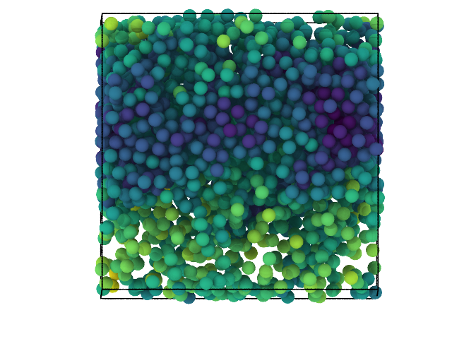

:author: Brandon L. Butler
:email: butlerbr@umich.edu
:orcid: 0000-0001-7739-7796
:institution: University of Michigan, Department of Chemical Engineering

:author: Vyas Ramasubramani
:orcid: 0000-0001-5181-9532
:institution: University of Michigan, Department of Chemical Engineering

:author: Joshua A. Anderson
:institution: University of Michigan, Department of Chemical Engineering

:author: Sharon C. Glotzer
:orcid: 0000-0002-7197-0085
:institution: University of Michigan, Department of Chemical Engineering
:institution: University of Michigan, Department of Material Science and Engineering
:institution: University of Michigan, Department of Physics
:institution: University of Michigan, Biointerfaces Institute
:bibliography: references

:video: https://youtu.be/fIFPYZsOVqI

-----------------------------------------------------------------------------------------------------
HOOMD-blue version 3.0 A Modern, Extensible, Flexible, Object-Oriented API for Molecular Simulations
-----------------------------------------------------------------------------------------------------

.. class:: abstract

    HOOMD-blue is a library for running molecular dynamics and hard particle Monte Carlo simulations
    that uses pybind11 to provide a Python interface to fast C++ internals. The package is designed
    to scale from a single CPU core to thousands of NVIDIA or AMD GPUs. In developing HOOMD-blue
    version 3.0, we significantly improve the application protocol interface (API) by making it more
    flexible, extensible, and Pythonic. We have also striven to provide simpler and more performant
    entry points to the internal C++ classes and data structures. With these updates, we show how
    HOOMD-blue users will be able to write completely custom Python classes which integrate directly
    into the simulation run loop and analyze previously inaccessible data.
    Throughout this paper, we focus on how these goals have been achieved and explain design
    decisions through examples of the newly developed API.
.. class:: keywords

    molecular dynamics, molecular simulations, Monte Carlo simulations, object-oriented

Introduction
------------

Molecular simulation has been an important technique for studying the equilibrium properties of
molecular systems since the 1950s. The two most common methods for this purpose are molecular
dynamics and Monte Carlo simulations :cite:`metropolis.etal1953, alder.wainwright1959`. Molecular
dynamics (MD) is the application of Newton's laws of motion to molecular system, while Monte Carlo
(MC) methods employ a Markov chain to sample from equilibrium configurations. Since their inception
these tools have been used to study numerous systems, examples include colloids
:cite:`damasceno.etal2012`, metallic glasses :cite:`fan.etal2014`, and proteins
:cite:`dignon.etal2018a`, among others.

Today many software packages exist for these purposes. LAMMPS :cite:`plimpton1993`, GROMACS
:cite:`berendsen.etal1995, abraham.etal2015`, OpenMM :cite:`eastman.etal2017`, ESPResSo
:cite:`weik.etal2019,guzman.etal2019` and Amber :cite:`salomon-ferrer.etal2013, case.etal2005` are a
few examples of popular MD packages, while Cassandra :cite:`shah.etal2017` and MCCCS Towhee
:cite:`martin2013` provide MC simulation capabilities. Implementations on high performance GPUs
:cite:`spellings.etal2017`, parallel architectures :cite:`niethammer.etal2014`, and the greater
accessibility of computational power have tremendously improved the length :cite:`byna.etal2012` and
time :cite:`shaw.etal2009` scales of simulations from those conducted in the mid 1900s. The
flexibility and generality of such tools has dramatically increased the usage of molecular
simulations, which has in turn led to demands for even more customizable software packages that can
be tailored to very specific simulation requirements.  Different tools have taken different
approaches to enabling this, such as the text-file scripting in LAMMPS, the command line interface
provided by GROMACS, and the Python, C++, C, and Fortran bindings of OpenMM. Recently, programs that
have used other interfaces have also added Python bindings such as LAMMPS and GROMACS.

In the development of these tools, the requirements for the software to enable good science became
more obvious. Having computational research that is Transferable, Reproducible, Usable (by others),
and Extensible (TRUE) :cite:`thompson.etal2020` is necessary for fully realizing the potential of
computational molecular science. HOOMD-blue is part of the MoSDeF project which seeks to bring these
traits to the wider computational molecular science community through packages like mbuild
:cite:`klein.etal2016` and foyer :cite:`klein.etal2019` which are Python packages that generalize
generating initial particle configurations and force fields respectively across a variety of
simulation back ends :cite:`cummings.gilmer2019, thompson.etal2020`. This effort in increased
TRUEness is one of many motivating factors for HOOMD-blue version 3.0.

HOOMD-blue :cite:`anderson.etal2008, glaser.etal2015, anderson.etal2020`, an MD and MC simulations
engine with a C++ back end, provides to use a Python API facilitated through pybind11
:cite:`jakob.etal2017`. The package is open-source under the 3-clause BSD license, and the code is
hosted on GitHub (https://github.com/glotzerlab/hoomd-blue). HOOMD-blue was initially released in
2008 as the first fully GPU-enabled MD simulation engine using NVIDIA GPUs through CUDA. Since its
initial release, HOOMD-blue has remained under active development, adding numerous features over the
years that have increased its range of applicability, including adding support for domain
decomposition (dividing the simulation box among MPI ranks) in 2014 and recent developments that
enable support for AMD in addition to NVIDIA GPUs.

Despite its great flexibility, the package's API still has certain key limitations. In particular,
since its inception HOOMD-blue has been designed around some maintenance of global state. The
original releases of HOOMD-blue provided Python scripting capabilities based on an imperative
programming model, but it required that these scripts be run through HOOMD-blue's modified
interpreter that was responsible for managing this global state. Version 2.0 relaxed this
restriction, allowing the use of HOOMD-blue within ordinary Python scripts and introducing the
:code:`SimulationContext` object to encapsulate the global state to some degree, thereby allowing
multiple largely independent simulations to coexist in a single script. However, this object
remained largely opaque to the user, in many ways still behaving like a pseudo-global state, and
version 2.0 otherwise made minimal modifications to the HOOMD-blue Python API, which was largely
inspired by and reminiscent of the structure of other simulation software, particularly LAMMPS.

In this paper, we describe the upcoming 3.0 release of HOOMD-blue, which is a complete redesign of
the API from the ground up to present a more transparent and Pythonic interface for users.
Version 3.0 aspires to match the intuitive APIs provided by other Python packages like SciPy
:cite:`virtanen.etal2020`, NumPy :cite:`vanderwalt.etal2011`, scikit-learn
:cite:`pedregosa.etal2011`, and matplotlib :cite:`hunter2007`, while simultaneously adding seamless
interfaces by which such packages may be integrated into simulation scripts using HOOMD-blue. Global
state has been completely removed, instead replaced by a highly object-oriented model that gives
users explicit and complete control over all aspects of simulation configuration. Where possible,
the new version also provides performant, Pythonic interfaces to data stored by the C++ back end.
Over the next few sections, we will use examples of HOOMD-blue's version 3.0 API (which is still in
development at the time of writing) to highlight the improved extensibility, flexibility, and ease of
use of the new HOOMD-blue API.

General API Design
------------------

Rather than beginning with abstract descriptions, we will introduce the new API by example. The
script below illustrates a standard MD simulation of a Lennard-Jones fluid using the version 3.0
API. Each of the elements of this script is introduced throughout the rest of this section. We also
show a rendering of the particle configuration in Figure (:ref:`sim`).

.. code-block:: python

    import hoomd
    import hoomd.md
    import numpy as np

    device = hoomd.device.Auto()
    sim = hoomd.Simulation(device)

    # Place particles on simple cubic lattice.
    N_per_side = 14
    N = N_per_side ** 3
    L = 20
    xs = np.linspace(0, 0.9, N_per_side)
    x, y, z = np.meshgrid(xs, xs, xs)
    coords = np.array(
        (x.ravel(), y.ravel(), z.ravel())).T

    # One way to define an initial system state is
    # by defining a snapshot and using it to
    # initialize the system state.
    snap = hoomd.Snapshot()
    snap.particles.N = N
    snap.configuration.box = hoomd.Box.cube(L)
    snap.particles.position[:] = (coords - 0.5) * L
    snap.particles.types = ['A']

    sim.create_state_from_snapshot(snap)

    # Create integrator and forces
    integrator = hoomd.md.Integrator(dt=0.005)
    langevin = hoomd.md.methods.Langevin(
        hoomd.filter.All(), kT=1., seed=42)
    integrator.methods.append(langevin)

    nlist = hoomd.md.nlist.Cell()
    lj = hoomd.md.pair.LJ(nlist, r_cut=2.5)
    lj.params[('A', 'A')] = dict(
        sigma=1., epsilon=1.)
    integrator.forces.append(lj)

    # Set up output
    gsd = hoomd.output.GSD('trajectory.gsd', trigger=100)
    log = hoomd.logging.Logger()
    log += lj
    gsd.log = log

    sim.operations.integrator = integrator
    sim.operations.analyzers.append(gsd)
    sim.run(100000)

    A rendering of the Lennard-Jones fluid simulation script output. Particles are colored by the
    Lennard-Jones potential energy that is logged using the HOOMD-blue :code:`Logger` and
    :code:`GSD` class objects. Figure is rendered in OVITO :cite:`stukowski2009` using the Tachyon
    :cite:`stone1998` renderer. :label:`sim`

Simulation, Device, State, Operations
+++++++++++++++++++++++++++++++++++++

Each simulation in HOOMD-blue is now controlled through three main objects which are joined together by
the :code:`Simulation` class: the :code:`Device`, :code:`State`, and :code:`Operations` classes.
Figure (:ref:`core-objects`) shows this relationship with some core attributes/methods for each
class. Each :code:`Simulation` object holds the requisite information to run a full molecular
dynamics or Monte Carlo simulation, thereby circumventing any need for global state information. The
:code:`Device` class denotes whether a simulation should be run on CPUs or GPUs and the number of
cores/GPUs it should run on. In addition, the device manages custom memory tracebacks, profiler
configurations, and the MPI communicator among other things.

.. figure:: figures/object-diagram.pdf
    :align: center

    Diagram of core objects with some attributes and methods. Classes are in bold and orange;
    attributes and methods are blue. Figure is made using Graphviz :cite:`ellson.etal2003,
    gansner.etal1993`. :label:`core-objects`

The :code:`State` class stores the system data (e.g. particle positions, orientations, velocities,
the system box). As shown in our example, the state can be initialized from a snapshot, after which
the data can be accessed and modified in two ways. One option is for users to operate on a new
:code:`Snapshot` object, which exposes NumPy arrays that store a copy of the system data. To
construct a snapshot, all system data distributed across MPI ranks must be gathered and combined by
the root rank. Setting the state using the snapshot API requires assigning a modified snapshot to the
system state (i.e. all system data is reset upon setting). The advantages to this approach come
from the ease of use of working with a single object containing the complete description of the
state. The following snippet showcases how this approach can be used to set the z position of all
particles to zero.

.. code-block:: python

    snap = sim.state.snapshot
    # snapshot only stores data on rank 0
    if snap.exists:
        # set all z positions to 0
        snap.particles.position[:, 2] = 0
    sim.state.snapshot = snap

The other API for accessing :code:`State` data is via a zero-copy, rank-local access to the state's
data on either the GPU or CPU. On the CPU, we expose the buffers as :code:`numpy.ndarray`-like
objects through provided hooks such as :code:`__array_ufunc__` and :code:`__array_interface__`.
Similarly, on the GPU we mock much of the CuPy :cite:`zotero-593` :code:`ndarray` class if it is
installed; however, at present the CuPy package provides fewer hooks, so our integration is more
limited. Whether or not CuPy is installed, we use version 2 of the :code:`__cuda_array_interface__`
protocol for GPU access (compatibility with our GPU buffers in Python therefore depends on the
support of version 2 of this protocol). This provides support for libraries such as Numba's
:cite:`lam.etal2015` GPU just-in-time compiler and PyTorch :cite:`paszke.etal2019`. We chose to mock
NumPy-like interfaces rather than expose :code:`ndarray` objects directly out of consideration for
memory safety. To ensure data integrity, we restrict the data to only be accessible within a
specific context manager. This approach is much faster than using the snapshot API because it uses
HOOMD-blue's data buffers directly, but the nature of providing zero-copy access requires that users
deal directly with the domain decomposition since only data for a MPI rank's local simulation box
is stored by a given rank. The example below modifies the previous example to instead use the
zero-copy API.

.. code-block:: python

    with sim.state.cpu_local_snapshot as data:
        data.particles.position[:, 2] = 0

    # assumes CuPy is installed
    with sim.state.gpu_local_snapshot as data:
        data.particles.position[:, 2] = 0

The last of the three classes, :code:`Operations`, holds the different *operations* that will act
on the simulation state. Broadly, these consist of 3 categories: updaters, which modify simulation
state; analyzers, which observe system state; and tuners, which tune the hyperparameters of other
operations for performance. Although updaters and analyzers existed in version 2.x (tuners are a
version 3.0 split from updaters), these *operations* have undergone a significant API overhaul for
version 3.0 to support one of the more far-reaching changes to HOOMD-blue: the deferred
initialization model.

*Operations* in HOOMD-blue are generally implemented as two classes, a user-facing Python object and
an internal C++ object which we denote as the *action* of the operation. On creation, these C++
objects typically require a :code:`Device` and a C++ :code:`State` in order to, for instance,
initialize appropriately sized arrays. Unfortunately this requirement restricts the order in which
objects may be created since devices and states must exist first. This restriction could create
potential confusion for users who forget this ordering and would also limit the composability of
modular simulation components by preventing, for instance, the creation of a simple force field
without the prior existence of a :code:`Device` and a :code:`State`. To circumvent these
difficulties, the new API has moved to a deferred initialization model in which C++ objects are not
created until the corresponding Python objects are *attached* to a :code:`Simulation`, a model we
discuss in greater detail below.

Deferred C++ Initialization
+++++++++++++++++++++++++++

The core logic for the deferred initialization model is implemented in the :code:`_Operation` class,
which is the base class for all operations in Python. This class contains the machinery for
attaching/detaching operations to/from their C++ counterparts, and it defines the user
interface for setting and modifying operation-specific parameters while guaranteeing that such
parameters are synchronized with attached C++ objects as appropriate. Rather than handling these
concerns directly, the :code:`_Operation` class manages parameters using specially defined classes
that handle the synchronization of attributes between Python and C++: the :code:`ParameterDict`
and :code:`TypeParameterDict` classes. In addition to providing transparent :code:`dict`-like APIs for the
automatically synchronized setting of parameters, these classes also provide strict validation of
input types, ensuring that user inputs are validated regardless of whether or not operations are
attached to a simulation.

Each class supports validation of their keys, and they can be used to define the structure and
validation of arbitrarily nested dictionaries, lists, and tuples. Likewise, both
support default values, but to a varying degree due to their differing purposes. :code:`ParameterDict`
acts as a dictionary with additional validation logic. However, the :code:`TypeParameterDict`
represents a dictionary in which each entry is validated by the entire defined schema. This
distinction occurs often in simulation contexts as simulations with multiple types of particles,
bonds, angles, etc. must specify certain parameters for each type. In practice this distinction means
that the :code:`TypeParameterDict` class supports default specification with arbitrary nesting,
while the :code:`ParameterDict` has defaults but these are equivalent to object attribute defaults.
An example :code:`TypeParameterDict` initialization and use of both classes can be seen below.

.. code-block:: python

    # Specification of Sphere's shape TypeParameterDict
    TypeParameterDict(
        diameter=float,
        ignore_statistics=False,
        orientable=False,
        len_keys=1)

    from hoomd.hpmc.integrate import Sphere

    sphere = Sphere(seed=42)
    # Set nselect parameter using ParameterDict
    sphere.nselect = 2
    # Set shape for type 'A' using TypeParameterDict
    sphere.shape['A'] = {'diameter': 1.}
    # Set shape for types 'B', 'C', and 'D'
    sphere.shape[['B', 'C', 'D']] = {'diameter': 0.5}

The specification defined above sets defaults for :code:`ignore_statistics` and :code:`orientable`
(the purpose of these is outside the scope of the paper), but requires the setting of the
:code:`diameter` for each type.

To store lists of operations that must be attached to a simulation, the analogous
:code:`SyncedList` class transparently handles attaching of operations.

.. code-block:: python

    import hoomd

    ops = hoomd.Operations()
    gsd = hoomd.output.GSD('example.gsd')
    # Append to the SyncedList ops.analyzers
    ops.analyzers.append(gsd)

These classes also have the ancillary benefit of improving error messaging and handling. An example
error message for trying to set :code:`sigma` for *A-A* interactions in the Lennard-Jones pair
potential to a string (i.e. :code:`lj.params[('A', 'A')] = {'sigma': 'foo', 'epsilon': 1.}` would
provide the error message,

    TypeConversionError: For types [('A', 'A')], error In key sigma: Value foo of type <class 'str'>
    cannot be converted using OnlyType(float). Raised error: value foo not convertible into type
    <class 'float'>.

Previously, the equivalent error would be "TypeError: must be real number, not str", the error
would not be raised until running the simulation, and the line setting sigma would not be in the
stack trace given.

Logging and Accessing Data
--------------------------

Logging simulation data for analysis is a critical feature of molecular simulation software
packages. Up to now, HOOMD-blue has supported logging through an analyzer interface that simply
accepted a list of quantities to log, where the set of valid quantities was based on what objects
had been created at any point and stored to the global state. The creation of the base
:code:`_Operation` class has allowed us to simultaneously simplify and increase the flexibility of
our logging infrastructure. The :code:`Loggable` metaclass of :code:`_Operation` allows all
subclasses to expose their loggable quantities by marking Python properties or methods to query.

The actual task of logging data is accomplished by the :code:`Logger` class, which provides an
interface for logging most HOOMD-blue objects and custom user quantities. In the example script from
the General API Design section above, we show that the :code:`Logger` can add an operation's
loggable quantities using the :code:`+=` operator. The utility of this class lies in its
intermediate representation of the data. Using the HOOMD-blue namespace as the basis for
distinguishing between quantities, the :code:`Logger` maps logged quantities into a nested
dictionary. For example, logging the Lennard-Jones pair potentials total energy would produce this
dictionary by a :code:`Logger` object :code:`{'md': {'pair': {'LJ': {'energy': (-1.4, 'scalar')}}}}`
where :code:`'scalar'` is a flag to make processing the logged output easier. In real use cases, the
dictionary would likely be filled with many other quantities.

Version 3.0 of HOOMD-blue uses properties extensively to expose object data such as the total
potential energy of all pair potentials, the trial move acceptance rate in MC integrators, and
thermodynamic variables like temperature or pressure, all of which can be used directly or stored
through the logging interface. To support storing these properties, the logging is quite general and
supports scalars, strings, arrays, and even generic Python objects. By separating the data
collection from the writing to files, and by providing such a flexible intermediate representation,
HOOMD-blue can now support a range of back ends for logging; moreover, it offers users the
flexibility to define their own. For instance, while logging data to text files or standard out is
supported out of the box, other back ends like MongoDB, Pandas :cite:`mckinney2010`, and Python
pickles can now be implemented on top of the existing logging infrastructure. Consistent with the
new approach to logging, HOOMD-blue version 3.0 makes simulation output an opt-in feature even for
common outputs like performance and thermodynamic quantities. In addition to this improved
flexibility in storage possibilities, for HOOMD-blue version 3.0 we have exposed more of an object's
data than had previously been available through adding new properties to objects. For example, pair
potentials now expose *per-particle* potential energies at any given time (this data is used to
color Figure (:ref:`sim`)).

In conjunction with the deferred initialization model, the new logging infrastructure also allows us
to more easily export an object's state (not to be confused with the simulation state). Due to the
switch to deferred initialization, all operation state information is now stored directly in Python,
so we have made object state a loggable quantity. All operations also provide a :code:`from_state`
factory method that can reconstruct the object from the state, dramatically increasing the
restartability of simulations since the state of each object can be saved at the end of a given run
and read at the start of the next.

.. code-block:: python

    from hoomd.hpmc.integrate import Sphere

    sphere = Sphere.from_state('example.gsd', frame=-1)

This code block would create a :code:`Sphere` object with the parameters stored from the last frame
of the gsd file :code:`example.gsd`.

User Customization
------------------

A major improvement in HOOMD-blue version 3 is the ease with which users can customize their
simulations in previously impossible ways. The changes that enable this improvement generally come
in two flavors, the generalization of existing concepts in HOOMD-blue and the introduction of a
completely new :code:`Action` class that enables the user to inject arbitrary actions into
the simulation loop. In this section, we first discuss how concepts like periods and groups have
been generalized from previous iterations of HOOMD-blue and then show how users can inject
completely novel routines to actually modify the behavior of simulations.

Triggers
++++++++

In HOOMD-blue version 2.x, everything that was not run on every timestep had a period and phase
associated with it. The timesteps the operation was run on could then be determined by the
expression, :code:`timestep % period - phase == 0`. In our refactoring and development, we
recognized that this concept could be made much more general and consequently more flexible. Objects
do not have to be run on a periodic timescale; they just need some indication of when to run. In
other words, the operations needed to be *triggered*. The :code:`Trigger` class encapsulates this
concept, providing a uniform way of specifying when an object should run without limiting options.
:code:`Trigger` objects return a Boolean value when called with a timestep (i.e. they are functors).
Each operation that requires triggering is now associated with a corresponding :code:`Trigger`
instance which informs the simulation when the operation should run. The previous behavior is now
available through the :code:`Periodic` class in the :code:`hoomd.trigger` module.  However, this
approach enables much more sophisticated logic through composition of multiple triggers such as
:code:`Before` and :code:`After` which return :code:`True` before or after a given timestep with the
:code:`And`, :code:`Or`, and :code:`Not` subclasses that function as logical operators on the
return value of the composed :code:`Triggers`.

In addition to the flexibility the :code:`Trigger` class provides by abstracting out the concept of
triggering an operation, we use pybind11 to easily allow subclasses of the :code:`Trigger` class in
Python. This allows users to create their own triggers in pure Python that will execute in
HOOMD-blue's C++ back end. An example of such a subclass that reimplements the functionality of
HOOMD-blue version 2.x can be seen below.

.. code-block:: python

    from hoomd.trigger import Trigger

    class CustomTrigger(Trigger):
        def __init__(self, period, phase=0):
            super().__init__()
            self.period = period
            self.phase = phase

        def __call__(self, timestep):
            v = timestep % self.period - self.phase == 0
            return v

User-defined subclasses of :code:`Trigger` are not restricted to simple algorithms or even stateless
ones; they can implement arbitrarily complex Python code as demonstrated in the Large Examples
section's first code snippet.

Variants
++++++++

:code:`Variant` objects are used in HOOMD-blue to specify quantities like temperature, pressure, and
box size which can vary over time. Similar to :code:`Trigger`, we generalized our ability to
linearly interpolate values across timesteps (:code:`hoomd.variant.linear_interp` in HOOMD-blue version 2.x)
to a base class :code:`Variant` which generalizes the concept of functions in the
semi-infinite domain of timesteps :math:`t \in \mathbb{Z}_0^+`. This allows sinusoidal
cycling, non-uniform ramps, and other behaviors. Like :code:`Trigger`, :code:`Variant` can be a
direct subclass of the C++ class. An example of a sinusoidal cycling variant is shown below.

.. code-block:: python

    from math import sin
    from hoomd.variant import Variant

    class SinVariant(Variant):
        def __init__(self, frequency, amplitude,
                    phase=0, center=0):
            super().__init__()
            self.frequency = frequency
            self.amplitude = amplitude
            self.phase = phase
            self.center = center

        def __call__(self, timestep):
            tmp = self.frequency * timestep
            tmp = sin(tmp + self.phase)
            return self.amplitude * tmp + self.center

        def _min(self):
            return self.center - self.amplitude

        def _max(self):
            return self.center + self.amplitude

ParticleFilters
+++++++++++++++

Unlike :code:`Trigger` or :code:`Variant`, :code:`ParticleFilter` is not a generalization of an
existing concept but the splitting of one class into two. However, this split is also targeted at
increasing flexibility and extensibility. In HOOMD-blue version 2.x, the :code:`ParticleGroup` class
and subclasses served to provide a subset of particles within a simulation for file output,
application of thermodynamic integrators, and other purposes. The class hosted both the logic for
storing the subset of particles and filtering them out from the system. After the refactoring,
:code:`ParticleGroup` is only responsible for the logic to store and perform some basic operations
on a set of particle tags (a means of identifying individual particles), while the new class
:code:`ParticleFilter` implements the selection logic. This choice makes :code:`ParticleFilter`
objects lightweight and provides a means of implementing a :code:`State` instance-specific cache of
:code:`ParticleGroup` objects. The latter ensures that we do not create multiples of the same
:code:`ParticleGroup` which can occupy large amounts of memory. The caching also allows the creation
of many of the same :code:`ParticleFilter` object without needing to worry about memory constraints.

:code:`ParticleFilter` can be subclassed (like :code:`Trigger` and :code:`Variant`), but only
through the :code:`CustomParticleFilter` class. This is necessary to prevent some internal details
from leaking to the user. An example of a :code:`CustomParticleFilter` that selects only particles
with positive charge is given below.

.. code-block:: python

    from hoomd.filter import CustomParticleFilter

    class PositiveCharge(CustomParticleFilter):
        def __init__(self, state):
            super().__init__(state)

        def __hash__(self):
            return hash(self.__class__.__name__)

        def __eq__(self, other):
            return type(self) == type(other)

        def find_tags(self, state):
            with state.cpu_local_snapshot as data:
                mask = data.particles.charge > 0
                return data.particles.tag[mask]

Custom Actions
++++++++++++++

In HOOMD-blue, we distinguish between the objects that perform an action on the simulation state
(called *Actions*) and their containing objects that deal with setting state and the user interface
(called *Operations*). Through composition, HOOMD-blue offers the ability to create custom actions in Python
and wrap them in our :code:`_CustomOperation` subclasses (divided on the type of action performed)
allowing the execution of the action in the :code:`Simulation` run loop. The feature makes user
created actions behave indistinguishably from native C++ actions. Through custom actions, users can
modify state, tune hyperparameters for performance, or observe parts of the simulation. In addition,
we are adding a signal for Actions to send that would stop a :code:`Simulation.run` call. This would
allow actions to stop the simulation when they complete, which could be useful for tasks like
tuning MC trial move sizes. With respect to performance, with zero copy access to the data on the
CPU or GPU, custom actions can also achieve high performance using standard Python libraries like
NumPy, SciPy, Numba, CuPy and others. Below we show an example of an :code:`Action` that
switches particles of type :code:`initial_type` to type :code:`final_type` with a specified
:code:`rate` each time it is run. This action could be refined to implement a reactive MC move
reminiscent of :cite:`glotzer.etal1994` or to have a variable switch rate. These exercises are left
to the reader.

.. code-block:: python

    import hoomd
    from hoomd.filter import (
        Intersection, All, Type)
    from hoomd.custom import Action

    class SwapType(Action):
        def __init__(self, initial_type,
                     final_type, rate, filter=All()):
            self.final_type = final_type
            self.rate = rate
            self.filter = Intersection(
                [Type(initial_type), filter])

        def act(self, timestep):
            state = self._state
            final_type_id = state.particle_types.index(
                self.final_type)
            tags = self.filter(state)
            with state.cpu_local_snapshot as snap:
                tags = np.intersect1d(
                    tags, snap.particles.tag, True)
                part = data.particles
                filtered_index = part.rtags[tags]
                N_swaps = int(len(tags) * self.rate)
                mask = np.random.choice(filtered_index,
                                        N_swaps,
                                        replace=False)
                part.typeid[mask] = final_type_id

Conclusion
----------

With modern simulation analysis packages such as freud :cite:`ramasubramani.etal2020`, MDTraj
:cite:`mcgibbon.etal2015`, and MDAnalysis :cite:`gowers.etal2016,michaud-agrawal.etal2011`,
initialization tools such as mbuild and foyer, and visualization packages like OVITO and plato
:cite:`spellings.dice2018` using Python APIs, HOOMD-blue, built from the ground up with Python in
mind, fits in seamlessly. Version 3.0 improves upon this and presents a Pythonic API that
encourages customization. Through enabling Python subclassing of C++ classes,
introducing custom actions, and exposing data in zero-copy arrays/buffers, we allow HOOMD-blue users to
utilize the full potential of Python and the scientific Python community.

Acknowledgements
----------------

This research was supported by the National Science Foundation, Division of Materials Research Award
# DMR 1808342 (HOOMD-blue algorithm and performance development) and by the National Science
Foundation, Office of Advanced Cyberinfrastructure Award # OAC 1835612 (Pythonic architecture for
MoSDeF). Hardware provided by NVIDIA Corp. is gratefully acknowledged. This research was supported
in part through computational resources and services supported by Advanced Research Computing at the
University of Michigan, Ann Arbor.

Appendix
--------

In the appendix, we will provide more substantial applications of features new to HOOMD-blue.

Trigger that detects nucleation
+++++++++++++++++++++++++++++++

This example demonstrates a :code:`Trigger` that returns true when a threshold :math:`Q_6`
Steinhardt order parameter :cite:`steinhardt.etal1983` (as calculated by freud) is reached. Such a :code:`Trigger` could be used for BCC nucleation
detection which could trigger a decrease in cooling rate, a more frequent output of simulation
trajectories, or any other desired action. Also, in this example we showcase the use of the
zero-copy rank-local data access. This example also requires the use of ghost particles, which are
a subset of particles bordering a MPI rank's local box. Ghost particles are known by a rank, but the
rank is not responsible for updating them. In this case, ghost particles are required for computing
the :math:`Q_6` value for particles near the edges of the current rank's local simulation box.

.. code-block:: python

    import numpy as np
    import freud
    from mpi4py import MPI
    from hoomd.trigger import Trigger

    class Q6Trigger(Trigger):
        def __init__(self, simulation, threshold,
                     mpi_comm=None):
            super().__init__()
            self.threshold = threshold
            self.state = simulation.state
            nr = simulation.device.num_ranks
            if nr > 1 and mpi_comm is None:
                raise RuntimeError()
            elif nr > 1:
                self.comm = mpi_comm
            else:
                self.comm = None
            self.q6 = freud.order.Steinhardt(l=6)

        def __call__(self, timestep):
            with self.state.cpu_local_snapshot as data:
                part = data.particles
                box = data.box
                aabb_box = freud.locality.AABBQuery(
                    box, part.positions_with_ghosts)
                nlist = aabb_box.query(
                    part.position,
                    {'num_neighbors': 12,
                     'exclude_ii': True})
                Q6 = np.nanmean(self.q6.compute(
                    (box, part.positions_with_ghosts),
                    nlist).particle_order)
                if self.comm:
                    return self.comm.allreduce(
                        Q6 >= self.threshold,
                        op=MPI.LOR)
                else:
                    return Q6 >= self.threshold

Pandas Logger Back-end
++++++++++++++++++++++

Here we highlight the ability to use the :code:`Logger` class to create a Pandas back end
for simulation data. It will store the scalar and string quantities in a single
:code:`pandas.DataFrame` object while each array-like object is stored in a separate
:code:`DataFrame` object. All :code:`DataFrame` objects are stored in a single dictionary.

.. code-block:: python

    import pandas as pd
    from hoomd.custom import Action
    from hoomd.util import (
        dict_flatten, dict_filter, dict_map)

    def is_flag(flags):
        def func(v):
            return v[1] in flags
        return func

    def not_none(v):
        return v[0] is not None

    def hnd_2D_arrays(v):
        if v[1] in ['scalar', 'string', 'state']:
            return v
        elif len(v[0].shape) == 2:
            return {
                str(i): col
                for i, col in enumerate(v[0].T)}

    class DataFrameBackEnd(Action):
        def __init__(self, logger):
            self.logger = logger

        def act(self, timestep):
            log_dict = self.logger.log()
            is_scalar = is_flag(['scalar', 'string'])
            sc = dict_flatten(dict_map(dict_filter(
                log_dict,
                lambda x: not_none(x) and is_scalar(x)),
                lambda x: x[0]))
            rem = dict_flatten(dict_map(dict_filter(
                log_dict,
                lambda x: not_none(x) \
                    and not is_scalar(x)),
                hnd_2D_arrays))

            if not hasattr(self, 'data'):
                self.data = {
                    'scalar': pd.DataFrame(
                        columns=[
                            '.'.join(k) for k in sc]),
                    'array': {
                        '.'.join(k): pd.DataFrame()
                        for k in rem}}

            sdf = pd.DataFrame(
                {'.'.join(k): v for k, v in sc.items()},
                index=[timestep])
            rdf = {'.'.join(k): pd.DataFrame(
                        v, columns=[timestep]).T
                for k,v in rem.items()}
            data = self.data
            data['scalar'] = data['scalar'].append(sdf)
            data['array'] = {
                k: v.append(rdf[k])
                for k, v in data['array'].items()}
